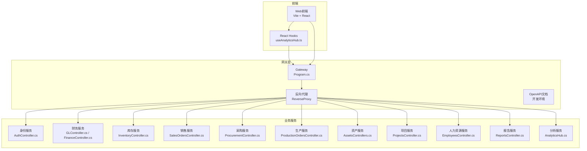
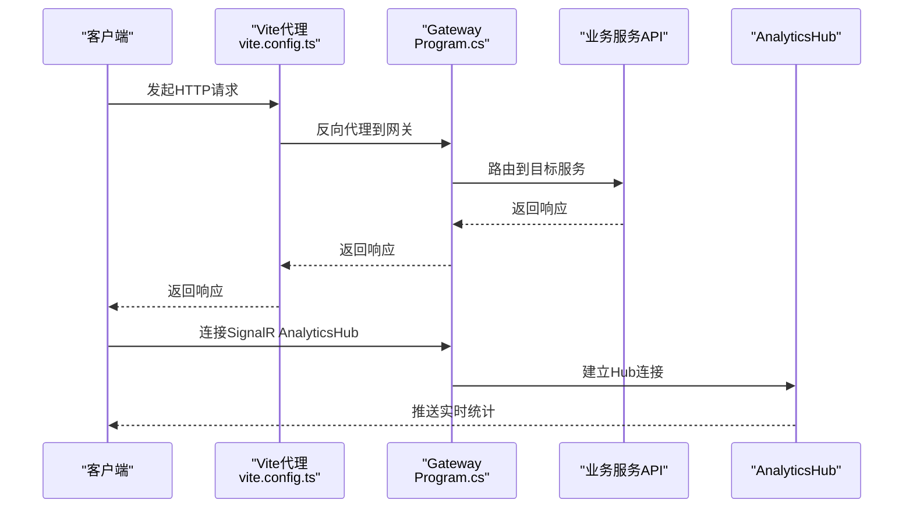
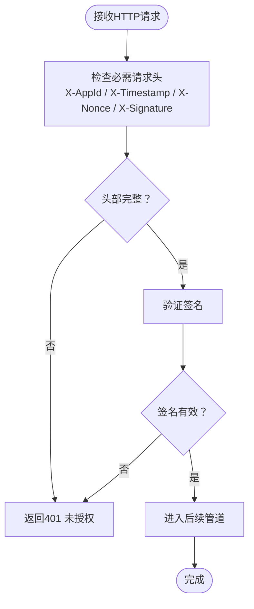
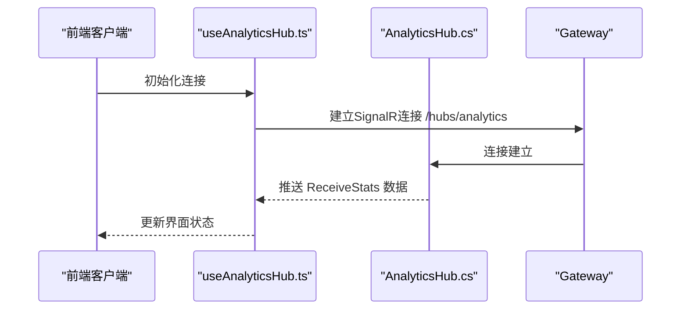
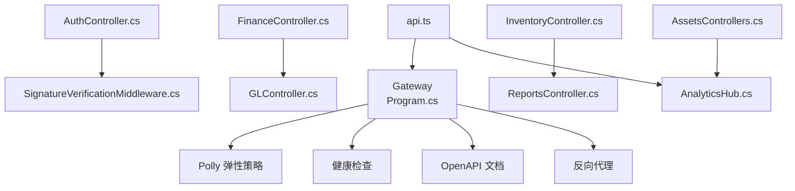

# API参考文档

<cite>
**本文档引用的文件**
- [Program.cs](file://src/Gateways/ErpSystem.Gateway/Program.cs)
- [ErpSystem.Gateway.http](file://src/Gateways/ErpSystem.Gateway/ErpSystem.Gateway.http)
- [AuthController.cs](file://src\Services\Identity\ErpSystem.Identity\API\AuthController.cs)
- [SignatureVerificationMiddleware.cs](file://src\BuildingBlocks\ErpSystem.BuildingBlocks\Auth\SignatureVerificationMiddleware.cs)
- [AuthExtensions.cs](file://src\BuildingBlocks\ErpSystem.BuildingBlocks\Auth\AuthExtensions.cs)
- [MasterControllers.cs](file://src\Services\MasterData\ErpSystem.MasterData\Controllers\MasterControllers.cs)
- [InventoryController.cs](file://src\Services\Inventory\ErpSystem.Inventory\API\InventoryController.cs)
- [SalesOrdersController.cs](file://src\Services\Sales\ErpSystem.Sales\API\SalesOrdersController.cs)
- [ProcurementController.cs](file://src\Services\Procurement\ErpSystem.Procurement\API\ProcurementController.cs)
- [ProductionOrdersController.cs](file://src\Services\Production\ErpSystem.Production\API\ProductionOrdersController.cs)
- [AssetsControllers.cs](file://src\Services\Assets\ErpSystem.Assets\API\AssetsControllers.cs)
- [ProjectsController.cs](file://src\Services\Projects\ErpSystem.Projects\API\ProjectsController.cs)
- [EmployeesController.cs](file://src\Services\HR\ErpSystem.HR\API\EmployeesController.cs)
- [GLController.cs](file://src\Services\Finance\ErpSystem.Finance\API\GLController.cs)
- [FinanceController.cs](file://src\Services\Finance\ErpSystem.Finance\Controllers\FinanceController.cs)
- [ReportsController.cs](file://src\Services\Reporting\ErpSystem.Reporting\Controllers\ReportsController.cs)
- [Middlewares.cs](file://src\BuildingBlocks\ErpSystem.BuildingBlocks\Middleware\Middlewares.cs)
- [AnalyticsHub.cs](file://src\Services\Analytics\ErpSystem.Analytics\API\Hubs\AnalyticsHub.cs)
- [useAnalyticsHub.ts](file://src\Web\ErpSystem.Web\src\hooks\useAnalyticsHub.ts)
- [vite.config.ts](file://src\Web\ErpSystem.Web\vite.config.ts)
- [api.ts](file://src\Web\ErpSystem.Web\src\services\api.ts)
</cite>

## 目录
1. [简介](#简介)
2. [项目结构](#项目结构)
3. [核心组件](#核心组件)
4. [架构概览](#架构概览)
5. [详细组件分析](#详细组件分析)
6. [依赖关系分析](#依赖关系分析)
7. [性能考虑](#性能考虑)
8. [故障排除指南](#故障排除指南)
9. [结论](#结论)
10. [附录](#附录)

## 简介
本文件为ERP微服务系统的API参考文档，涵盖所有REST API端点与WebSocket实时通信接口。文档包含：
- REST API：HTTP方法、URL模式、请求/响应模式、认证方式
- WebSocket API：SignalR AnalyticsHub连接、消息格式、事件类型与实时交互模式
- 协议特定示例、错误处理策略、安全考虑、速率限制与版本信息
- 常见用例、客户端实现指南与性能优化技巧
- 调试工具与监控方法，以及已弃用功能的迁移指南与向后兼容性说明

## 项目结构
系统采用多服务微架构，通过网关统一暴露REST API与WebSocket端点，各业务域服务（财务、库存、销售、采购、生产、资产、项目、人力资源等）提供领域能力。

**图表来源**
- [Program.cs](file://src/Gateways\ErpSystem.Gateway/Program.cs#L1-L108)
- [AuthController.cs](file://src\Services\Identity\ErpSystem.Identity\API\AuthController.cs#L1-L39)
- [GLController.cs](file://src\Services\Finance\ErpSystem.Finance\API\GLController.cs#L1-L120)
- [AnalyticsHub.cs](file://src\Services\Analytics\ErpSystem.Analytics\API\Hubs\AnalyticsHub.cs#L1-L13)

**章节来源**
- [Program.cs](file://src/Gateways\ErpSystem.Gateway/Program.cs#L1-L108)

## 核心组件
- 网关与反向代理：统一入口、健康检查、OpenAPI文档映射、CORS、重试/熔断/超时策略、速率限制
- 中间件：请求日志、相关ID追踪、全局异常处理
- 认证与签名验证：基于应用标识的签名验证中间件与扩展
- 业务服务API：按模块划分的REST控制器与查询/命令处理
- 实时通信：SignalR AnalyticsHub用于推送分析统计

**章节来源**
- [Program.cs](file://src/Gateways\ErpSystem.Gateway/Program.cs#L12-L65)
- [Middlewares.cs](file://src\BuildingBlocks\ErpSystem.BuildingBlocks\Middleware\Middlewares.cs#L1-L149)
- [SignatureVerificationMiddleware.cs](file://src\BuildingBlocks\ErpSystem.BuildingBlocks\Auth\SignatureVerificationMiddleware.cs#L1-L36)
- [AnalyticsHub.cs](file://src\Services\Analytics\ErpSystem.Analytics\API\Hubs\AnalyticsHub.cs#L1-L13)

## 架构概览
系统通过网关聚合多个微服务，使用Polly实现企业级弹性策略，启用CORS与健康检查；前端通过Axios与Vite代理访问网关，实时数据通过SignalR AnalyticsHub订阅。

**图表来源**
- [vite.config.ts](file://src\Web\ErpSystem.Web\vite.config.ts#L1-L22)
- [Program.cs](file://src/Gateways\ErpSystem.Gateway/Program.cs#L23-L25)
- [AnalyticsHub.cs](file://src\Services\Analytics\ErpSystem.Analytics\API\Hubs\AnalyticsHub.cs#L1-L13)

## 详细组件分析

### 网关与基础设施
- OpenAPI：开发环境下映射OpenAPI文档
- CORS：默认允许任意来源/头/方法
- 反向代理：从配置加载路由规则
- 弹性策略（Polly）：重试（指数退避+抖动）、熔断器（失败率阈值）、超时
- 速率限制：统一拒绝码429
- 健康检查：/health端点
- 全局异常处理：中间件捕获并标准化错误响应

**章节来源**
- [Program.cs](file://src/Gateways\ErpSystem.Gateway/Program.cs#L12-L67)
- [Middlewares.cs](file://src\BuildingBlocks\ErpSystem.BuildingBlocks\Middleware\Middlewares.cs#L88-L149)

### 认证与安全
- 应用级签名验证中间件：要求请求头包含应用标识、时间戳、随机数与签名，未满足条件返回401
- 中间件注册：通过扩展方法在应用构建器中启用
- 前端Axios拦截器：统一错误处理与日志输出

**图表来源**
- [SignatureVerificationMiddleware.cs](file://src\BuildingBlocks\ErpSystem.BuildingBlocks\Auth\SignatureVerificationMiddleware.cs#L27-L36)

**章节来源**
- [SignatureVerificationMiddleware.cs](file://src\BuildingBlocks\ErpSystem.BuildingBlocks\Auth\SignatureVerificationMiddleware.cs#L1-L36)
- [AuthExtensions.cs](file://src\BuildingBlocks\ErpSystem.BuildingBlocks\Auth\AuthExtensions.cs#L1-L19)
- [api.ts](file://src\Web\ErpSystem.Web\src\services\api.ts#L1-L29)

### 身份服务 API
- 版本：v1
- 基础路径：/api/v1/identity/auth
- 端点：
  - POST /register：注册用户
  - POST /login：登录并返回令牌
- 认证：应用签名验证中间件
- 错误处理：登录失败返回401

**章节来源**
- [AuthController.cs](file://src\Services\Identity\ErpSystem.Identity\API\AuthController.cs#L1-L39)

### 主数据服务 API
- 版本：v1
- 基础路径：/api/v1/Materials 与 /api/v1/Partners
- 端点：
  - Materials：
    - POST /：创建物料
    - GET /：获取全部物料（读模型）
    - GET /{id}：按ID获取物料
    - PUT /{id}/info：更新物料基本信息
    - PUT /{id}/attributes：更新物料属性
  - Partners：
    - POST /suppliers：创建供应商
    - PUT /suppliers/{id}/profile：更新供应商资料
    - POST /customers：创建客户
    - GET /suppliers：获取供应商列表
    - GET /customers：获取客户列表

**章节来源**
- [MasterControllers.cs](file://src\Services\MasterData\ErpSystem.MasterData\Controllers\MasterControllers.cs#L1-L97)

### 库存服务 API
- 版本：v1
- 基础路径：/api/v1/inventory
- 端点：
  - GET /items：搜索库存项（支持仓库、储位、物料编码分页查询）
  - GET /available：查询可用库存
  - POST /receive：收货入账
  - POST /transfer：库内调拨
  - POST /issue：发料出库
  - POST /reservations：创建预留
  - POST /reservations/release：释放预留
  - POST /adjust：盘点调整
  - GET /items/{id}/transactions：查询交易明细（分页）

**章节来源**
- [InventoryController.cs](file://src\Services\Inventory\ErpSystem.Inventory\API\InventoryController.cs#L1-L48)

### 销售服务 API
- 版本：v1
- 基础路径：/api/v1/sales/orders
- 端点：
  - POST /：创建销售订单
  - GET /{id}：按ID获取订单
  - GET /：搜索订单（支持客户ID、状态、分页）
  - POST /{id}/confirm：确认订单（指定仓库）
  - POST /{id}/cancel：取消订单（传取消原因）
  - GET /{id}/billable-lines：获取可计费行
- 配套端点（装运）：/api/v1/sales/shipments
  - POST /：创建装运单

**章节来源**
- [SalesOrdersController.cs](file://src\Services\Sales\ErpSystem.Sales\API\SalesOrdersController.cs#L1-L53)

### 采购服务 API
- 版本：v1
- 基础路径：/api/v1/procurement/purchase-orders
- 端点：
  - POST /：创建采购订单
  - GET /：搜索订单（支持供应商ID、状态、分页）
  - GET /{id}：按ID获取订单
  - POST /{id}/submit：提交审批
  - POST /{id}/approve：批准（传批准人与评论）
  - POST /{id}/send：发送（传发送人与方式）
  - POST /{id}/close：关闭（传关闭原因）
  - POST /{id}/cancel：取消（传取消原因）
  - GET /prices：查询物料价格历史（支持物料ID与供应商ID）
- 配套端点（收货）：/api/v1/procurement/receipts
  - POST /：记录收货

**章节来源**
- [ProcurementController.cs](file://src\Services\Procurement\ErpSystem.Procurement\API\ProcurementController.cs#L1-L68)

### 生产服务 API
- 版本：v1
- 基础路径：/api/v1/production/orders
- 端点：
  - POST /：创建生产工单
  - GET /{id}：按ID获取工单
  - GET /：搜索工单（支持物料ID、状态、分页）
  - POST /{id}/release：下达工单
  - POST /{id}/consume：投料（校验订单ID）
  - POST /{id}/report：报工（校验订单ID）
  - GET /wip：查询在制品（支持物料ID）

**章节来源**
- [ProductionOrdersController.cs](file://src\Services\Production\ErpSystem.Production\API\ProductionOrdersController.cs#L1-L50)

### 财务服务 API
- 版本：v1
- 基础路径：/api/v1/finance
- 端点：
  - POST /invoices：创建发票
  - POST /payments：登记收款/付款
  - GET /invoices：分页查询发票
  - GET /invoices/{id}：按ID查询发票
  - GET /payments：分页查询付款
- 配套端点（总账/GL）：/api/v1/finance/gl
  - POST /journal-entries：过账凭证
  - GET /journal-entries/{id}：查询凭证详情
  - GET /reports/trial-balance：试算平衡表
  - POST /periods：定义会计期间
  - POST /periods/{id}/close：关闭会计期间

**章节来源**
- [FinanceController.cs](file://src\Services\Finance\ErpSystem.Finance\Controllers\FinanceController.cs#L1-L38)
- [GLController.cs](file://src\Services\Finance\ErpSystem.Finance\API\GLController.cs#L42-L82)

### 报告服务 API
- 版本：[控制器注解显示为api/[controller]，建议遵循服务版本规范]
- 基础路径：/api/Reports
- 端点：
  - GET /financial-summary：财务汇总报表（支持起止日期）
  - GET /inventory-valuation：库存估值报表
  - GET /sales-by-customer：客户销售报表

**章节来源**
- [ReportsController.cs](file://src\Services\Reporting\ErpSystem.Reporting\Controllers\ReportsController.cs#L1-L44)

### 资产服务 API
- 版本：v1
- 基础路径：/api/v1/assets
- 端点：
  - GET /：查询资产（支持类型、状态、地点过滤）
  - GET /{id}：按ID查询资产
  - POST /：注册资产（生成资产编号）
  - POST /{id}/activate：激活资产
  - POST /{id}/transfer：资产转移
  - POST /{id}/maintenance：记录维护
  - POST /{id}/depreciate：计算折旧
  - POST /{id}/dispose：处置资产
  - GET /statistics：资产统计
- 维护子资源：/api/v1/assets/maintenance
  - GET /：查询维护记录（支持资产ID、类型、日期范围）
  - GET /schedule：维护计划统计
- 折旧子资源：/api/v1/assets/depreciation
  - GET /：查询折旧记录（支持资产ID、年、月）
  - GET /summary/{year}：年度折旧汇总
  - POST /run-batch：批量折旧调度

**章节来源**
- [AssetsControllers.cs](file://src\Services\Assets\ErpSystem.Assets\API\AssetsControllers.cs#L1-L263)

### 项目服务 API
- 版本：v1
- 基础路径：/api/v1/projects/projects
- 端点：
  - GET /：查询项目（支持状态、类型、项目经理过滤）
  - GET /{id}：按ID查询项目
  - POST /：创建项目（生成项目编号）
  - POST /{id}/status：变更项目状态
  - POST /{id}/tasks：添加任务
  - POST /{id}/milestones：添加里程碑
  - POST /{id}/team-members：添加团队成员
  - GET /statistics：项目统计

**章节来源**
- [ProjectsController.cs](file://src\Services\Projects\ErpSystem.Projects\API\ProjectsController.cs#L1-L172)

### 人力资源服务 API
- 版本：v1
- 基础路径：/api/v1/hr/employees
- 端点：
  - POST /：雇佣员工
  - GET /{id}：按ID查询员工
  - GET /：搜索员工（支持全名、部门、状态、分页）
  - POST /{id}/transfer：员工调岗
  - POST /{id}/promote：员工晋升
  - POST /{id}/terminate：员工离职
  - GET /{id}/events：查询员工事件

**章节来源**
- [EmployeesController.cs](file://src\Services\HR\ErpSystem.HR\API\EmployeesController.cs#L1-L52)

### 实时通信 API（SignalR）
- Hub：AnalyticsHub
- URL：/hubs/analytics
- 客户端集成：React Hook useAnalyticsHub.ts
  - 自动重连、日志级别配置
  - 接收事件 ReceiveStats 并更新本地状态
- 开发代理：vite.config.ts 将 /hubs 代理到网关，启用WebSocket

**图表来源**
- [useAnalyticsHub.ts](file://src\Web\ErpSystem.Web\src\hooks\useAnalyticsHub.ts#L1-L50)
- [AnalyticsHub.cs](file://src\Services\Analytics\ErpSystem.Analytics\API\Hubs\AnalyticsHub.cs#L1-L13)
- [vite.config.ts](file://src\Web\ErpSystem.Web\vite.config.ts#L14-L19)

**章节来源**
- [AnalyticsHub.cs](file://src\Services\Analytics\ErpSystem.Analytics\API\Hubs\AnalyticsHub.cs#L1-L13)
- [useAnalyticsHub.ts](file://src\Web\ErpSystem.Web\src\hooks\useAnalyticsHub.ts#L1-L50)
- [vite.config.ts](file://src\Web\ErpSystem.Web\vite.config.ts#L1-L22)

## 依赖关系分析

**图表来源**
- [Program.cs](file://src/Gateways\ErpSystem.Gateway/Program.cs#L32-L59)
- [AuthController.cs](file://src\Services\Identity\ErpSystem.Identity\API\AuthController.cs#L1-L39)
- [SignatureVerificationMiddleware.cs](file://src\BuildingBlocks\ErpSystem.BuildingBlocks\Auth\SignatureVerificationMiddleware.cs#L1-L36)
- [FinanceController.cs](file://src\Services\Finance\ErpSystem.Finance\Controllers\FinanceController.cs#L1-L38)
- [GLController.cs](file://src\Services\Finance\ErpSystem.Finance\API\GLController.cs#L42-L82)
- [ReportsController.cs](file://src\Services\Reporting\ErpSystem.Reporting\Controllers\ReportsController.cs#L1-L44)
- [AnalyticsHub.cs](file://src\Services\Analytics\ErpSystem.Analytics\API\Hubs\AnalyticsHub.cs#L1-L13)
- [api.ts](file://src\Web\ErpSystem.Web\src\services\api.ts#L1-L29)

**章节来源**
- [Program.cs](file://src/Gateways\ErpSystem.Gateway/Program.cs#L12-L67)
- [Middlewares.cs](file://src\BuildingBlocks\ErpSystem.BuildingBlocks\Middleware\Middlewares.cs#L1-L149)

## 性能考虑
- 网关弹性策略：重试（指数退避+抖动）、熔断器（失败率阈值）、超时，降低下游故障影响
- 速率限制：统一429响应，防止后端过载
- 前端代理：Vite代理简化跨域与本地开发体验
- 实时通信：SignalR自动重连减少断线影响
- 建议：
  - 对高频查询使用分页参数
  - 合理设置查询过滤条件以减少数据量
  - 使用缓存与投影模型优化读取性能
  - 在网关层实施细粒度限流与配额管理

**章节来源**
- [Program.cs](file://src/Gateways\ErpSystem.Gateway/Program.cs#L32-L59)
- [vite.config.ts](file://src\Web\ErpSystem.Web\vite.config.ts#L8-L20)

## 故障排除指南
- 401 未授权：检查请求头是否包含 X-AppId、X-Timestamp、X-Nonce、X-Signature
- 403 禁止访问：权限不足或访问被拒绝
- 404 未找到：资源不存在或ID错误
- 500 内部错误：未处理异常，查看日志
- 请求日志：中间件记录请求开始/完成与耗时，便于定位问题
- 健康检查：访问 /health 检查服务可用性
- 前端错误拦截：Axios拦截器统一输出错误信息

**章节来源**
- [Middlewares.cs](file://src\BuildingBlocks\ErpSystem.BuildingBlocks\Middleware\Middlewares.cs#L88-L149)
- [Program.cs](file://src/Gateways\ErpSystem.Gateway/Program.cs#L67-L81)
- [api.ts](file://src\Web\ErpSystem.Web\src\services\api.ts#L13-L20)

## 结论
本API参考文档梳理了ERP微服务系统的REST与WebSocket接口，明确了认证机制、错误处理策略、性能优化与监控方法。建议在生产环境中结合服务发现、更严格的鉴权与限流策略进一步完善。

## 附录

### 协议特定示例与最佳实践
- REST API示例：使用网关地址访问，如 /api/v1/identity/auth/login
- WebSocket示例：前端通过 /hubs/analytics 订阅实时统计
- 版本控制：当前多数服务使用 v1 路径前缀，建议统一遵循

**章节来源**
- [ErpSystem.Gateway.http](file://src/Gateways\ErpSystem.Gateway\ErpSystem.Gateway.http#L1-L7)
- [vite.config.ts](file://src\Web\ErpSystem.Web\vite.config.ts#L14-L19)

### 已弃用功能与迁移指南
- 当前代码库未发现明确标记的弃用API
- 建议在升级时：
  - 明确版本号与兼容性策略
  - 提供迁移脚本与兼容层
  - 逐步替换旧端点并发布新版本

### 安全与合规
- 应用签名验证：确保请求完整性与来源可信
- CORS：默认宽松策略，生产需收紧来源白名单
- HTTPS：生产环境强制HTTPS传输

**章节来源**
- [SignatureVerificationMiddleware.cs](file://src\BuildingBlocks\ErpSystem.BuildingBlocks\Auth\SignatureVerificationMiddleware.cs#L27-L36)
- [Program.cs](file://src/Gateways\ErpSystem.Gateway/Program.cs#L13-L21)