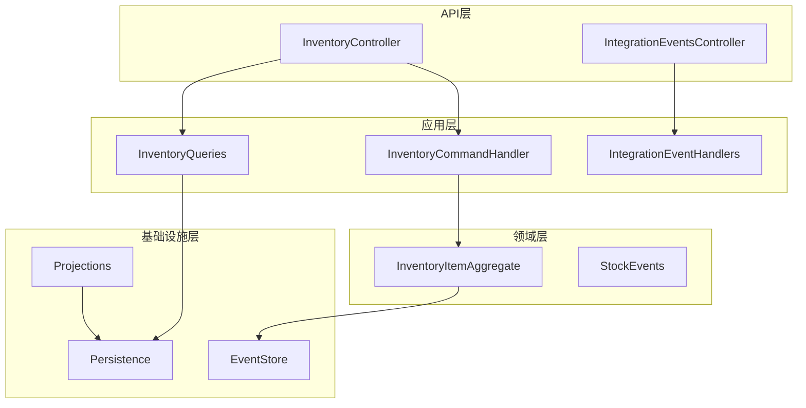
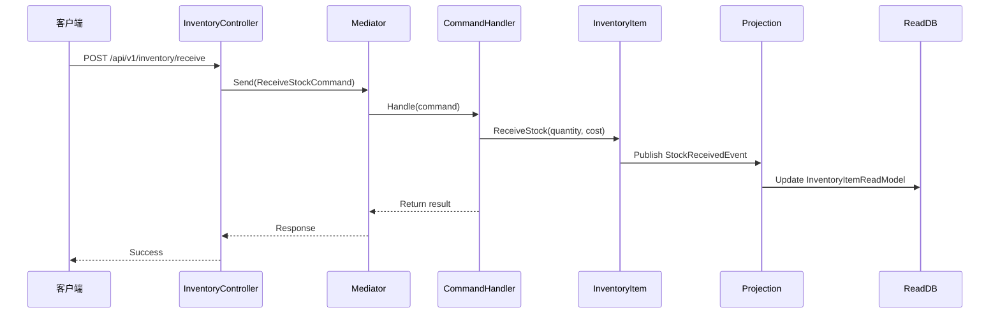
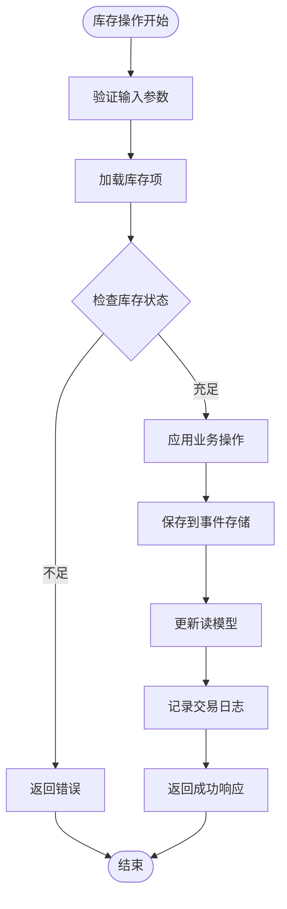
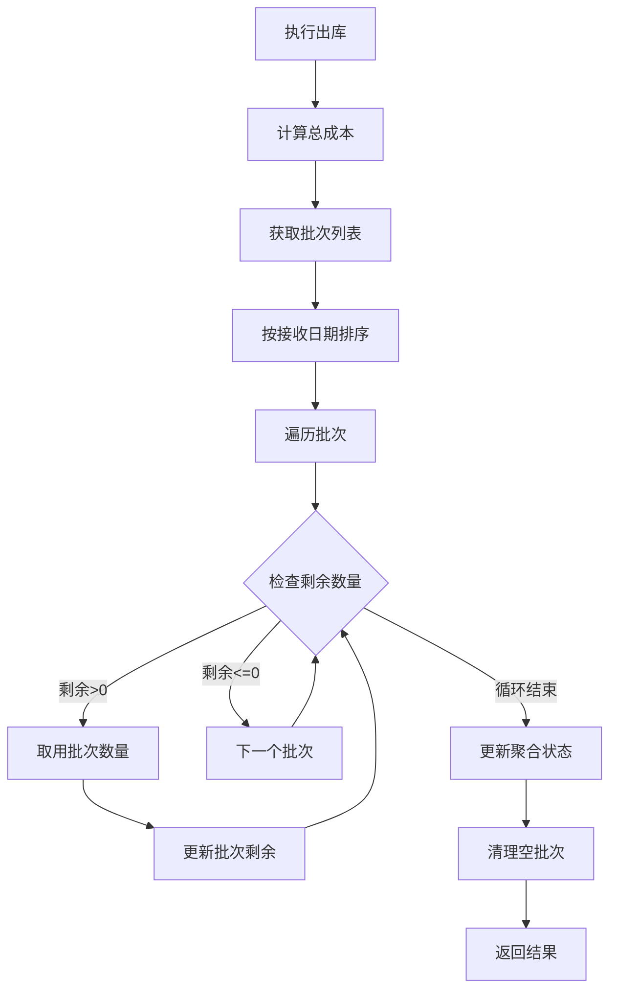
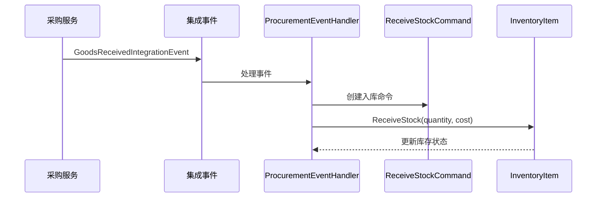
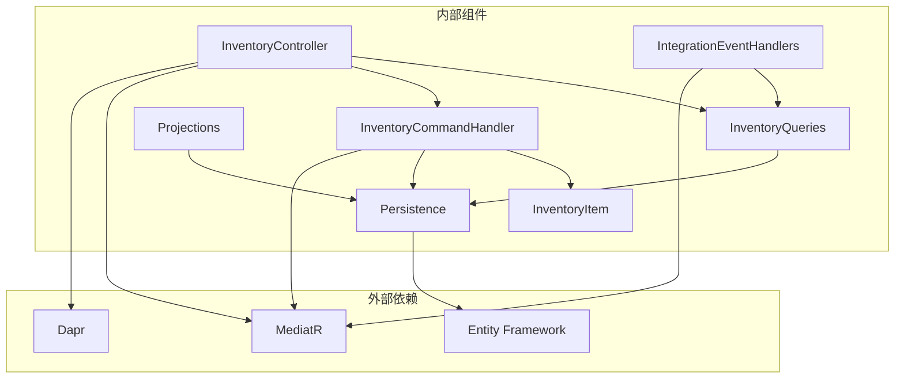
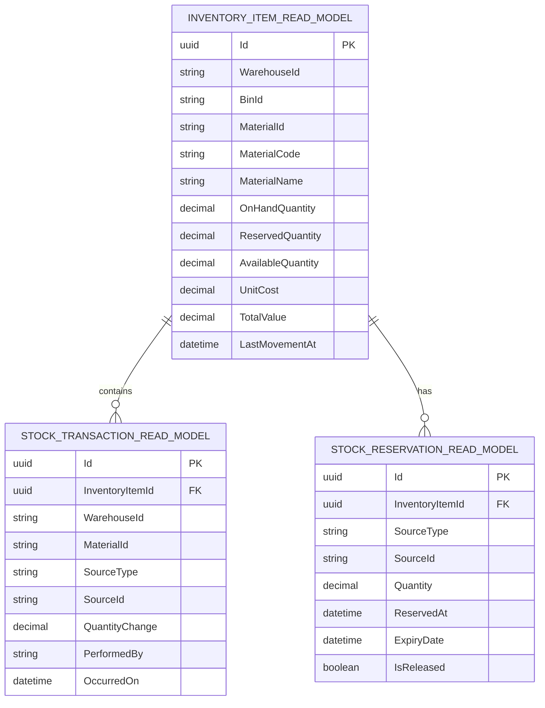

# 库存管理服务API

<cite>
**本文档引用的文件**
- [InventoryController.cs](file://src/Services/Inventory/ErpSystem.Inventory/API/InventoryController.cs)
- [IntegrationEventsController.cs](file://src/Services/Inventory/ErpSystem.Inventory/API/IntegrationEventsController.cs)
- [InventoryCommands.cs](file://src/Services/Inventory/ErpSystem.Inventory/Application/InventoryCommands.cs)
- [InventoryQueries.cs](file://src/Services/Inventory/ErpSystem.Inventory/Application/InventoryQueries.cs)
- [IntegrationEventHandlers.cs](file://src/Services/Inventory/ErpSystem.Inventory/Application/IntegrationEventHandlers.cs)
- [InventoryItemAggregate.cs](file://src/Services/Inventory/ErpSystem.Inventory/Domain/InventoryItemAggregate.cs)
- [Persistence.cs](file://src/Services/Inventory/ErpSystem.Inventory/Infrastructure/Persistence.cs)
- [Projections.cs](file://src/Services/Inventory/ErpSystem.Inventory/Infrastructure/Projections.cs)
- [PRD-05-Inventory-Service.md](file://docs/PRD-05-Inventory-Service.md)
- [inventory.yaml](file://deploy/k8s/services/inventory.yaml)
- [Dockerfile](file://Dockerfile)
- [appsettings.json](file://src/Services/Inventory/ErpSystem.Inventory/appsettings.json)
</cite>

## 目录
1. [简介](#简介)
2. [项目结构](#项目结构)
3. [核心组件](#核心组件)
4. [架构概览](#架构概览)
5. [详细组件分析](#详细组件分析)
6. [依赖关系分析](#依赖关系分析)
7. [性能考虑](#性能考虑)
8. [故障排除指南](#故障排除指南)
9. [结论](#结论)

## 简介

库存管理服务是ERP微服务架构中的核心服务之一，负责管理企业所有物料在各个仓库、库位上的实物数量。该服务采用事件驱动架构和CQRS模式，提供实时、准确、可追溯的库存信息。

### 主要功能特性
- **多仓库管理**：支持跨仓库的库存查询和转移
- **批次管理**：基于FIFO算法的批次追踪和成本核算
- **库存调整**：支持盘点差异调整和手动库存修改
- **预留管理**：支持销售订单和生产订单的库存预留
- **实时库存更新**：通过事件驱动实现库存状态的实时同步
- **库存事务追踪**：完整的库存变动历史记录

## 项目结构

库存管理服务采用清晰的分层架构，包含API层、应用层、领域层、基础设施层：

**图表来源**
- [InventoryController.cs](file://src/Services/Inventory/ErpSystem.Inventory/API/InventoryController.cs#L1-L44)
- [IntegrationEventsController.cs](file://src/Services/Inventory/ErpSystem.Inventory/API/IntegrationEventsController.cs#L1-L50)
- [InventoryCommands.cs](file://src/Services/Inventory/ErpSystem.Inventory/Application/InventoryCommands.cs#L1-L142)
- [InventoryQueries.cs](file://src/Services/Inventory/ErpSystem.Inventory/Application/InventoryQueries.cs#L1-L50)

**章节来源**
- [InventoryController.cs](file://src/Services/Inventory/ErpSystem.Inventory/API/InventoryController.cs#L1-L44)
- [IntegrationEventsController.cs](file://src/Services/Inventory/ErpSystem.Inventory/API/IntegrationEventsController.cs#L1-L50)

## 核心组件

### API控制器
库存服务提供两个主要的API控制器：
- **InventoryController**：面向业务用户的REST API接口
- **IntegrationEventsController**：面向其他服务的集成事件接口

### 应用程序组件
- **命令处理**：处理库存操作的业务逻辑
- **查询处理**：提供库存信息查询功能
- **集成事件处理器**：处理来自其他服务的集成事件

### 领域模型
- **InventoryItem**：库存聚合根，管理库存状态和业务规则
- **StockBatch**：库存批次，支持FIFO成本核算
- **各种领域事件**：记录库存状态变更的历史

**章节来源**
- [InventoryCommands.cs](file://src/Services/Inventory/ErpSystem.Inventory/Application/InventoryCommands.cs#L1-L142)
- [InventoryQueries.cs](file://src/Services/Inventory/ErpSystem.Inventory/Application/InventoryQueries.cs#L1-L50)
- [InventoryItemAggregate.cs](file://src/Services/Inventory/ErpSystem.Inventory/Domain/InventoryItemAggregate.cs#L1-L255)

## 架构概览

库存管理服务采用事件驱动架构，实现了以下关键特性：

**图表来源**
- [InventoryController.cs](file://src/Services/Inventory/ErpSystem.Inventory/API/InventoryController.cs#L21-L22)
- [InventoryCommands.cs](file://src/Services/Inventory/ErpSystem.Inventory/Application/InventoryCommands.cs#L68-L89)
- [Projections.cs](file://src/Services/Inventory/ErpSystem.Inventory/Infrastructure/Projections.cs#L39-L81)

### 数据流架构

**图表来源**
- [InventoryItemAggregate.cs](file://src/Services/Inventory/ErpSystem.Inventory/Domain/InventoryItemAggregate.cs#L116-L171)
- [Projections.cs](file://src/Services/Inventory/ErpSystem.Inventory/Infrastructure/Projections.cs#L83-L118)

## 详细组件分析

### REST API端点定义

#### 库存查询接口

**1. 库存搜索查询**
- **HTTP方法**: GET
- **URL模式**: `/api/v1/inventory/items`
- **查询参数**:
  - `warehouseId`: 仓库ID (可选)
  - `binId`: 库位ID (可选)
  - `materialCode`: 物料编码 (可选)
  - `page`: 页码，默认1 (可选)
- **响应**: 库存项目列表

**2. 可用库存查询**
- **HTTP方法**: GET
- **URL模式**: `/api/v1/inventory/available`
- **查询参数**:
  - `warehouseId`: 仓库ID (必需)
  - `binId`: 库位ID (必需)
  - `materialId`: 物料ID (必需)
- **响应**: 库存项目详情 (OnHand, Reserved, Available)

**3. 交易历史查询**
- **HTTP方法**: GET
- **URL模式**: `/api/v1/inventory/items/{id}/transactions`
- **路径参数**:
  - `id`: 库存项目ID (必需)
- **查询参数**:
  - `page`: 页码，默认1 (可选)
- **响应**: 交易记录列表

**章节来源**
- [InventoryController.cs](file://src/Services/Inventory/ErpSystem.Inventory/API/InventoryController.cs#L11-L19)
- [InventoryQueries.cs](file://src/Services/Inventory/ErpSystem.Inventory/Application/InventoryQueries.cs#L7-L11)

#### 库存操作接口

**4. 入库操作**
- **HTTP方法**: POST
- **URL模式**: `/api/v1/inventory/receive`
- **请求体**: ReceiveStockCommand
- **响应**: 库存项目ID

**5. 出库操作**
- **HTTP方法**: POST
- **URL模式**: `/api/v1/inventory/issue`
- **请求体**: IssueStockCommand
- **响应**: 操作结果 (布尔值)

**6. 库存转移**
- **HTTP方法**: POST
- **URL模式**: `/api/v1/inventory/transfer`
- **请求体**: TransferStockCommand
- **响应**: 操作结果 (布尔值)

**7. 库存调整**
- **HTTP方法**: POST
- **URL模式**: `/api/v1/inventory/adjust`
- **请求体**: AdjustStockCommand
- **响应**: 操作结果 (布尔值)

**章节来源**
- [InventoryController.cs](file://src/Services/Inventory/ErpSystem.Inventory/API/InventoryController.cs#L21-L37)
- [InventoryCommands.cs](file://src/Services/Inventory/ErpSystem.Inventory/Application/InventoryCommands.cs#L9-L58)

#### 库存预留接口

**8. 库存预留**
- **HTTP方法**: POST
- **URL模式**: `/api/v1/inventory/reservations`
- **请求体**: ReserveStockCommand
- **响应**: 预留ID

**9. 预留释放**
- **HTTP方法**: POST
- **URL模式**: `/api/v1/inventory/reservations/release`
- **请求体**: ReleaseReservationCommand
- **响应**: 操作结果 (布尔值)

**章节来源**
- [InventoryController.cs](file://src/Services/Inventory/ErpSystem.Inventory/API/InventoryController.cs#L30-L34)
- [InventoryCommands.cs](file://src/Services/Inventory/ErpSystem.Inventory/Application/InventoryCommands.cs#L38-L51)

### 库存算法详解

#### FIFO批次管理算法

库存服务实现了基于先进先出(FIFO)原则的批次管理算法：

**图表来源**
- [InventoryItemAggregate.cs](file://src/Services/Inventory/ErpSystem.Inventory/Domain/InventoryItemAggregate.cs#L136-L171)
- [InventoryItemAggregate.cs](file://src/Services/Inventory/ErpSystem.Inventory/Domain/InventoryItemAggregate.cs#L218-L232)

#### 库存状态计算

库存聚合根维护以下关键状态：
- **OnHandQuantity**: 实物在库数量
- **ReservedQuantity**: 已预留数量
- **AvailableQuantity**: 可用数量 = OnHand - Reserved
- **TotalValue**: 库存总价值

**章节来源**
- [InventoryItemAggregate.cs](file://src/Services/Inventory/ErpSystem.Inventory/Domain/InventoryItemAggregate.cs#L96-L104)

### 集成事件处理

#### 采购集成事件

**图表来源**
- [IntegrationEventsController.cs](file://src/Services/Inventory/ErpSystem.Inventory/API/IntegrationEventsController.cs#L10-L16)
- [IntegrationEventHandlers.cs](file://src/Services/Inventory/ErpSystem.Inventory/Application/IntegrationEventHandlers.cs#L14-L32)

**章节来源**
- [IntegrationEventsController.cs](file://src/Services/Inventory/ErpSystem.Inventory/API/IntegrationEventsController.cs#L1-L50)
- [IntegrationEventHandlers.cs](file://src/Services/Inventory/ErpSystem.Inventory/Application/IntegrationEventHandlers.cs#L1-L112)

## 依赖关系分析

### 组件依赖图

**图表来源**
- [Persistence.cs](file://src/Services/Inventory/ErpSystem.Inventory/Infrastructure/Persistence.cs#L1-L79)
- [Projections.cs](file://src/Services/Inventory/ErpSystem.Inventory/Infrastructure/Projections.cs#L1-L211)

### 数据持久化架构

库存服务使用CQRS模式分离读写操作：

**图表来源**
- [Persistence.cs](file://src/Services/Inventory/ErpSystem.Inventory/Infrastructure/Persistence.cs#L39-L79)

**章节来源**
- [Persistence.cs](file://src/Services/Inventory/ErpSystem.Inventory/Infrastructure/Persistence.cs#L1-L79)
- [Projections.cs](file://src/Services/Inventory/ErpSystem.Inventory/Infrastructure/Projections.cs#L1-L211)

## 性能考虑

### 查询优化策略

1. **索引优化**: 在仓库ID、库位ID、物料ID组合上建立唯一索引
2. **分页查询**: 默认每页20条记录，支持自定义页面大小
3. **投影查询**: 使用专用的读模型进行查询优化
4. **缓存策略**: 结合应用层缓存减少数据库访问

### 事件处理性能

1. **批量处理**: 集成事件处理器支持批量处理多个物料
2. **异步处理**: 使用异步模式处理事件，避免阻塞
3. **事件存储**: 使用高效的事件存储机制

## 故障排除指南

### 常见错误类型

1. **库存不足错误**: 当可用库存小于请求数量时抛出
2. **重复预留错误**: 当尝试预留不存在的库存时抛出
3. **事件处理失败**: 当事件处理过程中发生异常时的错误处理

### 调试建议

1. **启用详细日志**: 检查事件处理过程中的详细日志
2. **监控事件队列**: 监控集成事件的处理状态
3. **验证数据一致性**: 定期检查库存数据的一致性

**章节来源**
- [InventoryItemAggregate.cs](file://src/Services/Inventory/ErpSystem.Inventory/Domain/InventoryItemAggregate.cs#L118-L134)
- [IntegrationEventHandlers.cs](file://src/Services/Inventory/ErpSystem.Inventory/Application/IntegrationEventHandlers.cs#L16-L31)

## 结论

库存管理服务提供了完整的库存管理解决方案，具有以下优势：

1. **事件驱动架构**: 实现了松耦合的服务间通信
2. **实时库存更新**: 通过事件投影实现实时库存状态同步
3. **完整的审计跟踪**: 所有库存操作都有完整的日志记录
4. **灵活的扩展性**: 支持多仓库、多库位、多批次的扩展

该服务为整个ERP系统的库存管理提供了坚实的基础，支持采购、销售、生产等核心业务流程的顺畅运行。