# 报告服务API

<cite>
**本文档引用的文件**
- [ReportsController.cs](file://src/Services/Reporting/ErpSystem.Reporting/Controllers/ReportsController.cs)
- [DashboardController.cs](file://src/Services/Reporting/ErpSystem.Reporting/Controllers/DashboardController.cs)
- [ReportService.cs](file://src/Services/Reporting/ErpSystem.Reporting/Application/ReportService.cs)
- [DashboardService.cs](file://src/Services/Reporting/ErpSystem.Reporting/Application/DashboardService.cs)
- [Program.cs](file://src/Services/Reporting/ErpSystem.Reporting/Program.cs)
- [ErpSystem.Reporting.csproj](file://src/Services/Reporting/ErpSystem.Reporting/ErpSystem.Reporting.csproj)
- [appsettings.json](file://src/Services/Reporting/ErpSystem.Reporting/appsettings.json)
- [reporting.yaml](file://deploy/k8s/services/reporting.yaml)
- [ingress.yaml](file://deploy/helm/erp-system/templates/ingress.yaml)
- [BiAnalyticsService.cs](file://src/Services/Analytics/ErpSystem.Analytics/Infrastructure/BiAnalyticsService.cs)
- [DashboardsController.cs](file://src/Services/Analytics/ErpSystem.Analytics/API/DashboardsController.cs)
- [AnalyticsHub.cs](file://src/Services/Analytics/ErpSystem.Analytics/API/Hubs/AnalyticsHub.cs)
- [Dashboard.tsx](file://src/Web/ErpSystem.Web/src/pages/Dashboard.tsx)
</cite>

## 目录
1. [简介](#简介)
2. [项目结构](#项目结构)
3. [核心组件](#核心组件)
4. [架构概览](#架构概览)
5. [详细组件分析](#详细组件分析)
6. [API参考](#api参考)
7. [数据模型](#数据模型)
8. [集成与部署](#集成与部署)
9. [性能考虑](#性能考虑)
10. [故障排除指南](#故障排除指南)
11. [结论](#结论)

## 简介

报告服务是ERP系统中的核心模块，负责提供企业级报表生成、BI仪表板和数据可视化功能。该服务采用微服务架构设计，通过REST API提供多种类型的业务报表，包括财务报表、库存报表、销售报表等，并支持实时仪表板数据展示。

本服务基于.NET 10框架构建，使用CQRS模式分离读写操作，通过依赖注入管理服务生命周期，并集成了Swagger用于API文档生成。服务支持Dapr事件总线和SignalR实时通信，为现代企业应用提供完整的报表解决方案。

## 项目结构

报告服务采用清晰的分层架构，主要包含以下层次：

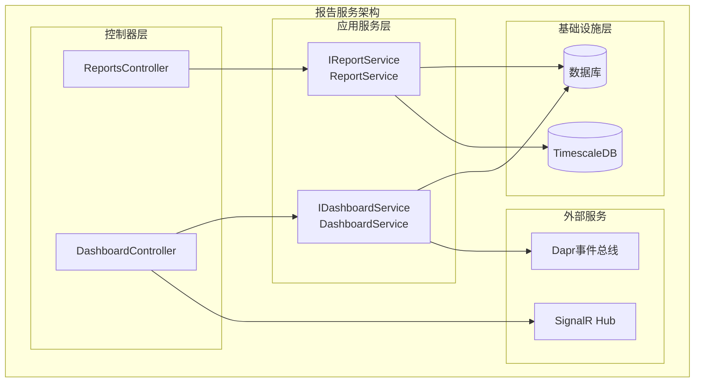

**图表来源**
- [ReportsController.cs](file://src/Services/Reporting/ErpSystem.Reporting/Controllers/ReportsController.cs#L1-L71)
- [DashboardController.cs](file://src/Services/Reporting/ErpSystem.Reporting/Controllers/DashboardController.cs#L1-L59)
- [ReportService.cs](file://src/Services/Reporting/ErpSystem.Reporting/Application/ReportService.cs#L1-L105)
- [DashboardService.cs](file://src/Services/Reporting/ErpSystem.Reporting/Application/DashboardService.cs#L1-L93)

**章节来源**
- [Program.cs](file://src/Services/Reporting/ErpSystem.Reporting/Program.cs#L1-L35)
- [ErpSystem.Reporting.csproj](file://src/Services/Reporting/ErpSystem.Reporting/ErpSystem.Reporting.csproj#L1-L19)

## 核心组件

报告服务的核心组件包括：

### 控制器层
- **ReportsController**: 处理所有报表相关的HTTP请求
- **DashboardController**: 提供BI仪表板数据接口

### 应用服务层
- **IReportService/ReportService**: 实现各类报表的业务逻辑
- **IDashboardService/DashboardService**: 提供仪表板数据聚合服务

### 数据传输对象(DTO)
服务定义了丰富的数据传输对象来封装不同类型的报表数据，确保API响应的一致性和可预测性。

**章节来源**
- [ReportsController.cs](file://src/Services/Reporting/ErpSystem.Reporting/Controllers/ReportsController.cs#L74-L136)
- [DashboardController.cs](file://src/Services/Reporting/ErpSystem.Reporting/Controllers/DashboardController.cs#L62-L79)

## 架构概览

报告服务采用现代化的微服务架构，结合了多种设计模式和技术栈：

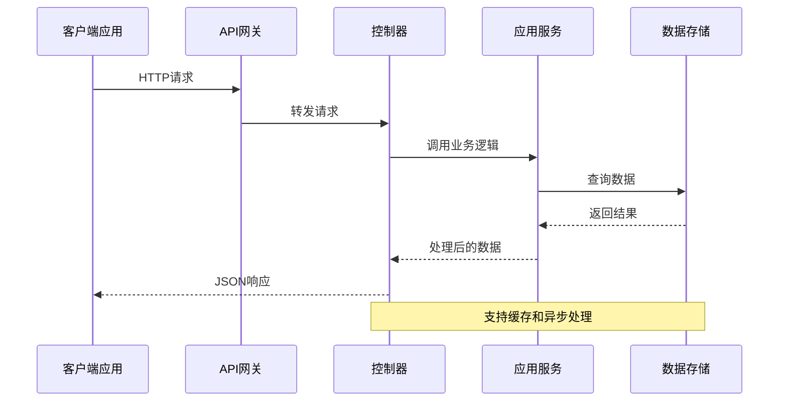

**图表来源**
- [Program.cs](file://src/Services/Reporting/ErpSystem.Reporting/Program.cs#L16-L18)
- [ReportService.cs](file://src/Services/Reporting/ErpSystem.Reporting/Application/ReportService.cs#L14-L104)

### 技术栈特性

- **CQRS模式**: 读写分离，提高查询性能
- **依赖注入**: 自动化服务生命周期管理
- **中间件管道**: 统一的请求处理流程
- **健康检查**: 容器化部署的必备功能
- **Swagger集成**: 自动生成API文档

## 详细组件分析

### 报表控制器分析

ReportsController提供了多个专门的报表接口，每个接口都针对特定的业务场景：

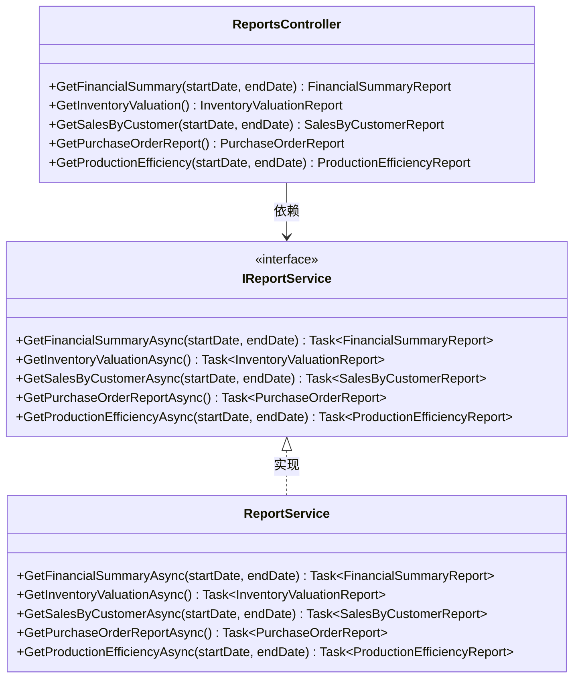

**图表来源**
- [ReportsController.cs](file://src/Services/Reporting/ErpSystem.Reporting/Controllers/ReportsController.cs#L8-L71)
- [ReportService.cs](file://src/Services/Reporting/ErpSystem.Reporting/Application/ReportService.cs#L5-L12)

### 仪表板控制器分析

DashboardController专注于提供实时的业务洞察数据：

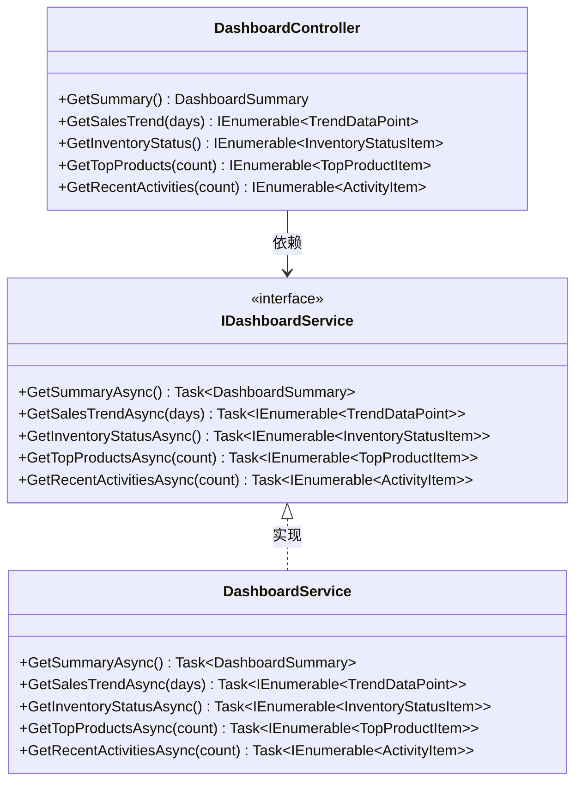

**图表来源**
- [DashboardController.cs](file://src/Services/Reporting/ErpSystem.Reporting/Controllers/DashboardController.cs#L8-L59)
- [DashboardService.cs](file://src/Services/Reporting/ErpSystem.Reporting/Application/DashboardService.cs#L5-L12)

**章节来源**
- [ReportsController.cs](file://src/Services/Reporting/ErpSystem.Reporting/Controllers/ReportsController.cs#L1-L71)
- [DashboardController.cs](file://src/Services/Reporting/ErpSystem.Reporting/Controllers/DashboardController.cs#L1-L59)

## API参考

### 报表API端点

#### 财务摘要报表
- **HTTP方法**: GET
- **URL模式**: `/api/reports/financial-summary`
- **查询参数**:
  - `startDate`: 开始日期 (可选)
  - `endDate`: 结束日期 (可选)
- **响应**: FinancialSummaryReport 对象

#### 库存估值报表
- **HTTP方法**: GET
- **URL模式**: `/api/reports/inventory-valuation`
- **查询参数**: 无
- **响应**: InventoryValuationReport 对象

#### 按客户销售报表
- **HTTP方法**: GET
- **URL模式**: `/api/reports/sales-by-customer`
- **查询参数**:
  - `startDate`: 开始日期 (可选)
  - `endDate`: 结束日期 (可选)
- **响应**: SalesByCustomerReport 对象

#### 采购订单状态报表
- **HTTP方法**: GET
- **URL模式**: `/api/reports/purchase-orders`
- **查询参数**: 无
- **响应**: PurchaseOrderReport 对象

#### 生产效率报表
- **HTTP方法**: GET
- **URL模式**: `/api/reports/production-efficiency`
- **查询参数**:
  - `startDate`: 开始日期 (可选)
  - `endDate`: 结束日期 (可选)
- **响应**: ProductionEfficiencyReport 对象

### 仪表板API端点

#### 仪表板摘要
- **HTTP方法**: GET
- **URL模式**: `/api/dashboard/summary`
- **查询参数**: 无
- **响应**: DashboardSummary 对象

#### 销售趋势数据
- **HTTP方法**: GET
- **URL模式**: `/api/dashboard/sales-trend`
- **查询参数**:
  - `days`: 天数 (默认: 30)
- **响应**: TrendDataPoint 数组

#### 库存状态
- **HTTP方法**: GET
- **URL模式**: `/api/dashboard/inventory-status`
- **查询参数**: 无
- **响应**: InventoryStatusItem 数组

#### 热销产品
- **HTTP方法**: GET
- **URL模式**: `/api/dashboard/top-products`
- **查询参数**:
  - `count`: 产品数量 (默认: 10)
- **响应**: TopProductItem 数组

#### 最近活动
- **HTTP方法**: GET
- **URL模式**: `/api/dashboard/recent-activities`
- **查询参数**:
  - `count`: 活动数量 (默认: 20)
- **响应**: ActivityItem 数组

**章节来源**
- [ReportsController.cs](file://src/Services/Reporting/ErpSystem.Reporting/Controllers/ReportsController.cs#L13-L70)
- [DashboardController.cs](file://src/Services/Reporting/ErpSystem.Reporting/Controllers/DashboardController.cs#L13-L58)

## 数据模型

### 报表数据模型

#### 财务摘要报告
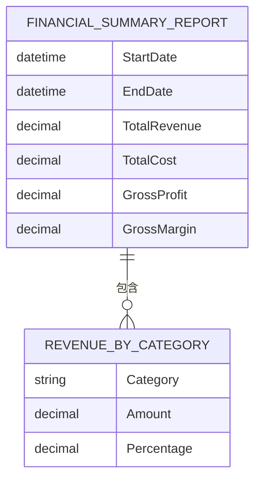

#### 库存估值报告
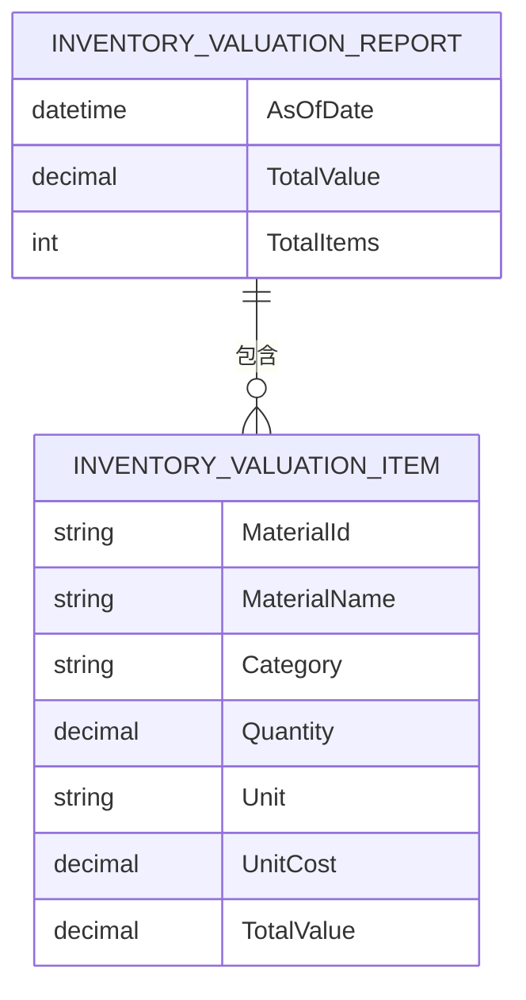

#### 销售按客户报告
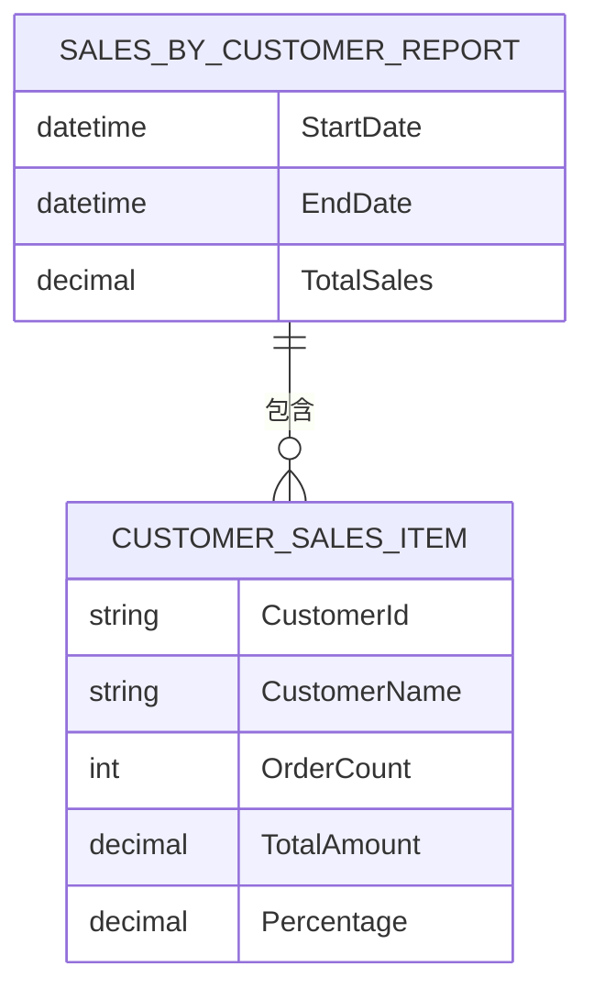

#### 采购订单报告
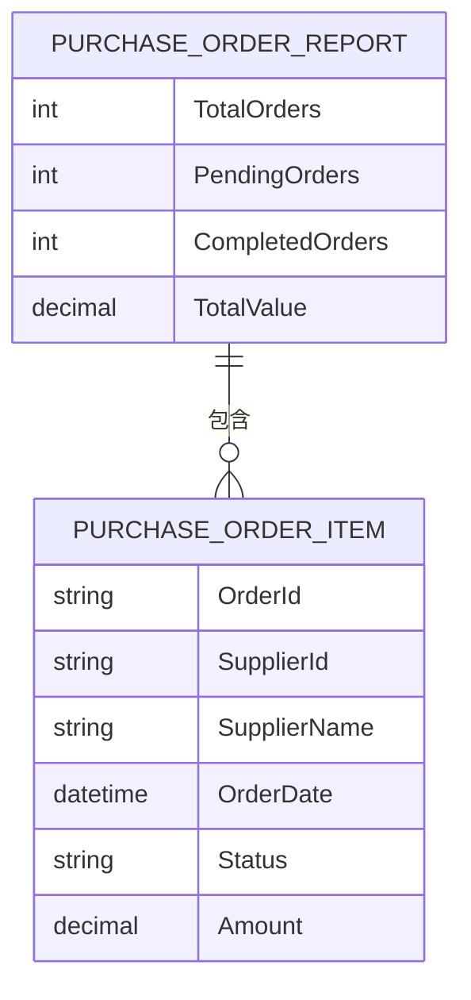

#### 生产效率报告
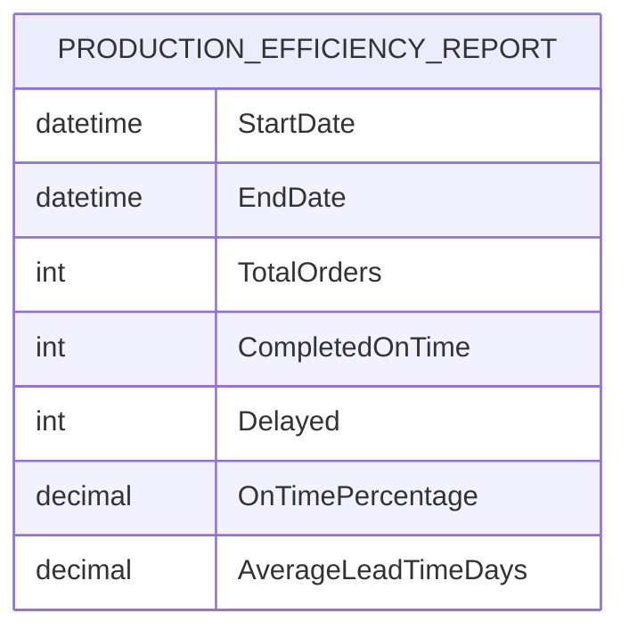

### 仪表板数据模型

#### 仪表板摘要
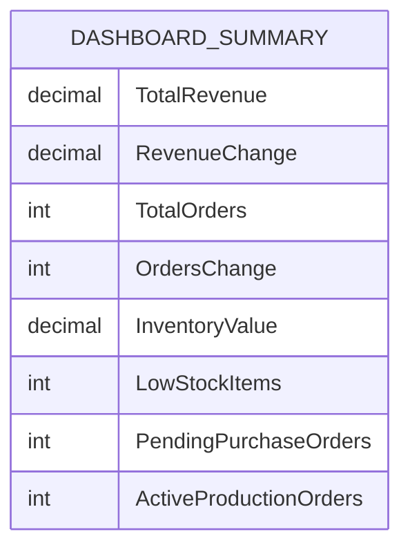

#### 趋势数据点
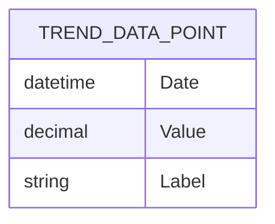

#### 库存状态项
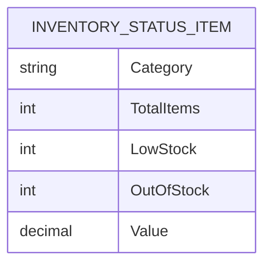

#### 顶级产品项
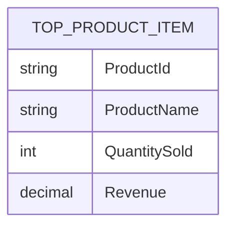

#### 活动项
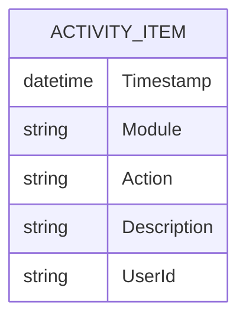

**图表来源**
- [ReportsController.cs](file://src/Services/Reporting/ErpSystem.Reporting/Controllers/ReportsController.cs#L74-L136)
- [DashboardController.cs](file://src/Services/Reporting/ErpSystem.Reporting/Controllers/DashboardController.cs#L62-L79)

**章节来源**
- [ReportsController.cs](file://src/Services/Reporting/ErpSystem.Reporting/Controllers/ReportsController.cs#L74-L136)
- [DashboardController.cs](file://src/Services/Reporting/ErpSystem.Reporting/Controllers/DashboardController.cs#L62-L79)

## 集成与部署

### Kubernetes部署配置

报告服务通过Kubernetes进行容器化部署，配置了健康检查和探针：

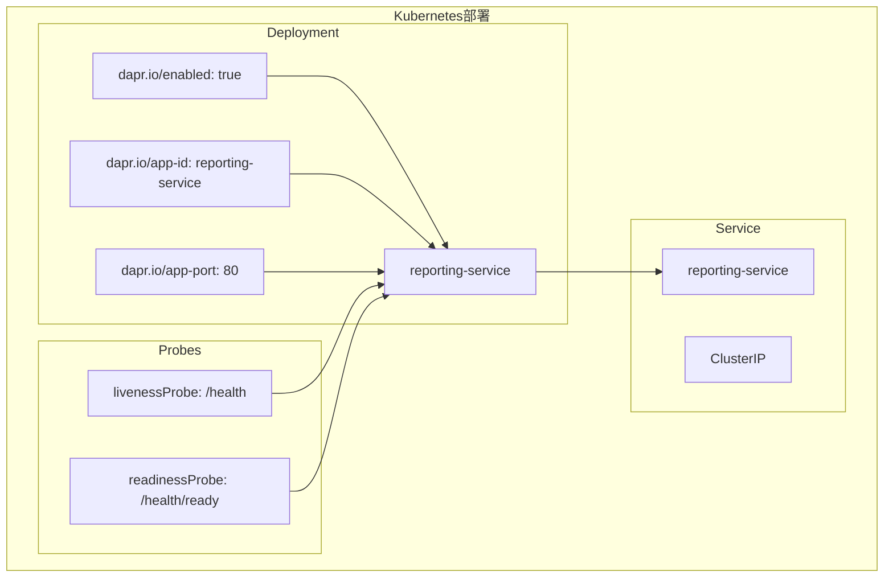

**图表来源**
- [reporting.yaml](file://deploy/k8s/services/reporting.yaml#L1-L64)

### API网关路由

服务通过API网关进行统一入口管理：

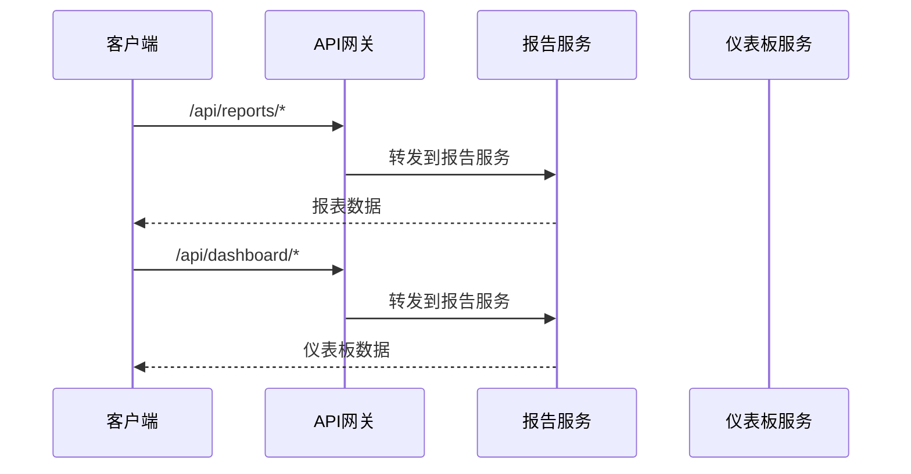

**图表来源**
- [ingress.yaml](file://deploy/helm/erp-system/templates/ingress.yaml#L32-L45)

### BI分析集成

报告服务与BI分析服务协同工作，提供更深入的数据洞察：

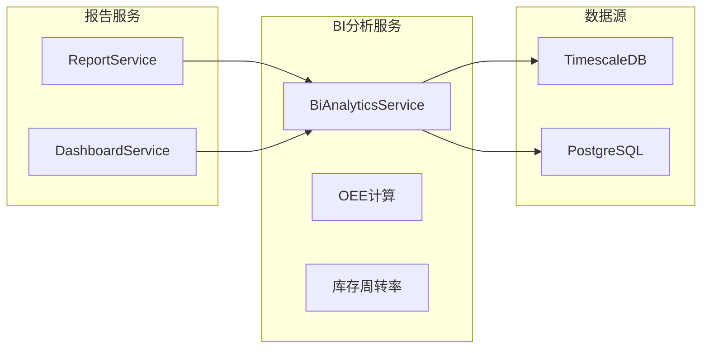

**图表来源**
- [BiAnalyticsService.cs](file://src/Services/Analytics/ErpSystem.Analytics/Infrastructure/BiAnalyticsService.cs#L1-L93)

**章节来源**
- [reporting.yaml](file://deploy/k8s/services/reporting.yaml#L1-L64)
- [ingress.yaml](file://deploy/helm/erp-system/templates/ingress.yaml#L1-L46)

## 性能考虑

### 缓存策略
- 使用内存缓存减少重复查询
- 针对高频访问的报表数据实施缓存
- 合理设置缓存过期时间

### 异步处理
- 所有数据查询采用异步模式
- 支持长时间运行的报表生成任务
- 实现后台作业队列处理复杂报表

### 连接池管理
- 数据库连接池优化
- 连接超时和重试机制
- 连接泄漏防护

### 健康监控
- 内置健康检查端点
- Liveness和Readiness探针
- 容器化环境下的自愈能力

## 故障排除指南

### 常见问题诊断

#### API访问问题
- 检查服务是否正常启动
- 验证Swagger文档可用性
- 确认CORS配置正确

#### 数据查询问题
- 检查数据库连接字符串
- 验证TimescaleDB连接
- 确认查询参数格式

#### 性能问题
- 监控CPU和内存使用
- 检查数据库查询性能
- 分析日志中的错误信息

### 日志分析

服务使用结构化日志记录关键操作：

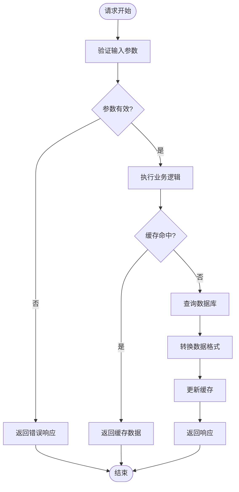

**图表来源**
- [ReportService.cs](file://src/Services/Reporting/ErpSystem.Reporting/Application/ReportService.cs#L16-L34)
- [DashboardService.cs](file://src/Services/Reporting/ErpSystem.Reporting/Application/DashboardService.cs#L22-L37)

**章节来源**
- [appsettings.json](file://src/Services/Reporting/ErpSystem.Reporting/appsettings.json#L1-L10)

## 结论

报告服务API提供了完整的企业级报表和BI仪表板解决方案。通过清晰的REST API设计、丰富的数据模型和现代化的微服务架构，该服务能够满足各种业务报表需求。

### 主要优势

1. **模块化设计**: 清晰的分层架构便于维护和扩展
2. **标准化接口**: 统一的API设计和数据格式
3. **高性能**: 异步处理和缓存策略提升性能
4. **可观测性**: 完善的日志记录和健康检查
5. **可扩展性**: 支持Dapr事件总线和容器化部署

### 未来发展方向

- 集成更多报表模板和格式化选项
- 实现报表定时生成和自动分发
- 增强数据可视化功能
- 扩展多租户支持
- 集成机器学习预测分析

该API文档为开发者提供了全面的技术参考，有助于快速集成和扩展报告服务功能。