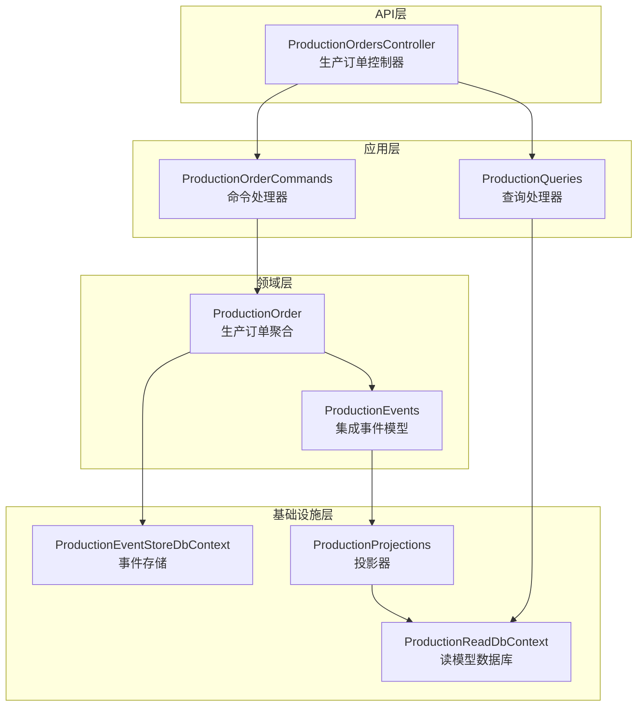
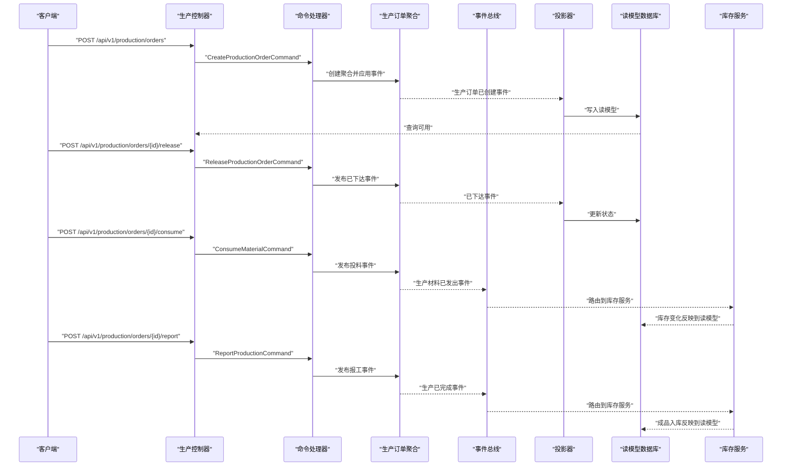
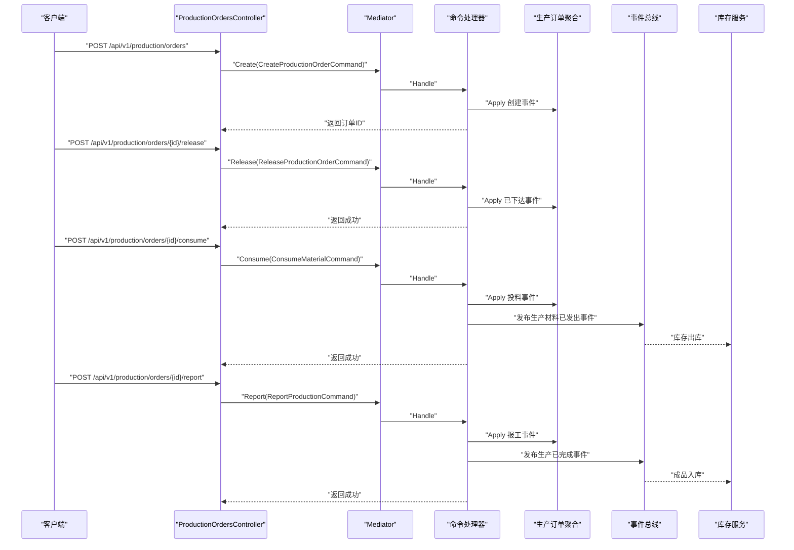
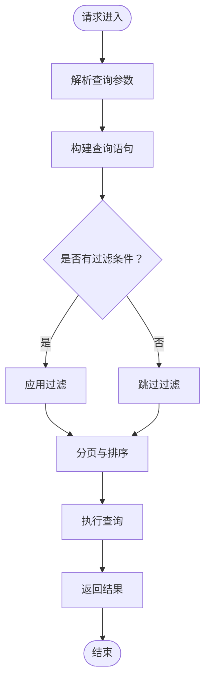
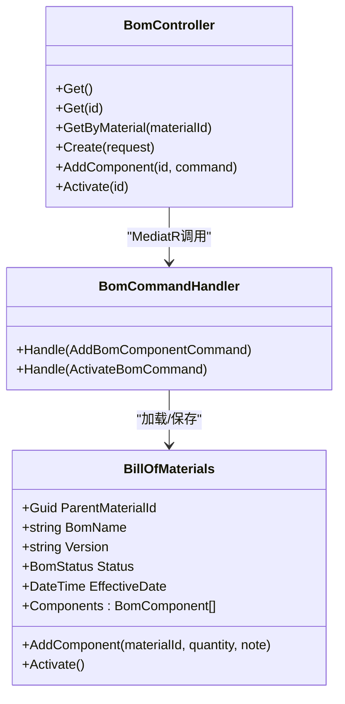
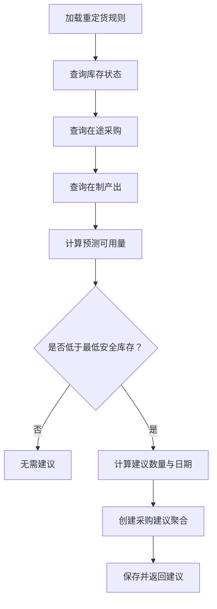
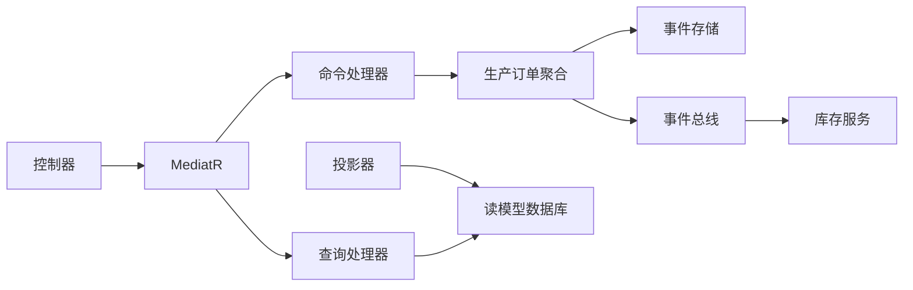

# 生产管理服务API

<cite>
**本文引用的文件**
- [ProductionOrdersController.cs](file://src/Services/Production/ErpSystem.Production/API/ProductionOrdersController.cs)
- [ProductionOrderCommands.cs](file://src/Services/Production/ErpSystem.Production/Application/ProductionOrderCommands.cs)
- [ProductionQueries.cs](file://src/Services/Production/ErpSystem.Production/Application/ProductionQueries.cs)
- [ProductionOrderAggregate.cs](file://src/Services/Production/ErpSystem.Production/Domain/ProductionOrderAggregate.cs)
- [ProductionEvents.cs](file://src/Services/Production/ErpSystem.Production/Domain/ProductionEvents.cs)
- [Persistence.cs](file://src/Services/Production/ErpSystem.Production/Infrastructure/Persistence.cs)
- [Projections.cs](file://src/Services/Production/ErpSystem.Production/Infrastructure/Projections.cs)
- [BOMController.cs](file://src/Services/MasterData/ErpSystem.MasterData/Controllers/BOMController.cs)
- [BOMCommands.cs](file://src/Services/MasterData/ErpSystem.MasterData/Application/BOMCommands.cs)
- [BillOfMaterialsAggregate.cs](file://src/Services/MasterData/ErpSystem.MasterData/Domain/BillOfMaterialsAggregate.cs)
- [MrpCalculationEngine.cs](file://src/Services/Mrp/ErpSystem.Mrp/Application/MrpCalculationEngine.cs)
- [ProcurementSuggestionAggregate.cs](file://src/Services/Mrp/ErpSystem.Mrp/Domain/ProcurementSuggestionAggregate.cs)
- [ProductionToInventoryTests.cs](file://src/Tests/ErpSystem.IntegrationTests/ProductionToInventoryTests.cs)
- [PRD-07-Production-Service.md](file://docs/PRD-07-Production-Service.md)
</cite>

## 目录
1. [简介](#简介)
2. [项目结构](#项目结构)
3. [核心组件](#核心组件)
4. [架构总览](#架构总览)
5. [详细组件分析](#详细组件分析)
6. [依赖关系分析](#依赖关系分析)
7. [性能考虑](#性能考虑)
8. [故障排查指南](#故障排查指南)
9. [结论](#结论)
10. [附录](#附录)

## 简介
本文件为生产管理服务的详细API文档，覆盖生产订单、BOM管理、生产工单、物料需求计算与生产进度跟踪等核心能力。文档面向开发与运维人员，提供REST API端点定义、请求/响应模式、状态流转与集成点说明，并给出生产流程的完整调用序列与数据同步示例。

## 项目结构
生产管理服务采用分层架构：API层（控制器）接收请求，应用层（CQRS命令/查询）编排业务，领域层（聚合与事件）表达业务规则，基础设施层（事件存储、投影、读模型）支撑持久化与查询。

图表来源
- [ProductionOrdersController.cs](file://src/Services/Production/ErpSystem.Production/API/ProductionOrdersController.cs#L1-L46)
- [ProductionOrderCommands.cs](file://src/Services/Production/ErpSystem.Production/Application/ProductionOrderCommands.cs#L33-L99)
- [ProductionQueries.cs](file://src/Services/Production/ErpSystem.Production/Application/ProductionQueries.cs#L13-L44)
- [ProductionOrderAggregate.cs](file://src/Services/Production/ErpSystem.Production/Domain/ProductionOrderAggregate.cs#L63-L142)
- [ProductionEvents.cs](file://src/Services/Production/ErpSystem.Production/Domain/ProductionEvents.cs#L5-L24)
- [Persistence.cs](file://src/Services/Production/ErpSystem.Production/Infrastructure/Persistence.cs#L6-L32)
- [Projections.cs](file://src/Services/Production/ErpSystem.Production/Infrastructure/Projections.cs#L6-L107)

章节来源
- [ProductionOrdersController.cs](file://src/Services/Production/ErpSystem.Production/API/ProductionOrdersController.cs#L1-L46)
- [ProductionOrderCommands.cs](file://src/Services/Production/ErpSystem.Production/Application/ProductionOrderCommands.cs#L1-L99)
- [ProductionQueries.cs](file://src/Services/Production/ErpSystem.Production/Application/ProductionQueries.cs#L1-L44)
- [ProductionOrderAggregate.cs](file://src/Services/Production/ErpSystem.Production/Domain/ProductionOrderAggregate.cs#L1-L142)
- [ProductionEvents.cs](file://src/Services/Production/ErpSystem.Production/Domain/ProductionEvents.cs#L1-L24)
- [Persistence.cs](file://src/Services/Production/ErpSystem.Production/Infrastructure/Persistence.cs#L1-L71)
- [Projections.cs](file://src/Services/Production/ErpSystem.Production/Infrastructure/Projections.cs#L1-L107)

## 核心组件
- 生产订单聚合：定义状态机与业务规则，支持创建、下达、投料、报工、完成与关闭。
- 命令处理器：封装业务操作，发布集成事件，驱动库存服务。
- 查询处理器：提供订单详情、列表与在制品查询。
- 投影器：监听领域事件，写入读模型数据库，供查询使用。
- BOM管理：维护物料清单，为生产计划与物料需求提供依据。
- MRP引擎：基于库存、采购与生产计划计算采购建议。

章节来源
- [ProductionOrderAggregate.cs](file://src/Services/Production/ErpSystem.Production/Domain/ProductionOrderAggregate.cs#L5-L142)
- [ProductionOrderCommands.cs](file://src/Services/Production/ErpSystem.Production/Application/ProductionOrderCommands.cs#L33-L99)
- [ProductionQueries.cs](file://src/Services/Production/ErpSystem.Production/Application/ProductionQueries.cs#L13-L44)
- [Projections.cs](file://src/Services/Production/ErpSystem.Production/Infrastructure/Projections.cs#L6-L107)
- [BOMController.cs](file://src/Services/MasterData/ErpSystem.MasterData/Controllers/BOMController.cs#L1-L54)
- [BOMCommands.cs](file://src/Services/MasterData/ErpSystem.MasterData/Application/BOMCommands.cs#L27-L49)
- [MrpCalculationEngine.cs](file://src/Services/Mrp/ErpSystem.Mrp/Application/MrpCalculationEngine.cs#L9-L160)

## 架构总览
生产管理服务通过事件驱动与CQRS实现松耦合：命令侧负责业务规则与事件发布，查询侧提供只读读模型。与库存服务通过集成事件解耦，实现投料出库与完工入库的数据一致性。

图表来源
- [ProductionOrdersController.cs](file://src/Services/Production/ErpSystem.Production/API/ProductionOrdersController.cs#L11-L44)
- [ProductionOrderCommands.cs](file://src/Services/Production/ErpSystem.Production/Application/ProductionOrderCommands.cs#L39-L97)
- [ProductionEvents.cs](file://src/Services/Production/ErpSystem.Production/Domain/ProductionEvents.cs#L7-L22)
- [Projections.cs](file://src/Services/Production/ErpSystem.Production/Infrastructure/Projections.cs#L13-L105)
- [ProductionToInventoryTests.cs](file://src/Tests/ErpSystem.IntegrationTests/ProductionToInventoryTests.cs#L13-L124)

## 详细组件分析

### 生产订单API
- 基础路径：/api/v1/production/orders
- 支持操作：
  - 创建生产订单
  - 按ID获取详情
  - 列表查询（支持按物料与状态过滤）
  - 下达订单
  - 投料
  - 报工
  - 在制品查询

图表来源
- [ProductionOrdersController.cs](file://src/Services/Production/ErpSystem.Production/API/ProductionOrdersController.cs#L11-L44)
- [ProductionOrderCommands.cs](file://src/Services/Production/ErpSystem.Production/Application/ProductionOrderCommands.cs#L39-L97)
- [ProductionEvents.cs](file://src/Services/Production/ErpSystem.Production/Domain/ProductionEvents.cs#L7-L22)

章节来源
- [ProductionOrdersController.cs](file://src/Services/Production/ErpSystem.Production/API/ProductionOrdersController.cs#L11-L44)
- [ProductionOrderCommands.cs](file://src/Services/Production/ErpSystem.Production/Application/ProductionOrderCommands.cs#L8-L31)
- [ProductionOrderAggregate.cs](file://src/Services/Production/ErpSystem.Production/Domain/ProductionOrderAggregate.cs#L85-L111)

### 查询API
- 获取详情：GET /api/v1/production/orders/{id}
- 列表查询：GET /api/v1/production/orders?materialId={}&status={}&page={}
- 在制品查询：GET /api/v1/production/orders/wip?materialId={}

图表来源
- [ProductionQueries.cs](file://src/Services/Production/ErpSystem.Production/Application/ProductionQueries.cs#L23-L42)
- [Persistence.cs](file://src/Services/Production/ErpSystem.Production/Infrastructure/Persistence.cs#L20-L32)

章节来源
- [ProductionQueries.cs](file://src/Services/Production/ErpSystem.Production/Application/ProductionQueries.cs#L7-L42)
- [Persistence.cs](file://src/Services/Production/ErpSystem.Production/Infrastructure/Persistence.cs#L34-L71)

### BOM管理API
- 获取所有BOM：GET /api/bom
- 获取BOM详情：GET /api/bom/{id}
- 按父物料查询BOM：GET /api/bom/material/{materialId}
- 新增BOM：POST /api/bom
- 为BOM新增子件：POST /api/bom/{id}/components
- 激活BOM：POST /api/bom/{id}/activate

图表来源
- [BOMController.cs](file://src/Services/MasterData/ErpSystem.MasterData/Controllers/BOMController.cs#L10-L53)
- [BOMCommands.cs](file://src/Services/MasterData/ErpSystem.MasterData/Application/BOMCommands.cs#L27-L49)
- [BillOfMaterialsAggregate.cs](file://src/Services/MasterData/ErpSystem.MasterData/Domain/BillOfMaterialsAggregate.cs#L55-L125)

章节来源
- [BOMController.cs](file://src/Services/MasterData/ErpSystem.MasterData/Controllers/BOMController.cs#L12-L52)
- [BOMCommands.cs](file://src/Services/MasterData/ErpSystem.MasterData/Application/BOMCommands.cs#L9-L21)
- [BillOfMaterialsAggregate.cs](file://src/Services/MasterData/ErpSystem.MasterData/Domain/BillOfMaterialsAggregate.cs#L46-L102)

### MRP与物料需求计算
- 计算入口：按重定货规则运行MRP
- 输入：库存状态、在途采购、在制产出
- 输出：采购建议（数量、日期、原因）

图表来源
- [MrpCalculationEngine.cs](file://src/Services/Mrp/ErpSystem.Mrp/Application/MrpCalculationEngine.cs#L19-L95)
- [ProcurementSuggestionAggregate.cs](file://src/Services/Mrp/ErpSystem.Mrp/Domain/ProcurementSuggestionAggregate.cs#L20-L101)

章节来源
- [MrpCalculationEngine.cs](file://src/Services/Mrp/ErpSystem.Mrp/Application/MrpCalculationEngine.cs#L9-L160)
- [ProcurementSuggestionAggregate.cs](file://src/Services/Mrp/ErpSystem.Mrp/Domain/ProcurementSuggestionAggregate.cs#L8-L170)

### 生产流程API调用序列与数据同步示例
- 场景一：投料出库同步
  1) 初始化库存（收货）
  2) 创建并下达生产订单
  3) 执行投料，触发“生产材料已发出”事件
  4) 库存服务消费事件并扣减库存
  5) 验证库存变化

- 场景二：完工入库同步
  1) 创建并下达生产订单
  2) 执行报工（合格数量）
  3) 触发“生产已完成”事件
  4) 库存服务消费事件并增加成品库存
  5) 验证库存变化

章节来源
- [ProductionToInventoryTests.cs](file://src/Tests/ErpSystem.IntegrationTests/ProductionToInventoryTests.cs#L13-L124)

## 依赖关系分析
- 控制器依赖MediatR进行命令/查询分发。
- 命令处理器依赖事件存储与事件总线，发布集成事件。
- 投影器订阅领域事件，更新读模型数据库。
- 查询处理器依赖读模型数据库提供只读查询。
- 生产服务与库存服务通过集成事件解耦。

图表来源
- [ProductionOrdersController.cs](file://src/Services/Production/ErpSystem.Production/API/ProductionOrdersController.cs#L9-L20)
- [ProductionOrderCommands.cs](file://src/Services/Production/ErpSystem.Production/Application/ProductionOrderCommands.cs#L33-L37)
- [Projections.cs](file://src/Services/Production/ErpSystem.Production/Infrastructure/Projections.cs#L6-L11)
- [Persistence.cs](file://src/Services/Production/ErpSystem.Production/Infrastructure/Persistence.cs#L20-L32)

章节来源
- [ProductionOrdersController.cs](file://src/Services/Production/ErpSystem.Production/API/ProductionOrdersController.cs#L9-L20)
- [ProductionOrderCommands.cs](file://src/Services/Production/ErpSystem.Production/Application/ProductionOrderCommands.cs#L33-L37)
- [Projections.cs](file://src/Services/Production/ErpSystem.Production/Infrastructure/Projections.cs#L6-L11)
- [Persistence.cs](file://src/Services/Production/ErpSystem.Production/Infrastructure/Persistence.cs#L20-L32)

## 性能考虑
- 列表查询默认分页大小为20条，建议前端按需设置页码与大小。
- 投料与报工接口为同步处理，建议结合幂等性设计避免重复提交。
- 事件驱动的投影与读模型查询适合高频读取场景，建议对热点字段建立索引。

## 故障排查指南
- 订单状态异常：检查命令处理器中的状态前置条件与异常抛出位置。
- 事件未到达：确认事件总线路由与订阅配置，验证集成事件名称与负载格式。
- 查询结果为空：确认读模型投影是否完成，检查过滤参数与分页偏移。
- 集成测试参考：通过端到端测试验证投料与报工对库存的影响。

章节来源
- [ProductionOrderAggregate.cs](file://src/Services/Production/ErpSystem.Production/Domain/ProductionOrderAggregate.cs#L85-L111)
- [ProductionOrderCommands.cs](file://src/Services/Production/ErpSystem.Production/Application/ProductionOrderCommands.cs#L57-L97)
- [ProductionToInventoryTests.cs](file://src/Tests/ErpSystem.IntegrationTests/ProductionToInventoryTests.cs#L13-L124)

## 结论
生产管理服务通过清晰的CQRS与事件驱动架构，实现了从生产订单创建、下达、投料、报工到完工入库的完整闭环，并与库存服务通过集成事件实现数据一致性。BOM与MRP能力为生产计划与物料需求提供了基础支撑。建议在生产环境中强化鉴权、审计与监控，确保关键操作的可追溯性与稳定性。

## 附录

### API端点一览
- 创建生产订单
  - 方法：POST
  - 路径：/api/v1/production/orders
  - 请求体：包含物料标识、编码、名称与计划数量
  - 响应：返回新生成的订单ID

- 获取生产订单详情
  - 方法：GET
  - 路径：/api/v1/production/orders/{id}

- 列表查询
  - 方法：GET
  - 路径：/api/v1/production/orders
  - 查询参数：materialId、status、page

- 下达订单
  - 方法：POST
  - 路径：/api/v1/production/orders/{id}/release

- 投料
  - 方法：POST
  - 路径：/api/v1/production/orders/{id}/consume
  - 请求体：包含物料标识、仓库标识、数量与操作人

- 报工
  - 方法：POST
  - 路径：/api/v1/production/orders/{id}/report
  - 请求体：包含合格数量、报废数量、仓库标识与报告人

- 在制品查询
  - 方法：GET
  - 路径：/api/v1/production/orders/wip
  - 查询参数：materialId

- BOM管理
  - 获取所有BOM：GET /api/bom
  - 获取BOM详情：GET /api/bom/{id}
  - 按父物料查询：GET /api/bom/material/{materialId}
  - 新增BOM：POST /api/bom
  - 新增子件：POST /api/bom/{id}/components
  - 激活BOM：POST /api/bom/{id}/activate

章节来源
- [ProductionOrdersController.cs](file://src/Services/Production/ErpSystem.Production/API/ProductionOrdersController.cs#L11-L44)
- [BOMController.cs](file://src/Services/MasterData/ErpSystem.MasterData/Controllers/BOMController.cs#L12-L52)
- [PRD-07-Production-Service.md](file://docs/PRD-07-Production-Service.md#L340-L371)