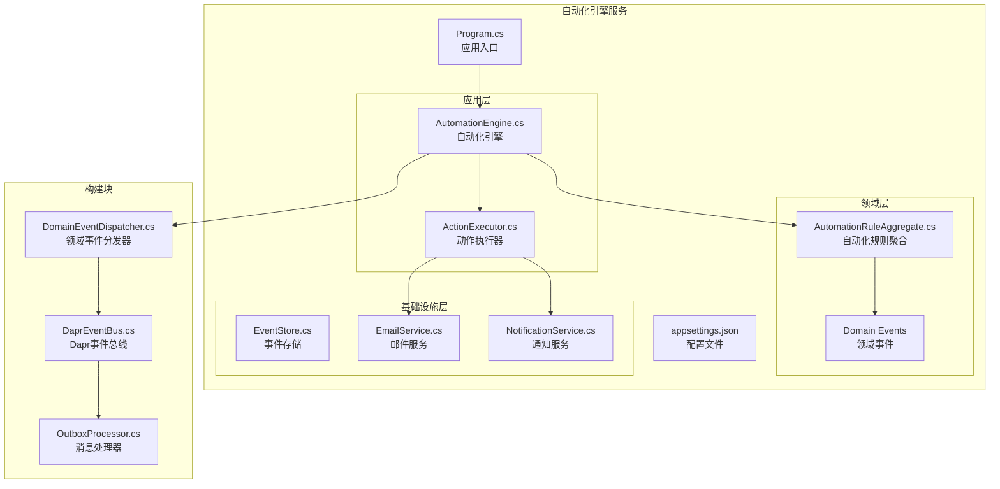
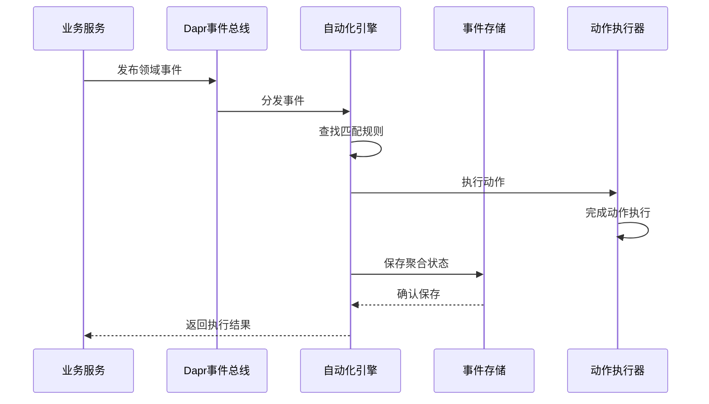
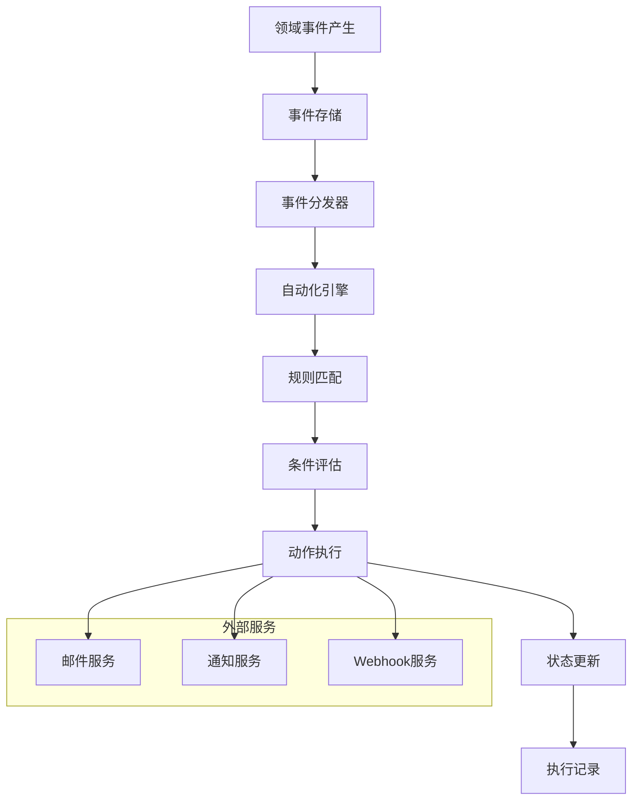
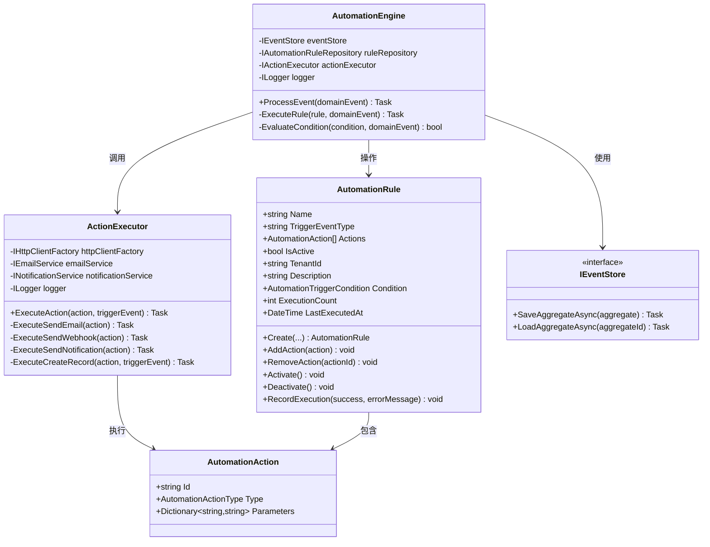
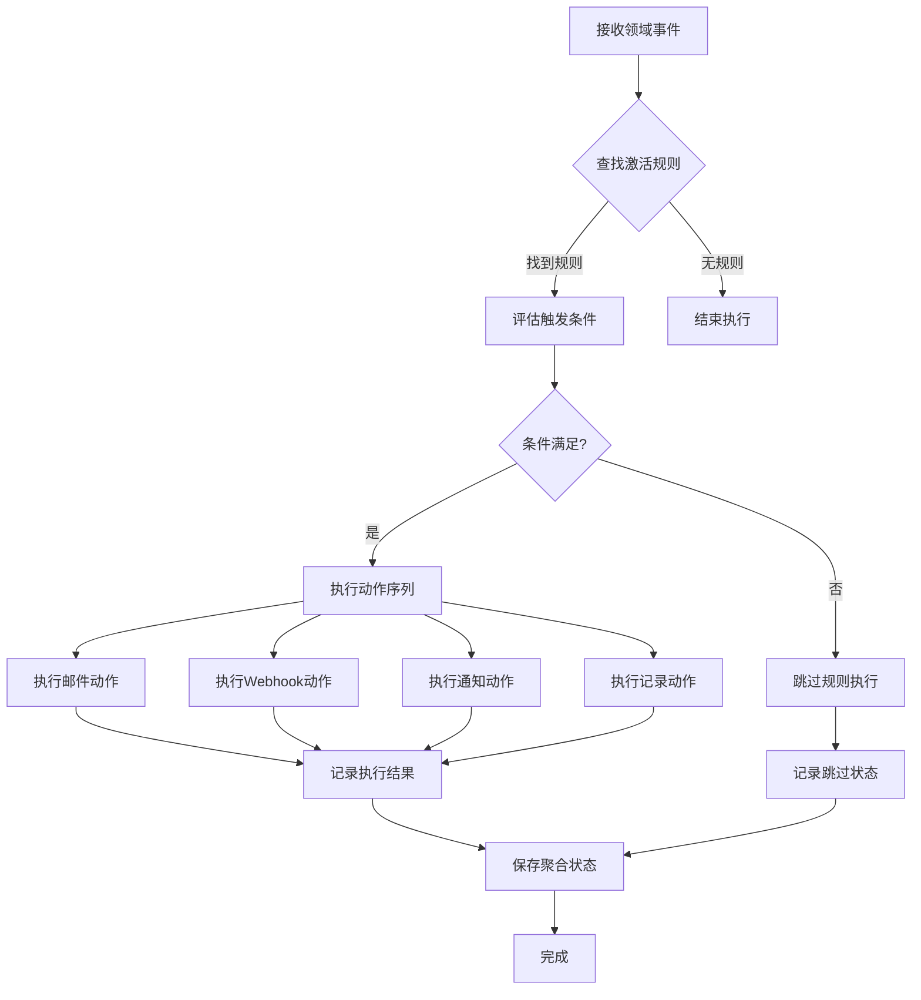
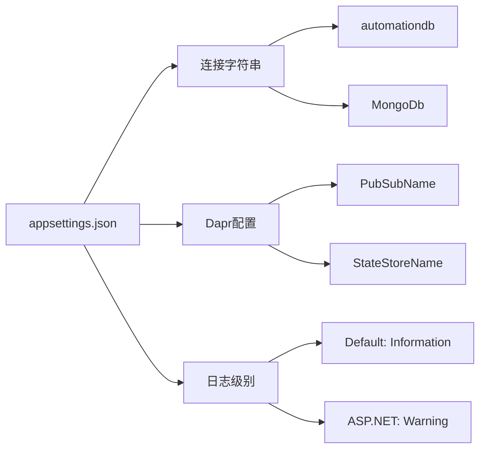
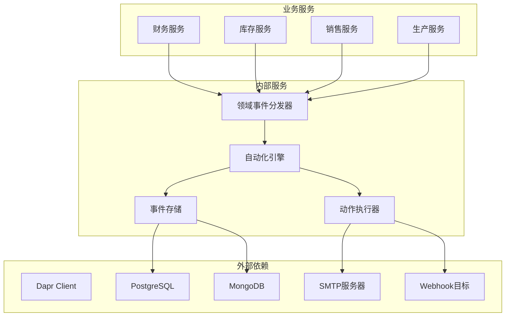

# 自动化引擎服务API

<cite>
**本文档引用的文件**
- [Program.cs](file://src/Services/Automation/ErpSystem.Automation/Program.cs)
- [appsettings.json](file://src/Services/Automation/ErpSystem.Automation/appsettings.json)
- [AutomationEngine.cs](file://src/Services/Automation/ErpSystem.Automation/Application/AutomationEngine.cs)
- [AutomationRuleAggregate.cs](file://src/Services/Automation/ErpSystem.Automation/Domain/AutomationRuleAggregate.cs)
- [DDDBase.cs](file://src/BuildingBlocks/ErpSystem.BuildingBlocks/DddBase.cs)
- [DomainEventDispatcher.cs](file://src/BuildingBlocks/ErpSystem.BuildingBlocks/Domain/DomainEventDispatcher.cs)
- [DaprEventBus.cs](file://src/BuildingBlocks/ErpSystem.BuildingBlocks/EventBus/DaprEventBus.cs)
- [OutboxProcessor.cs](file://src/BuildingBlocks/ErpSystem.BuildingBlocks/Outbox/OutboxProcessor.cs)
- [appsettings.json](file://src/Gateways/ErpSystem.Gateway/appsettings.json)
</cite>

## 目录
1. [简介](#简介)
2. [项目结构](#项目结构)
3. [核心组件](#核心组件)
4. [架构概览](#架构概览)
5. [详细组件分析](#详细组件分析)
6. [依赖关系分析](#依赖关系分析)
7. [性能考虑](#性能考虑)
8. [故障排除指南](#故障排除指南)
9. [结论](#结论)

## 简介

自动化引擎服务是一个基于事件驱动架构的企业级自动化平台，专为ERP系统设计。该服务实现了完整的业务规则引擎、工作流自动化和任务调度功能，通过领域事件驱动的方式实现跨服务的业务自动化。

该服务采用CQRS（命令查询职责分离）和事件溯源模式，支持多种自动化动作类型，包括邮件通知、Webhook调用、记录创建/更新、通知推送等。系统通过Dapr事件总线实现松耦合的服务间通信，确保高可用性和可扩展性。

## 项目结构

自动化引擎服务位于`src/Services/Automation`目录下，采用分层架构设计：

**图表来源**
- [Program.cs](file://src/Services/Automation/ErpSystem.Automation/Program.cs#L1-L120)
- [AutomationEngine.cs](file://src/Services/Automation/ErpSystem.Automation/Application/AutomationEngine.cs#L1-L220)
- [AutomationRuleAggregate.cs](file://src/Services/Automation/ErpSystem.Automation/Domain/AutomationRuleAggregate.cs#L1-L196)

**章节来源**
- [Program.cs](file://src/Services/Automation/ErpSystem.Automation/Program.cs#L1-L120)
- [appsettings.json](file://src/Services/Automation/ErpSystem.Automation/appsettings.json#L1-L17)

## 核心组件

### 自动化引擎 (AutomationEngine)

自动化引擎是整个系统的核心组件，负责监听领域事件并执行匹配的自动化规则。其主要功能包括：

- **事件监听**: 接收来自各个服务的领域事件
- **规则匹配**: 根据事件类型查找激活的自动化规则
- **条件评估**: 执行规则的触发条件检查
- **动作执行**: 顺序执行规则中的所有动作
- **执行记录**: 记录每次执行的结果和状态

### 动作执行器 (ActionExecutor)

动作执行器负责具体执行各种类型的自动化动作：

- **发送邮件**: 支持邮件参数配置
- **Webhook调用**: 异步HTTP请求调用
- **通知推送**: 多渠道通知发送
- **记录创建/更新**: 跨服务数据操作

### 自动化规则聚合 (AutomationRule)

规则聚合定义了完整的自动化工作流：

- **规则定义**: 名称、描述、触发事件类型
- **动作列表**: 支持多种动作类型的组合
- **触发条件**: 基于事件属性的条件判断
- **状态管理**: 激活/停用状态控制
- **执行统计**: 执行次数和时间跟踪

**章节来源**
- [AutomationEngine.cs](file://src/Services/Automation/ErpSystem.Automation/Application/AutomationEngine.cs#L1-L220)
- [AutomationRuleAggregate.cs](file://src/Services/Automation/ErpSystem.Automation/Domain/AutomationRuleAggregate.cs#L1-L196)

## 架构概览

自动化引擎服务采用事件驱动架构，通过Dapr事件总线实现服务间的松耦合通信：

**图表来源**
- [DomainEventDispatcher.cs](file://src/BuildingBlocks/ErpSystem.BuildingBlocks/Domain/DomainEventDispatcher.cs#L17-L42)
- [DaprEventBus.cs](file://src/BuildingBlocks/ErpSystem.BuildingBlocks/EventBus/DaprEventBus.cs#L11-L21)
- [AutomationEngine.cs](file://src/Services/Automation/ErpSystem.Automation/Application/AutomationEngine.cs#L19-L54)

### 数据流架构

**图表来源**
- [DDDBase.cs](file://src/BuildingBlocks/ErpSystem.BuildingBlocks/DddBase.cs#L59-L99)
- [AutomationEngine.cs](file://src/Services/Automation/ErpSystem.Automation/Application/AutomationEngine.cs#L56-L92)

## 详细组件分析

### 自动化引擎类图

**图表来源**
- [AutomationEngine.cs](file://src/Services/Automation/ErpSystem.Automation/Application/AutomationEngine.cs#L10-L135)
- [AutomationRuleAggregate.cs](file://src/Services/Automation/ErpSystem.Automation/Domain/AutomationRuleAggregate.cs#L8-L127)

### 规则执行流程

**图表来源**
- [AutomationEngine.cs](file://src/Services/Automation/ErpSystem.Automation/Application/AutomationEngine.cs#L19-L92)

### 配置管理

系统支持灵活的配置管理，包括数据库连接、Dapr集成和日志设置：

**图表来源**
- [appsettings.json](file://src/Services/Automation/ErpSystem.Automation/appsettings.json#L9-L16)

**章节来源**
- [AutomationEngine.cs](file://src/Services/Automation/ErpSystem.Automation/Application/AutomationEngine.cs#L1-L220)
- [AutomationRuleAggregate.cs](file://src/Services/Automation/ErpSystem.Automation/Domain/AutomationRuleAggregate.cs#L1-L196)
- [appsettings.json](file://src/Services/Automation/ErpSystem.Automation/appsettings.json#L1-L17)

## 依赖关系分析

### 服务依赖图

**图表来源**
- [Program.cs](file://src/Services/Automation/ErpSystem.Automation/Program.cs#L18-L44)
- [DaprEventBus.cs](file://src/BuildingBlocks/ErpSystem.BuildingBlocks/EventBus/DaprEventBus.cs#L1-L31)

### 组件耦合度分析

系统采用低耦合设计原则：

- **领域层与应用层分离**: 领域逻辑独立于应用逻辑
- **接口抽象**: 通过接口定义实现松耦合
- **依赖注入**: 通过IoC容器管理依赖关系
- **事件驱动**: 减少直接的函数调用依赖

**章节来源**
- [Program.cs](file://src/Services/Automation/ErpSystem.Automation/Program.cs#L1-L120)
- [DDDBase.cs](file://src/BuildingBlocks/ErpSystem.BuildingBlocks/DddBase.cs#L1-L137)

## 性能考虑

### 事件处理优化

系统在设计时考虑了以下性能优化策略：

- **批量处理**: 事件存储支持批量写入操作
- **异步执行**: 动作执行采用异步模式避免阻塞
- **缓存机制**: 规则缓存减少数据库查询开销
- **并发控制**: 合理的并发处理避免资源竞争

### 存储优化

- **事件溯源**: 通过事件流实现数据版本追踪
- **JSONB存储**: PostgreSQL JSONB字段优化事件数据存储
- **索引策略**: 为常用查询字段建立适当索引

## 故障排除指南

### 常见问题诊断

1. **规则不执行**
   - 检查规则是否处于激活状态
   - 验证触发事件类型匹配
   - 确认条件表达式正确性

2. **动作失败**
   - 查看动作执行日志
   - 检查外部服务连接状态
   - 验证参数配置正确性

3. **事件丢失**
   - 检查Dapr事件总线配置
   - 验证事件存储连接
   - 确认Outbox处理器正常运行

### 日志分析

系统提供了详细的日志记录机制：

- **调试日志**: 详细的操作流程记录
- **信息日志**: 关键操作的状态信息
- **错误日志**: 异常情况的详细信息
- **警告日志**: 潜在问题的预警信息

**章节来源**
- [AutomationEngine.cs](file://src/Services/Automation/ErpSystem.Automation/Application/AutomationEngine.cs#L44-L53)
- [OutboxProcessor.cs](file://src/BuildingBlocks/ErpSystem.BuildingBlocks/Outbox/OutboxProcessor.cs#L8-L72)

## 结论

自动化引擎服务提供了一个完整、可扩展的企业级自动化解决方案。通过事件驱动架构和领域事件溯源，系统实现了高度解耦和可维护的业务自动化功能。

该服务的主要优势包括：

- **灵活性**: 支持多种自动化动作类型和复杂的触发条件
- **可扩展性**: 基于事件总线的松耦合设计便于功能扩展
- **可靠性**: 完善的错误处理和重试机制确保系统稳定性
- **可观测性**: 详细的日志记录和监控支持运维管理

通过合理配置和使用，该自动化引擎能够有效提升企业业务流程的自动化水平，减少人工干预，提高运营效率。