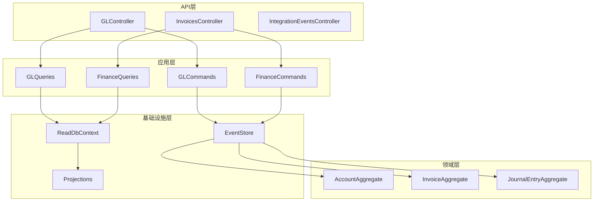
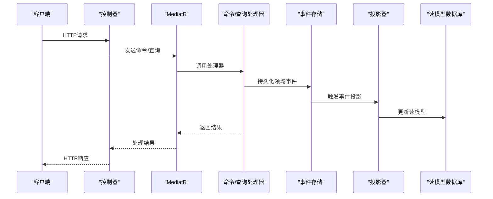
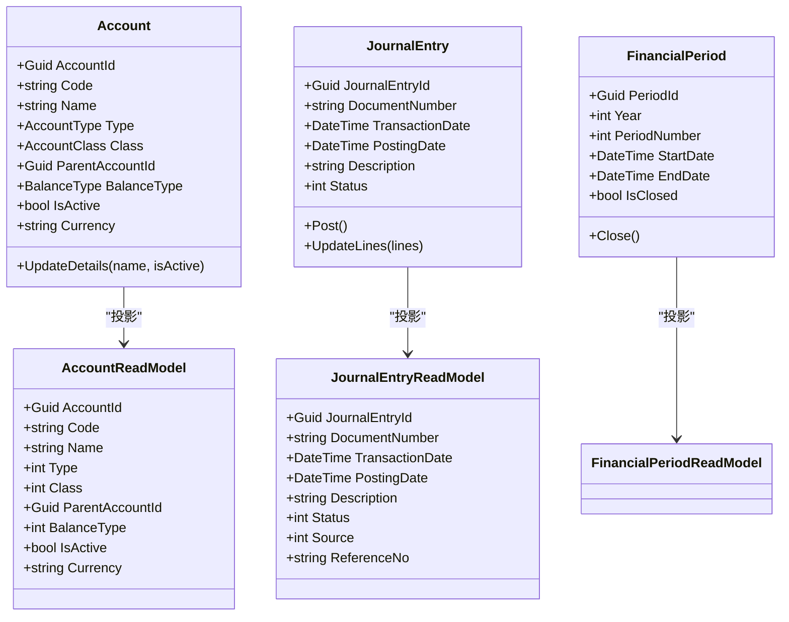
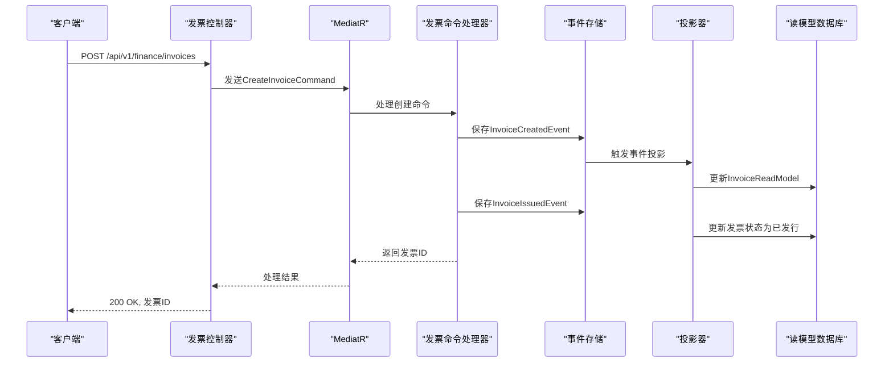
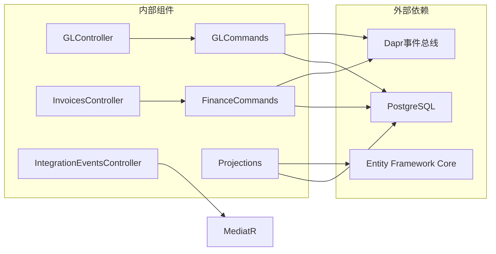
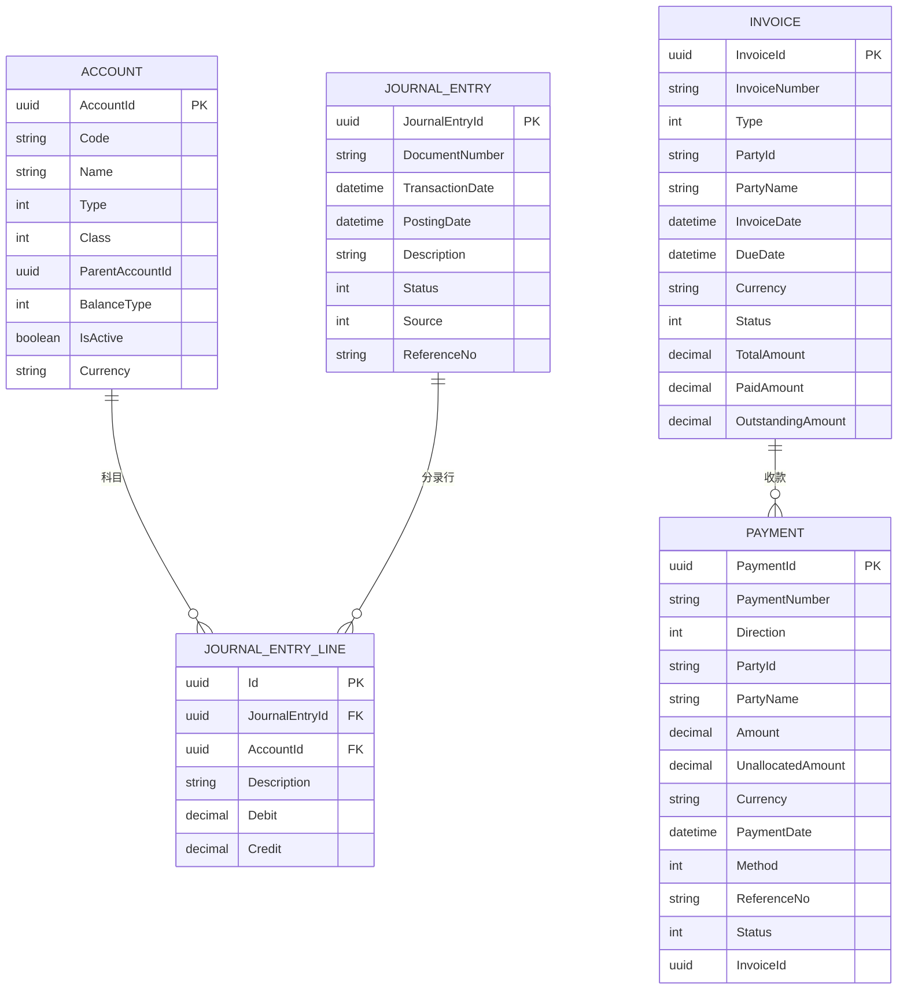

# 财务会计服务API

<cite>
**本文档引用的文件**
- [GLController.cs](file://src/Services/Finance/ErpSystem.Finance/API/GLController.cs)
- [InvoicesController.cs](file://src/Services/Finance/ErpSystem.Finance/API/InvoicesController.cs)
- [IntegrationEventsController.cs](file://src/Services/Finance/ErpSystem.Finance/API/IntegrationEventsController.cs)
- [Program.cs](file://src/Services/Finance/ErpSystem.Finance/Program.cs)
- [appsettings.json](file://src/Services/Finance/ErpSystem.Finance/appsettings.json)
- [GLCommands.cs](file://src/Services/Finance/ErpSystem.Finance/Application/GLCommands.cs)
- [GLQueries.cs](file://src/Services/Finance/ErpSystem.Finance/Application/GLQueries.cs)
- [FinanceCommands.cs](file://src/Services/Finance/ErpSystem.Finance/Application/FinanceCommands.cs)
- [FinanceQueries.cs](file://src/Services/Finance/ErpSystem.Finance/Application/FinanceQueries.cs)
- [Persistence.cs](file://src/Services/Finance/ErpSystem.Finance/Infrastructure/Persistence.cs)
- [Projections.cs](file://src/Services/Finance/ErpSystem.Finance/Infrastructure/Projections.cs)
- [AccountAggregate.cs](file://src/Services/Finance/ErpSystem.Finance/Domain/AccountAggregate.cs)
- [ErpSystem.Finance.http](file://src/Services/Finance/ErpSystem.Finance/ErpSystem.Finance.http)
- [AuthExtensions.cs](file://src/BuildingBlocks/ErpSystem.BuildingBlocks/Auth/AuthExtensions.cs)
</cite>

## 目录
1. [简介](#简介)
2. [项目结构](#项目结构)
3. [核心组件](#核心组件)
4. [架构概览](#架构概览)
5. [详细组件分析](#详细组件分析)
6. [依赖关系分析](#依赖关系分析)
7. [性能考虑](#性能考虑)
8. [故障排除指南](#故障排除指南)
9. [结论](#结论)
10. [附录](#附录)

## 简介
本文件为财务会计服务的完整API文档，涵盖总账(GL)、发票管理、会计集成事件等所有REST API端点。文档详细说明了HTTP方法、URL模式、请求/响应格式、认证方法和错误处理，并深入解释了总账科目管理、凭证录入、应收应付处理、财务报表生成等功能的业务逻辑与API调用顺序。

财务会计服务采用事件驱动架构，使用CQRS模式分离读写模型，通过事件存储实现领域事件的持久化与投影，确保数据一致性与可追溯性。服务支持多租户配置，数据库连接字符串在应用配置中集中管理。

## 项目结构
财务会计服务位于src/Services/Finance目录下，包含以下关键层次：
- API层：控制器负责暴露REST端点，处理HTTP请求与响应
- 应用层：命令与查询处理器，实现业务逻辑编排
- 领域层：聚合根与领域事件，定义业务规则与状态变更
- 基础设施层：事件存储、读模型数据库、投影器等基础设施组件

**图表来源**
- [Program.cs](file://src/Services/Finance/ErpSystem.Finance/Program.cs#L20-L47)
- [GLController.cs](file://src/Services/Finance/ErpSystem.Finance/API/GLController.cs#L10-L75)
- [InvoicesController.cs](file://src/Services/Finance/ErpSystem.Finance/API/InvoicesController.cs#L11-L73)

**章节来源**
- [Program.cs](file://src/Services/Finance/ErpSystem.Finance/Program.cs#L1-L88)
- [appsettings.json](file://src/Services/Finance/ErpSystem.Finance/appsettings.json#L1-L12)

## 核心组件
财务会计服务的核心组件包括：

### 总账控制器 (GLController)
- 路由前缀：`api/gl`
- 主要功能：总账科目管理、凭证录入与过账、试算平衡查询、会计期间管理

### 发票控制器 (InvoicesController)  
- 路由前缀：`api/v1/finance/invoices`
- 主要功能：发票全生命周期管理、收款记录、坏账核销、账龄分析

### 集成事件控制器 (IntegrationEventsController)
- 路由前缀：`api/v1/finance/integration`
- 主要功能：接收外部系统集成事件，如发货创建事件

### 应用服务与查询处理器
- GLCommands/GLQueries：总账相关命令与查询
- FinanceCommands/FinanceQueries：发票与收款相关命令与查询

**章节来源**
- [GLController.cs](file://src/Services/Finance/ErpSystem.Finance/API/GLController.cs#L8-L75)
- [InvoicesController.cs](file://src/Services/Finance/ErpSystem.Finance/API/InvoicesController.cs#L9-L73)
- [IntegrationEventsController.cs](file://src/Services/Finance/ErpSystem.Finance/API/IntegrationEventsController.cs#L6-L17)

## 架构概览
财务会计服务采用事件驱动架构，结合CQRS模式实现读写分离。系统通过MediatR实现命令与查询的解耦，事件存储确保领域事件的持久化，投影器将事件转换为读模型供查询使用。

**图表来源**
- [Program.cs](file://src/Services/Finance/ErpSystem.Finance/Program.cs#L30-L46)
- [Projections.cs](file://src/Services/Finance/ErpSystem.Finance/Infrastructure/Projections.cs#L17-L78)

## 详细组件分析

### 总账(GL) API

#### 总账科目管理
- **创建科目**
  - 方法：POST
  - URL：`/api/gl/accounts`
  - 请求体：包含科目代码、名称、类型、类别、父级科目、余额方向、币种等字段
  - 响应：201 Created，返回科目ID
  - 业务逻辑：创建Account聚合根，发布AccountCreatedEvent事件

- **更新科目**
  - 方法：PUT
  - URL：`/api/gl/accounts/{id}`
  - 请求体：包含科目名称、激活状态
  - 响应：204 No Content
  - 业务逻辑：加载Account聚合，更新详情，发布AccountDetailsUpdatedEvent事件

- **查询科目列表**
  - 方法：GET
  - URL：`/api/gl/accounts`
  - 响应：200 OK，返回AccountReadModel列表
  - 业务逻辑：从读模型数据库查询所有科目，按代码排序

#### 凭证管理
- **创建日记账分录**
  - 方法：POST
  - URL：`/api/gl/journal-entries`
  - 请求体：包含凭证号、交易日期、过账日期、描述、来源、参考号、分录行明细
  - 响应：201 Created，返回JournalEntryId
  - 业务逻辑：创建JournalEntry聚合，保存到事件存储

- **过账分录**
  - 方法：POST
  - URL：`/api/gl/journal-entries/{id}/post`
  - 响应：200 OK或400 Bad Request
  - 错误处理：当期已关闭或验证失败时返回错误信息

- **查询分录详情**
  - 方法：GET
  - URL：`/api/gl/journal-entries/{id}`
  - 响应：200 OK，返回包含头行和分录行的详细信息
  - 错误处理：未找到返回404 Not Found

#### 财务报表
- **试算平衡表**
  - 方法：GET
  - URL：`/api/gl/reports/trial-balance`
  - 查询参数：asOfDate（截止日期）
  - 响应：200 OK，返回试算平衡行列表
  - 业务逻辑：计算指定日期前所有已过账分录的借方和贷方合计

#### 会计期间管理
- **定义会计期间**
  - 方法：POST
  - URL：`/api/gl/periods`
  - 请求体：包含年份、期间编号、开始日期、结束日期
  - 响应：201 Created，返回PeriodId

- **关闭会计期间**
  - 方法：POST
  - URL：`/api/gl/periods/{id}/close`
  - 响应：200 OK

**图表来源**
- [AccountAggregate.cs](file://src/Services/Finance/ErpSystem.Finance/Domain/AccountAggregate.cs#L41-L86)
- [Persistence.cs](file://src/Services/Finance/ErpSystem.Finance/Infrastructure/Persistence.cs#L85-L129)

**章节来源**
- [GLController.cs](file://src/Services/Finance/ErpSystem.Finance/API/GLController.cs#L12-L74)
- [GLCommands.cs](file://src/Services/Finance/ErpSystem.Finance/Application/GLCommands.cs#L9-L92)
- [GLQueries.cs](file://src/Services/Finance/ErpSystem.Finance/Application/GLQueries.cs#L8-L79)
- [AccountAggregate.cs](file://src/Services/Finance/ErpSystem.Finance/Domain/AccountAggregate.cs#L6-L25)

### 发票管理API

#### 发票全生命周期
- **创建发票**
  - 方法：POST
  - URL：`/api/v1/finance/invoices`
  - 请求体：包含发票号、类型、客户ID、客户名称、发票日期、到期日、币种、发票行明细
  - 响应：200 OK，返回发票ID
  - 业务逻辑：创建Invoice聚合，自动发行发票

- **查询发票列表**
  - 方法：GET
  - URL：`/api/v1/finance/invoices`
  - 响应：200 OK，返回InvoiceReadModel列表

- **查询发票详情**
  - 方法：GET
  - URL：`/api/v1/finance/invoices/{id}`
  - 响应：200 OK，返回单个发票详情

- **发票发行**
  - 方法：POST
  - URL：`/api/v1/finance/invoices/{id}/issue`
  - 响应：204 No Content

- **发票作废**
  - 方法：POST
  - URL：`/api/v1/finance/invoices/{id}/cancel`
  - 响应：204 No Content

- **坏账核销**
  - 方法：POST
  - URL：`/api/v1/finance/invoices/{id}/write-off`
  - 请求体：核销原因字符串
  - 响应：204 No Content

#### 收款处理
- **记录收款**
  - 方法：POST
  - URL：`/api/v1/finance/invoices/{id}/payments`
  - 请求体：包含收款金额、收款日期、收款方式、参考号
  - 响应：200 OK，返回收款ID

- **查询收款记录**
  - 方法：GET
  - URL：`/api/v1/finance/invoices/{id}/payments`
  - 响应：200 OK，返回收款列表

#### 应收应付分析
- **账龄分析**
  - 方法：GET
  - URL：`/api/v1/finance/invoices/aging-analysis`
  - 查询参数：type（分析类型）、asOf（截止日期）、partyId（客户ID）
  - 响应：200 OK，返回账龄桶列表

- **逾期发票查询**
  - 方法：GET
  - URL：`/api/v1/finance/invoices/overdue`
  - 查询参数：type、asOf、partyId
  - 响应：200 OK，返回逾期发票列表

**图表来源**
- [InvoicesController.cs](file://src/Services/Finance/ErpSystem.Finance/API/InvoicesController.cs#L13-L18)
- [FinanceCommands.cs](file://src/Services/Finance/ErpSystem.Finance/Application/FinanceCommands.cs#L53-L62)
- [Projections.cs](file://src/Services/Finance/ErpSystem.Finance/Infrastructure/Projections.cs#L17-L56)

**章节来源**
- [InvoicesController.cs](file://src/Services/Finance/ErpSystem.Finance/API/InvoicesController.cs#L13-L72)
- [FinanceCommands.cs](file://src/Services/Finance/ErpSystem.Finance/Application/FinanceCommands.cs#L7-L141)
- [FinanceQueries.cs](file://src/Services/Finance/ErpSystem.Finance/Application/FinanceQueries.cs#L7-L110)

### 会计集成事件API

#### 发货创建事件处理
- **接收发货事件**
  - 方法：POST
  - URL：`/api/v1/finance/integration/shipment-created`
  - 请求体：ShipmentCreatedIntegrationEvent对象
  - 响应：200 OK
  - 业务逻辑：通过MediatR发布事件，触发后续业务流程

**章节来源**
- [IntegrationEventsController.cs](file://src/Services/Finance/ErpSystem.Finance/API/IntegrationEventsController.cs#L10-L16)

## 依赖关系分析

**图表来源**
- [Program.cs](file://src/Services/Finance/ErpSystem.Finance/Program.cs#L20-L46)
- [Persistence.cs](file://src/Services/Finance/ErpSystem.Finance/Infrastructure/Persistence.cs#L6-L48)

### 数据模型关系
财务会计服务使用事件存储模式，主要数据模型包括：

**图表来源**
- [Persistence.cs](file://src/Services/Finance/ErpSystem.Finance/Infrastructure/Persistence.cs#L50-L129)

**章节来源**
- [Persistence.cs](file://src/Services/Finance/ErpSystem.Finance/Infrastructure/Persistence.cs#L1-L130)

## 性能考虑
- **事件存储优化**：使用PostgreSQL jsonb列存储事件负载，支持高效查询与索引
- **投影性能**：读模型数据库独立设计，避免复杂联表查询
- **缓存策略**：建议对常用查询结果实施缓存机制
- **批量操作**：支持批量创建科目和分录，减少网络往返
- **异步处理**：所有I/O操作采用异步模式，提升并发性能

## 故障排除指南

### 常见错误码及处理
- **400 Bad Request**：请求参数无效或业务规则违反
  - 示例：过账分录时会计期间已关闭
  - 处理：检查会计期间状态和凭证数据完整性

- **404 Not Found**：资源不存在
  - 示例：查询不存在的科目或发票
  - 处理：验证ID有效性并检查数据同步状态

- **500 Internal Server Error**：服务器内部错误
  - 示例：数据库连接异常或事件存储失败
  - 处理：检查服务日志和数据库连接状态

### 业务逻辑验证
- **科目验证**：创建科目时检查代码唯一性和层级关系
- **凭证平衡**：过账前自动验证借贷方金额平衡
- **期间控制**：禁止向已关闭会计期间录入凭证
- **发票状态**：严格的状态机控制，防止非法状态转换

**章节来源**
- [GLController.cs](file://src/Services/Finance/ErpSystem.Finance/API/GLController.cs#L36-L44)
- [GLCommands.cs](file://src/Services/Finance/ErpSystem.Finance/Application/GLCommands.cs#L64-L74)

## 结论
财务会计服务API提供了完整的财务业务能力，包括总账管理、发票处理、应收应付分析和会计集成。系统采用事件驱动架构，确保数据一致性和可扩展性。通过清晰的API设计和完善的错误处理机制，为财务数字化转型提供了坚实的技术基础。

## 附录

### 认证与授权
- **签名验证中间件**：服务集成了签名验证中间件，用于外部API调用的身份验证
- **多租户支持**：通过配置文件管理数据库连接，支持多租户部署

### 配置说明
- **数据库连接**：在appsettings.json中配置financedb连接字符串
- **开发环境**：启用Swagger UI进行API测试和调试
- **生产部署**：通过Docker容器化部署，支持Kubernetes编排

**章节来源**
- [AuthExtensions.cs](file://src/BuildingBlocks/ErpSystem.BuildingBlocks/Auth/AuthExtensions.cs#L8-L17)
- [appsettings.json](file://src/Services/Finance/ErpSystem.Finance/appsettings.json#L9-L11)