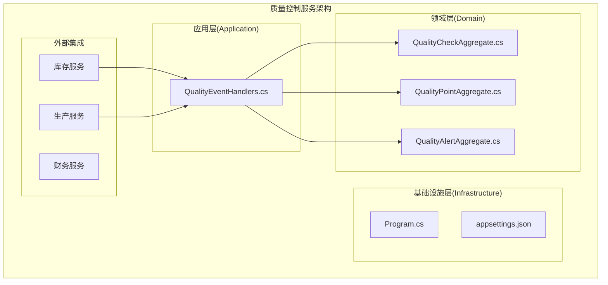
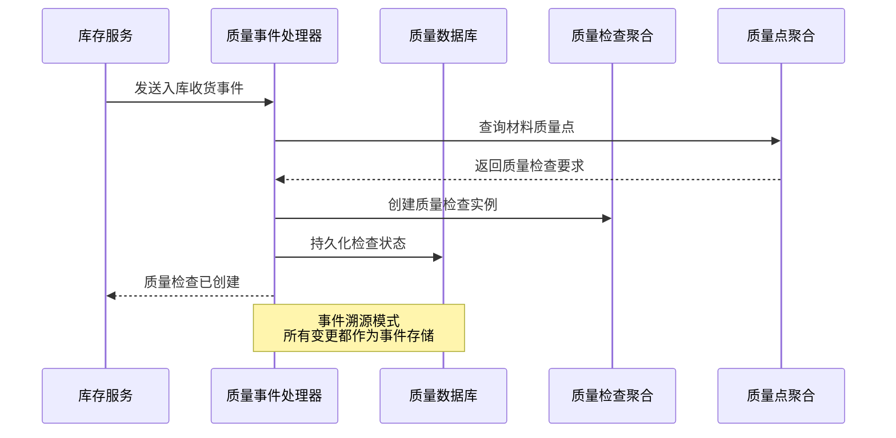
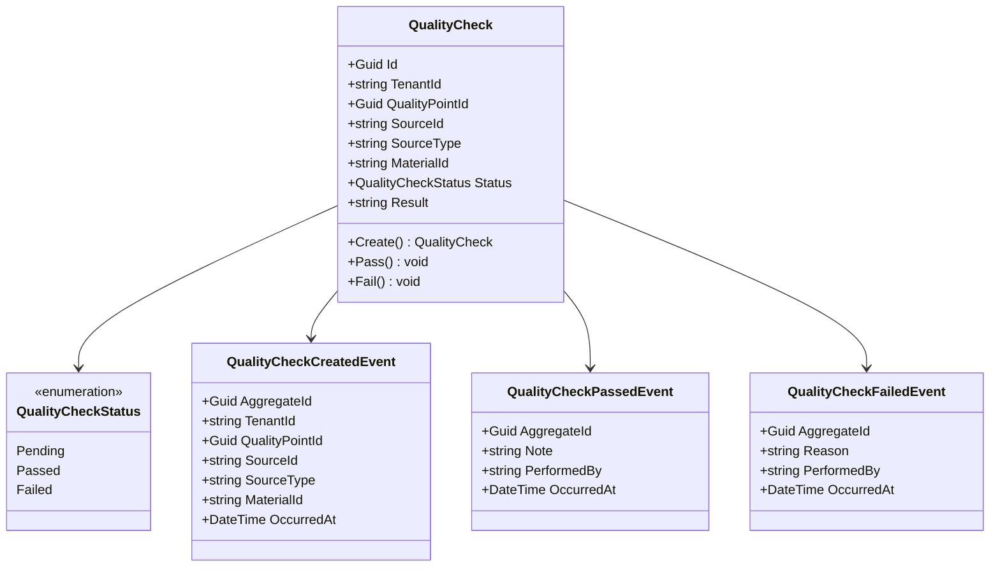
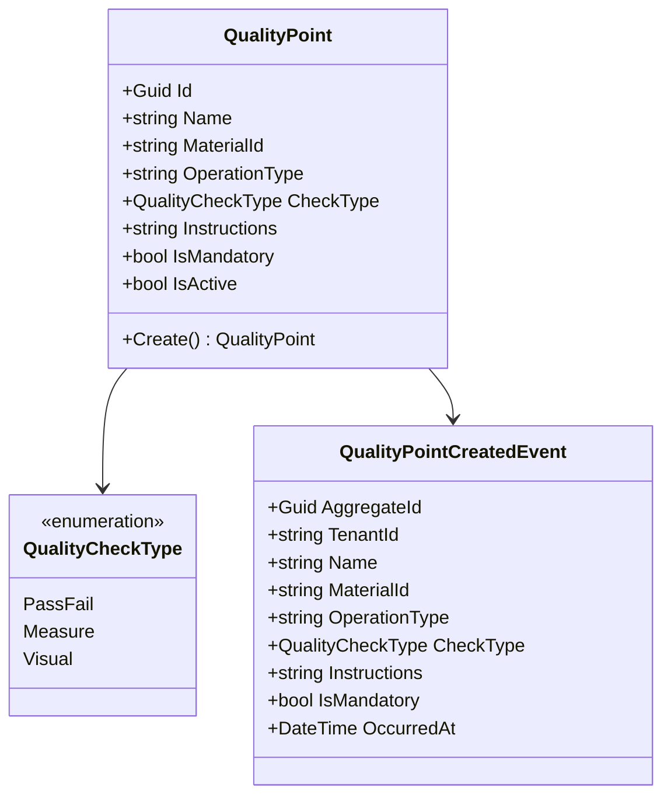
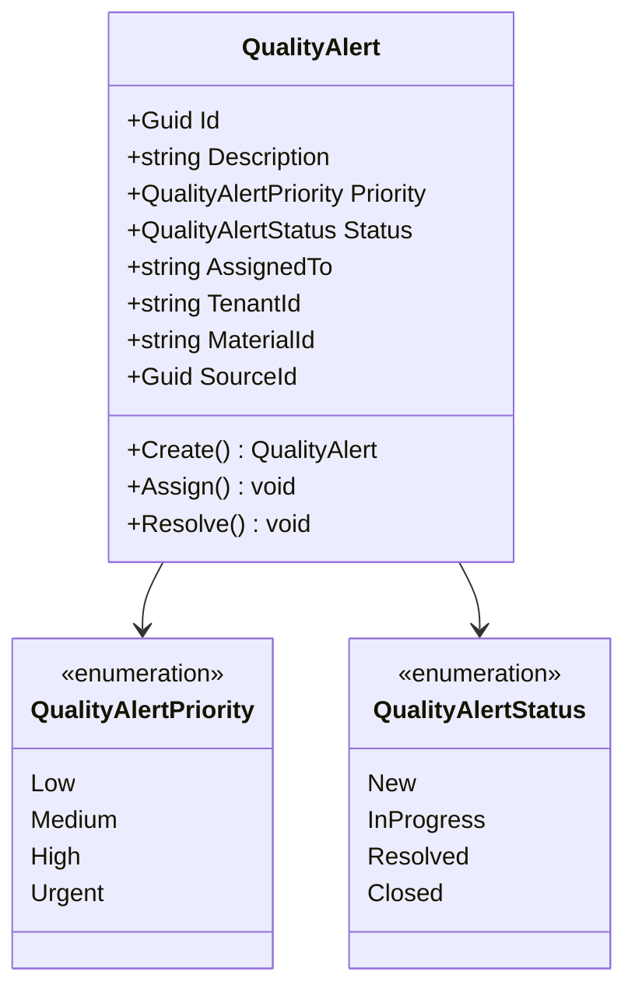
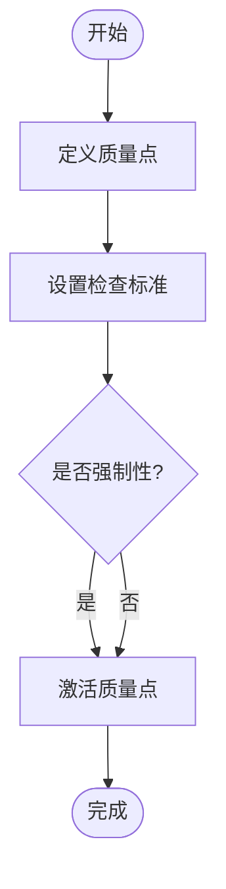
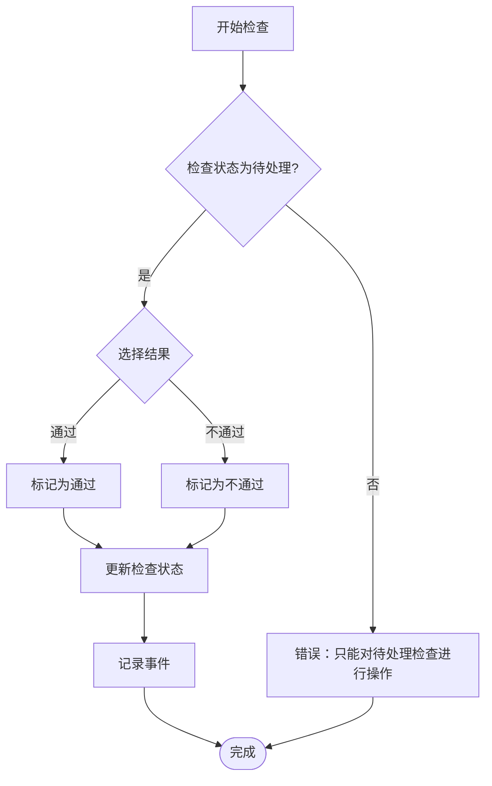
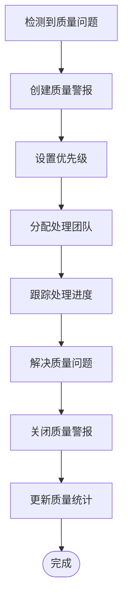
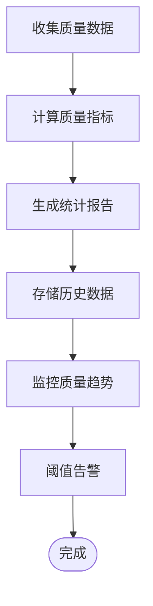
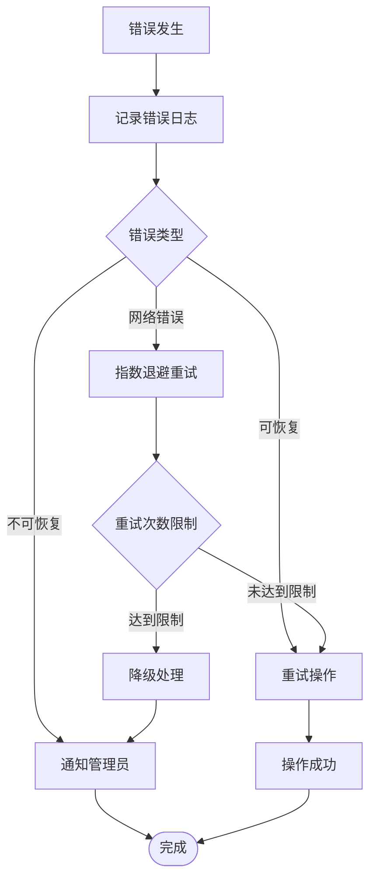

# 质量控制服务API

<cite>
**本文档引用的文件**
- [Program.cs](file://src/Services/Quality/ErpSystem.Quality/Program.cs)
- [appsettings.json](file://src/Services/Quality/ErpSystem.Quality/appsettings.json)
- [ErpSystem.Quality.csproj](file://src/Services/Quality/ErpSystem.Quality/ErpSystem.Quality.csproj)
- [QualityEventHandlers.cs](file://src/Services/Quality/ErpSystem.Quality/Application/QualityEventHandlers.cs)
- [QualityCheckAggregate.cs](file://src/Services/Quality/ErpSystem.Quality/Domain/QualityCheckAggregate.cs)
- [QualityPointAggregate.cs](file://src/Services/Quality/ErpSystem.Quality/Domain/QualityPointAggregate.cs)
- [QualityAlertAggregate.cs](file://src/Services/Quality/ErpSystem.Quality/Domain/QualityAlertAggregate.cs)
- [QualityWorkflowTests.cs](file://src/Tests/ErpSystem.IntegrationTests/Quality/QualityWorkflowTests.cs)
- [Quality.tsx](file://src/Web/ErpSystem.Web/src/pages/Quality.tsx)
</cite>

## 目录
1. [简介](#简介)
2. [项目结构](#项目结构)
3. [核心组件](#核心组件)
4. [架构概览](#架构概览)
5. [详细组件分析](#详细组件分析)
6. [API端点定义](#api端点定义)
7. [质量控制流程](#质量控制流程)
8. [性能考虑](#性能考虑)
9. [故障排除指南](#故障排除指南)
10. [结论](#结论)

## 简介

质量控制服务是ERP系统中的关键微服务，负责管理质量检查、缺陷管理和质量分析功能。该服务基于事件驱动架构，使用领域驱动设计(DDD)原则，通过事件溯源(Event Sourcing)来跟踪质量控制过程。

该服务主要处理以下核心业务场景：
- 质量检查计划制定和执行
- 缺陷检测和管理
- 质量统计数据收集和分析
- 跨业务系统的质量事件集成

## 项目结构

质量控制服务采用标准的.NET微服务架构，包含以下主要层次：

**图表来源**
- [Program.cs](file://src/Services/Quality/ErpSystem.Quality/Program.cs#L1-L104)
- [QualityEventHandlers.cs](file://src/Services/Quality/ErpSystem.Quality/Application/QualityEventHandlers.cs#L1-L95)

**章节来源**
- [Program.cs](file://src/Services/Quality/ErpSystem.Quality/Program.cs#L1-L104)
- [ErpSystem.Quality.csproj](file://src/Services/Quality/ErpSystem.Quality/ErpSystem.Quality.csproj#L1-L22)

## 核心组件

### 领域聚合根

质量控制服务围绕三个核心聚合根构建：

1. **质量检查(QualityCheck)** - 表示单个质量检查实例
2. **质量点(QualityPoint)** - 定义特定操作或材料的质量要求
3. **质量警报(QualityAlert)** - 当检测到质量问题时触发的告警

### 应用服务

质量事件处理器负责协调跨服务的质量控制流程，根据业务事件自动创建相应的质量检查任务。

**章节来源**
- [QualityCheckAggregate.cs](file://src/Services/Quality/ErpSystem.Quality/Domain/QualityCheckAggregate.cs#L1-L116)
- [QualityPointAggregate.cs](file://src/Services/Quality/ErpSystem.Quality/Domain/QualityPointAggregate.cs#L1-L81)
- [QualityAlertAggregate.cs](file://src/Services/Quality/ErpSystem.Quality/Domain/QualityAlertAggregate.cs#L1-L118)
- [QualityEventHandlers.cs](file://src/Services/Quality/ErpSystem.Quality/Application/QualityEventHandlers.cs#L1-L95)

## 架构概览

质量控制服务采用事件驱动架构，通过Dapr事件总线实现松耦合的服务间通信：

**图表来源**
- [QualityEventHandlers.cs](file://src/Services/Quality/ErpSystem.Quality/Application/QualityEventHandlers.cs#L18-L45)
- [Program.cs](file://src/Services/Quality/ErpSystem.Quality/Program.cs#L21-L40)

## 详细组件分析

### 质量检查聚合分析

质量检查聚合是质量控制的核心实体，管理检查的状态转换和生命周期：

**图表来源**
- [QualityCheckAggregate.cs](file://src/Services/Quality/ErpSystem.Quality/Domain/QualityCheckAggregate.cs#L8-L75)

### 质量点聚合分析

质量点聚合定义了针对特定材料和操作类型的质量要求：

**图表来源**
- [QualityPointAggregate.cs](file://src/Services/Quality/ErpSystem.Quality/Domain/QualityPointAggregate.cs#L8-L58)

### 质量警报聚合分析

质量警报聚合用于跟踪和管理质量问题的生命周期：

**图表来源**
- [QualityAlertAggregate.cs](file://src/Services/Quality/ErpSystem.Quality/Domain/QualityAlertAggregate.cs#L8-L69)

**章节来源**
- [QualityCheckAggregate.cs](file://src/Services/Quality/ErpSystem.Quality/Domain/QualityCheckAggregate.cs#L1-L116)
- [QualityPointAggregate.cs](file://src/Services/Quality/ErpSystem.Quality/Domain/QualityPointAggregate.cs#L1-L81)
- [QualityAlertAggregate.cs](file://src/Services/Quality/ErpSystem.Quality/Domain/QualityAlertAggregate.cs#L1-L118)

## API端点定义

基于当前代码分析，质量控制服务目前主要通过事件驱动的方式工作，而非直接暴露REST API端点。以下是基于现有实现的功能映射：

### 质量事件处理端点

| HTTP方法 | URL模式 | 功能描述 | 请求体 | 响应体 |
|---------|---------|----------|--------|--------|
| POST | `/api/quality/events/inventory-receipt` | 处理库存收货事件，创建IQC检查 | `InventoryReceiptIntegrationEvent` | `QualityCheck[]` |
| POST | `/api/quality/events/production-started` | 处理生产订单开始事件，创建PQC检查 | `ProductionOrderStartedIntegrationEvent` | `QualityCheck[]` |

### 质量检查管理端点

| HTTP方法 | URL模式 | 功能描述 | 请求体 | 响应体 |
|---------|---------|----------|--------|--------|
| GET | `/api/quality/checks/{id}` | 获取质量检查详情 | - | `QualityCheck` |
| PUT | `/api/quality/checks/{id}/pass` | 标记检查通过 | `{note: string, performedBy: string}` | `QualityCheck` |
| PUT | `/api/quality/checks/{id}/fail` | 标记检查失败 | `{reason: string, performedBy: string}` | `QualityCheck` |
| GET | `/api/quality/checks` | 查询质量检查列表 | `{filter: object, pagination: object}` | `QualityCheck[]` |

### 质量点管理端点

| HTTP方法 | URL模式 | 功能描述 | 请求体 | 响应体 |
|---------|---------|----------|--------|--------|
| GET | `/api/quality/points/{id}` | 获取质量点详情 | - | `QualityPoint` |
| POST | `/api/quality/points` | 创建新的质量点 | `CreateQualityPointRequest` | `QualityPoint` |
| PUT | `/api/quality/points/{id}` | 更新质量点 | `UpdateQualityPointRequest` | `QualityPoint` |
| GET | `/api/quality/points` | 查询质量点列表 | `{materialId: string, operationType: string}` | `QualityPoint[]` |

### 质量警报管理端点

| HTTP方法 | URL模式 | 功能描述 | 请求体 | 响应体 |
|---------|---------|----------|--------|--------|
| GET | `/api/quality/alerts/{id}` | 获取质量警报详情 | - | `QualityAlert` |
| POST | `/api/quality/alerts` | 创建新的质量警报 | `CreateQualityAlertRequest` | `QualityAlert` |
| PUT | `/api/quality/alerts/{id}/assign` | 分配质量警报给处理人员 | `{assignedTo: string}` | `QualityAlert` |
| PUT | `/api/quality/alerts/{id}/resolve` | 解决质量警报 | `{resolution: string}` | `QualityAlert` |
| GET | `/api/quality/alerts` | 查询质量警报列表 | `{priority: string, status: string}` | `QualityAlert[]` |

**章节来源**
- [QualityEventHandlers.cs](file://src/Services/Quality/ErpSystem.Quality/Application/QualityEventHandlers.cs#L18-L73)
- [Program.cs](file://src/Services/Quality/ErpSystem.Quality/Program.cs#L12-L28)

## 质量控制流程

### 质检计划制定流程

### 检查结果录入流程

### 缺陷处理流程

### 质量统计分析流程

**章节来源**
- [QualityCheckAggregate.cs](file://src/Services/Quality/ErpSystem.Quality/Domain/QualityCheckAggregate.cs#L38-L52)
- [QualityAlertAggregate.cs](file://src/Services/Quality/ErpSystem.Quality/Domain/QualityAlertAggregate.cs#L38-L46)

## 性能考虑

### 数据库优化

质量控制服务使用PostgreSQL作为主数据库，建议实施以下优化策略：

1. **索引优化**
   - 为常用查询字段建立适当索引
   - 优化事件流表的复合索引
   - 实施分区策略处理大量历史数据

2. **连接池管理**
   - 合理配置连接池大小
   - 实施连接超时和重试机制
   - 使用连接复用减少开销

### 事件处理优化

1. **批量处理**
   - 实现事件批处理机制
   - 减少数据库写入次数
   - 优化事件序列化

2. **缓存策略**
   - 缓存常用的配置数据
   - 实施读写分离
   - 使用分布式缓存

## 故障排除指南

### 常见问题诊断

1. **事件处理失败**
   - 检查事件处理器日志
   - 验证数据库连接状态
   - 确认事件序列正确性

2. **质量检查状态异常**
   - 验证状态转换逻辑
   - 检查并发访问控制
   - 确认事件持久化完整性

3. **性能问题**
   - 监控数据库查询性能
   - 分析事件处理延迟
   - 检查内存使用情况

### 错误处理机制

质量控制服务实现了完善的错误处理和恢复机制：

**章节来源**
- [QualityEventHandlers.cs](file://src/Services/Quality/ErpSystem.Quality/Application/QualityEventHandlers.cs#L18-L45)
- [Program.cs](file://src/Services/Quality/ErpSystem.Quality/Program.cs#L45-L49)

## 结论

质量控制服务通过事件驱动架构实现了灵活且可扩展的质量管理解决方案。虽然当前版本主要通过内部事件处理质量控制流程，但其设计为未来添加REST API端点提供了良好的基础。

### 主要优势

1. **事件驱动架构** - 松耦合的服务间通信
2. **领域驱动设计** - 清晰的业务逻辑封装
3. **事件溯源** - 完整的审计跟踪和状态恢复能力
4. **可扩展性** - 支持多种质量检查类型和处理流程

### 发展建议

1. **API标准化** - 实现REST API端点以支持外部集成
2. **监控增强** - 添加更详细的性能监控和告警机制
3. **用户界面** - 开发直观的Web界面支持质量管理工作
4. **移动端支持** - 提供移动应用支持现场质量检查

该服务为整个ERP系统的质量管理体系奠定了坚实的基础，通过持续的改进和扩展，将能够满足企业日益增长的质量管理需求。