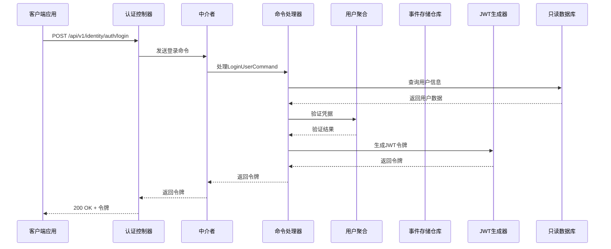
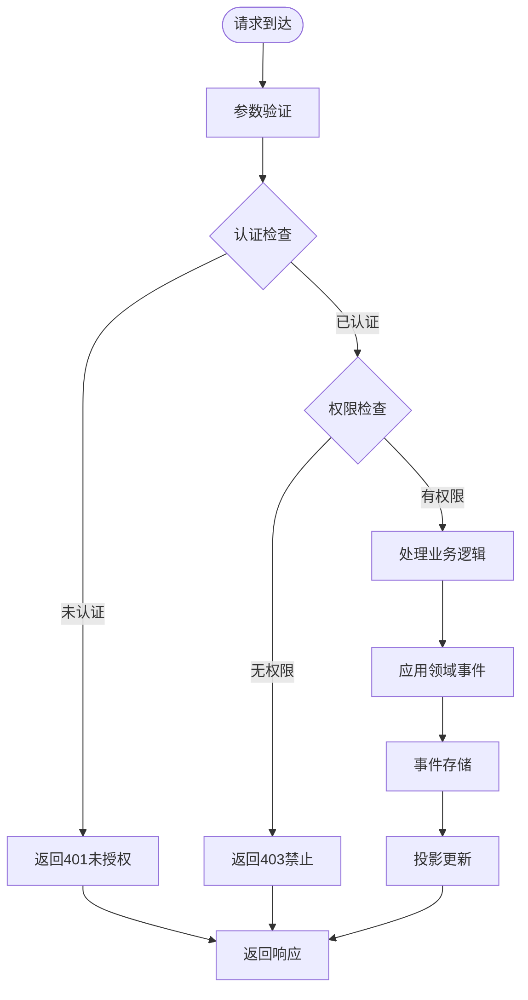
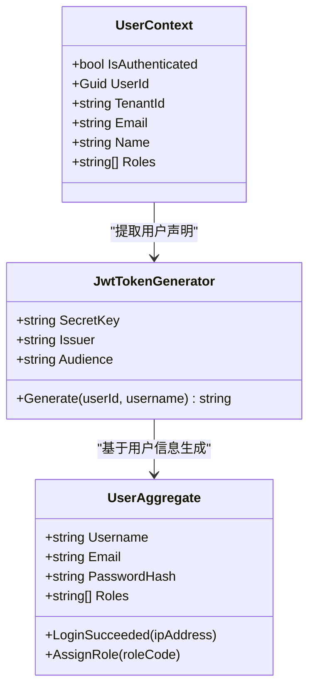
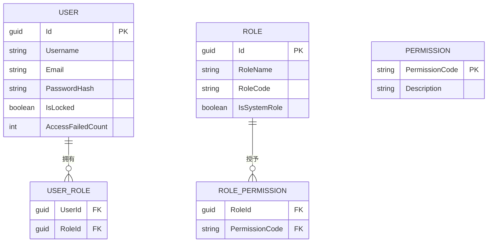
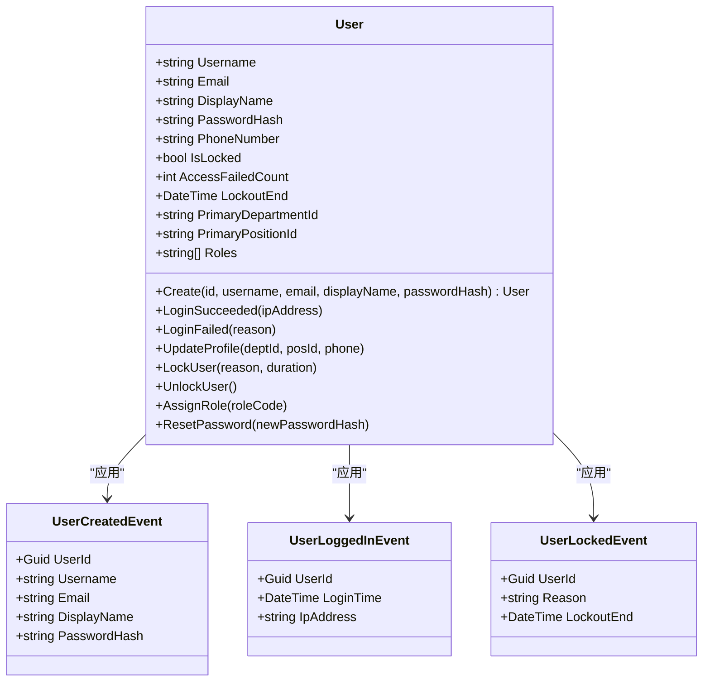
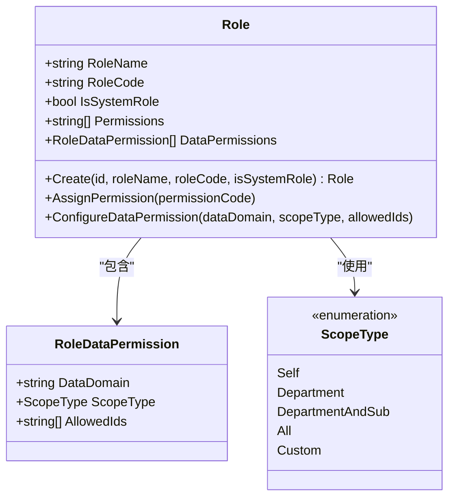
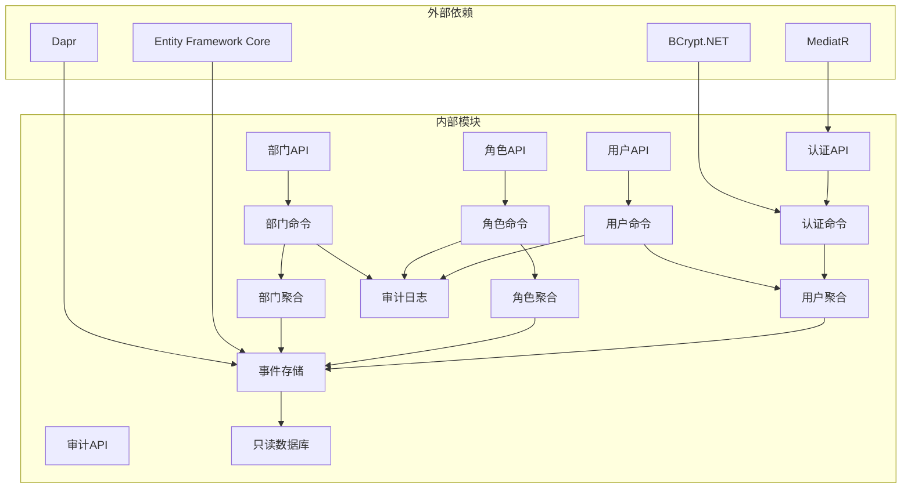
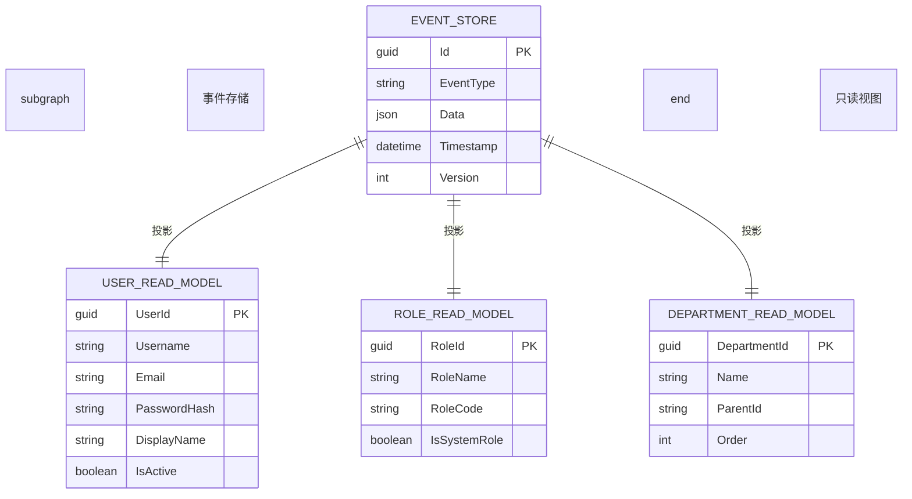
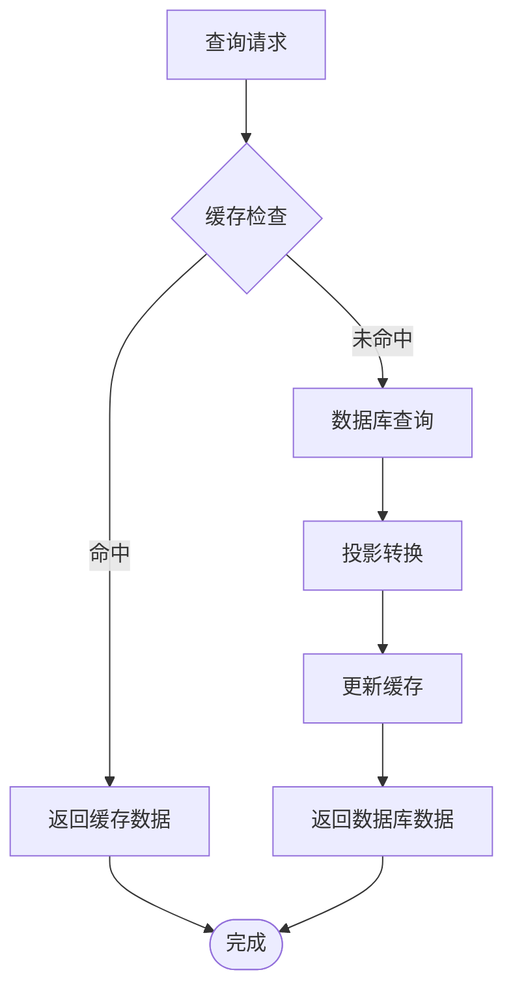

# 身份认证服务API

<cite>
**本文档引用的文件**
- [AuthController.cs](file://src/Services/Identity/ErpSystem.Identity/API/AuthController.cs)
- [UsersController.cs](file://src/Services/Identity/ErpSystem.Identity/API/UsersController.cs)
- [RolesController.cs](file://src/Services/Identity/ErpSystem.Identity/API/RolesController.cs)
- [DepartmentsController.cs](file://src/Services/Identity/ErpSystem.Identity/API/DepartmentsController.cs)
- [AuditController.cs](file://src/Services/Identity/ErpSystem.Identity/API/AuditController.cs)
- [FullIdentityCommands.cs](file://src/Services/Identity/ErpSystem.Identity/Application/FullIdentityCommands.cs)
- [UserEnhancementCommands.cs](file://src/Services/Identity/ErpSystem.Identity/Application/UserEnhancementCommands.cs)
- [JwtTokenGenerator.cs](file://src/Services/Identity/ErpSystem.Identity/Infrastructure/JwtTokenGenerator.cs)
- [UserAggregate.cs](file://src/Services/Identity/ErpSystem.Identity/Domain/UserAggregate.cs)
- [RoleAggregate.cs](file://src/Services/Identity/ErpSystem.Identity/Domain/RoleAggregate.cs)
- [DepartmentAggregate.cs](file://src/Services/Identity/ErpSystem.Identity/Domain/DepartmentAggregate.cs)
- [AuditLog.cs](file://src/BuildingBlocks/ErpSystem.BuildingBlocks/Auditing/AuditLog.cs)
- [UserContext.cs](file://src/BuildingBlocks/ErpSystem.BuildingBlocks/Auth/UserContext.cs)
- [IUserContext.cs](file://src/BuildingBlocks/ErpSystem.BuildingBlocks/Auth/IUserContext.cs)
- [Program.cs](file://src/Services/Identity/ErpSystem.Identity/Program.cs)
</cite>

## 目录
1. [简介](#简介)
2. [项目结构](#项目结构)
3. [核心组件](#核心组件)
4. [架构概览](#架构概览)
5. [详细组件分析](#详细组件分析)
6. [依赖关系分析](#依赖关系分析)
7. [性能考虑](#性能考虑)
8. [故障排除指南](#故障排除指南)
9. [结论](#结论)

## 简介

身份认证服务是ERP微服务系统中的核心组件，负责用户管理、角色权限控制、部门组织架构管理和审计日志记录。该服务采用CQRS（命令查询职责分离）模式和事件驱动架构，实现了完整的身份认证和授权机制。

本服务提供了REST API接口，支持用户注册、登录、用户管理、角色分配、部门组织架构管理等功能。系统使用JWT（JSON Web Token）进行认证，并通过RBAC（基于角色的访问控制）实现细粒度的权限管理。

## 项目结构

身份认证服务采用分层架构设计，主要包含以下层次：

```mermaid
graph TB
subgraph "表现层 (Presentation Layer)"
API[API Controllers]
Swagger[Swagger UI]
end
subgraph "应用层 (Application Layer)"
Commands[命令处理程序]
Queries[查询处理器]
Mediator[MediatR 中介者]
end
subgraph "领域层 (Domain Layer)"
Aggregates[聚合根]
Events[领域事件]
Enums[枚举类型]
end
subgraph "基础设施层 (Infrastructure Layer)"
Repositories[仓储实现]
DbContexts[数据库上下文]
JWT[JWT生成器]
Audit[Audit日志]
end
subgraph "构建块 (Building Blocks)"
Auth[认证上下文]
AuditBB[审计行为]
EventBus[事件总线]
end
API --> Mediator
Mediator --> Commands
Commands --> Aggregates
Aggregates --> Repositories
Repositories --> DbContexts
API --> Swagger
Mediator --> AuditBB
AuditBB --> Audit
```



**图表来源**
- [Program.cs](file://src/Services/Identity/ErpSystem.Identity/Program.cs#L1-L71)
- [AuthController.cs](file://src/Services/Identity/ErpSystem.Identity/API/AuthController.cs#L1-L32)

**章节来源**
- [Program.cs](file://src/Services/Identity/ErpSystem.Identity/Program.cs#L1-L71)

## 核心组件

### 认证控制器 (AuthController)

认证控制器提供用户注册和登录功能，是系统的主要入口点。

### 用户控制器 (UsersController)

用户控制器负责用户生命周期管理，包括创建、查询、更新用户信息、锁定/解锁用户以及角色分配。

### 角色控制器 (RolesController)

角色控制器管理角色和权限，支持角色创建、权限分配和数据权限配置。

### 部门控制器 (DepartmentsController)

部门控制器处理组织架构管理，包括部门创建、查询和移动操作。

### 审计控制器 (AuditController)

审计控制器提供审计日志查询功能，支持按时间范围和事件类型过滤。

**章节来源**
- [AuthController.cs](file://src/Services/Identity/ErpSystem.Identity/API/AuthController.cs#L1-L32)
- [UsersController.cs](file://src/Services/Identity/ErpSystem.Identity/API/UsersController.cs#L1-L56)
- [RolesController.cs](file://src/Services/Identity/ErpSystem.Identity/API/RolesController.cs#L1-L56)
- [DepartmentsController.cs](file://src/Services/Identity/ErpSystem.Identity/API/DepartmentsController.cs#L1-L37)
- [AuditController.cs](file://src/Services/Identity/ErpSystem.Identity/API/AuditController.cs#L1-L25)

## 架构概览

身份认证服务采用现代微服务架构，结合了多种设计模式和技术：



**图表来源**
- [AuthController.cs](file://src/Services/Identity/ErpSystem.Identity/API/AuthController.cs#L18-L30)
- [FullIdentityCommands.cs](file://src/Services/Identity/ErpSystem.Identity/Application/FullIdentityCommands.cs#L77-L89)
- [JwtTokenGenerator.cs](file://src/Services/Identity/ErpSystem.Identity/Infrastructure/JwtTokenGenerator.cs#L15-L36)

### 数据流架构



**图表来源**
- [UserContext.cs](file://src/BuildingBlocks/ErpSystem.BuildingBlocks/Auth/UserContext.cs#L1-L34)
- [AuditLog.cs](file://src/BuildingBlocks/ErpSystem.BuildingBlocks/Auditing/AuditLog.cs#L65-L101)

## 详细组件分析

### 认证与授权机制

#### JWT认证流程

系统使用JWT（JSON Web Token）进行状态无关的认证：



**图表来源**
- [JwtTokenGenerator.cs](file://src/Services/Identity/ErpSystem.Identity/Infrastructure/JwtTokenGenerator.cs#L8-L38)
- [UserContext.cs](file://src/BuildingBlocks/ErpSystem.BuildingBlocks/Auth/UserContext.cs#L6-L34)
- [UserAggregate.cs](file://src/Services/Identity/ErpSystem.Identity/Domain/UserAggregate.cs#L55-L164)

#### RBAC权限控制

系统实现基于角色的访问控制（RBAC）：



**图表来源**
- [RoleAggregate.cs](file://src/Services/Identity/ErpSystem.Identity/Domain/RoleAggregate.cs#L42-L94)
- [UserAggregate.cs](file://src/Services/Identity/ErpSystem.Identity/Domain/UserAggregate.cs#L55-L164)

**章节来源**
- [JwtTokenGenerator.cs](file://src/Services/Identity/ErpSystem.Identity/Infrastructure/JwtTokenGenerator.cs#L1-L38)
- [UserContext.cs](file://src/BuildingBlocks/ErpSystem.BuildingBlocks/Auth/UserContext.cs#L1-L34)
- [IUserContext.cs](file://src/BuildingBlocks/ErpSystem.BuildingBlocks/Auth/IUserContext.cs#L1-L12)
- [RoleAggregate.cs](file://src/Services/Identity/ErpSystem.Identity/Domain/RoleAggregate.cs#L1-L94)
- [UserAggregate.cs](file://src/Services/Identity/ErpSystem.Identity/Domain/UserAggregate.cs#L1-L164)

### 用户管理API

#### 用户注册

**HTTP方法**: POST  
**URL**: `/api/v1/identity/auth/register`  
**请求体**: 
```json
{
  "username": "string",
  "email": "string", 
  "password": "string",
  "displayName": "string"
}
```

**响应**: 
```json
{
  "userId": "guid"
}
```

#### 用户登录

**HTTP方法**: POST  
**URL**: `/api/v1/identity/auth/login`  
**请求体**: 
```json
{
  "username": "string",
  "password": "string"
}
```

**响应**: 
```json
{
  "token": "string"
}
```

#### 创建用户

**HTTP方法**: POST  
**URL**: `/api/v1/identity/users`  
**请求体**: RegisterUserCommand  
**响应**: 用户ID

#### 获取所有用户

**HTTP方法**: GET  
**URL**: `/api/v1/identity/users`  
**响应**: 用户列表

#### 获取指定用户

**HTTP方法**: GET  
**URL**: `/api/v1/identity/users/{id}`  
**路径参数**: id (用户ID)  
**响应**: 用户详情

#### 更新用户资料

**HTTP方法**: PUT  
**URL**: `/api/v1/identity/users/{id}/profile`  
**路径参数**: id (用户ID)  
**请求体**: 
```json
{
  "userId": "guid",
  "deptId": "string",
  "posId": "string", 
  "phone": "string"
}
```

#### 锁定用户

**HTTP方法**: POST  
**URL**: `/api/v1/identity/users/{id}/lock`  
**路径参数**: id (用户ID)  
**请求体**: 锁定原因字符串  
**响应**: 204 No Content

#### 解锁用户

**HTTP方法**: POST  
**URL**: `/api/v1/identity/users/{id}/unlock`  
**路径参数**: id (用户ID)  
**响应**: 204 No Content

#### 分配角色

**HTTP方法**: POST  
**URL**: `/api/v1/identity/users/{id}/roles`  
**路径参数**: id (用户ID)  
**请求体**: 角色代码字符串  
**响应**: 204 No Content

**章节来源**
- [AuthController.cs](file://src/Services/Identity/ErpSystem.Identity/API/AuthController.cs#L11-L30)
- [UsersController.cs](file://src/Services/Identity/ErpSystem.Identity/API/UsersController.cs#L13-L54)

### 角色管理API

#### 创建角色

**HTTP方法**: POST  
**URL**: `/api/v1/identity/roles`  
**请求体**: CreateRoleCommand  
**响应**: 角色ID

#### 获取所有角色

**HTTP方法**: GET  
**URL**: `/api/v1/identity/roles`  
**响应**: 角色列表

#### 分配权限

**HTTP方法**: POST  
**URL**: `/api/v1/identity/roles/{id}/permissions`  
**路径参数**: id (角色ID)  
**请求体**: 权限代码字符串  
**响应**: 204 No Content

#### 配置数据权限

**HTTP方法**: POST  
**URL**: `/api/v1/identity/roles/{id}/data-permissions`  
**路径参数**: id (角色ID)  
**请求体**: 
```json
{
  "roleId": "guid",
  "dataDomain": "string",
  "scopeType": "Self|Department|DepartmentAndSub|All|Custom",
  "allowedIds": ["string"]
}
```

#### 创建职位

**HTTP方法**: POST  
**URL**: `/api/v1/identity/positions`  
**请求体**: CreatePositionCommand  
**响应**: 职位ID

#### 获取所有职位

**HTTP方法**: GET  
**URL**: `/api/v1/identity/positions`  
**响应**: 职位列表

**章节来源**
- [RolesController.cs](file://src/Services/Identity/ErpSystem.Identity/API/RolesController.cs#L14-L55)

### 部门管理API

#### 创建部门

**HTTP方法**: POST  
**URL**: `/api/v1/identity/departments`  
**请求体**: CreateDepartmentCommand  
**响应**: 
```json
{
  "departmentId": "guid"
}
```

#### 获取所有部门

**HTTP方法**: GET  
**URL**: `/api/v1/identity/departments`  
**响应**: 部门列表（按顺序排序）

#### 移动部门

**HTTP方法**: POST  
**URL**: `/api/v1/identity/departments/{id}/move`  
**路径参数**: id (部门ID)  
**请求体**: MoveDepartmentCommand  
**响应**: 204 No Content

**章节来源**
- [DepartmentsController.cs](file://src/Services/Identity/ErpSystem.Identity/API/DepartmentsController.cs#L13-L35)

### 审计日志API

#### 查询审计日志

**HTTP方法**: GET  
**URL**: `/api/v1/identity/audit-logs`  
**查询参数**:
- `fromDate`: 开始日期 (可选)
- `toDate`: 结束日期 (可选)  
- `eventType`: 事件类型 (可选)

**响应**: 最近100条审计日志记录

**章节来源**
- [AuditController.cs](file://src/Services/Identity/ErpSystem.Identity/API/AuditController.cs#L11-L23)

### 领域模型分析

#### 用户聚合模型

用户聚合是身份认证的核心实体，包含用户的基本信息、认证状态和角色信息：



**图表来源**
- [UserAggregate.cs](file://src/Services/Identity/ErpSystem.Identity/Domain/UserAggregate.cs#L55-L164)

#### 角色聚合模型

角色聚合管理权限和数据访问控制：



**图表来源**
- [RoleAggregate.cs](file://src/Services/Identity/ErpSystem.Identity/Domain/RoleAggregate.cs#L42-L94)

**章节来源**
- [UserAggregate.cs](file://src/Services/Identity/ErpSystem.Identity/Domain/UserAggregate.cs#L1-L164)
- [RoleAggregate.cs](file://src/Services/Identity/ErpSystem.Identity/Domain/RoleAggregate.cs#L1-L94)

## 依赖关系分析

### 组件依赖图



**图表来源**
- [FullIdentityCommands.cs](file://src/Services/Identity/ErpSystem.Identity/Application/FullIdentityCommands.cs#L1-L124)
- [Program.cs](file://src/Services/Identity/ErpSystem.Identity/Program.cs#L20-L41)

### 数据持久化架构



**图表来源**
- [Program.cs](file://src/Services/Identity/ErpSystem.Identity/Program.cs#L21-L24)

**章节来源**
- [Program.cs](file://src/Services/Identity/ErpSystem.Identity/Program.cs#L1-L71)

## 性能考虑

### 缓存策略

系统建议实现多层缓存机制：
- **Redis缓存**: 用户会话和频繁访问的角色权限数据
- **EF Core二级缓存**: 只读数据的缓存
- **浏览器缓存**: 静态资源和非敏感数据

### 数据库优化



### 异步处理

系统大量使用异步编程模式：
- **异步数据库操作**: 使用async/await避免阻塞
- **异步事件处理**: 事件发布订阅采用异步模式
- **异步文件操作**: 日志和审计数据的异步写入

## 故障排除指南

### 常见认证问题

#### 登录失败

**可能原因**:
1. 用户名或密码错误
2. 用户账户被锁定
3. 密码哈希验证失败

**解决方案**:
1. 检查用户名和密码是否正确
2. 查看用户锁定状态
3. 验证密码哈希算法

#### JWT令牌问题

**可能原因**:
1. 令牌过期
2. 签名密钥不匹配
3. 令牌格式错误

**解决方案**:
1. 重新登录获取新令牌
2. 检查服务器配置的密钥
3. 验证令牌格式和签名

### 权限访问问题

#### 403禁止访问

**可能原因**:
1. 用户没有目标资源的权限
2. 角色权限配置错误
3. 数据权限限制

**解决方案**:
1. 检查用户角色和权限映射
2. 验证角色的数据权限配置
3. 确认用户的部门层级权限

#### 401未授权

**可能原因**:
1. 缺少认证令牌
2. 令牌无效或过期
3. 请求头格式错误

**解决方案**:
1. 在请求头中添加Authorization: Bearer {token}
2. 验证令牌的有效性和过期时间
3. 检查令牌的签发机构和受众

**章节来源**
- [FullIdentityCommands.cs](file://src/Services/Identity/ErpSystem.Identity/Application/FullIdentityCommands.cs#L77-L89)
- [UserEnhancementCommands.cs](file://src/Services/Identity/ErpSystem.Identity/Application/UserEnhancementCommands.cs#L23-L62)

## 结论

身份认证服务提供了完整的企业级身份管理和权限控制解决方案。通过采用CQRS、事件驱动架构和RBAC模型，系统实现了高内聚、低耦合的设计，支持复杂的业务场景和扩展需求。

### 主要特性总结

1. **完整的认证体系**: 支持用户注册、登录、会话管理
2. **细粒度权限控制**: 基于角色的访问控制和数据权限
3. **事件驱动架构**: 基于事件的领域建模和数据一致性
4. **审计追踪**: 全面的审计日志记录和查询功能
5. **高性能设计**: 异步处理、缓存策略和数据库优化

### 安全最佳实践

1. **令牌安全管理**: 使用强密钥、合理设置过期时间
2. **输入验证**: 严格的参数验证和SQL注入防护
3. **权限最小化**: 基于需要的最小权限原则
4. **审计监控**: 完整的操作日志和异常监控
5. **数据加密**: 敏感数据的加密存储和传输

该服务为整个ERP系统的其他微服务提供了可靠的身份认证和授权基础，确保了企业级应用的安全性和可扩展性。