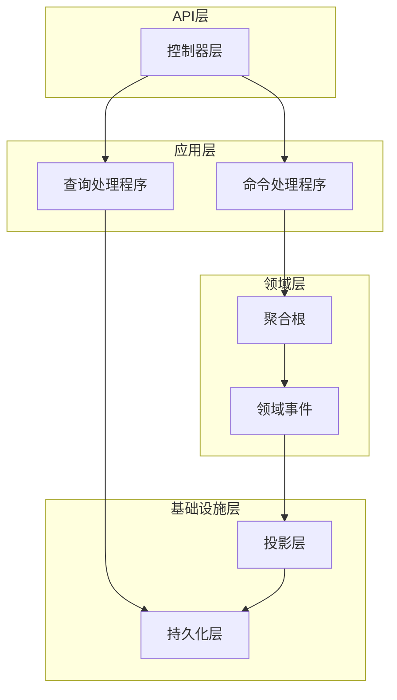
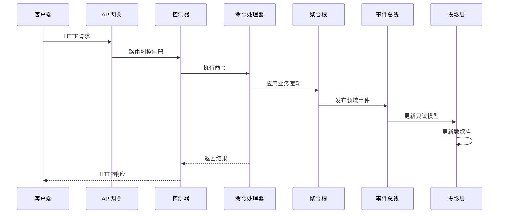
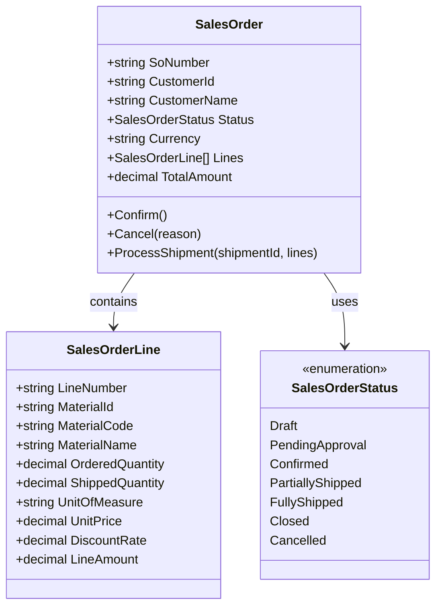
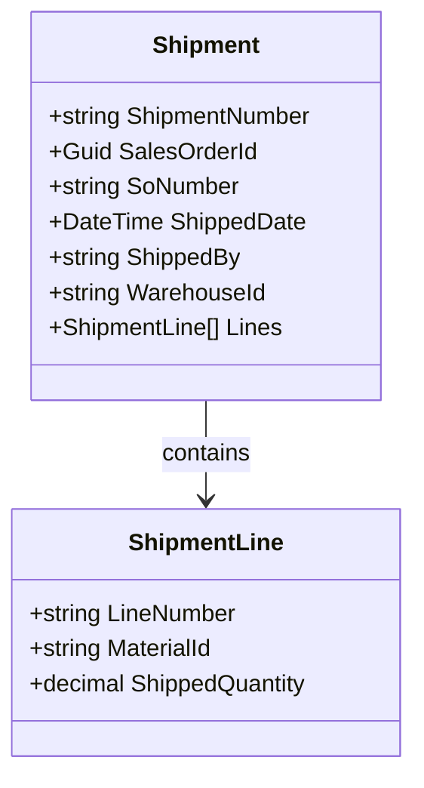
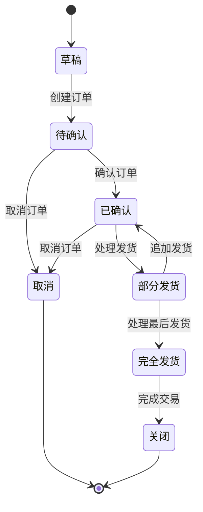
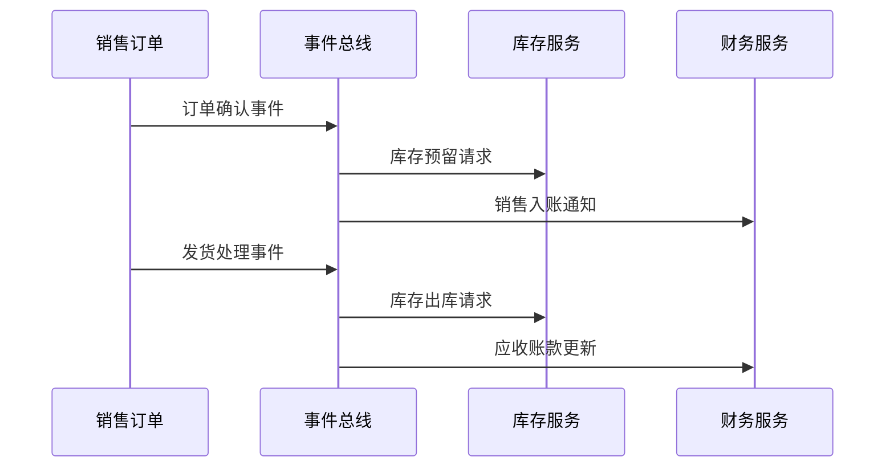
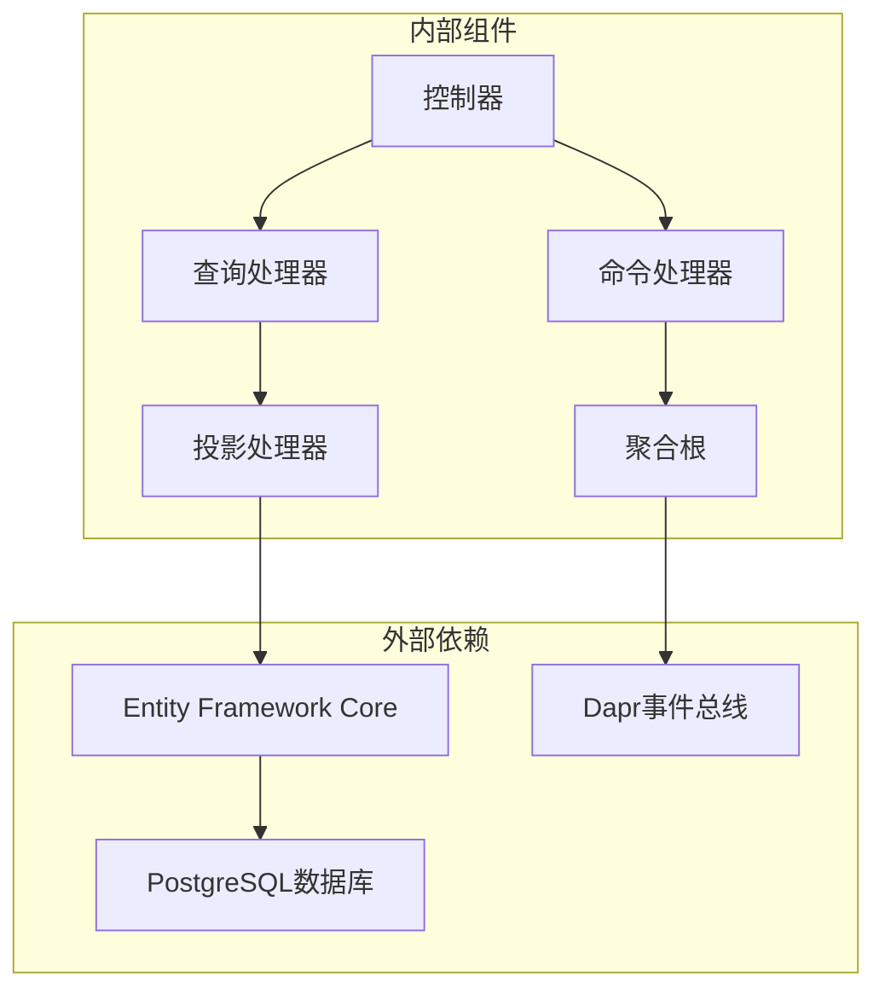

# 销售管理服务API

<cite>
**本文档引用的文件**
- [SalesOrdersController.cs](file://src/Services/Sales/ErpSystem.Sales/API/SalesOrdersController.cs)
- [ShipmentCommands.cs](file://src/Services/Sales/ErpSystem.Sales/Application/ShipmentCommands.cs)
- [SalesOrderCommands.cs](file://src/Services/Sales/ErpSystem.Sales/Application/SalesOrderCommands.cs)
- [SalesQueries.cs](file://src/Services/Sales/ErpSystem.Sales/Application/SalesQueries.cs)
- [SalesOrderAggregate.cs](file://src/Services/Sales/ErpSystem.Sales/Domain/SalesOrderAggregate.cs)
- [ShipmentAggregate.cs](file://src/Services/Sales/ErpSystem.Sales/Domain/ShipmentAggregate.cs)
- [SalesEvents.cs](file://src/Services/Sales/ErpSystem.Sales/Domain/SalesEvents.cs)
- [Persistence.cs](file://src/Services/Sales/ErpSystem.Sales/Infrastructure/Persistence.cs)
- [Projections.cs](file://src/Services/Sales/ErpSystem.Sales/Infrastructure/Projections.cs)
- [Program.cs](file://src/Services/Sales/ErpSystem.Sales/Program.cs)
- [appsettings.json](file://src/Services/Sales/ErpSystem.Sales/appsettings.json)
</cite>

## 目录
1. [简介](#简介)
2. [项目结构](#项目结构)
3. [核心组件](#核心组件)
4. [架构概览](#架构概览)
5. [详细组件分析](#详细组件分析)
6. [依赖关系分析](#依赖关系分析)
7. [性能考虑](#性能考虑)
8. [故障排除指南](#故障排除指南)
9. [结论](#结论)

## 简介

销售管理服务是一个基于事件驱动架构的企业资源规划(ERP)系统微服务，专门负责处理销售业务流程。该服务实现了完整的销售订单管理、发货处理、客户信用控制和应收账款管理功能。

本服务采用领域驱动设计(DDD)和命令查询职责分离(CQRS)模式，通过事件溯源(event sourcing)技术实现数据持久化，确保业务流程的完整性和可追溯性。服务支持实时发货通知、库存预留、财务集成等企业级功能。

## 项目结构

销售管理服务采用清晰的分层架构，包含以下主要模块：

**图表来源**
- [Program.cs](file://src/Services/Sales/ErpSystem.Sales/Program.cs#L1-L72)
- [Persistence.cs](file://src/Services/Sales/ErpSystem.Sales/Infrastructure/Persistence.cs#L1-L56)

**章节来源**
- [Program.cs](file://src/Services/Sales/ErpSystem.Sales/Program.cs#L1-L72)
- [appsettings.json](file://src/Services/Sales/ErpSystem.Sales/appsettings.json#L1-L12)

## 核心组件

### 销售订单管理
销售订单是整个销售流程的核心实体，支持从草稿到完成的完整生命周期管理。订单状态包括草稿、待确认、已确认、部分发货、完全发货、关闭和取消等状态。

### 发货管理
发货模块负责处理实际的商品出库操作，与销售订单形成关联，确保库存管理和财务结算的准确性。

### 集成事件系统
通过发布领域事件实现与其他服务的松耦合集成，支持库存预留、财务入账等跨服务协作。

**章节来源**
- [SalesOrderAggregate.cs](file://src/Services/Sales/ErpSystem.Sales/Domain/SalesOrderAggregate.cs#L1-L148)
- [ShipmentAggregate.cs](file://src/Services/Sales/ErpSystem.Sales/Domain/ShipmentAggregate.cs#L1-L61)

## 架构概览

销售管理服务采用现代微服务架构，结合事件驱动和CQRS模式：

**图表来源**
- [SalesOrderCommands.cs](file://src/Services/Sales/ErpSystem.Sales/Application/SalesOrderCommands.cs#L20-L67)
- [Projections.cs](file://src/Services/Sales/ErpSystem.Sales/Infrastructure/Projections.cs#L7-L88)

## 详细组件分析

### 销售订单API

#### 订单创建
- **HTTP方法**: POST
- **URL模式**: `/api/v1/sales/orders`
- **请求体**: 包含客户信息、订单日期、货币和订单明细
- **响应**: 返回新创建订单的唯一标识符

#### 订单查询
- **HTTP方法**: GET
- **URL模式**: `/api/v1/sales/orders/{id}`
- **路径参数**: 订单ID
- **响应**: 返回指定订单的完整信息

#### 订单搜索
- **HTTP方法**: GET
- **URL模式**: `/api/v1/sales/orders`
- **查询参数**: 
  - `customerId`: 客户ID过滤
  - `status`: 订单状态过滤
  - `page`: 分页页码，默认1
- **响应**: 返回订单列表

#### 订单确认
- **HTTP方法**: POST
- **URL模式**: `/api/v1/sales/orders/{id}/confirm`
- **路径参数**: 订单ID
- **查询参数**: `warehouseId`: 仓库ID
- **响应**: 确认结果

#### 订单取消
- **HTTP方法**: POST
- **URL模式**: `/api/v1/sales/orders/{id}/cancel`
- **路径参数**: 订单ID
- **请求体**: 取消原因
- **响应**: 取消结果

#### 可开票明细查询
- **HTTP方法**: GET
- **URL模式**: `/api/v1/sales/orders/{id}/billable-lines`
- **路径参数**: 订单ID
- **响应**: 返回可用于开票的明细信息

**章节来源**
- [SalesOrdersController.cs](file://src/Services/Sales/ErpSystem.Sales/API/SalesOrdersController.cs#L1-L45)
- [SalesQueries.cs](file://src/Services/Sales/ErpSystem.Sales/Application/SalesQueries.cs#L1-L78)

### 发货管理API

#### 发货创建
- **HTTP方法**: POST
- **URL模式**: `/api/v1/sales/shipments`
- **请求体**: 包含销售订单ID、发货日期、发货人、仓库ID和发货明细
- **响应**: 返回新创建发货单的唯一标识符

**章节来源**
- [SalesOrdersController.cs](file://src/Services/Sales/ErpSystem.Sales/API/SalesOrdersController.cs#L38-L45)
- [ShipmentCommands.cs](file://src/Services/Sales/ErpSystem.Sales/Application/ShipmentCommands.cs#L1-L61)

### 数据模型

#### 销售订单聚合

**图表来源**
- [SalesOrderAggregate.cs](file://src/Services/Sales/ErpSystem.Sales/Domain/SalesOrderAggregate.cs#L67-L148)

#### 发货聚合

**图表来源**
- [ShipmentAggregate.cs](file://src/Services/Sales/ErpSystem.Sales/Domain/ShipmentAggregate.cs#L21-L61)

### 业务流程控制

#### 销售订单状态流转

**图表来源**
- [SalesOrderAggregate.cs](file://src/Services/Sales/ErpSystem.Sales/Domain/SalesOrderAggregate.cs#L5-L14)

#### 集成事件流

**图表来源**
- [SalesEvents.cs](file://src/Services/Sales/ErpSystem.Sales/Domain/SalesEvents.cs#L5-L32)

**章节来源**
- [SalesOrderAggregate.cs](file://src/Services/Sales/ErpSystem.Sales/Domain/SalesOrderAggregate.cs#L91-L111)
- [SalesEvents.cs](file://src/Services/Sales/ErpSystem.Sales/Domain/SalesEvents.cs#L1-L32)

## 依赖关系分析

销售管理服务的依赖关系呈现清晰的层次化结构：

**图表来源**
- [Program.cs](file://src/Services/Sales/ErpSystem.Sales/Program.cs#L15-L46)
- [Persistence.cs](file://src/Services/Sales/ErpSystem.Sales/Infrastructure/Persistence.cs#L6-L30)

**章节来源**
- [Program.cs](file://src/Services/Sales/ErpSystem.Sales/Program.cs#L1-L72)
- [Persistence.cs](file://src/Services/Sales/ErpSystem.Sales/Infrastructure/Persistence.cs#L1-L56)

## 性能考虑

### 数据库优化
- 使用JSONB字段存储复杂的数据结构
- 实现读写分离，查询使用只读数据库
- 采用批量操作减少数据库往返

### 缓存策略
- 事件溯源存储优化查询性能
- 投影层维护实时的只读视图
- 合理的索引设计支持高频查询

### 事件处理
- 异步事件处理避免阻塞主流程
- 事件重试机制确保可靠性
- 事件去重防止重复处理

## 故障排除指南

### 常见错误及解决方案

#### 订单状态异常
**问题**: 订单状态无法正常转换
**原因**: 业务规则验证失败或并发修改冲突
**解决**: 检查订单当前状态，确保遵循状态转换规则

#### 发货处理失败
**问题**: 发货创建时出现订单不存在
**原因**: 销售订单ID无效或订单已被删除
**解决**: 验证订单ID有效性，检查订单状态是否允许发货

#### 数据一致性问题
**问题**: 查询结果与最新状态不一致
**原因**: 投影层更新延迟
**解决**: 等待事件处理完成或直接查询事件存储

**章节来源**
- [SalesOrderCommands.cs](file://src/Services/Sales/ErpSystem.Sales/Application/SalesOrderCommands.cs#L34-L65)
- [ShipmentCommands.cs](file://src/Services/Sales/ErpSystem.Sales/Application/ShipmentCommands.cs#L22-L44)

## 结论

销售管理服务提供了完整的企业级销售业务解决方案，具有以下特点：

### 核心优势
- **事件驱动架构**: 通过事件溯源实现业务流程的完整记录和可追溯性
- **状态管理**: 完善的订单状态机确保业务流程的正确执行
- **集成能力**: 通过事件总线与其他服务实现松耦合集成
- **扩展性**: 模块化设计支持功能扩展和定制

### 技术特色
- **CQRS模式**: 命令和查询分离，优化不同场景的性能
- **领域驱动设计**: 业务逻辑集中在领域模型中
- **异步处理**: 支持高并发和实时响应
- **数据一致性**: 通过事件驱动确保跨服务的数据一致性

该服务为企业提供了可靠的销售管理基础，支持复杂的业务场景和未来的功能扩展需求。