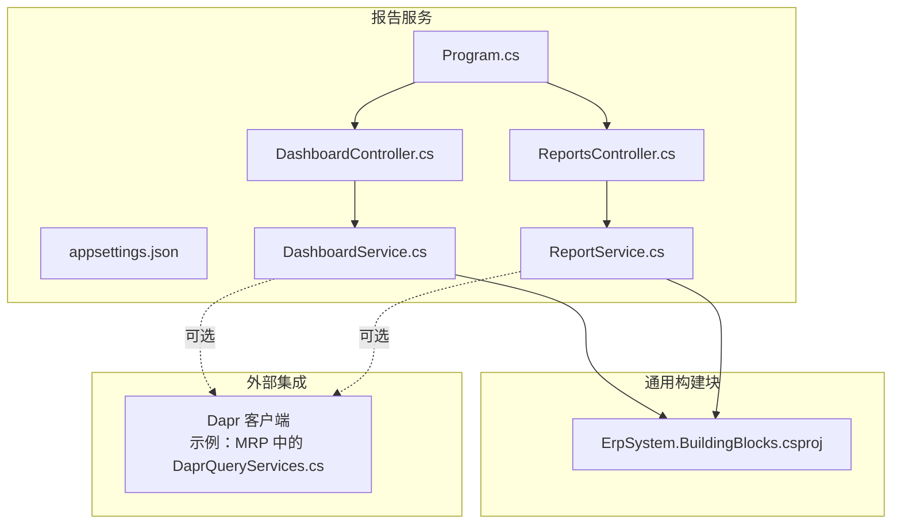
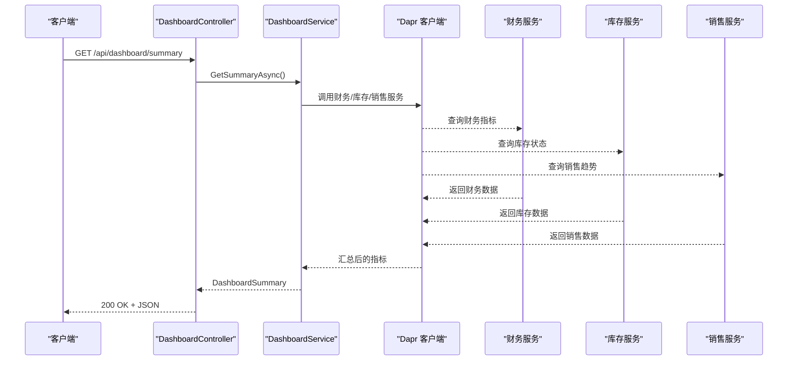
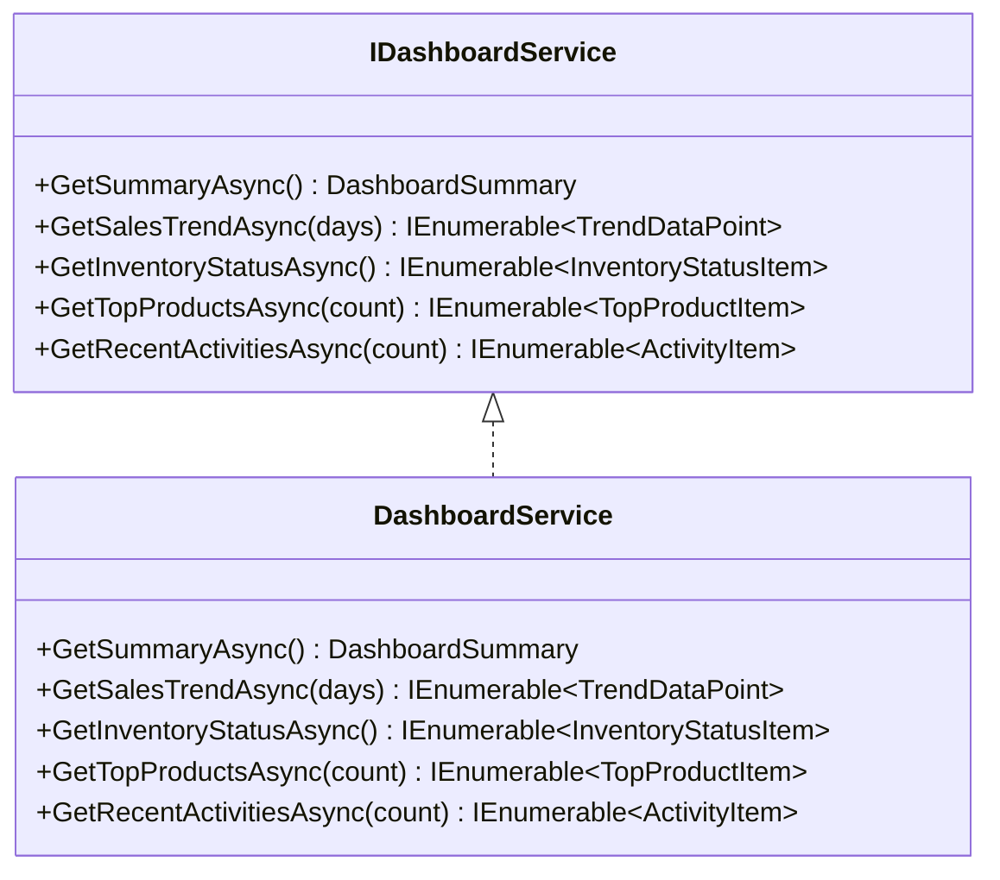
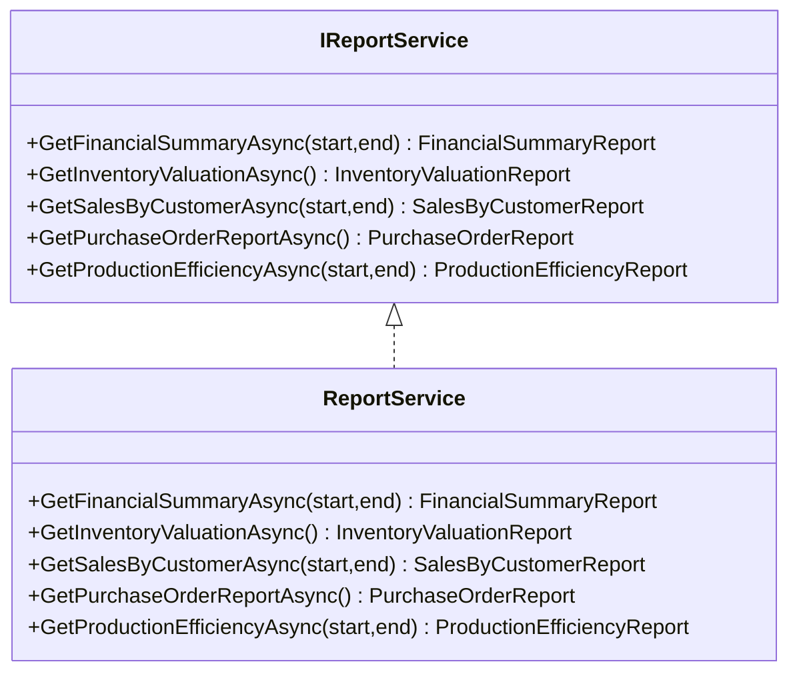
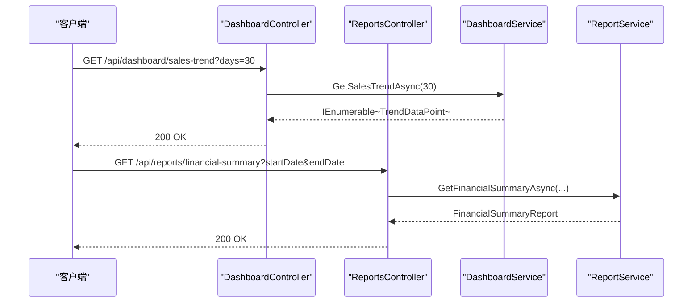
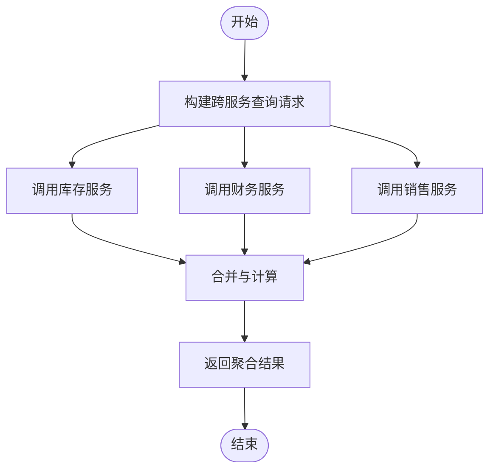
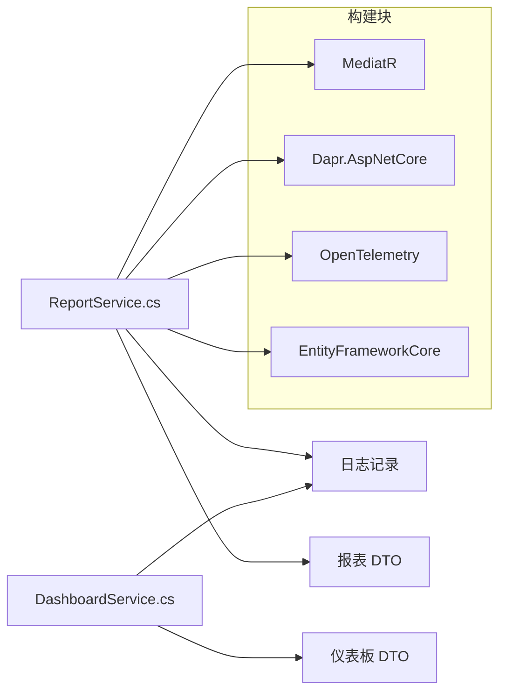

# 报告服务

<cite>
**本文引用的文件**
- [ErpSystem.Reporting.csproj](file://src/Services/Reporting/ErpSystem.Reporting/ErpSystem.Reporting.csproj)
- [Program.cs](file://src/Services/Reporting/ErpSystem.Reporting/Program.cs)
- [appsettings.json](file://src/Services/Reporting/ErpSystem.Reporting/appsettings.json)
- [DashboardController.cs](file://src/Services/Reporting/ErpSystem.Reporting/Controllers/DashboardController.cs)
- [ReportsController.cs](file://src/Services/Reporting/ErpSystem.Reporting/Controllers/ReportsController.cs)
- [DashboardService.cs](file://src/Services/Reporting/ErpSystem.Reporting/Application/DashboardService.cs)
- [ReportService.cs](file://src/Services/Reporting/ErpSystem.Reporting/Application/ReportService.cs)
- [ErpSystem.BuildingBlocks.csproj](file://src/BuildingBlocks/ErpSystem.BuildingBlocks/ErpSystem.BuildingBlocks.csproj)
- [DaprQueryServices.cs](file://src/Services/Mrp/ErpSystem.Mrp/Infrastructure/DaprQueryServices.cs)
- [README.md](file://README.md)
</cite>

## 目录
1. [简介](#简介)
2. [项目结构](#项目结构)
3. [核心组件](#核心组件)
4. [架构总览](#架构总览)
5. [详细组件分析](#详细组件分析)
6. [依赖关系分析](#依赖关系分析)
7. [性能考虑](#性能考虑)
8. [故障排除指南](#故障排除指南)
9. [结论](#结论)
10. [附录：API 接口文档](#附录api-接口文档)

## 简介
本文件为“报告服务”（ErpSystem.Reporting）提供完整技术文档，覆盖以下主题：
- BI 仪表板与报表生成能力概述
- 仪表板服务与报表服务的应用层设计与实现
- 数据聚合与跨服务调用机制（基于 Dapr）
- 报表模板与数据权限控制的扩展建议
- 性能优化与可观测性实践
- 完整的 API 接口文档（仪表板配置、报表查询、数据导出等）

报告服务当前处于演示阶段，控制器与应用服务已实现基础数据返回；生产环境建议通过 Dapr 进行跨服务聚合，以实现真正的跨部门数据汇总与分析。

## 项目结构
报告服务采用分层架构，包含控制器层、应用服务层与基础设施依赖，使用 ASP.NET Core 构建，并集成 Swagger 文档与健康检查端点。

图表来源
- [Program.cs](file://src/Services/Reporting/ErpSystem.Reporting/Program.cs#L1-L35)
- [DashboardController.cs](file://src/Services/Reporting/ErpSystem.Reporting/Controllers/DashboardController.cs#L1-L79)
- [ReportsController.cs](file://src/Services/Reporting/ErpSystem.Reporting/Controllers/ReportsController.cs#L1-L136)
- [DashboardService.cs](file://src/Services/Reporting/ErpSystem.Reporting/Application/DashboardService.cs#L1-L93)
- [ReportService.cs](file://src/Services/Reporting/ErpSystem.Reporting/Application/ReportService.cs#L1-L105)
- [ErpSystem.BuildingBlocks.csproj](file://src/BuildingBlocks/ErpSystem.BuildingBlocks/ErpSystem.BuildingBlocks.csproj#L1-L30)
- [DaprQueryServices.cs](file://src/Services/Mrp/ErpSystem.Mrp/Infrastructure/DaprQueryServices.cs#L1-L84)

章节来源
- [ErpSystem.Reporting.csproj](file://src/Services/Reporting/ErpSystem.Reporting/ErpSystem.Reporting.csproj#L1-L19)
- [Program.cs](file://src/Services/Reporting/ErpSystem.Reporting/Program.cs#L1-L35)
- [appsettings.json](file://src/Services/Reporting/ErpSystem.Reporting/appsettings.json#L1-L10)

## 核心组件
- 控制器层：提供 REST API 入口，分别处理仪表板与报表相关请求。
- 应用服务层：封装业务逻辑，当前返回演示数据；生产环境应改为从各业务服务聚合真实数据。
- 依赖注入：注册控制器与应用服务，启用 Swagger、健康检查与授权中间件。

章节来源
- [DashboardController.cs](file://src/Services/Reporting/ErpSystem.Reporting/Controllers/DashboardController.cs#L1-L79)
- [ReportsController.cs](file://src/Services/Reporting/ErpSystem.Reporting/Controllers/ReportsController.cs#L1-L136)
- [DashboardService.cs](file://src/Services/Reporting/ErpSystem.Reporting/Application/DashboardService.cs#L1-L93)
- [ReportService.cs](file://src/Services/Reporting/ErpSystem.Reporting/Application/ReportService.cs#L1-L105)
- [Program.cs](file://src/Services/Reporting/ErpSystem.Reporting/Program.cs#L16-L32)

## 架构总览
报告服务通过控制器接收请求，委派给应用服务进行数据聚合与计算，最终返回标准化的 DTO 结果。生产环境中，应用服务可借助 Dapr 的服务调用能力，向财务、库存、销售、生产等服务发起远程查询，实现跨模块数据整合。

图表来源
- [DashboardController.cs](file://src/Services/Reporting/ErpSystem.Reporting/Controllers/DashboardController.cs#L13-L18)
- [DashboardService.cs](file://src/Services/Reporting/ErpSystem.Reporting/Application/DashboardService.cs#L22-L37)
- [DaprQueryServices.cs](file://src/Services/Mrp/ErpSystem.Mrp/Infrastructure/DaprQueryServices.cs#L9-L28)

## 详细组件分析

### 仪表板服务（DashboardService）
职责
- 提供执行摘要、销售趋势、库存状态、热销产品、近期活动等数据。
- 当前实现返回演示数据；生产环境应通过 Dapr 聚合多服务数据。

复杂度与性能
- 时间复杂度：O(n)（n 为天数或条目数），主要由随机生成与列表截取构成。
- 建议：对高频查询引入缓存与预聚合，减少跨服务调用次数。

错误处理
- 记录日志；异常时返回统一错误响应（建议在控制器层增加异常过滤器）。

图表来源
- [DashboardService.cs](file://src/Services/Reporting/ErpSystem.Reporting/Application/DashboardService.cs#L5-L12)
- [DashboardService.cs](file://src/Services/Reporting/ErpSystem.Reporting/Application/DashboardService.cs#L20-L93)

章节来源
- [DashboardService.cs](file://src/Services/Reporting/ErpSystem.Reporting/Application/DashboardService.cs#L1-L93)

### 报表服务（ReportService）
职责
- 生成财务汇总、库存估值、客户销售、采购订单、生产效率等报表。
- 返回结构化报表 DTO，便于前端渲染与导出。

复杂度与性能
- 时间复杂度：O(1)，返回固定演示数据；实际实现需按查询条件进行聚合与分页。
- 建议：对大范围时间窗口查询进行分页与缓存；对高并发场景引入只读副本与连接池优化。

图表来源
- [ReportService.cs](file://src/Services/Reporting/ErpSystem.Reporting/Application/ReportService.cs#L5-L12)
- [ReportService.cs](file://src/Services/Reporting/ErpSystem.Reporting/Application/ReportService.cs#L14-L105)

章节来源
- [ReportService.cs](file://src/Services/Reporting/ErpSystem.Reporting/Application/ReportService.cs#L1-L105)

### 控制器层（DashboardController 与 ReportsController）
职责
- 定义 REST API 路由与参数绑定。
- 调用应用服务并返回标准响应。

安全与可观测性
- 已启用授权中间件与 Swagger 文档；建议补充鉴权策略与审计日志。

图表来源
- [DashboardController.cs](file://src/Services/Reporting/ErpSystem.Reporting/Controllers/DashboardController.cs#L23-L28)
- [ReportsController.cs](file://src/Services/Reporting/ErpSystem.Reporting/Controllers/ReportsController.cs#L13-L22)

章节来源
- [DashboardController.cs](file://src/Services/Reporting/ErpSystem.Reporting/Controllers/DashboardController.cs#L1-L79)
- [ReportsController.cs](file://src/Services/Reporting/ErpSystem.Reporting/Controllers/ReportsController.cs#L1-L136)

### 数据聚合与跨服务集成（基于 Dapr）
- 示例：MRP 服务展示了如何通过 Dapr 客户端调用库存、采购与生产服务获取实时数据。
- 建议：报告服务在应用服务中复用相同模式，对财务、销售、库存等服务进行服务调用与结果合并。

图表来源
- [DaprQueryServices.cs](file://src/Services/Mrp/ErpSystem.Mrp/Infrastructure/DaprQueryServices.cs#L9-L28)

章节来源
- [DaprQueryServices.cs](file://src/Services/Mrp/ErpSystem.Mrp/Infrastructure/DaprQueryServices.cs#L1-L84)

## 依赖关系分析
- 报告服务依赖通用构建块库（如 MediatR、EF Core、Dapr.AspNetCore、OpenTelemetry 等）。
- 控制器依赖应用服务接口，应用服务实现依赖日志记录与可选的 Dapr 客户端。
- 健康检查与 Swagger 在开发环境启用，生产环境建议限制访问与增强安全策略。

图表来源
- [ErpSystem.BuildingBlocks.csproj](file://src/BuildingBlocks/ErpSystem.BuildingBlocks/ErpSystem.BuildingBlocks.csproj#L9-L27)
- [ReportService.cs](file://src/Services/Reporting/ErpSystem.Reporting/Application/ReportService.cs#L1-L105)
- [DashboardService.cs](file://src/Services/Reporting/ErpSystem.Reporting/Application/DashboardService.cs#L1-L93)

章节来源
- [ErpSystem.BuildingBlocks.csproj](file://src/BuildingBlocks/ErpSystem.BuildingBlocks/ErpSystem.BuildingBlocks.csproj#L1-L30)

## 性能考虑
- 缓存策略：对高频查询（如仪表板摘要、销售趋势）引入短期缓存，降低跨服务调用频率。
- 分页与限流：报表查询支持分页与最大时间范围限制，避免超大数据集一次性返回。
- 异步与并发：保持异步调用链，合理设置超时与重试策略（可参考构建块中的弹性策略包）。
- 观测性：启用 OpenTelemetry 导出到 OTLP，结合日志与指标监控整体性能。

## 故障排除指南
- API 无法访问
  - 检查 Swagger 是否在开发环境启用，确认路由前缀与方法签名一致。
- 跨服务调用失败
  - 确认 Dapr 服务标识正确，目标服务已部署且可达。
- 响应为空或异常
  - 查看应用日志与异常过滤器输出，定位具体服务调用与数据转换问题。

## 结论
报告服务当前提供了清晰的分层结构与标准化的 API 设计，演示了仪表板与报表的基础能力。生产落地建议：
- 使用 Dapr 实现跨服务数据聚合
- 引入缓存、分页与限流策略
- 加强鉴权、审计与可观测性
- 扩展报表模板与导出能力

## 附录：API 接口文档

### 仪表板接口
- 获取执行摘要
  - 方法：GET
  - 路径：/api/dashboard/summary
  - 响应：DashboardSummary
- 获取销售趋势
  - 方法：GET
  - 路径：/api/dashboard/sales-trend
  - 查询参数：days（默认 30）
  - 响应：IEnumerable<TrendDataPoint>
- 获取库存状态（按类别）
  - 方法：GET
  - 路径：/api/dashboard/inventory-status
  - 响应：IEnumerable<InventoryStatusItem>
- 获取热销产品
  - 方法：GET
  - 路径：/api/dashboard/top-products
  - 查询参数：count（默认 10）
  - 响应：IEnumerable<TopProductItem>
- 获取近期活动
  - 方法：GET
  - 路径：/api/dashboard/recent-activities
  - 查询参数：count（默认 20）
  - 响应：IEnumerable<ActivityItem>

章节来源
- [DashboardController.cs](file://src/Services/Reporting/ErpSystem.Reporting/Controllers/DashboardController.cs#L13-L58)

### 报表接口
- 财务汇总
  - 方法：GET
  - 路径：/api/reports/financial-summary
  - 查询参数：startDate、endDate（默认最近 1 个月至当前）
  - 响应：FinancialSummaryReport
- 库存估值
  - 方法：GET
  - 路径：/api/reports/inventory-valuation
  - 响应：InventoryValuationReport
- 客户销售
  - 方法：GET
  - 路径：/api/reports/sales-by-customer
  - 查询参数：startDate、endDate（默认最近 1 个月至当前）
  - 响应：SalesByCustomerReport
- 采购订单
  - 方法：GET
  - 路径：/api/reports/purchase-orders
  - 响应：PurchaseOrderReport
- 生产效率
  - 方法：GET
  - 路径：/api/reports/production-efficiency
  - 查询参数：startDate、endDate（默认最近 1 个月至当前）
  - 响应：ProductionEfficiencyReport

章节来源
- [ReportsController.cs](file://src/Services/Reporting/ErpSystem.Reporting/Controllers/ReportsController.cs#L13-L70)

### 数据模型（节选）
- DashboardSummary：收入、订单、库存、低库存、待办采购单、在制品数量等
- TrendDataPoint：日期、数值、标签
- InventoryStatusItem：类别、总数、低库存数、缺货数、价值
- TopProductItem：产品编号、名称、销量、收入
- ActivityItem：时间戳、模块、动作、描述、用户标识
- FinancialSummaryReport：起止日期、总收入、总成本、毛利、毛利率、收入分类明细
- InventoryValuationReport：截止日期、总价值、总项数、明细项
- SalesByCustomerReport：起止日期、总销售额、客户明细
- PurchaseOrderReport：总订单数、待处理、已完成、总金额、订单明细
- ProductionEfficiencyReport：起止日期、总订单、按时完成、延迟、按时率、平均交期

章节来源
- [DashboardController.cs](file://src/Services/Reporting/ErpSystem.Reporting/Controllers/DashboardController.cs#L62-L79)
- [ReportsController.cs](file://src/Services/Reporting/ErpSystem.Reporting/Controllers/ReportsController.cs#L74-L136)

### 部署与运行
- 启用 Swagger 文档与健康检查端点
- 开发环境自动加载 Swagger UI
- 生产环境建议限制 Swagger 访问与启用鉴权

章节来源
- [Program.cs](file://src/Services/Reporting/ErpSystem.Reporting/Program.cs#L23-L32)
- [appsettings.json](file://src/Services/Reporting/ErpSystem.Reporting/appsettings.json#L1-L10)

### 与 BI 功能的关系
- 项目 README 显示 BI 与实时分析能力，报告服务作为数据聚合与呈现层，可与 BI 展示层协同工作。

章节来源
- [README.md](file://README.md#L100-L129)