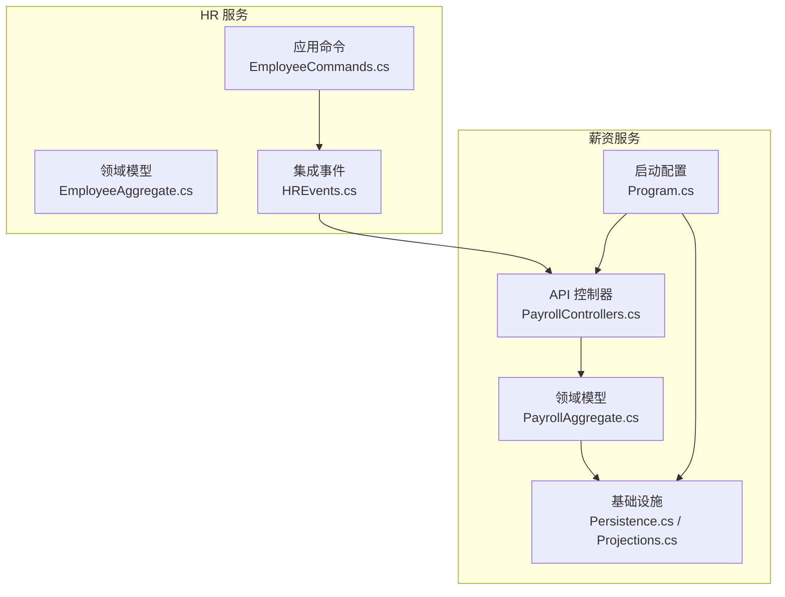
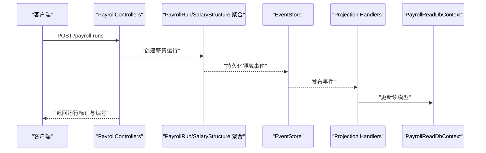
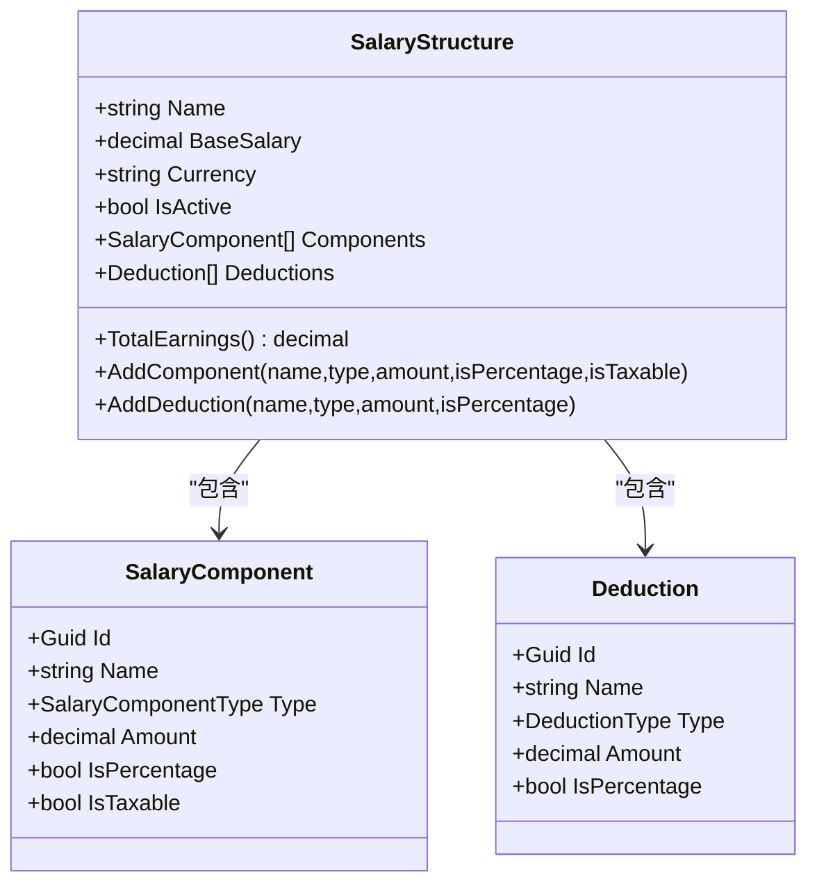
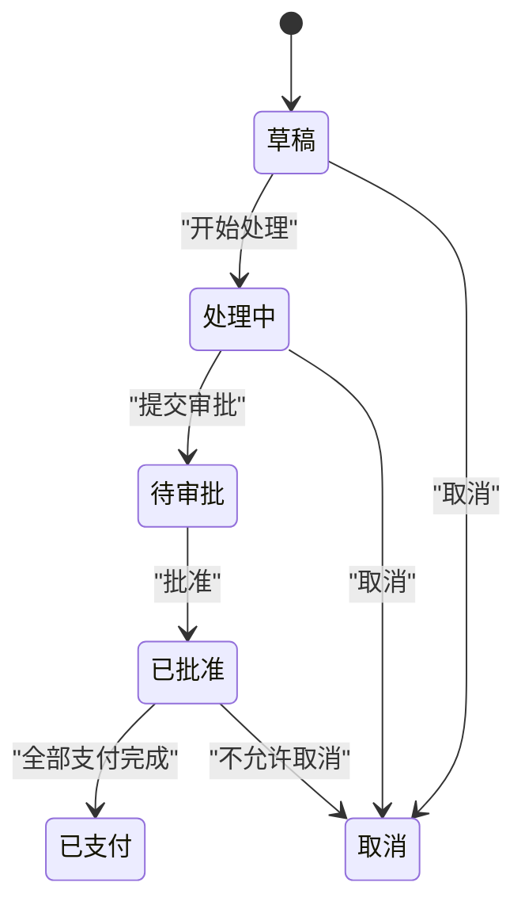
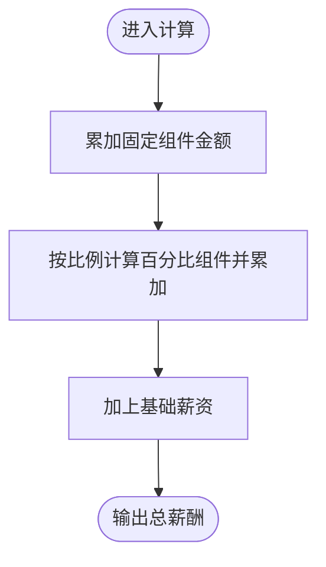
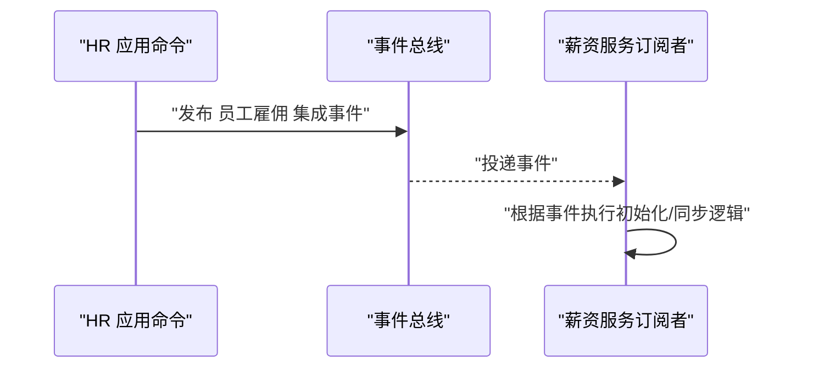
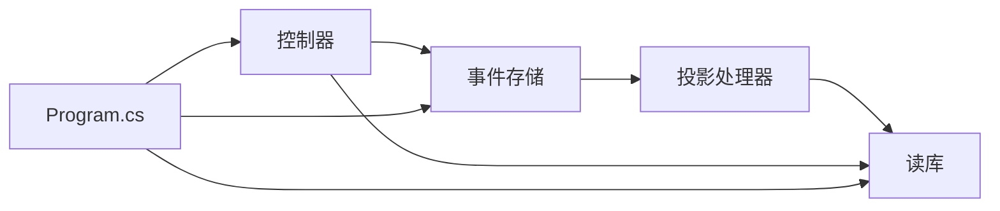

# 薪资服务

<cite>
**本文引用的文件**
- [ErpSystem.Payroll.csproj](file://src/Services/Payroll/ErpSystem.Payroll/ErpSystem.Payroll.csproj)
- [Program.cs](file://src/Services/Payroll/ErpSystem.Payroll/Program.cs)
- [PayrollControllers.cs](file://src/Services/Payroll/ErpSystem.Payroll/API/PayrollControllers.cs)
- [PayrollAggregate.cs](file://src/Services/Payroll/ErpSystem.Payroll/Domain/PayrollAggregate.cs)
- [Persistence.cs](file://src/Services/Payroll/ErpSystem.Payroll/Infrastructure/Persistence.cs)
- [Projections.cs](file://src/Services/Payroll/ErpSystem.Payroll/Infrastructure/Projections.cs)
- [README.md](file://README.md)
- [EmployeeAggregate.cs](file://src/Services/HR/ErpSystem.HR/Domain/EmployeeAggregate.cs)
- [EmployeeCommands.cs](file://src/Services/HR/ErpSystem.HR/Application/EmployeeCommands.cs)
- [HREvents.cs](file://src/Services/HR/ErpSystem.HR/Domain/HREvents.cs)
</cite>

## 目录
1. [简介](#简介)
2. [项目结构](#项目结构)
3. [核心组件](#核心组件)
4. [架构总览](#架构总览)
5. [详细组件分析](#详细组件分析)
6. [依赖关系分析](#依赖关系分析)
7. [性能考虑](#性能考虑)
8. [故障排查指南](#故障排查指南)
9. [结论](#结论)
10. [附录](#附录)

## 简介
本文件为薪资服务（Payroll）的完整技术文档，覆盖薪酬计算、薪资发放、税务与社保公积金处理、薪资聚合设计、业务规则与算法实现、API 接口定义、与 HR 服务的集成机制以及薪资报表生成等关键主题。薪资服务采用事件驱动架构（Event Sourcing + CQRS），通过领域事件驱动读模型投影，实现薪资结构、薪资运行（批处理）、工资条（Payslip）的全生命周期管理。

## 项目结构
薪资服务位于 src/Services/Payroll/ErpSystem.Payroll，主要由以下层次构成：
- 应用层：控制器（API 层），负责请求处理与响应封装
- 领域层：聚合根与值对象（薪资结构、薪资运行、工资条）
- 基础设施层：事件存储 DbContext、读库 DbContext、投影处理器
- 启动与配置：Program.cs 注册数据库、MediatR、事件总线与 Swagger

图表来源
- [PayrollControllers.cs](file://src/Services/Payroll/ErpSystem.Payroll/API/PayrollControllers.cs#L1-L278)
- [PayrollAggregate.cs](file://src/Services/Payroll/ErpSystem.Payroll/Domain/PayrollAggregate.cs#L1-L429)
- [Persistence.cs](file://src/Services/Payroll/ErpSystem.Payroll/Infrastructure/Persistence.cs#L1-L121)
- [Projections.cs](file://src/Services/Payroll/ErpSystem.Payroll/Infrastructure/Projections.cs#L1-L171)
- [Program.cs](file://src/Services/Payroll/ErpSystem.Payroll/Program.cs#L1-L44)
- [EmployeeAggregate.cs](file://src/Services/HR/ErpSystem.HR/Domain/EmployeeAggregate.cs#L1-L151)
- [EmployeeCommands.cs](file://src/Services/HR/ErpSystem.HR/Application/EmployeeCommands.cs#L1-L112)
- [HREvents.cs](file://src/Services/HR/ErpSystem.HR/Domain/HREvents.cs#L1-L21)

章节来源
- [README.md](file://README.md#L130-L183)
- [ErpSystem.Payroll.csproj](file://src/Services/Payroll/ErpSystem.Payroll/ErpSystem.Payroll.csproj#L1-L22)

## 核心组件
- 薪资结构聚合（SalaryStructure）
  - 负责薪资结构的创建、组件（津贴/奖金）与扣款（个税/社保/公积金等）的维护
  - 提供总薪酬计算逻辑（固定项 + 百分比项）
- 薪资运行聚合（PayrollRun）
  - 负责薪资批处理的生命周期：草稿、处理中、待审批、已批准、已支付、取消
  - 支持添加工资条、状态变更、标记支付完成
- 工资条实体（Payslip）
  - 记录单个员工的应发、扣款、实发明细与状态
- 读模型与投影
  - 事件到读模型的投影，支持薪资结构、薪资运行、工资条的查询与统计
- API 控制器
  - 提供薪资结构 CRUD、组件/扣款维护
  - 提供薪资运行的创建、状态流转、统计查询
  - 提供工资条查询与汇总

章节来源
- [PayrollAggregate.cs](file://src/Services/Payroll/ErpSystem.Payroll/Domain/PayrollAggregate.cs#L183-L429)
- [Persistence.cs](file://src/Services/Payroll/ErpSystem.Payroll/Infrastructure/Persistence.cs#L64-L121)
- [Projections.cs](file://src/Services/Payroll/ErpSystem.Payroll/Infrastructure/Projections.cs#L7-L171)
- [PayrollControllers.cs](file://src/Services/Payroll/ErpSystem.Payroll/API/PayrollControllers.cs#L9-L278)

## 架构总览
薪资服务采用事件溯源与 CQRS 架构：
- 写模型（聚合）通过领域事件记录状态变化
- 投影处理器监听领域事件，更新读模型
- API 控制器基于读模型提供查询能力，并通过命令触发聚合状态变更

图表来源
- [PayrollControllers.cs](file://src/Services/Payroll/ErpSystem.Payroll/API/PayrollControllers.cs#L108-L124)
- [PayrollAggregate.cs](file://src/Services/Payroll/ErpSystem.Payroll/Domain/PayrollAggregate.cs#L274-L285)
- [Projections.cs](file://src/Services/Payroll/ErpSystem.Payroll/Infrastructure/Projections.cs#L69-L91)
- [Persistence.cs](file://src/Services/Payroll/ErpSystem.Payroll/Infrastructure/Persistence.cs#L8-L20)

## 详细组件分析

### 薪资结构聚合（SalaryStructure）
- 关键职责
  - 创建薪资结构并记录基础薪资、币种、描述
  - 动态添加薪资组件（含金额或百分比、是否计税）
  - 动态添加扣款项（含金额或百分比）
  - 计算总薪酬：基础薪资 + 固定组件 + 基于基础薪资的百分比组件
- 数据结构与复杂度
  - 组件与扣款以列表存储，投影时序列化为 JSONB；查询按名称与激活状态建立索引
  - 总薪酬计算为 O(n) 遍历组件列表
- 错误处理
  - 添加组件/扣款时通过领域事件记录，异常由上层控制器捕获并返回标准错误

图表来源
- [PayrollAggregate.cs](file://src/Services/Payroll/ErpSystem.Payroll/Domain/PayrollAggregate.cs#L183-L249)

章节来源
- [PayrollAggregate.cs](file://src/Services/Payroll/ErpSystem.Payroll/Domain/PayrollAggregate.cs#L183-L249)
- [Projections.cs](file://src/Services/Payroll/ErpSystem.Payroll/Infrastructure/Projections.cs#L9-L63)
- [Persistence.cs](file://src/Services/Payroll/ErpSystem.Payroll/Infrastructure/Persistence.cs#L66-L80)

### 薪资运行聚合（PayrollRun）
- 生命周期与状态机
  - 草稿 -> 处理中 -> 待审批 -> 已批准 -> 已支付 或 草稿 -> 取消
- 关键操作
  - 添加工资条：校验运行状态，计算实发 = 应发 - 扣款
  - 启动处理、提交审批、批准、标记支付完成、取消
- 统计字段
  - 总应发、总扣款、总实发、员工人数、已支付人数

图表来源
- [PayrollAggregate.cs](file://src/Services/Payroll/ErpSystem.Payroll/Domain/PayrollAggregate.cs#L255-L406)

章节来源
- [PayrollAggregate.cs](file://src/Services/Payroll/ErpSystem.Payroll/Domain/PayrollAggregate.cs#L255-L406)
- [Projections.cs](file://src/Services/Payroll/ErpSystem.Payroll/Infrastructure/Projections.cs#L69-L168)

### 工资条实体（Payslip）
- 字段
  - 工资条编号、员工标识、姓名、年月、应发、扣款、实发、状态、支付信息
- 状态
  - 草稿、最终确定、已支付、更正
- 明细
  - 每笔明细（描述、金额、是否扣款）

章节来源
- [PayrollAggregate.cs](file://src/Services/Payroll/ErpSystem.Payroll/Domain/PayrollAggregate.cs#L410-L429)
- [Projections.cs](file://src/Services/Payroll/ErpSystem.Payroll/Infrastructure/Projections.cs#L103-L133)

### 读模型与投影（Read Model & Projection）
- 事件到读模型映射
  - 薪资结构：新增结构、添加组件（更新组件数与总薪酬）、添加扣款
  - 薪资运行：创建运行、状态变更、生成工资条（累计人数与金额）、批准、支付完成
- 查询优化
  - 读库对关键字段建立索引，支持按年月、状态、员工等条件高效查询

章节来源
- [Projections.cs](file://src/Services/Payroll/ErpSystem.Payroll/Infrastructure/Projections.cs#L7-L171)
- [Persistence.cs](file://src/Services/Payroll/ErpSystem.Payroll/Infrastructure/Persistence.cs#L24-L121)

### API 接口文档

#### 薪资结构管理
- 获取所有薪资结构
  - 方法：GET
  - 路径：api/v1/payroll/salary-structures
  - 查询参数：isActive（可选）
  - 返回：items（数组）、total（数量）
- 获取单个薪资结构
  - 方法：GET
  - 路径：api/v1/payroll/salary-structures/{id}
- 创建薪资结构
  - 方法：POST
  - 路径：api/v1/payroll/salary-structures
  - 请求体：名称、基础薪资、币种、描述
  - 返回：新结构的 id
- 为薪资结构添加组件
  - 方法：POST
  - 路径：api/v1/payroll/salary-structures/{id}/components
  - 请求体：名称、类型（枚举字符串）、金额、是否百分比、是否计税
- 为薪资结构添加扣款
  - 方法：POST
  - 路径：api/v1/payroll/salary-structures/{id}/deductions
  - 请求体：名称、类型（枚举字符串）、金额、是否百分比

章节来源
- [PayrollControllers.cs](file://src/Services/Payroll/ErpSystem.Payroll/API/PayrollControllers.cs#L9-L80)

#### 薪资运行管理
- 获取薪资运行列表
  - 方法：GET
  - 路径：api/v1/payroll/payroll-runs
  - 查询参数：year、month、status
- 获取单个薪资运行
  - 方法：GET
  - 路径：api/v1/payroll/payroll-runs/{id}
- 创建薪资运行
  - 方法：POST
  - 路径：api/v1/payroll/payroll-runs
  - 请求体：年、月、付款日期、描述
  - 返回：运行 id 与运行编号
- 为运行添加工资条
  - 方法：POST
  - 路径：api/v1/payroll/payroll-runs/{id}/payslips
  - 请求体：员工标识、员工姓名、应发、总扣款
  - 返回：工资条 id 与编号
- 启动处理
  - 方法：POST
  - 路径：api/v1/payroll/payroll-runs/{id}/start-processing
- 提交审批
  - 方法：POST
  - 路径：api/v1/payroll/payroll-runs/{id}/submit
- 批准
  - 方法：POST
  - 路径：api/v1/payroll/payroll-runs/{id}/approve
  - 请求体：批准人用户 id
- 取消
  - 方法：POST
  - 路径：api/v1/payroll/payroll-runs/{id}/cancel
  - 请求体：原因
- 统计查询
  - 方法：GET
  - 路径：api/v1/payroll/payroll-runs/statistics
  - 查询参数：year
  - 返回：年份、总运行数、已支付运行数、总实发金额、按月统计（月份、金额、人数）

章节来源
- [PayrollControllers.cs](file://src/Services/Payroll/ErpSystem.Payroll/API/PayrollControllers.cs#L82-L210)

#### 工资条查询
- 获取工资条列表
  - 方法：GET
  - 路径：api/v1/payroll/payslips
  - 查询参数：payrollRunId、employeeId、year、month
- 获取单个工资条
  - 方法：GET
  - 路径：api/v1/payroll/payslips/{id}
- 获取员工历史工资条与汇总
  - 方法：GET
  - 路径：api/v1/payroll/payslips/employee/{employeeId}
  - 查询参数：year
  - 返回：员工标识、总工资条数、总实发、平均月实发、工资条列表

章节来源
- [PayrollControllers.cs](file://src/Services/Payroll/ErpSystem.Payroll/API/PayrollControllers.cs#L212-L278)

### 业务规则与算法实现

#### 薪资结构总薪酬计算
- 规则
  - 总薪酬 = 基础薪资 + 固定组件金额之和 + 基于基础薪资的百分比组件之和
- 实现位置
  - 聚合内 TotalEarnings 属性
- 复杂度
  - O(n)，n 为组件数量

图表来源
- [PayrollAggregate.cs](file://src/Services/Payroll/ErpSystem.Payroll/Domain/PayrollAggregate.cs#L196-L201)

章节来源
- [PayrollAggregate.cs](file://src/Services/Payroll/ErpSystem.Payroll/Domain/PayrollAggregate.cs#L196-L201)

#### 工资条生成与状态流转
- 生成规则
  - 实发 = 应发 - 扣款
  - 初始状态为草稿
- 状态机
  - 批准后转为“最终确定”，支付完成后转为“已支付”

章节来源
- [PayrollAggregate.cs](file://src/Services/Payroll/ErpSystem.Payroll/Domain/PayrollAggregate.cs#L287-L302)
- [PayrollAggregate.cs](file://src/Services/Payroll/ErpSystem.Payroll/Domain/PayrollAggregate.cs#L384-L390)

### 与 HR 服务的集成
- 雇佣事件
  - HR 服务在员工雇佣时发布“员工雇佣”集成事件
  - 薪资服务通过事件总线订阅该事件，用于初始化员工薪资结构或触发后续流程
- 人员变动事件
  - HR 服务在员工调动/晋升/离职时发布相应事件
  - 薪资服务可据此调整薪资结构或终止相关流程

图表来源
- [EmployeeCommands.cs](file://src/Services/HR/ErpSystem.HR/Application/EmployeeCommands.cs#L64-L72)
- [HREvents.cs](file://src/Services/HR/ErpSystem.HR/Domain/HREvents.cs#L7-L14)

章节来源
- [EmployeeCommands.cs](file://src/Services/HR/ErpSystem.HR/Application/EmployeeCommands.cs#L1-L112)
- [HREvents.cs](file://src/Services/HR/ErpSystem.HR/Domain/HREvents.cs#L1-L21)
- [EmployeeAggregate.cs](file://src/Services/HR/ErpSystem.HR/Domain/EmployeeAggregate.cs#L1-L151)

## 依赖关系分析
- 组件耦合
  - 控制器依赖事件存储与读库；聚合通过领域事件解耦外部系统
  - 投影处理器依赖 MediatR 的通知接口，实现事件到读模型的解耦更新
- 外部依赖
  - 数据库：PostgreSQL（EF Core + Npgsql）
  - 事件总线：Dapr（用于跨服务事件发布/订阅）
  - 文档：Swagger（自动生成 API 文档）

图表来源
- [Program.cs](file://src/Services/Payroll/ErpSystem.Payroll/Program.cs#L10-L26)
- [PayrollControllers.cs](file://src/Services/Payroll/ErpSystem.Payroll/API/PayrollControllers.cs#L1-L10)
- [Projections.cs](file://src/Services/Payroll/ErpSystem.Payroll/Infrastructure/Projections.cs#L1-L6)

章节来源
- [Program.cs](file://src/Services/Payroll/ErpSystem.Payroll/Program.cs#L1-L44)
- [ErpSystem.Payroll.csproj](file://src/Services/Payroll/ErpSystem.Payroll/ErpSystem.Payroll.csproj#L10-L19)

## 性能考虑
- 事件存储
  - 使用 jsonb 存储事件负载，适合高写入场景；建议定期归档旧事件
- 读模型
  - 对常用查询字段建立索引（名称、激活状态、年月、状态、员工标识），提升查询性能
- 投影
  - 投影处理为异步，避免阻塞写路径；注意批量插入与事务边界控制
- 缓存
  - 可结合共享缓存层对热点薪资结构进行缓存，降低读库压力

## 故障排查指南
- 常见问题
  - 无法添加工资条：检查薪资运行状态是否为草稿或处理中
  - 提交审批失败：检查运行中是否存在工资条
  - 批准失败：检查运行状态是否为“处理中”
  - 支付完成失败：检查运行状态是否为“已批准”
- 日志与可观测性
  - 使用中间件与行为（日志、性能、验证、幂等）捕获异常与慢调用
  - 通过 Swagger 快速验证接口可用性与参数格式

章节来源
- [PayrollAggregate.cs](file://src/Services/Payroll/ErpSystem.Payroll/Domain/PayrollAggregate.cs#L295-L349)

## 结论
薪资服务通过事件驱动与 CQRS 架构实现了薪资结构、薪资运行与工资条的全生命周期管理，具备良好的扩展性与可维护性。结合 HR 服务的集成事件，可实现员工信息的自动同步与薪资流程的自动化。建议在生产环境中完善税务与社保公积金的规则引擎与报表模块，以满足复杂的合规要求。

## 附录

### API 请求/响应要点
- 请求体均采用 JSON 格式，枚举类型以字符串表示
- 成功响应使用标准 HTTP 状态码，错误响应包含明确的错误信息

### 术语表
- 薪资结构：员工薪资的组成模板（基础薪资 + 组件 + 扣款）
- 薪资运行：按年月批次执行的薪资处理流程
- 工资条：单个员工的薪资明细与状态