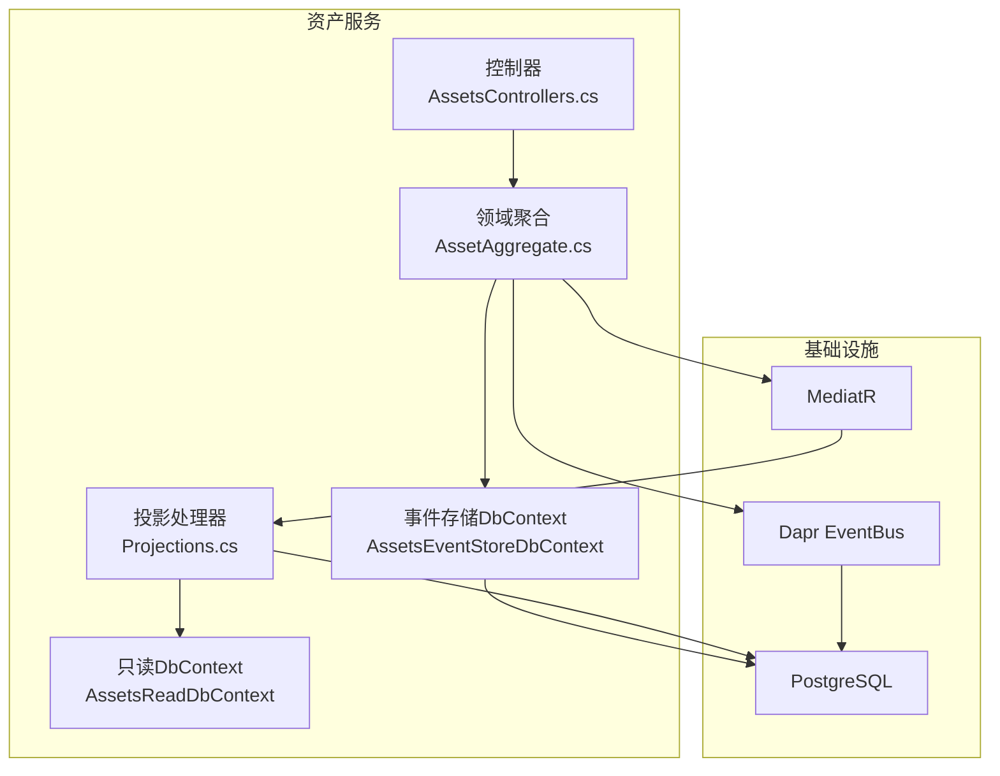
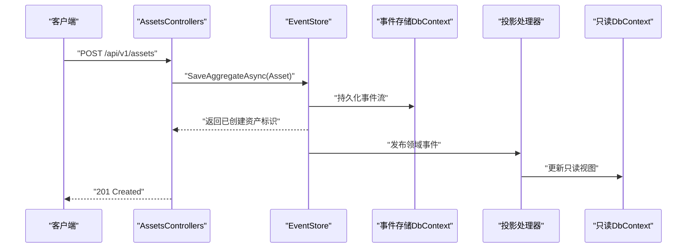
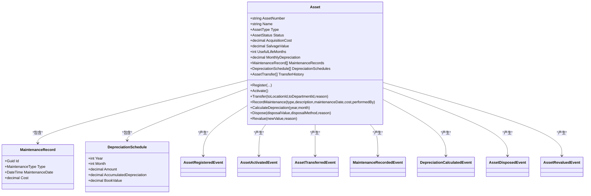
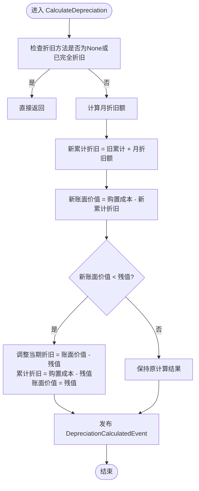
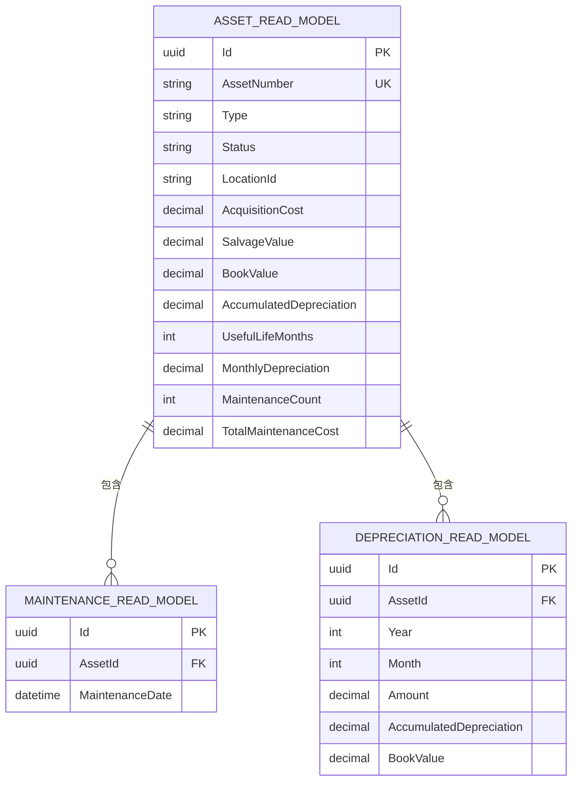
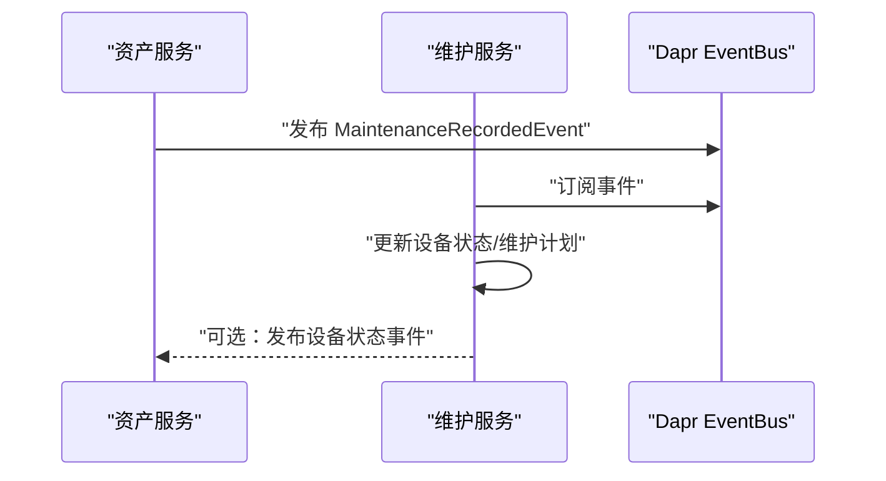
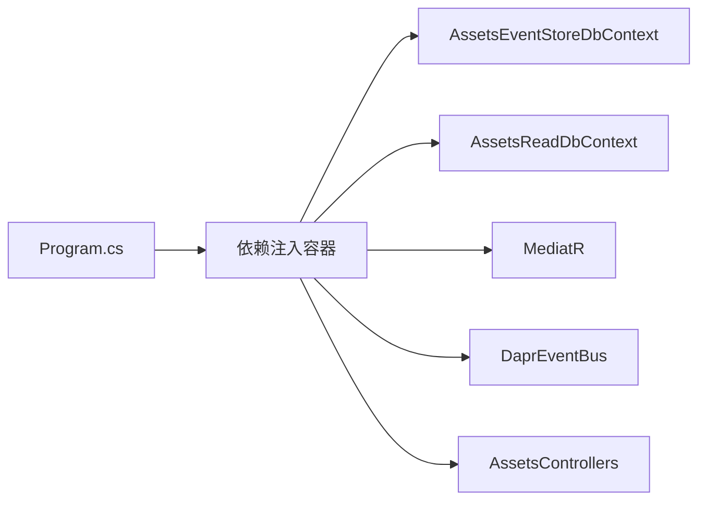

# 资产维护服务

<cite>
**本文档引用的文件**
- [Program.cs](file://src/Services/Assets/ErpSystem.Assets/Program.cs)
- [AssetsControllers.cs](file://src/Services/Assets/ErpSystem.Assets/API/AssetsControllers.cs)
- [AssetAggregate.cs](file://src/Services/Assets/ErpSystem.Assets/Domains/AssetAggregate.cs)
- [Persistence.cs](file://src/Services/Assets/ErpSystem.Assets/Infrastructure/Persistence.cs)
- [Projections.cs](file://src/Services/Assets/ErpSystem.Assets/Infrastructure/Projections.cs)
- [DDDBase.cs](file://src/BuildingBlocks/ErpSystem.BuildingBlocks/Domain/DDDBase.cs)
- [DaprEventBus.cs](file://src/BuildingBlocks/ErpSystem.BuildingBlocks/EventBus/DaprEventBus.cs)
- [appsettings.json](file://src/Services/Assets/ErpSystem.Assets/appsettings.json)
- [EquipmentAggregate.cs](file://src/Services/Maintenance/ErpSystem.Maintenance/Domain/EquipmentAggregate.cs)
- [values.yaml](file://deploy/helm/erp-system/values.yaml)
- [init.sql](file://infrastructure/init.sql)
</cite>

## 目录
1. [简介](#简介)
2. [项目结构](#项目结构)
3. [核心组件](#核心组件)
4. [架构总览](#架构总览)
5. [详细组件分析](#详细组件分析)
6. [依赖关系分析](#依赖关系分析)
7. [性能考虑](#性能考虑)
8. [故障排除指南](#故障排除指南)
9. [结论](#结论)
10. [附录](#附录)

## 简介
本文件为资产维护服务（ErpSystem.Assets）的全面技术文档，覆盖设备资产管理、资产折旧计算、资产生命周期管理等固定资产管理功能。文档深入说明资产聚合设计（资产分类、折旧方法、维护记录等核心概念），解释资产数据的持久化与查询优化策略，并提供完整的API接口文档（资产登记、折旧计算、维护记录、资产转移等）。同时，文档阐述与维护管理服务的集成方式，实现设备的全生命周期管理，并包含资产价值计算、折旧算法、资产盘点等技术实现细节。

## 项目结构
资产维护服务采用分层架构：控制器层（API）、领域层（Aggregate与事件）、基础设施层（EF Core读写库、投影处理器、事件存储）。服务通过MediatR发布领域事件，使用Dapr EventBus进行跨服务事件发布，并通过EF Core将事件流持久化到PostgreSQL中，同时生成只读视图供查询使用。

图表来源
- [Program.cs](file://src/Services/Assets/ErpSystem.Assets/Program.cs#L1-L45)
- [Persistence.cs](file://src/Services/Assets/ErpSystem.Assets/Infrastructure/Persistence.cs#L1-L125)
- [Projections.cs](file://src/Services/Assets/ErpSystem.Assets/Infrastructure/Projections.cs#L1-L141)
- [DaprEventBus.cs](file://src/BuildingBlocks/ErpSystem.BuildingBlocks/EventBus/DaprEventBus.cs#L1-L31)

章节来源
- [Program.cs](file://src/Services/Assets/ErpSystem.Assets/Program.cs#L1-L45)
- [Persistence.cs](file://src/Services/Assets/ErpSystem.Assets/Infrastructure/Persistence.cs#L1-L125)

## 核心组件
- 控制器层：提供资产全生命周期操作的REST接口，包括资产登记、激活、转移、维护记录、折旧计算、处置以及统计查询。
- 领域层：资产聚合定义了资产类型、状态、折旧方法、维护与折旧历史等；通过ApplyChange机制记录领域事件，确保业务规则与状态变更一致。
- 基础设施层：事件存储DbContext用于持久化事件流；只读DbContext用于高效查询；投影处理器监听领域事件并更新只读模型。
- 事件总线：通过Dapr EventBus发布领域事件，支持跨服务集成。

章节来源
- [AssetsControllers.cs](file://src/Services/Assets/ErpSystem.Assets/API/AssetsControllers.cs#L1-L250)
- [AssetAggregate.cs](file://src/Services/Assets/ErpSystem.Assets/Domains/AssetAggregate.cs#L1-L357)
- [Persistence.cs](file://src/Services/Assets/ErpSystem.Assets/Infrastructure/Persistence.cs#L1-L125)
- [Projections.cs](file://src/Services/Assets/ErpSystem.Assets/Infrastructure/Projections.cs#L1-L141)
- [DaprEventBus.cs](file://src/BuildingBlocks/ErpSystem.BuildingBlocks/EventBus/DaprEventBus.cs#L1-L31)

## 架构总览
服务采用事件溯源与CQRS模式：
- 写模型：事件存储DbContext保存事件流，聚合根基于事件重建状态。
- 读模型：投影处理器将事件转换为只读视图，供查询端高效检索。
- 事件发布：聚合根触发领域事件，经MediatR与Dapr EventBus发布，实现跨服务解耦。

图表来源
- [AssetsControllers.cs](file://src/Services/Assets/ErpSystem.Assets/API/AssetsControllers.cs#L35-L56)
- [DDDBase.cs](file://src/BuildingBlocks/ErpSystem.BuildingBlocks/Domain/DDDBase.cs#L59-L120)
- [Projections.cs](file://src/Services/Assets/ErpSystem.Assets/Infrastructure/Projections.cs#L15-L42)

## 详细组件分析

### 资产聚合与领域事件
资产聚合定义了资产的完整生命周期与财务属性，包括：
- 资产基础信息：编号、名称、描述、类型、状态
- 财务属性：购置成本、购置日期、残值、账面价值、累计折旧
- 折旧参数：折旧方法、使用月数
- 位置信息：地点、部门、分配用户
- 历史记录：维护记录、折旧计划、转移历史
- 计算属性：月折旧额、账面价值、总维护成本、是否已折旧完毕

图表来源
- [AssetAggregate.cs](file://src/Services/Assets/ErpSystem.Assets/Domains/AssetAggregate.cs#L179-L357)

章节来源
- [AssetAggregate.cs](file://src/Services/Assets/ErpSystem.Assets/Domains/AssetAggregate.cs#L1-L357)

### 折旧算法实现
当前实现支持直线法折旧，月折旧额按公式计算；在接近残值时调整当期折旧以确保最终账面价值不低于残值。该逻辑在聚合根内完成，并通过领域事件记录折旧结果。

图表来源
- [AssetAggregate.cs](file://src/Services/Assets/ErpSystem.Assets/Domains/AssetAggregate.cs#L267-L284)

章节来源
- [AssetAggregate.cs](file://src/Services/Assets/ErpSystem.Assets/Domains/AssetAggregate.cs#L198-L284)

### 数据持久化与查询优化
- 事件存储：事件流以jsonb格式存储，主键为(聚合ID, 版本)，支持事件回放与聚合重建。
- 只读视图：对资产、维护记录、折旧记录建立索引，提升查询性能。
- 投影处理：监听领域事件，同步更新只读表，保证查询侧低延迟。

图表来源
- [Persistence.cs](file://src/Services/Assets/ErpSystem.Assets/Infrastructure/Persistence.cs#L63-L122)

章节来源
- [Persistence.cs](file://src/Services/Assets/ErpSystem.Assets/Infrastructure/Persistence.cs#L1-L125)

### API 接口文档
以下为资产维护服务提供的主要接口，均位于控制器中：

- 获取资产列表
  - 方法：GET
  - 路径：/api/v1/assets
  - 查询参数：type、status、locationId
  - 返回：资产列表与总数

- 获取单个资产
  - 方法：GET
  - 路径：/api/v1/assets/{id}

- 资产登记
  - 方法：POST
  - 路径：/api/v1/assets
  - 请求体：RegisterAssetRequest
  - 返回：创建成功，返回资产标识与编号

- 资产激活
  - 方法：POST
  - 路径：/api/v1/assets/{id}/activate
  - 返回：激活后的状态

- 资产转移
  - 方法：POST
  - 路径：/api/v1/assets/{id}/transfer
  - 请求体：TransferAssetRequest
  - 返回：转移后的新地点标识

- 维护记录
  - 方法：POST
  - 路径：/api/v1/assets/{id}/maintenance
  - 请求体：RecordMaintenanceRequest
  - 返回：成功

- 折旧计算
  - 方法：POST
  - 路径：/api/v1/assets/{id}/depreciate
  - 请求体：DepreciateRequest
  - 返回：成功

- 资产处置
  - 方法：POST
  - 路径：/api/v1/assets/{id}/dispose
  - 请求体：DisposeAssetRequest
  - 返回：处置后的状态

- 资产统计
  - 方法：GET
  - 路径：/api/v1/assets/statistics
  - 返回：总计数、总购置价值、总账面价值、总累计折旧、按类型与状态的统计

- 维护记录查询
  - 方法：GET
  - 路径：/api/v1/assets/maintenance
  - 查询参数：assetId、type、fromDate、toDate
  - 返回：维护记录列表、总数与总成本

- 维护计划概览
  - 方法：GET
  - 路径：/api/v1/assets/maintenance/schedule
  - 返回：即将到期、活跃资产数量、平均维护成本等

- 折旧记录查询
  - 方法：GET
  - 路径：/api/v1/assets/depreciation
  - 查询参数：assetId、year、month
  - 返回：折旧记录列表、总数与总折旧额

- 年度折旧汇总
  - 方法：GET
  - 路径：/api/v1/assets/depreciation/summary/{year}
  - 返回：年份、总折旧额、覆盖资产数、按月统计

- 批量折旧执行
  - 方法：POST
  - 路径：/api/v1/assets/depreciation/run-batch
  - 请求体：BatchDepreciationRequest
  - 返回：调度状态消息

章节来源
- [AssetsControllers.cs](file://src/Services/Assets/ErpSystem.Assets/API/AssetsControllers.cs#L13-L250)

### 与维护管理服务的集成
维护管理服务包含设备聚合与维护计划聚合，可与资产服务协同工作：
- 设备聚合：跟踪设备状态（运行、停机、维修中），支持标记设备状态变更。
- 维护计划聚合：定义设备的定期维护周期，结合资产服务的维护记录形成闭环。

图表来源
- [EquipmentAggregate.cs](file://src/Services/Maintenance/ErpSystem.Maintenance/Domain/EquipmentAggregate.cs#L1-L92)
- [DaprEventBus.cs](file://src/BuildingBlocks/ErpSystem.BuildingBlocks/EventBus/DaprEventBus.cs#L1-L31)

章节来源
- [EquipmentAggregate.cs](file://src/Services/Maintenance/ErpSystem.Maintenance/Domain/EquipmentAggregate.cs#L1-L92)

## 依赖关系分析
- 依赖注入：注册事件存储、MediatR、Dapr EventBus、控制器与DbContext。
- 事件总线：通过Dapr发布领域事件，支持微服务间解耦。
- ORM：EF Core用于事件存储与只读视图，PostgreSQL作为持久化存储。
- 运行环境：Helm Chart定义了服务副本、资源限制、Ingress与数据库配置。

图表来源
- [Program.cs](file://src/Services/Assets/ErpSystem.Assets/Program.cs#L1-L45)
- [Persistence.cs](file://src/Services/Assets/ErpSystem.Assets/Infrastructure/Persistence.cs#L1-L125)

章节来源
- [Program.cs](file://src/Services/Assets/ErpSystem.Assets/Program.cs#L1-L45)
- [values.yaml](file://deploy/helm/erp-system/values.yaml#L1-L127)
- [init.sql](file://infrastructure/init.sql#L1-L9)

## 性能考虑
- 事件存储：事件流以jsonb存储，版本号递增，适合事件回放与聚合重建。
- 查询优化：在只读视图上建立关键字段索引（资产编号、类型、状态、地点、维护日期、年月组合），降低查询成本。
- 批量处理：折旧计算可通过批量接口调度，避免单次高负载。
- 缓存与限流：建议在网关层引入缓存与限流策略，减少重复查询压力。
- 数据库连接池：合理配置连接池大小与超时时间，避免并发瓶颈。

## 故障排除指南
- 事件加载失败：检查事件存储中是否存在对应聚合ID的事件流，确认版本顺序正确。
- 投影未更新：确认MediatR已注册投影处理器，且事件发布成功。
- 查询无结果：核对只读视图索引是否生效，必要时重建索引。
- 连接字符串错误：检查服务配置中的连接字符串，确保数据库存在且可访问。
- Dapr事件发布异常：确认PubSub组件配置正确，主题命名与事件类型匹配。

章节来源
- [DDDBase.cs](file://src/BuildingBlocks/ErpSystem.BuildingBlocks/Domain/DDDBase.cs#L59-L120)
- [Projections.cs](file://src/Services/Assets/ErpSystem.Assets/Infrastructure/Projections.cs#L1-L141)
- [appsettings.json](file://src/Services/Assets/ErpSystem.Assets/appsettings.json#L1-L12)

## 结论
资产维护服务通过事件溯源与CQRS实现了资产全生命周期管理，涵盖资产登记、激活、转移、维护、折旧与处置等核心流程。通过只读视图与索引优化，服务具备良好的查询性能；通过Dapr EventBus实现跨服务事件集成，支撑与维护管理服务的协同工作。未来可在折旧算法扩展（余额递减、双倍余额递减、产量法等）、批量折旧调度与更细粒度的权限控制方面持续演进。

## 附录
- 数据库初始化：仓库提供了数据库初始化脚本，可用于创建各服务数据库。
- Helm部署：通过Helm Chart统一管理服务镜像、副本数、资源限制与Ingress配置。

章节来源
- [init.sql](file://infrastructure/init.sql#L1-L9)
- [values.yaml](file://deploy/helm/erp-system/values.yaml#L1-L127)