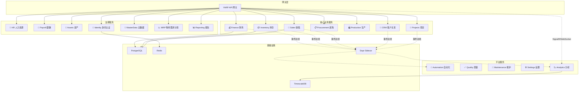
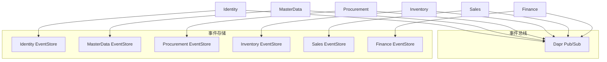
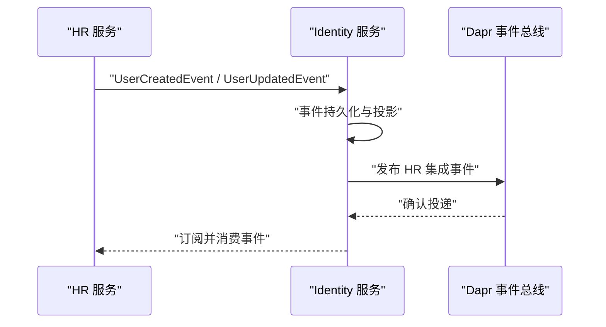
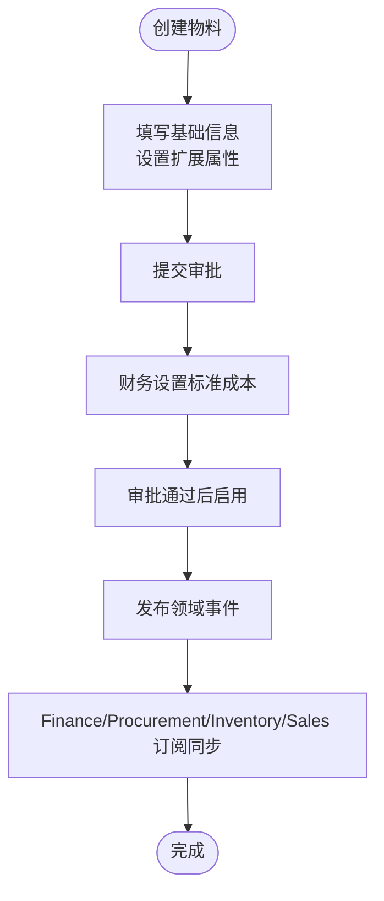
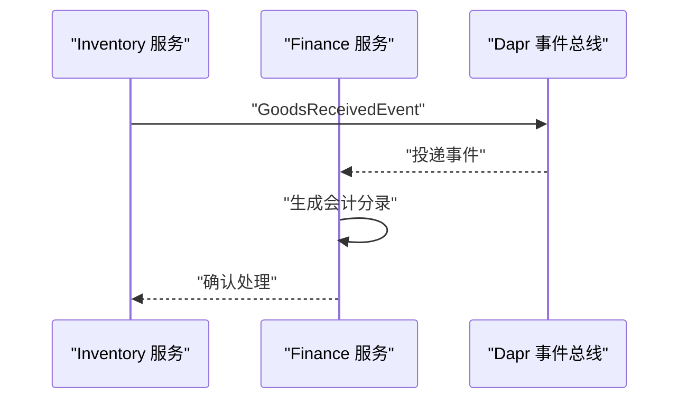
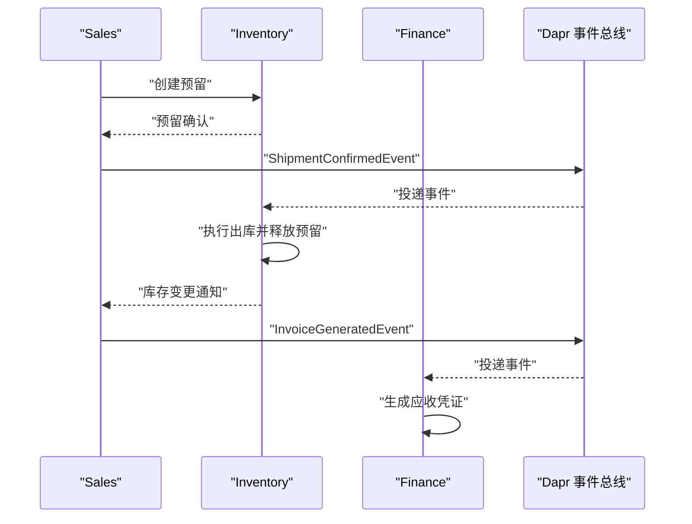
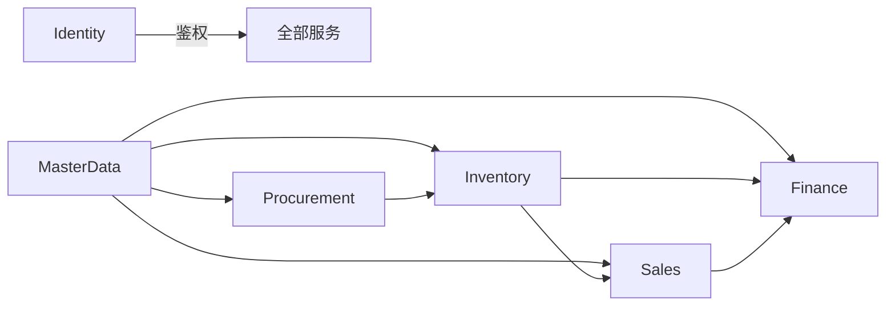

# 业务服务模块

<cite>
**本文引用的文件**
- [README.md](file://README.md)
- [DEVELOPMENT_PLAN.md](file://DEVELOPMENT_PLAN.md)
- [src/ErpSystem.sln](file://src/ErpSystem.sln)
- [docs/PRD-01-MasterData-Service.md](file://docs/PRD-01-MasterData-Service.md)
- [docs/PRD-05-Inventory-Service.md](file://docs/PRD-05-Inventory-Service.md)
- [src/Services/Identity/ErpSystem.Identity/Program.cs](file://src/Services/Identity/ErpSystem.Identity/Program.cs)
- [src/Services/Finance/ErpSystem.Finance/Program.cs](file://src/Services/Finance/ErpSystem.Finance/Program.cs)
- [src/Services/Procurement/ErpSystem.Procurement/Program.cs](file://src/Services/Procurement/ErpSystem.Procurement/Program.cs)
- [src/Services/Sales/ErpSystem.Sales/Program.cs](file://src/Services/Sales/ErpSystem.Sales/Program.cs)
- [deploy/k8s/namespace.yaml](file://deploy/k8s/namespace.yaml)
</cite>

## 目录
1. [引言](#引言)
2. [项目结构](#项目结构)
3. [核心组件](#核心组件)
4. [架构总览](#架构总览)
5. [详细组件分析](#详细组件分析)
6. [依赖分析](#依赖分析)
7. [性能考虑](#性能考虑)
8. [故障排除指南](#故障排除指南)
9. [结论](#结论)
10. [附录](#附录)

## 引言
本文件为15个业务服务模块的综合文档，覆盖身份认证、主数据管理、财务会计、供应链管理（采购、库存、销售）、生产制造、项目管理、人力资源、薪酬、资产、质量、自动化、维护、报告、分析与BI、CRM等模块。文档从功能范围、业务价值、技术实现、服务间依赖、数据流与事件传播、API接口、数据模型、集成模式、独立部署与扩展策略、运维考虑等方面进行系统化说明，既面向业务分析师也面向开发者。

## 项目结构
- 采用微服务架构，共15个业务服务，每个服务独立开发、独立部署、独立数据库。
- 服务边界清晰，围绕核心业务域划分：财务会计、供应链、生产制造、项目管理、人力资源、薪酬、资产、质量、自动化、维护、报告、分析与BI、CRM等。
- 通过Dapr Sidecar实现服务间通信（同步调用与异步事件总线），结合事件溯源与CQRS模式，实现高内聚低耦合。
- 前端采用React单页应用，通过YARP网关统一对外暴露API。

图示来源
- [README.md](file://README.md#L130-L183)

章节来源
- [README.md](file://README.md#L130-L183)
- [src/ErpSystem.sln](file://src/ErpSystem.sln#L1-L120)

## 核心组件
- 身份认证服务（Identity）：提供用户、角色、部门、数据权限聚合，集成JWT与刷新令牌，向其他服务发布HR集成事件。
- 主数据服务（MasterData）：统一管理物料、供应商、客户、仓库等主数据，支持版本与审计，发布领域事件供其他服务订阅。
- 供应链服务：采购（Procurement）、库存（Inventory）、销售（Sales）三者形成闭环，通过事件驱动实现跨服务协作。
- 财务会计服务（Finance）：双分录总账、科目表、试算平衡与财务报表，自动从业务事件生成凭证。
- 生产制造服务（Production）：生产订单、BOM、在制品跟踪与效率报告。
- 项目管理服务（Projects）：项目、任务与工时管理。
- 人力资源与薪酬（HR/Payroll）、资产（Assets）、质量（Quality）、自动化（Automation）、维护（Maintenance）、报告（Reporting）、分析（Analytics）、CRM等服务协同支撑企业运营。

章节来源
- [README.md](file://README.md#L37-L126)
- [src/ErpSystem.sln](file://src/ErpSystem.sln#L1-L120)

## 架构总览
- 事件驱动：各服务通过事件总线发布/订阅领域事件，实现松耦合协作。
- 事件溯源：使用事件存储记录聚合状态变更，支持审计与重放。
- CQRS：读写分离，读模型通过投影生成，提升查询性能。
- Dapr集成：服务间通信、状态管理、Pub/Sub抽象、可观测性。
- 多租户：通过查询过滤器与拦截器实现租户隔离。
- 容器化与Kubernetes：支持独立部署、弹性扩缩容与滚动更新。

图示来源
- [README.md](file://README.md#L185-L196)
- [src/Services/Identity/ErpSystem.Identity/Program.cs](file://src/Services/Identity/ErpSystem.Identity/Program.cs#L28-L44)
- [src/Services/Finance/ErpSystem.Finance/Program.cs](file://src/Services/Finance/ErpSystem.Finance/Program.cs#L27-L47)
- [src/Services/Procurement/ErpSystem.Procurement/Program.cs](file://src/Services/Procurement/ErpSystem.Procurement/Program.cs#L28-L43)
- [src/Services/Sales/ErpSystem.Sales/Program.cs](file://src/Services/Sales/ErpSystem.Sales/Program.cs#L28-L43)

## 详细组件分析

### 身份认证服务（Identity）
- 功能范围
  - 用户、角色、部门、岗位、数据权限聚合。
  - JWT签发与刷新令牌。
  - 与HR服务集成，同步员工信息与组织架构。
- 技术实现
  - 使用事件存储记录用户与权限变更。
  - 通过Dapr事件总线发布HR集成事件。
  - 提供Swagger文档与健康检查端点。
- API与集成
  - 用户、角色、部门、审计、集成事件等控制器。
  - 与HR服务通过事件进行双向同步。
- 部署与扩展
  - 独立容器镜像，支持水平扩展。
  - Redis用于缓存与会话状态（Dapr State）。

图示来源
- [src/Services/Identity/ErpSystem.Identity/Program.cs](file://src/Services/Identity/ErpSystem.Identity/Program.cs#L28-L44)

章节来源
- [src/Services/Identity/ErpSystem.Identity/Program.cs](file://src/Services/Identity/ErpSystem.Identity/Program.cs#L1-L76)

### 主数据管理服务（MasterData）
- 功能范围
  - 物料：基础信息、标准成本、启用/停用、扩展属性、分类、多单位、替代关系、BOM关联。
  - 供应商：基础信息、分类分级、绩效管理、黑名单。
  - 客户：基础信息、信用额度、分组与生命周期。
  - 仓库与库位：仓库档案与库位结构。
- 业务价值
  - 统一主数据，保证跨服务一致性。
  - 支持审批流程与审计追踪。
- API与数据模型
  - 物料、供应商、客户、仓库管理API。
  - 领域事件：物料创建/更新/成本变更/启停用；供应商等级变更/拉黑；客户信用/生命周期变更。
- 集成模式
  - 与Finance（成本）、Procurement（供应商/物料）、Inventory（仓库/库位）、Sales（客户/价格）集成。

图示来源
- [docs/PRD-01-MasterData-Service.md](file://docs/PRD-01-MasterData-Service.md#L402-L415)

章节来源
- [docs/PRD-01-MasterData-Service.md](file://docs/PRD-01-MasterData-Service.md#L1-L827)

### 财务会计服务（Finance）
- 功能范围
  - 双分录总账、科目表（层次化）、试算平衡与财务报表。
  - 应收应付、发票、成本核算（材料、人工、制造费用）。
  - 自动凭证生成（来自采购、销售、生产等事件）。
- 技术实现
  - 事件存储与CQRS读写分离。
  - Dapr事件总线与MediatR管道（验证、日志、幂等、审计、性能）。
- API与数据模型
  - 总账、科目、财务期间、凭证、发票、付款等控制器与聚合。
- 集成模式
  - 订阅采购收货、销售发货、生产完工等事件，生成会计分录。

图示来源
- [src/Services/Finance/ErpSystem.Finance/Program.cs](file://src/Services/Finance/ErpSystem.Finance/Program.cs#L27-L47)

章节来源
- [src/Services/Finance/ErpSystem.Finance/Program.cs](file://src/Services/Finance/ErpSystem.Finance/Program.cs#L1-L89)

### 供应链管理（采购、库存、销售）
- 采购（Procurement）
  - 采购订单生命周期：创建、审批、收货、入库、结算。
  - 与主数据（供应商/物料）、财务（应付）集成。
- 库存（Inventory）
  - 实时库存台账、出入库流水、库存预留、盘点与调整。
  - 与主数据（仓库/库位）、采购（收货）、销售（发货）、生产（领料/完工）集成。
- 销售（Sales）
  - 销售订单、发货、开票、应收账款。
  - 与主数据（客户/物料）、库存（预留/出库）、财务（应收）集成。

图示来源
- [docs/PRD-05-Inventory-Service.md](file://docs/PRD-05-Inventory-Service.md#L341-L359)

章节来源
- [docs/PRD-05-Inventory-Service.md](file://docs/PRD-05-Inventory-Service.md#L1-L528)
- [src/Services/Procurement/ErpSystem.Procurement/Program.cs](file://src/Services/Procurement/ErpSystem.Procurement/Program.cs#L1-L80)
- [src/Services/Sales/ErpSystem.Sales/Program.cs](file://src/Services/Sales/ErpSystem.Sales/Program.cs#L1-L80)

### 生产制造服务（Production）
- 功能范围
  - 生产订单、BOM、在制品跟踪、效率报告。
  - 与主数据（物料/BOM）、库存（领料/完工）、财务（成本结转）集成。
- 技术实现
  - 事件驱动，聚合根状态变更通过事件存储与投影。

章节来源
- [README.md](file://README.md#L77-L84)

### 项目管理服务（Projects）
- 功能范围
  - 项目、任务、工时管理，资源规划与进度跟踪。
- 集成模式
  - 与HR（人员）、库存（物料）、财务（成本）协同。

章节来源
- [README.md](file://README.md#L81-L83)

### 人力资源与薪酬（HR/Payroll）
- HR：员工档案、组织架构、数据权限。
- Payroll：薪资计算、发放、报表。
- 集成：HR事件触发Identity用户增强，薪酬与财务对账。

章节来源
- [README.md](file://README.md#L90-L96)

### 资产管理服务（Assets）
- 资产全生命周期：采购、登记、折旧、维修、报废。
- 与财务（折旧）集成。

章节来源
- [README.md](file://README.md#L49)

### 质量服务（Quality）
- 质检、质量报警、质量分析。
- 与供应链（检验）联动。

章节来源
- [README.md](file://README.md#L311)

### 自动化服务（Automation）
- 工作流引擎：规则驱动的自动化流程。
- 与分析（通知）协同。

章节来源
- [README.md](file://README.md#L313)

### 维护服务（Maintenance）
- 设备维护计划与工单。
- 与资产联动。

章节来源
- [README.md](file://README.md#L314)

### 报告与分析服务（Reporting/Analytics）
- BI仪表盘、销售趋势、库存报表、财务汇总、生产效率指标。
- 实时仪表盘（SignalR/WebSockets）与AI预测（ML.NET）。

章节来源
- [README.md](file://README.md#L100-L123)

### CRM服务（CRM）
- 客户360°视图、商机、线索、营销活动。
- 与销售、财务、项目协同。

章节来源
- [README.md](file://README.md#L66-L73)

## 依赖分析
- 服务间依赖
  - Identity：所有服务的前置依赖（鉴权与权限）。
  - MasterData：供应链、财务、销售、项目等广泛依赖。
  - 供应链：Inventory依赖MasterData与Procurement/Sales事件；Sales/Procurement依赖Inventory预留/出库。
  - Finance：依赖供应链事件进行自动记账。
- 数据流与事件传播
  - 事件总线作为中枢，服务通过发布/订阅实现解耦。
  - 事件存储确保可追溯与重放。
- 外部依赖
  - PostgreSQL用于事件存储与读库。
  - TimescaleDB用于时序分析。
  - Redis用于缓存与Dapr状态管理。

图示来源
- [README.md](file://README.md#L173-L183)

章节来源
- [README.md](file://README.md#L173-L183)

## 性能考虑
- 事件溯源与CQRS：写模型事件持久化，读模型投影，降低查询压力。
- 缓存与幂等：分布式缓存与幂等行为，避免重复处理。
- 弹性与可观测性：Polly重试/熔断/超时策略，Aspire可观测性。
- 数据库：PostgreSQL主存储，TimescaleDB时序分析，Redis缓存。
- 并发与吞吐：服务独立扩展，事件总线异步解耦。

## 故障排除指南
- 事件未投递/重复消费
  - 检查Dapr Pub/Sub配置与订阅端点。
  - 确认事件存储与Outbox/Inbox机制正确工作。
- 数据不一致
  - 核对事件顺序与投影是否完成。
  - 使用审计日志与事件重放定位问题。
- 鉴权失败
  - 检查JWT签名验证中间件与Identity服务连通性。
- 数据库连接
  - 确认连接字符串与数据库实例可用性。
- 健康检查
  - 通过/health端点快速定位服务状态。

章节来源
- [src/Services/Identity/ErpSystem.Identity/Program.cs](file://src/Services/Identity/ErpSystem.Identity/Program.cs#L55-L58)
- [src/Services/Finance/ErpSystem.Finance/Program.cs](file://src/Services/Finance/ErpSystem.Finance/Program.cs#L60-L62)
- [src/Services/Procurement/ErpSystem.Procurement/Program.cs](file://src/Services/Procurement/ErpSystem.Procurement/Program.cs#L52-L56)
- [src/Services/Sales/ErpSystem.Sales/Program.cs](file://src/Services/Sales/ErpSystem.Sales/Program.cs#L52-L56)

## 结论
该ERP微服务系统以事件驱动为核心，结合事件溯源、CQRS、多租户与Dapr云原生能力，实现了供应链、财务、生产、项目、HR、薪酬、资产、质量、自动化、维护、报告、分析与BI、CRM等15个业务域的解耦与协同。通过清晰的服务边界、完善的事件传播机制与独立部署能力，系统具备良好的扩展性与运维弹性，能够满足复杂企业场景下的业务演进与技术升级需求。

## 附录
- 部署命名空间
  - Kubernetes命名空间：erp-system，便于资源隔离与治理。

章节来源
- [deploy/k8s/namespace.yaml](file://deploy/k8s/namespace.yaml#L1-L8)