# 身份认证服务

<cite>
**本文引用的文件**
- [Program.cs](file://src/Services/Identity/ErpSystem.Identity/Program.cs)
- [AuthController.cs](file://src/services/Identity/ErpSystem.Identity/API/AuthController.cs)
- [UsersController.cs](file://src/services/Identity/ErpSystem.Identity/API/UsersController.cs)
- [RolesController.cs](file://src/services/Identity/ErpSystem.Identity/API/RolesController.cs)
- [DepartmentsController.cs](file://src/services/Identity/ErpSystem.Identity/API/DepartmentsController.cs)
- [UserEnhancementCommands.cs](file://src/services/Identity/ErpSystem.Identity/Application/UserEnhancementCommands.cs)
- [FullIdentityCommands.cs](file://src/services/Identity/ErpSystem.Identity/Application/FullIdentityCommands.cs)
- [DataPermissionQueries.cs](file://src/services/Identity/ErpSystem.Identity/Application/DataPermissionQueries.cs)
- [IntegrationEventHandlers.cs](file://src/services/Identity/ErpSystem.Identity/Application/IntegrationEventHandlers.cs)
- [UserAggregate.cs](file://src/services/Identity/ErpSystem.Identity/Domain/UserAggregate.cs)
- [RoleAggregate.cs](file://src/services/Identity/ErpSystem.Identity/Domain/RoleAggregate.cs)
- [DepartmentAggregate.cs](file://src/services/Identity/ErpSystem.Identity/Domain/DepartmentAggregate.cs)
- [PositionAggregate.cs](file://src/services/Identity/ErpSystem.Identity/Domain/PositionAggregate.cs)
- [JwtTokenGenerator.cs](file://src/services/Identity/ErpSystem.Identity/Infrastructure/JwtTokenGenerator.cs)
- [UserContext.cs](file://src/buildingBlocks/ErpSystem.BuildingBlocks/Auth/UserContext.cs)
</cite>

## 目录
1. [简介](#简介)
2. [项目结构](#项目结构)
3. [核心组件](#核心组件)
4. [架构总览](#架构总览)
5. [详细组件分析](#详细组件分析)
6. [依赖关系分析](#依赖关系分析)
7. [性能考虑](#性能考虑)
8. [故障排除指南](#故障排除指南)
9. [结论](#结论)
10. [附录：API 接口文档](#附录api-接口文档)

## 简介
本文件为“身份认证服务”的全面技术文档，覆盖 RBAC 权限控制体系（用户、角色、部门、职位）、领域聚合设计、应用服务功能（身份增强命令、完整身份管理、数据权限查询）、与 HR 服务的集成机制、JWT 令牌生成与签名验证、多租户支持以及用户上下文与中间件使用指导。文档以代码为依据，结合可视化图示帮助读者快速理解系统设计与实现。

## 项目结构
身份认证服务位于 src/Services/Identity/ErpSystem.Identity，采用分层架构：
- API 层：控制器暴露 REST 接口，负责请求路由与响应封装
- 应用层：CQRS 命令/查询处理器，协调聚合与读模型
- 领域层：用户、角色、部门、职位聚合根及事件定义
- 基础设施层：事件存储、读库、JWT 生成器等
- 构建块：通用能力如用户上下文、鉴权中间件、多租户等

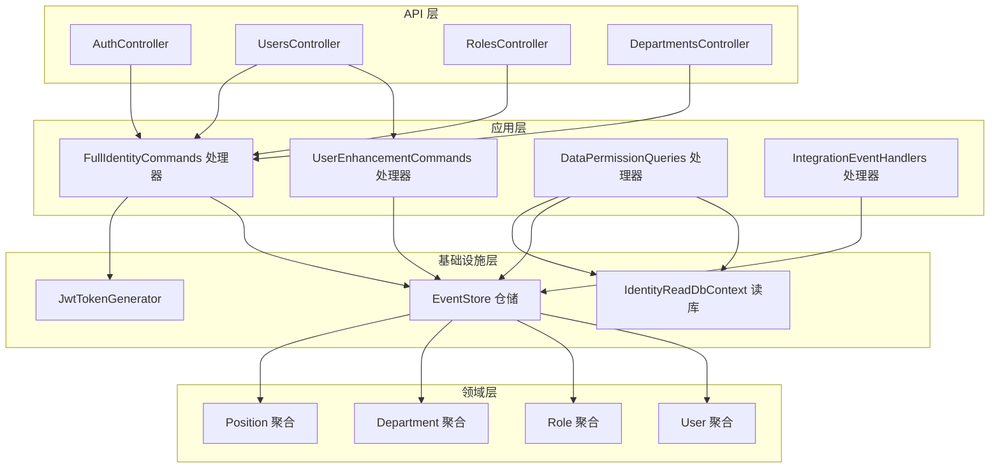

图表来源
- [Program.cs](file://src/Services/Identity/ErpSystem.Identity/Program.cs#L11-L69)
- [AuthController.cs](file://src/services/Identity/ErpSystem.Identity/API/AuthController.cs#L9-L31)
- [UsersController.cs](file://src/services/Identity/ErpSystem.Identity/API/UsersController.cs#L11-L55)
- [RolesController.cs](file://src/services/Identity/ErpSystem.Identity/API/RolesController.cs#L12-L55)
- [DepartmentsController.cs](file://src/services/Identity/ErpSystem.Identity/API/DepartmentsController.cs#L11-L36)
- [UserEnhancementCommands.cs](file://src/services/Identity/ErpSystem.Identity/Application/UserEnhancementCommands.cs#L17-L63)
- [FullIdentityCommands.cs](file://src/services/Identity/ErpSystem.Identity/Application/FullIdentityCommands.cs#L27-L122)
- [DataPermissionQueries.cs](file://src/services/Identity/ErpSystem.Identity/Application/DataPermissionQueries.cs#L26-L78)
- [IntegrationEventHandlers.cs](file://src/services/Identity/ErpSystem.Identity/Application/IntegrationEventHandlers.cs#L8-L32)
- [UserAggregate.cs](file://src/services/Identity/ErpSystem.Identity/Domain/UserAggregate.cs#L55-L163)
- [RoleAggregate.cs](file://src/services/Identity/ErpSystem.Identity/Domain/RoleAggregate.cs#L42-L93)
- [DepartmentAggregate.cs](file://src/services/Identity/ErpSystem.Identity/Domain/DepartmentAggregate.cs#L19-L55)
- [PositionAggregate.cs](file://src/services/Identity/ErpSystem.Identity/Domain/PositionAggregate.cs#L13-L36)
- [JwtTokenGenerator.cs](file://src/services/Identity/ErpSystem.Identity/Infrastructure/JwtTokenGenerator.cs#L8-L37)

章节来源
- [Program.cs](file://src/Services/Identity/ErpSystem.Identity/Program.cs#L11-L69)

## 核心组件
- 用户聚合：管理用户基本信息、登录状态、锁定策略、角色集合、岗位与部门关联等
- 角色聚合：维护角色标识、系统角色标记、权限列表与数据权限配置
- 部门聚合：树形组织结构，支持移动调整父子关系
- 职位聚合：岗位定义与描述
- 应用服务：
  - 完整身份管理：注册、登录、创建角色、分配权限、创建/移动部门、创建职位、更新用户档案
  - 身份增强：锁定/解锁用户、重置密码、为用户分配角色
  - 数据权限查询：按用户与数据域合并多个角色的数据权限，计算最终范围
  - HR 集成：员工入职/离职事件驱动用户创建与锁定
- 基础设施：
  - 事件存储与仓储：基于事件溯源持久化聚合变更
  - 读库：EF Core 查询投影模型，用于高效读取
  - JWT 生成器：基于对称密钥签发令牌
- 用户上下文：从 HTTP 上下文提取用户标识、租户、角色等声明

章节来源
- [UserAggregate.cs](file://src/services/Identity/ErpSystem.Identity/Domain/UserAggregate.cs#L55-L163)
- [RoleAggregate.cs](file://src/services/Identity/ErpSystem.Identity/Domain/RoleAggregate.cs#L42-L93)
- [DepartmentAggregate.cs](file://src/services/Identity/ErpSystem.Identity/Domain/DepartmentAggregate.cs#L19-L55)
- [PositionAggregate.cs](file://src/services/Identity/ErpSystem.Identity/Domain/PositionAggregate.cs#L13-L36)
- [FullIdentityCommands.cs](file://src/services/Identity/ErpSystem.Identity/Application/FullIdentityCommands.cs#L27-L122)
- [UserEnhancementCommands.cs](file://src/services/Identity/ErpSystem.Identity/Application/UserEnhancementCommands.cs#L17-L63)
- [DataPermissionQueries.cs](file://src/services/Identity/ErpSystem.Identity/Application/DataPermissionQueries.cs#L26-L78)
- [IntegrationEventHandlers.cs](file://src/services/Identity/ErpSystem.Identity/Application/IntegrationEventHandlers.cs#L8-L32)
- [JwtTokenGenerator.cs](file://src/services/Identity/ErpSystem.Identity/Infrastructure/JwtTokenGenerator.cs#L8-L37)
- [UserContext.cs](file://src/buildingBlocks/ErpSystem.BuildingBlocks/Auth/UserContext.cs#L6-L33)

## 架构总览
系统采用事件驱动的 CQRS 架构：
- 写模型：命令通过 MediatR 分发到应用层处理器，处理器加载/保存聚合，产生领域事件并写入事件存储
- 读模型：投影将事件转换为读库实体，供查询与权限计算使用
- 鉴权与上下文：JWT 令牌在登录时生成；用户上下文从请求中解析声明，支持多租户

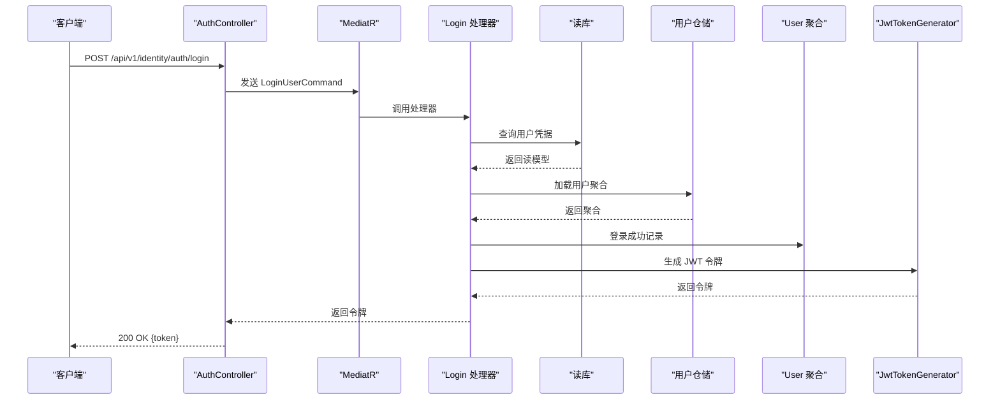

图表来源
- [AuthController.cs](file://src/services/Identity/ErpSystem.Identity/API/AuthController.cs#L18-L30)
- [FullIdentityCommands.cs](file://src/services/Identity/ErpSystem.Identity/Application/FullIdentityCommands.cs#L77-L89)
- [UserAggregate.cs](file://src/services/Identity/ErpSystem.Identity/Domain/UserAggregate.cs#L79-L82)
- [JwtTokenGenerator.cs](file://src/services/Identity/ErpSystem.Identity/Infrastructure/JwtTokenGenerator.cs#L15-L36)

## 详细组件分析

### 用户聚合（UserAggregate）
- 关键属性：用户名、邮箱、显示名、密码哈希、电话、锁定状态、失败计数、主部门/岗位、角色列表
- 事件与行为：
  - 登录成功/失败：重置失败计数或触发锁定
  - 更新档案：记录主部门、主岗位、电话
  - 锁定/解锁：设置锁定截止时间
  - 分配角色：去重添加
  - 密码变更：更新哈希
- 设计要点：基于事件溯源，所有状态变更以领域事件形式记录，保证可追溯性

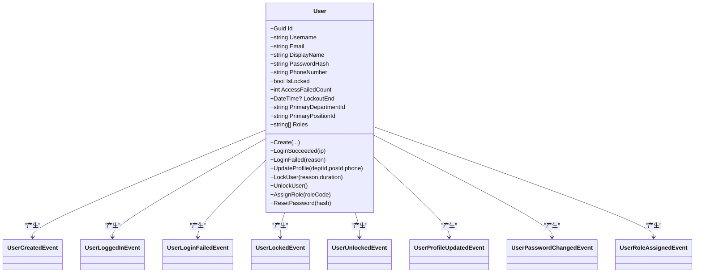

图表来源
- [UserAggregate.cs](file://src/services/Identity/ErpSystem.Identity/Domain/UserAggregate.cs#L55-L163)

章节来源
- [UserAggregate.cs](file://src/services/Identity/ErpSystem.Identity/Domain/UserAggregate.cs#L55-L163)

### 角色聚合（RoleAggregate）
- 关键属性：角色名称、角色编码、是否系统角色、权限列表、数据权限集合
- 事件与行为：
  - 创建角色
  - 分配权限（去重）
  - 配置数据权限：同一数据域仅保留最新配置
- 设计要点：数据权限以值对象集合存储，支持按数据域与作用域类型组合

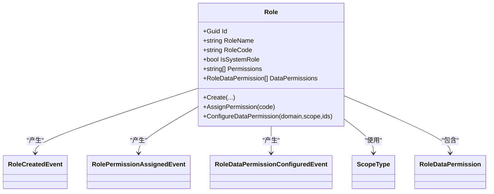

图表来源
- [RoleAggregate.cs](file://src/services/Identity/ErpSystem.Identity/Domain/RoleAggregate.cs#L42-L93)

章节来源
- [RoleAggregate.cs](file://src/services/Identity/ErpSystem.Identity/Domain/RoleAggregate.cs#L42-L93)

### 部门聚合（DepartmentAggregate）
- 关键属性：名称、父节点标识、排序
- 行为：创建与移动（变更父节点即产生事件）
- 设计要点：支持树形结构，移动操作通过事件记录变更历史

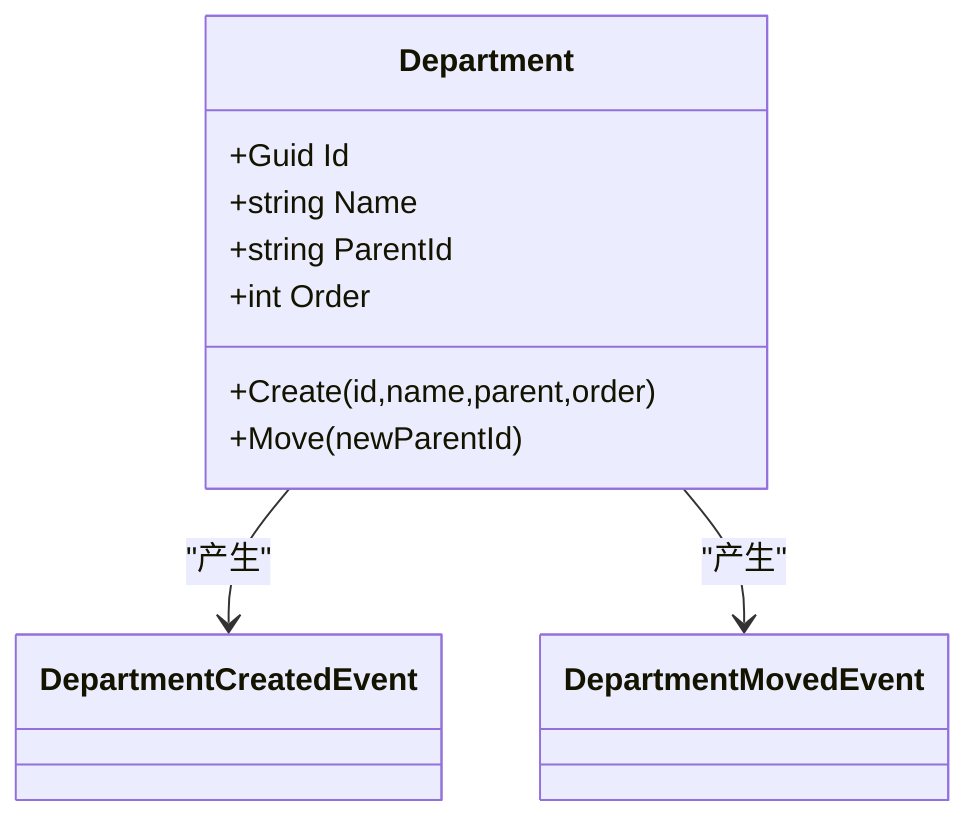

图表来源
- [DepartmentAggregate.cs](file://src/services/Identity/ErpSystem.Identity/Domain/DepartmentAggregate.cs#L19-L55)

章节来源
- [DepartmentAggregate.cs](file://src/services/Identity/ErpSystem.Identity/Domain/DepartmentAggregate.cs#L19-L55)

### 职位聚合（PositionAggregate）
- 关键属性：名称、描述
- 行为：创建

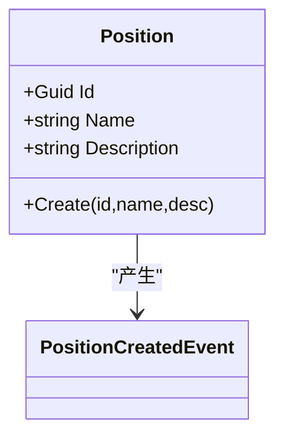

图表来源
- [PositionAggregate.cs](file://src/services/Identity/ErpSystem.Identity/Domain/PositionAggregate.cs#L13-L36)

章节来源
- [PositionAggregate.cs](file://src/services/Identity/ErpSystem.Identity/Domain/PositionAggregate.cs#L13-L36)

### 应用服务与 API

#### 完整身份管理（FullIdentityCommands）
- 功能点：
  - 注册用户：生成新用户聚合
  - 登录：校验凭据、记录登录成功、生成 JWT
  - 创建角色/分配权限/配置数据权限
  - 创建/移动部门
  - 创建职位
  - 更新用户档案
- 实现要点：处理器统一使用事件存储仓储，确保事件溯源一致性

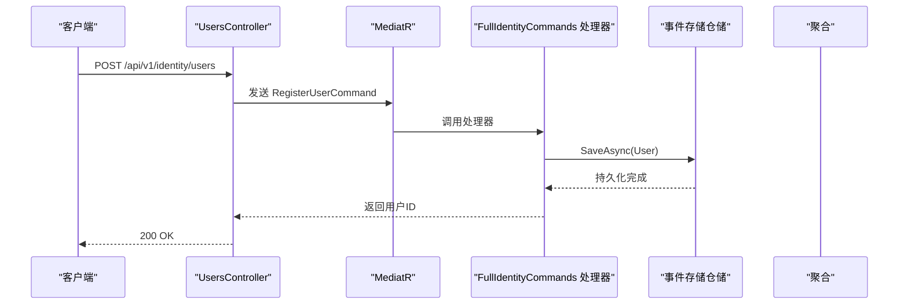

图表来源
- [UsersController.cs](file://src/services/Identity/ErpSystem.Identity/API/UsersController.cs#L13-L18)
- [FullIdentityCommands.cs](file://src/services/Identity/ErpSystem.Identity/Application/FullIdentityCommands.cs#L68-L75)

章节来源
- [FullIdentityCommands.cs](file://src/services/Identity/ErpSystem.Identity/Application/FullIdentityCommands.cs#L27-L122)
- [UsersController.cs](file://src/services/Identity/ErpSystem.Identity/API/UsersController.cs#L13-L18)

#### 身份增强命令（UserEnhancementCommands）
- 功能点：锁定/解锁用户、重置密码、为用户分配角色
- 实现要点：加载聚合后直接变更并保存，返回布尔结果

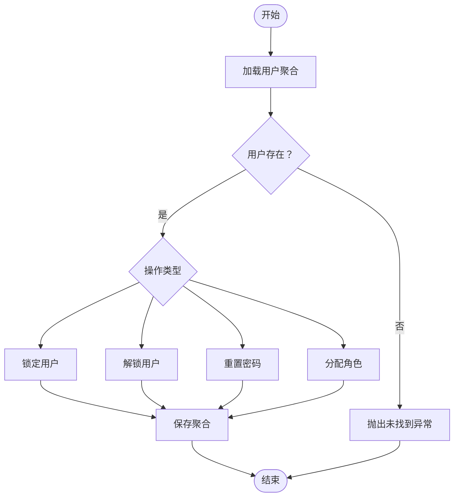

图表来源
- [UserEnhancementCommands.cs](file://src/services/Identity/ErpSystem.Identity/Application/UserEnhancementCommands.cs#L23-L62)

章节来源
- [UserEnhancementCommands.cs](file://src/services/Identity/ErpSystem.Identity/Application/UserEnhancementCommands.cs#L17-L63)

#### 数据权限查询（DataPermissionQueries）
- 功能点：根据用户与数据域，合并其所有角色的数据权限，计算最终范围
- 实现要点：先从用户聚合获取角色编码，再从读库加载角色定义，反序列化权限与数据权限，按域匹配与范围比较得出结果

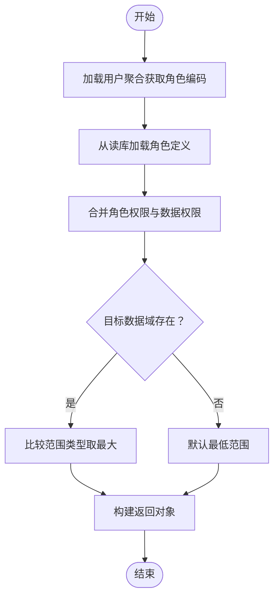

图表来源
- [DataPermissionQueries.cs](file://src/services/Identity/ErpSystem.Identity/Application/DataPermissionQueries.cs#L28-L74)

章节来源
- [DataPermissionQueries.cs](file://src/services/Identity/ErpSystem.Identity/Application/DataPermissionQueries.cs#L11-L78)

#### HR 集成（IntegrationEventHandlers）
- 入职事件：自动创建用户聚合，设置主部门与岗位，并保存
- 离职事件：根据用户 ID 锁定账户（长期）

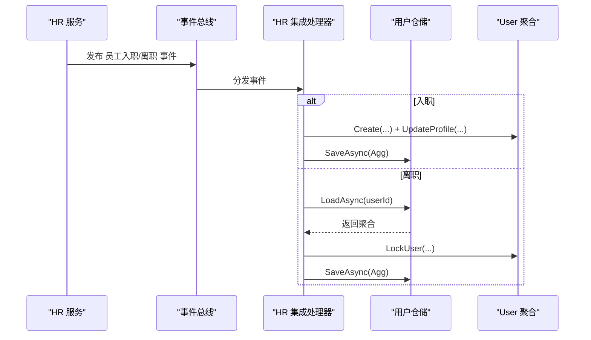

图表来源
- [IntegrationEventHandlers.cs](file://src/services/Identity/ErpSystem.Identity/Application/IntegrationEventHandlers.cs#L12-L31)

章节来源
- [IntegrationEventHandlers.cs](file://src/services/Identity/ErpSystem.Identity/Application/IntegrationEventHandlers.cs#L8-L32)

### 安全与中间件
- JWT 令牌生成：使用对称密钥（HMAC-SHA256）签发，包含子标识、姓名、JTI、过期时间等声明
- 用户上下文：从 HTTP 请求中解析用户标识、租户、角色等声明，支持多租户场景
- 中间件：鉴权中间件用于验证请求头中的 JWT 并注入用户上下文

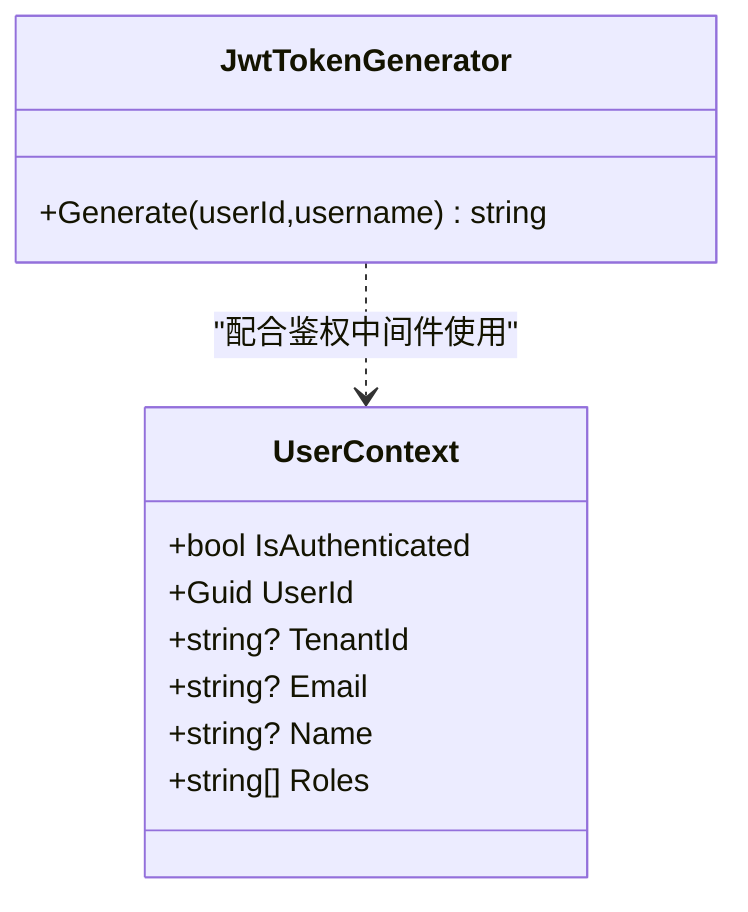

图表来源
- [JwtTokenGenerator.cs](file://src/services/Identity/ErpSystem.Identity/Infrastructure/JwtTokenGenerator.cs#L8-L37)
- [UserContext.cs](file://src/buildingBlocks/ErpSystem.BuildingBlocks/Auth/UserContext.cs#L6-L33)

章节来源
- [JwtTokenGenerator.cs](file://src/services/Identity/ErpSystem.Identity/Infrastructure/JwtTokenGenerator.cs#L8-L37)
- [UserContext.cs](file://src/buildingBlocks/ErpSystem.BuildingBlocks/Auth/UserContext.cs#L6-L33)

## 依赖关系分析
- 控制器依赖 MediatR 将请求路由到对应处理器
- 处理器依赖事件存储仓储与读库上下文
- 聚合之间无直接耦合，通过事件与读模型交互
- JWT 生成器独立于业务逻辑，仅依赖对称密钥配置

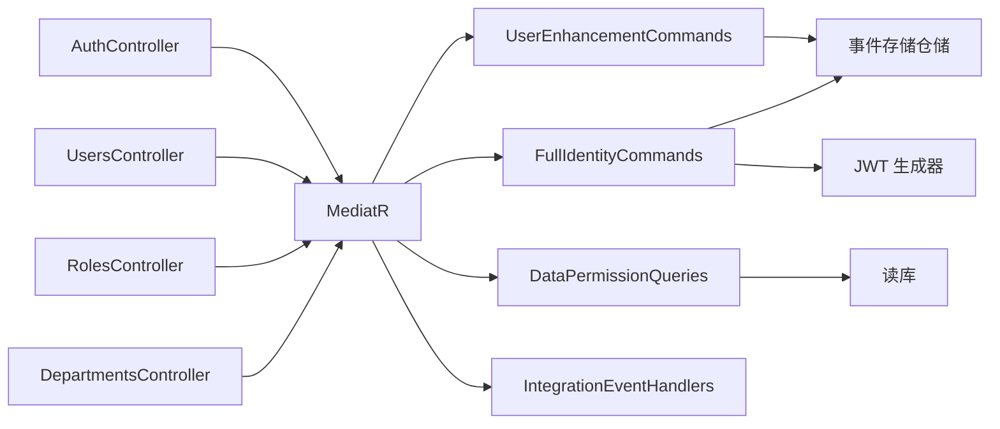

图表来源
- [Program.cs](file://src/Services/Identity/ErpSystem.Identity/Program.cs#L26-L39)
- [AuthController.cs](file://src/services/Identity/ErpSystem.Identity/API/AuthController.cs#L9-L31)
- [UsersController.cs](file://src/services/Identity/ErpSystem.Identity/API/UsersController.cs#L11-L55)
- [RolesController.cs](file://src/services/Identity/ErpSystem.Identity/API/RolesController.cs#L12-L55)
- [DepartmentsController.cs](file://src/services/Identity/ErpSystem.Identity/API/DepartmentsController.cs#L11-L36)
- [UserEnhancementCommands.cs](file://src/services/Identity/ErpSystem.Identity/Application/UserEnhancementCommands.cs#L17-L63)
- [FullIdentityCommands.cs](file://src/services/Identity/ErpSystem.Identity/Application/FullIdentityCommands.cs#L27-L122)
- [DataPermissionQueries.cs](file://src/services/Identity/ErpSystem.Identity/Application/DataPermissionQueries.cs#L26-L78)
- [IntegrationEventHandlers.cs](file://src/services/Identity/ErpSystem.Identity/Application/IntegrationEventHandlers.cs#L8-L32)
- [JwtTokenGenerator.cs](file://src/services/Identity/ErpSystem.Identity/Infrastructure/JwtTokenGenerator.cs#L8-L37)

章节来源
- [Program.cs](file://src/Services/Identity/ErpSystem.Identity/Program.cs#L26-L39)

## 性能考虑
- 读写分离：写模型使用事件存储，读模型使用 EF Core 投影，降低查询复杂度
- 权限合并：在读库中聚合角色权限与数据权限，避免多次往返
- 缓存建议：对常用角色与用户读模型进行缓存，减少数据库压力
- 事件处理：异步事件处理与批量写入可提升吞吐量

## 故障排除指南
- 登录失败：检查凭据与用户锁定状态；查看登录失败事件与锁定截止时间
- 用户不存在：确认用户聚合是否已创建，或是否被 HR 事件驱动创建
- 权限不足：核对用户角色与数据权限配置，确认数据域与范围类型
- JWT 无效：确认密钥配置、签发方与受众一致，检查过期时间

章节来源
- [FullIdentityCommands.cs](file://src/services/Identity/ErpSystem.Identity/Application/FullIdentityCommands.cs#L77-L89)
- [UserEnhancementCommands.cs](file://src/services/Identity/ErpSystem.Identity/Application/UserEnhancementCommands.cs#L23-L62)
- [DataPermissionQueries.cs](file://src/services/Identity/ErpSystem.Identity/Application/DataPermissionQueries.cs#L28-L74)

## 结论
身份认证服务通过事件驱动的 CQRS 架构实现了 RBAC 权限控制、组织与职位管理、数据权限查询与 HR 集成。JWT 令牌与用户上下文为多租户与跨服务鉴权提供了基础。建议后续完善密钥管理、审计日志与权限检查中间件，以满足生产环境的安全与合规要求。

## 附录：API 接口文档

- 认证
  - POST /api/v1/identity/auth/register
    - 请求体：用户名、邮箱、密码、显示名
    - 响应：用户ID
  - POST /api/v1/identity/auth/login
    - 请求体：用户名、密码
    - 响应：JWT 令牌

- 用户
  - POST /api/v1/identity/users
    - 请求体：注册参数
    - 响应：用户ID
  - GET /api/v1/identity/users
    - 响应：用户列表
  - GET /api/v1/identity/users/{id}
    - 响应：指定用户
  - PUT /api/v1/identity/users/{id}/profile
    - 请求体：部门ID、岗位ID、电话
    - 响应：204
  - POST /api/v1/identity/users/{id}/lock
    - 请求体：锁定原因
    - 响应：204
  - POST /api/v1/identity/users/{id}/unlock
    - 响应：204
  - POST /api/v1/identity/users/{id}/roles
    - 请求体：角色编码
    - 响应：204

- 角色
  - POST /api/v1/identity/roles
    - 请求体：角色名称、角色编码、是否系统角色
    - 响应：角色ID
  - GET /api/v1/identity/roles
    - 响应：角色列表
  - POST /api/v1/identity/roles/{id}/permissions
    - 请求体：权限编码
    - 响应：204
  - POST /api/v1/identity/roles/{id}/data-permissions
    - 请求体：角色ID、数据域、范围类型、允许ID列表
    - 响应：204

- 职位
  - POST /api/v1/identity/positions
    - 请求体：职位名称、描述
    - 响应：职位ID
  - GET /api/v1/identity/positions
    - 响应：职位列表

- 部门
  - POST /api/v1/identity/departments
    - 请求体：部门名称、父ID、排序
    - 响应：部门ID
  - GET /api/v1/identity/departments
    - 响应：部门列表（按排序）
  - POST /api/v1/identity/departments/{id}/move
    - 请求体：新的父ID
    - 响应：204

章节来源
- [AuthController.cs](file://src/services/Identity/ErpSystem.Identity/API/AuthController.cs#L11-L30)
- [UsersController.cs](file://src/services/Identity/ErpSystem.Identity/API/UsersController.cs#L13-L54)
- [RolesController.cs](file://src/services/Identity/ErpSystem.Identity/API/RolesController.cs#L14-L55)
- [DepartmentsController.cs](file://src/services/Identity/ErpSystem.Identity/API/DepartmentsController.cs#L13-L35)