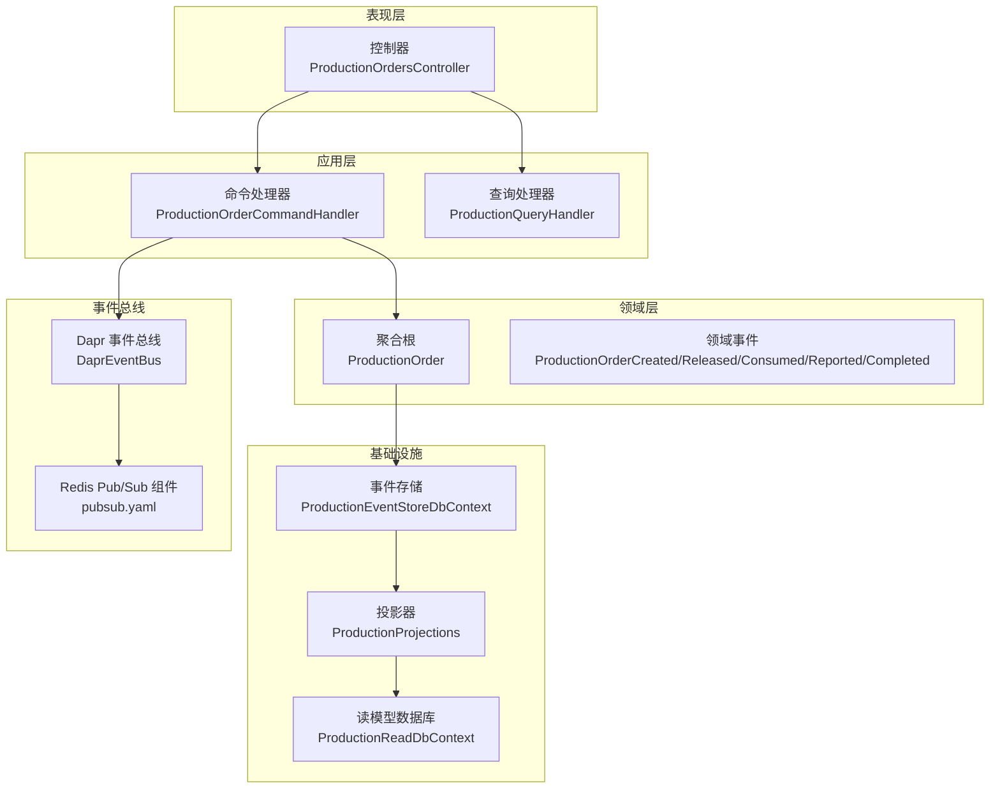
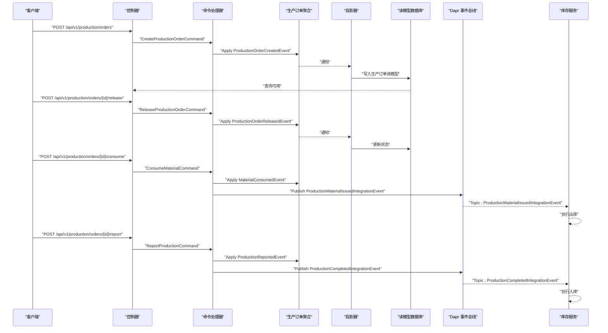
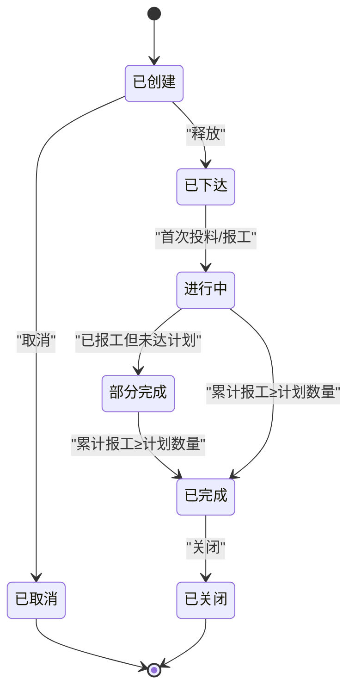
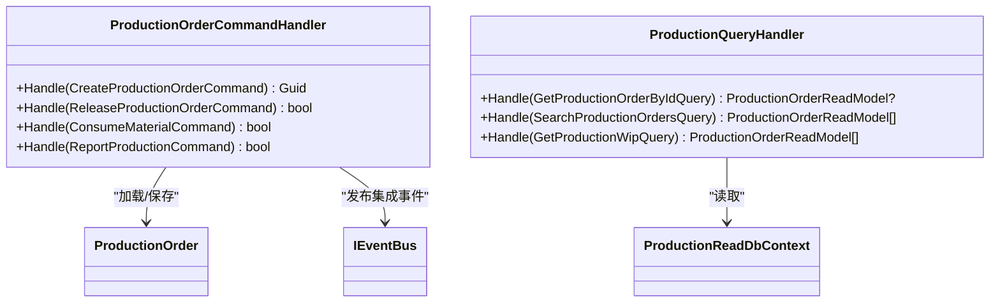
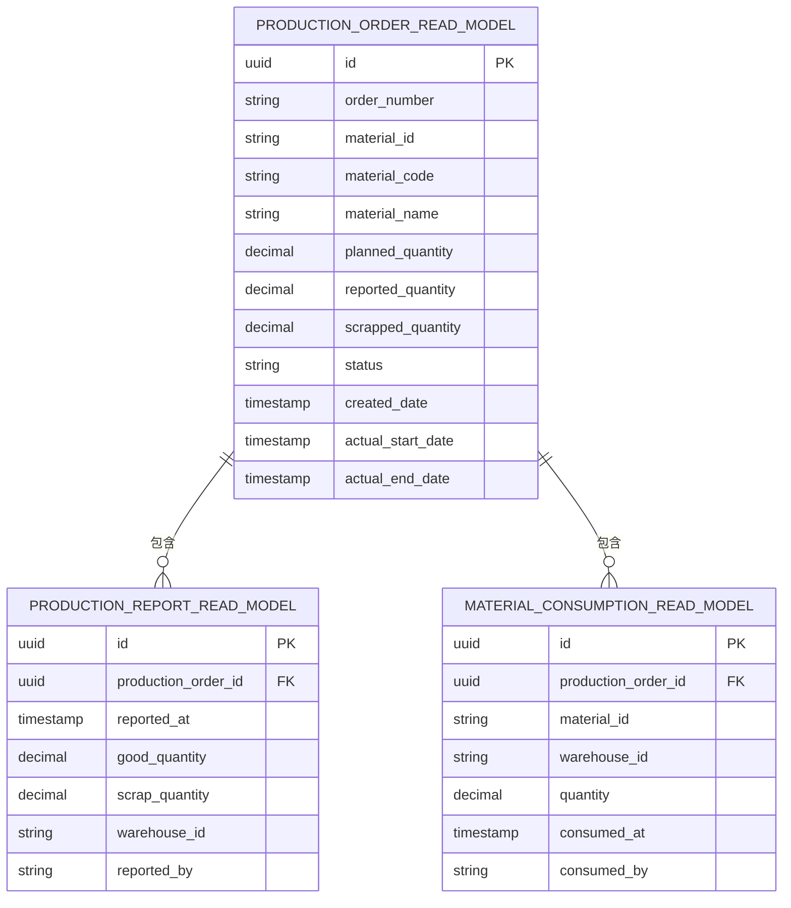
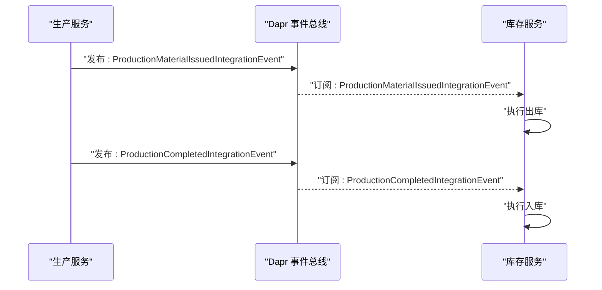
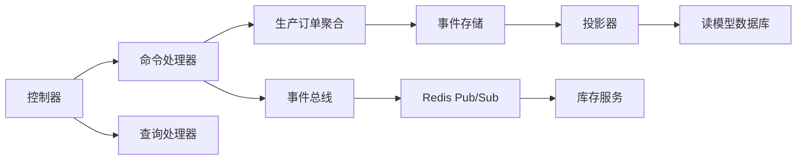

# 生产管理服务

<cite>
**本文引用的文件**
- [PRD-07-Production-Service.md](file://docs/PRD-07-Production-Service.md)
- [Program.cs](file://src/Services/Production/ErpSystem.Production/Program.cs)
- [ProductionOrdersController.cs](file://src/Services/Production/ErpSystem.Production/API/ProductionOrdersController.cs)
- [ProductionOrderCommands.cs](file://src/Services/Production/ErpSystem.Production/Application/ProductionOrderCommands.cs)
- [ProductionQueries.cs](file://src/Services/Production/ErpSystem.Production/Application/ProductionQueries.cs)
- [ProductionOrderAggregate.cs](file://src/Services/Production/ErpSystem.Production/Domain/ProductionOrderAggregate.cs)
- [ProductionEvents.cs](file://src/Services/Production/ErpSystem.Production/Domain/ProductionEvents.cs)
- [Persistence.cs](file://src/Services/Production/ErpSystem.Production/Infrastructure/Persistence.cs)
- [Projections.cs](file://src/Services/Production/ErpSystem.Production/Infrastructure/Projections.cs)
- [DaprEventBus.cs](file://src/BuildingBlocks/ErpSystem.BuildingBlocks/EventBus/DaprEventBus.cs)
- [pubsub.yaml](file://components/pubsub.yaml)
- [IntegrationEventHandlers.cs（Inventory）](file://src/Services/Inventory/ErpSystem.Inventory/Application/IntegrationEventHandlers.cs)
- [ProductionToInventoryTests.cs](file://src/Tests/ErpSystem.IntegrationTests/ProductionToInventoryTests.cs)
- [BOMCommands.cs（MasterData）](file://src/Services/MasterData/ErpSystem.MasterData/Application/BOMCommands.cs)
- [QualityEventHandlers.cs（Quality）](file://src/Services/Quality/ErpSystem.Quality/Application/QualityEventHandlers.cs)
</cite>

## 目录
1. [简介](#简介)
2. [项目结构](#项目结构)
3. [核心组件](#核心组件)
4. [架构总览](#架构总览)
5. [详细组件分析](#详细组件分析)
6. [依赖关系分析](#依赖关系分析)
7. [性能考虑](#性能考虑)
8. [故障排查指南](#故障排查指南)
9. [结论](#结论)
10. [附录](#附录)

## 简介
本技术文档面向生产管理服务（ERP 微服务之一），围绕生产计划制定、生产工单管理、BOM 物料需求、生产进度跟踪等核心功能，系统阐述生产订单聚合的设计与实现，包括工序安排、物料需求计算、产能约束、质量控制等扩展点。文档还解释了生产事件模型（如工单创建、开始生产、完成入库、质量检验等）的处理机制，提供完整的 API 接口说明，并说明与物料需求计划（MRP）、库存管理、质量管理的事件集成，以实现生产过程的实时监控。最后，给出生产效率分析、瓶颈识别、成本核算等高级功能的技术实现思路与落地建议。

## 项目结构
生产管理服务采用分层架构与 CQRS/事件溯源模式：
- 表现层：控制器负责接收请求，转发至应用层命令/查询处理器
- 应用层：命令/查询处理器协调聚合与事件总线，驱动领域事件
- 领域层：生产订单聚合定义业务状态与行为，产生领域事件
- 基础设施层：事件存储（事件流）与读模型数据库，投影器监听事件写入读模型
- 事件总线：基于 Dapr Pub/Sub，发布集成事件到其他服务



图表来源
- [Program.cs](file://src/Services/Production/ErpSystem.Production/Program.cs#L13-L46)
- [ProductionOrdersController.cs](file://src/Services/Production/ErpSystem.Production/API/ProductionOrdersController.cs#L1-L46)
- [ProductionOrderCommands.cs](file://src/Services/Production/ErpSystem.Production/Application/ProductionOrderCommands.cs#L33-L99)
- [ProductionQueries.cs](file://src/Services/Production/ErpSystem.Production/Application/ProductionQueries.cs#L13-L44)
- [ProductionOrderAggregate.cs](file://src/Services/Production/ErpSystem.Production/Domain/ProductionOrderAggregate.cs#L63-L142)
- [Persistence.cs](file://src/Services/Production/ErpSystem.Production/Infrastructure/Persistence.cs#L6-L32)
- [Projections.cs](file://src/Services/Production/ErpSystem.Production/Infrastructure/Projections.cs#L6-L107)
- [DaprEventBus.cs](file://src/BuildingBlocks/ErpSystem.BuildingBlocks/EventBus/DaprEventBus.cs#L11-L21)
- [pubsub.yaml](file://components/pubsub.yaml#L1-L13)

章节来源
- [Program.cs](file://src/Services/Production/ErpSystem.Production/Program.cs#L1-L72)
- [ProductionOrdersController.cs](file://src/Services/Production/ErpSystem.Production/API/ProductionOrdersController.cs#L1-L46)
- [ProductionOrderCommands.cs](file://src/Services/Production/ErpSystem.Production/Application/ProductionOrderCommands.cs#L1-L99)
- [ProductionQueries.cs](file://src/Services/Production/ErpSystem.Production/Application/ProductionQueries.cs#L1-L44)
- [ProductionOrderAggregate.cs](file://src/Services/Production/ErpSystem.Production/Domain/ProductionOrderAggregate.cs#L1-L142)
- [Persistence.cs](file://src/Services/Production/ErpSystem.Production/Infrastructure/Persistence.cs#L1-L71)
- [Projections.cs](file://src/Services/Production/ErpSystem.Production/Infrastructure/Projections.cs#L1-L107)
- [DaprEventBus.cs](file://src/BuildingBlocks/ErpSystem.BuildingBlocks/EventBus/DaprEventBus.cs#L1-L31)
- [pubsub.yaml](file://components/pubsub.yaml#L1-L13)

## 核心组件
- 生产订单聚合与状态机：定义生产订单生命周期与状态转换，封装业务规则
- 命令/查询处理器：编排聚合与事件总线，发布集成事件
- 事件存储与读模型：事件溯源持久化与投影写入读模型
- 控制器：暴露 REST API，统一入口
- 事件总线：基于 Dapr Pub/Sub，实现跨服务解耦

章节来源
- [ProductionOrderAggregate.cs](file://src/Services/Production/ErpSystem.Production/Domain/ProductionOrderAggregate.cs#L5-L142)
- [ProductionOrderCommands.cs](file://src/Services/Production/ErpSystem.Production/Application/ProductionOrderCommands.cs#L33-L99)
- [Persistence.cs](file://src/Services/Production/ErpSystem.Production/Infrastructure/Persistence.cs#L6-L32)
- [Projections.cs](file://src/Services/Production/ErpSystem.Production/Infrastructure/Projections.cs#L6-L107)
- [ProductionOrdersController.cs](file://src/Services/Production/ErpSystem.Production/API/ProductionOrdersController.cs#L1-L46)
- [DaprEventBus.cs](file://src/BuildingBlocks/ErpSystem.BuildingBlocks/EventBus/DaprEventBus.cs#L11-L21)

## 架构总览
生产管理服务通过事件驱动实现与库存、质量等服务的松耦合集成：
- 生产订单状态变化触发领域事件，投影器写入读模型供查询
- 命令处理器发布集成事件到 Dapr Pub/Sub，Inventory 服务订阅并执行库存出入库
- 质量服务订阅生产事件，触发质量检查流程



图表来源
- [ProductionOrdersController.cs](file://src/Services/Production/ErpSystem.Production/API/ProductionOrdersController.cs#L11-L44)
- [ProductionOrderCommands.cs](file://src/Services/Production/ErpSystem.Production/Application/ProductionOrderCommands.cs#L39-L97)
- [ProductionOrderAggregate.cs](file://src/Services/Production/ErpSystem.Production/Domain/ProductionOrderAggregate.cs#L113-L140)
- [Projections.cs](file://src/Services/Production/ErpSystem.Production/Infrastructure/Projections.cs#L13-L105)
- [DaprEventBus.cs](file://src/BuildingBlocks/ErpSystem.BuildingBlocks/EventBus/DaprEventBus.cs#L15-L20)
- [IntegrationEventHandlers.cs（Inventory）](file://src/Services/Inventory/ErpSystem.Inventory/Application/IntegrationEventHandlers.cs#L76-L111)

章节来源
- [ProductionOrdersController.cs](file://src/Services/Production/ErpSystem.Production/API/ProductionOrdersController.cs#L1-L46)
- [ProductionOrderCommands.cs](file://src/Services/Production/ErpSystem.Production/Application/ProductionOrderCommands.cs#L33-L99)
- [ProductionOrderAggregate.cs](file://src/Services/Production/ErpSystem.Production/Domain/ProductionOrderAggregate.cs#L16-L142)
- [Projections.cs](file://src/Services/Production/ErpSystem.Production/Infrastructure/Projections.cs#L1-L107)
- [DaprEventBus.cs](file://src/BuildingBlocks/ErpSystem.BuildingBlocks/EventBus/DaprEventBus.cs#L1-L31)
- [IntegrationEventHandlers.cs（Inventory）](file://src/Services/Inventory/ErpSystem.Inventory/Application/IntegrationEventHandlers.cs#L76-L111)

## 详细组件分析

### 生产订单聚合与状态机
- 聚合根：生产订单，维护订单编号、物料、计划数量、累计报工、报废数量、状态等
- 领域事件：创建、释放、投料、报工、完成等
- 状态机：Created → Released → InProgress → PartiallyCompleted → Completed；支持关闭与取消
- 业务规则：状态前置条件、首次投料/报工自动进入 InProgress、累计报工≥计划数量自动完成



图表来源
- [ProductionOrderAggregate.cs](file://src/Services/Production/ErpSystem.Production/Domain/ProductionOrderAggregate.cs#L5-L142)

章节来源
- [ProductionOrderAggregate.cs](file://src/Services/Production/ErpSystem.Production/Domain/ProductionOrderAggregate.cs#L1-L142)

### 命令/查询处理器
- 命令处理器：创建订单、释放订单、投料、报工；保存聚合并发布集成事件
- 查询处理器：按条件查询订单、分页查询、在制品查询



图表来源
- [ProductionOrderCommands.cs](file://src/Services/Production/ErpSystem.Production/Application/ProductionOrderCommands.cs#L33-L99)
- [ProductionQueries.cs](file://src/Services/Production/ErpSystem.Production/Application/ProductionQueries.cs#L13-L44)

章节来源
- [ProductionOrderCommands.cs](file://src/Services/Production/ErpSystem.Production/Application/ProductionOrderCommands.cs#L1-L99)
- [ProductionQueries.cs](file://src/Services/Production/ErpSystem.Production/Application/ProductionQueries.cs#L1-L44)

### 事件存储与读模型
- 事件存储：事件流表，按聚合ID+版本存储 JSONB 事件载荷
- 读模型：生产订单、报工记录、投料记录三类读模型
- 投影器：监听领域事件，写入读模型并维护状态



图表来源
- [Persistence.cs](file://src/Services/Production/ErpSystem.Production/Infrastructure/Persistence.cs#L20-L71)
- [Projections.cs](file://src/Services/Production/ErpSystem.Production/Infrastructure/Projections.cs#L13-L105)

章节来源
- [Persistence.cs](file://src/Services/Production/ErpSystem.Production/Infrastructure/Persistence.cs#L1-L71)
- [Projections.cs](file://src/Services/Production/ErpSystem.Production/Infrastructure/Projections.cs#L1-L107)

### 控制器与 API
- 控制器：提供创建、查询、释放、投料、报工、在制品查询等端点
- 参数校验：路径参数与命令对象一致性校验

```mermaid
flowchart TD
Start(["请求进入"]) --> Route{"路由到哪个端点？"}
Route --> |POST /orders| Create["创建订单"]
Route --> |GET /orders/{id}| GetById["按ID查询"]
Route --> |GET /orders| Search["分页查询"]
Route --> |POST /{id}/release| Release["释放订单"]
Route --> |POST /{id}/consume| Consume["投料"]
Route --> |POST /{id}/report| Report["报工"]
Route --> |GET /orders/wip| Wip["在制品查询"]
Create --> End(["返回结果"])
GetById --> End
Search --> End
Release --> End
Consume --> End
Report --> End
Wip --> End
```

图表来源
- [ProductionOrdersController.cs](file://src/Services/Production/ErpSystem.Production/API/ProductionOrdersController.cs#L11-L44)

章节来源
- [ProductionOrdersController.cs](file://src/Services/Production/ErpSystem.Production/API/ProductionOrdersController.cs#L1-L46)

### 事件总线与集成
- 事件总线：DaprEventBus 将事件发布到 Redis Pub/Sub，默认主题名为事件类型名
- 集成事件：生产投料、生产完成两类集成事件
- Inventory 服务订阅并执行库存出入库



图表来源
- [DaprEventBus.cs](file://src/BuildingBlocks/ErpSystem.BuildingBlocks/EventBus/DaprEventBus.cs#L15-L20)
- [ProductionEvents.cs](file://src/Services/Production/ErpSystem.Production/Domain/ProductionEvents.cs#L7-L23)
- [IntegrationEventHandlers.cs（Inventory）](file://src/Services/Inventory/ErpSystem.Inventory/Application/IntegrationEventHandlers.cs#L76-L111)

章节来源
- [DaprEventBus.cs](file://src/BuildingBlocks/ErpSystem.BuildingBlocks/EventBus/DaprEventBus.cs#L1-L31)
- [ProductionEvents.cs](file://src/Services/Production/ErpSystem.Production/Domain/ProductionEvents.cs#L1-L24)
- [IntegrationEventHandlers.cs（Inventory）](file://src/Services/Inventory/ErpSystem.Inventory/Application/IntegrationEventHandlers.cs#L76-L111)

### 与 MRP、库存、质量的集成
- 与 MRP：PRD 描述了后续引入 BOM 与 MRP 计算的计划驱动，当前可基于 MasterData 的 BOM 能力进行标准用量指导
- 与库存：通过集成事件驱动库存出入库，测试覆盖了投料与完工对库存的影响
- 与质量：质量服务订阅生产事件，触发 PQC/IQC 等质量检查

章节来源
- [PRD-07-Production-Service.md](file://docs/PRD-07-Production-Service.md#L374-L408)
- [IntegrationEventHandlers.cs（Inventory）](file://src/Services/Inventory/ErpSystem.Inventory/Application/IntegrationEventHandlers.cs#L76-L111)
- [ProductionToInventoryTests.cs](file://src/Tests/ErpSystem.IntegrationTests/ProductionToInventoryTests.cs#L13-L96)
- [BOMCommands.cs（MasterData）](file://src/Services/MasterData/ErpSystem.MasterData/Application/BOMCommands.cs#L1-L49)
- [QualityEventHandlers.cs（Quality）](file://src/Services/Quality/ErpSystem.Quality/Application/QualityEventHandlers.cs#L10-L74)

## 依赖关系分析
- 组件内聚：控制器、命令/查询处理器、聚合、投影器职责清晰
- 组件耦合：通过事件总线与集成事件解耦，避免直接调用
- 外部依赖：PostgreSQL（事件存储与读模型）、Dapr Redis Pub/Sub



图表来源
- [Program.cs](file://src/Services/Production/ErpSystem.Production/Program.cs#L13-L46)
- [ProductionOrdersController.cs](file://src/Services/Production/ErpSystem.Production/API/ProductionOrdersController.cs#L1-L46)
- [ProductionOrderCommands.cs](file://src/Services/Production/ErpSystem.Production/Application/ProductionOrderCommands.cs#L33-L99)
- [Projections.cs](file://src/Services/Production/ErpSystem.Production/Infrastructure/Projections.cs#L6-L107)
- [DaprEventBus.cs](file://src/BuildingBlocks/ErpSystem.BuildingBlocks/EventBus/DaprEventBus.cs#L11-L21)
- [pubsub.yaml](file://components/pubsub.yaml#L1-L13)

章节来源
- [Program.cs](file://src/Services/Production/ErpSystem.Production/Program.cs#L1-L72)
- [ProductionOrdersController.cs](file://src/Services/Production/ErpSystem.Production/API/ProductionOrdersController.cs#L1-L46)
- [ProductionOrderCommands.cs](file://src/Services/Production/ErpSystem.Production/Application/ProductionOrderCommands.cs#L1-L99)
- [Projections.cs](file://src/Services/Production/ErpSystem.Production/Infrastructure/Projections.cs#L1-L107)
- [DaprEventBus.cs](file://src/BuildingBlocks/ErpSystem.BuildingBlocks/EventBus/DaprEventBus.cs#L1-L31)
- [pubsub.yaml](file://components/pubsub.yaml#L1-L13)

## 性能考虑
- 查询性能：读模型数据库支持高效分页与过滤；建议在读模型表上建立必要索引（如物料ID、状态、创建时间）
- 事件处理：投影器与事件总线采用异步处理，避免阻塞命令处理
- 缓存策略：结合读模型与缓存中间件，减少热点查询压力
- 并发控制：事件存储按聚合版本写入，避免并发冲突

## 故障排查指南
- 状态异常：若状态未按预期变化，检查投影器是否正确处理领域事件
- 集成事件未到达：确认 Dapr Pub/Sub 组件配置与订阅端点可达性
- 投递失败：检查事件总线日志与订阅服务的错误处理
- 测试验证：参考集成测试用例，验证投料与完工对库存的影响

章节来源
- [Projections.cs](file://src/Services/Production/ErpSystem.Production/Infrastructure/Projections.cs#L13-L105)
- [DaprEventBus.cs](file://src/BuildingBlocks/ErpSystem.BuildingBlocks/EventBus/DaprEventBus.cs#L15-L20)
- [pubsub.yaml](file://components/pubsub.yaml#L1-L13)
- [ProductionToInventoryTests.cs](file://src/Tests/ErpSystem.IntegrationTests/ProductionToInventoryTests.cs#L13-L96)

## 结论
生产管理服务通过事件驱动与 CQRS/事件溯源实现了生产订单的完整生命周期管理，具备良好的扩展性与可观测性。通过与库存、质量等服务的事件集成，形成闭环的生产执行体系。后续可引入 BOM 与 MRP 计划驱动、工序级进度管理、质量检验与成本核算等高级能力，持续提升生产运营效率与透明度。

## 附录

### API 接口清单
- 创建生产订单
  - 方法：POST
  - 路径：/api/v1/production/orders
  - 请求体：包含物料ID、编码、名称、计划数量
- 获取生产订单详情
  - 方法：GET
  - 路径：/api/v1/production/orders/{id}
- 查询生产订单列表
  - 方法：GET
  - 路径：/api/v1/production/orders
  - 查询参数：materialId、status、page
- 释放生产订单
  - 方法：POST
  - 路径：/api/v1/production/orders/{id}/release
- 投料（领料出库）
  - 方法：POST
  - 路径：/api/v1/production/orders/{id}/consume
  - 请求体：包含物料ID、仓库ID、数量、操作人
- 报工（完工入库）
  - 方法：POST
  - 路径：/api/v1/production/orders/{id}/report
  - 请求体：包含合格数量、报废数量、仓库ID、操作人
- 在制品查询
  - 方法：GET
  - 路径：/api/v1/production/orders/wip
  - 查询参数：materialId

章节来源
- [ProductionOrdersController.cs](file://src/Services/Production/ErpSystem.Production/API/ProductionOrdersController.cs#L11-L44)
- [PRD-07-Production-Service.md](file://docs/PRD-07-Production-Service.md#L338-L371)

### 事件模型与处理
- 领域事件
  - 生产订单创建、释放、投料、报工、完成
- 集成事件
  - 生产投料事件、生产完成事件
- 处理流程
  - 命令处理器发布集成事件
  - 订阅服务执行库存出入库
  - 投影器写入读模型

章节来源
- [ProductionOrderAggregate.cs](file://src/Services/Production/ErpSystem.Production/Domain/ProductionOrderAggregate.cs#L16-L60)
- [ProductionEvents.cs](file://src/Services/Production/ErpSystem.Production/Domain/ProductionEvents.cs#L5-L23)
- [ProductionOrderCommands.cs](file://src/Services/Production/ErpSystem.Production/Application/ProductionOrderCommands.cs#L65-L94)
- [IntegrationEventHandlers.cs（Inventory）](file://src/Services/Inventory/ErpSystem.Inventory/Application/IntegrationEventHandlers.cs#L76-L111)

### 与 MRP、库存、质量的集成要点
- MRP：后续引入 BOM 与 MRP 计算，实现计划驱动的生产订单生成
- 库存：通过集成事件驱动库存出入库，测试覆盖投料与完工
- 质量：订阅生产事件，触发质量检查流程

章节来源
- [PRD-07-Production-Service.md](file://docs/PRD-07-Production-Service.md#L374-L408)
- [ProductionToInventoryTests.cs](file://src/Tests/ErpSystem.IntegrationTests/ProductionToInventoryTests.cs#L13-L96)
- [QualityEventHandlers.cs（Quality）](file://src/Services/Quality/ErpSystem.Quality/Application/QualityEventHandlers.cs#L10-L74)