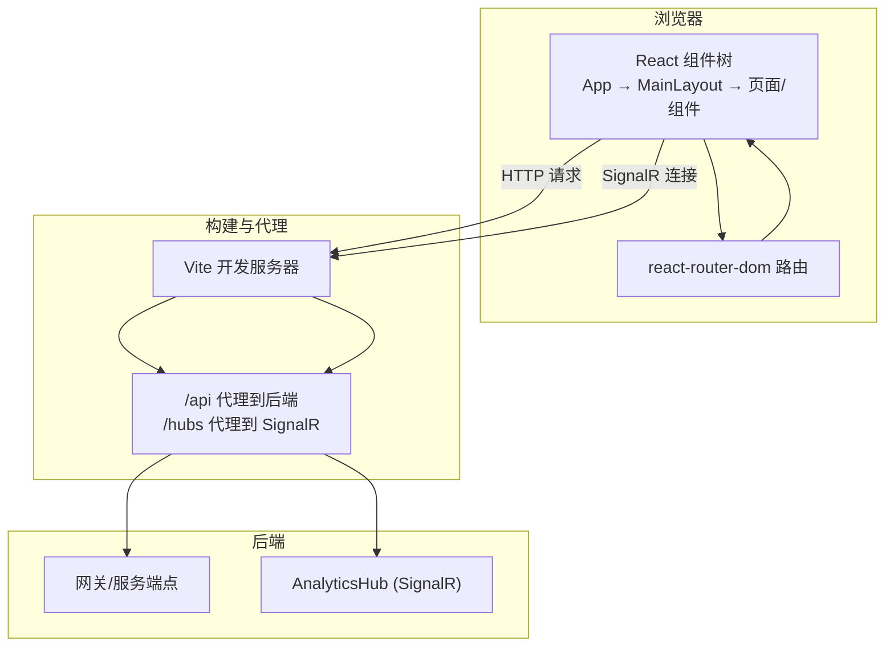
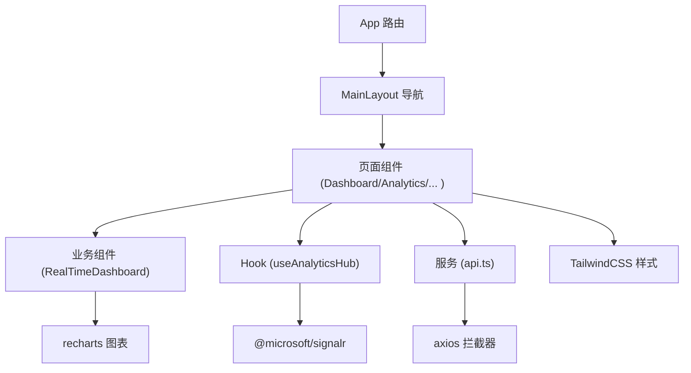
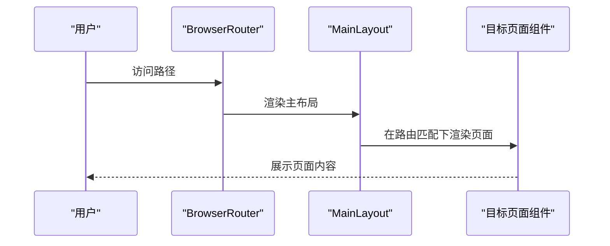
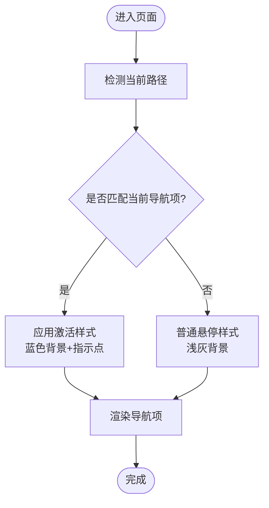
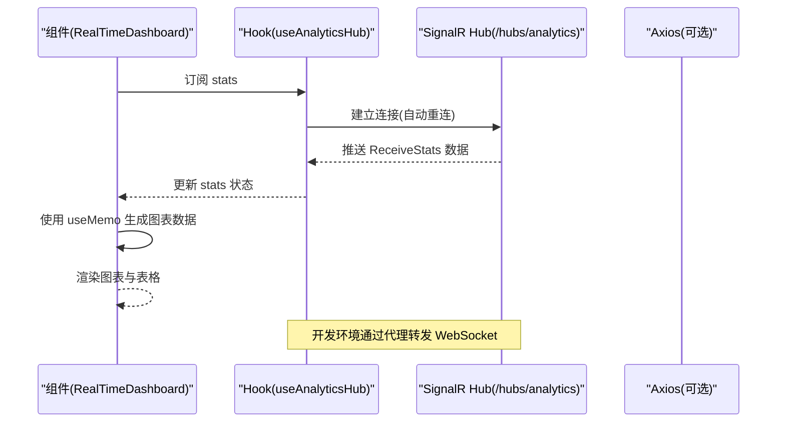
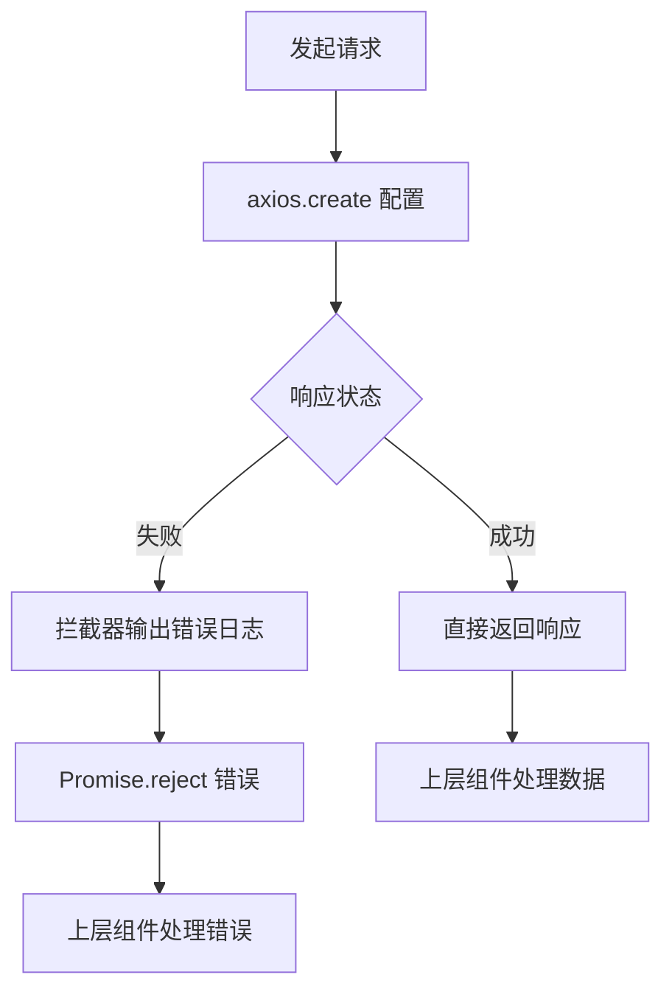
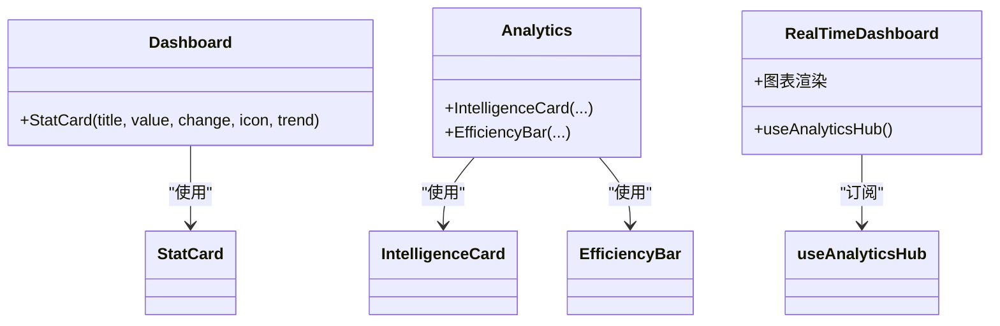
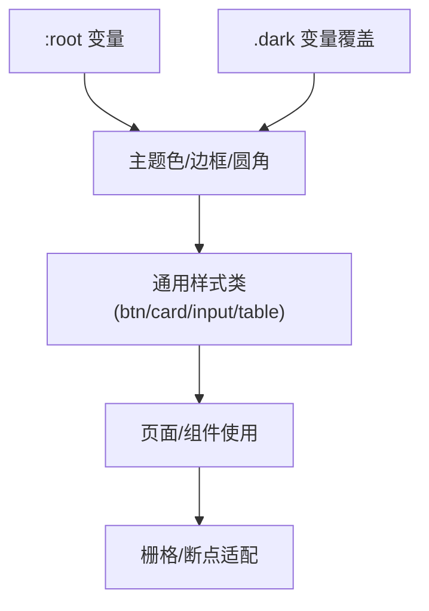
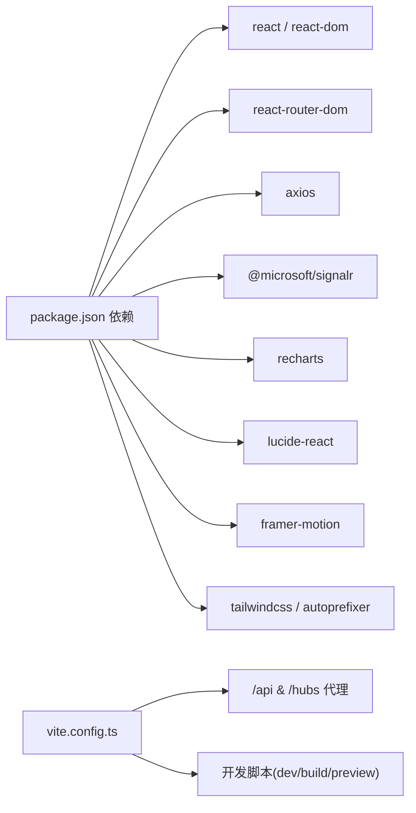

# 前端应用

<cite>
**本文引用的文件**
- [package.json](file://src/Web/ErpSystem.Web/package.json)
- [vite.config.ts](file://src/Web/ErpSystem.Web/vite.config.ts)
- [main.tsx](file://src/Web/ErpSystem.Web/src/main.tsx)
- [App.tsx](file://src/Web/ErpSystem.Web/src/App.tsx)
- [MainLayout.tsx](file://src/Web/ErpSystem.Web/src/layout/MainLayout.tsx)
- [api.ts](file://src/Web/ErpSystem.Web/src/services/api.ts)
- [useAnalyticsHub.ts](file://src/Web/ErpSystem.Web/src/hooks/useAnalyticsHub.ts)
- [RealTimeDashboard.tsx](file://src/Web/ErpSystem.Web/src/components/RealTimeDashboard.tsx)
- [Dashboard.tsx](file://src/Web/ErpSystem.Web/src/pages/Dashboard.tsx)
- [Analytics.tsx](file://src/Web/ErpSystem.Web/src/pages/Analytics.tsx)
- [index.css](file://src/Web/ErpSystem.Web/src/index.css)
- [tailwind.config.js](file://src/Web/ErpSystem.Web/tailwind.config.js)
- [tsconfig.json](file://src/Web/ErpSystem.Web/tsconfig.json)
- [postcss.config.cjs](file://src/Web/ErpSystem.Web/postcss.config.cjs)
</cite>

## 目录
1. [简介](#简介)
2. [项目结构](#项目结构)
3. [核心组件](#核心组件)
4. [架构总览](#架构总览)
5. [详细组件分析](#详细组件分析)
6. [依赖关系分析](#依赖关系分析)
7. [性能考虑](#性能考虑)
8. [故障排查指南](#故障排查指南)
9. [结论](#结论)
10. [附录](#附录)

## 简介
本文件面向前端开发者与UI/UX设计师，系统化梳理该React前端应用的组件架构、状态管理与API集成模式；阐明页面布局、导航结构与设计原则；解释实时通信（SignalR）集成与WebSocket处理；总结组件复用、样式定制与响应式实现；给出API调用模式、错误处理与加载状态管理建议；并记录构建配置、开发环境与部署要点。

## 项目结构
前端位于 src/Web/ErpSystem.Web，采用Vite + React + TypeScript + TailwindCSS 技术栈，路由基于 react-router-dom，实时数据通过 @microsoft/signalr 连接后端 AnalyticsHub，API请求统一由 axios 封装。

图表来源
- [App.tsx](file://src/Web/ErpSystem.Web/src/App.tsx#L21-L47)
- [MainLayout.tsx](file://src/Web/ErpSystem.Web/src/layout/MainLayout.tsx#L24-L82)
- [vite.config.ts](file://src/Web/ErpSystem.Web/vite.config.ts#L7-L21)
- [api.ts](file://src/Web/ErpSystem.Web/src/services/api.ts#L6-L11)
- [useAnalyticsHub.ts](file://src/Web/ErpSystem.Web/src/hooks/useAnalyticsHub.ts#L12-L25)

章节来源
- [package.json](file://src/Web/ErpSystem.Web/package.json#L1-L35)
- [vite.config.ts](file://src/Web/ErpSystem.Web/vite.config.ts#L1-L23)
- [tsconfig.json](file://src/Web/ErpSystem.Web/tsconfig.json#L1-L35)
- [postcss.config.cjs](file://src/Web/ErpSystem.Web/postcss.config.cjs#L1-L7)

## 核心组件
- 应用入口与路由：应用根组件负责注册路由与主布局，所有页面在主布局内渲染。
- 主布局：固定侧边栏导航、顶部标题栏与内容区容器，支持移动端菜单按钮与活动态高亮。
- 实时仪表盘：订阅 SignalR 实时统计，使用 recharts 展示库存动量与波动性指标。
- API 客户端：axios 实例封装，统一设置基础URL与响应拦截器，提供分页结果类型定义。
- 设计系统：TailwindCSS 变量主题，深色模式变量覆盖，通用工具类与卡片、输入框等样式。

章节来源
- [App.tsx](file://src/Web/ErpSystem.Web/src/App.tsx#L21-L47)
- [MainLayout.tsx](file://src/Web/ErpSystem.Web/src/layout/MainLayout.tsx#L24-L82)
- [RealTimeDashboard.tsx](file://src/Web/ErpSystem.Web/src/components/RealTimeDashboard.tsx#L6-L21)
- [api.ts](file://src/Web/ErpSystem.Web/src/services/api.ts#L6-L20)
- [index.css](file://src/Web/ErpSystem.Web/src/index.css#L7-L40)

## 架构总览
前端采用“路由驱动 + 组件组合 + Hook 状态 + Axios 服务 + SignalR 实时”的分层架构。路由层负责页面切换，布局层负责全局导航与头部，业务层由页面与可复用组件构成，服务层封装API与实时连接，样式层以TailwindCSS与CSS变量实现主题化与响应式。

图表来源
- [App.tsx](file://src/Web/ErpSystem.Web/src/App.tsx#L21-L47)
- [MainLayout.tsx](file://src/Web/ErpSystem.Web/src/layout/MainLayout.tsx#L24-L82)
- [RealTimeDashboard.tsx](file://src/Web/ErpSystem.Web/src/components/RealTimeDashboard.tsx#L6-L21)
- [useAnalyticsHub.ts](file://src/Web/ErpSystem.Web/src/hooks/useAnalyticsHub.ts#L12-L25)
- [api.ts](file://src/Web/ErpSystem.Web/src/services/api.ts#L6-L20)

## 详细组件分析

### 路由与页面组织
- 路由注册集中在根组件，包含仪表盘、库存、财务、主数据、采购、销售、生产、MRP、质量、自动化、分析、设置、CRM、项目、薪资、资产等路径。
- 主布局包裹所有页面，提供统一侧边栏导航与头部区域。
- 页面组件按功能模块拆分，便于独立开发与测试。

图表来源
- [App.tsx](file://src/Web/ErpSystem.Web/src/App.tsx#L21-L47)
- [MainLayout.tsx](file://src/Web/ErpSystem.Web/src/layout/MainLayout.tsx#L24-L82)

章节来源
- [App.tsx](file://src/Web/ErpSystem.Web/src/App.tsx#L21-L47)
- [MainLayout.tsx](file://src/Web/ErpSystem.Web/src/layout/MainLayout.tsx#L24-L82)

### 导航与布局设计
- 侧边栏导航项根据当前路径高亮，图标与标签一致，移动端显示菜单按钮。
- 头部区域展示欢迎语与用户头像占位，整体采用卡片与阴影风格，保持内容区留白与最大宽度约束。

图表来源
- [MainLayout.tsx](file://src/Web/ErpSystem.Web/src/layout/MainLayout.tsx#L5-L22)

章节来源
- [MainLayout.tsx](file://src/Web/ErpSystem.Web/src/layout/MainLayout.tsx#L24-L82)

### 实时通信与SignalR集成
- Hook负责建立与维护SignalR连接，自动重连，接收实时统计数据并更新本地状态。
- 仪表盘组件订阅Hook返回的统计数据，转换为图表数据并渲染。
- 开发代理将/hubs前缀转发至后端，确保本地联调时WebSocket升级成功。

图表来源
- [useAnalyticsHub.ts](file://src/Web/ErpSystem.Web/src/hooks/useAnalyticsHub.ts#L12-L49)
- [RealTimeDashboard.tsx](file://src/Web/ErpSystem.Web/src/components/RealTimeDashboard.tsx#L6-L21)
- [vite.config.ts](file://src/Web/ErpSystem.Web/vite.config.ts#L14-L19)

章节来源
- [useAnalyticsHub.ts](file://src/Web/ErpSystem.Web/src/hooks/useAnalyticsHub.ts#L12-L49)
- [RealTimeDashboard.tsx](file://src/Web/ErpSystem.Web/src/components/RealTimeDashboard.tsx#L6-L21)
- [vite.config.ts](file://src/Web/ErpSystem.Web/vite.config.ts#L14-L19)

### API调用模式与错误处理
- axios实例默认基础URL来自环境变量或本地代理，统一JSON头。
- 响应拦截器集中打印错误信息并透传错误，便于上层统一处理。
- 提供分页结果泛型接口，便于列表/表格组件消费。

图表来源
- [api.ts](file://src/Web/ErpSystem.Web/src/services/api.ts#L6-L20)

章节来源
- [api.ts](file://src/Web/ErpSystem.Web/src/services/api.ts#L6-L20)

### 页面与组件复用
- Dashboard页面采用可复用的统计卡片组件，统一图标、趋势与数值展示。
- Analytics页面包含Tab切换与多个智能卡片/效率条组件，体现组件复用与组合。
- RealTimeDashboard作为独立业务组件，复用图表库与Hook，便于在不同页面引入。

图表来源
- [Dashboard.tsx](file://src/Web/ErpSystem.Web/src/pages/Dashboard.tsx#L5-L24)
- [Analytics.tsx](file://src/Web/ErpSystem.Web/src/pages/Analytics.tsx#L170-L197)
- [RealTimeDashboard.tsx](file://src/Web/ErpSystem.Web/src/components/RealTimeDashboard.tsx#L6-L21)

章节来源
- [Dashboard.tsx](file://src/Web/ErpSystem.Web/src/pages/Dashboard.tsx#L26-L112)
- [Analytics.tsx](file://src/Web/ErpSystem.Web/src/pages/Analytics.tsx#L5-L168)
- [RealTimeDashboard.tsx](file://src/Web/ErpSystem.Web/src/components/RealTimeDashboard.tsx#L6-L117)

### 样式体系与响应式设计
- TailwindCSS通过CSS变量定义主题色板与圆角半径，支持深色模式切换。
- 通用工具类如按钮、卡片、输入框、表格容器等，提升组件一致性。
- 响应式断点结合栅格系统，保证在小屏设备上的可用性。

图表来源
- [index.css](file://src/Web/ErpSystem.Web/src/index.css#L7-L40)
- [tailwind.config.js](file://src/Web/ErpSystem.Web/tailwind.config.js#L7-L49)

章节来源
- [index.css](file://src/Web/ErpSystem.Web/src/index.css#L7-L145)
- [tailwind.config.js](file://src/Web/ErpSystem.Web/tailwind.config.js#L1-L53)

## 依赖关系分析
- 依赖管理：React、react-router-dom、axios、@microsoft/signalr、recharts、lucide-react、framer-motion、tailwind 系列。
- 构建与开发：Vite、TypeScript、TailwindCSS、PostCSS、autoprefixer。
- 代理与实时：Vite server.proxy 将 /api 与 /hubs 转发至后端，保障本地开发时HTTP与WebSocket共存。

图表来源
- [package.json](file://src/Web/ErpSystem.Web/package.json#L11-L32)
- [vite.config.ts](file://src/Web/ErpSystem.Web/vite.config.ts#L7-L21)

章节来源
- [package.json](file://src/Web/ErpSystem.Web/package.json#L1-L35)
- [vite.config.ts](file://src/Web/ErpSystem.Web/vite.config.ts#L1-L23)

## 性能考虑
- 图表渲染：对实时数据进行切片与memo化，避免不必要的重绘。
- 连接管理：使用自动重连与清理副作用，防止内存泄漏与重复连接。
- 资源体积：按需引入图标与动画库，减少打包体积。
- 构建优化：Vite原生ESM与快速冷启动，TypeScript严格模式提升开发体验与稳定性。

## 故障排查指南
- 无法连接SignalR
  - 检查代理配置是否正确转发/hubs到后端地址。
  - 查看浏览器网络面板中WebSocket握手状态。
  - 确认Hook中连接URL与后端Hub路径一致。
- API请求失败
  - 检查环境变量或本地代理是否指向正确的后端服务。
  - 查看响应拦截器输出的错误信息，定位具体问题。
- 样式异常
  - 确认TailwindCSS已正确编译，CSS变量未被覆盖冲突。
  - 检查深色模式切换逻辑与主题变量。

章节来源
- [vite.config.ts](file://src/Web/ErpSystem.Web/vite.config.ts#L7-L21)
- [useAnalyticsHub.ts](file://src/Web/ErpSystem.Web/src/hooks/useAnalyticsHub.ts#L18-L46)
- [api.ts](file://src/Web/ErpSystem.Web/src/services/api.ts#L14-L20)
- [index.css](file://src/Web/ErpSystem.Web/src/index.css#L7-L40)

## 结论
该前端应用以清晰的路由与布局为核心，围绕业务页面与可复用组件展开；通过axios与SignalR分别满足常规HTTP与实时数据需求；TailwindCSS与CSS变量提供一致且可扩展的样式体系。建议在后续迭代中进一步完善错误边界、加载骨架与国际化支持，并持续优化图表渲染性能与连接健壮性。

## 附录

### 开发环境设置
- 启动命令：开发、构建、预览脚本由Vite提供。
- 代理规则：/api转发至后端HTTP，/hubs转发至SignalR WebSocket。
- 类型检查：TypeScript严格模式，Bundler解析策略，JSX使用react-jsx。

章节来源
- [package.json](file://src/Web/ErpSystem.Web/package.json#L6-L10)
- [vite.config.ts](file://src/Web/ErpSystem.Web/vite.config.ts#L7-L21)
- [tsconfig.json](file://src/Web/ErpSystem.Web/tsconfig.json#L22-L25)

### 构建与部署
- 构建产物：Vite输出静态资源，dist目录包含入口HTML与打包后的资源。
- 样式构建：PostCSS与TailwindCSS链路确保样式按需生成。
- 部署建议：将dist目录部署至Nginx或CDN；若后端为容器化，可将前端静态资源与后端服务统一暴露。

章节来源
- [main.tsx](file://src/Web/ErpSystem.Web/src/main.tsx#L1-L11)
- [postcss.config.cjs](file://src/Web/ErpSystem.Web/postcss.config.cjs#L1-L7)