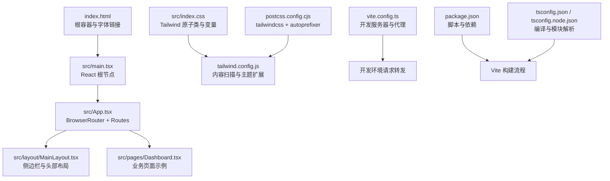
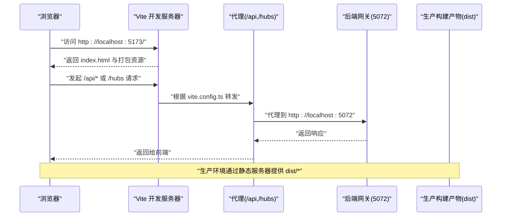
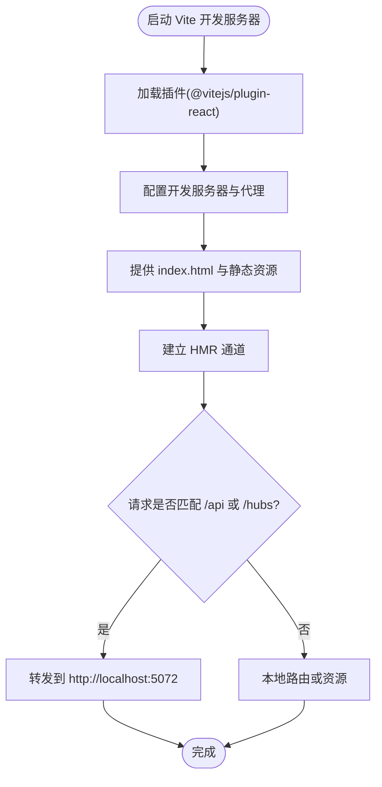
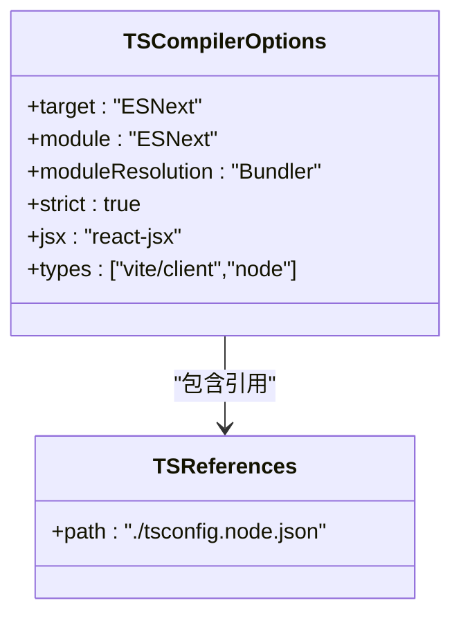
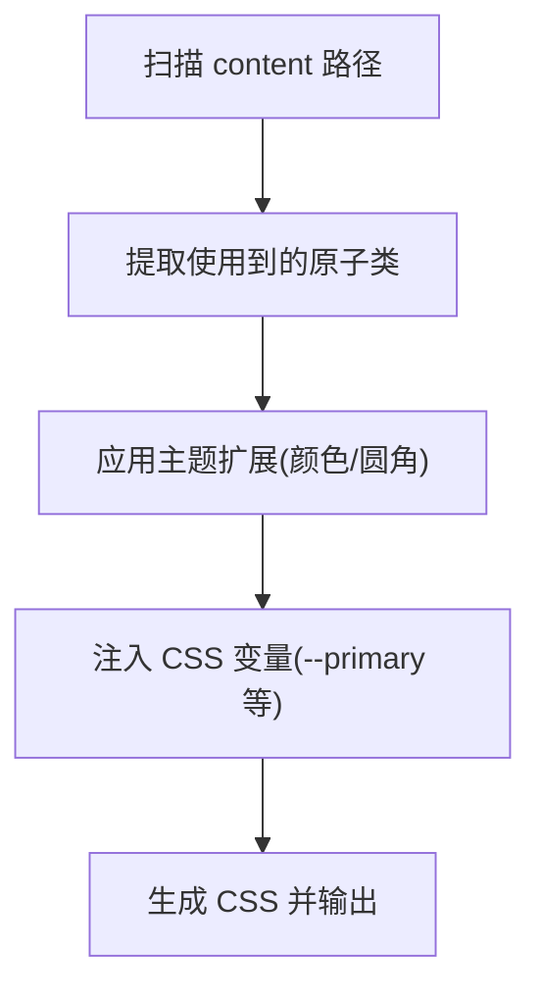
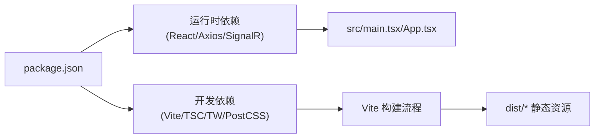

# 构建配置

<cite>
**本文引用的文件**
- [package.json](file://src/Web/ErpSystem.Web/package.json)
- [vite.config.ts](file://src/Web/ErpSystem.Web/vite.config.ts)
- [tsconfig.json](file://src/Web/ErpSystem.Web/tsconfig.json)
- [tsconfig.node.json](file://src/Web/ErpSystem.Web/tsconfig.node.json)
- [tailwind.config.js](file://src/Web/ErpSystem.Web/tailwind.config.js)
- [postcss.config.cjs](file://src/Web/ErpSystem.Web/postcss.config.cjs)
- [index.html](file://src/Web/ErpSystem.Web/index.html)
- [src/main.tsx](file://src/Web/ErpSystem.Web/src/main.tsx)
- [src/App.tsx](file://src/Web/ErpSystem.Web/src/App.tsx)
- [src/layout/MainLayout.tsx](file://src/Web/ErpSystem.Web/src/layout/MainLayout.tsx)
- [src/pages/Dashboard.tsx](file://src/Web/ErpSystem.Web/src/pages/Dashboard.tsx)
- [src/services/api.ts](file://src/Web/ErpSystem.Web/src/services/api.ts)
- [src/index.css](file://src/Web/ErpSystem.Web/src/index.css)
- [dist/index.html](file://src/Web/ErpSystem.Web/dist/index.html)
</cite>

## 目录
1. [简介](#简介)
2. [项目结构](#项目结构)
3. [核心组件](#核心组件)
4. [架构总览](#架构总览)
5. [详细组件分析](#详细组件分析)
6. [依赖关系分析](#依赖关系分析)
7. [性能考量](#性能考量)
8. [故障排查指南](#故障排查指南)
9. [结论](#结论)
10. [附录](#附录)

## 简介
本文件面向前端构建配置，系统性梳理 Vite 构建工具的配置选项、插件体系与优化策略；详解 package.json 的依赖管理、脚本命令与版本控制；记录 tsconfig.json 的 TypeScript 编译配置、路径映射与模块解析；说明 tailwind.config.js 的样式配置、主题定制与响应式断点；给出 postcss.config.cjs 的 CSS 预处理、自动前缀与优化配置；解释开发服务器配置、热重载机制与代理设置；并总结生产构建优化、代码分割与资源压缩策略。

## 项目结构
前端工程位于 src/Web/ErpSystem.Web，采用 React + TypeScript + TailwindCSS + Vite 技术栈。入口 HTML 指向 src/main.tsx，应用通过 React Router 进行页面路由，样式由 TailwindCSS 提供原子类与自定义 CSS 变量支撑。

图表来源
- [index.html](file://src/Web/ErpSystem.Web/index.html#L1-L17)
- [src/main.tsx](file://src/Web/ErpSystem.Web/src/main.tsx#L1-L11)
- [src/App.tsx](file://src/Web/ErpSystem.Web/src/App.tsx#L1-L50)
- [src/layout/MainLayout.tsx](file://src/Web/ErpSystem.Web/src/layout/MainLayout.tsx#L1-L83)
- [src/pages/Dashboard.tsx](file://src/Web/ErpSystem.Web/src/pages/Dashboard.tsx#L1-L113)
- [src/index.css](file://src/Web/ErpSystem.Web/src/index.css#L1-L145)
- [tailwind.config.js](file://src/Web/ErpSystem.Web/tailwind.config.js#L1-L53)
- [postcss.config.cjs](file://src/Web/ErpSystem.Web/postcss.config.cjs#L1-L7)
- [vite.config.ts](file://src/Web/ErpSystem.Web/vite.config.ts#L1-L23)
- [package.json](file://src/Web/ErpSystem.Web/package.json#L1-L35)
- [tsconfig.json](file://src/Web/ErpSystem.Web/tsconfig.json#L1-L35)
- [tsconfig.node.json](file://src/Web/ErpSystem.Web/tsconfig.node.json#L1-L12)

章节来源
- [index.html](file://src/Web/ErpSystem.Web/index.html#L1-L17)
- [src/main.tsx](file://src/Web/ErpSystem.Web/src/main.tsx#L1-L11)
- [src/App.tsx](file://src/Web/ErpSystem.Web/src/App.tsx#L1-L50)
- [src/layout/MainLayout.tsx](file://src/Web/ErpSystem.Web/src/layout/MainLayout.tsx#L1-L83)
- [src/pages/Dashboard.tsx](file://src/Web/ErpSystem.Web/src/pages/Dashboard.tsx#L1-L113)
- [src/index.css](file://src/Web/ErpSystem.Web/src/index.css#L1-L145)
- [tailwind.config.js](file://src/Web/ErpSystem.Web/tailwind.config.js#L1-L53)
- [postcss.config.cjs](file://src/Web/ErpSystem.Web/postcss.config.cjs#L1-L7)
- [vite.config.ts](file://src/Web/ErpSystem.Web/vite.config.ts#L1-L23)
- [package.json](file://src/Web/ErpSystem.Web/package.json#L1-L35)
- [tsconfig.json](file://src/Web/ErpSystem.Web/tsconfig.json#L1-L35)
- [tsconfig.node.json](file://src/Web/ErpSystem.Web/tsconfig.node.json#L1-L12)

## 核心组件
- Vite 开发服务器与构建器：提供快速冷启动、按需编译与热重载能力，并通过代理将 /api 与 /hubs 请求转发至后端网关。
- React + TypeScript：严格类型检查与现代模块解析，结合 tsconfig.json 的 Bundler 解析策略提升开发体验。
- TailwindCSS：以原子类为主、CSS 变量为辅的主题系统，支持明暗模式切换与组件化样式组织。
- PostCSS：集成 tailwindcss 与 autoprefixer，实现样式生成与浏览器兼容性处理。
- Axios 客户端：统一的 API 访问层，支持环境变量控制基础地址与全局错误拦截。

章节来源
- [vite.config.ts](file://src/Web/ErpSystem.Web/vite.config.ts#L1-L23)
- [tsconfig.json](file://src/Web/ErpSystem.Web/tsconfig.json#L1-L35)
- [tsconfig.node.json](file://src/Web/ErpSystem.Web/tsconfig.node.json#L1-L12)
- [tailwind.config.js](file://src/Web/ErpSystem.Web/tailwind.config.js#L1-L53)
- [postcss.config.cjs](file://src/Web/ErpSystem.Web/postcss.config.cjs#L1-L7)
- [src/services/api.ts](file://src/Web/ErpSystem.Web/src/services/api.ts#L1-L29)
- [package.json](file://src/Web/ErpSystem.Web/package.json#L1-L35)

## 架构总览
下图展示从浏览器到后端服务的请求链路，以及构建产物在生产环境的加载方式。

图表来源
- [vite.config.ts](file://src/Web/ErpSystem.Web/vite.config.ts#L7-L21)
- [dist/index.html](file://src/Web/ErpSystem.Web/dist/index.html#L11-L12)

章节来源
- [vite.config.ts](file://src/Web/ErpSystem.Web/vite.config.ts#L1-L23)
- [dist/index.html](file://src/Web/ErpSystem.Web/dist/index.html#L1-L18)

## 详细组件分析

### Vite 配置与插件系统
- 插件：已启用 @vitejs/plugin-react，用于对 React JSX/TSX 进行快速转换与 HMR 支持。
- 服务器：配置了 /api 与 /hubs 两条代理规则，目标均为本地网关地址，支持 WebSocket（/hubs）。
- 热重载：基于 Vite 的原生 HMR，无需刷新即可更新组件与样式。

图表来源
- [vite.config.ts](file://src/Web/ErpSystem.Web/vite.config.ts#L5-L22)

章节来源
- [vite.config.ts](file://src/Web/ErpSystem.Web/vite.config.ts#L1-L23)

### TypeScript 编译配置
- 编译目标与模块：ESNext 目标、ESNext 模块与 Bundler 解析策略，适配 Vite 的原生 ESM。
- 严格性与类型：启用严格模式、跳过库检查、禁用合成默认导入互操作，确保类型安全与更快的增量编译。
- JSX 与类型声明：使用 react-jsx，包含 vite/client 与 node 类型。
- 多项目引用：通过 references 引入 tsconfig.node.json，隔离 Vite 配置文件的编译上下文。

图表来源
- [tsconfig.json](file://src/Web/ErpSystem.Web/tsconfig.json#L2-L26)
- [tsconfig.node.json](file://src/Web/ErpSystem.Web/tsconfig.node.json#L2-L11)

章节来源
- [tsconfig.json](file://src/Web/ErpSystem.Web/tsconfig.json#L1-L35)
- [tsconfig.node.json](file://src/Web/ErpSystem.Web/tsconfig.node.json#L1-L12)

### TailwindCSS 主题与样式
- 内容扫描：扫描根 HTML 与 src 下所有 TS/JS/TSX/JS 文件，确保仅产出使用到的样式。
- 主题扩展：通过 CSS 变量映射颜色、圆角半径等，支持明暗模式切换。
- 插件：当前未启用额外插件，保持最小化依赖。

图表来源
- [tailwind.config.js](file://src/Web/ErpSystem.Web/tailwind.config.js#L3-L49)
- [src/index.css](file://src/Web/ErpSystem.Web/src/index.css#L3-L5)

章节来源
- [tailwind.config.js](file://src/Web/ErpSystem.Web/tailwind.config.js#L1-L53)
- [src/index.css](file://src/Web/ErpSystem.Web/src/index.css#L1-L145)

### PostCSS 预处理与自动前缀
- 插件链：tailwindcss → autoprefixer，先生成符合设计规范的 CSS，再补全浏览器前缀。
- 作用范围：对构建后的样式进行二次处理，保证跨浏览器一致性。

章节来源
- [postcss.config.cjs](file://src/Web/ErpSystem.Web/postcss.config.cjs#L1-L7)

### 依赖管理与脚本命令
- 依赖：React 生态、SignalR、Axios、Recharts、Framer Motion、Lucide React 等。
- 开发依赖：Vite、React 插件、TypeScript、TailwindCSS、PostCSS、Autoprefixer。
- 脚本：
  - dev：启动 Vite 开发服务器
  - build：先执行 tsc，再执行 vite build
  - preview：预览生产构建结果

章节来源
- [package.json](file://src/Web/ErpSystem.Web/package.json#L1-L35)

### 开发服务器、热重载与代理
- 端口与 HMR：默认开发端口由 Vite 分配，HMR 自动生效。
- 代理规则：
  - /api → http://localhost:5072
  - /hubs → http://localhost:5072 (支持 WebSocket)
- 环境变量：可通过 VITE_API_URL 控制 API 基础地址，便于多环境切换。

章节来源
- [vite.config.ts](file://src/Web/ErpSystem.Web/vite.config.ts#L7-L21)
- [src/services/api.ts](file://src/Web/ErpSystem.Web/src/services/api.ts#L4-L4)

### 生产构建优化、代码分割与资源压缩
- 构建产物：生产环境由 Vite 生成带哈希的静态资源与入口 HTML，HTML 中自动注入资源链接。
- 代码分割：基于动态 import 的路由懒加载与按需加载第三方库，减少首屏体积。
- 资源压缩：Vite 在生产模式下自动压缩 JS/CSS/HTML，并生成 sourcemap（可按需开启）。
- 静态资源：图片、字体等资源被复制到 dist/assets 目录并带内容哈希。

章节来源
- [dist/index.html](file://src/Web/ErpSystem.Web/dist/index.html#L11-L12)
- [package.json](file://src/Web/ErpSystem.Web/package.json#L8-L8)

## 依赖关系分析
- 应用层依赖：React、React Router DOM、Axios、SignalR、Recharts、Framer Motion、Lucide React、clsx、tailwind-merge。
- 构建与工具：Vite、@vitejs/plugin-react、TypeScript、TailwindCSS、PostCSS、Autoprefixer。
- 运行时与开发时分离：运行时依赖与构建工具分列 dependencies 与 devDependencies。

图表来源
- [package.json](file://src/Web/ErpSystem.Web/package.json#L11-L33)
- [src/main.tsx](file://src/Web/ErpSystem.Web/src/main.tsx#L1-L11)
- [src/App.tsx](file://src/Web/ErpSystem.Web/src/App.tsx#L1-L50)
- [dist/index.html](file://src/Web/ErpSystem.Web/dist/index.html#L11-L12)

章节来源
- [package.json](file://src/Web/ErpSystem.Web/package.json#L1-L35)

## 性能考量
- 启用 React 插件：提升 JSX/TSX 转换效率与 HMR 精度。
- 使用 Bundler 模块解析：与 Vite 原生 ESM 协同，避免不必要的包封装成本。
- Tailwind 原子类：按需产出样式，避免全局样式臃肿。
- 动态导入：对非首屏路由与重型图表库采用异步加载，缩短首屏时间。
- 生产压缩：启用 Vite 默认压缩策略，必要时可引入插件进一步优化。

## 故障排查指南
- 代理不生效
  - 检查 vite.config.ts 的代理规则与目标地址是否正确。
  - 确认请求路径是否以 /api 或 /hubs 开头。
- 环境变量未生效
  - 确保 VITE_API_URL 设置在正确的 .env 文件中，或在启动命令中传入。
  - 注意 Vite 仅识别以 VITE_ 开头的环境变量。
- 样式未更新
  - 清理浏览器缓存或强制刷新，确认 TailwindCSS 已重新生成。
  - 检查 tailwind.config.js 的 content 路径是否覆盖到新增文件。
- 构建失败
  - 先执行 tsc 校验类型错误，再执行 vite build。
  - 检查 tsconfig.json 的 moduleResolution 与 target 是否与插件兼容。

章节来源
- [vite.config.ts](file://src/Web/ErpSystem.Web/vite.config.ts#L7-L21)
- [src/services/api.ts](file://src/Web/ErpSystem.Web/src/services/api.ts#L4-L4)
- [tailwind.config.js](file://src/Web/ErpSystem.Web/tailwind.config.js#L3-L6)
- [tsconfig.json](file://src/Web/ErpSystem.Web/tsconfig.json#L17-L17)
- [package.json](file://src/Web/ErpSystem.Web/package.json#L8-L8)

## 结论
该前端构建配置以 Vite 为核心，结合 React + TypeScript + TailwindCSS + PostCSS，形成高效、可维护且具备良好扩展性的开发与生产流水线。通过合理的代理与环境变量配置，能够无缝对接后端网关；借助按需样式与动态导入，兼顾首屏性能与功能完整性。建议后续在生产环境引入更细粒度的代码分割与缓存策略，并持续评估第三方依赖的体积与更新频率。

## 附录
- 关键文件路径索引
  - 构建与脚本：package.json
  - 开发服务器与代理：vite.config.ts
  - TypeScript 编译：tsconfig.json、tsconfig.node.json
  - 样式与主题：tailwind.config.js、src/index.css、postcss.config.cjs
  - 应用入口与路由：index.html、src/main.tsx、src/App.tsx
  - 页面与布局：src/layout/MainLayout.tsx、src/pages/Dashboard.tsx
  - API 客户端：src/services/api.ts
  - 生产产物：dist/index.html