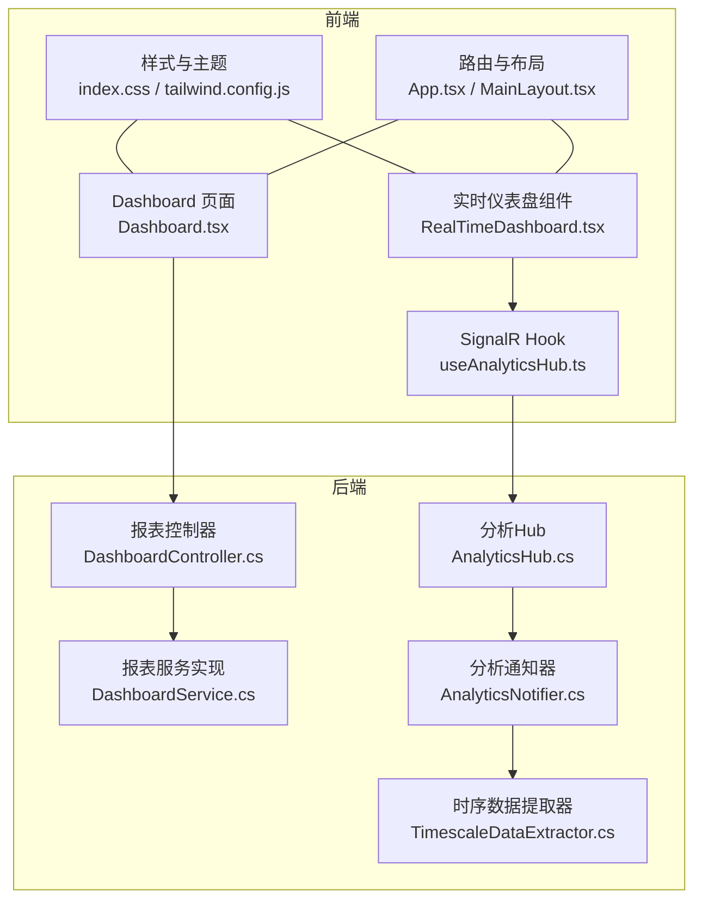
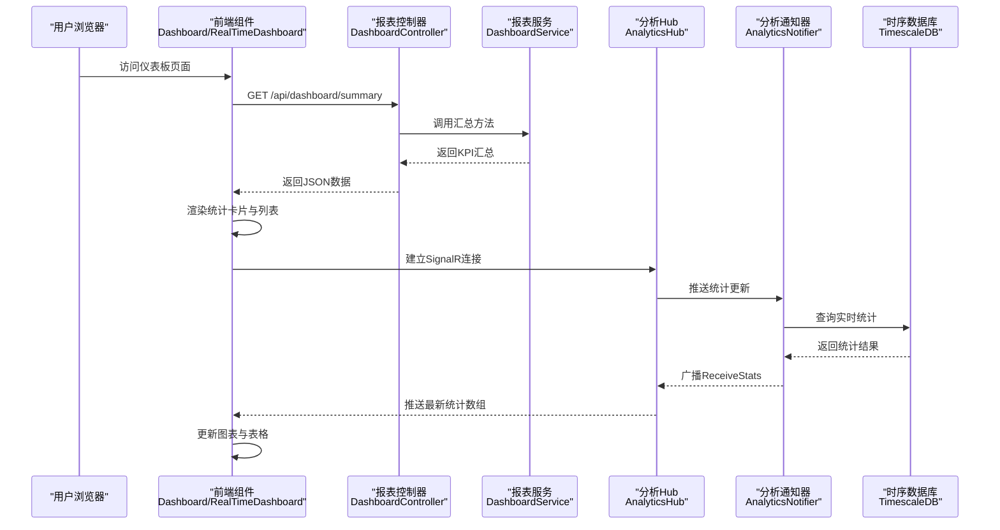
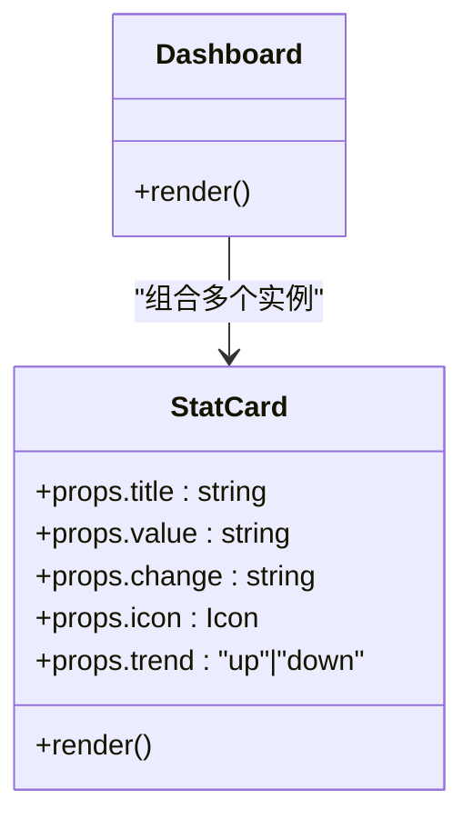
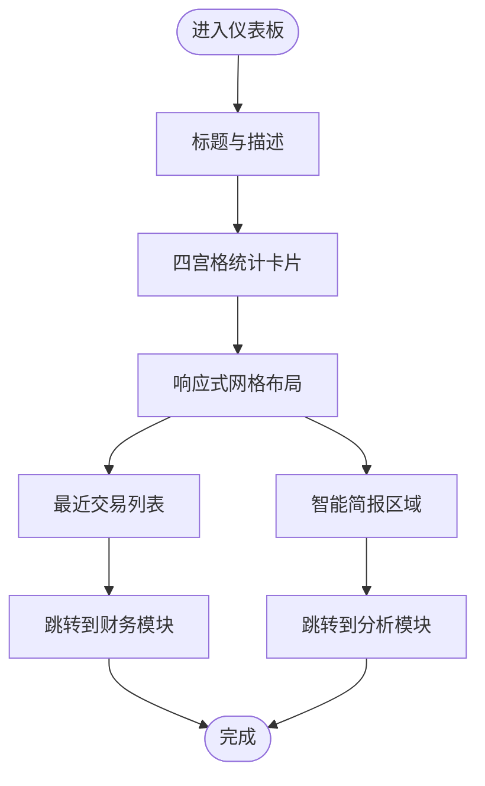
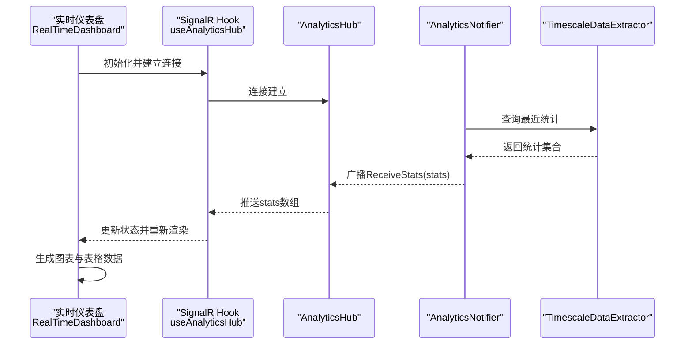
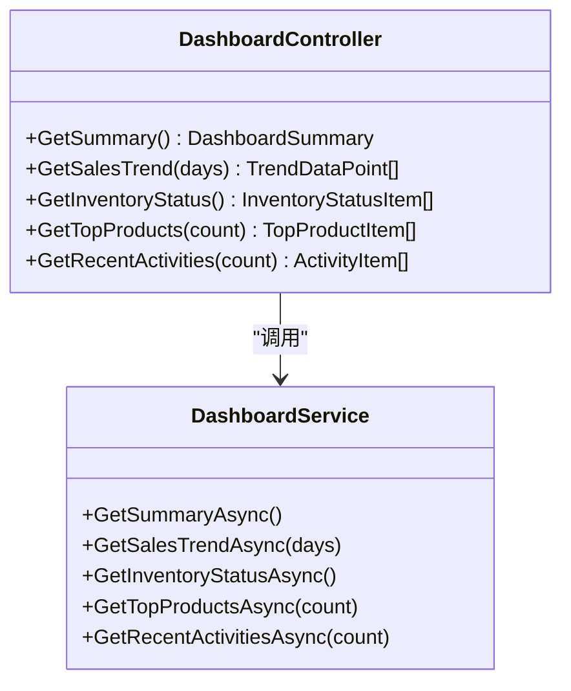
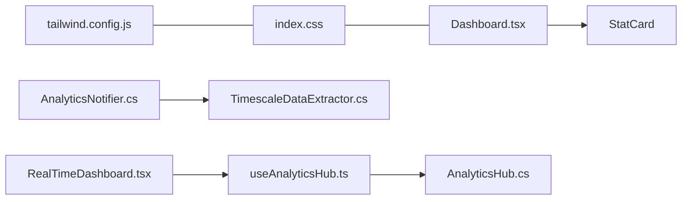

# 仪表板页面

<cite>
**本文引用的文件**
- [Dashboard.tsx](file://src/Web/ErpSystem.Web/src/pages/Dashboard.tsx)
- [RealTimeDashboard.tsx](file://src/Web/ErpSystem.Web/src/components/RealTimeDashboard.tsx)
- [useAnalyticsHub.ts](file://src/Web/ErpSystem.Web/src/hooks/useAnalyticsHub.ts)
- [DashboardController.cs](file://src/Services/Reporting/ErpSystem.Reporting/Controllers/DashboardController.cs)
- [DashboardService.cs](file://src/Services/Reporting/ErpSystem.Reporting/Application/DashboardService.cs)
- [AnalyticsHub.cs](file://src/Services/Analytics/ErpSystem.Analytics/API/Hubs/AnalyticsHub.cs)
- [AnalyticsNotifier.cs](file://src/Services/Analytics/ErpSystem.Analytics/Infrastructure/BackgroundJobs/AnalyticsNotifier.cs)
- [TimescaleDataExtractor.cs](file://src/Services/Analytics/ErpSystem.Analytics/Infrastructure/TimescaleDataExtractor.cs)
- [index.css](file://src/Web/ErpSystem.Web/src/index.css)
- [tailwind.config.js](file://src/Web/ErpSystem.Web/tailwind.config.js)
- [App.tsx](file://src/Web/ErpSystem.Web/src/App.tsx)
- [main.tsx](file://src/Web/ErpSystem.Web/src/main.tsx)
- [MainLayout.tsx](file://src/Web/ErpSystem.Web/src/layout/MainLayout.tsx)
</cite>

## 目录
1. [简介](#简介)
2. [项目结构](#项目结构)
3. [核心组件](#核心组件)
4. [架构总览](#架构总览)
5. [组件详细分析](#组件详细分析)
6. [依赖关系分析](#依赖关系分析)
7. [性能考虑](#性能考虑)
8. [故障排查指南](#故障排查指南)
9. [结论](#结论)
10. [附录](#附录)

## 简介
本文件面向仪表板页面的实现与使用，重点解析前端Dashboard组件与实时分析组件的实现细节，涵盖统计卡片组件StatCard的设计模式、数据展示布局与趋势显示逻辑；同时记录仪表板的整体架构，包括KPI指标展示、最近交易列表与智能简报区域的实现方式。文档还说明了组件间通信机制、数据获取模式与状态管理策略，并提供响应式设计实现、图标使用与样式定制说明，以及性能优化建议、数据刷新机制与用户体验改进建议。

## 项目结构
仪表板页面由前端React应用与后端微服务共同组成：
- 前端层：Dashboard页面组件、实时分析组件、SignalR Hook、样式与主题配置、路由与布局。
- 后端层：报表服务提供KPI与趋势数据；分析服务通过SignalR推送实时统计；TimescaleDB作为时序数据库支撑分析引擎。

图表来源
- [Dashboard.tsx](file://src/Web/ErpSystem.Web/src/pages/Dashboard.tsx#L26-L112)
- [RealTimeDashboard.tsx](file://src/Web/ErpSystem.Web/src/components/RealTimeDashboard.tsx#L6-L119)
- [useAnalyticsHub.ts](file://src/Web/ErpSystem.Web/src/hooks/useAnalyticsHub.ts#L12-L49)
- [DashboardController.cs](file://src/Services/Reporting/ErpSystem.Reporting/Controllers/DashboardController.cs#L8-L59)
- [DashboardService.cs](file://src/Services/Reporting/ErpSystem.Reporting/Application/DashboardService.cs#L20-L91)
- [AnalyticsHub.cs](file://src/Services/Analytics/ErpSystem.Analytics/API/Hubs/AnalyticsHub.cs#L5-L12)
- [AnalyticsNotifier.cs](file://src/Services/Analytics/ErpSystem.Analytics/Infrastructure/BackgroundJobs/AnalyticsNotifier.cs#L6-L36)
- [TimescaleDataExtractor.cs](file://src/Services/Analytics/ErpSystem.Analytics/Infrastructure/TimescaleDataExtractor.cs#L8-L131)
- [index.css](file://src/Web/ErpSystem.Web/src/index.css#L1-L145)
- [tailwind.config.js](file://src/Web/ErpSystem.Web/tailwind.config.js#L1-L53)
- [App.tsx](file://src/Web/ErpSystem.Web/src/App.tsx#L21-L47)
- [MainLayout.tsx](file://src/Web/ErpSystem.Web/src/layout/MainLayout.tsx#L24-L29)

章节来源
- [App.tsx](file://src/Web/ErpSystem.Web/src/App.tsx#L21-L47)
- [main.tsx](file://src/Web/ErpSystem.Web/src/main.tsx#L1-L11)
- [index.css](file://src/Web/ErpSystem.Web/src/index.css#L1-L145)
- [tailwind.config.js](file://src/Web/ErpSystem.Web/tailwind.config.js#L1-L53)

## 核心组件
- 统计卡片组件StatCard：用于展示KPI指标，包含标题、数值、变化百分比与趋势箭头，支持上升/下降两种趋势样式。
- 仪表板页面Dashboard：组织统计卡片网格布局、最近交易列表与智能简报区域，提供模块跳转链接。
- 实时仪表盘组件RealTimeDashboard：基于Recharts展示库存流动与波动性指标，表格呈现实时统计数据流。
- SignalR Hook useAnalyticsHub：封装与AnalyticsHub的连接、自动重连与接收数据流的逻辑。
- 报表服务DashboardService：提供KPI汇总、销售趋势、库存状态、热销产品与近期活动等数据接口。

章节来源
- [Dashboard.tsx](file://src/Web/ErpSystem.Web/src/pages/Dashboard.tsx#L5-L24)
- [Dashboard.tsx](file://src/Web/ErpSystem.Web/src/pages/Dashboard.tsx#L26-L112)
- [RealTimeDashboard.tsx](file://src/Web/ErpSystem.Web/src/components/RealTimeDashboard.tsx#L6-L119)
- [useAnalyticsHub.ts](file://src/Web/ErpSystem.Web/src/hooks/useAnalyticsHub.ts#L12-L49)
- [DashboardService.cs](file://src/Services/Reporting/ErpSystem.Reporting/Application/DashboardService.cs#L20-L91)

## 架构总览
仪表板采用前后端分离架构：
- 前端通过HTTP请求从报表服务获取静态KPI与趋势数据；通过SignalR从分析服务获取实时统计流。
- 后端服务通过TimescaleDB进行时序数据分析，定时任务周期性推送最新统计到客户端。

图表来源
- [Dashboard.tsx](file://src/Web/ErpSystem.Web/src/pages/Dashboard.tsx#L26-L112)
- [RealTimeDashboard.tsx](file://src/Web/ErpSystem.Web/src/components/RealTimeDashboard.tsx#L6-L119)
- [useAnalyticsHub.ts](file://src/Web/ErpSystem.Web/src/hooks/useAnalyticsHub.ts#L12-L49)
- [DashboardController.cs](file://src/Services/Reporting/ErpSystem.Reporting/Controllers/DashboardController.cs#L8-L59)
- [DashboardService.cs](file://src/Services/Reporting/ErpSystem.Reporting/Application/DashboardService.cs#L20-L91)
- [AnalyticsHub.cs](file://src/Services/Analytics/ErpSystem.Analytics/API/Hubs/AnalyticsHub.cs#L5-L12)
- [AnalyticsNotifier.cs](file://src/Services/Analytics/ErpSystem.Analytics/Infrastructure/BackgroundJobs/AnalyticsNotifier.cs#L12-L36)
- [TimescaleDataExtractor.cs](file://src/Services/Analytics/ErpSystem.Analytics/Infrastructure/TimescaleDataExtractor.cs#L88-L131)

## 组件详细分析

### 统计卡片组件StatCard设计模式
- 设计要点
  - 展示型组件：接收标题、数值、变化百分比、图标与趋势方向，渲染统一卡片样式。
  - 趋势指示：根据trend参数选择上升/下降样式，配合箭头图标与颜色标识。
  - 可复用性：通过props传入图标组件，便于在不同卡片中复用。
- 数据流
  - Dashboard页面调用StatCard组件，传入硬编码或从后端API获取的数据。
- 复杂度与性能
  - 组件无状态，渲染开销低；适合大量并列展示。

图表来源
- [Dashboard.tsx](file://src/Web/ErpSystem.Web/src/pages/Dashboard.tsx#L5-L24)
- [Dashboard.tsx](file://src/Web/ErpSystem.Web/src/pages/Dashboard.tsx#L26-L112)

章节来源
- [Dashboard.tsx](file://src/Web/ErpSystem.Web/src/pages/Dashboard.tsx#L5-L24)

### 仪表板页面布局与功能
- 布局结构
  - 顶部标题与描述区。
  - 四宫格统计卡片区域，响应式适配不同屏幕尺寸。
  - 左右分栏：左侧最近交易列表，右侧智能简报区域。
- 功能特性
  - 统计卡片：展示收入、库存、效率、质量等关键指标。
  - 最近交易：展示交易摘要与金额，支持跳转至财务模块。
  - 智能简报：展示自动化处理与需求预测等洞察信息。
- 导航与跳转
  - 通过路由链接跳转到财务与分析模块，增强上下文关联。

图表来源
- [Dashboard.tsx](file://src/Web/ErpSystem.Web/src/pages/Dashboard.tsx#L26-L112)

章节来源
- [Dashboard.tsx](file://src/Web/ErpSystem.Web/src/pages/Dashboard.tsx#L26-L112)

### 实时仪表盘组件与数据流
- 组件职责
  - 使用Recharts绘制库存流动与波动性图表。
  - 展示实时统计表格，按时间戳排序，高亮异常波动。
- 数据来源
  - 通过useAnalyticsHub订阅AnalyticsHub推送的统计数组。
  - 后端每5秒从TimescaleDB聚合统计并通过Hub广播。
- 图表与表格
  - 库存流动柱状图：按物料ID展示平均变动。
  - 波动性折线图：按物料ID展示标准差。
  - 表格：展示时间、物料ID、平均变动、中位数、标准差等字段。

图表来源
- [RealTimeDashboard.tsx](file://src/Web/ErpSystem.Web/src/components/RealTimeDashboard.tsx#L6-L119)
- [useAnalyticsHub.ts](file://src/Web/ErpSystem.Web/src/hooks/useAnalyticsHub.ts#L12-L49)
- [AnalyticsHub.cs](file://src/Services/Analytics/ErpSystem.Analytics/API/Hubs/AnalyticsHub.cs#L5-L12)
- [AnalyticsNotifier.cs](file://src/Services/Analytics/ErpSystem.Analytics/Infrastructure/BackgroundJobs/AnalyticsNotifier.cs#L12-L36)
- [TimescaleDataExtractor.cs](file://src/Services/Analytics/ErpSystem.Analytics/Infrastructure/TimescaleDataExtractor.cs#L88-L131)

章节来源
- [RealTimeDashboard.tsx](file://src/Web/ErpSystem.Web/src/components/RealTimeDashboard.tsx#L6-L119)
- [useAnalyticsHub.ts](file://src/Web/ErpSystem.Web/src/hooks/useAnalyticsHub.ts#L12-L49)
- [AnalyticsNotifier.cs](file://src/Services/Analytics/ErpSystem.Analytics/Infrastructure/BackgroundJobs/AnalyticsNotifier.cs#L12-L36)
- [TimescaleDataExtractor.cs](file://src/Services/Analytics/ErpSystem.Analytics/Infrastructure/TimescaleDataExtractor.cs#L88-L131)

### 报表服务与数据获取模式
- 控制器接口
  - 汇总：返回KPI汇总数据。
  - 销售趋势：按天数返回趋势点。
  - 库存状态：按类别返回库存统计。
  - 热销产品：返回销量与收入前N的产品。
  - 近期活动：返回跨模块的近期操作记录。
- 服务实现
  - 汇总与趋势：演示用随机/固定数据，便于前端联调。
  - 库存状态、热销产品、近期活动：返回预置数据集。
- 状态管理策略
  - 前端通过HTTP请求获取静态数据，组件内部维护本地状态。
  - 实时数据通过SignalR订阅，组件内部维护实时状态。

图表来源
- [DashboardController.cs](file://src/Services/Reporting/ErpSystem.Reporting/Controllers/DashboardController.cs#L8-L59)
- [DashboardService.cs](file://src/Services/Reporting/ErpSystem.Reporting/Application/DashboardService.cs#L20-L91)

章节来源
- [DashboardController.cs](file://src/Services/Reporting/ErpSystem.Reporting/Controllers/DashboardController.cs#L8-L59)
- [DashboardService.cs](file://src/Services/Reporting/ErpSystem.Reporting/Application/DashboardService.cs#L20-L91)

### 组件间通信机制
- 前后端通信
  - HTTP REST：仪表板静态数据通过控制器与服务交互。
  - SignalR：实时统计通过Hub推送，前端Hook负责连接与状态更新。
- 前端内部通信
  - Dashboard与StatCard为父子组件，通过props传递数据。
  - RealTimeDashboard与useAnalyticsHub为订阅者与数据源的关系。
- 状态管理
  - React Hooks管理组件状态，useMemo用于图表数据转换的缓存。

章节来源
- [Dashboard.tsx](file://src/Web/ErpSystem.Web/src/pages/Dashboard.tsx#L5-L24)
- [RealTimeDashboard.tsx](file://src/Web/ErpSystem.Web/src/components/RealTimeDashboard.tsx#L6-L119)
- [useAnalyticsHub.ts](file://src/Web/ErpSystem.Web/src/hooks/useAnalyticsHub.ts#L12-L49)

### 响应式设计与样式定制
- 响应式布局
  - 使用Tailwind CSS网格系统，实现1列/2列/4列自适应。
  - 卡片与表格在小屏设备上自动换行与缩放。
- 主题与变量
  - CSS变量定义主色、次色、背景与前景色，支持明暗主题切换。
  - Tailwind配置映射CSS变量，确保组件风格一致。
- 图标与视觉元素
  - 使用Lucide React图标库，统一图标风格与尺寸。
  - 趋势箭头与颜色区分上升/下降，提升可读性。

章节来源
- [Dashboard.tsx](file://src/Web/ErpSystem.Web/src/pages/Dashboard.tsx#L34-L63)
- [RealTimeDashboard.tsx](file://src/Web/ErpSystem.Web/src/components/RealTimeDashboard.tsx#L35-L71)
- [index.css](file://src/Web/ErpSystem.Web/src/index.css#L7-L40)
- [tailwind.config.js](file://src/Web/ErpSystem.Web/tailwind.config.js#L8-L48)

## 依赖关系分析
- 组件耦合
  - Dashboard对StatCard为组合关系，低耦合高内聚。
  - RealTimeDashboard对useAnalyticsHub为订阅关系，通过Hook解耦数据源。
- 外部依赖
  - Recharts用于可视化，Lucide用于图标，Tailwind用于样式。
  - SignalR用于实时通信，Npgsql与TimescaleDB用于时序数据存储。
- 循环依赖
  - 前端组件间无循环依赖；后端服务通过接口隔离，避免循环引用。

图表来源
- [Dashboard.tsx](file://src/Web/ErpSystem.Web/src/pages/Dashboard.tsx#L5-L24)
- [RealTimeDashboard.tsx](file://src/Web/ErpSystem.Web/src/components/RealTimeDashboard.tsx#L6-L119)
- [useAnalyticsHub.ts](file://src/Web/ErpSystem.Web/src/hooks/useAnalyticsHub.ts#L12-L49)
- [AnalyticsHub.cs](file://src/Services/Analytics/ErpSystem.Analytics/API/Hubs/AnalyticsHub.cs#L5-L12)
- [AnalyticsNotifier.cs](file://src/Services/Analytics/ErpSystem.Analytics/Infrastructure/BackgroundJobs/AnalyticsNotifier.cs#L12-L36)
- [TimescaleDataExtractor.cs](file://src/Services/Analytics/ErpSystem.Analytics/Infrastructure/TimescaleDataExtractor.cs#L8-L131)
- [index.css](file://src/Web/ErpSystem.Web/src/index.css#L1-L145)
- [tailwind.config.js](file://src/Web/ErpSystem.Web/tailwind.config.js#L1-L53)

章节来源
- [Dashboard.tsx](file://src/Web/ErpSystem.Web/src/pages/Dashboard.tsx#L5-L24)
- [RealTimeDashboard.tsx](file://src/Web/ErpSystem.Web/src/components/RealTimeDashboard.tsx#L6-L119)
- [useAnalyticsHub.ts](file://src/Web/ErpSystem.Web/src/hooks/useAnalyticsHub.ts#L12-L49)
- [AnalyticsHub.cs](file://src/Services/Analytics/ErpSystem.Analytics/API/Hubs/AnalyticsHub.cs#L5-L12)
- [AnalyticsNotifier.cs](file://src/Services/Analytics/ErpSystem.Analytics/Infrastructure/BackgroundJobs/AnalyticsNotifier.cs#L12-L36)
- [TimescaleDataExtractor.cs](file://src/Services/Analytics/ErpSystem.Analytics/Infrastructure/TimescaleDataExtractor.cs#L8-L131)
- [index.css](file://src/Web/ErpSystem.Web/src/index.css#L1-L145)
- [tailwind.config.js](file://src/Web/ErpSystem.Web/tailwind.config.js#L1-L53)

## 性能考虑
- 前端性能
  - 使用useMemo缓存图表数据转换，减少重复计算。
  - 列表渲染使用稳定key，避免不必要的重排。
  - 图表容器使用ResponsiveContainer，避免固定宽高导致的重绘。
- 后端性能
  - TimescaleDB时序查询使用time_bucket与聚合函数，降低数据扫描范围。
  - 定时任务周期性推送，避免高频轮询带来的压力。
- 缓存与刷新
  - 前端对静态KPI数据可增加本地缓存与失效策略。
  - 实时数据通过SignalR推送，减少轮询开销。
- 用户体验
  - 加载占位与骨架屏提升感知性能。
  - 异常状态提示与重试机制改善可用性。

## 故障排查指南
- SignalR连接问题
  - 检查Hub URL与自动重连配置，确认网络与CORS设置。
  - 查看控制台日志与错误回调，定位连接失败原因。
- 实时数据为空
  - 确认后台通知器是否正常运行与数据库查询是否成功。
  - 检查前端订阅事件名与数据结构一致性。
- 图表渲染异常
  - 确保图表容器具备明确宽高或使用ResponsiveContainer。
  - 检查数据格式与字段命名，避免NaN或空值导致渲染失败。
- 样式不生效
  - 确认Tailwind配置的content路径覆盖到组件文件。
  - 检查CSS变量与主题切换逻辑，确保颜色与边框正确。

章节来源
- [useAnalyticsHub.ts](file://src/Web/ErpSystem.Web/src/hooks/useAnalyticsHub.ts#L12-L49)
- [AnalyticsNotifier.cs](file://src/Services/Analytics/ErpSystem.Analytics/Infrastructure/BackgroundJobs/AnalyticsNotifier.cs#L12-L36)
- [TimescaleDataExtractor.cs](file://src/Services/Analytics/ErpSystem.Analytics/Infrastructure/TimescaleDataExtractor.cs#L88-L131)
- [index.css](file://src/Web/ErpSystem.Web/src/index.css#L1-L145)
- [tailwind.config.js](file://src/Web/ErpSystem.Web/tailwind.config.js#L1-L53)

## 结论
仪表板页面通过清晰的组件划分与前后端协作，实现了静态KPI展示与实时统计流的无缝结合。StatCard组件以简洁的Props模式提升了复用性；实时仪表盘组件借助SignalR与Recharts提供了直观的时序洞察。整体架构具备良好的扩展性与可维护性，后续可在数据刷新策略、缓存机制与主题定制方面进一步优化。

## 附录
- 路由与布局
  - 应用通过BrowserRouter注册多页面路由，MainLayout提供导航侧边栏与激活态样式。
- 图标与样式
  - Lucide图标库统一视觉语言；Tailwind CSS变量与配置确保主题一致性。
- 开发与构建
  - React应用通过Vite构建，Tailwind与PostCSS参与样式处理。

章节来源
- [App.tsx](file://src/Web/ErpSystem.Web/src/App.tsx#L21-L47)
- [MainLayout.tsx](file://src/Web/ErpSystem.Web/src/layout/MainLayout.tsx#L24-L29)
- [index.css](file://src/Web/ErpSystem.Web/src/index.css#L1-L145)
- [tailwind.config.js](file://src/Web/ErpSystem.Web/tailwind.config.js#L1-L53)