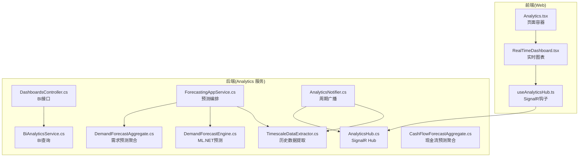
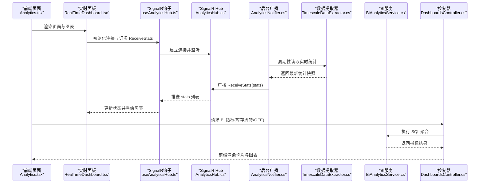
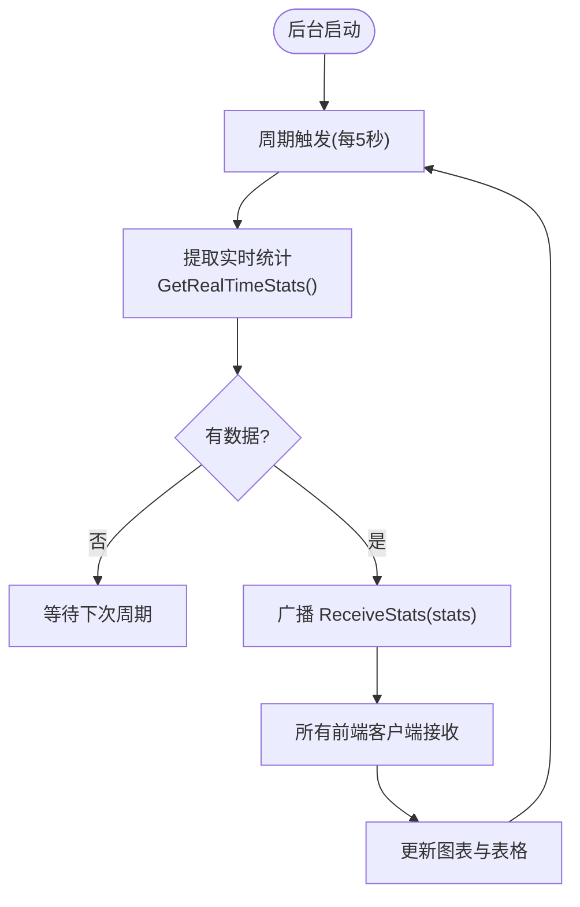
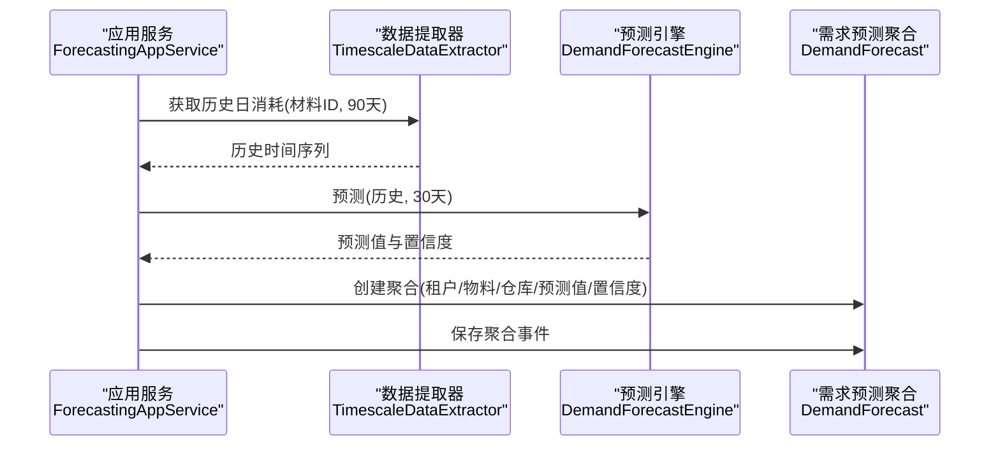
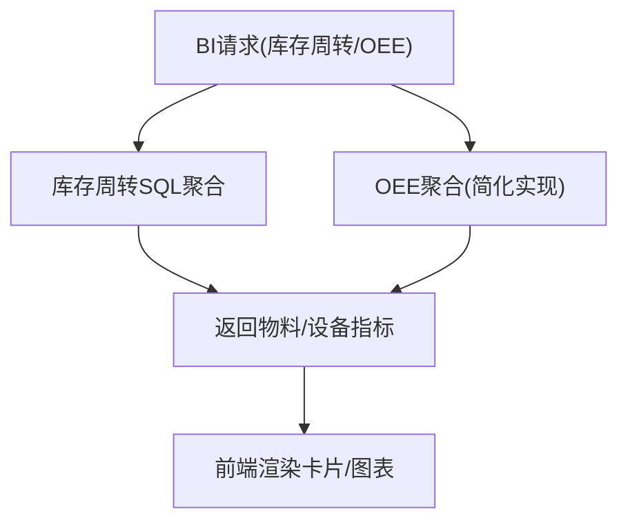
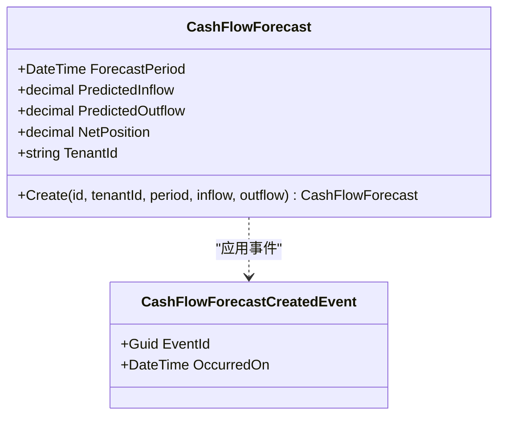
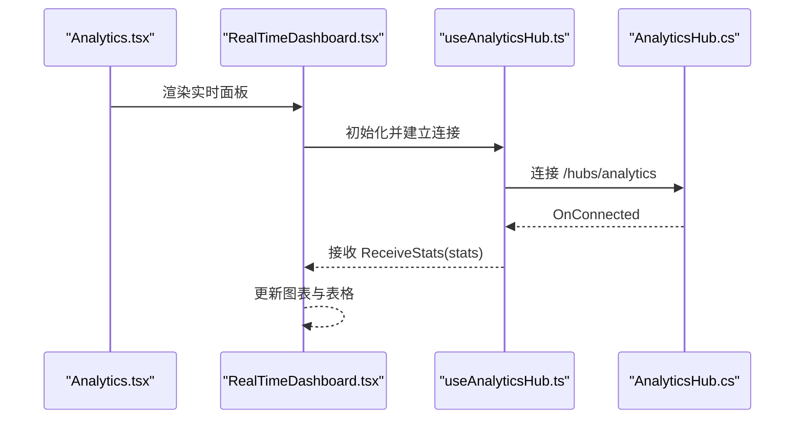
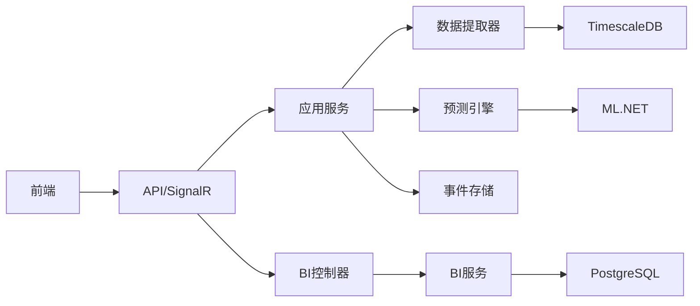

# 分析页面

<cite>
**本文引用的文件**
- [Program.cs](file://src/Services/Analytics/ErpSystem.Analytics/Program.cs)
- [appsettings.json](file://src/Services/Analytics/ErpSystem.Analytics/appsettings.json)
- [DashboardsController.cs](file://src/Services/Analytics/ErpSystem.Analytics/API/DashboardsController.cs)
- [ForecastingAppService.cs](file://src/Services/Analytics/ErpSystem.Analytics/Application/ForecastingAppService.cs)
- [DemandForecastAggregate.cs](file://src/Services/Analytics/ErpSystem.Analytics/Domain/DemandForecastAggregate.cs)
- [CashFlowForecastAggregate.cs](file://src/Services/Analytics/ErpSystem.Analytics/Domain/CashFlowForecastAggregate.cs)
- [BiAnalyticsService.cs](file://src/Services/Analytics/ErpSystem.Analytics/Infrastructure/BiAnalyticsService.cs)
- [DemandForecastEngine.cs](file://src/Services/Analytics/ErpSystem.Analytics/Infrastructure/DemandForecastEngine.cs)
- [TimescaleDataExtractor.cs](file://src/Services/Analytics/ErpSystem.Analytics/Infrastructure/TimescaleDataExtractor.cs)
- [AnalyticsNotifier.cs](file://src/Services/Analytics/ErpSystem.Analytics/Infrastructure/BackgroundJobs/AnalyticsNotifier.cs)
- [AnalyticsHub.cs](file://src/Services/Analytics/ErpSystem.Analytics/API/Hubs/AnalyticsHub.cs)
- [Analytics.tsx](file://src/Web/ErpSystem.Web/src/pages/Analytics.tsx)
- [RealTimeDashboard.tsx](file://src/Web/ErpSystem.Web/src/components/RealTimeDashboard.tsx)
- [useAnalyticsHub.ts](file://src/Web/ErpSystem.Web/src/hooks/useAnalyticsHub.ts)
- [PredictiveAnalyticsTests.cs](file://src/Tests/ErpSystem.IntegrationTests/Analytics/PredictiveAnalyticsTests.cs)
- [DashboardService.cs](file://src/Services/Reporting/ErpSystem.Reporting/Application/DashboardService.cs)
</cite>

## 目录
1. [简介](#简介)
2. [项目结构](#项目结构)
3. [核心组件](#核心组件)
4. [架构总览](#架构总览)
5. [详细组件分析](#详细组件分析)
6. [依赖关系分析](#依赖关系分析)
7. [性能考量](#性能考量)
8. [故障排查指南](#故障排查指南)
9. [结论](#结论)
10. [附录](#附录)

## 简介
本文件面向“分析页面”的实现与使用，系统性梳理 ERP 微服务中的 Analytics 服务与前端仪表板的协作架构，覆盖以下能力：
- 实时分析：基于 TimescaleDB 的连续聚合与 SignalR 推送，前端以图表与表格实时呈现库存波动与异常。
- 预测分析：基于 ML.NET 的时间序列 SSA 预测引擎，对物料需求进行短期预测，并持久化为事件聚合。
- 仪表板定制：BI 指标（库存周转率、设备综合效率）的后端查询与前端卡片/图表组合展示。
- 洞察发现：通过异常检测流与趋势可视化，辅助运营与采购决策。

同时，文档给出预测模型优化建议、准确性评估方法与业务价值量化思路，帮助团队持续改进分析效果。

## 项目结构
Analytics 服务采用分层架构：API 层负责路由与 SignalR；应用层编排预测任务；领域层以事件驱动聚合管理预测结果；基础设施层对接 TimescaleDB、BI 查询与后台广播；前端通过 React + Recharts + SignalR 构建实时仪表板。

图示来源
- [Program.cs](file://src/Services/Analytics/ErpSystem.Analytics/Program.cs#L1-L83)
- [DashboardsController.cs](file://src/Services/Analytics/ErpSystem.Analytics/API/DashboardsController.cs#L1-L26)
- [ForecastingAppService.cs](file://src/Services/Analytics/ErpSystem.Analytics/Application/ForecastingAppService.cs#L1-L42)
- [DemandForecastEngine.cs](file://src/Services/Analytics/ErpSystem.Analytics/Infrastructure/DemandForecastEngine.cs#L1-L62)
- [TimescaleDataExtractor.cs](file://src/Services/Analytics/ErpSystem.Analytics/Infrastructure/TimescaleDataExtractor.cs#L1-L142)
- [BiAnalyticsService.cs](file://src/Services/Analytics/ErpSystem.Analytics/Infrastructure/BiAnalyticsService.cs#L1-L93)
- [AnalyticsNotifier.cs](file://src/Services/Analytics/ErpSystem.Analytics/Infrastructure/BackgroundJobs/AnalyticsNotifier.cs#L1-L38)
- [AnalyticsHub.cs](file://src/Services/Analytics/ErpSystem.Analytics/API/Hubs/AnalyticsHub.cs#L1-L13)
- [DemandForecastAggregate.cs](file://src/Services/Analytics/ErpSystem.Analytics/Domain/DemandForecastAggregate.cs#L1-L69)
- [CashFlowForecastAggregate.cs](file://src/Services/Analytics/ErpSystem.Analytics/Domain/CashFlowForecastAggregate.cs#L1-L60)
- [Analytics.tsx](file://src/Web/ErpSystem.Web/src/pages/Analytics.tsx#L1-L197)
- [RealTimeDashboard.tsx](file://src/Web/ErpSystem.Web/src/components/RealTimeDashboard.tsx#L1-L120)
- [useAnalyticsHub.ts](file://src/Web/ErpSystem.Web/src/hooks/useAnalyticsHub.ts#L1-L51)

章节来源
- [Program.cs](file://src/Services/Analytics/ErpSystem.Analytics/Program.cs#L1-L83)
- [appsettings.json](file://src/Services/Analytics/ErpSystem.Analytics/appsettings.json#L1-L12)

## 核心组件
- 实时分析链路
  - 数据源：TimescaleDB 连续聚合表与高级统计视图。
  - 提取器：从 hypertable 中按天聚合提取历史与实时统计。
  - 广播：后台作业周期性抓取并推送至前端。
  - 前端：SignalR 订阅，图表与表格实时更新。
- 预测分析链路
  - 应用服务：拉取历史数据，调用预测引擎，保存预测聚合事件。
  - 领域聚合：以事件驱动方式记录预测值、置信度与租户维度。
  - ML.NET：SSA 时间序列预测，输出预测值与置信区间。
- 仪表板与 BI
  - BI 查询：库存周转率、设备 OEE 等指标的 SQL 聚合。
  - 前端卡片与图表：直观展示关键指标与趋势。
- 决策支持
  - 异常检测流：基于统计异常的告警卡片，辅助快速响应。
  - 现金流预测聚合：为流动性管理提供短期预测基线。

章节来源
- [TimescaleDataExtractor.cs](file://src/Services/Analytics/ErpSystem.Analytics/Infrastructure/TimescaleDataExtractor.cs#L1-L142)
- [AnalyticsNotifier.cs](file://src/Services/Analytics/ErpSystem.Analytics/Infrastructure/BackgroundJobs/AnalyticsNotifier.cs#L1-L38)
- [AnalyticsHub.cs](file://src/Services/Analytics/ErpSystem.Analytics/API/Hubs/AnalyticsHub.cs#L1-L13)
- [ForecastingAppService.cs](file://src/Services/Analytics/ErpSystem.Analytics/Application/ForecastingAppService.cs#L1-L42)
- [DemandForecastEngine.cs](file://src/Services/Analytics/ErpSystem.Analytics/Infrastructure/DemandForecastEngine.cs#L1-L62)
- [DemandForecastAggregate.cs](file://src/Services/Analytics/ErpSystem.Analytics/Domain/DemandForecastAggregate.cs#L1-L69)
- [CashFlowForecastAggregate.cs](file://src/Services/Analytics/ErpSystem.Analytics/Domain/CashFlowForecastAggregate.cs#L1-L60)
- [BiAnalyticsService.cs](file://src/Services/Analytics/ErpSystem.Analytics/Infrastructure/BiAnalyticsService.cs#L1-L93)
- [Analytics.tsx](file://src/Web/ErpSystem.Web/src/pages/Analytics.tsx#L1-L197)
- [RealTimeDashboard.tsx](file://src/Web/ErpSystem.Web/src/components/RealTimeDashboard.tsx#L1-L120)
- [useAnalyticsHub.ts](file://src/Web/ErpSystem.Web/src/hooks/useAnalyticsHub.ts#L1-L51)

## 架构总览
下图展示了从前端到数据库的完整数据通路与处理流程。

图示来源
- [Analytics.tsx](file://src/Web/ErpSystem.Web/src/pages/Analytics.tsx#L1-L197)
- [RealTimeDashboard.tsx](file://src/Web/ErpSystem.Web/src/components/RealTimeDashboard.tsx#L1-L120)
- [useAnalyticsHub.ts](file://src/Web/ErpSystem.Web/src/hooks/useAnalyticsHub.ts#L1-L51)
- [AnalyticsHub.cs](file://src/Services/Analytics/ErpSystem.Analytics/API/Hubs/AnalyticsHub.cs#L1-L13)
- [AnalyticsNotifier.cs](file://src/Services/Analytics/ErpSystem.Analytics/Infrastructure/BackgroundJobs/AnalyticsNotifier.cs#L1-L38)
- [TimescaleDataExtractor.cs](file://src/Services/Analytics/ErpSystem.Analytics/Infrastructure/TimescaleDataExtractor.cs#L1-L142)
- [DashboardsController.cs](file://src/Services/Analytics/ErpSystem.Analytics/API/DashboardsController.cs#L1-L26)
- [BiAnalyticsService.cs](file://src/Services/Analytics/ErpSystem.Analytics/Infrastructure/BiAnalyticsService.cs#L1-L93)

## 详细组件分析

### 实时分析：从 TimescaleDB 到前端图表
- 数据提取
  - 从 inventory_transactions_ts 超表按天聚合出日均消耗，用于趋势与预测。
  - 从 inventory_advanced_stats 连续聚合中读取最近24小时的中位数、均值与标准差等统计量。
- 后台广播
  - 每5秒轮询一次，抓取最新统计并推送到所有客户端。
- 前端展示
  - 使用 Recharts 展示柱状图（平均变动）与折线图（波动性），并以表格滚动显示实时快照。
  - 通过 SignalR 钩子接收数据，自动刷新。

图示来源
- [AnalyticsNotifier.cs](file://src/Services/Analytics/ErpSystem.Analytics/Infrastructure/BackgroundJobs/AnalyticsNotifier.cs#L1-L38)
- [TimescaleDataExtractor.cs](file://src/Services/Analytics/ErpSystem.Analytics/Infrastructure/TimescaleDataExtractor.cs#L88-L131)
- [useAnalyticsHub.ts](file://src/Web/ErpSystem.Web/src/hooks/useAnalyticsHub.ts#L1-L51)
- [RealTimeDashboard.tsx](file://src/Web/ErpSystem.Web/src/components/RealTimeDashboard.tsx#L1-L120)

章节来源
- [TimescaleDataExtractor.cs](file://src/Services/Analytics/ErpSystem.Analytics/Infrastructure/TimescaleDataExtractor.cs#L1-L142)
- [AnalyticsNotifier.cs](file://src/Services/Analytics/ErpSystem.Analytics/Infrastructure/BackgroundJobs/AnalyticsNotifier.cs#L1-L38)
- [AnalyticsHub.cs](file://src/Services/Analytics/ErpSystem.Analytics/API/Hubs/AnalyticsHub.cs#L1-L13)
- [RealTimeDashboard.tsx](file://src/Web/ErpSystem.Web/src/components/RealTimeDashboard.tsx#L1-L120)
- [useAnalyticsHub.ts](file://src/Web/ErpSystem.Web/src/hooks/useAnalyticsHub.ts#L1-L51)

### 预测分析：ML.NET SSA 需求预测
- 数据准备
  - 从 inventory_transactions_ts 按天提取物料消耗历史（最近90天）。
- 预测执行
  - 使用 ML.NET 的 ForecastBySsa 建模，设置窗口大小与置信区间，输出未来30天预测值与上下界。
- 结果落库
  - 创建需求预测聚合，应用事件并持久化到事件存储，便于审计与回放。

图示来源
- [ForecastingAppService.cs](file://src/Services/Analytics/ErpSystem.Analytics/Application/ForecastingAppService.cs#L1-L42)
- [TimescaleDataExtractor.cs](file://src/Services/Analytics/ErpSystem.Analytics/Infrastructure/TimescaleDataExtractor.cs#L14-L48)
- [DemandForecastEngine.cs](file://src/Services/Analytics/ErpSystem.Analytics/Infrastructure/DemandForecastEngine.cs#L1-L62)
- [DemandForecastAggregate.cs](file://src/Services/Analytics/ErpSystem.Analytics/Domain/DemandForecastAggregate.cs#L1-L69)

章节来源
- [ForecastingAppService.cs](file://src/Services/Analytics/ErpSystem.Analytics/Application/ForecastingAppService.cs#L1-L42)
- [DemandForecastEngine.cs](file://src/Services/Analytics/ErpSystem.Analytics/Infrastructure/DemandForecastEngine.cs#L1-L62)
- [DemandForecastAggregate.cs](file://src/Services/Analytics/ErpSystem.Analytics/Domain/DemandForecastAggregate.cs#L1-L69)
- [PredictiveAnalyticsTests.cs](file://src/Tests/ErpSystem.IntegrationTests/Analytics/PredictiveAnalyticsTests.cs#L1-L54)

### 仪表板定制与 BI 指标
- 库存周转率
  - 基于成本销售与日均库存的连续聚合计算，返回物料级周转率排序列表。
- 设备综合效率(OEE)
  - 当前为简化实现，返回固定示例值；实际应结合设备可用性与质量合格率等指标。
- 前端展示
  - 卡片式指标与趋势图表，支持切换时间粒度（日/周/季度）。

图示来源
- [DashboardsController.cs](file://src/Services/Analytics/ErpSystem.Analytics/API/DashboardsController.cs#L1-L26)
- [BiAnalyticsService.cs](file://src/Services/Analytics/ErpSystem.Analytics/Infrastructure/BiAnalyticsService.cs#L16-L87)
- [Analytics.tsx](file://src/Web/ErpSystem.Web/src/pages/Analytics.tsx#L38-L136)

章节来源
- [DashboardsController.cs](file://src/Services/Analytics/ErpSystem.Analytics/API/DashboardsController.cs#L1-L26)
- [BiAnalyticsService.cs](file://src/Services/Analytics/ErpSystem.Analytics/Infrastructure/BiAnalyticsService.cs#L1-L93)
- [Analytics.tsx](file://src/Web/ErpSystem.Web/src/pages/Analytics.tsx#L1-L197)

### 现金流预测聚合（扩展）
- 聚合作为预测聚合的补充，记录预测流入/流出与净头寸，便于短期流动性管理。
- 可与 BI 服务联动，提供“现金位置(预测)”的仪表板指标。

图示来源
- [CashFlowForecastAggregate.cs](file://src/Services/Analytics/ErpSystem.Analytics/Domain/CashFlowForecastAggregate.cs#L1-L60)

章节来源
- [CashFlowForecastAggregate.cs](file://src/Services/Analytics/ErpSystem.Analytics/Domain/CashFlowForecastAggregate.cs#L1-L60)

### 前端实时仪表板与交互
- 页面容器负责标签页切换与布局。
- 实时面板使用 Recharts 展示库存变动与波动性，表格滚动显示最新统计。
- SignalR 钩子负责连接、重连与数据接收，合并策略可按需调整（当前替换最新快照）。

图示来源
- [Analytics.tsx](file://src/Web/ErpSystem.Web/src/pages/Analytics.tsx#L1-L197)
- [RealTimeDashboard.tsx](file://src/Web/ErpSystem.Web/src/components/RealTimeDashboard.tsx#L1-L120)
- [useAnalyticsHub.ts](file://src/Web/ErpSystem.Web/src/hooks/useAnalyticsHub.ts#L1-L51)
- [AnalyticsHub.cs](file://src/Services/Analytics/ErpSystem.Analytics/API/Hubs/AnalyticsHub.cs#L1-L13)

章节来源
- [Analytics.tsx](file://src/Web/ErpSystem.Web/src/pages/Analytics.tsx#L1-L197)
- [RealTimeDashboard.tsx](file://src/Web/ErpSystem.Web/src/components/RealTimeDashboard.tsx#L1-L120)
- [useAnalyticsHub.ts](file://src/Web/ErpSystem.Web/src/hooks/useAnalyticsHub.ts#L1-L51)

## 依赖关系分析
- 组件耦合
  - 应用服务依赖提取器与预测引擎，最终写入事件存储，保持高内聚低耦合。
  - 前端仅依赖 SignalR Hub 与 BI 控制器，解耦于具体数据实现。
- 外部依赖
  - TimescaleDB：提供超表与连续聚合，支撑高性能实时分析。
  - ML.NET：提供时间序列预测能力。
  - PostgreSQL：事件存储与 BI 查询。
- 潜在循环依赖
  - 未见直接循环；领域聚合通过事件与事件总线解耦。

图示来源
- [Program.cs](file://src/Services/Analytics/ErpSystem.Analytics/Program.cs#L1-L83)
- [ForecastingAppService.cs](file://src/Services/Analytics/ErpSystem.Analytics/Application/ForecastingAppService.cs#L1-L42)
- [TimescaleDataExtractor.cs](file://src/Services/Analytics/ErpSystem.Analytics/Infrastructure/TimescaleDataExtractor.cs#L1-L142)
- [DemandForecastEngine.cs](file://src/Services/Analytics/ErpSystem.Analytics/Infrastructure/DemandForecastEngine.cs#L1-L62)
- [DashboardsController.cs](file://src/Services/Analytics/ErpSystem.Analytics/API/DashboardsController.cs#L1-L26)
- [BiAnalyticsService.cs](file://src/Services/Analytics/ErpSystem.Analytics/Infrastructure/BiAnalyticsService.cs#L1-L93)

章节来源
- [Program.cs](file://src/Services/Analytics/ErpSystem.Analytics/Program.cs#L1-L83)
- [DashboardsController.cs](file://src/Services/Analytics/ErpSystem.Analytics/API/DashboardsController.cs#L1-L26)
- [ForecastingAppService.cs](file://src/Services/Analytics/ErpSystem.Analytics/Application/ForecastingAppService.cs#L1-L42)
- [DemandForecastEngine.cs](file://src/Services/Analytics/ErpSystem.Analytics/Infrastructure/DemandForecastEngine.cs#L1-L62)
- [TimescaleDataExtractor.cs](file://src/Services/Analytics/ErpSystem.Analytics/Infrastructure/TimescaleDataExtractor.cs#L1-L142)
- [BiAnalyticsService.cs](file://src/Services/Analytics/ErpSystem.Analytics/Infrastructure/BiAnalyticsService.cs#L1-L93)

## 性能考量
- TimescaleDB
  - 使用 time_bucket 与连续聚合，显著降低查询扫描范围；建议为高频查询列建立索引或物化视图。
- ML.NET
  - SSA 预测适合中小时间序列；对长序列可考虑 ARIMA 或 Prophet；注意特征工程与季节性窗口选择。
- SignalR
  - 后台广播频率与前端渲染频率需平衡，避免过度推送导致抖动；可引入增量更新或去抖策略。
- 缓存与批处理
  - 对静态 BI 指标可引入缓存；对高频统计可批量推送而非逐条发送。
- 数据库连接
  - BI 查询与提取器使用独立连接池，确保并发场景下的稳定性。

## 故障排查指南
- 连接失败
  - 检查 AnalyticsConnection 连接字符串是否正确；确认 TimescaleDB/Timescale Toolkit 已启用。
- 预测无结果
  - 确认历史数据非空且格式正确；查看 ML.NET 预测返回值与置信度。
- 实时数据延迟
  - 检查后台广播间隔与网络延迟；确认前端自动重连配置生效。
- BI 指标为空
  - 核对时间窗口参数与连续聚合是否已生成；检查租户维度过滤条件。

章节来源
- [appsettings.json](file://src/Services/Analytics/ErpSystem.Analytics/appsettings.json#L1-L12)
- [TimescaleDataExtractor.cs](file://src/Services/Analytics/ErpSystem.Analytics/Infrastructure/TimescaleDataExtractor.cs#L123-L128)
- [useAnalyticsHub.ts](file://src/Web/ErpSystem.Web/src/hooks/useAnalyticsHub.ts#L17-L47)
- [PredictiveAnalyticsTests.cs](file://src/Tests/ErpSystem.IntegrationTests/Analytics/PredictiveAnalyticsTests.cs#L1-L54)

## 结论
该分析页面以“实时 + 预测 + BI + 洞察”为主线，构建了从前端到数据库的闭环分析体系。通过 TimescaleDB 的连续聚合与 ML.NET 的 SSA 预测，实现了高时效的运营洞察；通过 BI 查询与卡片/图表展示，提升了决策效率。后续可在模型精度、异常规则与业务指标体系上持续优化，形成可量化的业务价值闭环。

## 附录
- 业务价值量化建议
  - 需求预测准确率：对比 MAPE/MASE，跟踪预测偏差随时间变化。
  - 库存成本节省：对比预测前后安全库存与资金占用变化。
  - 生产/采购响应时间：对比异常检测到处置的时间缩短。
  - 现金流稳定性：对比预测期内流动性缺口减少比例。
- 模型优化清单
  - 特征工程：加入节假日、促销、季节性编码。
  - 模型融合：多模型投票/加权，提升鲁棒性。
  - 在线学习：对高波动物料启用增量训练。
  - 规则增强：结合阈值与统计量的混合异常检测。