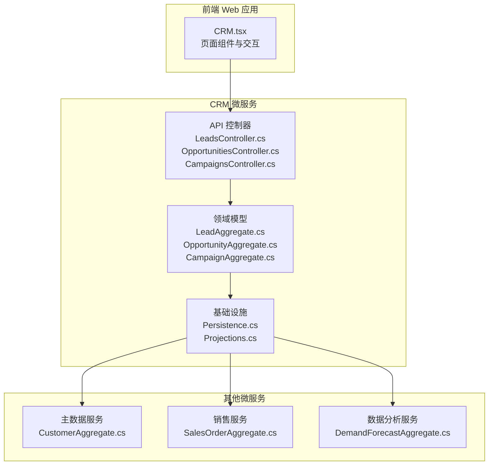
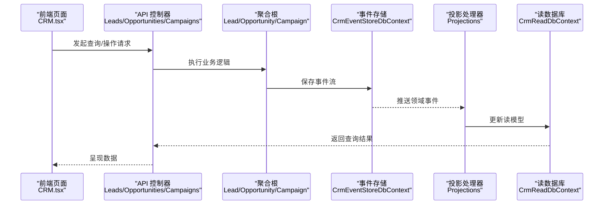
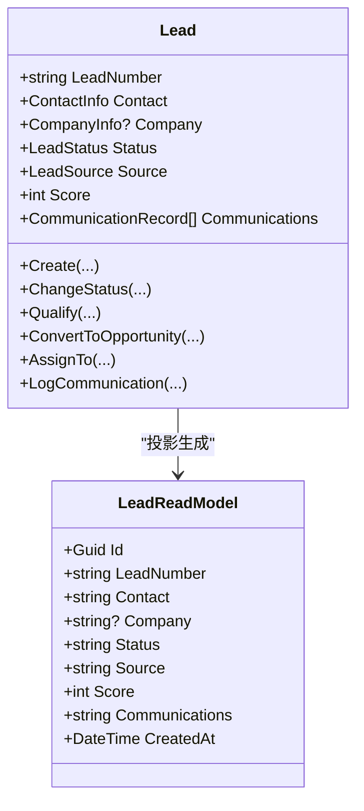
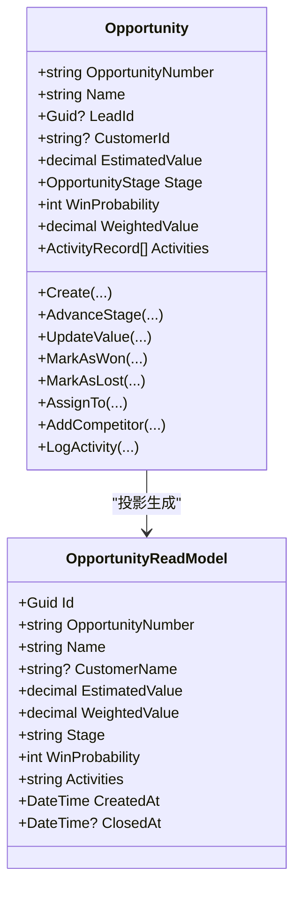
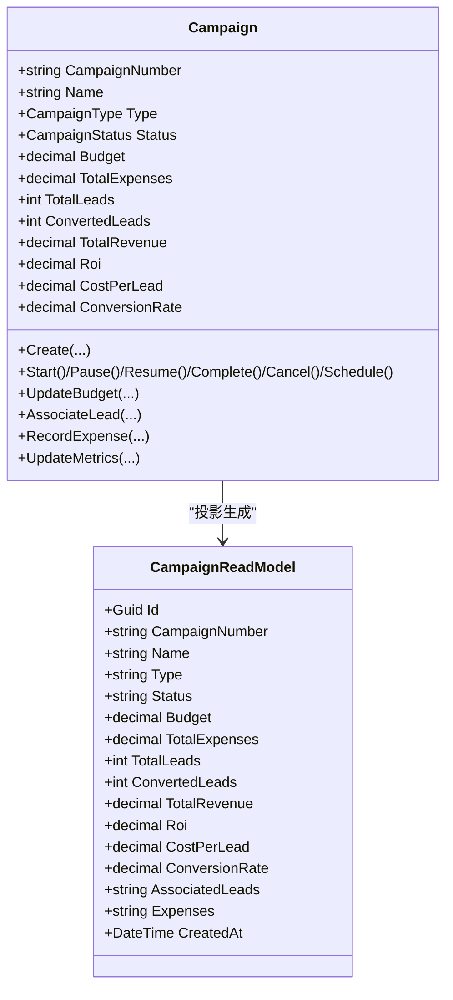
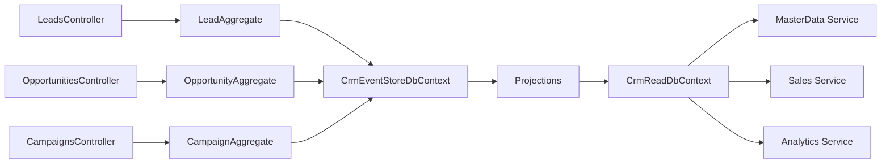

# 客户关系页面

<cite>
**本文档引用的文件**
- [ErpSystem.CRM.csproj](file://src/Services/CRM/ErpSystem.CRM/ErpSystem.CRM.csproj)
- [LeadsController.cs](file://src/Services/CRM/ErpSystem.CRM/API/LeadsController.cs)
- [OpportunitiesController.cs](file://src/Services/CRM/ErpSystem.CRM/API/OpportunitiesController.cs)
- [CampaignsController.cs](file://src/Services/CRM/ErpSystem.CRM/API/CampaignsController.cs)
- [LeadAggregate.cs](file://src/Services/CRM/ErpSystem.CRM/Domain/LeadAggregate.cs)
- [OpportunityAggregate.cs](file://src/Services/CRM/ErpSystem.CRM/Domain/OpportunityAggregate.cs)
- [CampaignAggregate.cs](file://src/Services/CRM/ErpSystem.CRM/Domain/CampaignAggregate.cs)
- [Persistence.cs](file://src/Services/CRM/ErpSystem.CRM/Infrastructure/Persistence.cs)
- [Projections.cs](file://src/Services/CRM/ErpSystem.CRM/Infrastructure/Projections.cs)
- [CRM.tsx](file://src/Web/ErpSystem.Web/src/pages/CRM.tsx)
- [MasterData_CustomerAggregate.cs](file://src/Services/MasterData/ErpSystem.MasterData/Domain/CustomerAggregate.cs)
- [Sales_SalesOrderAggregate.cs](file://src/Services/Sales/ErpSystem.Sales/Domain/SalesOrderAggregate.cs)
- [Analytics_DemandForecastAggregate.cs](file://src/Services/Analytics/ErpSystem.Analytics/Domain/DemandForecastAggregate.cs)
- [PRD-01-MasterData-Service.md](file://docs/PRD-01-MasterData-Service.md)
- [prd.md.resolved](file://src/prd.md.resolved)
</cite>

## 目录
1. [简介](#简介)
2. [项目结构](#项目结构)
3. [核心组件](#核心组件)
4. [架构总览](#架构总览)
5. [详细组件分析](#详细组件分析)
6. [依赖关系分析](#依赖关系分析)
7. [性能考虑](#性能考虑)
8. [故障排除指南](#故障排除指南)
9. [结论](#结论)
10. [附录](#附录)

## 简介
本文件面向“客户关系页面”的实现与使用，系统化阐述 CRM 页面的架构设计、功能模块与数据流，覆盖客户管理、销售线索、营销活动与客户服务等关键领域。文档同时记录客户数据的统一管理方式（联系人信息、互动历史、购买记录整合展示），销售流程自动化支持、营销活动效果追踪与客户满意度分析机制，并提供客户细分策略、生命周期管理与价值评估的实现方案，以及客户关系优化建议、留存率提升与收入增长的辅助工具。

## 项目结构
CRM 微服务采用分层架构：API 控制器负责对外接口，Domain 聚合根承载业务规则与状态变更，Infrastructure 提供事件存储与读模型投影，前端 Web 应用通过页面组件消费 API 数据并渲染界面。

图表来源
- [CRM.tsx](file://src/Web/ErpSystem.Web/src/pages/CRM.tsx#L560-L606)
- [LeadsController.cs](file://src/Services/CRM/ErpSystem.CRM/API/LeadsController.cs#L1-L238)
- [OpportunitiesController.cs](file://src/Services/CRM/ErpSystem.CRM/API/OpportunitiesController.cs#L1-L294)
- [CampaignsController.cs](file://src/Services/CRM/ErpSystem.CRM/API/CampaignsController.cs#L1-L327)
- [Persistence.cs](file://src/Services/CRM/ErpSystem.CRM/Infrastructure/Persistence.cs#L1-L146)
- [Projections.cs](file://src/Services/CRM/ErpSystem.CRM/Infrastructure/Projections.cs#L1-L342)
- [MasterData_CustomerAggregate.cs](file://src/Services/MasterData/ErpSystem.MasterData/Domain/CustomerAggregate.cs#L1-L96)
- [Sales_SalesOrderAggregate.cs](file://src/Services/Sales/ErpSystem.Sales/Domain/SalesOrderAggregate.cs#L1-L148)
- [Analytics_DemandForecastAggregate.cs](file://src/Services/Analytics/ErpSystem.Analytics/Domain/DemandForecastAggregate.cs#L1-L69)

章节来源
- [ErpSystem.CRM.csproj](file://src/Services/CRM/ErpSystem.CRM/ErpSystem.CRM.csproj#L1-L25)
- [CRM.tsx](file://src/Web/ErpSystem.Web/src/pages/CRM.tsx#L1-L606)

## 核心组件
- API 控制器层：提供线索、商机、营销活动的查询与命令接口，支持分页、过滤与统计分析。
- 领域模型层：以聚合根为核心，封装业务规则与状态变化，发布领域事件以驱动后续处理。
- 基础设施层：事件存储持久化与读模型投影，支撑实时查询与报表分析。
- 前端页面：提供线索、商机、营销活动三大标签页，支持列表/漏斗视图切换与关键指标展示。

章节来源
- [LeadsController.cs](file://src/Services/CRM/ErpSystem.CRM/API/LeadsController.cs#L1-L238)
- [OpportunitiesController.cs](file://src/Services/CRM/ErpSystem.CRM/API/OpportunitiesController.cs#L1-L294)
- [CampaignsController.cs](file://src/Services/CRM/ErpSystem.CRM/API/CampaignsController.cs#L1-L327)
- [LeadAggregate.cs](file://src/Services/CRM/ErpSystem.CRM/Domain/LeadAggregate.cs#L1-L307)
- [OpportunityAggregate.cs](file://src/Services/CRM/ErpSystem.CRM/Domain/OpportunityAggregate.cs#L1-L348)
- [CampaignAggregate.cs](file://src/Services/CRM/ErpSystem.CRM/Domain/CampaignAggregate.cs#L1-L340)
- [Persistence.cs](file://src/Services/CRM/ErpSystem.CRM/Infrastructure/Persistence.cs#L1-L146)
- [Projections.cs](file://src/Services/CRM/ErpSystem.CRM/Infrastructure/Projections.cs#L1-L342)
- [CRM.tsx](file://src/Web/ErpSystem.Web/src/pages/CRM.tsx#L1-L606)

## 架构总览
CRM 页面采用事件驱动架构：前端通过 API 获取数据；控制器接收请求并调用聚合根执行业务操作；聚合根产生领域事件；投影处理器将事件转换为读模型，供查询与统计使用。

图表来源
- [LeadsController.cs](file://src/Services/CRM/ErpSystem.CRM/API/LeadsController.cs#L1-L238)
- [OpportunitiesController.cs](file://src/Services/CRM/ErpSystem.CRM/API/OpportunitiesController.cs#L1-L294)
- [CampaignsController.cs](file://src/Services/CRM/ErpSystem.CRM/API/CampaignsController.cs#L1-L327)
- [Persistence.cs](file://src/Services/CRM/ErpSystem.CRM/Infrastructure/Persistence.cs#L8-L66)
- [Projections.cs](file://src/Services/CRM/ErpSystem.CRM/Infrastructure/Projections.cs#L1-L342)

## 详细组件分析

### 线索管理（Leads）
- 功能要点
  - 创建线索：支持联系人与公司信息录入，来源渠道与备注。
  - 状态流转：新线索 → 已联系 → 合格 → 转化为商机/丢失。
  - 评分与分配：支持评分与指派给销售用户。
  - 互动记录：记录电话、邮件、会议等沟通历史。
- 关键接口
  - 查询：分页、按状态/来源/负责人过滤，统计分析。
  - 命令：更新状态、评分、转化、指派、记录沟通。
- 读模型字段
  - 联系人信息、公司信息、状态、来源、评分、指派人、沟通历史、创建时间等。

图表来源
- [LeadAggregate.cs](file://src/Services/CRM/ErpSystem.CRM/Domain/LeadAggregate.cs#L170-L307)
- [Persistence.cs](file://src/Services/CRM/ErpSystem.CRM/Infrastructure/Persistence.cs#L72-L88)
- [Projections.cs](file://src/Services/CRM/ErpSystem.CRM/Infrastructure/Projections.cs#L9-L96)

章节来源
- [LeadsController.cs](file://src/Services/CRM/ErpSystem.CRM/API/LeadsController.cs#L1-L238)
- [LeadAggregate.cs](file://src/Services/CRM/ErpSystem.CRM/Domain/LeadAggregate.cs#L1-L307)
- [Persistence.cs](file://src/Services/CRM/ErpSystem.CRM/Infrastructure/Persistence.cs#L72-L88)
- [Projections.cs](file://src/Services/CRM/ErpSystem.CRM/Infrastructure/Projections.cs#L9-L96)

### 商机管理（Opportunities）
- 功能要点
  - 销售阶段：初步接洽 → 需求确认 → 方案报价 → 商务谈判 → 合同签署 → 赢单/输单。
  - 概率与加权值：根据阶段自动计算胜率与加权价值。
  - 竞争对手与活动：记录竞争对手优劣势与活动日志。
  - 关闭管理：支持标记赢单/输单，并可关联销售订单。
- 关键接口
  - 查询：按阶段/优先级/负责人/客户过滤，销售漏斗与赢/损分析。
  - 命令：推进阶段、更新金额、标记赢单/输单、指派、添加竞争对手、记录活动。
- 读模型字段
  - 编号、名称、客户信息、金额、阶段、胜率、加权值、活动与竞争对手、创建/关闭时间等。

图表来源
- [OpportunityAggregate.cs](file://src/Services/CRM/ErpSystem.CRM/Domain/OpportunityAggregate.cs#L162-L348)
- [Persistence.cs](file://src/Services/CRM/ErpSystem.CRM/Infrastructure/Persistence.cs#L90-L114)
- [Projections.cs](file://src/Services/CRM/ErpSystem.CRM/Infrastructure/Projections.cs#L102-L226)

章节来源
- [OpportunitiesController.cs](file://src/Services/CRM/ErpSystem.CRM/API/OpportunitiesController.cs#L1-L294)
- [OpportunityAggregate.cs](file://src/Services/CRM/ErpSystem.CRM/Domain/OpportunityAggregate.cs#L1-L348)
- [Persistence.cs](file://src/Services/CRM/ErpSystem.CRM/Infrastructure/Persistence.cs#L90-L114)
- [Projections.cs](file://src/Services/CRM/ErpSystem.CRM/Infrastructure/Projections.cs#L102-L226)

### 营销活动（Campaigns）
- 功能要点
  - 生命周期：草稿 → 预约 → 活动中 → 暂停 → 完成 → 取消。
  - 预算与费用：预算调整、费用记录、预算利用率与 ROI 计算。
  - 指标追踪：线索数、转化数、转化率、成本/线索、总收入、ROI。
  - 线索关联：将线索与活动关联，便于来源分析。
- 关键接口
  - 查询：按状态/类型分页，ROI 汇总分析。
  - 命令：启动/暂停/恢复/完成/取消、预算调整、费用记录、指标更新、线索关联。
- 读模型字段
  - 编号、名称、类型、状态、预算、费用、指标（线索数/转化数/收入/ROI）、关联线索与费用明细、创建时间等。

图表来源
- [CampaignAggregate.cs](file://src/Services/CRM/ErpSystem.CRM/Domain/CampaignAggregate.cs#L139-L340)
- [Persistence.cs](file://src/Services/CRM/ErpSystem.CRM/Infrastructure/Persistence.cs#L116-L143)
- [Projections.cs](file://src/Services/CRM/ErpSystem.CRM/Infrastructure/Projections.cs#L232-L339)

章节来源
- [CampaignsController.cs](file://src/Services/CRM/ErpSystem.CRM/API/CampaignsController.cs#L1-L327)
- [CampaignAggregate.cs](file://src/Services/CRM/ErpSystem.CRM/Domain/CampaignAggregate.cs#L1-L340)
- [Persistence.cs](file://src/Services/CRM/ErpSystem.CRM/Infrastructure/Persistence.cs#L116-L143)
- [Projections.cs](file://src/Services/CRM/ErpSystem.CRM/Infrastructure/Projections.cs#L232-L339)

### 客户数据统一管理
- 客户主数据
  - 字段：客户编码、名称、类型、信用额度、信用期限、当前欠款、收货地址集合、负责销售员、生命周期阶段等。
  - 用途：作为商机与销售订单的客户基础信息来源。
- 购买记录整合
  - 销售订单聚合包含客户信息与订单明细，可用于线索/商机转化后的交易追踪。
- 互动历史
  - 线索与商机均支持记录沟通/活动历史，形成客户全生命周期互动视图。

章节来源
- [MasterData_CustomerAggregate.cs](file://src/Services/MasterData/ErpSystem.MasterData/Domain/CustomerAggregate.cs#L1-L96)
- [Sales_SalesOrderAggregate.cs](file://src/Services/Sales/ErpSystem.Sales/Domain/SalesOrderAggregate.cs#L1-L148)
- [LeadAggregate.cs](file://src/Services/CRM/ErpSystem.CRM/Domain/LeadAggregate.cs#L1-L307)
- [OpportunityAggregate.cs](file://src/Services/CRM/ErpSystem.CRM/Domain/OpportunityAggregate.cs#L1-L348)

### 销售流程自动化支持
- 线索到商机：合格线索一键转化为商机，自动更新状态与关联信息。
- 商机到销售订单：商机赢单后可自动创建销售订单，推进到发货与结算环节。
- 报表与分析：销售漏斗、阶段转化率、加权价值等指标用于流程优化。

章节来源
- [LeadAggregate.cs](file://src/Services/CRM/ErpSystem.CRM/Domain/LeadAggregate.cs#L222-L236)
- [OpportunityAggregate.cs](file://src/Services/CRM/ErpSystem.CRM/Domain/OpportunityAggregate.cs#L233-L240)
- [Sales_SalesOrderAggregate.cs](file://src/Services/Sales/ErpSystem.Sales/Domain/SalesOrderAggregate.cs#L1-L148)

### 营销活动效果追踪
- 指标体系：预算、费用、线索数、转化数、转化率、成本/线索、总收入、ROI。
- 分析维度：按活动类型、状态、时间段进行汇总与对比。
- 来源渠道：结合线索来源统计渠道 ROI，指导资源分配。

章节来源
- [CampaignAggregate.cs](file://src/Services/CRM/ErpSystem.CRM/Domain/CampaignAggregate.cs#L164-L184)
- [Projections.cs](file://src/Services/CRM/ErpSystem.CRM/Infrastructure/Projections.cs#L317-L338)
- [CampaignsController.cs](file://src/Services/CRM/ErpSystem.CRM/API/CampaignsController.cs#L56-L108)

### 客户满意度分析机制
- 前端展示：线索/商机状态与评分可视化，便于识别高价值客户与潜在风险。
- 互动记录：沟通/活动历史按时间线展示，支持跟进提醒与服务改进。
- 信用与账期：结合客户信用额度与当前欠款，评估客户财务健康状况。

章节来源
- [CRM.tsx](file://src/Web/ErpSystem.Web/src/pages/CRM.tsx#L62-L121)
- [LeadAggregate.cs](file://src/Services/CRM/ErpSystem.CRM/Domain/LeadAggregate.cs#L126-L138)
- [OpportunityAggregate.cs](file://src/Services/CRM/ErpSystem.CRM/Domain/OpportunityAggregate.cs#L121-L133)
- [MasterData_CustomerAggregate.cs](file://src/Services/MasterData/ErpSystem.MasterData/Domain/CustomerAggregate.cs#L6-L9)

### 客户细分策略、生命周期管理与价值评估
- 细分策略
  - 基于线索来源、评分、商机阶段与客户类型进行分群。
  - 结合主数据客户等级与信用信息，实施差异化服务策略。
- 生命周期管理
  - 潜在客户 → 新客户 → 成长期 → 成熟期 → 衰退期 → 流失客户。
  - 自动识别与风险提醒，支持主动干预。
- 价值评估
  - 加权价值（金额×胜率）与历史交易规模综合评估客户价值。

章节来源
- [PRD-01-MasterData-Service.md](file://docs/PRD-01-MasterData-Service.md#L317-L336)
- [prd.md.resolved](file://src/prd.md.resolved#L66-L120)
- [OpportunityAggregate.cs](file://src/Services/CRM/ErpSystem.CRM/Domain/OpportunityAggregate.cs#L186-L186)
- [MasterData_CustomerAggregate.cs](file://src/Services/MasterData/ErpSystem.MasterData/Domain/CustomerAggregate.cs#L38-L42)

### 客户关系优化建议、留存率提升与收入增长辅助工具
- 优化建议
  - 提升线索评分算法准确性，结合行为与属性权重。
  - 强化销售阶段可视化与提醒机制，减少停滞。
  - 将营销活动 ROI 与销售漏斗联动，动态调整投放策略。
- 留存率提升
  - 基于生命周期阶段与互动频率建立预警模型，提前干预。
  - 信用与账期策略与客户价值匹配，降低坏账风险。
- 收入增长辅助
  - 加权价值与胜率驱动优先级排序，聚焦高价值商机。
  - 需求预测与库存协同，提升交付能力与客户满意度。

章节来源
- [prd.md.resolved](file://src/prd.md.resolved#L66-L120)
- [Analytics_DemandForecastAggregate.cs](file://src/Services/Analytics/ErpSystem.Analytics/Domain/DemandForecastAggregate.cs#L1-L69)

## 依赖关系分析
- 内部耦合
  - API 控制器依赖聚合根与读数据库上下文。
  - 聚合根通过事件存储持久化，投影处理器订阅事件并更新读模型。
- 外部集成
  - 主数据服务提供客户主数据，销售服务提供销售订单数据，数据分析服务提供需求预测能力。

图表来源
- [LeadsController.cs](file://src/Services/CRM/ErpSystem.CRM/API/LeadsController.cs#L1-L238)
- [OpportunitiesController.cs](file://src/Services/CRM/ErpSystem.CRM/API/OpportunitiesController.cs#L1-L294)
- [CampaignsController.cs](file://src/Services/CRM/ErpSystem.CRM/API/CampaignsController.cs#L1-L327)
- [Persistence.cs](file://src/Services/CRM/ErpSystem.CRM/Infrastructure/Persistence.cs#L8-L66)
- [Projections.cs](file://src/Services/CRM/ErpSystem.CRM/Infrastructure/Projections.cs#L1-L342)

章节来源
- [Persistence.cs](file://src/Services/CRM/ErpSystem.CRM/Infrastructure/Persistence.cs#L1-L146)
- [Projections.cs](file://src/Services/CRM/ErpSystem.CRM/Infrastructure/Projections.cs#L1-L342)

## 性能考虑
- 事件存储
  - 使用 PostgreSQL + jsonb 存储事件负载，适合高写入场景。
- 读模型投影
  - 通过异步投影更新读库，避免查询路径阻塞写入。
- 查询优化
  - 在读模型上建立必要索引（如编号唯一索引、状态/类型/负责人等）。
- 前端缓存
  - 列表与统计结果可做本地缓存，减少重复请求。

## 故障排除指南
- 常见问题
  - 线索状态不可逆：已转化或丢失的线索不允许再次变更状态。
  - 商机阶段不可越级：仅允许按顺序推进，禁止直接跳转到关闭阶段。
  - 营销活动预算与费用校验：预算与费用必须非负，活动状态限制记录费用。
- 排查步骤
  - 检查聚合根抛出的异常信息与前置条件。
  - 核对事件存储是否成功写入，投影是否正常运行。
  - 确认读模型索引是否存在缺失导致查询失败。

章节来源
- [LeadAggregate.cs](file://src/Services/CRM/ErpSystem.CRM/Domain/LeadAggregate.cs#L200-L236)
- [OpportunityAggregate.cs](file://src/Services/CRM/ErpSystem.CRM/Domain/OpportunityAggregate.cs#L210-L251)
- [CampaignAggregate.cs](file://src/Services/CRM/ErpSystem.CRM/Domain/CampaignAggregate.cs#L257-L286)

## 结论
本 CRM 页面通过清晰的分层架构与事件驱动设计，实现了线索、商机、营销活动的全生命周期管理，并与主数据、销售、数据分析等服务协同，支撑客户价值评估与销售流程自动化。前端以直观的视图与指标帮助运营人员快速洞察客户关系现状，为留存率提升与收入增长提供坚实基础。

## 附录
- 快速导航
  - 线索管理：创建、评分、分配、转化、沟通记录。
  - 商机管理：阶段推进、金额更新、赢单/输单、活动与竞争对手记录。
  - 营销活动：生命周期管理、预算与费用、指标追踪与 ROI 分析。
  - 客户数据：主数据与购买记录整合，信用与账期管理。
  - 分析工具：销售漏斗、加权价值、生命周期阶段、需求预测。