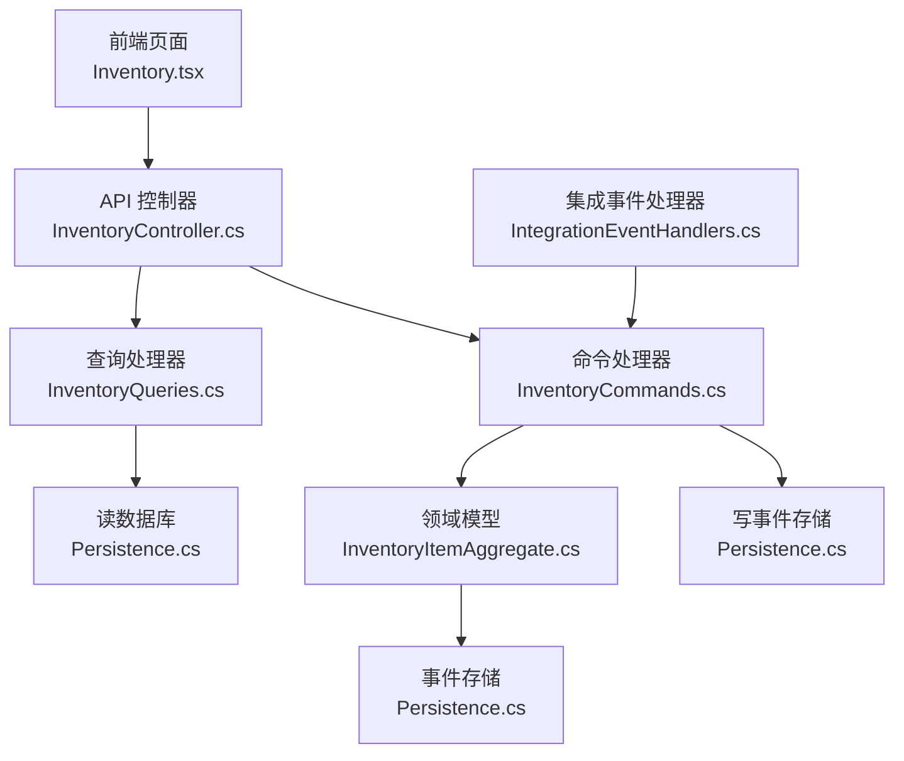
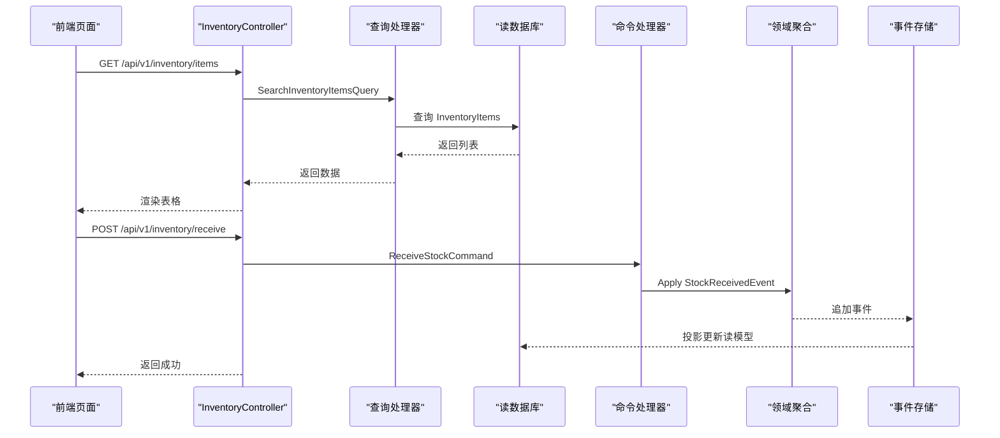
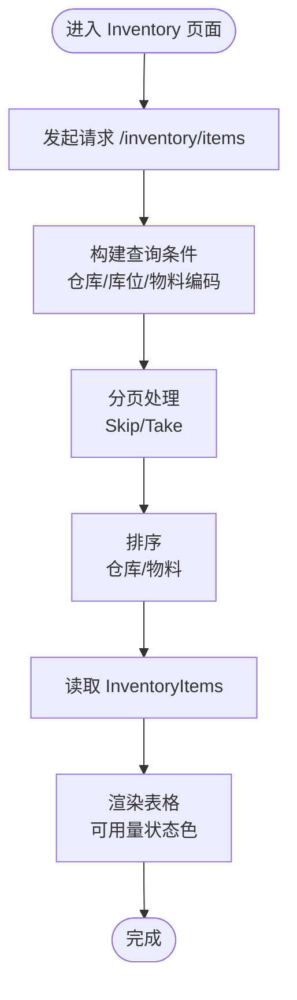
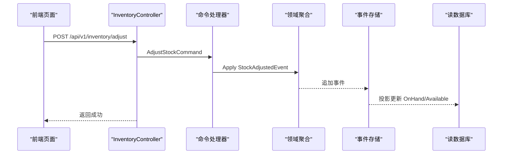
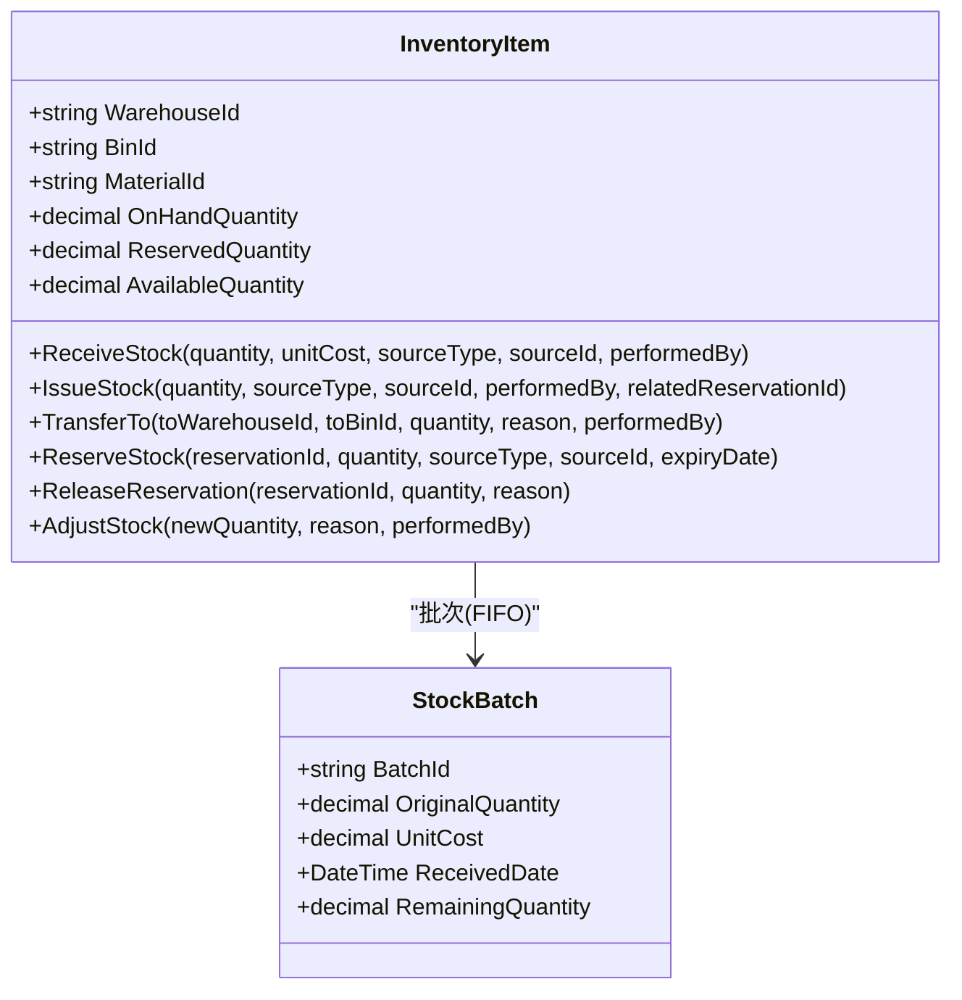
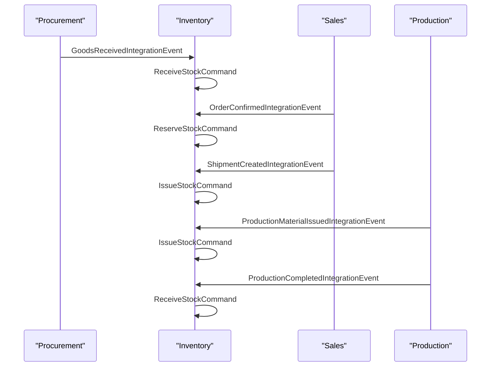
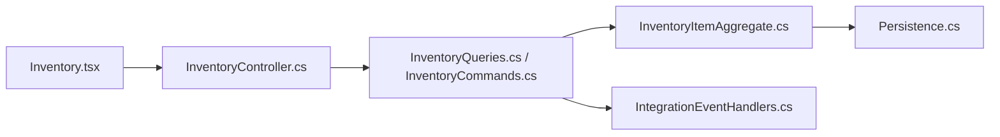

# 库存管理页面

<cite>
**本文引用的文件**
- [InventoryController.cs](file://src/Services/Inventory/ErpSystem.Inventory/API/InventoryController.cs)
- [InventoryQueries.cs](file://src/Services/Inventory/ErpSystem.Inventory/Application/InventoryQueries.cs)
- [InventoryCommands.cs](file://src/Services/Inventory/ErpSystem.Inventory/Application/InventoryCommands.cs)
- [InventoryItemAggregate.cs](file://src/Services/Inventory/ErpSystem.Inventory/Domain/InventoryItemAggregate.cs)
- [Persistence.cs](file://src/Services/Inventory/ErpSystem.Inventory/Infrastructure/Persistence.cs)
- [IntegrationEventHandlers.cs](file://src/Services/Inventory/ErpSystem.Inventory/Application/IntegrationEventHandlers.cs)
- [Inventory.tsx](file://src/Web/ErpSystem.Web/src/pages/Inventory.tsx)
- [PRD-05-Inventory-Service.md](file://docs/PRD-05-Inventory-Service.md)
- [WarehouseAggregate.cs](file://src/Services/MasterData/ErpSystem.MasterData/Domain/WarehouseAggregate.cs)
- [InventoryForecastService.cs](file://src/Services/Inventory/ErpSystem.Inventory/Domain/Services/InventoryForecastService.cs)
- [AuditLog.cs](file://src/BuildingBlocks/ErpSystem.BuildingBlocks/Auditing/AuditLog.cs)
- [AuthExtensions.cs](file://src/BuildingBlocks/ErpSystem.BuildingBlocks/Auth/AuthExtensions.cs)
</cite>

## 目录
1. [简介](#简介)
2. [项目结构](#项目结构)
3. [核心组件](#核心组件)
4. [架构概览](#架构概览)
5. [详细组件分析](#详细组件分析)
6. [依赖关系分析](#依赖关系分析)
7. [性能考量](#性能考量)
8. [故障排除指南](#故障排除指南)
9. [结论](#结论)
10. [附录](#附录)

## 简介
本文件面向库存管理页面（Inventory 页面），系统性梳理其功能实现与技术架构，重点覆盖：
- 库存查询、库存调整、批次管理、仓库管理
- 数据表格组件的分页、排序、筛选与批量操作能力
- 库存预警机制、安全库存设置与库存历史追踪
- 库存移动处理、盘点操作与库存报表生成
- 数据验证规则、权限控制与操作日志记录

该页面基于微服务架构中的 Inventory 服务，结合前端 React 页面与后端 CQRS + 领域事件驱动的实现，提供从查询到执行再到审计的完整闭环。

## 项目结构
Inventory 页面由前端页面与后端服务共同组成：
- 前端：Inventory.tsx 提供库存列表查询、筛选与基础交互
- 后端：InventoryController 暴露 REST 接口；Application 层包含查询与命令；Domain 层定义库存聚合与事件；Infrastructure 提供读模型与事件存储

图表来源
- [InventoryController.cs](file://src/Services/Inventory/ErpSystem.Inventory/API/InventoryController.cs#L1-L44)
- [InventoryQueries.cs](file://src/Services/Inventory/ErpSystem.Inventory/Application/InventoryQueries.cs#L1-L50)
- [InventoryCommands.cs](file://src/Services/Inventory/ErpSystem.Inventory/Application/InventoryCommands.cs#L1-L142)
- [InventoryItemAggregate.cs](file://src/Services/Inventory/ErpSystem.Inventory/Domain/InventoryItemAggregate.cs#L1-L255)
- [Persistence.cs](file://src/Services/Inventory/ErpSystem.Inventory/Infrastructure/Persistence.cs#L1-L79)
- [IntegrationEventHandlers.cs](file://src/Services/Inventory/ErpSystem.Inventory/Application/IntegrationEventHandlers.cs#L1-L112)

章节来源
- [InventoryController.cs](file://src/Services/Inventory/ErpSystem.Inventory/API/InventoryController.cs#L1-L44)
- [InventoryQueries.cs](file://src/Services/Inventory/ErpSystem.Inventory/Application/InventoryQueries.cs#L1-L50)
- [InventoryCommands.cs](file://src/Services/Inventory/ErpSystem.Inventory/Application/InventoryCommands.cs#L1-L142)
- [Persistence.cs](file://src/Services/Inventory/ErpSystem.Inventory/Infrastructure/Persistence.cs#L1-L79)

## 核心组件
- 控制器层：提供库存查询、可用量查询、入库、出库、转移、预留、释放预留、库存调整、交易明细查询等接口
- 应用层：定义查询与命令对象，以及对应的处理器，负责业务编排与校验
- 领域层：库存聚合根与事件模型，封装可用量、预留量、批次与成本流转
- 基础设施层：事件存储与读模型（InventoryItemReadModel、StockTransactionReadModel、StockReservationReadModel）

章节来源
- [InventoryController.cs](file://src/Services/Inventory/ErpSystem.Inventory/API/InventoryController.cs#L1-L44)
- [InventoryQueries.cs](file://src/Services/Inventory/ErpSystem.Inventory/Application/InventoryQueries.cs#L1-L50)
- [InventoryCommands.cs](file://src/Services/Inventory/ErpSystem.Inventory/Application/InventoryCommands.cs#L1-L142)
- [InventoryItemAggregate.cs](file://src/Services/Inventory/ErpSystem.Inventory/Domain/InventoryItemAggregate.cs#L1-L255)
- [Persistence.cs](file://src/Services/Inventory/ErpSystem.Inventory/Infrastructure/Persistence.cs#L1-L79)

## 架构概览
Inventory 页面采用 CQRS + 领域事件模式：
- 查询路径：控制器 -> 查询处理器 -> 读数据库（InventoryItemReadModel、StockTransactionReadModel）
- 命令路径：控制器 -> 命令处理器 -> 领域聚合 -> 事件存储 -> 读模型投影
- 集成事件：来自 Procurement/Sales/Production 的事件被转换为库存命令，驱动状态变更

图表来源
- [InventoryController.cs](file://src/Services/Inventory/ErpSystem.Inventory/API/InventoryController.cs#L11-L42)
- [InventoryQueries.cs](file://src/Services/Inventory/ErpSystem.Inventory/Application/InventoryQueries.cs#L25-L48)
- [InventoryCommands.cs](file://src/Services/Inventory/ErpSystem.Inventory/Application/InventoryCommands.cs#L68-L89)
- [Persistence.cs](file://src/Services/Inventory/ErpSystem.Inventory/Infrastructure/Persistence.cs#L39-L79)

## 详细组件分析

### 1) 库存查询与表格组件
- 查询接口：支持按仓库、库位、物料编码分页查询，返回库存余额与可用量
- 表格组件：前端提供筛选（仓库、物料编码）、加载状态与空结果提示
- 分页与排序：查询处理器使用 Skip/Take 实现分页；默认按仓库与物料排序
- 筛选：查询处理器根据传入参数动态构建查询条件

图表来源
- [Inventory.tsx](file://src/Web/ErpSystem.Web/src/pages/Inventory.tsx#L24-L43)
- [InventoryQueries.cs](file://src/Services/Inventory/ErpSystem.Inventory/Application/InventoryQueries.cs#L25-L37)

章节来源
- [Inventory.tsx](file://src/Web/ErpSystem.Web/src/pages/Inventory.tsx#L1-L147)
- [InventoryQueries.cs](file://src/Services/Inventory/ErpSystem.Inventory/Application/InventoryQueries.cs#L1-L50)

### 2) 库存调整与盘点
- 调整接口：接收新数量与原因，触发库存调整事件并更新读模型
- 盘点流程：通过调整接口输入实际数量，生成差异记录与交易流水
- 数据一致性：命令处理器加载聚合根，确保存在性与幂等性

图表来源
- [InventoryController.cs](file://src/Services/Inventory/ErpSystem.Inventory/API/InventoryController.cs#L36-L38)
- [InventoryCommands.cs](file://src/Services/Inventory/ErpSystem.Inventory/Application/InventoryCommands.cs#L132-L140)
- [InventoryItemAggregate.cs](file://src/Services/Inventory/ErpSystem.Inventory/Domain/InventoryItemAggregate.cs#L186-L190)

章节来源
- [InventoryController.cs](file://src/Services/Inventory/ErpSystem.Inventory/API/InventoryController.cs#L1-L44)
- [InventoryCommands.cs](file://src/Services/Inventory/ErpSystem.Inventory/Application/InventoryCommands.cs#L1-L142)
- [PRD-05-Inventory-Service.md](file://docs/PRD-05-Inventory-Service.md#L276-L296)

### 3) 库存移动处理（入库、出库、转移、预留）
- 入库：接收数量与单价、来源类型与单据号，更新批次与可用量
- 出库：校验可用量，按 FIFO 计算成本，支持预留关联释放
- 转移：在同一聚合内更新仓库与库位
- 预留：锁定指定数量，减少可用量；释放时恢复可用量

图表来源
- [InventoryItemAggregate.cs](file://src/Services/Inventory/ErpSystem.Inventory/Domain/InventoryItemAggregate.cs#L91-L255)

章节来源
- [InventoryItemAggregate.cs](file://src/Services/Inventory/ErpSystem.Inventory/Domain/InventoryItemAggregate.cs#L1-L255)
- [InventoryCommands.cs](file://src/Services/Inventory/ErpSystem.Inventory/Application/InventoryCommands.cs#L68-L140)

### 4) 批次管理与成本核算
- 批次模型：每笔入库生成一个批次，记录原始数量、单位成本与入库时间
- 成本计算：出库时按 FIFO 顺序消耗批次，累计总成本
- 价值统计：聚合根提供总价值计算，便于报表与分析

章节来源
- [InventoryItemAggregate.cs](file://src/Services/Inventory/ErpSystem.Inventory/Domain/InventoryItemAggregate.cs#L100-L105)
- [InventoryItemAggregate.cs](file://src/Services/Inventory/ErpSystem.Inventory/Domain/InventoryItemAggregate.cs#L136-L171)
- [Persistence.cs](file://src/Services/Inventory/ErpSystem.Inventory/Infrastructure/Persistence.cs#L251-L255)

### 5) 仓库管理
- 仓库实体：仓库代码、名称与类型，作为库存维度之一
- 与库存集成：查询与操作均以仓库为筛选条件，支持跨仓库对比与汇总

章节来源
- [WarehouseAggregate.cs](file://src/Services/MasterData/ErpSystem.MasterData/Domain/WarehouseAggregate.cs#L1-L44)
- [InventoryQueries.cs](file://src/Services/Inventory/ErpSystem.Inventory/Application/InventoryQueries.cs#L27-L31)

### 6) 库存历史追踪与交易明细
- 交易模型：记录每次变动的来源类型、单据号、数量变化与操作人
- 明细查询：按库存项 ID 分页查询交易明细，按时间倒序排列
- 审计价值：支持对账、问题排查与合规审计

章节来源
- [Persistence.cs](file://src/Services/Inventory/ErpSystem.Inventory/Infrastructure/Persistence.cs#L55-L66)
- [InventoryQueries.cs](file://src/Services/Inventory/ErpSystem.Inventory/Application/InventoryQueries.cs#L39-L48)
- [InventoryController.cs](file://src/Services/Inventory/ErpSystem.Inventory/API/InventoryController.cs#L39-L42)

### 7) 预警机制与安全库存
- 安全库存字段：InventoryItem 聚合包含安全库存字段，用于阈值预警
- 预测服务：提供库存耗尽预测接口，辅助设定安全库存与补货策略
- 建议流程：结合 MRP 与预测服务，自动触发补货建议

章节来源
- [PRD-05-Inventory-Service.md](file://docs/PRD-05-Inventory-Service.md#L77-L94)
- [InventoryForecastService.cs](file://src/Services/Inventory/ErpSystem.Inventory/Domain/Services/InventoryForecastService.cs#L1-L52)

### 8) 集成事件与跨服务协作
- 采购集成：收货事件触发入库，自动更新库存与交易流水
- 销售集成：下单确认预留、发货时出库并释放预留
- 生产集成：领料出库与完工入库，形成闭环

图表来源
- [IntegrationEventHandlers.cs](file://src/Services/Inventory/ErpSystem.Inventory/Application/IntegrationEventHandlers.cs#L14-L111)

章节来源
- [IntegrationEventHandlers.cs](file://src/Services/Inventory/ErpSystem.Inventory/Application/IntegrationEventHandlers.cs#L1-L112)
- [PRD-05-Inventory-Service.md](file://docs/PRD-05-Inventory-Service.md#L446-L478)

### 9) 数据验证规则
- 正数校验：入库、出库、预留数量必须大于 0
- 可用量校验：出库与预留不得超出可用量
- 存在性校验：命令处理器在执行前加载聚合根，不存在则抛出异常

章节来源
- [InventoryItemAggregate.cs](file://src/Services/Inventory/ErpSystem.Inventory/Domain/InventoryItemAggregate.cs#L116-L128)
- [InventoryItemAggregate.cs](file://src/Services/Inventory/ErpSystem.Inventory/Domain/InventoryItemAggregate.cs#L130-L136)
- [InventoryItemAggregate.cs](file://src/Services/Inventory/ErpSystem.Inventory/Domain/InventoryItemAggregate.cs#L173-L184)
- [InventoryCommands.cs](file://src/Services/Inventory/ErpSystem.Inventory/Application/InventoryCommands.cs#L91-L140)

### 10) 权限控制与操作日志
- 权限控制：非功能需求要求高风险接口需额外权限（如库存调整）
- 操作日志：通过审计行为自动记录命令执行，包含实体类型、操作、用户与租户信息
- 签名校验：认证扩展提供签名验证中间件，保障接口安全

章节来源
- [PRD-05-Inventory-Service.md](file://docs/PRD-05-Inventory-Service.md#L488-L497)
- [AuditLog.cs](file://src/BuildingBlocks/ErpSystem.BuildingBlocks/Auditing/AuditLog.cs#L65-L101)
- [AuthExtensions.cs](file://src/BuildingBlocks/ErpSystem.BuildingBlocks/Auth/AuthExtensions.cs#L1-L19)

## 依赖关系分析
- 控制器依赖 MediatR 与应用层命令/查询
- 应用层依赖领域模型与基础设施仓储
- 领域模型依赖事件存储与读模型投影
- 前端依赖 API 服务与状态管理

图表来源
- [Inventory.tsx](file://src/Web/ErpSystem.Web/src/pages/Inventory.tsx#L1-L147)
- [InventoryController.cs](file://src/Services/Inventory/ErpSystem.Inventory/API/InventoryController.cs#L1-L44)
- [InventoryQueries.cs](file://src/Services/Inventory/ErpSystem.Inventory/Application/InventoryQueries.cs#L1-L50)
- [InventoryCommands.cs](file://src/Services/Inventory/ErpSystem.Inventory/Application/InventoryCommands.cs#L1-L142)
- [InventoryItemAggregate.cs](file://src/Services/Inventory/ErpSystem.Inventory/Domain/InventoryItemAggregate.cs#L1-L255)
- [Persistence.cs](file://src/Services/Inventory/ErpSystem.Inventory/Infrastructure/Persistence.cs#L1-L79)
- [IntegrationEventHandlers.cs](file://src/Services/Inventory/ErpSystem.Inventory/Application/IntegrationEventHandlers.cs#L1-L112)

## 性能考量
- 查询性能：读模型建立唯一索引，支持按仓库/库位/物料快速检索
- 分页策略：查询处理器使用 Skip/Take，避免一次性加载大量数据
- 事件存储：事件流按聚合 ID 与版本存储，支持高效重放与投影

章节来源
- [Persistence.cs](file://src/Services/Inventory/ErpSystem.Inventory/Infrastructure/Persistence.cs#L32-L36)
- [InventoryQueries.cs](file://src/Services/Inventory/ErpSystem.Inventory/Application/InventoryQueries.cs#L25-L37)

## 故障排除指南
- 常见错误
  - 库存不足：出库或预留数量超过可用量，检查可用量与预留量
  - 聚合缺失：命令执行前未找到库存项，确认仓库/库位/物料参数是否正确
  - 事件未投影：等待读模型投影完成或检查事件处理器
- 排查步骤
  - 使用交易明细接口核对最近变动
  - 检查集成事件是否到达并被正确处理
  - 查看审计日志定位具体操作与用户

章节来源
- [InventoryItemAggregate.cs](file://src/Services/Inventory/ErpSystem.Inventory/Domain/InventoryItemAggregate.cs#L124-L136)
- [InventoryQueries.cs](file://src/Services/Inventory/ErpSystem.Inventory/Application/InventoryQueries.cs#L39-L48)
- [AuditLog.cs](file://src/BuildingBlocks/ErpSystem.BuildingBlocks/Auditing/AuditLog.cs#L65-L101)

## 结论
Inventory 页面通过清晰的分层架构与事件驱动设计，实现了从查询到执行再到审计的完整闭环。前端表格组件与后端查询处理器协同，提供高效的库存可视化与筛选能力；命令处理器与领域模型确保业务规则与数据一致；读模型与事件存储支撑历史追踪与报表生成。结合安全库存与预测服务，可进一步完善预警与补货建议，满足企业对库存精细化管理的需求。

## 附录
- API 接口清单
  - GET /api/v1/inventory/items：库存查询（支持仓库、库位、物料编码筛选与分页）
  - GET /api/v1/inventory/available：可用量查询
  - POST /api/v1/inventory/receive：入库
  - POST /api/v1/inventory/issue：出库
  - POST /api/v1/inventory/transfer：转移
  - POST /api/v1/inventory/reservations：预留
  - POST /api/v1/inventory/reservations/release：释放预留
  - POST /api/v1/inventory/adjust：库存调整
  - GET /api/v1/inventory/items/{id}/transactions：交易明细查询

章节来源
- [InventoryController.cs](file://src/Services/Inventory/ErpSystem.Inventory/API/InventoryController.cs#L11-L42)
- [PRD-05-Inventory-Service.md](file://docs/PRD-05-Inventory-Service.md#L375-L444)