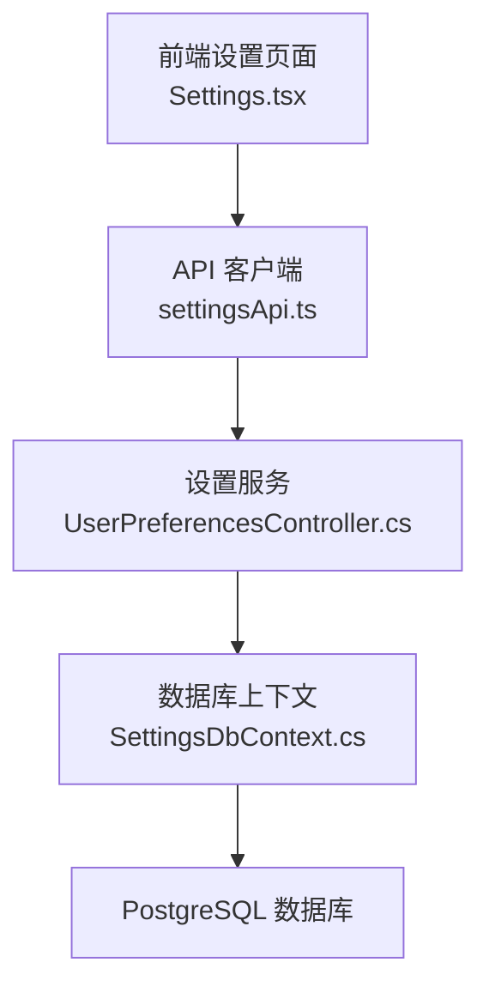
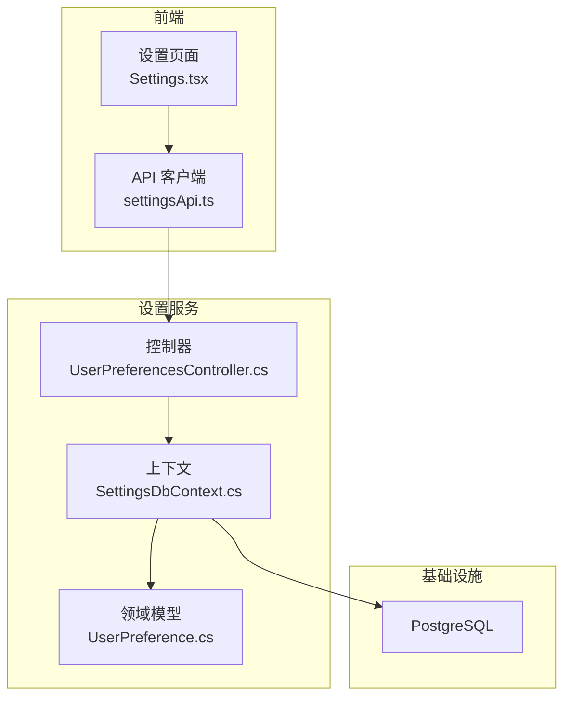
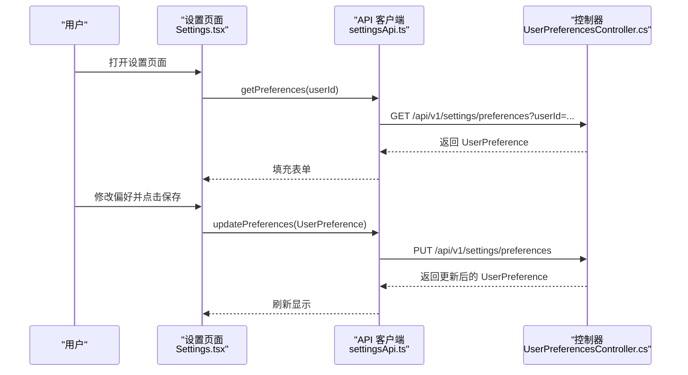
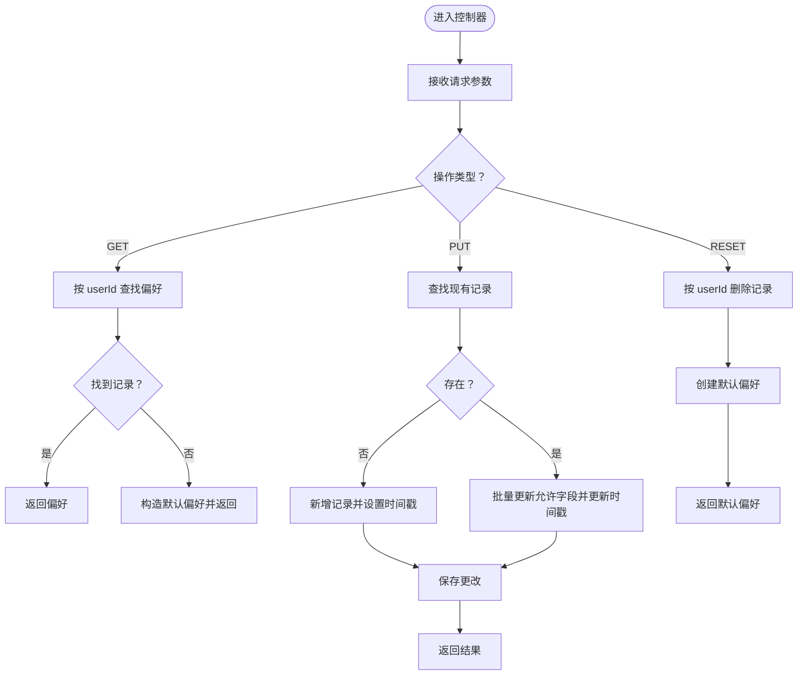
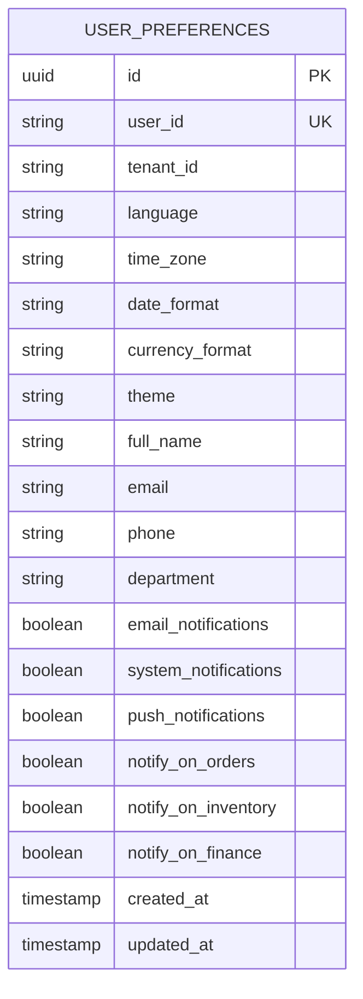
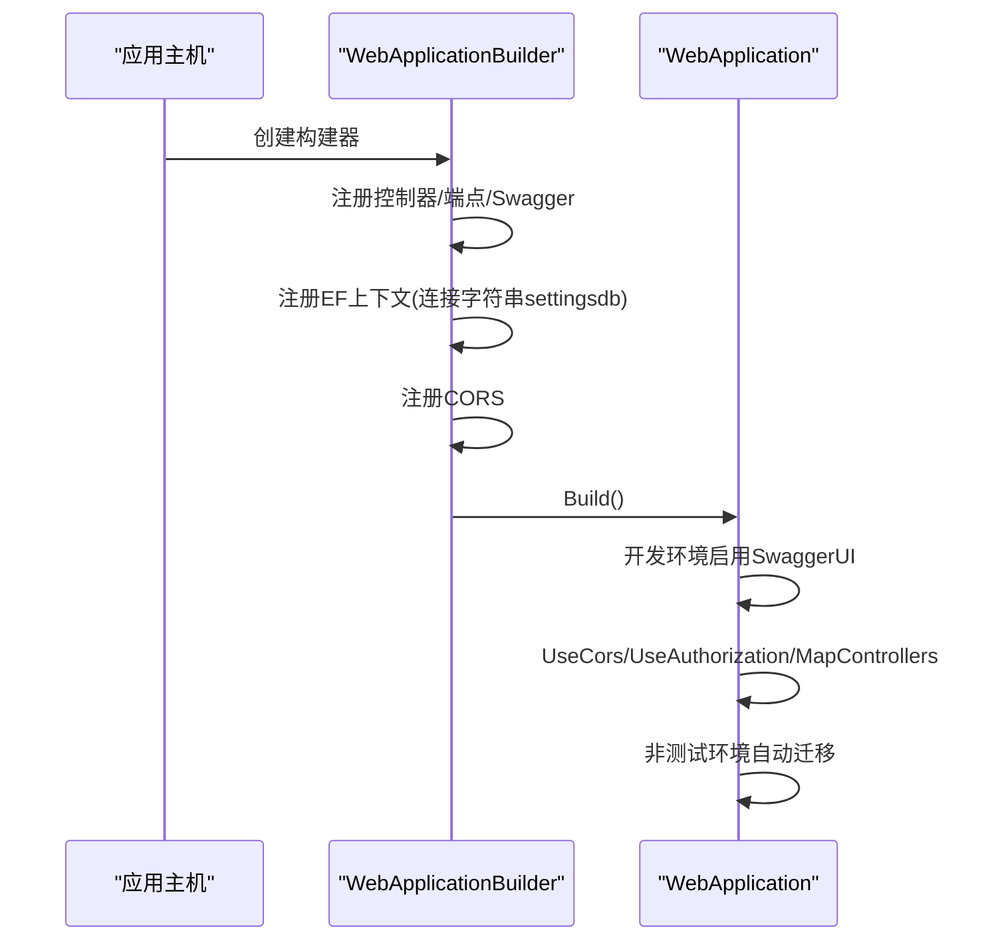
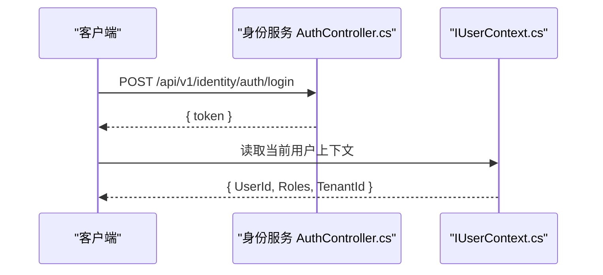
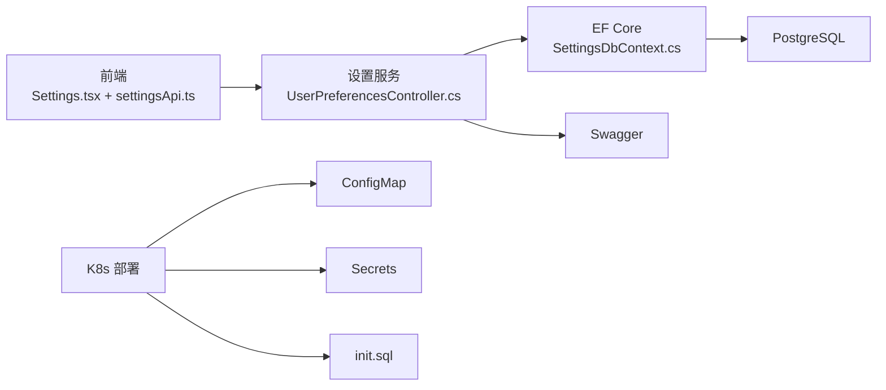

# 设置页面

<cite>
**本文引用的文件**
- [Program.cs](file://src\Services\Settings\ErpSystem.Settings\Program.cs)
- [appsettings.json](file://src\Services\Settings\ErpSystem.Settings\appsettings.json)
- [UserPreferencesController.cs](file://src\Services\Settings\ErpSystem.Settings\Controllers\UserPreferencesController.cs)
- [UserPreference.cs](file://src\Services\Settings\ErpSystem.Settings\Domain\UserPreference.cs)
- [SettingsDbContext.cs](file://src\Services\Settings\ErpSystem.Settings\Infrastructure\SettingsDbContext.cs)
- [ErpSystem.Settings.csproj](file://src\Services\Settings\ErpSystem.Settings\ErpSystem.Settings.csproj)
- [Settings.tsx](file://src\Web\ErpSystem.Web\src\pages\Settings.tsx)
- [settingsApi.ts](file://src\Web\ErpSystem.Web\src\api\settingsApi.ts)
- [AuthController.cs](file://src\Services\Identity\ErpSystem.Identity\API\AuthController.cs)
- [UserAggregate.cs](file://src\Services\Identity\ErpSystem.Identity\Domain\UserAggregate.cs)
- [IUserContext.cs](file://src\BuildingBlocks\ErpSystem.BuildingBlocks\Auth\IUserContext.cs)
- [configmap.yaml](file://deploy\k8s\configmap.yaml)
- [secrets.yaml](file://deploy\k8s\secrets.yaml)
- [init.sql](file://infrastructure\init.sql)
</cite>

## 目录
1. [简介](#简介)
2. [项目结构](#项目结构)
3. [核心组件](#核心组件)
4. [架构总览](#架构总览)
5. [详细组件分析](#详细组件分析)
6. [依赖关系分析](#依赖关系分析)
7. [性能考虑](#性能考虑)
8. [故障排除指南](#故障排除指南)
9. [结论](#结论)
10. [附录](#附录)

## 简介
本文件面向“设置页面”的实现与使用，覆盖以下方面：
- 用户偏好设置：语言、时区、日期格式、货币、主题等显示偏好；个人资料（姓名、邮箱、电话、部门）；通知渠道与业务类通知开关。
- 系统配置：设置服务的连接字符串、CORS、授权与自动迁移策略。
- 权限与安全：当前设置页面支持密码修改与两步验证入口，结合身份服务进行登录与令牌发放。
- 配置管理：前后端交互流程、数据模型、数据库映射与索引约束。
- 运维与部署：Kubernetes 配置、密钥管理与数据库初始化脚本。

## 项目结构
设置页面由三部分组成：
- 前端页面：React 组件，包含“资料”“偏好”“通知”“安全”四个标签页，负责表单渲染与保存。
- API 客户端：封装对后端设置服务的请求方法。
- 后端服务：基于 .NET 的微服务，提供用户偏好的增删改查接口，并持久化到数据库。

图表来源
- [Settings.tsx](file://src\Web\ErpSystem.Web\src\pages\Settings.tsx#L1-L377)
- [settingsApi.ts](file://src\Web\ErpSystem.Web\src\api\settingsApi.ts#L1-L42)
- [UserPreferencesController.cs](file://src\Services\Settings\ErpSystem.Settings\Controllers\UserPreferencesController.cs#L1-L101)
- [SettingsDbContext.cs](file://src\Services\Settings\ErpSystem.Settings\Infrastructure\SettingsDbContext.cs#L1-L33)

章节来源
- [Program.cs](file://src\Services\Settings\ErpSystem.Settings\Program.cs#L1-L50)
- [appsettings.json](file://src\Services\Settings\ErpSystem.Settings\appsettings.json#L1-L12)
- [ErpSystem.Settings.csproj](file://src\Services\Settings\ErpSystem.Settings\ErpSystem.Settings.csproj#L1-L16)

## 核心组件
- 前端设置页面组件：负责加载、编辑与保存用户偏好，包含资料、偏好、通知、安全四个标签页。
- API 客户端：封装 GET/PUT/POST(重置) 请求，统一前缀路径。
- 控制器：提供获取、更新、重置用户偏好的接口。
- 数据模型：UserPreference 映射到数据库实体，包含显示偏好、个人资料、通知开关等字段。
- 数据库上下文：定义实体表映射、索引与字段长度约束。
- 设置服务启动：注册控制器、Swagger、CORS、授权、EF Core 上下文并执行自动迁移。

章节来源
- [Settings.tsx](file://src\Web\ErpSystem.Web\src\pages\Settings.tsx#L1-L377)
- [settingsApi.ts](file://src\Web\ErpSystem.Web\src\api\settingsApi.ts#L1-L42)
- [UserPreferencesController.cs](file://src\Services\Settings\ErpSystem.Settings\Controllers\UserPreferencesController.cs#L1-L101)
- [UserPreference.cs](file://src\Services\Settings\ErpSystem.Settings\Domain\UserPreference.cs#L1-L33)
- [SettingsDbContext.cs](file://src\Services\Settings\ErpSystem.Settings\Infrastructure\SettingsDbContext.cs#L1-L33)
- [Program.cs](file://src\Services\Settings\ErpSystem.Settings\Program.cs#L1-L50)

## 架构总览
设置服务采用典型的三层架构：
- 表现层：ASP.NET Core 控制器暴露 REST 接口。
- 应用层：无显式应用服务层，控制器直接操作仓储（EF Core）。
- 持久层：Entity Framework Core 将实体映射到 PostgreSQL。

图表来源
- [Settings.tsx](file://src\Web\ErpSystem.Web\src\pages\Settings.tsx#L1-L377)
- [settingsApi.ts](file://src\Web\ErpSystem.Web\src\api\settingsApi.ts#L1-L42)
- [UserPreferencesController.cs](file://src\Services\Settings\ErpSystem.Settings\Controllers\UserPreferencesController.cs#L1-L101)
- [SettingsDbContext.cs](file://src\Services\Settings\ErpSystem.Settings\Infrastructure\SettingsDbContext.cs#L1-L33)
- [UserPreference.cs](file://src\Services\Settings\ErpSystem.Settings\Domain\UserPreference.cs#L1-L33)

## 详细组件分析

### 前端设置页面（Settings.tsx）
- 功能点
  - 资料页：编辑姓名、邮箱、电话、部门。
  - 偏好页：语言、时区、日期格式、货币、主题（light/dark/auto）。
  - 通知页：邮件、系统、推送三种通道开关；订单、库存、财务三类业务通知开关。
  - 安全页：密码修改输入框与两步验证按钮（占位，未绑定后端）。
- 数据流
  - 首次加载：调用 API 获取当前偏好并填充表单。
  - 保存：将表单数据提交至后端，成功提示后端返回的新值。
- 交互设计
  - 标签页切换、加载态、保存态禁用按钮、错误提示。

图表来源
- [Settings.tsx](file://src\Web\ErpSystem.Web\src\pages\Settings.tsx#L1-L377)
- [settingsApi.ts](file://src\Web\ErpSystem.Web\src\api\settingsApi.ts#L1-L42)
- [UserPreferencesController.cs](file://src\Services\Settings\ErpSystem.Settings\Controllers\UserPreferencesController.cs#L1-L101)

章节来源
- [Settings.tsx](file://src\Web\ErpSystem.Web\src\pages\Settings.tsx#L1-L377)
- [settingsApi.ts](file://src\Web\ErpSystem.Web\src\api\settingsApi.ts#L1-L42)

### API 客户端（settingsApi.ts）
- 提供三个方法：
  - 获取偏好：GET /api/v1/settings/preferences?userId=...
  - 更新偏好：PUT /api/v1/settings/preferences
  - 重置偏好：POST /api/v1/settings/preferences/reset?userId=...

章节来源
- [settingsApi.ts](file://src\Web\ErpSystem.Web\src\api\settingsApi.ts#L1-L42)

### 控制器（UserPreferencesController.cs）
- 接口
  - GET /api/v1/settings/preferences：按 userId 查询或返回默认偏好。
  - PUT /api/v1/settings/preferences：更新现有偏好或新增偏好。
  - POST /api/v1/settings/preferences/reset：删除现有偏好并返回默认偏好。
- 逻辑要点
  - 默认租户标识与默认用户标识用于演示环境。
  - 更新时仅更新允许字段，时间戳自动更新。
  - 重置时删除旧记录并生成新默认记录。

图表来源
- [UserPreferencesController.cs](file://src\Services\Settings\ErpSystem.Settings\Controllers\UserPreferencesController.cs#L1-L101)

章节来源
- [UserPreferencesController.cs](file://src\Services\Settings\ErpSystem.Settings\Controllers\UserPreferencesController.cs#L1-L101)

### 数据模型与数据库映射（UserPreference.cs、SettingsDbContext.cs）
- 数据模型
  - 字段覆盖显示偏好、个人资料、通知开关及时间戳。
  - 默认值用于首次使用场景。
- 数据库映射
  - 实体表名、主键、唯一索引（UserId）、字段长度限制。
  - 约束确保数据一致性与查询效率。

图表来源
- [UserPreference.cs](file://src\Services\Settings\ErpSystem.Settings\Domain\UserPreference.cs#L1-L33)
- [SettingsDbContext.cs](file://src\Services\Settings\ErpSystem.Settings\Infrastructure\SettingsDbContext.cs#L1-L33)

章节来源
- [UserPreference.cs](file://src\Services\Settings\ErpSystem.Settings\Domain\UserPreference.cs#L1-L33)
- [SettingsDbContext.cs](file://src\Services\Settings\ErpSystem.Settings\Infrastructure\SettingsDbContext.cs#L1-L33)

### 设置服务启动与配置（Program.cs、appsettings.json、.csproj）
- 启动流程
  - 注册控制器、Swagger、CORS、授权。
  - 注册 EF Core 上下文并使用连接字符串。
  - 开发环境启用 Swagger UI。
  - 非测试环境自动迁移（EnsureCreated）。
- 配置
  - 连接字符串名称为 settingsdb，默认指向本地 PostgreSQL。
- 依赖
  - OpenAPI/Swashbuckle、Npgsql EF、Swashbuckle。

图表来源
- [Program.cs](file://src\Services\Settings\ErpSystem.Settings\Program.cs#L1-L50)
- [appsettings.json](file://src\Services\Settings\ErpSystem.Settings\appsettings.json#L1-L12)
- [ErpSystem.Settings.csproj](file://src\Services\Settings\ErpSystem.Settings\ErpSystem.Settings.csproj#L1-L16)

章节来源
- [Program.cs](file://src\Services\Settings\ErpSystem.Settings\Program.cs#L1-L50)
- [appsettings.json](file://src\Services\Settings\ErpSystem.Settings\appsettings.json#L1-L12)
- [ErpSystem.Settings.csproj](file://src\Services\Settings\ErpSystem.Settings\ErpSystem.Settings.csproj#L1-L16)

### 权限与安全（身份服务集成）
- 登录与注册
  - 身份服务提供登录与注册接口，返回令牌。
- 用户上下文
  - IUserContext 提供当前用户标识、租户、角色等信息。
- 设置页面中的安全
  - 当前包含密码修改与两步验证入口，具体实现需在后端完善。

图表来源
- [AuthController.cs](file://src\Services\Identity\ErpSystem.Identity\API\AuthController.cs#L1-L32)
- [IUserContext.cs](file://src\BuildingBlocks\ErpSystem.BuildingBlocks\Auth\IUserContext.cs#L1-L12)

章节来源
- [AuthController.cs](file://src\Services\Identity\ErpSystem.Identity\API\AuthController.cs#L1-L32)
- [IUserContext.cs](file://src\BuildingBlocks\ErpSystem.BuildingBlocks\Auth\IUserContext.cs#L1-L12)

## 依赖关系分析
- 前端依赖
  - 使用 axios 发起 HTTP 请求，统一前缀 /api/v1。
  - 依赖 TypeScript 接口 UserPreference 与后端保持一致。
- 后端依赖
  - ASP.NET Core MVC、EF Core、Npgsql。
  - Swagger 用于接口文档。
- 部署依赖
  - Kubernetes ConfigMap 提供运行时环境变量与服务地址。
  - Secrets 管理敏感信息（如数据库密码、JWT 密钥）。
  - init.sql 初始化数据库。

图表来源
- [settingsApi.ts](file://src\Web\ErpSystem.Web\src\api\settingsApi.ts#L1-L42)
- [UserPreferencesController.cs](file://src\Services\Settings\ErpSystem.Settings\Controllers\UserPreferencesController.cs#L1-L101)
- [SettingsDbContext.cs](file://src\Services\Settings\ErpSystem.Settings\Infrastructure\SettingsDbContext.cs#L1-L33)
- [configmap.yaml](file://deploy\k8s\configmap.yaml#L1-L25)
- [secrets.yaml](file://deploy\k8s\secrets.yaml#L1-L19)
- [init.sql](file://infrastructure\init.sql#L1-L9)

章节来源
- [configmap.yaml](file://deploy\k8s\configmap.yaml#L1-L25)
- [secrets.yaml](file://deploy\k8s\secrets.yaml#L1-L19)
- [init.sql](file://infrastructure\init.sql#L1-L9)

## 性能考虑
- 数据库层面
  - 对 UserId 建有唯一索引，保证查询与去重效率。
  - 字段长度限制减少存储冗余。
- API 层面
  - 控制器直接使用 EF 查询，避免不必要的序列化/反序列化。
  - 建议在生产环境开启连接池与只读查询优化。
- 前端层面
  - 表单变更时局部更新状态，减少重渲染。
  - 保存时禁用按钮，避免重复提交。

## 故障排除指南
- 无法连接数据库
  - 检查连接字符串名称与值是否正确（settingsdb）。
  - 确认 PostgreSQL 服务可达且凭据有效。
- Swagger 不可用
  - 确认开发环境已启用 Swagger UI。
- 自动迁移失败
  - 非测试环境会尝试 EnsureCreated，检查数据库权限与网络。
- 前端保存失败
  - 查看浏览器控制台与网络面板，确认 API 返回状态码与错误信息。
  - 确保后端已启用 CORS 并允许来自前端的跨域请求。

章节来源
- [Program.cs](file://src\Services\Settings\ErpSystem.Settings\Program.cs#L1-L50)
- [appsettings.json](file://src\Services\Settings\ErpSystem.Settings\appsettings.json#L1-L12)

## 结论
设置页面通过清晰的前后端职责划分与简洁的数据模型，实现了用户偏好的集中管理。后端服务提供了完善的 CRUD 能力与基础的安全与运维能力。建议后续增强：
- 后端完善安全页功能（密码修改、两步验证）。
- 引入配置验证与生效策略（如灰度发布、热更新）。
- 在身份服务中增加角色与权限管理的完整实现，以支撑更细粒度的访问控制。

## 附录
- 部署与运维
  - 使用 ConfigMap 管理非敏感配置，Secrets 管理敏感配置。
  - init.sql 用于初始化多数据库实例。
- 参考接口
  - GET /api/v1/settings/preferences?userId=...
  - PUT /api/v1/settings/preferences
  - POST /api/v1/settings/preferences/reset?userId=...

章节来源
- [configmap.yaml](file://deploy\k8s\configmap.yaml#L1-L25)
- [secrets.yaml](file://deploy\k8s\secrets.yaml#L1-L19)
- [init.sql](file://infrastructure\init.sql#L1-L9)
- [UserPreferencesController.cs](file://src\Services\Settings\ErpSystem.Settings\Controllers\UserPreferencesController.cs#L1-L101)