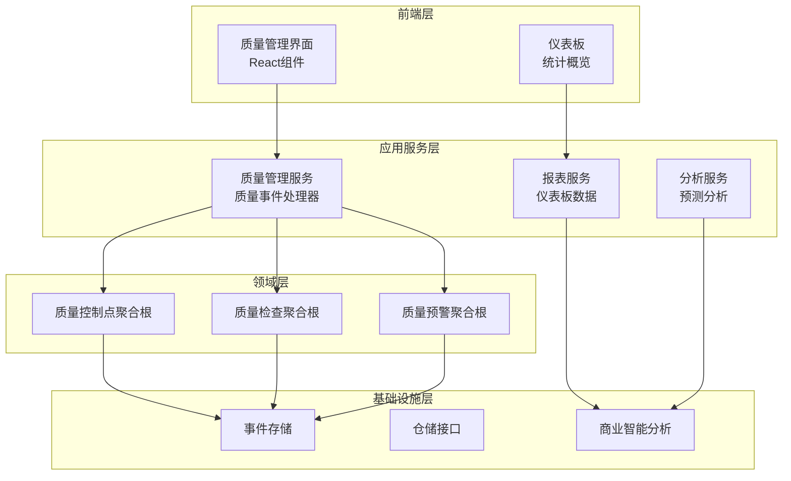
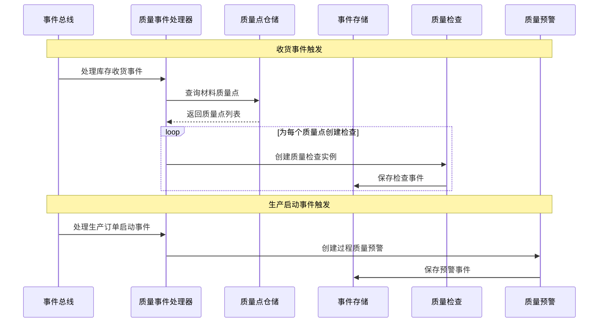
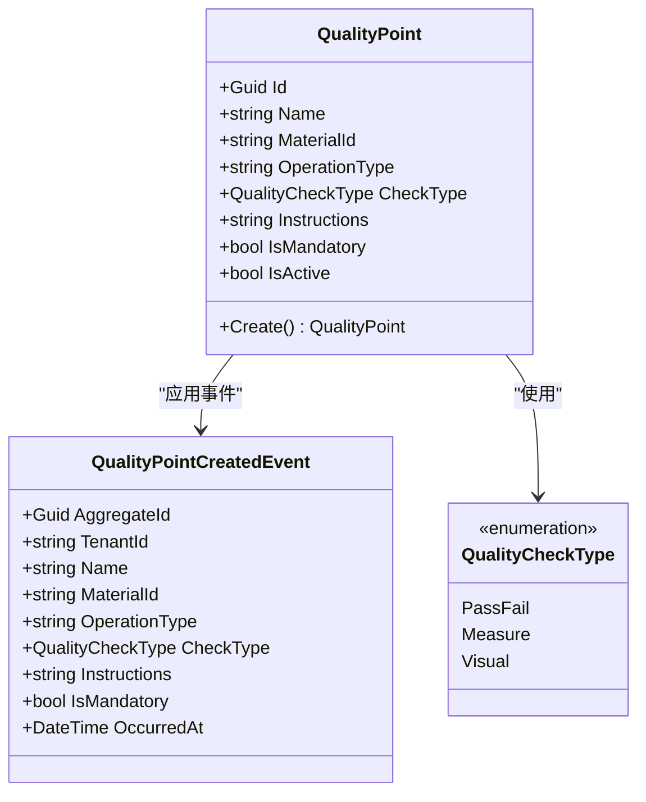
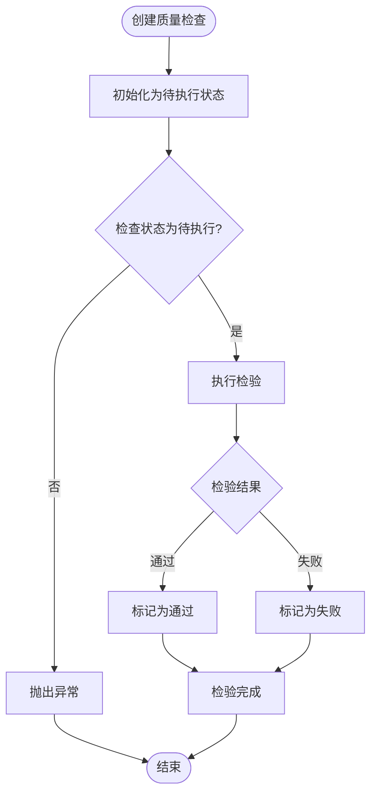
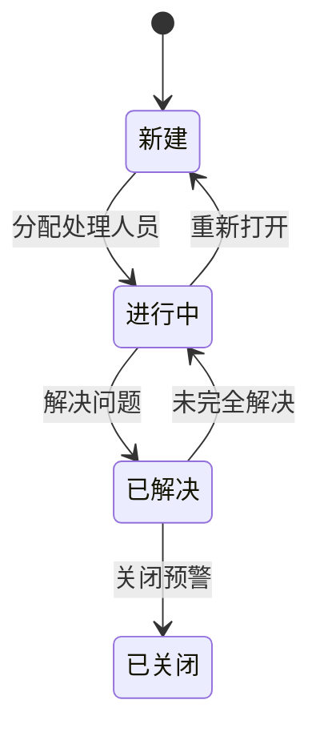
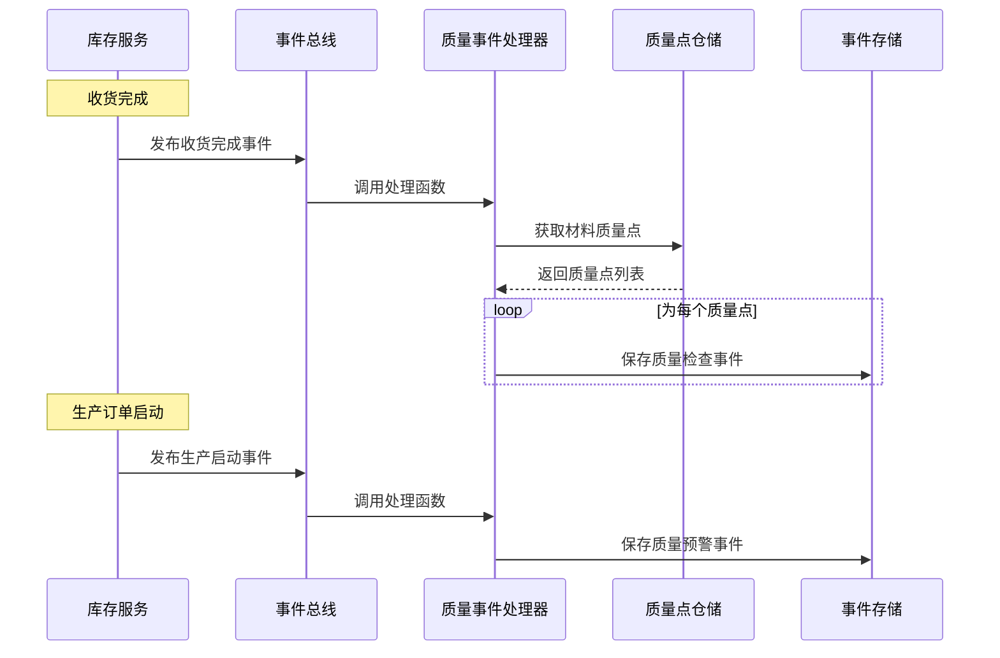
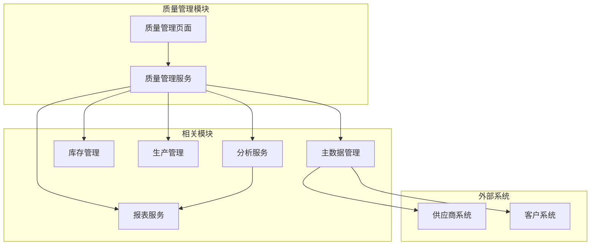

# 质量管理页面

<cite>
**本文档引用的文件**
- [Quality.tsx](file://src/Web/ErpSystem.Web/src/pages/Quality.tsx)
- [QualityCheckAggregate.cs](file://src/Services/Quality/ErpSystem.Quality/Domain/QualityCheckAggregate.cs)
- [QualityAlertAggregate.cs](file://src/Services/Quality/ErpSystem.Quality/Domain/QualityAlertAggregate.cs)
- [QualityPointAggregate.cs](file://src/Services/Quality/ErpSystem.Quality/Domain/QualityPointAggregate.cs)
- [QualityEventHandlers.cs](file://src/Services/Quality/ErpSystem.Quality/Application/QualityEventHandlers.cs)
- [QualityWorkflowTests.cs](file://src/Tests/ErpSystem.IntegrationTests/Quality/QualityWorkflowTests.cs)
- [SupplierAggregate.cs](file://src/Services/MasterData/ErpSystem.MasterData/Domain/SupplierAggregate.cs)
- [PRD-01-MasterData-Service.md](file://docs/PRD-01-MasterData-Service.md)
- [ITERATION-03-COMPLETED.md](file://docs/ITERATION-03-COMPLETED.md)
- [Dashboard.tsx](file://src/Web/ErpSystem.Web/src/pages/Dashboard.tsx)
- [DashboardService.cs](file://src/Services/Reporting/ErpSystem.Reporting/Application/DashboardService.cs)
- [DashboardController.cs](file://src/Services/Reporting/ErpSystem.Reporting/Controllers/DashboardController.cs)
- [DashboardsController.cs](file://src/Services/Analytics/ErpSystem.Analytics/API/DashboardsController.cs)
- [BiAnalyticsService.cs](file://src/Services/Analytics/ErpSystem.Analytics/Infrastructure/BiAnalyticsService.cs)
- [ForecastingAppService.cs](file://src/Services/Analytics/ErpSystem.Analytics/Application/ForecastingAppService.cs)
- [DemandForecastEngine.cs](file://src/Services/Analytics/ErpSystem.Analytics/Infrastructure/DemandForecastEngine.cs)
</cite>

## 目录
1. [简介](#简介)
2. [项目结构](#项目结构)
3. [核心组件](#核心组件)
4. [架构概览](#架构概览)
5. [详细组件分析](#详细组件分析)
6. [依赖关系分析](#依赖关系分析)
7. [性能考虑](#性能考虑)
8. [故障排除指南](#故障排除指南)
9. [结论](#结论)
10. [附录](#附录)

## 简介
质量管理页面是ERP系统中的关键模块，负责实现质量检验、缺陷管理、质量分析和质量改进等功能。该页面基于事件驱动的领域驱动设计(DDD)架构，通过质量控制点(Quality Points)定义检验要求，自动触发质量检查，并提供质量预警和分析功能。

系统实现了完整的质量数字化管理流程，包括检验标准配置、抽样计划执行和质量评估分析。通过与供应商管理和客户投诉处理的集成，建立了全面的质量管理体系。

## 项目结构
质量管理页面采用分层架构设计，包含前端界面、后端服务和数据分析三个主要层次：

**图表来源**
- [Quality.tsx](file://src/Web/ErpSystem.Web/src/pages/Quality.tsx#L1-L154)
- [QualityEventHandlers.cs](file://src/Services/Quality/ErpSystem.Quality/Application/QualityEventHandlers.cs#L1-L95)
- [QualityCheckAggregate.cs](file://src/Services/Quality/ErpSystem.Quality/Domain/QualityCheckAggregate.cs#L1-L116)

**章节来源**
- [Quality.tsx](file://src/Web/ErpSystem.Web/src/pages/Quality.tsx#L1-L154)
- [QualityEventHandlers.cs](file://src/Services/Quality/ErpSystem.Quality/Application/QualityEventHandlers.cs#L1-L95)

## 核心组件
质量管理页面的核心组件包括质量控制点、质量检查和质量预警三大聚合根，以及相应的事件处理器和仓储接口。

### 质量控制点(QualityPoint)
质量控制点是质量检验的标准和规范，定义了特定操作或材料的检验要求。每个质量控制点包含名称、材料标识、操作类型、检验类型、检验说明和强制性等属性。

### 质量检查(QualityCheck)
质量检查是针对具体业务场景的检验实例，关联到特定的质量控制点。检查状态包括待执行、通过和失败三种状态，支持通过和失败两种结果。

### 质量预警(QualityAlert)
质量预警用于检测和跟踪质量问题，支持优先级管理和状态流转。预警状态包括新建、进行中、已解决和已关闭四个阶段。

**章节来源**
- [QualityPointAggregate.cs](file://src/Services/Quality/ErpSystem.Quality/Domain/QualityPointAggregate.cs#L1-L81)
- [QualityCheckAggregate.cs](file://src/Services/Quality/ErpSystem.Quality/Domain/QualityCheckAggregate.cs#L1-L116)
- [QualityAlertAggregate.cs](file://src/Services/Quality/ErpSystem.Quality/Domain/QualityAlertAggregate.cs#L1-L118)

## 架构概览
质量管理页面采用事件驱动的微服务架构，实现了质量流程的完全数字化管理：

**图表来源**
- [QualityEventHandlers.cs](file://src/Services/Quality/ErpSystem.Quality/Application/QualityEventHandlers.cs#L18-L73)
- [QualityCheckAggregate.cs](file://src/Services/Quality/ErpSystem.Quality/Domain/QualityCheckAggregate.cs#L18-L36)
- [QualityAlertAggregate.cs](file://src/Services/Quality/ErpSystem.Quality/Domain/QualityAlertAggregate.cs#L18-L36)

系统通过集成事件触发质量检查，实现了以下质量流程：

1. **自动触发机制**：当库存收货或生产订单启动时，系统自动创建相应的质量检查
2. **质量点配置**：支持按材料和操作类型配置强制性质量检查点
3. **状态管理**：完整的质量检查状态流转和结果记录
4. **预警处理**：质量问题的及时发现和跟踪处理

**章节来源**
- [QualityEventHandlers.cs](file://src/Services/Quality/ErpSystem.Quality/Application/QualityEventHandlers.cs#L1-L95)

## 详细组件分析

### 质量控制点聚合分析
质量控制点是质量管理的基础配置单元，通过领域事件模式实现状态变更：

**图表来源**
- [QualityPointAggregate.cs](file://src/Services/Quality/ErpSystem.Quality/Domain/QualityPointAggregate.cs#L8-L58)
- [QualityPointAggregate.cs](file://src/Services/Quality/ErpSystem.Quality/Domain/QualityPointAggregate.cs#L60-L65)

质量控制点的关键特性：
- **可配置性**：支持按材料和操作类型灵活配置
- **强制性**：可设置为强制性质量检查点
- **类型多样性**：支持通过/失败、测量和目视检查类型
- **状态管理**：激活状态控制质量点的有效性

**章节来源**
- [QualityPointAggregate.cs](file://src/Services/Quality/ErpSystem.Quality/Domain/QualityPointAggregate.cs#L1-L81)

### 质量检查聚合分析
质量检查是具体的检验执行实例，实现了严格的业务规则验证：

**图表来源**
- [QualityCheckAggregate.cs](file://src/Services/Quality/ErpSystem.Quality/Domain/QualityCheckAggregate.cs#L38-L52)

质量检查的业务逻辑：
- **状态约束**：只有待执行状态的检查才能进行通过/失败操作
- **结果记录**：支持通过时记录备注，失败时记录原因
- **事件驱动**：所有状态变更通过领域事件实现

**章节来源**
- [QualityCheckAggregate.cs](file://src/Services/Quality/ErpSystem.Quality/Domain/QualityCheckAggregate.cs#L1-L116)

### 质量预警聚合分析
质量预警提供了完整的质量问题跟踪机制：

**图表来源**
- [QualityAlertAggregate.cs](file://src/Services/Quality/ErpSystem.Quality/Domain/QualityAlertAggregate.cs#L38-L46)
- [QualityAlertAggregate.cs](file://src/Services/Quality/ErpSystem.Quality/Domain/QualityAlertAggregate.cs#L80-L86)

质量预警的管理流程：
- **优先级管理**：支持低、中、高、紧急四个优先级级别
- **状态流转**：完整的预警生命周期管理
- **责任分配**：支持指定处理责任人
- **解决方案记录**：详细记录问题解决过程

**章节来源**
- [QualityAlertAggregate.cs](file://src/Services/Quality/ErpSystem.Quality/Domain/QualityAlertAggregate.cs#L1-L118)

### 质量事件处理器分析
质量事件处理器实现了系统间事件的协调和质量检查的自动生成：

**图表来源**
- [QualityEventHandlers.cs](file://src/Services/Quality/ErpSystem.Quality/Application/QualityEventHandlers.cs#L18-L73)

事件处理器的核心功能：
- **自动触发**：基于系统事件自动创建质量检查
- **材料匹配**：根据材料ID和操作类型查找对应的质量点
- **批量处理**：支持多个质量点的批量创建
- **日志记录**：完整的操作日志和调试信息

**章节来源**
- [QualityEventHandlers.cs](file://src/Services/Quality/ErpSystem.Quality/Application/QualityEventHandlers.cs#L1-L95)

## 依赖关系分析
质量管理页面与其他系统模块存在紧密的依赖关系：

**图表来源**
- [Quality.tsx](file://src/Web/ErpSystem.Web/src/pages/Quality.tsx#L1-L154)
- [QualityEventHandlers.cs](file://src/Services/Quality/ErpSystem.Quality/Application/QualityEventHandlers.cs#L1-L95)

主要依赖关系：
- **主数据依赖**：依赖供应商和客户信息进行质量评估
- **业务流程集成**：与库存收货和生产启动流程深度集成
- **分析服务支持**：与预测分析和商业智能服务协作
- **报表数据源**：为仪表板提供质量指标数据

**章节来源**
- [SupplierAggregate.cs](file://src/Services/MasterData/ErpSystem.MasterData/Domain/SupplierAggregate.cs#L66-L124)
- [PRD-01-MasterData-Service.md](file://docs/PRD-01-MasterData-Service.md#L492-L526)

## 性能考虑
质量管理页面在设计时充分考虑了性能优化和扩展性：

### 事件存储优化
- **异步处理**：质量检查创建采用异步方式，避免阻塞主业务流程
- **批量操作**：支持多个质量点的批量创建和处理
- **事件压缩**：通过事件溯源减少数据冗余

### 查询性能优化
- **索引策略**：对常用查询字段建立数据库索引
- **缓存机制**：质量点配置信息采用缓存策略
- **分页查询**：大量数据的分页展示和加载

### 扩展性设计
- **微服务架构**：质量服务独立部署，便于水平扩展
- **消息队列**：通过事件总线实现松耦合通信
- **负载均衡**：支持多实例部署和流量分发

## 故障排除指南
质量管理页面可能遇到的问题及解决方案：

### 常见问题诊断
1. **质量检查无法创建**
   - 检查质量点是否正确配置
   - 验证材料ID和操作类型的匹配关系
   - 确认事件存储服务正常运行

2. **质量预警状态异常**
   - 检查预警分配和解决流程
   - 验证状态转换的业务规则
   - 查看事件日志的错误信息

3. **集成事件处理失败**
   - 检查事件总线连接状态
   - 验证事件处理器的依赖注入
   - 确认仓储接口的实现正确性

### 调试工具和方法
- **日志分析**：通过结构化日志追踪事件处理流程
- **性能监控**：监控事件处理延迟和吞吐量
- **断点调试**：在开发环境中设置断点调试业务逻辑

**章节来源**
- [QualityWorkflowTests.cs](file://src/Tests/ErpSystem.IntegrationTests/Quality/QualityWorkflowTests.cs#L1-L75)

## 结论
质量管理页面实现了完整的质量数字化管理体系，通过事件驱动的设计模式和领域驱动的架构，提供了强大的质量检验、缺陷管理和质量分析功能。

系统的主要优势包括：
- **自动化程度高**：通过集成事件自动触发质量检查
- **配置灵活**：支持按材料和操作类型定制质量点
- **流程完整**：从检验到预警再到改进的全流程管理
- **数据驱动**：基于事件存储的质量数据分析和趋势监控

未来可以进一步优化的方向：
- 增强机器学习算法进行质量预测
- 扩展移动端质量检查功能
- 集成更多供应商质量评估指标
- 提供更丰富的质量报告和仪表板

## 附录

### 质量指标计算方法
系统支持以下关键质量指标的计算和监控：

1. **质量分数计算**
   - 计算公式：通过的检查数量 / 总检查数量 × 100%
   - 数据来源：质量检查事件的历史记录

2. **平均检查时间**
   - 计算公式：总检查时间 / 检查次数
   - 统计维度：按材料、操作类型、检查员分类统计

3. **缺陷率统计**
   - 计算公式：缺陷批次数量 / 总检验批次数量 × 100%
   - 趋势分析：按时间维度的缺陷率变化趋势

### 供应商质量管理集成
系统与供应商管理模块的集成要点：
- **供应商等级评估**：基于质量表现的供应商等级调整
- **质量绩效监控**：实时监控供应商来料质量状况
- **黑名单管理**：质量不达标的供应商自动纳入黑名单

### 质量改进项目跟踪
系统支持质量改进项目的全生命周期管理：
- **问题识别**：通过质量预警和分析报告识别改进机会
- **改进计划**：制定具体的质量改进措施和时间表
- **效果评估**：跟踪改进措施的实施效果和持续改进

**章节来源**
- [ITERATION-03-COMPLETED.md](file://docs/ITERATION-03-COMPLETED.md#L13-L26)
- [PRD-01-MasterData-Service.md](file://docs/PRD-01-MasterData-Service.md#L608-L622)