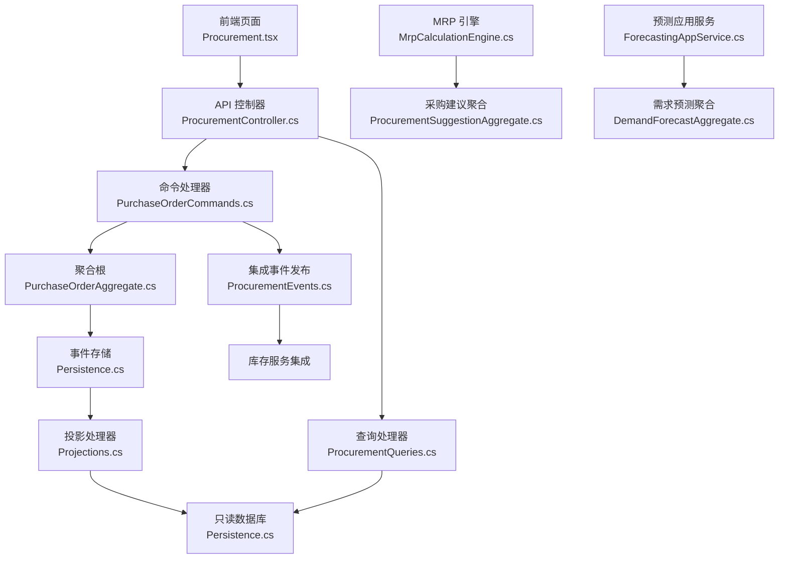
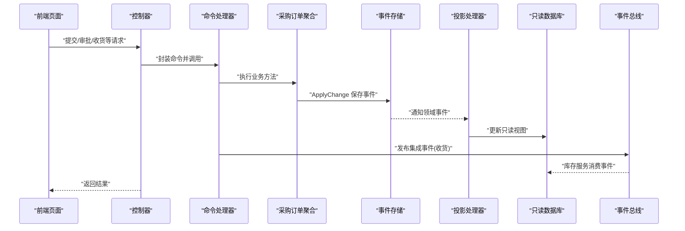
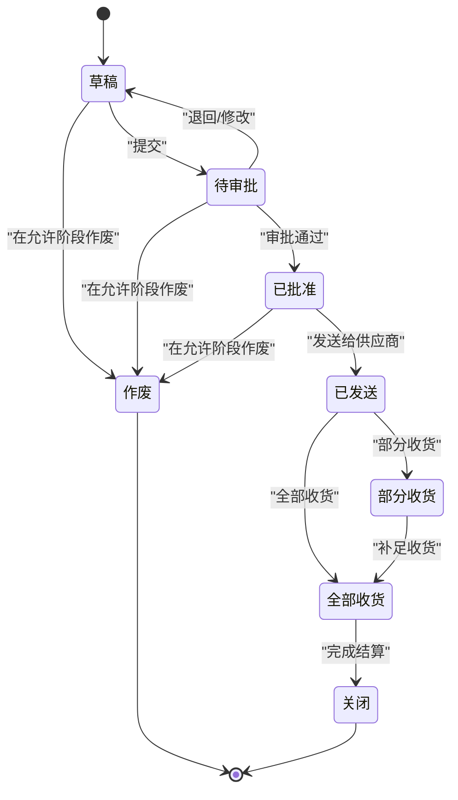
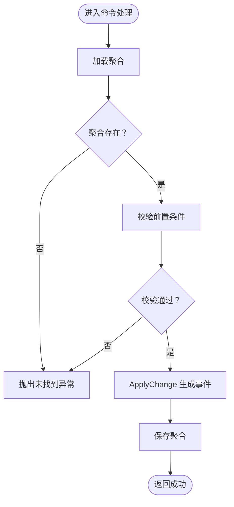
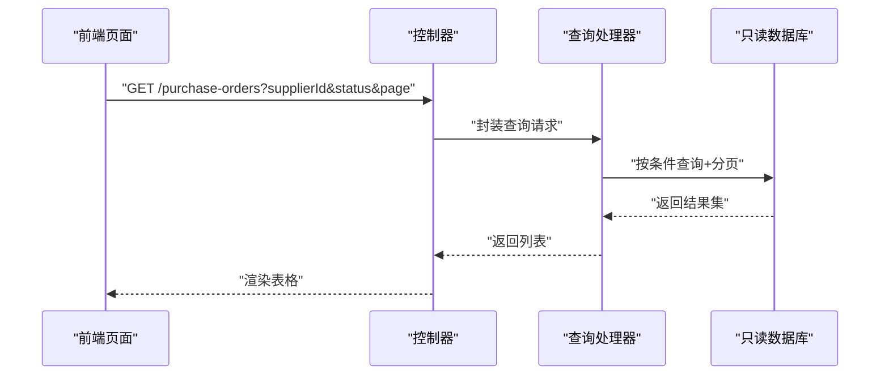
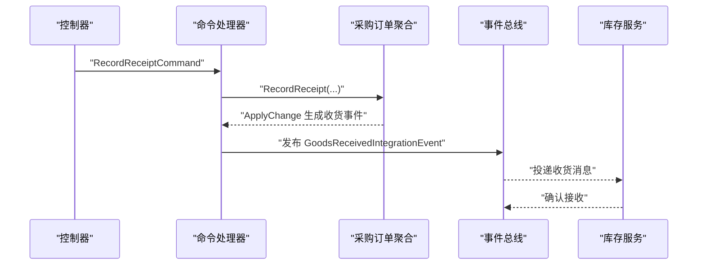
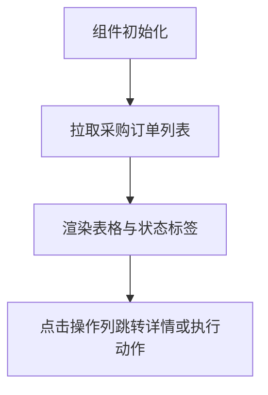
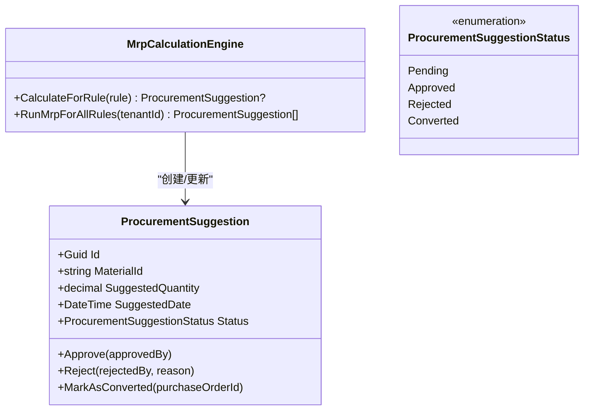
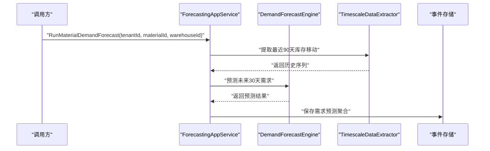
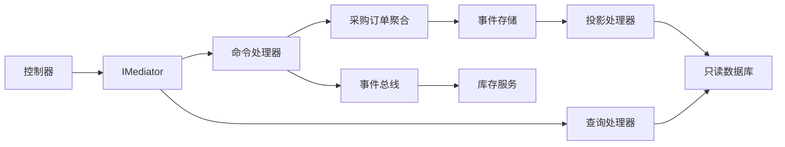

# 采购管理页面

<cite>
**本文引用的文件**
- [Program.cs](file://src/Services/Procurement/ErpSystem.Procurement/Program.cs)
- [ProcurementController.cs](file://src/Services/Procurement/ErpSystem.Procurement/API/ProcurementController.cs)
- [PurchaseOrderCommands.cs](file://src/Services/Procurement/ErpSystem.Procurement/Application/PurchaseOrderCommands.cs)
- [ProcurementQueries.cs](file://src/Services/Procurement/ErpSystem.Procurement/Application/ProcurementQueries.cs)
- [PurchaseOrderAggregate.cs](file://src/Services/Procurement/ErpSystem.Procurement/Domain/PurchaseOrderAggregate.cs)
- [ProcurementEvents.cs](file://src/Services/Procurement/ErpSystem.Procurement/Domain/ProcurementEvents.cs)
- [Persistence.cs](file://src/Services/Procurement/ErpSystem.Procurement/Infrastructure/Persistence.cs)
- [Projections.cs](file://src/Services/Procurement/ErpSystem.Procurement/Infrastructure/Projections.cs)
- [Procurement.tsx](file://src/Web/ErpSystem.Web/src/pages/Procurement.tsx)
- [MrpCalculationEngine.cs](file://src/Services/Mrp/ErpSystem.Mrp/Application/MrpCalculationEngine.cs)
- [ProcurementSuggestionAggregate.cs](file://src/Services/Mrp/ErpSystem.Mrp/Domain/ProcurementSuggestionAggregate.cs)
- [ForecastingAppService.cs](file://src/Services/Analytics/ErpSystem.Analytics/Application/ForecastingAppService.cs)
- [DemandForecastAggregate.cs](file://src/Services/Analytics/ErpSystem.Analytics/Domain/DemandForecastAggregate.cs)
- [PRD-01-MasterData-Service.md](file://docs/PRD-01-MasterData-Service.md)
</cite>

## 目录
1. [简介](#简介)
2. [项目结构](#项目结构)
3. [核心组件](#核心组件)
4. [架构总览](#架构总览)
5. [详细组件分析](#详细组件分析)
6. [依赖关系分析](#依赖关系分析)
7. [性能考虑](#性能考虑)
8. [故障排除指南](#故障排除指南)
9. [结论](#结论)
10. [附录](#附录)

## 简介
本文件面向“采购管理页面”的实现与使用，系统性梳理采购申请、采购订单、收货管理、供应商评估等模块的架构设计与数据流，并对采购流程的状态跟踪、审批流程、异常处理进行可视化说明；同时覆盖采购数据分析、供应商绩效评估与采购成本控制的实现思路，以及采购合同管理、价格比较与采购预测的扩展建议。最后提供流程自动化、风险控制与合规性检查的落地方案。

## 项目结构
采购管理页面由前端页面与后端微服务共同组成：
- 前端页面：位于 Web 工程的 Procurement 页面，负责展示采购订单列表与基本交互。
- 后端服务：Procurement 微服务提供采购订单生命周期管理、收货记录、价格历史查询；MRP 微服务生成采购建议；Analytics 微服务提供需求预测能力；MasterData 文档定义供应商评估与黑名单规则。

图表来源
- [Procurement.tsx](file://src/Web/ErpSystem.Web/src/pages/Procurement.tsx#L1-L85)
- [ProcurementController.cs](file://src/Services/Procurement/ErpSystem.Procurement/API/ProcurementController.cs#L1-L62)
- [PurchaseOrderCommands.cs](file://src/Services/Procurement/ErpSystem.Procurement/Application/PurchaseOrderCommands.cs#L1-L117)
- [PurchaseOrderAggregate.cs](file://src/Services/Procurement/ErpSystem.Procurement/Domain/PurchaseOrderAggregate.cs#L1-L199)
- [Persistence.cs](file://src/Services/Procurement/ErpSystem.Procurement/Infrastructure/Persistence.cs#L1-L66)
- [Projections.cs](file://src/Services/Procurement/ErpSystem.Procurement/Infrastructure/Projections.cs#L1-L118)
- [ProcurementQueries.cs](file://src/Services/Procurement/ErpSystem.Procurement/Application/ProcurementQueries.cs#L1-L44)
- [ProcurementEvents.cs](file://src/Services/Procurement/ErpSystem.Procurement/Domain/ProcurementEvents.cs#L1-L21)
- [MrpCalculationEngine.cs](file://src/Services/Mrp/ErpSystem.Mrp/Application/MrpCalculationEngine.cs#L1-L160)
- [ProcurementSuggestionAggregate.cs](file://src/Services/Mrp/ErpSystem.Mrp/Domain/ProcurementSuggestionAggregate.cs#L1-L170)
- [ForecastingAppService.cs](file://src/Services/Analytics/ErpSystem.Analytics/Application/ForecastingAppService.cs#L1-L42)
- [DemandForecastAggregate.cs](file://src/Services/Analytics/ErpSystem.Analytics/Domain/DemandForecastAggregate.cs#L1-L69)

章节来源
- [Program.cs](file://src/Services/Procurement/ErpSystem.Procurement/Program.cs#L1-L72)
- [ProcurementController.cs](file://src/Services/Procurement/ErpSystem.Procurement/API/ProcurementController.cs#L1-L62)
- [Procurement.tsx](file://src/Web/ErpSystem.Web/src/pages/Procurement.tsx#L1-L85)

## 核心组件
- 采购订单聚合与状态机：定义采购订单生命周期与状态流转，包含草稿、待审批、已批准、已发送、部分/全部收货、关闭、作废等状态。
- 命令处理器：封装创建、提交、审批、发送、收货、关闭、作废等业务操作，统一校验前置条件并持久化事件。
- 查询层：提供按供应商、状态、分页查询采购订单，以及价格历史查询。
- 投影层：将领域事件转换为只读视图，维护采购订单与收货单的读模型。
- 集成事件：收货完成后向库存服务发布集成事件，触发后续库存更新。
- 前端页面：展示采购订单列表，预留创建入口。

章节来源
- [PurchaseOrderAggregate.cs](file://src/Services/Procurement/ErpSystem.Procurement/Domain/PurchaseOrderAggregate.cs#L1-L199)
- [PurchaseOrderCommands.cs](file://src/Services/Procurement/ErpSystem.Procurement/Application/PurchaseOrderCommands.cs#L1-L117)
- [ProcurementQueries.cs](file://src/Services/Procurement/ErpSystem.Procurement/Application/ProcurementQueries.cs#L1-L44)
- [Projections.cs](file://src/Services/Procurement/ErpSystem.Procurement/Infrastructure/Projections.cs#L1-L118)
- [ProcurementEvents.cs](file://src/Services/Procurement/ErpSystem.Procurement/Domain/ProcurementEvents.cs#L1-L21)
- [Procurement.tsx](file://src/Web/ErpSystem.Web/src/pages/Procurement.tsx#L1-L85)

## 架构总览
采购管理采用事件驱动架构与CQRS分离读写模型：
- 写模型：通过命令处理器产生领域事件，事件存储保存事件流，投影处理器同步到只读数据库。
- 读模型：查询处理器从只读数据库返回JSONB序列化的明细，便于前端渲染。
- 集成：收货事件发布到事件总线，供库存服务订阅消费。

图表来源
- [ProcurementController.cs](file://src/Services/Procurement/ErpSystem.Procurement/API/ProcurementController.cs#L1-L62)
- [PurchaseOrderCommands.cs](file://src/Services/Procurement/ErpSystem.Procurement/Application/PurchaseOrderCommands.cs#L1-L117)
- [PurchaseOrderAggregate.cs](file://src/Services/Procurement/ErpSystem.Procurement/Domain/PurchaseOrderAggregate.cs#L1-L199)
- [Persistence.cs](file://src/Services/Procurement/ErpSystem.Procurement/Infrastructure/Persistence.cs#L1-L66)
- [Projections.cs](file://src/Services/Procurement/ErpSystem.Procurement/Infrastructure/Projections.cs#L1-L118)
- [ProcurementEvents.cs](file://src/Services/Procurement/ErpSystem.Procurement/Domain/ProcurementEvents.cs#L1-L21)

## 详细组件分析

### 采购订单状态机与流程
采购订单状态机覆盖从创建到收货完成的关键节点，确保业务合规与可追溯。

图表来源
- [PurchaseOrderAggregate.cs](file://src/Services/Procurement/ErpSystem.Procurement/Domain/PurchaseOrderAggregate.cs#L5-L15)
- [PurchaseOrderAggregate.cs](file://src/Services/Procurement/ErpSystem.Procurement/Domain/PurchaseOrderAggregate.cs#L109-L156)

章节来源
- [PurchaseOrderAggregate.cs](file://src/Services/Procurement/ErpSystem.Procurement/Domain/PurchaseOrderAggregate.cs#L1-L199)

### 命令处理与异常控制
命令处理器对每个关键动作进行前置校验，如状态合法性、行号存在性、已收货数量限制等，失败时抛出明确异常，保证数据一致性。

图表来源
- [PurchaseOrderCommands.cs](file://src/Services/Procurement/ErpSystem.Procurement/Application/PurchaseOrderCommands.cs#L36-L115)
- [PurchaseOrderAggregate.cs](file://src/Services/Procurement/ErpSystem.Procurement/Domain/PurchaseOrderAggregate.cs#L109-L156)

章节来源
- [PurchaseOrderCommands.cs](file://src/Services/Procurement/ErpSystem.Procurement/Application/PurchaseOrderCommands.cs#L1-L117)

### 读模型与价格历史查询
查询处理器基于只读数据库提供搜索、详情与价格历史查询，支持按供应商与状态过滤、分页排序。

图表来源
- [ProcurementController.cs](file://src/Services/Procurement/ErpSystem.Procurement/API/ProcurementController.cs#L14-L17)
- [ProcurementQueries.cs](file://src/Services/Procurement/ErpSystem.Procurement/Application/ProcurementQueries.cs#L23-L33)
- [Persistence.cs](file://src/Services/Procurement/ErpSystem.Procurement/Infrastructure/Persistence.cs#L20-L31)

章节来源
- [ProcurementQueries.cs](file://src/Services/Procurement/ErpSystem.Procurement/Application/ProcurementQueries.cs#L1-L44)
- [Persistence.cs](file://src/Services/Procurement/ErpSystem.Procurement/Infrastructure/Persistence.cs#L1-L66)

### 收货流程与库存集成
收货流程在验证行号合法后更新订单明细与状态，并发布“货物已收”集成事件，驱动库存服务入账。

图表来源
- [ProcurementController.cs](file://src/Services/Procurement/ErpSystem.Procurement/API/ProcurementController.cs#L59-L61)
- [PurchaseOrderCommands.cs](file://src/Services/Procurement/ErpSystem.Procurement/Application/PurchaseOrderCommands.cs#L72-L97)
- [ProcurementEvents.cs](file://src/Services/Procurement/ErpSystem.Procurement/Domain/ProcurementEvents.cs#L7-L19)
- [Projections.cs](file://src/Services/Procurement/ErpSystem.Procurement/Infrastructure/Projections.cs#L69-L104)

章节来源
- [PurchaseOrderCommands.cs](file://src/Services/Procurement/ErpSystem.Procurement/Application/PurchaseOrderCommands.cs#L1-L117)
- [ProcurementEvents.cs](file://src/Services/Procurement/ErpSystem.Procurement/Domain/ProcurementEvents.cs#L1-L21)
- [Projections.cs](file://src/Services/Procurement/ErpSystem.Procurement/Infrastructure/Projections.cs#L1-L118)

### 前端采购页面
前端页面负责展示采购订单列表，包含编号、供应商、日期、金额与状态列，提供创建按钮入口。

图表来源
- [Procurement.tsx](file://src/Web/ErpSystem.Web/src/pages/Procurement.tsx#L14-L85)

章节来源
- [Procurement.tsx](file://src/Web/ErpSystem.Web/src/pages/Procurement.tsx#L1-L85)

### 采购建议与MRP集成
MRP引擎根据库存、在途与预测计算是否需要补货，生成采购建议聚合；建议被批准后可直接转化为采购订单。

图表来源
- [MrpCalculationEngine.cs](file://src/Services/Mrp/ErpSystem.Mrp/Application/MrpCalculationEngine.cs#L1-L160)
- [ProcurementSuggestionAggregate.cs](file://src/Services/Mrp/ErpSystem.Mrp/Domain/ProcurementSuggestionAggregate.cs#L1-L170)

章节来源
- [MrpCalculationEngine.cs](file://src/Services/Mrp/ErpSystem.Mrp/Application/MrpCalculationEngine.cs#L1-L160)
- [ProcurementSuggestionAggregate.cs](file://src/Services/Mrp/ErpSystem.Mrp/Domain/ProcurementSuggestionAggregate.cs#L1-L170)

### 需求预测与成本控制
预测应用服务从时间序列抽取历史数据，使用需求预测引擎生成未来需求预测，作为采购决策依据。

图表来源
- [ForecastingAppService.cs](file://src/Services/Analytics/ErpSystem.Analytics/Application/ForecastingAppService.cs#L1-L42)
- [DemandForecastAggregate.cs](file://src/Services/Analytics/ErpSystem.Analytics/Domain/DemandForecastAggregate.cs#L1-L69)

章节来源
- [ForecastingAppService.cs](file://src/Services/Analytics/ErpSystem.Analytics/Application/ForecastingAppService.cs#L1-L42)
- [DemandForecastAggregate.cs](file://src/Services/Analytics/ErpSystem.Analytics/Domain/DemandForecastAggregate.cs#L1-L69)

## 依赖关系分析
- 控制器依赖 MediatR 的 IMediator 发送命令/查询。
- 命令处理器依赖事件存储仓储与事件总线发布集成事件。
- 投影处理器监听领域事件并更新只读数据库。
- 查询处理器依赖只读数据库提供查询能力。
- 前端页面通过 API 获取数据并渲染。

图表来源
- [Program.cs](file://src/Services/Procurement/ErpSystem.Procurement/Program.cs#L24-L46)
- [ProcurementController.cs](file://src/Services/Procurement/ErpSystem.Procurement/API/ProcurementController.cs#L1-L62)
- [PurchaseOrderCommands.cs](file://src/Services/Procurement/ErpSystem.Procurement/Application/PurchaseOrderCommands.cs#L1-L117)
- [Projections.cs](file://src/Services/Procurement/ErpSystem.Procurement/Infrastructure/Projections.cs#L1-L118)
- [ProcurementQueries.cs](file://src/Services/Procurement/ErpSystem.Procurement/Application/ProcurementQueries.cs#L1-L44)

章节来源
- [Program.cs](file://src/Services/Procurement/ErpSystem.Procurement/Program.cs#L1-L72)

## 性能考虑
- 事件存储采用 PostgreSQL + jsonb 字段，适合高写入吞吐与事件回放。
- 读模型使用 AsNoTracking 查询与分页，避免长事务与内存占用。
- 价格历史与收货明细以 JSONB 存储，简化跨表关联，但需注意查询索引策略。
- 建议对常用查询字段建立索引（如供应商ID、状态、创建时间），并定期清理历史事件以控制表规模。

## 故障排除指南
- 无法提交/审批/发送：检查当前订单状态是否符合前置条件，参考状态机约束。
- 收货失败：确认收货行号存在于原订单行，且订单处于允许收货的状态。
- 作废失败：仅允许在特定阶段作废，且不得存在已收货数量。
- 价格历史为空：确认订单已进入“已批准”状态，投影层会在此时写入价格历史。
- 集成事件未生效：检查事件总线配置与订阅，确保库存服务正常消费。

章节来源
- [PurchaseOrderAggregate.cs](file://src/Services/Procurement/ErpSystem.Procurement/Domain/PurchaseOrderAggregate.cs#L109-L156)
- [Projections.cs](file://src/Services/Procurement/ErpSystem.Procurement/Infrastructure/Projections.cs#L45-L61)
- [ProcurementEvents.cs](file://src/Services/Procurement/ErpSystem.Procurement/Domain/ProcurementEvents.cs#L1-L21)

## 结论
该采购管理页面以事件驱动与CQRS为核心，实现了从采购申请到收货入库的闭环流程，具备清晰的状态机与严格的前置校验，配合只读数据库与投影机制，满足多维查询与前端渲染需求。结合MRP建议与需求预测能力，可进一步提升采购计划的智能化水平；通过供应商评估与黑名单机制，强化供应商管理与合规控制。

## 附录

### 采购数据分析与成本控制
- 成本控制：通过“已批准”时的价格历史写入，形成价格趋势数据，用于对比与审计。
- 价格比较：提供按物料与供应商的价格历史查询接口，辅助比价与议价。
- 供应商绩效：参考主数据服务中的供应商KPI与黑名单规则，结合采购质量、交期与价格表现进行综合评估。

章节来源
- [ProcurementQueries.cs](file://src/Services/Procurement/ErpSystem.Procurement/Application/ProcurementQueries.cs#L35-L42)
- [Projections.cs](file://src/Services/Procurement/ErpSystem.Procurement/Infrastructure/Projections.cs#L45-L61)
- [PRD-01-MasterData-Service.md](file://docs/PRD-01-MasterData-Service.md#L252-L279)

### 采购合同管理与合规检查
- 合同管理：可在采购订单中扩展合同编号、有效期、付款条款等字段，结合审批流实现合同生效控制。
- 合规检查：在提交/审批阶段加入合规规则校验（如黑名单拦截、预算超支预警、审批层级判断），必要时接入工作流引擎。

章节来源
- [PurchaseOrderAggregate.cs](file://src/Services/Procurement/ErpSystem.Procurement/Domain/PurchaseOrderAggregate.cs#L85-L107)
- [PRD-01-MasterData-Service.md](file://docs/PRD-01-MasterData-Service.md#L252-L279)

### 采购预测与自动化建议
- 需求预测：利用预测应用服务定期生成未来需求预测，作为MRP输入与采购建议依据。
- 自动化建议：当MRP建议达到阈值或预测偏差较大时，自动触发审批流程或邮件提醒，降低人工干预成本。

章节来源
- [ForecastingAppService.cs](file://src/Services/Analytics/ErpSystem.Analytics/Application/ForecastingAppService.cs#L1-L42)
- [MrpCalculationEngine.cs](file://src/Services/Mrp/ErpSystem.Mrp/Application/MrpCalculationEngine.cs#L1-L160)