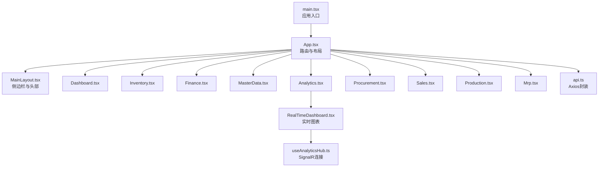
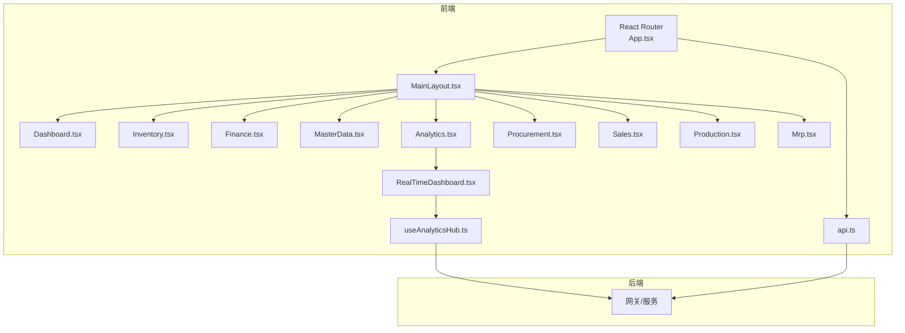
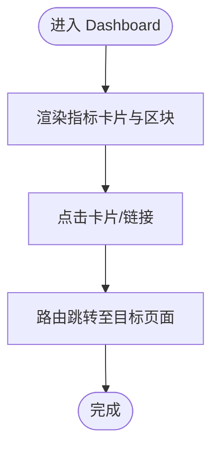
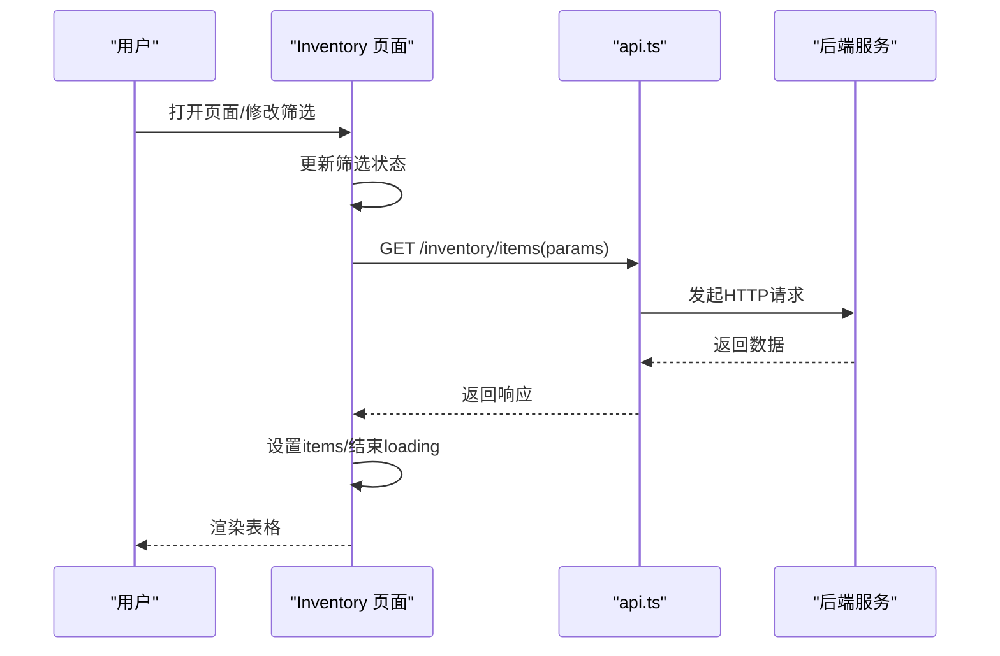
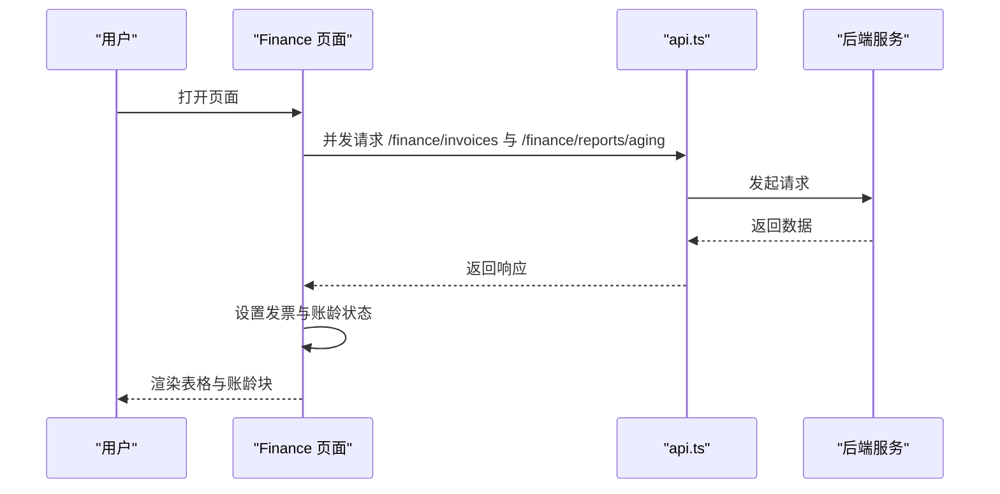
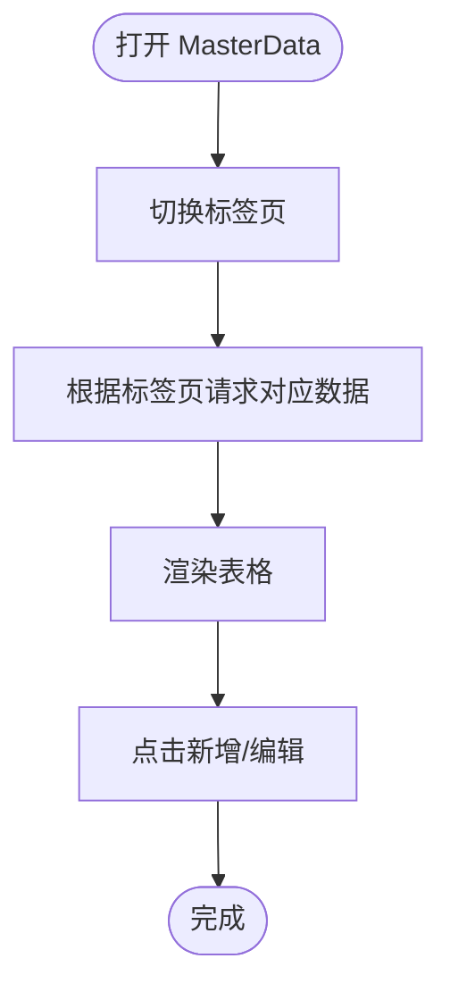
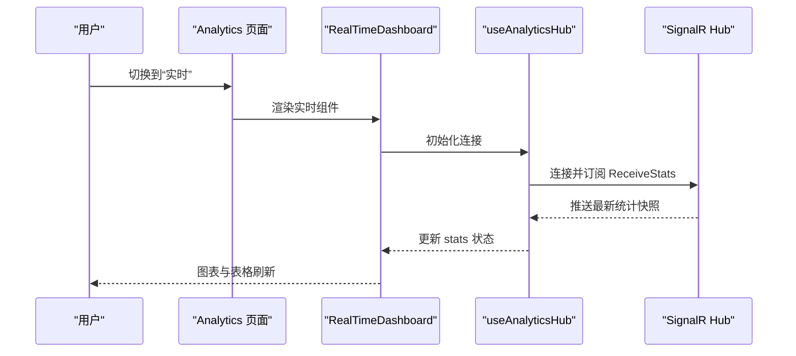
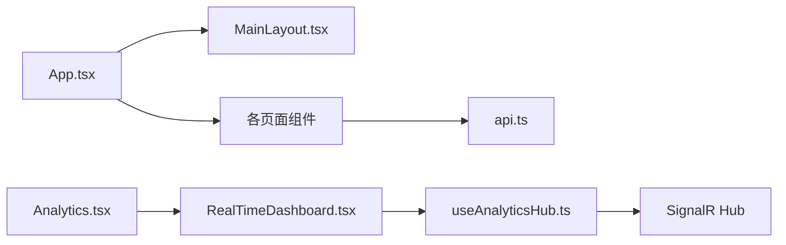

# 页面组件

<cite>
**本文引用的文件**
- [src/Web/ErpSystem.Web/src/App.tsx](file://src/Web/ErpSystem.Web/src/App.tsx)
- [src/Web/ErpSystem.Web/src/main.tsx](file://src/Web/ErpSystem.Web/src/main.tsx)
- [src/Web/ErpSystem.Web/src/layout/MainLayout.tsx](file://src/Web/ErpSystem.Web/src/layout/MainLayout.tsx)
- [src/Web/ErpSystem.Web/src/services/api.ts](file://src/Web/ErpSystem.Web/src/services/api.ts)
- [src/Web/ErpSystem.Web/src/hooks/useAnalyticsHub.ts](file://src/Web/ErpSystem.Web/src/hooks/useAnalyticsHub.ts)
- [src/Web/ErpSystem.Web/src/components/RealTimeDashboard.tsx](file://src/Web/ErpSystem.Web/src/components/RealTimeDashboard.tsx)
- [src/Web/ErpSystem.Web/src/pages/Dashboard.tsx](file://src/Web/ErpSystem.Web/src/pages/Dashboard.tsx)
- [src/Web/ErpSystem.Web/src/pages/Inventory.tsx](file://src/Web/ErpSystem.Web/src/pages/Inventory.tsx)
- [src/Web/ErpSystem.Web/src/pages/Finance.tsx](file://src/Web/ErpSystem.Web/src/pages/Finance.tsx)
- [src/Web/ErpSystem.Web/src/pages/MasterData.tsx](file://src/Web/ErpSystem.Web/src/pages/MasterData.tsx)
- [src/Web/ErpSystem.Web/src/pages/Analytics.tsx](file://src/Web/ErpSystem.Web/src/pages/Analytics.tsx)
- [src/Web/ErpSystem.Web/src/pages/Procurement.tsx](file://src/Web/ErpSystem.Web/src/pages/Procurement.tsx)
- [src/Web/ErpSystem.Web/src/pages/Sales.tsx](file://src/Web/ErpSystem.Web/src/pages/Sales.tsx)
- [src/Web/ErpSystem.Web/src/pages/Production.tsx](file://src/Web/ErpSystem.Web/src/pages/Production.tsx)
- [src/Web/ErpSystem.Web/src/pages/Mrp.tsx](file://src/Web/ErpSystem.Web/src/pages/Mrp.tsx)
</cite>

## 目录
1. [简介](#简介)
2. [项目结构](#项目结构)
3. [核心组件](#核心组件)
4. [架构总览](#架构总览)
5. [详细组件分析](#详细组件分析)
6. [依赖分析](#依赖分析)
7. [性能考虑](#性能考虑)
8. [故障排查指南](#故障排查指南)
9. [结论](#结论)
10. [附录](#附录)

## 简介
本文件面向ERP系统前端页面组件，围绕Dashboard仪表板、Inventory库存管理、Finance财务管理、MasterData主数据管理等核心页面，系统性梳理组件结构、数据获取与缓存策略、表单验证与数据绑定、批量操作、性能优化、SEO与无障碍支持、页面间导航与权限控制、以及数据同步机制。文档以实际源码为依据，辅以可视化图示帮助理解。

## 项目结构
前端采用React + Vite构建，路由通过React Router v6组织，页面组件位于src/pages，通用布局与导航在src/layout，网络请求封装在src/services，实时分析通过SignalR连接src/hooks与自定义组件src/components。

**图示来源**
- [src/Web/ErpSystem.Web/src/main.tsx](file://src/Web/ErpSystem.Web/src/main.tsx#L1-L11)
- [src/Web/ErpSystem.Web/src/App.tsx](file://src/Web/ErpSystem.Web/src/App.tsx#L1-L50)
- [src/Web/ErpSystem.Web/src/layout/MainLayout.tsx](file://src/Web/ErpSystem.Web/src/layout/MainLayout.tsx#L1-L83)
- [src/Web/ErpSystem.Web/src/services/api.ts](file://src/Web/ErpSystem.Web/src/services/api.ts#L1-L29)
- [src/Web/ErpSystem.Web/src/hooks/useAnalyticsHub.ts](file://src/Web/ErpSystem.Web/src/hooks/useAnalyticsHub.ts#L1-L51)
- [src/Web/ErpSystem.Web/src/components/RealTimeDashboard.tsx](file://src/Web/ErpSystem.Web/src/components/RealTimeDashboard.tsx#L1-L120)
- [src/Web/ErpSystem.Web/src/pages/Dashboard.tsx](file://src/Web/ErpSystem.Web/src/pages/Dashboard.tsx#L1-L113)
- [src/Web/ErpSystem.Web/src/pages/Inventory.tsx](file://src/Web/ErpSystem.Web/src/pages/Inventory.tsx#L1-L147)
- [src/Web/ErpSystem.Web/src/pages/Finance.tsx](file://src/Web/ErpSystem.Web/src/pages/Finance.tsx#L1-L157)
- [src/Web/ErpSystem.Web/src/pages/MasterData.tsx](file://src/Web/ErpSystem.Web/src/pages/MasterData.tsx#L1-L184)
- [src/Web/ErpSystem.Web/src/pages/Analytics.tsx](file://src/Web/ErpSystem.Web/src/pages/Analytics.tsx#L1-L197)
- [src/Web/ErpSystem.Web/src/pages/Procurement.tsx](file://src/Web/ErpSystem.Web/src/pages/Procurement.tsx#L1-L85)
- [src/Web/ErpSystem.Web/src/pages/Sales.tsx](file://src/Web/ErpSystem.Web/src/pages/Sales.tsx#L1-L85)
- [src/Web/ErpSystem.Web/src/pages/Production.tsx](file://src/Web/ErpSystem.Web/src/pages/Production.tsx#L1-L90)
- [src/Web/ErpSystem.Web/src/pages/Mrp.tsx](file://src/Web/ErpSystem.Web/src/pages/Mrp.tsx#L1-L142)

**章节来源**
- [src/Web/ErpSystem.Web/src/main.tsx](file://src/Web/ErpSystem.Web/src/main.tsx#L1-L11)
- [src/Web/ErpSystem.Web/src/App.tsx](file://src/Web/ErpSystem.Web/src/App.tsx#L1-L50)
- [src/Web/ErpSystem.Web/src/layout/MainLayout.tsx](file://src/Web/ErpSystem.Web/src/layout/MainLayout.tsx#L1-L83)

## 核心组件
- 应用入口与路由：应用入口负责挂载React.StrictMode与根组件；路由集中于App组件，使用MainLayout包裹所有页面，统一导航与面包屑。
- 布局组件：MainLayout提供固定侧边栏导航、顶部用户信息区、内容区域容器，NavItems根据当前路径高亮激活项。
- 服务层：api.ts基于Axios封装，设置基础URL与JSON头，并添加响应拦截器统一处理错误。
- 实时分析：Analytics页面包含“实时”与“历史”两个视图；实时视图由RealTimeDashboard组件承载，通过useAnalyticsHub建立SignalR连接并接收后端推送的统计快照。

**章节来源**
- [src/Web/ErpSystem.Web/src/App.tsx](file://src/Web/ErpSystem.Web/src/App.tsx#L21-L47)
- [src/Web/ErpSystem.Web/src/layout/MainLayout.tsx](file://src/Web/ErpSystem.Web/src/layout/MainLayout.tsx#L24-L82)
- [src/Web/ErpSystem.Web/src/services/api.ts](file://src/Web/ErpSystem.Web/src/services/api.ts#L1-L29)
- [src/Web/ErpSystem.Web/src/pages/Analytics.tsx](file://src/Web/ErpSystem.Web/src/pages/Analytics.tsx#L5-L34)
- [src/Web/ErpSystem.Web/src/components/RealTimeDashboard.tsx](file://src/Web/ErpSystem.Web/src/components/RealTimeDashboard.tsx#L1-L120)
- [src/Web/ErpSystem.Web/src/hooks/useAnalyticsHub.ts](file://src/Web/ErpSystem.Web/src/hooks/useAnalyticsHub.ts#L1-L51)

## 架构总览
前端采用“页面组件 + 布局 + 服务层”的分层设计，页面组件通过api服务调用后端接口，实时分析通过SignalR与后端事件总线对接。路由与导航集中在App与MainLayout中，形成统一的用户体验。

**图示来源**
- [src/Web/ErpSystem.Web/src/App.tsx](file://src/Web/ErpSystem.Web/src/App.tsx#L21-L47)
- [src/Web/ErpSystem.Web/src/layout/MainLayout.tsx](file://src/Web/ErpSystem.Web/src/layout/MainLayout.tsx#L24-L82)
- [src/Web/ErpSystem.Web/src/services/api.ts](file://src/Web/ErpSystem.Web/src/services/api.ts#L1-L29)
- [src/Web/ErpSystem.Web/src/hooks/useAnalyticsHub.ts](file://src/Web/ErpSystem.Web/src/hooks/useAnalyticsHub.ts#L12-L49)
- [src/Web/ErpSystem.Web/src/components/RealTimeDashboard.tsx](file://src/Web/ErpSystem.Web/src/components/RealTimeDashboard.tsx#L1-L120)

## 详细组件分析

### 仪表板 Dashboard
- 组件职责：概览关键指标（收入、库存、效率、质量），展示最近交易与智能简报。
- 数据与交互：静态卡片组件化复用；最近交易与智能简报通过链接跳转到对应页面；无本地状态管理，纯展示。
- 性能：无复杂计算，渲染开销低；建议后续接入实时指标时使用独立状态域与节流。

**图示来源**
- [src/Web/ErpSystem.Web/src/pages/Dashboard.tsx](file://src/Web/ErpSystem.Web/src/pages/Dashboard.tsx#L26-L112)

**章节来源**
- [src/Web/ErpSystem.Web/src/pages/Dashboard.tsx](file://src/Web/ErpSystem.Web/src/pages/Dashboard.tsx#L1-L113)

### 库存管理 Inventory
- 组件职责：按仓库与物料代码筛选，展示库存明细（在库、预留、可用、单价、总值）。
- 数据获取：首次加载与筛选变化触发请求；失败时回退为演示数据；loading状态控制表格占位。
- 表单与交互：搜索框与下拉筛选；可用量阈值以颜色标识；“转移/收货”按钮用于批量或单据操作入口。
- 缓存策略：当前未实现客户端缓存；建议对筛选条件与结果做轻量缓存，减少重复请求。

**图示来源**
- [src/Web/ErpSystem.Web/src/pages/Inventory.tsx](file://src/Web/ErpSystem.Web/src/pages/Inventory.tsx#L19-L43)
- [src/Web/ErpSystem.Web/src/services/api.ts](file://src/Web/ErpSystem.Web/src/services/api.ts#L1-L29)

**章节来源**
- [src/Web/ErpSystem.Web/src/pages/Inventory.tsx](file://src/Web/ErpSystem.Web/src/pages/Inventory.tsx#L1-L147)
- [src/Web/ErpSystem.Web/src/services/api.ts](file://src/Web/ErpSystem.Web/src/services/api.ts#L1-L29)

### 财务管理 Finance
- 组件职责：展示应收账款/应付账款列表与账龄报表；支持创建发票。
- 数据获取：并发请求发票与账龄报告；失败时回退演示数据。
- 状态与样式：状态枚举映射颜色与标签；到期金额差异以行内提示展示；“收款”按钮仅对未结清订单显示。
- 批量操作：当前页面未实现多选批量操作，建议引入选择列与批量动作条。

**图示来源**
- [src/Web/ErpSystem.Web/src/pages/Finance.tsx](file://src/Web/ErpSystem.Web/src/pages/Finance.tsx#L21-L58)
- [src/Web/ErpSystem.Web/src/services/api.ts](file://src/Web/ErpSystem.Web/src/services/api.ts#L1-L29)

**章节来源**
- [src/Web/ErpSystem.Web/src/pages/Finance.tsx](file://src/Web/ErpSystem.Web/src/pages/Finance.tsx#L1-L157)
- [src/Web/ErpSystem.Web/src/services/api.ts](file://src/Web/ErpSystem.Web/src/services/api.ts#L1-L29)

### 主数据管理 MasterData
- 组件职责：切换标签页展示材料、BOM、合作伙伴三类主数据；支持新增入口。
- 数据获取：根据激活标签页分别请求不同端点；失败时回退演示数据。
- 交互：Tab按钮切换当前视图；各表格展示关键字段与编辑入口。

**图示来源**
- [src/Web/ErpSystem.Web/src/pages/MasterData.tsx](file://src/Web/ErpSystem.Web/src/pages/MasterData.tsx#L28-L73)

**章节来源**
- [src/Web/ErpSystem.Web/src/pages/MasterData.tsx](file://src/Web/ErpSystem.Web/src/pages/MasterData.tsx#L1-L184)
- [src/Web/ErpSystem.Web/src/services/api.ts](file://src/Web/ErpSystem.Web/src/services/api.ts#L1-L29)

### 实时分析 Analytics 与 RealTimeDashboard
- 组件职责：提供“实时”与“历史”两种视图；实时视图通过SignalR订阅后端推送的统计快照，展示库存动量与波动性图表及实时数据流。
- 数据流：useAnalyticsHub建立连接、接收消息、更新状态；RealTimeDashboard消费状态并渲染图表与表格。
- 性能：图表使用响应式容器；数据为空时提供占位提示；建议对图表数据进行去抖与增量更新以降低重绘成本。

**图示来源**
- [src/Web/ErpSystem.Web/src/pages/Analytics.tsx](file://src/Web/ErpSystem.Web/src/pages/Analytics.tsx#L5-L34)
- [src/Web/ErpSystem.Web/src/components/RealTimeDashboard.tsx](file://src/Web/ErpSystem.Web/src/components/RealTimeDashboard.tsx#L6-L49)
- [src/Web/ErpSystem.Web/src/hooks/useAnalyticsHub.ts](file://src/Web/ErpSystem.Web/src/hooks/useAnalyticsHub.ts#L12-L49)

**章节来源**
- [src/Web/ErpSystem.Web/src/pages/Analytics.tsx](file://src/Web/ErpSystem.Web/src/pages/Analytics.tsx#L1-L197)
- [src/Web/ErpSystem.Web/src/components/RealTimeDashboard.tsx](file://src/Web/ErpSystem.Web/src/components/RealTimeDashboard.tsx#L1-L120)
- [src/Web/ErpSystem.Web/src/hooks/useAnalyticsHub.ts](file://src/Web/ErpSystem.Web/src/hooks/useAnalyticsHub.ts#L1-L51)

### 采购 Procurement、销售 Sales、生产 Production、MRP
- 共同特征：均通过api服务请求对应资源列表；失败时回退演示数据；使用状态控制加载与渲染；提供“新建”入口。
- 交互：表格展示关键字段与状态徽标；“查看/管理”按钮作为详情入口。
- 批量操作：当前未实现多选与批量动作；建议引入选择列与批量审批/执行流程。

**章节来源**
- [src/Web/ErpSystem.Web/src/pages/Procurement.tsx](file://src/Web/ErpSystem.Web/src/pages/Procurement.tsx#L1-L85)
- [src/Web/ErpSystem.Web/src/pages/Sales.tsx](file://src/Web/ErpSystem.Web/src/pages/Sales.tsx#L1-L85)
- [src/Web/ErpSystem.Web/src/pages/Production.tsx](file://src/Web/ErpSystem.Web/src/pages/Production.tsx#L1-L90)
- [src/Web/ErpSystem.Web/src/pages/Mrp.tsx](file://src/Web/ErpSystem.Web/src/pages/Mrp.tsx#L1-L142)
- [src/Web/ErpSystem.Web/src/services/api.ts](file://src/Web/ErpSystem.Web/src/services/api.ts#L1-L29)

## 依赖分析
- 路由与布局：App集中声明路由与MainLayout；MainLayout内部使用useLocation判断导航高亮。
- 服务依赖：各页面组件依赖api.ts发起HTTP请求；Analytics实时视图依赖useAnalyticsHub与SignalR Hub。
- 组件耦合：页面组件与布局解耦，通过MainLayout统一导航；实时组件与页面解耦，通过Hook注入。

**图示来源**
- [src/Web/ErpSystem.Web/src/App.tsx](file://src/Web/ErpSystem.Web/src/App.tsx#L21-L47)
- [src/Web/ErpSystem.Web/src/layout/MainLayout.tsx](file://src/Web/ErpSystem.Web/src/layout/MainLayout.tsx#L24-L82)
- [src/Web/ErpSystem.Web/src/services/api.ts](file://src/Web/ErpSystem.Web/src/services/api.ts#L1-L29)
- [src/Web/ErpSystem.Web/src/pages/Analytics.tsx](file://src/Web/ErpSystem.Web/src/pages/Analytics.tsx#L5-L34)
- [src/Web/ErpSystem.Web/src/components/RealTimeDashboard.tsx](file://src/Web/ErpSystem.Web/src/components/RealTimeDashboard.tsx#L1-L120)
- [src/Web/ErpSystem.Web/src/hooks/useAnalyticsHub.ts](file://src/Web/ErpSystem.Web/src/hooks/useAnalyticsHub.ts#L1-L51)

**章节来源**
- [src/Web/ErpSystem.Web/src/App.tsx](file://src/Web/ErpSystem.Web/src/App.tsx#L1-L50)
- [src/Web/ErpSystem.Web/src/layout/MainLayout.tsx](file://src/Web/ErpSystem.Web/src/layout/MainLayout.tsx#L1-L83)
- [src/Web/ErpSystem.Web/src/services/api.ts](file://src/Web/ErpSystem.Web/src/services/api.ts#L1-L29)
- [src/Web/ErpSystem.Web/src/hooks/useAnalyticsHub.ts](file://src/Web/ErpSystem.Web/src/hooks/useAnalyticsHub.ts#L1-L51)

## 性能考虑
- 请求合并与并发：Finance页面已使用Promise.all并发请求，可提升首屏速度；Inventory与MasterData亦可借鉴。
- 加载与骨架：Inventory与Finance在加载时渲染占位，建议引入骨架屏或分页以改善长列表体验。
- 图表与实时：RealTimeDashboard使用响应式容器，建议对数据流做去抖与增量更新，避免频繁重绘。
- 缓存策略：Inventory与MasterData当前未实现缓存；建议对筛选参数与结果做轻量缓存，结合失效策略。
- 代码分割：页面组件可按需懒加载，减少初始包体积。

[本节为通用指导，不直接分析具体文件]

## 故障排查指南
- 网络错误：api.ts的响应拦截器会打印错误信息；若后端不可用，页面组件会回退演示数据。
- 实时连接：useAnalyticsHub在连接失败时输出日志；检查Hub地址与跨域配置。
- 导航高亮：MainLayout基于路径前缀匹配高亮，确保路由路径与NavItems一致。

**章节来源**
- [src/Web/ErpSystem.Web/src/services/api.ts](file://src/Web/ErpSystem.Web/src/services/api.ts#L13-L20)
- [src/Web/ErpSystem.Web/src/hooks/useAnalyticsHub.ts](file://src/Web/ErpSystem.Web/src/hooks/useAnalyticsHub.ts#L17-L42)
- [src/Web/ErpSystem.Web/src/layout/MainLayout.tsx](file://src/Web/ErpSystem.Web/src/layout/MainLayout.tsx#L5-L22)

## 结论
本文档从组件结构、数据流、交互模式、性能与可靠性等方面梳理了ERP系统的核心页面组件。建议后续在以下方面持续改进：完善表单验证与数据绑定、引入批量操作与选择列、实施缓存与分页策略、增强SEO与无障碍能力，并在权限控制与数据同步上进一步细化。

[本节为总结性内容，不直接分析具体文件]

## 附录

### 页面级状态管理与数据获取模式
- 状态管理：页面组件普遍使用useState/ useEffect管理本地状态与副作用；未见全局状态库（如Redux）。
- 数据获取：统一通过api.ts封装的Axios实例；部分页面使用Promise.all并发请求。
- 缓存策略：当前未实现客户端缓存；建议对筛选参数与结果做轻量缓存。

**章节来源**
- [src/Web/ErpSystem.Web/src/pages/Inventory.tsx](file://src/Web/ErpSystem.Web/src/pages/Inventory.tsx#L24-L43)
- [src/Web/ErpSystem.Web/src/pages/Finance.tsx](file://src/Web/ErpSystem.Web/src/pages/Finance.tsx#L30-L58)
- [src/Web/ErpSystem.Web/src/services/api.ts](file://src/Web/ErpSystem.Web/src/services/api.ts#L1-L29)

### 表单验证、数据绑定与批量操作
- 表单验证：当前页面未实现表单校验逻辑；建议在新增/编辑表单中引入校验规则与错误提示。
- 数据绑定：页面通过受控组件（onChange）更新状态；建议引入表单库（如React Hook Form）统一处理。
- 批量操作：当前未实现多选与批量动作；建议引入选择列与批量操作条，结合后端批处理器。

[本节为通用指导，不直接分析具体文件]

### 页面性能优化、SEO与无障碍支持
- 性能：并发请求、占位渲染、响应式图表；建议引入骨架屏、分页与缓存。
- SEO：建议在页面组件中增加meta描述与标题；为关键页面提供静态预渲染。
- 无障碍：为按钮与表格添加aria-label与键盘导航；确保颜色对比度满足WCAG。

[本节为通用指导，不直接分析具体文件]

### 页面间导航关系、权限控制与数据同步
- 导航关系：App集中声明路由；MainLayout根据路径高亮；页面间通过Link与路由跳转。
- 权限控制：当前未见权限守卫；建议在路由层或布局层加入权限校验中间件。
- 数据同步：Inventory与MasterData通过筛选参数驱动重新请求；Finance通过并发请求保证一致性；实时数据通过SignalR推送。

**章节来源**
- [src/Web/ErpSystem.Web/src/App.tsx](file://src/Web/ErpSystem.Web/src/App.tsx#L25-L42)
- [src/Web/ErpSystem.Web/src/layout/MainLayout.tsx](file://src/Web/ErpSystem.Web/src/layout/MainLayout.tsx#L5-L22)
- [src/Web/ErpSystem.Web/src/pages/Inventory.tsx](file://src/Web/ErpSystem.Web/src/pages/Inventory.tsx#L24-L26)
- [src/Web/ErpSystem.Web/src/pages/MasterData.tsx](file://src/Web/ErpSystem.Web/src/pages/MasterData.tsx#L35-L37)
- [src/Web/ErpSystem.Web/src/pages/Finance.tsx](file://src/Web/ErpSystem.Web/src/pages/Finance.tsx#L33-L36)
- [src/Web/ErpSystem.Web/src/hooks/useAnalyticsHub.ts](file://src/Web/ErpSystem.Web/src/hooks/useAnalyticsHub.ts#L17-L42)