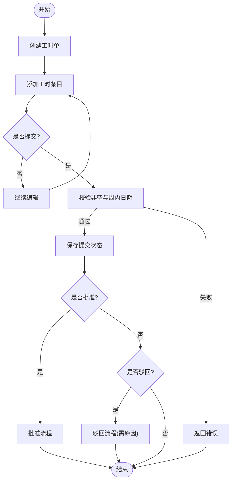

# 项目管理页面

<cite>
**本文档引用的文件**
- [Program.cs](file://src/Services/Projects/ErpSystem.Projects/Program.cs)
- [ProjectsController.cs](file://src/Services/Projects/ErpSystem.Projects/API/ProjectsController.cs)
- [TasksController.cs](file://src/Services/Projects/ErpSystem.Projects/API/TasksController.cs)
- [TimesheetsController.cs](file://src/Services/Projects/ErpSystem.Projects/API/TimesheetsController.cs)
- [ProjectAggregate.cs](file://src/Services/Projects/ErpSystem.Projects/Domain/ProjectAggregate.cs)
- [TimesheetAggregate.cs](file://src/Services/Projects/ErpSystem.Projects/Domain/TimesheetAggregate.cs)
- [Persistence.cs](file://src/Services/Projects/ErpSystem.Projects/Infrastructure/Persistence.cs)
- [Projections.cs](file://src/Services/Projects/ErpSystem.Projects/Infrastructure/Projections.cs)
- [Projects.tsx](file://src/Web/ErpSystem.Web/src/pages/Projects.tsx)
- [DashboardController.cs](file://src/Services/Reporting/ErpSystem.Reporting/Controllers/DashboardController.cs)
- [launchSettings.json](file://src/Services/Projects/ErpSystem.Projects/Properties/launchSettings.json)
- [package.json](file://src/Web/ErpSystem.Web/package.json)
</cite>

## 目录
1. [简介](#简介)
2. [项目结构](#项目结构)
3. [核心组件](#核心组件)
4. [架构总览](#架构总览)
5. [详细组件分析](#详细组件分析)
6. [依赖关系分析](#依赖关系分析)
7. [性能考虑](#性能考虑)
8. [故障排除指南](#故障排除指南)
9. [结论](#结论)
10. [附录](#附录)

## 简介
本文件面向项目管理页面（Projects）的实现与使用，系统性阐述项目规划、任务分配、工时管理、项目监控等核心功能模块，并结合前端可视化组件说明甘特图、里程碑跟踪与资源分配的呈现方式。同时，文档梳理项目成本控制、预算管理与收益分析的集成机制，以及团队协作工具、文档管理与沟通渠道的实现方案，并提供项目风险管理、质量控制与交付保障的辅助能力。

## 项目结构
项目管理页面由后端微服务（Projects）与前端页面（Web）共同构成，采用事件驱动架构与读写分离模式：
- 后端微服务负责领域建模、事件存储、投影与API暴露；
- 前端页面负责数据展示、交互与统计卡片渲染；
- 报表服务提供仪表盘汇总数据，支撑项目监控与KPI展示。

图表来源
- [Program.cs](file://src/Services/Projects/ErpSystem.Projects/Program.cs#L1-L49)
- [ProjectsController.cs](file://src/Services/Projects/ErpSystem.Projects/API/ProjectsController.cs#L1-L163)
- [TasksController.cs](file://src/Services/Projects/ErpSystem.Projects/API/TasksController.cs#L1-L102)
- [TimesheetsController.cs](file://src/Services/Projects/ErpSystem.Projects/API/TimesheetsController.cs#L1-L141)
- [Persistence.cs](file://src/Services/Projects/ErpSystem.Projects/Infrastructure/Persistence.cs#L1-L127)
- [Projections.cs](file://src/Services/Projects/ErpSystem.Projects/Infrastructure/Projections.cs#L1-L220)
- [DashboardController.cs](file://src/Services/Reporting/ErpSystem.Reporting/Controllers/DashboardController.cs#L1-L79)

章节来源
- [Program.cs](file://src/Services/Projects/ErpSystem.Projects/Program.cs#L1-L49)
- [Projects.tsx](file://src/Web/ErpSystem.Web/src/pages/Projects.tsx#L1-L548)

## 核心组件
- 项目聚合根（ProjectAggregate）：封装项目生命周期、状态变更、任务与里程碑管理、团队成员与预算更新等业务规则。
- 工时聚合根（TimesheetAggregate）：封装周工时记录、条目添加、提交与审批流程的状态机。
- 控制器层：ProjectsController、TasksController、TimesheetsController 提供REST接口，支持项目查询、任务进度更新、工时记录与审批。
- 事件存储与投影：事件持久化到PostgreSQL，读模型通过投影处理器实时更新，支持高效查询与统计。
- 前端页面：Projects 页面提供项目列表、看板视图、工时表格与统计卡片，支持筛选与交互。

章节来源
- [ProjectAggregate.cs](file://src/Services/Projects/ErpSystem.Projects/Domain/ProjectAggregate.cs#L280-L451)
- [TimesheetAggregate.cs](file://src/Services/Projects/ErpSystem.Projects/Domain/TimesheetAggregate.cs#L105-L218)
- [ProjectsController.cs](file://src/Services/Projects/ErpSystem.Projects/API/ProjectsController.cs#L1-L163)
- [TasksController.cs](file://src/Services/Projects/ErpSystem.Projects/API/TasksController.cs#L1-L102)
- [TimesheetsController.cs](file://src/Services/Projects/ErpSystem.Projects/API/TimesheetsController.cs#L1-L141)
- [Persistence.cs](file://src/Services/Projects/ErpSystem.Projects/Infrastructure/Persistence.cs#L1-L127)
- [Projections.cs](file://src/Services/Projects/ErpSystem.Projects/Infrastructure/Projections.cs#L1-L220)
- [Projects.tsx](file://src/Web/ErpSystem.Web/src/pages/Projects.tsx#L1-L548)

## 架构总览
项目管理页面采用事件溯源与CQRS模式：
- 写模型（命令）：控制器接收请求，调用聚合根产生领域事件；
- 事件存储：事件持久化到PostgreSQL事件流表；
- 读模型（投影）：投影处理器监听事件并更新读库中的JSONB字段或独立实体；
- 查询：前端通过API获取读库数据，实现高性能查询与统计。

图表来源
- [ProjectsController.cs](file://src/Services/Projects/ErpSystem.Projects/API/ProjectsController.cs#L13-L30)
- [Persistence.cs](file://src/Services/Projects/ErpSystem.Projects/Infrastructure/Persistence.cs#L26-L61)
- [Projections.cs](file://src/Services/Projects/ErpSystem.Projects/Infrastructure/Projections.cs#L9-L141)

章节来源
- [Program.cs](file://src/Services/Projects/ErpSystem.Projects/Program.cs#L1-L49)
- [Persistence.cs](file://src/Services/Projects/ErpSystem.Projects/Infrastructure/Persistence.cs#L1-L127)
- [Projections.cs](file://src/Services/Projects/ErpSystem.Projects/Infrastructure/Projections.cs#L1-L220)

## 详细组件分析

### 项目规划与监控
- 项目创建与状态管理：支持创建项目、变更状态、添加里程碑与团队成员；状态变更通过领域事件记录，读模型实时更新。
- 项目统计：提供项目总数、进行中数量、完成数量、总预算与平均进度等指标，便于高层监控。
- 里程碑跟踪：里程碑以JSONB数组形式存储在读模型中，便于前端渲染与展示。

图表来源
- [ProjectAggregate.cs](file://src/Services/Projects/ErpSystem.Projects/Domain/ProjectAggregate.cs#L175-L451)

章节来源
- [ProjectsController.cs](file://src/Services/Projects/ErpSystem.Projects/API/ProjectsController.cs#L39-L129)
- [ProjectAggregate.cs](file://src/Services/Projects/ErpSystem.Projects/Domain/ProjectAggregate.cs#L280-L451)
- [Projections.cs](file://src/Services/Projects/ErpSystem.Projects/Infrastructure/Projections.cs#L9-L141)

### 任务分配与看板视图
- 任务创建与分配：支持为项目添加任务，设置标题、描述、优先级、截止日期、负责人与估算工时。
- 进度更新与完成：支持更新任务进度百分比与完成任务的实际工时。
- 看板视图：按状态分栏（Open/InProgress/InReview/Completed）展示任务，便于团队协作与可视化管理。
- 我的任务：按当前登录用户过滤未完成任务，按截止日期排序，提升个人效率。

图表来源
- [TasksController.cs](file://src/Services/Projects/ErpSystem.Projects/API/TasksController.cs#L39-L82)
- [Projections.cs](file://src/Services/Projects/ErpSystem.Projects/Infrastructure/Projections.cs#L53-L100)

章节来源
- [TasksController.cs](file://src/Services/Projects/ErpSystem.Projects/API/TasksController.cs#L1-L102)
- [Projects.tsx](file://src/Web/ErpSystem.Web/src/pages/Projects.tsx#L428-L477)

### 工时管理与审批
- 工时记录：按周创建工时单，支持为任务添加工作日志、小时数与描述。
- 提交与审批：支持提交、批准与驳回流程，拒绝时需填写原因。
- 审批汇总：提供待审批工时列表与项目维度的工时汇总，便于财务与管理者协同。

图表来源
- [TimesheetAggregate.cs](file://src/Services/Projects/ErpSystem.Projects/Domain/TimesheetAggregate.cs#L138-L178)
- [TimesheetsController.cs](file://src/Services/Projects/ErpSystem.Projects/API/TimesheetsController.cs#L56-L98)

章节来源
- [TimesheetsController.cs](file://src/Services/Projects/ErpSystem.Projects/API/TimesheetsController.cs#L1-L141)
- [TimesheetAggregate.cs](file://src/Services/Projects/ErpSystem.Projects/Domain/TimesheetAggregate.cs#L105-L218)
- [Projects.tsx](file://src/Web/ErpSystem.Web/src/pages/Projects.tsx#L479-L544)

### 项目成本控制与预算管理
- 预算更新：支持更新项目计划预算，变更通过领域事件记录，读模型同步更新。
- 实际成本：项目聚合根维护实际成本字段，配合工时与财务系统进行对账。
- 成本偏差：前端统计卡片可展示总预算与平均进度，结合财务服务进行偏差分析。

图表来源
- [ProjectAggregate.cs](file://src/Services/Projects/ErpSystem.Projects/Domain/ProjectAggregate.cs#L397-L403)
- [Projections.cs](file://src/Services/Projects/ErpSystem.Projects/Infrastructure/Projections.cs#L132-L140)
- [ProjectsController.cs](file://src/Services/Projects/ErpSystem.Projects/API/ProjectsController.cs#L39-L60)

章节来源
- [ProjectAggregate.cs](file://src/Services/Projects/ErpSystem.Projects/Domain/ProjectAggregate.cs#L280-L451)
- [Projections.cs](file://src/Services/Projects/ErpSystem.Projects/Infrastructure/Projections.cs#L132-L140)
- [Projects.tsx](file://src/Web/ErpSystem.Web/src/pages/Projects.tsx#L304-L332)

### 项目监控与可视化
- 项目进度可视化：前端统计卡片展示项目总数、进行中数量、完成数量、总预算与平均进度。
- 甘特图与里程碑：需求文档定义了甘特图、关键路径与依赖关系连线等高级可视化能力，当前前端未直接实现甘特图组件，但读模型已具备里程碑JSONB字段，可作为后续扩展的数据基础。
- 资源分配：团队成员信息以JSONB形式存储在读模型中，前端可基于此展示资源占用情况。

图表来源
- [Projects.tsx](file://src/Web/ErpSystem.Web/src/pages/Projects.tsx#L304-L544)
- [Persistence.cs](file://src/Services/Projects/ErpSystem.Projects/Infrastructure/Persistence.cs#L67-L124)
- [Projections.cs](file://src/Services/Projects/ErpSystem.Projects/Infrastructure/Projections.cs#L102-L130)

章节来源
- [Projects.tsx](file://src/Web/ErpSystem.Web/src/pages/Projects.tsx#L1-L548)
- [Persistence.cs](file://src/Services/Projects/ErpSystem.Projects/Infrastructure/Persistence.cs#L67-L124)

### 团队协作、文档与沟通
- 团队成员：通过“添加团队成员”接口将用户与角色关联到项目，读模型以JSONB存储团队成员列表，便于前端展示与权限控制。
- 文档管理：当前代码库未发现专门的文档管理模块，建议在项目中引入附件与文档元数据的读模型字段，以便统一管理。
- 沟通渠道：前端页面未内置即时通讯组件，建议通过外部系统或集成消息通道实现跨模块沟通。

章节来源
- [ProjectsController.cs](file://src/Services/Projects/ErpSystem.Projects/API/ProjectsController.cs#L104-L113)
- [Projections.cs](file://src/Services/Projects/ErpSystem.Projects/Infrastructure/Projections.cs#L120-L130)
- [Projects.tsx](file://src/Web/ErpSystem.Web/src/pages/Projects.tsx#L1-L548)

### 风险管理、质量控制与交付保障
- 风险管理：项目聚合根提供逾期判断（IsOverdue），可用于触发风险预警；建议在读模型中增加风险标记字段并在仪表盘展示。
- 质量控制：质量控制模块与项目管理解耦，可通过集成事件触发质量检查流程；项目页面可展示质量相关指标（如缺陷率、合格率）。
- 交付保障：工时审批流程确保成本与进度的合规性；看板视图与里程碑有助于交付节点的可视化追踪。

章节来源
- [ProjectAggregate.cs](file://src/Services/Projects/ErpSystem.Projects/Domain/ProjectAggregate.cs#L304-L304)
- [TimesheetAggregate.cs](file://src/Services/Projects/ErpSystem.Projects/Domain/TimesheetAggregate.cs#L150-L178)

## 依赖关系分析
- 后端依赖：事件总线、MediatR、EF Core、PostgreSQL；读写库分离，投影处理器监听事件更新读模型。
- 前端依赖：React、Lucide图标、Axios、TailwindCSS、Recharts（用于图表）；页面通过API客户端访问后端服务。
- 报表依赖：DashboardController提供汇总数据，前端可结合项目数据进行多维分析。

图表来源
- [package.json](file://src/Web/ErpSystem.Web/package.json#L11-L34)
- [Program.cs](file://src/Services/Projects/ErpSystem.Projects/Program.cs#L1-L49)

章节来源
- [package.json](file://src/Web/ErpSystem.Web/package.json#L1-L35)
- [Program.cs](file://src/Services/Projects/ErpSystem.Projects/Program.cs#L1-L49)

## 性能考虑
- 事件存储：使用PostgreSQL jsonb字段存储事件，具备良好的扩展性；建议对事件表建立合适索引以优化查询。
- 读模型：读库采用独立数据库连接，投影处理器异步处理事件，避免阻塞写操作；建议对常用查询字段（如项目状态、负责人、任务状态）建立索引。
- 前端缓存：页面首次加载并行拉取项目、任务与工时数据，减少等待时间；建议增加本地缓存策略与分页加载以提升大列表性能。
- 数据一致性：事件溯源保证最终一致，投影处理器顺序处理事件，避免竞态条件；建议监控投影延迟并设置告警阈值。

## 故障排除指南
- 事件存储异常：检查事件库连接字符串与迁移状态；确认事件表结构与索引是否存在。
- 投影延迟：查看投影处理器日志，确认事件订阅与处理是否正常；必要时重放事件或重建投影。
- 工时提交失败：检查工作日期是否在周范围内、工时是否在合理区间、工时单状态是否允许提交。
- 权限问题：确认用户是否为项目团队成员；前端按钮与操作应根据用户角色进行显隐控制。

章节来源
- [Persistence.cs](file://src/Services/Projects/ErpSystem.Projects/Infrastructure/Persistence.cs#L8-L20)
- [TimesheetAggregate.cs](file://src/Services/Projects/ErpSystem.Projects/Domain/TimesheetAggregate.cs#L140-L158)

## 结论
项目管理页面通过事件驱动架构实现了项目规划、任务分配、工时管理与项目监控的闭环。前端以统计卡片、看板与工时表格的形式直观展示项目状态，结合读模型的JSONB字段为后续扩展（如甘特图、里程碑跟踪）提供了良好基础。建议在现有基础上完善文档管理、质量控制与风险管理模块，并持续优化读模型索引与前端缓存策略，以提升整体性能与用户体验。

## 附录
- 开发环境配置：微服务默认运行在本地端口，可在启动设置中调整环境变量与应用URL。
- 报表集成：DashboardController提供汇总数据接口，可与项目页面联动展示KPI与趋势。

章节来源
- [launchSettings.json](file://src/Services/Projects/ErpSystem.Projects/Properties/launchSettings.json#L1-L14)
- [DashboardController.cs](file://src/Services/Reporting/ErpSystem.Reporting/Controllers/DashboardController.cs#L1-L79)