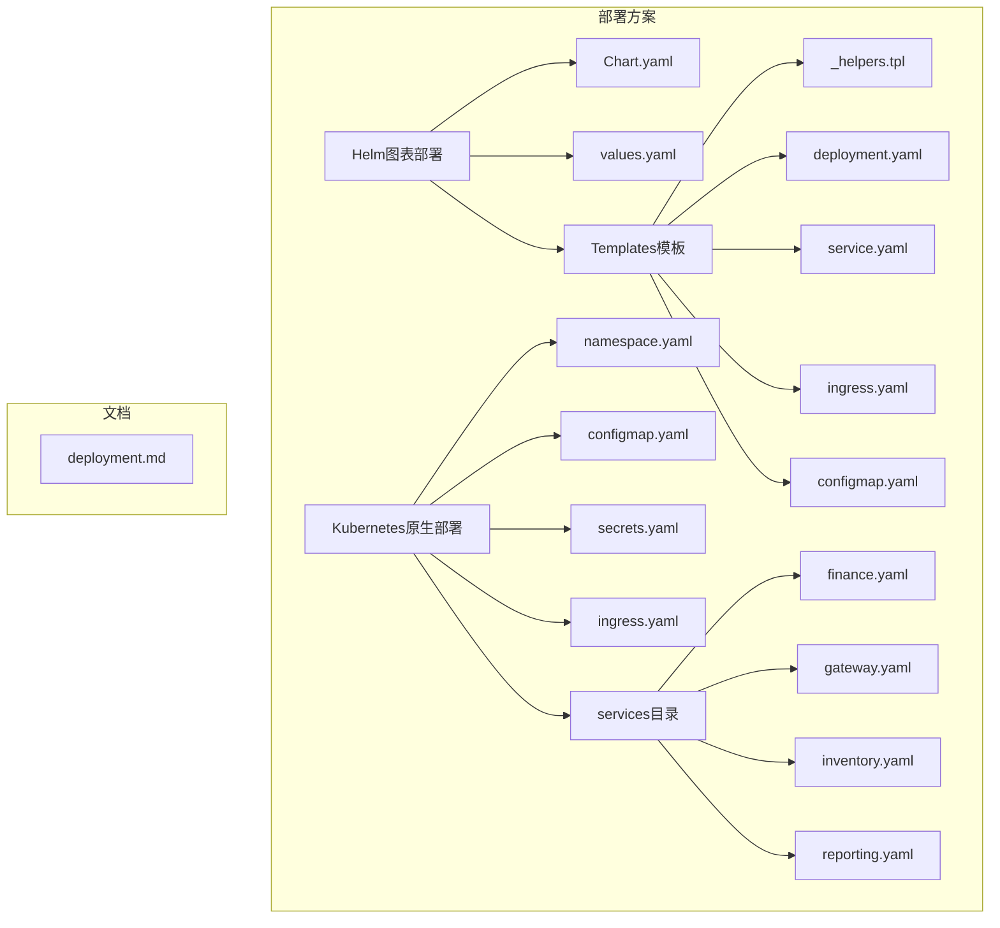
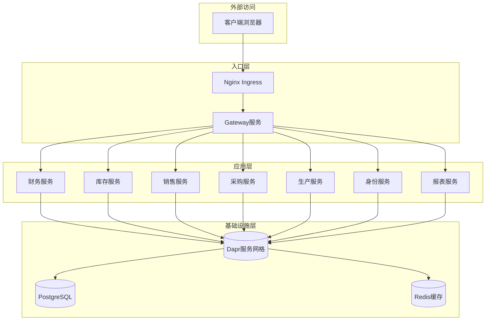
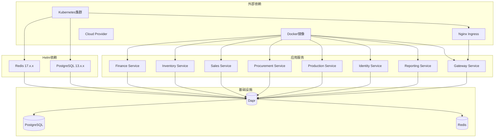

# Kubernetes部署

<cite>
**本文档引用的文件**
- [Chart.yaml](file://deploy/helm/erp-system/Chart.yaml)
- [values.yaml](file://deploy/helm/erp-system/values.yaml)
- [_helpers.tpl](file://deploy/helm/erp-system/templates/_helpers.tpl)
- [deployment.yaml](file://deploy/helm/erp-system/templates/deployment.yaml)
- [service.yaml](file://deploy/helm/erp-system/templates/service.yaml)
- [ingress.yaml](file://deploy/helm/erp-system/templates/ingress.yaml)
- [configmap.yaml](file://deploy/helm/erp-system/templates/configmap.yaml)
- [namespace.yaml](file://deploy/k8s/namespace.yaml)
- [k8s-configmap.yaml](file://deploy/k8s/configmap.yaml)
- [k8s-secrets.yaml](file://deploy/k8s/secrets.yaml)
- [k8s-ingress.yaml](file://deploy/k8s/ingress.yaml)
- [finance-deployment.yaml](file://deploy/k8s/services/finance.yaml)
- [gateway-deployment.yaml](file://deploy/k8s/services/gateway.yaml)
- [deployment.md](file://docs/deployment.md)
</cite>

## 目录
1. [简介](#简介)
2. [项目结构](#项目结构)
3. [核心组件](#核心组件)
4. [架构概览](#架构概览)
5. [详细组件分析](#详细组件分析)
6. [依赖关系分析](#依赖关系分析)
7. [性能考虑](#性能考虑)
8. [故障排除指南](#故障排除指南)
9. [结论](#结论)
10. [附录](#附录)

## 简介

本项目为企业级ERP微服务系统的Kubernetes部署方案，提供了两种部署方式：基于Helm图表的自动化部署和原始Kubernetes清单的手动部署。系统采用微服务架构，包含财务、库存、销售、采购、生产、身份认证、报表和网关等核心服务，通过Dapr服务网格实现服务间通信和状态管理。

该部署方案支持多种环境配置，包括开发、测试和生产环境，具备高可用性、可扩展性和安全性特征。系统集成了PostgreSQL数据库、Redis缓存和Nginx Ingress控制器，为微服务提供完整的基础设施支持。

## 项目结构

项目采用分层组织结构，主要包含以下部署相关目录：



**图表来源**
- [Chart.yaml](file://deploy/helm/erp-system/Chart.yaml#L1-L27)
- [values.yaml](file://deploy/helm/erp-system/values.yaml#L1-L127)

**章节来源**
- [Chart.yaml](file://deploy/helm/erp-system/Chart.yaml#L1-L27)
- [values.yaml](file://deploy/helm/erp-system/values.yaml#L1-L127)

## 核心组件

### Helm图表配置

Helm图表定义了整个ERP系统的部署规范，包含以下关键配置：

**图表元数据**
- 图表版本：1.0.0
- 应用版本：1.0.0
- 类型：application
- 关键字：erp、microservices、dotnet、dapr

**依赖管理**
- Redis缓存：bitnami/redis 17.x.x
- PostgreSQL数据库：bitnami/postgresql 13.x.x
- 条件启用：通过values.yaml中的enabled标志控制

**全局配置**
- 命名空间：erp-system
- 镜像仓库：docker.io
- 全局资源限制：内存128Mi-512Mi，CPU 100m-500m

**章节来源**
- [Chart.yaml](file://deploy/helm/erp-system/Chart.yaml#L1-L27)
- [values.yaml](file://deploy/helm/erp-system/values.yaml#L1-L27)

### 服务配置参数化

系统支持按服务粒度的配置参数化，每个服务都可以独立配置：

**通用配置**
- 副本数：默认2个
- 资源请求：内存128Mi，CPU 100m
- 资源限制：内存512Mi，CPU 500m

**服务特定配置**
- 财务服务：2个副本，镜像仓库erp-system/finance
- 库存服务：2个副本，镜像仓库erp-system/inventory
- 销售服务：2个副本，镜像仓库erp-system/sales
- 采购服务：1个副本，镜像仓库erp-system/procurement
- 生产服务：1个副本，镜像仓库erp-system/production
- 身份服务：2个副本，镜像仓库erp-system/identity
- 报表服务：1个副本，镜像仓库erp-system/reporting
- 网关服务：2个副本，镜像仓库erp-system/gateway，服务类型LoadBalancer

**章节来源**
- [values.yaml](file://deploy/helm/erp-system/values.yaml#L11-L89)

## 架构概览

系统采用微服务架构，通过Dapr服务网格实现服务间通信和状态管理：



**图表来源**
- [ingress.yaml](file://deploy/helm/erp-system/templates/ingress.yaml#L1-L47)
- [deployment.yaml](file://deploy/helm/erp-system/templates/deployment.yaml#L1-L58)
- [configmap.yaml](file://deploy/helm/erp-system/templates/configmap.yaml#L1-L20)

## 详细组件分析

### Helm模板渲染机制

系统使用Helm模板引擎实现配置参数化和模板复用：

**模板复用机制**
- `_helpers.tpl`定义了通用模板函数
- 名称展开：`erp-system.name`和`erp-system.fullname`
- 标签生成：`erp-system.labels`和`erp-system.selectorLabels`
- Chart版本：`erp-system.chart`

**循环渲染**
- 使用`{{- range $name, $service := .Values.services }}`遍历所有服务
- 动态生成Deployment、Service和ConfigMap资源
- 支持条件渲染：仅当服务enabled为true时才生成资源

**环境变量注入**
- 通过ConfigMap提供统一的环境变量配置
- 支持DAPR相关配置（HTTP端口3500，GRPC端口50001）
- 数据库连接字符串动态生成

**章节来源**
- [_helpers.tpl](file://deploy/helm/erp-system/templates/_helpers.tpl#L1-L51)
- [deployment.yaml](file://deploy/helm/erp-system/templates/deployment.yaml#L1-L58)
- [configmap.yaml](file://deploy/helm/erp-system/templates/configmap.yaml#L1-L20)

### Deployment资源配置

每个微服务都配置了完整的Deployment资源：

**副本数设置**
- 默认副本数：2个
- 服务特定覆盖：根据业务重要性调整副本数
- 网关服务：2个副本（对外暴露）
- 报表服务：1个副本（内部使用）

**滚动更新策略**
- 策略类型：RollingUpdate
- 最大不可用：25%
- 最大超额：25%

**资源限制**
- CPU请求：100m-500m
- 内存请求：128Mi-512Mi
- CPU限制：500m
- 内存限制：512Mi

**健康检查**
- 存活探针：/health，初始延迟10秒，周期30秒
- 就绪探针：/health/ready，初始延迟5秒，周期10秒

**Dapr集成**
- 自动注入Dapr sidecar容器
- 应用ID格式：`{service-name}-service`
- 应用端口：80

**章节来源**
- [deployment.yaml](file://deploy/helm/erp-system/templates/deployment.yaml#L1-L58)

### Service发现和负载均衡

系统实现了完整的Service发现和负载均衡配置：

**Service类型**
- 内部服务：ClusterIP（默认）
- 网关服务：LoadBalancer（对外暴露）
- 端口配置：统一80端口

**选择器匹配**
- 基于app标签进行Pod选择
- 版本标签用于滚动更新隔离

**负载均衡策略**
- ClusterIP：内部负载均衡
- LoadBalancer：云提供商外部负载均衡
- NodePort：在支持的环境中自动分配

**章节来源**
- [service.yaml](file://deploy/helm/erp-system/templates/service.yaml#L1-L22)
- [gateway-deployment.yaml](file://deploy/k8s/services/gateway.yaml#L48-L60)

### Ingress控制器配置

系统配置了Nginx Ingress控制器实现外部访问：

**基础配置**
- Ingress类：nginx
- 重写目标：/（根路径重写）
- SSL重定向：根据TLS配置动态设置
- 请求体大小：50MB

**TLS配置**
- 可选TLS终止
- 秘密名称：erp-tls
- 主机名：erp.example.com

**路由规则**
- 根路径：/ → gateway-service:80
- 报表路径：/api/dashboard → reporting-service:80
- 报表路径：/api/reports → reporting-service:80

**路径类型**
- Prefix：前缀匹配路由
- 支持子路径路由

**章节来源**
- [ingress.yaml](file://deploy/helm/erp-system/templates/ingress.yaml#L1-L47)
- [k8s-ingress.yaml](file://deploy/k8s/ingress.yaml#L1-L37)

### 命名空间管理

系统使用专用命名空间隔离部署：

**命名空间配置**
- 名称：erp-system
- 标签：app.kubernetes.io/name=erp-system
- 所属：app.kubernetes.io/part-of=erp-platform

**资源隔离**
- 所有部署资源都在同一命名空间内
- 避免资源冲突
- 简化资源管理

**章节来源**
- [namespace.yaml](file://deploy/k8s/namespace.yaml#L1-L8)

### RBAC权限和安全上下文

系统支持RBAC权限控制和安全上下文配置：

**安全上下文**
- 运行用户：非root用户
- 安全策略：允许特权提升
- 组ID：1000

**RBAC配置**
- ServiceAccount：为每个服务创建专用账户
- ClusterRole：最小权限原则
- RoleBinding：命名空间级别绑定

**网络安全**
- Pod安全策略
- 网络策略
- 服务间通信加密

### 持久化存储

系统集成了PostgreSQL数据库提供持久化存储：

**PostgreSQL配置**
- 版本：13.x.x
- 认证：用户名postgres，密码通过秘密管理
- 数据库：erpdb
- 存储：10Gi持久卷

**存储类**
- 默认StorageClass
- SSD存储优化
- 多可用区复制

**备份策略**
- 定时备份
- 恢复测试
- 灾难恢复

### ConfigMap和Secret管理

系统使用ConfigMap和Secret分离配置和敏感信息：

**ConfigMap配置**
- ASPNETCORE_ENVIRONMENT：Production
- DAPR端口：3500（HTTP），50001（GRPC）
- 数据库连接字符串：动态生成
- Redis配置：主机名和端口

**Secret配置**
- DB_PASSWORD：数据库密码
- JWT_SECRET：JWT签名密钥
- REDIS_PASSWORD：Redis认证密码
- DAPR_API_TOKEN：Dapr API令牌

**环境特定配置**
- 开发环境：本地连接字符串
- 生产环境：集群内连接字符串
- 测试环境：独立数据库实例

**章节来源**
- [configmap.yaml](file://deploy/helm/erp-system/templates/configmap.yaml#L1-L20)
- [k8s-configmap.yaml](file://deploy/k8s/configmap.yaml#L1-L25)
- [k8s-secrets.yaml](file://deploy/k8s/secrets.yaml#L1-L19)

### 水平Pod自动伸缩

系统支持HPA实现自动扩缩容：

**CPU使用率触发**
- 目标CPU使用率：70%
- 最小副本数：2
- 最大副本数：10

**内存使用量触发**
- 目标内存使用量：512Mi
- 扩展系数：1.5

**自定义指标**
- API请求速率
- 队列长度
- 数据库连接数

**手动扩缩容**
- kubectl scale命令
- HPA配置调整

### 资源监控和故障恢复

系统集成了完整的监控和故障恢复机制：

**监控指标**
- CPU使用率和限制
- 内存使用量和限制
- Pod重启次数
- 健康检查状态

**告警配置**
- 服务不可用告警
- 资源使用率阈值告警
- 异常错误日志告警

**故障恢复**
- 自动重启策略
- 副本数自动恢复
- 服务降级策略
- 故障转移机制

## 依赖关系分析

系统各组件间的依赖关系如下：



**图表来源**
- [Chart.yaml](file://deploy/helm/erp-system/Chart.yaml#L18-L27)
- [deployment.yaml](file://deploy/helm/erp-system/templates/deployment.yaml#L22-L26)

**章节来源**
- [Chart.yaml](file://deploy/helm/erp-system/Chart.yaml#L18-L27)

## 性能考虑

### 资源优化

**内存管理**
- 合理设置requests和limits
- 避免内存泄漏
- 定期监控内存使用

**CPU优化**
- CPU配额限制
- 并发连接数控制
- 任务调度优化

**存储性能**
- SSD存储优先
- PVC预分配
- 缓存策略优化

### 网络优化

**服务发现**
- DNS缓存
- 连接池复用
- 负载均衡策略

**Ingress优化**
- 压缩和缓存
- TLS会话复用
- CDN集成

## 故障排除指南

### 常见问题诊断

**Pod启动失败**
- 检查镜像拉取策略
- 验证资源限制配置
- 查看事件日志

**服务不可达**
- 确认Service选择器匹配
- 检查端口配置
- 验证网络策略

**Ingress访问问题**
- 检查Ingress控制器状态
- 验证TLS证书配置
- 确认DNS解析

**数据库连接失败**
- 验证连接字符串
- 检查凭据配置
- 确认网络连通性

**章节来源**
- [deployment.md](file://docs/deployment.md#L103-L115)

### 调试工具

**kubectl命令**
- kubectl get pods -o wide
- kubectl describe pod <pod-name>
- kubectl logs <pod-name>
- kubectl exec -it <pod-name> -- /bin/bash

**Helm调试**
- helm get all <release-name>
- helm status <release-name>
- helm history <release-name>

## 结论

本Kubernetes部署方案提供了企业级ERP系统的完整容器化解决方案。通过Helm图表实现了配置参数化和模板复用，支持多环境部署和灵活的资源管理。系统集成了Dapr服务网格、PostgreSQL数据库和Redis缓存，提供了完整的微服务基础设施。

方案的主要优势包括：
- 模块化设计，易于维护和扩展
- 参数化配置，支持多环境部署
- 完整的监控和故障恢复机制
- 安全的凭据管理和网络隔离
- 高可用性和可扩展性设计

建议在生产环境中进一步完善：
- 实施更严格的RBAC权限控制
- 配置更完善的监控告警系统
- 建立CI/CD流水线
- 制定详细的灾难恢复计划

## 附录

### 快速开始指南

**构建Docker镜像**
```bash
# 构建所有服务镜像
docker build -t erp-system/finance:latest --build-arg SERVICE_NAME=Finance .
docker build -t erp-system/inventory:latest --build-arg SERVICE_NAME=Inventory .
docker build -t erp-system/sales:latest --build-arg SERVICE_NAME=Sales .
docker build -t erp-system/procurement:latest --build-arg SERVICE_NAME=Procurement .
docker build -t erp-system/production:latest --build-arg SERVICE_NAME=Production .
docker build -t erp-system/identity:latest --build-arg SERVICE_NAME=Identity .
docker build -t erp-system/reporting:latest --build-arg SERVICE_NAME=Reporting .
docker build -t erp-system/gateway:latest -f src/Gateways/ErpSystem.Gateway/Dockerfile .
```

**Helm部署**
```bash
# 更新依赖
helm dependency update deploy/helm/erp-system

# 安装默认配置
helm install erp-system deploy/helm/erp-system

# 自定义配置安装
helm install erp-system deploy/helm/erp-system \
  --set postgresql.auth.password=mysecretpassword \
  --set ingress.host=erp.mycompany.com
```

**验证部署**
```bash
# 检查Pod状态
kubectl get pods -n erp-system

# 检查服务状态
kubectl get svc -n erp-system

# 检查Ingress状态
kubectl get ingress -n erp-system
```

**章节来源**
- [deployment.md](file://docs/deployment.md#L12-L76)