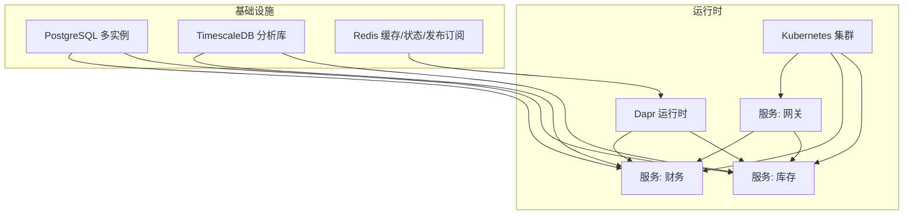
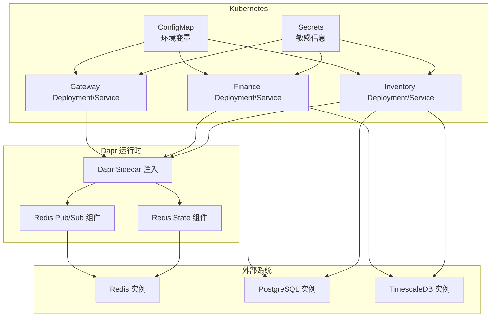
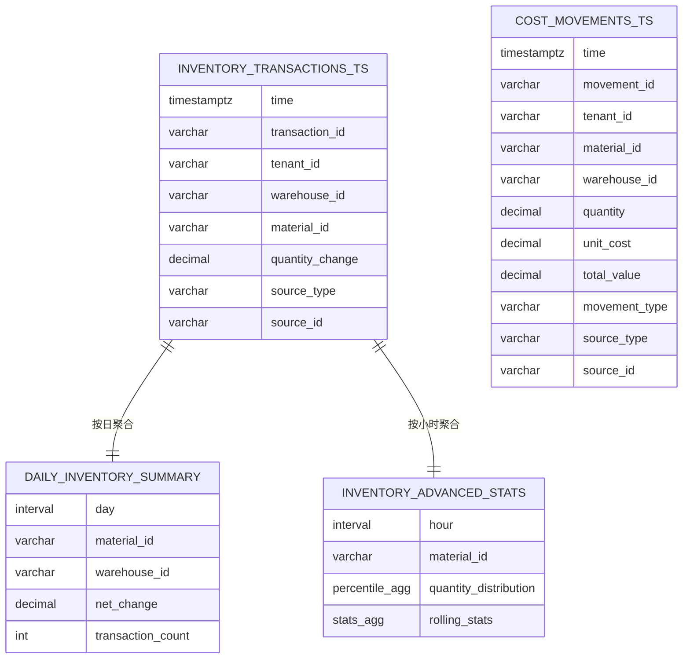
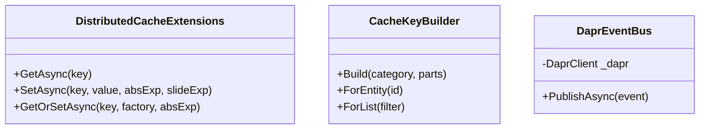
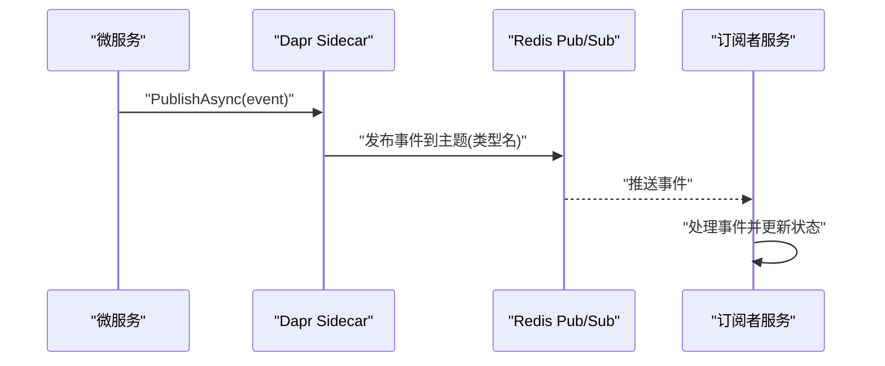
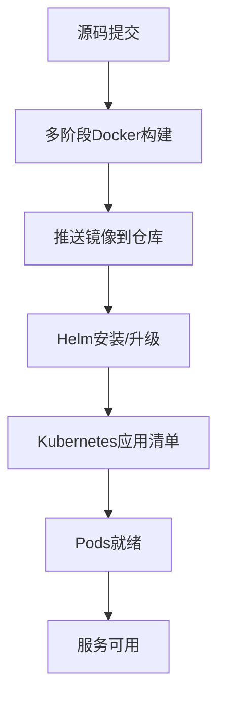
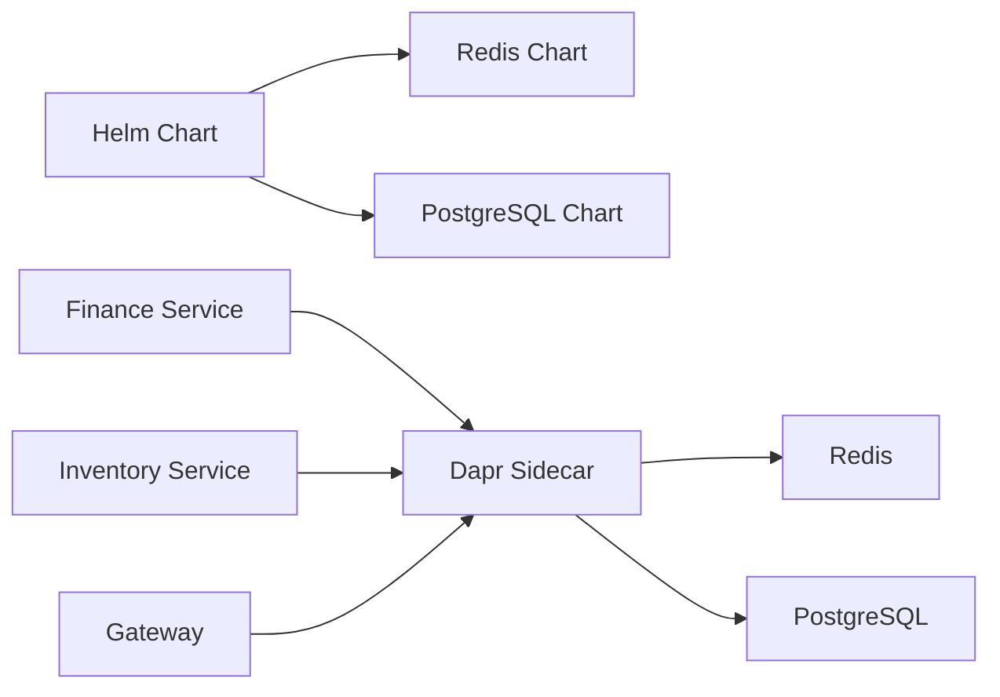

# 基础设施设计

<cite>
**本文档引用的文件**
- [init.sql](file://infrastructure/init.sql)
- [timescale-init.sql](file://infrastructure/timescale-init.sql)
- [pubsub.yaml](file://components/pubsub.yaml)
- [statestore.yaml](file://components/statestore.yaml)
- [Chart.yaml](file://deploy/helm/erp-system/Chart.yaml)
- [values.yaml](file://deploy/helm/erp-system/values.yaml)
- [configmap.yaml](file://deploy/k8s/configmap.yaml)
- [secrets.yaml](file://deploy/k8s/secrets.yaml)
- [gateway.yaml](file://deploy/k8s/services/gateway.yaml)
- [finance.yaml](file://deploy/k8s/services/finance.yaml)
- [inventory.yaml](file://deploy/k8s/services/inventory.yaml)
- [DaprEventBus.cs](file://src/BuildingBlocks/ErpSystem.BuildingBlocks/EventBus/DaprEventBus.cs)
- [CacheExtensions.cs](file://src/BuildingBlocks/ErpSystem.BuildingBlocks/Caching/CacheExtensions.cs)
- [TimescaleDataExtractor.cs](file://src/Services/Analytics/ErpSystem.Analytics/Infrastructure/TimescaleDataExtractor.cs)
- [Dockerfile（网关）](file://src/Gateways/ErpSystem.Gateway/Dockerfile)
</cite>

## 目录
1. [引言](#引言)
2. [项目结构](#项目结构)
3. [核心组件](#核心组件)
4. [架构总览](#架构总览)
5. [详细组件分析](#详细组件分析)
6. [依赖关系分析](#依赖关系分析)
7. [性能考虑](#性能考虑)
8. [故障排除指南](#故障排除指南)
9. [结论](#结论)
10. [附录](#附录)

## 引言
本文件面向DevOps工程师与企业架构师，系统性阐述该ERP微服务项目的基础设施设计，涵盖数据库与时间序列存储（PostgreSQL + TimescaleDB）、分布式缓存（Redis）、消息队列与事件总线（Dapr Redis Pub/Sub）、容器化与编排（Docker + Kubernetes/Helm）、以及监控与性能优化策略。文档以仓库现有配置与代码为依据，提供可落地的部署与运维指导。

## 项目结构
基础设施相关的关键目录与文件分布如下：
- 数据库初始化脚本：infrastructure/init.sql（多租户业务库）、infrastructure/timescale-init.sql（时序分析库）
- Dapr组件：components/pubsub.yaml、components/statestore.yaml
- Kubernetes部署：deploy/k8s 下的服务清单与共享配置
- Helm图表：deploy/helm/erp-system/Chart.yaml、values.yaml
- 微服务侧基础设施能力：事件总线与缓存扩展、时序数据提取器

**图示来源**
- [Chart.yaml](file://deploy/helm/erp-system/Chart.yaml#L18-L27)
- [values.yaml](file://deploy/helm/erp-system/values.yaml#L100-L127)
- [pubsub.yaml](file://components/pubsub.yaml#L1-L13)
- [statestore.yaml](file://components/statestore.yaml#L1-L13)
- [configmap.yaml](file://deploy/k8s/configmap.yaml#L11-L25)
- [gateway.yaml](file://deploy/k8s/services/gateway.yaml#L1-L60)
- [finance.yaml](file://deploy/k8s/services/finance.yaml#L1-L66)
- [inventory.yaml](file://deploy/k8s/services/inventory.yaml#L1-L66)

**章节来源**
- [Chart.yaml](file://deploy/helm/erp-system/Chart.yaml#L1-L27)
- [values.yaml](file://deploy/helm/erp-system/values.yaml#L1-L127)
- [configmap.yaml](file://deploy/k8s/configmap.yaml#L1-L25)
- [secrets.yaml](file://deploy/k8s/secrets.yaml#L1-L19)

## 核心组件
- 数据库与多租户业务库：通过基础设施脚本创建独立数据库，支持按业务域隔离。
- TimescaleDB时序分析库：为库存与财务成本提供高维时间序列建模、连续聚合与压缩策略。
- Redis：作为Dapr状态存储与消息发布订阅后端，支撑分布式缓存与事件总线。
- Dapr组件：Redis Pub/Sub与Redis State Store在Kubernetes中通过Dapr Sidecar注入使用。
- 事件总线：基于Dapr Redis Pub/Sub的事件发布机制，采用类型名作为主题约定。
- 缓存：基于Microsoft.Extensions.Caching.Distributed的分布式缓存扩展，提供键构建与读写封装。
- 时序数据提取：Analytics服务通过Npgsql连接TimescaleDB，查询连续聚合与统计视图。

**章节来源**
- [init.sql](file://infrastructure/init.sql#L1-L9)
- [timescale-init.sql](file://infrastructure/timescale-init.sql#L1-L140)
- [pubsub.yaml](file://components/pubsub.yaml#L1-L13)
- [statestore.yaml](file://components/statestore.yaml#L1-L13)
- [DaprEventBus.cs](file://src/BuildingBlocks/ErpSystem.BuildingBlocks/EventBus/DaprEventBus.cs#L1-L44)
- [CacheExtensions.cs](file://src/BuildingBlocks/ErpSystem.BuildingBlocks/Caching/CacheExtensions.cs#L1-L72)
- [TimescaleDataExtractor.cs](file://src/Services/Analytics/ErpSystem.Analytics/Infrastructure/TimescaleDataExtractor.cs#L1-L147)

## 架构总览
下图展示从Kubernetes到Dapr、再到各微服务与外部系统的整体交互路径，以及数据库与缓存的依赖关系。

**图示来源**
- [configmap.yaml](file://deploy/k8s/configmap.yaml#L1-L25)
- [secrets.yaml](file://deploy/k8s/secrets.yaml#L1-L19)
- [gateway.yaml](file://deploy/k8s/services/gateway.yaml#L1-L60)
- [finance.yaml](file://deploy/k8s/services/finance.yaml#L1-L66)
- [inventory.yaml](file://deploy/k8s/services/inventory.yaml#L1-L66)
- [pubsub.yaml](file://components/pubsub.yaml#L1-L13)
- [statestore.yaml](file://components/statestore.yaml#L1-L13)

## 详细组件分析

### 数据库设计与TimescaleDB集成
- 多租户业务库：基础设施脚本创建多个独立数据库，便于按业务域隔离与权限控制。
- TimescaleDB时序库：
  - 创建扩展与数据库，建立库存交易与成本移动的超表（hypertable），并设置分区键为时间戳。
  - 建立常用索引以优化按物料、仓库、来源等维度的查询。
  - 定义连续聚合物化视图（如日度库存汇总），并配置刷新策略与保留策略。
  - 提供高级特性（Pro级别）：原生压缩、分段键与排序策略；间隙填充与统计聚合视图；工具包函数用于异常检测。
- 迁移策略建议：
  - 使用版本化的DDL脚本管理模式变更，结合CI/CD流水线在预生产环境先行验证。
  - 对历史数据进行批量导入，启用压缩策略以降低存储成本。
  - 通过保留策略自动清理过期明细数据，仅保留必要周期的历史快照。

**图示来源**
- [timescale-init.sql](file://infrastructure/timescale-init.sql#L14-L84)
- [timescale-init.sql](file://infrastructure/timescale-init.sql#L58-L84)
- [timescale-init.sql](file://infrastructure/timescale-init.sql#L119-L136)

**章节来源**
- [init.sql](file://infrastructure/init.sql#L1-L9)
- [timescale-init.sql](file://infrastructure/timescale-init.sql#L1-L140)

### 缓存策略与Redis实现
- 组件与配置：
  - Dapr Redis State Store与Pub/Sub组件通过components目录中的YAML声明，Sidecar注入后由服务使用。
  - Kubernetes ConfigMap提供Redis连接字符串与Dapr端口等运行时参数。
- 缓存扩展：
  - 提供分布式缓存的泛型Get/Set/GetOrSet扩展方法，支持绝对过期与滑动过期。
  - 提供统一的缓存键构建器，按实体类别与标识生成稳定键空间。
- 使用建议：
  - 对热点查询结果与跨服务聚合数据进行缓存，结合滑动过期提升命中率。
  - 对于强一致要求的数据，采用读写屏障或失效策略避免脏读。

**图示来源**
- [CacheExtensions.cs](file://src/BuildingBlocks/ErpSystem.BuildingBlocks/Caching/CacheExtensions.cs#L9-L72)
- [DaprEventBus.cs](file://src/BuildingBlocks/ErpSystem.BuildingBlocks/EventBus/DaprEventBus.cs#L11-L27)

**章节来源**
- [pubsub.yaml](file://components/pubsub.yaml#L1-L13)
- [statestore.yaml](file://components/statestore.yaml#L1-L13)
- [configmap.yaml](file://deploy/k8s/configmap.yaml#L14-L15)
- [CacheExtensions.cs](file://src/BuildingBlocks/ErpSystem.BuildingBlocks/Caching/CacheExtensions.cs#L1-L72)

### 消息队列与事件总线设计（Dapr + Redis）
- 组件定义：
  - Redis Pub/Sub与Redis State作为Dapr组件，分别用于事件发布订阅与状态存储。
- 事件发布：
  - 事件总线实现将事件类型名作为主题名发布到指定Pub/Sub名称。
  - 支持Dummy实现用于开发测试场景。
- 服务集成：
  - 各微服务Deployment通过注解启用Dapr，Sidecar负责与Redis通信。
- 设计要点：
  - 主题命名规范与订阅方一致性是解耦的关键。
  - 结合Kubernetes服务发现，通过内部DNS解析服务URL。

**图示来源**
- [DaprEventBus.cs](file://src/BuildingBlocks/ErpSystem.BuildingBlocks/EventBus/DaprEventBus.cs#L21-L26)
- [pubsub.yaml](file://components/pubsub.yaml#L6-L12)
- [finance.yaml](file://deploy/k8s/services/finance.yaml#L19-L22)
- [inventory.yaml](file://deploy/k8s/services/inventory.yaml#L19-L22)

**章节来源**
- [DaprEventBus.cs](file://src/BuildingBlocks/ErpSystem.BuildingBlocks/EventBus/DaprEventBus.cs#L1-L44)
- [pubsub.yaml](file://components/pubsub.yaml#L1-L13)
- [finance.yaml](file://deploy/k8s/services/finance.yaml#L1-L66)
- [inventory.yaml](file://deploy/k8s/services/inventory.yaml#L1-L66)

### PostgreSQL配置与数据迁移策略
- 配置要点：
  - Helm values中启用Bitnami PostgreSQL Chart，并配置持久化大小、用户名密码与数据库名。
  - ConfigMap中提供默认连接字符串，实际部署中应通过Secret覆盖敏感信息。
- 迁移策略：
  - 使用版本化迁移脚本，先在预生产执行，再通过CI/CD灰度到生产。
  - 对大表进行分批导入与索引重建，避免长时间锁表。
  - 通过逻辑复制或备份恢复策略保障回滚与灾备。

**章节来源**
- [values.yaml](file://deploy/helm/erp-system/values.yaml#L100-L109)
- [configmap.yaml](file://deploy/k8s/configmap.yaml#L11-L12)
- [secrets.yaml](file://deploy/k8s/secrets.yaml#L8-L9)

### 容器化策略、Docker镜像构建与Kubernetes部署
- Docker镜像：
  - 网关服务使用多阶段构建，先在SDK镜像中还原与构建，再在ASP.NET运行时镜像中发布与启动。
- Kubernetes部署：
  - 通过Deployment定义副本数、探针与资源限制；Service暴露服务。
  - Gateway使用LoadBalancer类型对外提供入口；其他服务使用ClusterIP。
- Helm图表：
  - Chart声明依赖Bitnami Redis与PostgreSQL；values提供全局命名空间、镜像仓库、副本数、Ingress与Dapr开关等。

**图示来源**
- [Dockerfile（网关）](file://src/Gateways/ErpSystem.Gateway/Dockerfile#L1-L22)
- [Chart.yaml](file://deploy/helm/erp-system/Chart.yaml#L18-L27)
- [values.yaml](file://deploy/helm/erp-system/values.yaml#L1-L127)
- [gateway.yaml](file://deploy/k8s/services/gateway.yaml#L1-L60)
- [finance.yaml](file://deploy/k8s/services/finance.yaml#L1-L66)
- [inventory.yaml](file://deploy/k8s/services/inventory.yaml#L1-L66)

**章节来源**
- [Dockerfile（网关）](file://src/Gateways/ErpSystem.Gateway/Dockerfile#L1-L22)
- [Chart.yaml](file://deploy/helm/erp-system/Chart.yaml#L1-L27)
- [values.yaml](file://deploy/helm/erp-system/values.yaml#L1-L127)
- [gateway.yaml](file://deploy/k8s/services/gateway.yaml#L1-L60)
- [finance.yaml](file://deploy/k8s/services/finance.yaml#L1-L66)
- [inventory.yaml](file://deploy/k8s/services/inventory.yaml#L1-L66)

### 服务发现与负载均衡
- 服务发现：通过Kubernetes内部DNS（服务名.命名空间.svc.cluster.local）解析服务URL。
- 负载均衡：Service为ClusterIP时由集群网络进行轮询LB；Gateway使用LoadBalancer对外暴露。
- Dapr集成：通过Sidecar注入与组件配置，服务间通信无需硬编码外部地址。

**章节来源**
- [configmap.yaml](file://deploy/k8s/configmap.yaml#L17-L24)
- [gateway.yaml](file://deploy/k8s/services/gateway.yaml#L54-L60)
- [finance.yaml](file://deploy/k8s/services/finance.yaml#L54-L66)
- [inventory.yaml](file://deploy/k8s/services/inventory.yaml#L54-L66)

### 监控告警、日志收集与性能优化
- 探针与健康检查：各服务配置liveness与readiness探针，确保滚动升级与自愈。
- 日志与可观测性：建议在Dapr与各服务中启用结构化日志，结合集中式日志收集（如EFK/ELK）与指标采集（Prometheus）。
- 性能优化：
  - TimescaleDB：利用超表分区、连续聚合与压缩策略；合理设置刷新与保留策略。
  - 缓存：对热点数据设置滑动过期，避免缓存穿透；键空间规范化减少碎片。
  - 数据库：为高频查询字段建立索引，拆分读写库或引入只读副本。

**章节来源**
- [gateway.yaml](file://deploy/k8s/services/gateway.yaml#L35-L46)
- [finance.yaml](file://deploy/k8s/services/finance.yaml#L41-L52)
- [inventory.yaml](file://deploy/k8s/services/inventory.yaml#L41-L52)
- [timescale-init.sql](file://infrastructure/timescale-init.sql#L78-L101)

## 依赖关系分析
- Helm依赖：Redis与PostgreSQL Chart作为子依赖，简化外部依赖管理。
- 运行时依赖：各微服务通过Dapr Sidecar访问Redis与PostgreSQL；ConfigMap/Secret提供配置与密钥。
- 服务间依赖：事件总线通过Redis Pub/Sub实现松耦合；服务URL通过内部DNS解析。

**图示来源**
- [Chart.yaml](file://deploy/helm/erp-system/Chart.yaml#L18-L27)
- [values.yaml](file://deploy/helm/erp-system/values.yaml#L110-L123)
- [finance.yaml](file://deploy/k8s/services/finance.yaml#L19-L22)
- [inventory.yaml](file://deploy/k8s/services/inventory.yaml#L19-L22)
- [gateway.yaml](file://deploy/k8s/services/gateway.yaml#L20-L22)

**章节来源**
- [Chart.yaml](file://deploy/helm/erp-system/Chart.yaml#L1-L27)
- [values.yaml](file://deploy/helm/erp-system/values.yaml#L1-L127)

## 性能考虑
- 数据库层：
  - TimescaleDB超表与连续聚合显著提升时间序列查询性能；压缩策略降低存储与IO开销。
  - 合理的索引策略与查询谓词，避免全表扫描。
- 缓存层：
  - 使用滑动过期与键空间规范化，提高命中率与降低碎片。
  - 对跨服务聚合数据进行缓存，减少重复计算。
- 运行时层：
  - 合理设置Pod资源请求与限制，避免资源争用。
  - 利用探针与健康检查保障服务稳定性，缩短故障恢复时间。

## 故障排除指南
- 事件未送达：
  - 检查Dapr Pub/Sub组件是否正确加载，确认主题名与订阅方一致。
  - 查看Sidecar日志与Redis Pub/Sub通道状态。
- 缓存不可用：
  - 校验Redis连接字符串与认证配置；确认Dapr State组件已注入。
- 数据库连接失败：
  - 核对ConfigMap中的连接字符串与Secret中的密码；确认PostgreSQL服务可达。
- TimescaleDB查询异常：
  - 检查连续聚合刷新策略与保留策略；确认所需扩展与视图存在。

**章节来源**
- [pubsub.yaml](file://components/pubsub.yaml#L1-L13)
- [statestore.yaml](file://components/statestore.yaml#L1-L13)
- [configmap.yaml](file://deploy/k8s/configmap.yaml#L11-L15)
- [secrets.yaml](file://deploy/k8s/secrets.yaml#L8-L18)
- [timescale-init.sql](file://infrastructure/timescale-init.sql#L78-L84)

## 结论
该基础设施以Kubernetes为运行平台，结合Helm简化依赖管理，采用Dapr统一抽象消息与状态，使用Redis提供高性能缓存与事件总线，以TimescaleDB强化时序数据分析能力。通过合理的数据库设计、缓存策略与监控体系，可在保证性能的同时提升可维护性与可扩展性。建议在生产环境中进一步完善安全加固、备份与灾难恢复策略，并持续优化查询与聚合策略以满足业务增长需求。

## 附录
- 部署清单参考：
  - 使用Helm安装Redis与PostgreSQL子Chart，再安装主Chart。
  - 应用ConfigMap与Secret，确保非敏感与敏感配置分离。
  - 部署各微服务的Deployment与Service，启用Dapr Sidecar。
- 开发与测试：
  - 在本地使用Docker Compose或Kind/K3s快速搭建环境。
  - 使用DummyEventBus与本地缓存进行功能验证。