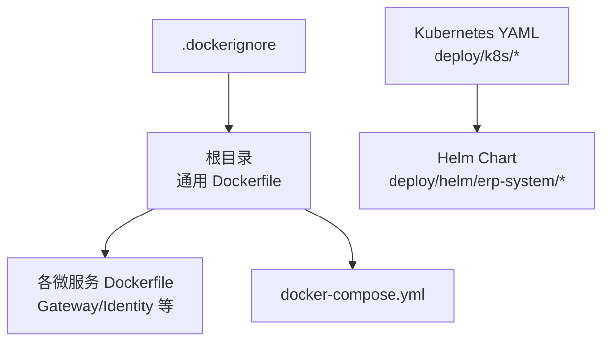
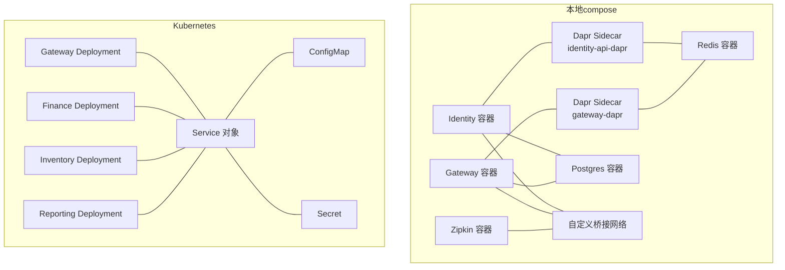
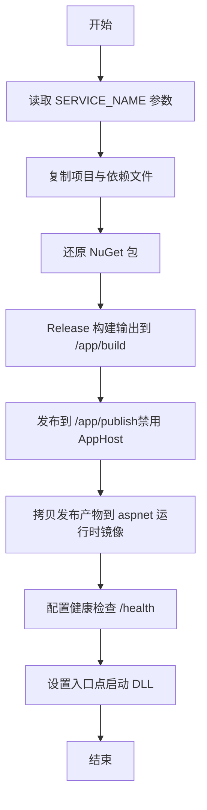
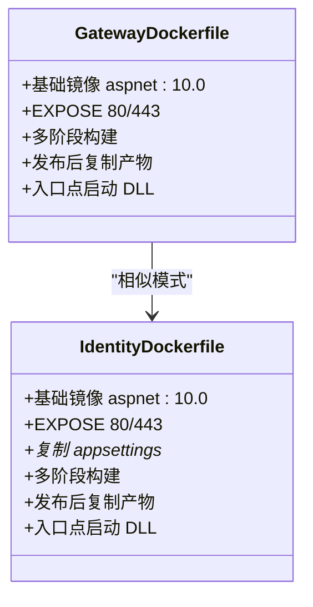
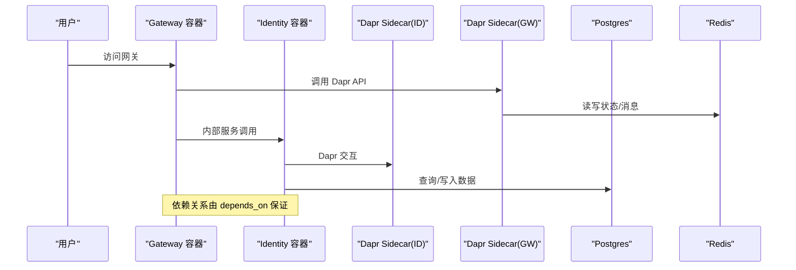
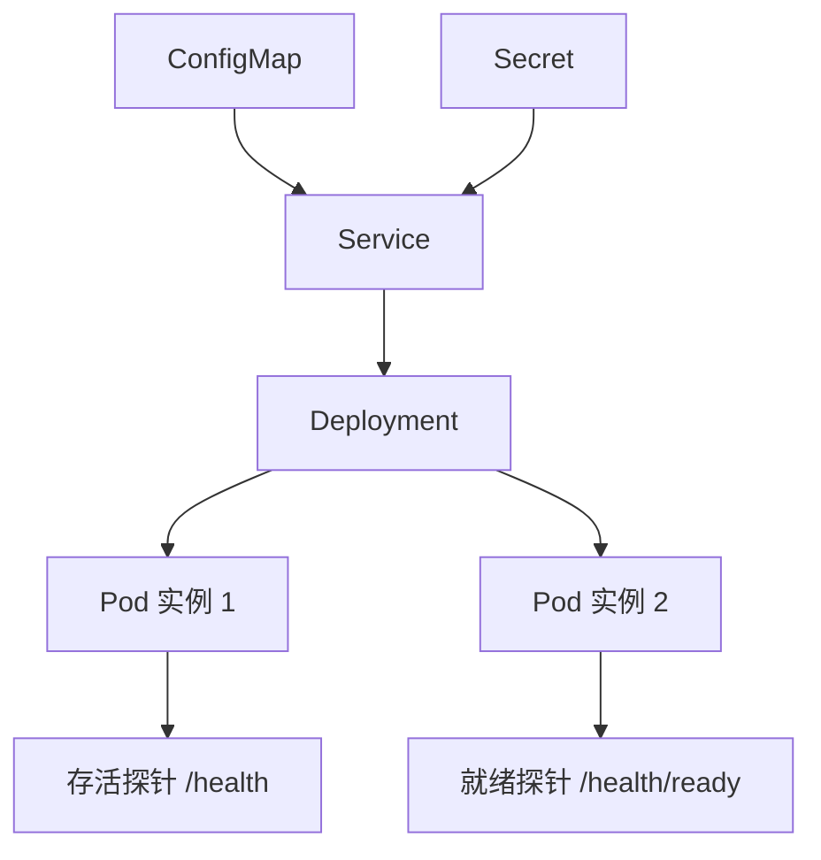
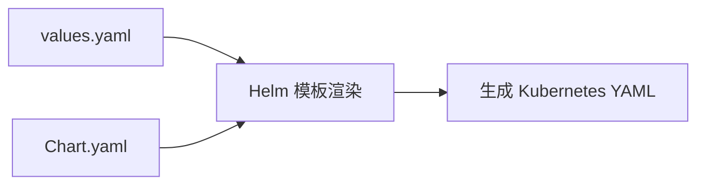
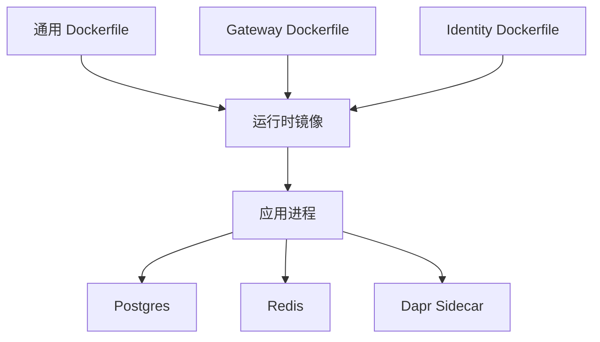

# 容器化策略

<cite>
**本文引用的文件**
- [Dockerfile（通用多阶段）](file://Dockerfile)
- [.dockerignore](file://src/.dockerignore)
- [docker-compose.yml](file://docker-compose.yml)
- [Gateway 微服务 Dockerfile](file://src/Gateways/ErpSystem.Gateway/Dockerfile)
- [Identity 微服务 Dockerfile](file://src/Services/Identity/ErpSystem.Identity/Dockerfile)
- [Kubernetes 网关部署](file://deploy/k8s/services/gateway.yaml)
- [Kubernetes 财务服务部署](file://deploy/k8s/services/finance.yaml)
- [Kubernetes 库存服务部署](file://deploy/k8s/services/inventory.yaml)
- [Kubernetes 报表服务部署](file://deploy/k8s/services/reporting.yaml)
- [Kubernetes 配置字典](file://deploy/k8s/configmap.yaml)
- [Kubernetes 密钥](file://deploy/k8s/secrets.yaml)
- [Helm Chart 概览](file://deploy/helm/erp-system/Chart.yaml)
- [Helm Values 配置](file://deploy/helm/erp-system/values.yaml)
</cite>

## 目录
1. [简介](#简介)
2. [项目结构](#项目结构)
3. [核心组件](#核心组件)
4. [架构总览](#架构总览)
5. [详细组件分析](#详细组件分析)
6. [依赖分析](#依赖分析)
7. [性能考虑](#性能考虑)
8. [故障排查指南](#故障排查指南)
9. [结论](#结论)
10. [附录](#附录)

## 简介
本文件系统性阐述本 ERP 微服务项目的容器化策略，覆盖以下主题：
- Docker 镜像构建：多阶段构建、镜像体积控制与健康检查
- docker-compose 编排：服务依赖、网络与卷挂载
- 各微服务 Dockerfile 配置要点：基础镜像、环境变量与健康检查
- 容器安全最佳实践：非 root 运行、最小权限与敏感信息保护
- 容器网络与端口映射、服务发现
- 监控、日志与资源限制
- CI/CD 流水线集成与自动化部署建议

## 项目结构
容器化相关文件分布于根目录与 deploy 目录中，采用“通用 Dockerfile + 多服务专用 Dockerfile + compose 编排 + Kubernetes/Helm 渲染”的分层组织方式。

图表来源
- [Dockerfile（通用多阶段）](file://Dockerfile#L1-L37)
- [Gateway 微服务 Dockerfile](file://src/Gateways/ErpSystem.Gateway/Dockerfile#L1-L22)
- [Identity 微服务 Dockerfile](file://src/Services/Identity/ErpSystem.Identity/Dockerfile#L1-L24)
- [docker-compose.yml](file://docker-compose.yml#L1-L99)
- [Helm Chart 概览](file://deploy/helm/erp-system/Chart.yaml#L1-L27)
- [Helm Values 配置](file://deploy/helm/erp-system/values.yaml#L1-L127)

章节来源
- [Dockerfile（通用多阶段）](file://Dockerfile#L1-L37)
- [docker-compose.yml](file://docker-compose.yml#L1-L99)
- [Helm Chart 概览](file://deploy/helm/erp-system/Chart.yaml#L1-L27)
- [Helm Values 配置](file://deploy/helm/erp-system/values.yaml#L1-L127)

## 核心组件
- 通用多阶段 Dockerfile：统一构建流程，支持通过参数切换服务，最终以 aspnet 运行时为基础镜像，内置健康检查。
- 各微服务专用 Dockerfile：针对单体服务进行精简复制与发布，确保镜像最小化。
- docker-compose：本地开发与测试环境的服务编排，含数据库、缓存、Dapr sidecar、Zipkin 等。
- Kubernetes 渲染：通过 Deployment/Service/ConfigMap/Secret 管理服务生命周期与配置注入。
- Helm Chart：集中管理服务副本数、镜像仓库标签、Ingress/DB/Redis/Dapr 等可配置项。

章节来源
- [Dockerfile（通用多阶段）](file://Dockerfile#L1-L37)
- [Gateway 微服务 Dockerfile](file://src/Gateways/ErpSystem.Gateway/Dockerfile#L1-L22)
- [Identity 微服务 Dockerfile](file://src/Services/Identity/ErpSystem.Identity/Dockerfile#L1-L24)
- [docker-compose.yml](file://docker-compose.yml#L1-L99)
- [Kubernetes 网关部署](file://deploy/k8s/services/gateway.yaml#L1-L60)
- [Kubernetes 配置字典](file://deploy/k8s/configmap.yaml#L1-L25)
- [Kubernetes 密钥](file://deploy/k8s/secrets.yaml#L1-L19)
- [Helm Chart 概览](file://deploy/helm/erp-system/Chart.yaml#L1-L27)
- [Helm Values 配置](file://deploy/helm/erp-system/values.yaml#L1-L127)

## 架构总览
下图展示容器化在本地与 Kubernetes 的两种运行形态及关键交互：

图表来源
- [docker-compose.yml](file://docker-compose.yml#L1-L99)
- [Kubernetes 网关部署](file://deploy/k8s/services/gateway.yaml#L1-L60)
- [Kubernetes 财务服务部署](file://deploy/k8s/services/finance.yaml#L1-L66)
- [Kubernetes 库存服务部署](file://deploy/k8s/services/inventory.yaml#L1-L66)
- [Kubernetes 报表服务部署](file://deploy/k8s/services/reporting.yaml#L1-L64)
- [Kubernetes 配置字典](file://deploy/k8s/configmap.yaml#L1-L25)
- [Kubernetes 密钥](file://deploy/k8s/secrets.yaml#L1-L19)

## 详细组件分析

### 通用多阶段 Dockerfile（适用于所有微服务）
- 多阶段构建：使用 SDK 阶段进行 restore/build/publish，最终以 aspnet 运行时为基础镜像，显著减小镜像体积。
- 健康检查：通过 HTTP 探针暴露 /health，结合启动期与重试策略提升容器编排稳定性。
- 参数化：通过构建参数切换服务名，便于统一模板复用。

图表来源
- [Dockerfile（通用多阶段）](file://Dockerfile#L1-L37)

章节来源
- [Dockerfile（通用多阶段）](file://Dockerfile#L1-L37)

### 各微服务专用 Dockerfile（示例：Gateway、Identity）
- Gateway：独立的 aspnet 基础镜像，直接从发布阶段复制产物，适合网关类轻量服务。
- Identity：与通用模板一致，但显式复制了 appsettings 文件，确保配置随镜像分发。

图表来源
- [Gateway 微服务 Dockerfile](file://src/Gateways/ErpSystem.Gateway/Dockerfile#L1-L22)
- [Identity 微服务 Dockerfile](file://src/Services/Identity/ErpSystem.Identity/Dockerfile#L1-L24)

章节来源
- [Gateway 微服务 Dockerfile](file://src/Gateways/ErpSystem.Gateway/Dockerfile#L1-L22)
- [Identity 微服务 Dockerfile](file://src/Services/Identity/ErpSystem.Identity/Dockerfile#L1-L24)

### docker-compose 编排配置
- 服务依赖：通过 depends_on 控制启动顺序；Dapr sidecar 与应用服务在同一网络模式下运行。
- 网络：自定义桥接网络，隔离服务通信。
- 卷挂载：Postgres 数据持久化与初始化脚本挂载。
- 环境变量：ASP.NET Core URL、数据库连接字符串等。

图表来源
- [docker-compose.yml](file://docker-compose.yml#L1-L99)

章节来源
- [docker-compose.yml](file://docker-compose.yml#L1-L99)

### Kubernetes 部署与资源限制
- Deployment：定义副本数、探针、资源请求/限制、Dapr 注解。
- Service：ClusterIP 或 LoadBalancer 类型，配合 Ingress 暴露。
- ConfigMap/Secret：集中注入环境变量与敏感信息（生产环境建议 Secret）。

图表来源
- [Kubernetes 网关部署](file://deploy/k8s/services/gateway.yaml#L1-L60)
- [Kubernetes 财务服务部署](file://deploy/k8s/services/finance.yaml#L1-L66)
- [Kubernetes 库存服务部署](file://deploy/k8s/services/inventory.yaml#L1-L66)
- [Kubernetes 报表服务部署](file://deploy/k8s/services/reporting.yaml#L1-L64)
- [Kubernetes 配置字典](file://deploy/k8s/configmap.yaml#L1-L25)
- [Kubernetes 密钥](file://deploy/k8s/secrets.yaml#L1-L19)

章节来源
- [Kubernetes 网关部署](file://deploy/k8s/services/gateway.yaml#L1-L60)
- [Kubernetes 财务服务部署](file://deploy/k8s/services/finance.yaml#L1-L66)
- [Kubernetes 库存服务部署](file://deploy/k8s/services/inventory.yaml#L1-L66)
- [Kubernetes 报表服务部署](file://deploy/k8s/services/reporting.yaml#L1-L64)
- [Kubernetes 配置字典](file://deploy/k8s/configmap.yaml#L1-L25)
- [Kubernetes 密钥](file://deploy/k8s/secrets.yaml#L1-L19)

### Helm Chart 与 Values
- Chart.yaml：声明依赖（Redis、PostgreSQL），便于一键安装。
- values.yaml：集中管理镜像仓库、标签、副本数、Ingress 主机、数据库/Redis 配置、Dapr 组件等。

图表来源
- [Helm Chart 概览](file://deploy/helm/erp-system/Chart.yaml#L1-L27)
- [Helm Values 配置](file://deploy/helm/erp-system/values.yaml#L1-L127)

章节来源
- [Helm Chart 概览](file://deploy/helm/erp-system/Chart.yaml#L1-L27)
- [Helm Values 配置](file://deploy/helm/erp-system/values.yaml#L1-L127)

## 依赖分析
- 构建依赖：通用 Dockerfile 依赖 .NET 10 SDK/ASP.NET 运行时；各服务 Dockerfile 依赖对应项目 csproj。
- 运行依赖：Postgres、Redis、Dapr Placement、Zipkin（compose）；Kubernetes 中通过 ConfigMap/Secret 注入连接信息。
- 服务间依赖：compose 中通过 depends_on 与 sidecar 共享网络；Kubernetes 中通过 Service DNS 解析实现服务发现。

图表来源
- [Dockerfile（通用多阶段）](file://Dockerfile#L1-L37)
- [Gateway 微服务 Dockerfile](file://src/Gateways/ErpSystem.Gateway/Dockerfile#L1-L22)
- [Identity 微服务 Dockerfile](file://src/Services/Identity/ErpSystem.Identity/Dockerfile#L1-L24)
- [docker-compose.yml](file://docker-compose.yml#L1-L99)

章节来源
- [Dockerfile（通用多阶段）](file://Dockerfile#L1-L37)
- [Gateway 微服务 Dockerfile](file://src/Gateways/ErpSystem.Gateway/Dockerfile#L1-L22)
- [Identity 微服务 Dockerfile](file://src/Services/Identity/ErpSystem.Identity/Dockerfile#L1-L24)
- [docker-compose.yml](file://docker-compose.yml#L1-L99)

## 性能考虑
- 多阶段构建：减少最终镜像体积，降低拉取与启动时间。
- 层缓存：优先复制 csproj 与 restore，再复制源码，提升增量构建效率。
- 健康检查：合理设置间隔与超时，避免频繁重启。
- 资源限制：为不同服务设定合理的 requests/limits，防止资源争抢。
- 网络与存储：compose 使用桥接网络与命名卷，Kubernetes 使用 PVC/ConfigMap/Secret，确保稳定与可扩展。

章节来源
- [Dockerfile（通用多阶段）](file://Dockerfile#L1-L37)
- [src/.dockerignore](file://src/.dockerignore#L1-L20)
- [Kubernetes 网关部署](file://deploy/k8s/services/gateway.yaml#L28-L46)
- [Kubernetes 财务服务部署](file://deploy/k8s/services/finance.yaml#L34-L52)
- [Kubernetes 库存服务部署](file://deploy/k8s/services/inventory.yaml#L34-L52)
- [Kubernetes 报表服务部署](file://deploy/k8s/services/reporting.yaml#L32-L50)

## 故障排查指南
- 健康检查失败：检查 /health 与 /health/ready 路径是否正确暴露，探针间隔与超时是否合理。
- 端口冲突：compose 中确认主机端口映射唯一；Kubernetes 中确认 Service/Ingress 端口未被占用。
- 配置注入问题：确认 ConfigMap/Secret 名称与键一致，envFrom 是否正确引用。
- 依赖服务不可达：compose 中检查 depends_on 与 sidecar 网络；Kubernetes 中检查 Service DNS 与命名空间。
- 镜像构建失败：核对 .dockerignore 是否排除了不必要的文件，restore/build/publish 步骤是否成功。

章节来源
- [Kubernetes 网关部署](file://deploy/k8s/services/gateway.yaml#L35-L46)
- [Kubernetes 财务服务部署](file://deploy/k8s/services/finance.yaml#L41-L52)
- [Kubernetes 库存服务部署](file://deploy/k8s/services/inventory.yaml#L41-L52)
- [Kubernetes 报表服务部署](file://deploy/k8s/services/reporting.yaml#L39-L50)
- [docker-compose.yml](file://docker-compose.yml#L1-L99)
- [Helm Values 配置](file://deploy/helm/erp-system/values.yaml#L1-L127)

## 结论
本项目采用“通用多阶段 Dockerfile + 服务专用 Dockerfile + compose/Kubernetes/Helm”的容器化方案，实现了：
- 可复用的构建模板与最小化镜像体积
- 明确的服务依赖与网络拓扑
- 集中的配置与密钥管理
- 健壮的健康检查与资源限制
建议在生产环境中进一步强化非 root 运行、镜像安全扫描与 CI/CD 自动化。

## 附录

### 容器安全最佳实践
- 非 root 用户运行：在 Dockerfile 中添加用户与权限设置，避免以 root 启动进程。
- 最小权限原则：仅授予容器运行所需的最小权限，避免特权模式。
- 敏感信息保护：使用 Secret 管理密码、密钥与令牌，避免硬编码在镜像或配置中。
- 镜像安全扫描：在 CI 中集成镜像扫描步骤，阻断高危漏洞镜像上线。
- 网络隔离：使用命名网络或 Kubernetes 命名空间隔离不同环境与租户。

章节来源
- [Kubernetes 密钥](file://deploy/k8s/secrets.yaml#L1-L19)
- [Helm Values 配置](file://deploy/helm/erp-system/values.yaml#L124-L127)

### 容器网络与服务发现
- 端口映射：compose 中将容器端口映射到宿主；Kubernetes 中通过 Service 暴露。
- 服务发现：Kubernetes 使用 Service DNS（如 service-name.namespace）解析；compose 使用服务名。
- Dapr：Sidecar 提供服务调用、状态存储与消息订阅抽象，简化微服务通信。

章节来源
- [docker-compose.yml](file://docker-compose.yml#L1-L99)
- [Kubernetes 配置字典](file://deploy/k8s/configmap.yaml#L17-L24)
- [Kubernetes 财务服务部署](file://deploy/k8s/services/finance.yaml#L19-L22)

### 监控、日志与资源限制
- 探针：liveness/readiness 探针定期检查健康状态。
- 日志：建议统一采集容器 stdout/stderr 并集中存储。
- 资源：为不同服务设置 requests/limits，避免资源争抢。

章节来源
- [Kubernetes 网关部署](file://deploy/k8s/services/gateway.yaml#L35-L46)
- [Kubernetes 财务服务部署](file://deploy/k8s/services/finance.yaml#L41-L52)
- [Kubernetes 库存服务部署](file://deploy/k8s/services/inventory.yaml#L41-L52)
- [Kubernetes 报表服务部署](file://deploy/k8s/services/reporting.yaml#L39-L50)

### CI/CD 流水线集成与自动化部署
- 构建：在 CI 中执行 docker build（或 kaniko）与 docker push，按服务产出镜像。
- 扫描：集成镜像安全扫描工具，阻断高危镜像。
- 部署：使用 Helm 或 kubectl 应用 Kubernetes YAML；compose 用于本地开发。
- 发布策略：蓝绿/金丝雀发布，结合探针与滚动更新。

章节来源
- [Helm Chart 概览](file://deploy/helm/erp-system/Chart.yaml#L1-L27)
- [Helm Values 配置](file://deploy/helm/erp-system/values.yaml#L1-L127)
- [docker-compose.yml](file://docker-compose.yml#L1-L99)