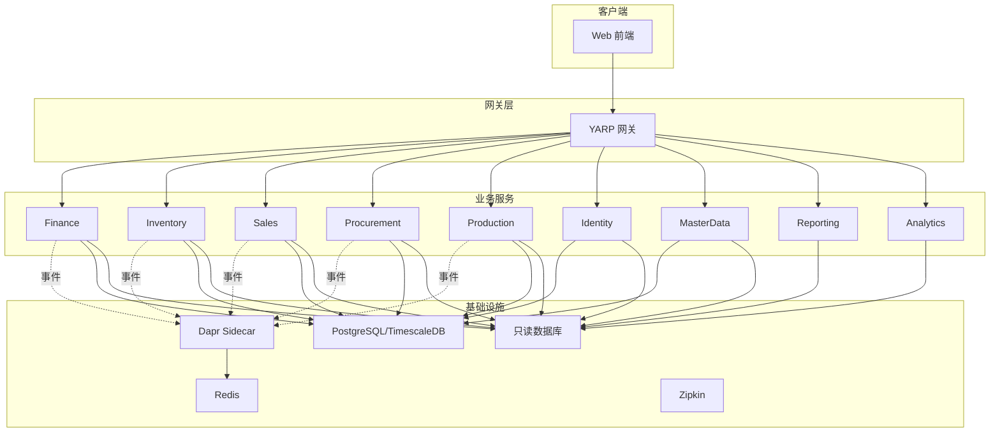
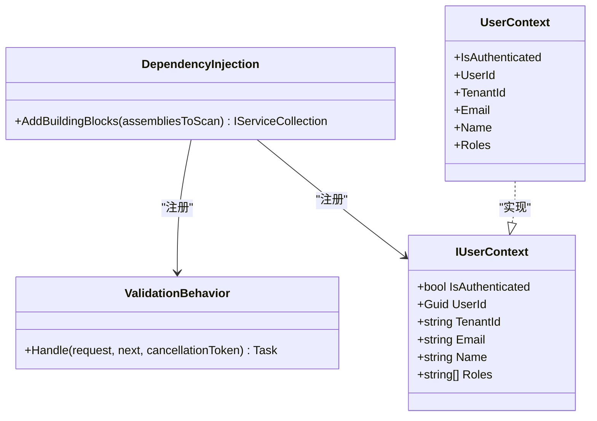
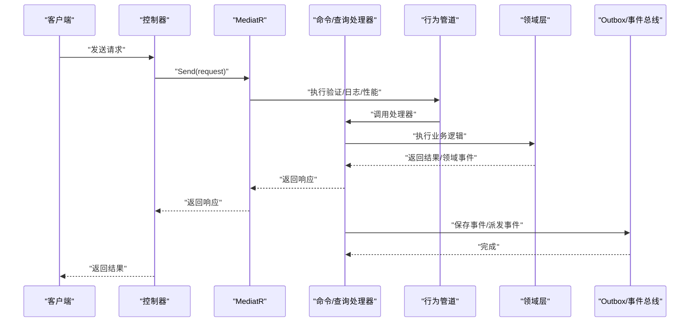
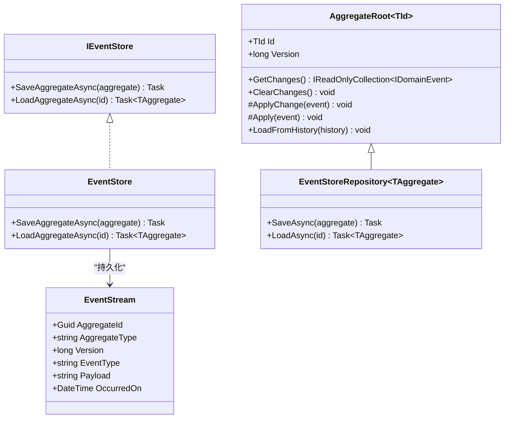
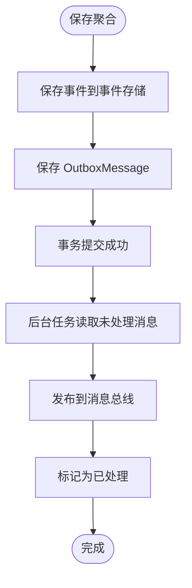
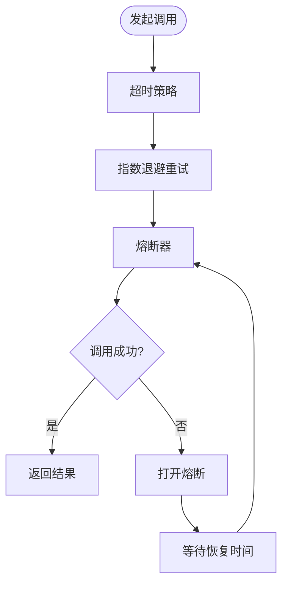
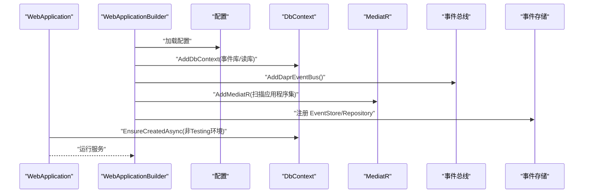
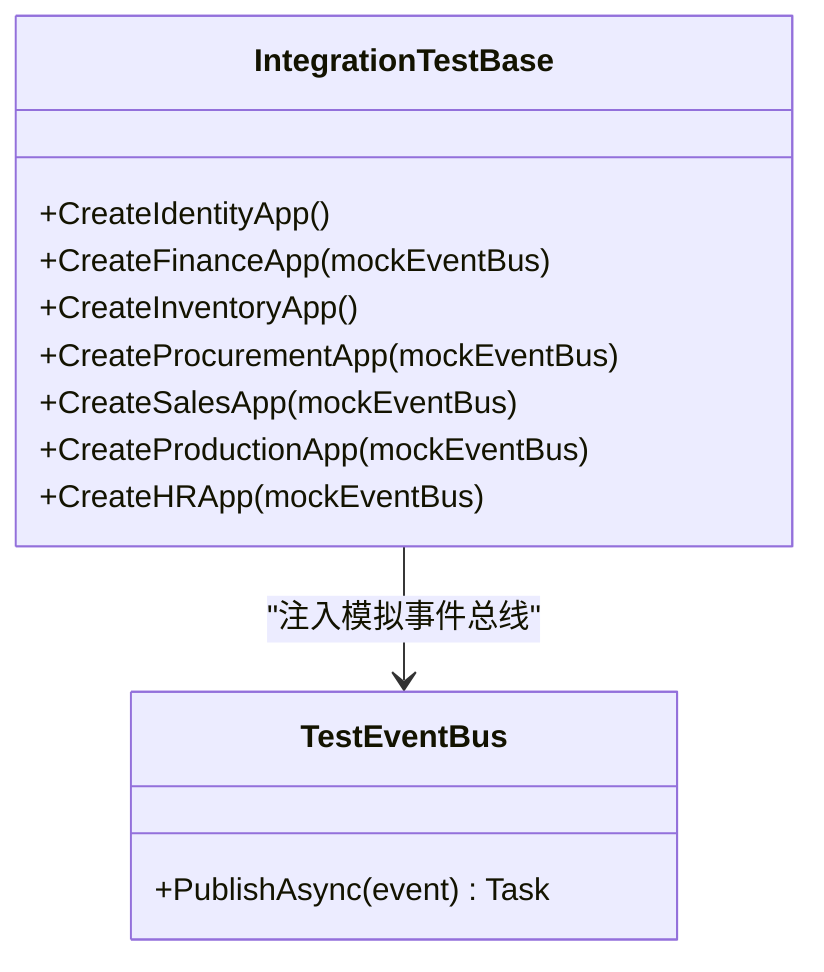
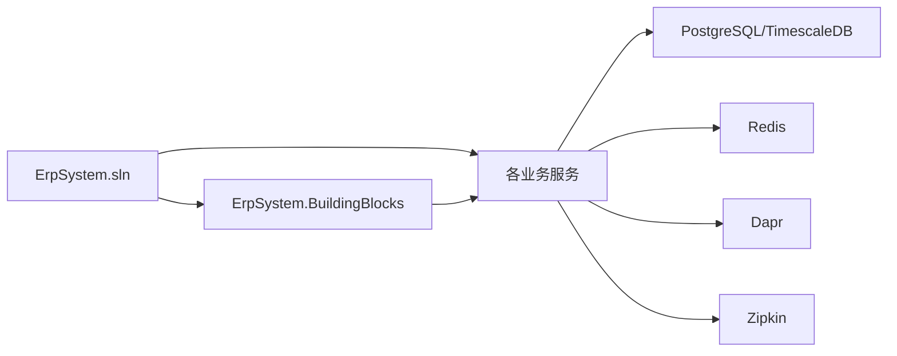

# 开发指南

<cite>
**本文引用的文件**
- [README.md](file://README.md)
- [DEVELOPMENT_PLAN.md](file://DEVELOPMENT_PLAN.md)
- [src/ErpSystem.sln](file://src/ErpSystem.sln)
- [docker-compose.yml](file://docker-compose.yml)
- [Dockerfile](file://Dockerfile)
- [src/BuildingBlocks/ErpSystem.BuildingBlocks/DependencyInjection.cs](file://src/BuildingBlocks/ErpSystem.BuildingBlocks/DependencyInjection.cs)
- [src/BuildingBlocks/ErpSystem.BuildingBlocks/CQRS/Abstractions.cs](file://src/BuildingBlocks/ErpSystem.BuildingBlocks/CQRS/Abstractions.cs)
- [src/BuildingBlocks/ErpSystem.BuildingBlocks/Domain/DDDBase.cs](file://src/BuildingBlocks/ErpSystem.BuildingBlocks/Domain/DDDBase.cs)
- [src/BuildingBlocks/ErpSystem.BuildingBlocks/Outbox/OutboxMessage.cs](file://src/BuildingBlocks/ErpSystem.BuildingBlocks/Outbox/OutboxMessage.cs)
- [src/BuildingBlocks/ErpSystem.BuildingBlocks/Resilience/ResiliencePolicies.cs](file://src/BuildingBlocks/ErpSystem.BuildingBlocks/Resilience/ResiliencePolicies.cs)
- [src/BuildingBlocks/ErpSystem.BuildingBlocks/Behaviors/ValidationBehavior.cs](file://src/BuildingBlocks/ErpSystem.BuildingBlocks/Behaviors/ValidationBehavior.cs)
- [src/BuildingBlocks/ErpSystem.BuildingBlocks/Auth/UserContext.cs](file://src/BuildingBlocks/ErpSystem.BuildingBlocks/Auth/UserContext.cs)
- [src/Services/Finance/ErpSystem.Finance/Program.cs](file://src/Services/Finance/ErpSystem.Finance/Program.cs)
- [src/Services/Finance/ErpSystem.Finance/appsettings.json](file://src/Services/Finance/ErpSystem.Finance/appsettings.json)
- [src/Tests/ErpSystem.IntegrationTests/IntegrationTestBase.cs](file://src/Tests/ErpSystem.IntegrationTests/IntegrationTestBase.cs)
- [docs/deployment.md](file://docs/deployment.md)
- [docs/PRD-01-MasterData-Service.md](file://docs/PRD-01-MasterData-Service.md)
</cite>

## 目录
1. [简介](#简介)
2. [项目结构](#项目结构)
3. [核心组件](#核心组件)
4. [架构总览](#架构总览)
5. [详细组件分析](#详细组件分析)
6. [依赖分析](#依赖分析)
7. [性能考虑](#性能考虑)
8. [故障排查指南](#故障排查指南)
9. [结论](#结论)
10. [附录](#附录)

## 简介
本开发指南面向新老开发者，提供从环境搭建、IDE配置、调试设置到代码规范、架构约束、新功能开发流程、分支与提交规范、本地测试与调试、贡献与评审流程、以及领域建模与事件设计最佳实践的完整指引。项目采用 .NET 10、微服务架构、Dapr 边车、事件溯源与 CQRS、TimescaleDB 时序数据库等技术栈，覆盖财务、供应链、销售、生产、HR、主数据、MRP、BI、实时分析、自动化与质量控制等多个业务模块。

## 项目结构
项目采用“解决方案 + 多微服务 + 共享内核”的结构。顶层解决方案文件组织各服务；共享内核 ErpSystem.BuildingBlocks 提供跨服务的通用能力（行为管道、CQRS 抽象、DDD 基类、事件总线、Outbox、弹性策略、鉴权上下文等）。每个业务服务包含 API 层、应用层、领域层与基础设施层，遵循 Clean Architecture 分层。

```mermaid
graph TB
subgraph "解决方案"
SLN["ErpSystem.sln"]
end
subgraph "共享内核"
BB["ErpSystem.BuildingBlocks"]
BB_CQRS["CQRS 抽象"]
BB_DDD["DDD 基类/事件存储"]
BB_Outbox["Outbox 模式"]
BB_Resilience["弹性策略"]
BB_Behaviors["行为管道"]
BB_Auth["鉴权上下文"]
end
subgraph "网关层"
GW["ErpSystem.Gateway"]
end
subgraph "核心业务服务"
FIN["Finance"]
INV["Inventory"]
SALES["Sales"]
PROC["Procurement"]
PROD["Production"]
CRM["CRM"]
PROJ["Projects"]
end
subgraph "支撑服务"
HR["HR"]
PAY["Payroll"]
ASSET["Assets"]
ID["Identity"]
MD["MasterData"]
MRP["Mrp"]
RPT["Reporting"]
end
subgraph "平台服务"
AUTO["Automation"]
QUAL["Quality"]
MAINT["Maintenance"]
SET["Settings"]
ANA["Analytics"]
end
SLN --> BB
SLN --> GW
SLN --> FIN
SLN --> INV
SLN --> SALES
SLN --> PROC
SLN --> PROD
SLN --> CRM
SLN --> PROJ
SLN --> HR
SLN --> PAY
SLN --> ASSET
SLN --> ID
SLN --> MD
SLN --> MRP
SLN --> RPT
SLN --> AUTO
SLN --> QUAL
SLN --> MAINT
SLN --> SET
SLN --> ANA
```

图示来源
- [src/ErpSystem.sln](file://src/ErpSystem.sln#L1-L400)

章节来源
- [README.md](file://README.md#L289-L323)
- [src/ErpSystem.sln](file://src/ErpSystem.sln#L1-L400)

## 核心组件
- 共享内核（BuildingBlocks）
  - CQRS 抽象：命令/查询与处理器接口，统一 MediatR 使用方式。
  - DDD 基类：聚合根、领域事件、事件流与事件存储抽象。
  - Outbox 模式：事务内消息持久化与异步派发。
  - 行为管道：验证、日志、性能、幂等、审计等横切关注点。
  - 弹性策略：超时、重试、熔断等 Polly 策略组合。
  - 鉴权上下文：从 HttpContext 提取用户标识、租户、角色等。
- 网关（YARP）：统一入口与路由转发。
- 业务服务：Finance、Inventory、Sales、Procurement、Production、CRM、Projects、HR、Payroll、Assets、MasterData、Mrp、Reporting、Automation、Quality、Maintenance、Settings、Analytics。
- 基础设施：PostgreSQL/TimescaleDB、Redis、Dapr Sidecar、Zipkin（链路追踪）、Helm/Kubernetes 部署。

章节来源
- [src/BuildingBlocks/ErpSystem.BuildingBlocks/CQRS/Abstractions.cs](file://src/BuildingBlocks/ErpSystem.BuildingBlocks/CQRS/Abstractions.cs#L1-L41)
- [src/BuildingBlocks/ErpSystem.BuildingBlocks/Domain/DDDBase.cs](file://src/BuildingBlocks/ErpSystem.BuildingBlocks/Domain/DDDBase.cs#L1-L154)
- [src/BuildingBlocks/ErpSystem.BuildingBlocks/Outbox/OutboxMessage.cs](file://src/BuildingBlocks/ErpSystem.BuildingBlocks/Outbox/OutboxMessage.cs#L1-L82)
- [src/BuildingBlocks/ErpSystem.BuildingBlocks/Behaviors/ValidationBehavior.cs](file://src/BuildingBlocks/ErpSystem.BuildingBlocks/Behaviors/ValidationBehavior.cs#L1-L34)
- [src/BuildingBlocks/ErpSystem.BuildingBlocks/Resilience/ResiliencePolicies.cs](file://src/BuildingBlocks/ErpSystem.BuildingBlocks/Resilience/ResiliencePolicies.cs#L1-L111)
- [src/BuildingBlocks/ErpSystem.BuildingBlocks/Auth/UserContext.cs](file://src/BuildingBlocks/ErpSystem.BuildingBlocks/Auth/UserContext.cs#L1-L34)

## 架构总览
系统采用微服务 + 事件驱动架构，服务间通过 Dapr Pub/Sub 与 Service Invocation 通信；事件通过 Outbox 模式可靠投递；读写分离采用 CQRS，写模型使用事件溯源，读模型通过投影更新；前端通过网关访问后端服务；可观测性通过 Zipkin、Prometheus/Grafana、Kubernetes Dashboard 实现。

图示来源
- [README.md](file://README.md#L130-L184)
- [docker-compose.yml](file://docker-compose.yml#L1-L99)

章节来源
- [README.md](file://README.md#L130-L184)
- [docs/deployment.md](file://docs/deployment.md#L1-L115)

## 详细组件分析

### 依赖注入与共享内核装配
共享内核通过扩展方法集中注册验证器、MediatR 行为、用户上下文等，确保各服务一致的行为与横切关注点。

图示来源
- [src/BuildingBlocks/ErpSystem.BuildingBlocks/DependencyInjection.cs](file://src/BuildingBlocks/ErpSystem.BuildingBlocks/DependencyInjection.cs#L1-L31)
- [src/BuildingBlocks/ErpSystem.BuildingBlocks/Behaviors/ValidationBehavior.cs](file://src/BuildingBlocks/ErpSystem.BuildingBlocks/Behaviors/ValidationBehavior.cs#L1-L34)
- [src/BuildingBlocks/ErpSystem.BuildingBlocks/Auth/UserContext.cs](file://src/BuildingBlocks/ErpSystem.BuildingBlocks/Auth/UserContext.cs#L1-L34)

章节来源
- [src/BuildingBlocks/ErpSystem.BuildingBlocks/DependencyInjection.cs](file://src/BuildingBlocks/ErpSystem.BuildingBlocks/DependencyInjection.cs#L10-L30)
- [src/BuildingBlocks/ErpSystem.BuildingBlocks/Behaviors/ValidationBehavior.cs](file://src/BuildingBlocks/ErpSystem.BuildingBlocks/Behaviors/ValidationBehavior.cs#L7-L33)
- [src/BuildingBlocks/ErpSystem.BuildingBlocks/Auth/UserContext.cs](file://src/BuildingBlocks/ErpSystem.BuildingBlocks/Auth/UserContext.cs#L6-L33)

### CQRS 与 MediatR 使用
CQRS 抽象定义了命令、查询与处理器接口，服务通过 AddMediatR 注册应用层处理器，结合行为管道实现验证、日志、性能监控等横切逻辑。

图示来源
- [src/BuildingBlocks/ErpSystem.BuildingBlocks/CQRS/Abstractions.cs](file://src/BuildingBlocks/ErpSystem.BuildingBlocks/CQRS/Abstractions.cs#L1-L41)
- [src/BuildingBlocks/ErpSystem.BuildingBlocks/DependencyInjection.cs](file://src/BuildingBlocks/ErpSystem.BuildingBlocks/DependencyInjection.cs#L12-L28)
- [src/BuildingBlocks/ErpSystem.BuildingBlocks/Behaviors/ValidationBehavior.cs](file://src/BuildingBlocks/ErpSystem.BuildingBlocks/Behaviors/ValidationBehavior.cs#L10-L32)

章节来源
- [src/BuildingBlocks/ErpSystem.BuildingBlocks/CQRS/Abstractions.cs](file://src/BuildingBlocks/ErpSystem.BuildingBlocks/CQRS/Abstractions.cs#L8-L41)
- [src/BuildingBlocks/ErpSystem.BuildingBlocks/DependencyInjection.cs](file://src/BuildingBlocks/ErpSystem.BuildingBlocks/DependencyInjection.cs#L12-L28)

### 事件溯源与聚合根
事件溯源通过事件流持久化聚合状态变更，聚合根负责应用事件并维护版本号；事件存储负责序列化/反序列化与发布领域事件。

图示来源
- [src/BuildingBlocks/ErpSystem.BuildingBlocks/Domain/DDDBase.cs](file://src/BuildingBlocks/ErpSystem.BuildingBlocks/Domain/DDDBase.cs#L14-L154)

章节来源
- [src/BuildingBlocks/ErpSystem.BuildingBlocks/Domain/DDDBase.cs](file://src/BuildingBlocks/ErpSystem.BuildingBlocks/Domain/DDDBase.cs#L14-L154)

### Outbox 模式与可靠消息
Outbox 模式确保领域事件与数据库事务一致提交，随后由后台任务批量派发至消息总线，实现最终一致性与幂等消费。

图示来源
- [src/BuildingBlocks/ErpSystem.BuildingBlocks/Outbox/OutboxMessage.cs](file://src/BuildingBlocks/ErpSystem.BuildingBlocks/Outbox/OutboxMessage.cs#L10-L82)

章节来源
- [src/BuildingBlocks/ErpSystem.BuildingBlocks/Outbox/OutboxMessage.cs](file://src/BuildingBlocks/ErpSystem.BuildingBlocks/Outbox/OutboxMessage.cs#L10-L82)

### 弹性策略与超时重试
通过 Polly 的 ResiliencePipelineBuilder 组合超时、重试与熔断策略，提升服务间调用的稳定性。

图示来源
- [src/BuildingBlocks/ErpSystem.BuildingBlocks/Resilience/ResiliencePolicies.cs](file://src/BuildingBlocks/ErpSystem.BuildingBlocks/Resilience/ResiliencePolicies.cs#L13-L111)

章节来源
- [src/BuildingBlocks/ErpSystem.BuildingBlocks/Resilience/ResiliencePolicies.cs](file://src/BuildingBlocks/ErpSystem.BuildingBlocks/Resilience/ResiliencePolicies.cs#L13-L111)

### 服务启动与数据库初始化
服务在 Program 中注册 DbContext、MediatR、事件总线与事件存储，开发环境下自动创建数据库，生产环境通过 Helm/Kubernetes 部署。

图示来源
- [src/Services/Finance/ErpSystem.Finance/Program.cs](file://src/Services/Finance/ErpSystem.Finance/Program.cs#L11-L76)
- [src/Services/Finance/ErpSystem.Finance/appsettings.json](file://src/Services/Finance/ErpSystem.Finance/appsettings.json#L1-L12)

章节来源
- [src/Services/Finance/ErpSystem.Finance/Program.cs](file://src/Services/Finance/ErpSystem.Finance/Program.cs#L11-L76)
- [src/Services/Finance/ErpSystem.Finance/appsettings.json](file://src/Services/Finance/ErpSystem.Finance/appsettings.json#L9-L12)

### 集成测试基座
集成测试基座通过 WebApplicationFactory 为各服务创建内存数据库与事件总线模拟，隔离外部依赖，便于端到端验证。

图示来源
- [src/Tests/ErpSystem.IntegrationTests/IntegrationTestBase.cs](file://src/Tests/ErpSystem.IntegrationTests/IntegrationTestBase.cs#L19-L187)

章节来源
- [src/Tests/ErpSystem.IntegrationTests/IntegrationTestBase.cs](file://src/Tests/ErpSystem.IntegrationTests/IntegrationTestBase.cs#L19-L187)

## 依赖分析
- 解决方案与服务组织：通过解决方案文件集中管理所有项目，按业务域分组，清晰体现服务边界与依赖方向。
- 共享内核与服务耦合：服务仅依赖共享内核提供的抽象与行为，降低重复实现，提升一致性。
- 外部依赖：PostgreSQL/TimescaleDB、Redis、Dapr、Zipkin、Helm/K8s。

图示来源
- [src/ErpSystem.sln](file://src/ErpSystem.sln#L1-L400)
- [docker-compose.yml](file://docker-compose.yml#L72-L84)

章节来源
- [src/ErpSystem.sln](file://src/ErpSystem.sln#L1-L400)
- [docker-compose.yml](file://docker-compose.yml#L1-L99)

## 性能考虑
- 事件溯源与投影：写模型事件存储与读模型投影分离，避免复杂查询影响写入性能。
- Outbox 批量派发：减少频繁网络调用，提高吞吐。
- 弹性策略：合理配置超时、重试与熔断，避免雪崩效应。
- 数据库索引与分区：针对高频查询字段建立索引，时序数据使用 TimescaleDB 分区。
- 缓存与分布式缓存：利用 Redis 缓存热点数据，结合 GetOrSet 扩展。
- 健康检查与资源限制：容器健康探针与 Kubernetes 资源配额保障稳定性。

## 故障排查指南
- 本地启动失败
  - 检查 PostgreSQL/TimescaleDB 与 Redis 是否正常运行，端口映射是否正确。
  - 查看容器日志与 Dapr 日志，确认 Sidecar 初始化与组件加载。
- 事件未到达消费者
  - 检查 Outbox 未处理消息表状态与派发任务日志。
  - 确认事件总线订阅与消费者处理逻辑。
- 数据库连接异常
  - 核对连接字符串与数据库凭据，确认容器网络可达。
  - 开发环境使用 EnsureCreatedAsync，生产环境使用迁移脚本。
- 集成测试失败
  - 确认 WebApplicationFactory 注入的内存数据库与模拟事件总线。
  - 检查测试环境变量与服务注册。

章节来源
- [docker-compose.yml](file://docker-compose.yml#L72-L84)
- [src/BuildingBlocks/ErpSystem.BuildingBlocks/Outbox/OutboxMessage.cs](file://src/BuildingBlocks/ErpSystem.BuildingBlocks/Outbox/OutboxMessage.cs#L57-L82)
- [src/Services/Finance/ErpSystem.Finance/Program.cs](file://src/Services/Finance/ErpSystem.Finance/Program.cs#L64-L75)
- [src/Tests/ErpSystem.IntegrationTests/IntegrationTestBase.cs](file://src/Tests/ErpSystem.IntegrationTests/IntegrationTestBase.cs#L21-L176)

## 结论
本指南提供了从环境搭建到架构实现、从开发流程到故障排查的完整路径。建议新同学先从 Finance/Identity 等核心服务入手，理解事件溯源与 CQRS 的协作方式；资深开发者可关注弹性策略、Outbox 模式与多租户隔离等高级主题。持续完善 PRD 与测试覆盖，确保交付质量与可演进性。

## 附录

### 开发环境搭建与 IDE 配置
- 前置条件
  - .NET SDK 10.0+
  - Docker 与 Docker Compose
  - PostgreSQL 16+（TimescaleDB 可选）
  - IDE：Visual Studio 2022+ 或 VS Code + C# 扩展
- 快速启动
  - 构建与测试：dotnet build 与 dotnet test
  - 单服务运行：进入具体服务目录 dotnet run
  - Docker Compose：docker-compose up -d
- IDE 建议
  - 启用 EditorConfig 统一格式
  - 安装 ReSharper/Rider（可选）以获得更好的 C# 分析
  - 配置调试参数：launchSettings.json 中的环境变量与连接串

章节来源
- [README.md](file://README.md#L219-L251)
- [docker-compose.yml](file://docker-compose.yml#L1-L99)
- [src/Services/Finance/ErpSystem.Finance/appsettings.json](file://src/Services/Finance/ErpSystem.Finance/appsettings.json#L9-L12)

### 代码规范、命名约定与架构约束
- 命名约定
  - 类型：PascalCase（AggregateRoot、EventStore）
  - 方法：PascalCase（SaveAggregateAsync、LoadAggregateAsync）
  - 接口：IPascalCase（IEventStore、IUserContext）
  - 命令/查询：名词短语（CreateMaterial、GetInventory）
- 架构约束
  - 领域层不依赖基础设施
  - 应用层不直接操作数据库
  - 控制器只做参数绑定与响应包装
  - 事件只承载状态变更事实
- 依赖倒置
  - 服务通过接口依赖共享内核，避免硬编码第三方组件

章节来源
- [src/BuildingBlocks/ErpSystem.BuildingBlocks/Domain/DDDBase.cs](file://src/BuildingBlocks/ErpSystem.BuildingBlocks/Domain/DDDBase.cs#L14-L154)
- [src/BuildingBlocks/ErpSystem.BuildingBlocks/CQRS/Abstractions.cs](file://src/BuildingBlocks/ErpSystem.BuildingBlocks/CQRS/Abstractions.cs#L8-L41)

### 新功能开发流程、分支策略与提交规范
- 开发流程
  - 基于 PRD 设计领域模型与事件，编写集成测试
  - 实现应用层命令/查询与处理器
  - 实现领域层聚合与事件，使用事件存储
  - 实现读模型投影与查询端
  - 编写 API 控制器与 Swagger 文档
  - 集成测试与端到端验证
- 分支策略
  - main：稳定发布
  - develop：集成开发
  - feature/*：功能开发
  - hotfix/*：紧急修复
- 提交规范
  - feat: 添加新功能
  - fix: 修复缺陷
  - refactor: 重构但不改变行为
  - docs: 文档更新
  - chore: 构建脚本或工具调整

章节来源
- [docs/PRD-01-MasterData-Service.md](file://docs/PRD-01-MasterData-Service.md#L400-L448)
- [README.md](file://README.md#L363-L372)

### 本地开发、测试运行与调试技巧
- 本地运行
  - 使用 docker-compose 启动基础设施与服务
  - 单服务独立运行：dotnet run
  - 网关统一入口：YARP
- 测试
  - dotnet test 运行全部测试
  - 按模块过滤：dotnet test --filter "GLTests"
  - 集成测试：WebApplicationFactory + 内存数据库
- 调试
  - 断点设置在控制器与处理器
  - 观察 Outbox 与事件总线日志
  - 使用 Zipkin 查看链路追踪

章节来源
- [README.md](file://README.md#L227-L251)
- [README.md](file://README.md#L326-L338)
- [src/Tests/ErpSystem.IntegrationTests/IntegrationTestBase.cs](file://src/Tests/ErpSystem.IntegrationTests/IntegrationTestBase.cs#L19-L187)

### 贡献指南、Pull Request 流程与代码审查标准
- 贡献流程
  - Fork 仓库 -> 克隆 -> 新建分支 -> 编码 -> 测试 -> 提交 -> 推送 -> 发起 PR
- PR 要求
  - 包含测试用例与集成测试
  - 文档更新（API、PRD、部署说明）
  - 代码审查通过后合并
- 代码审查标准
  - 领域模型清晰、事件设计合理
  - 事件溯源与 CQRS 正确实现
  - Outbox 与幂等性保障
  - 性能与可观察性满足要求

章节来源
- [README.md](file://README.md#L363-L372)
- [docs/deployment.md](file://docs/deployment.md#L1-L115)

### 领域建模、事件设计与聚合根实现最佳实践
- 领域建模
  - 明确聚合边界与不变式
  - 使用值对象与实体表达业务概念
  - 事件承载业务事实，避免状态冗余
- 事件设计
  - 事件命名采用过去时态（MaterialCreatedEvent）
  - 事件最小化，仅包含必要信息
  - 事件版本化，支持历史兼容
- 聚合根实现
  - 通过 ApplyChange 应用事件并记录变更
  - LoadFromHistory 从事件流重建状态
  - 事件存储负责序列化/反序列化与发布

章节来源
- [src/BuildingBlocks/ErpSystem.BuildingBlocks/Domain/DDDBase.cs](file://src/BuildingBlocks/ErpSystem.BuildingBlocks/Domain/DDDBase.cs#L14-L154)
- [docs/PRD-01-MasterData-Service.md](file://docs/PRD-01-MasterData-Service.md#L720-L739)