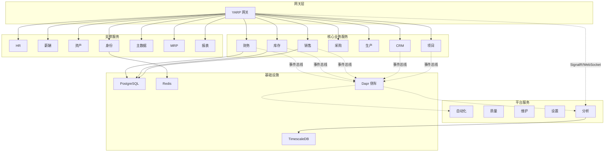
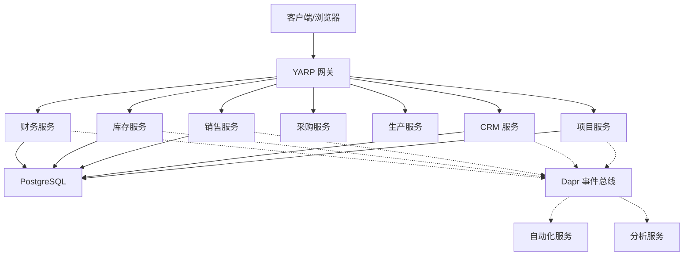
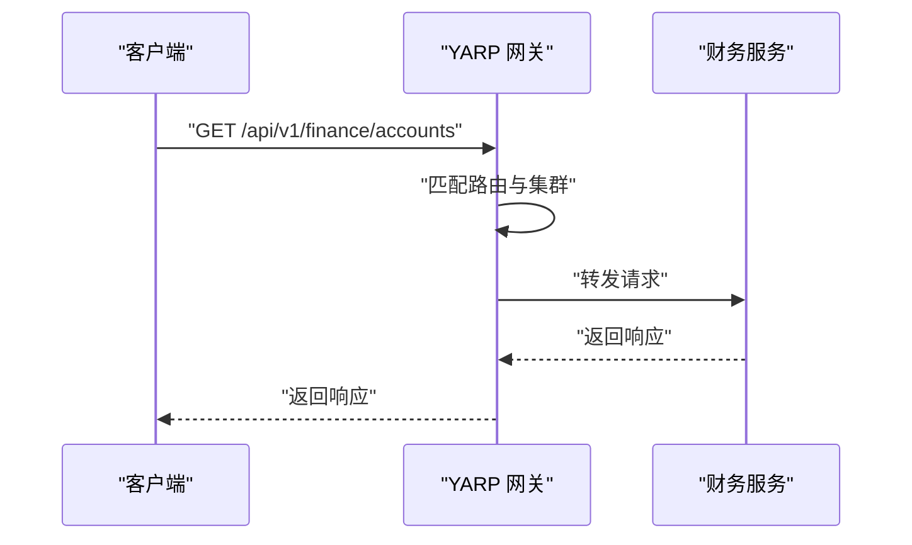
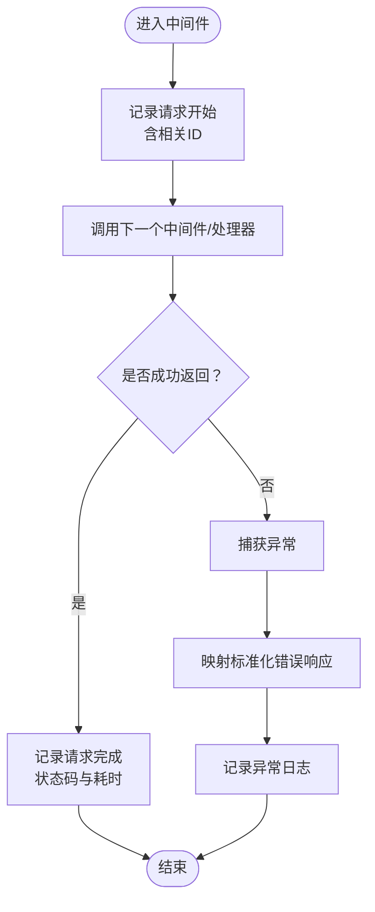
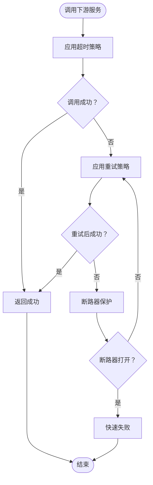
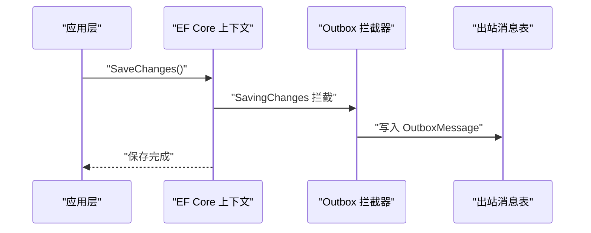
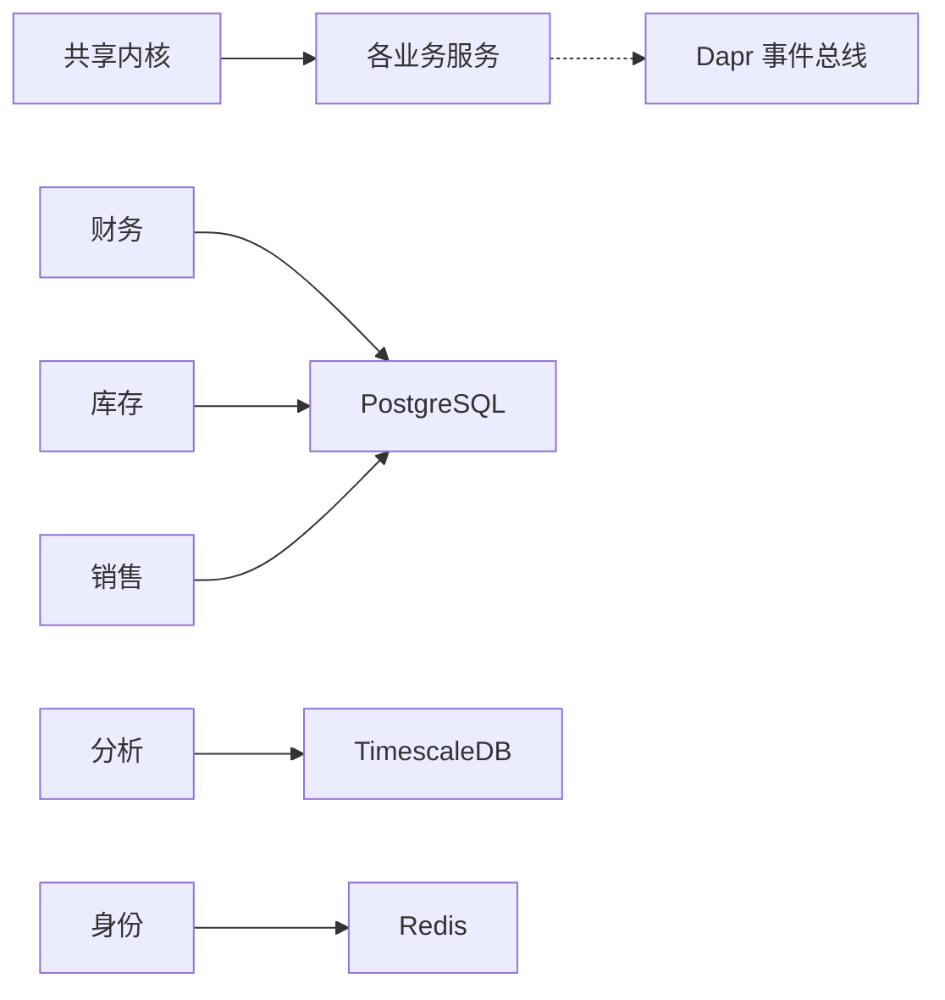

# 故障排除与FAQ

<cite>
**本文引用的文件**
- [README.md](file://README.md)
- [DEVELOPMENT_PLAN.md](file://DEVELOPMENT_PLAN.md)
- [ErpSystem.sln](file://src/ErpSystem.sln)
- [appsettings.json（网关）](file://src/Gateways/ErpSystem.Gateway/appsettings.json)
- [appsettings.json（财务）](file://src/Services/Finance/ErpSystem.Finance/appsettings.json)
- [appsettings.json（身份）](file://src/Services/Identity/ErpSystem.Identity/appsettings.json)
- [appsettings.json（CRM）](file://src/Services/CRM/ErpSystem.CRM/appsettings.json)
- [DependencyInjection.cs（共享内核）](file://src/BuildingBlocks/ErpSystem.BuildingBlocks/DependencyInjection.cs)
- [Middlewares.cs（共享内核中间件）](file://src/BuildingBlocks/ErpSystem.BuildingBlocks/Middleware/Middlewares.cs)
- [ResiliencePolicies.cs（共享内核弹性策略）](file://src/BuildingBlocks/ErpSystem.BuildingBlocks/Resilience/ResiliencePolicies.cs)
- [OutboxInterceptor.cs（共享内核出站拦截器）](file://src/BuildingBlocks/ErpSystem.BuildingBlocks/Outbox/OutboxInterceptor.cs)
- [ingress.yaml（Kubernetes）](file://deploy/k8s/ingress.yaml)
- [values.yaml（Helm）](file://deploy/helm/erp-system/values.yaml)
</cite>

## 目录
1. [简介](#简介)
2. [项目结构](#项目结构)
3. [核心组件](#核心组件)
4. [架构总览](#架构总览)
5. [详细组件分析](#详细组件分析)
6. [依赖分析](#依赖分析)
7. [性能考虑](#性能考虑)
8. [故障排除指南](#故障排除指南)
9. [结论](#结论)
10. [附录](#附录)

## 简介
本指南聚焦于该ERP微服务项目的故障排除与常见问题，覆盖网络连接、数据库连接、服务间通信、弹性策略、可观测性、安全配置、权限与数据一致性等方面。文档提供系统性的诊断方法、日志分析技巧、性能优化建议以及应急响应指导，帮助运维与开发人员快速定位与解决问题。

## 项目结构
项目采用多服务微架构，包含多个业务服务（财务、库存、销售、采购、生产、HR、CRM、项目、薪酬、资产、MRP、自动化、质量、分析、报表），并通过YARP网关统一入口，并在Kubernetes/Helm中进行部署。

图表来源
- [README.md](file://README.md#L130-L183)
- [appsettings.json（网关）](file://src/Gateways/ErpSystem.Gateway/appsettings.json#L9-L228)

章节来源
- [README.md](file://README.md#L130-L183)
- [appsettings.json（网关）](file://src/Gateways/ErpSystem.Gateway/appsettings.json#L9-L228)

## 核心组件
- 共享内核（BuildingBlocks）
  - 中间件：请求日志、相关ID追踪、全局异常处理
  - 弹性策略：重试、断路器、超时组合
  - 出站消息：EF Core 拦截器，自动写入出站消息表
  - 依赖注入：注册验证器、MediatR行为、用户上下文
- 网关（YARP）
  - 路由规则与集群目的地配置
- 数据库与存储
  - PostgreSQL（TimescaleDB可选）
  - Redis（状态/发布订阅）
- 部署与编排
  - Kubernetes Ingress
  - Helm values（副本数、资源限制、镜像、环境变量）

章节来源
- [DependencyInjection.cs（共享内核）](file://src/BuildingBlocks/ErpSystem.BuildingBlocks/DependencyInjection.cs#L10-L30)
- [Middlewares.cs（共享内核中间件）](file://src/BuildingBlocks/ErpSystem.BuildingBlocks/Middleware/Middlewares.cs#L10-L124)
- [ResiliencePolicies.cs（共享内核弹性策略）](file://src/BuildingBlocks/ErpSystem.BuildingBlocks/Resilience/ResiliencePolicies.cs#L13-L110)
- [OutboxInterceptor.cs（共享内核出站拦截器）](file://src/BuildingBlocks/ErpSystem.BuildingBlocks/Outbox/OutboxInterceptor.cs#L8-L50)
- [appsettings.json（网关）](file://src/Gateways/ErpSystem.Gateway/appsettings.json#L9-L228)
- [values.yaml（Helm）](file://deploy/helm/erp-system/values.yaml#L10-L127)

## 架构总览
下图展示从客户端到各微服务与基础设施的关键交互路径，以及事件总线与可观测性位置。

图表来源
- [README.md](file://README.md#L130-L183)
- [appsettings.json（网关）](file://src/Gateways/ErpSystem.Gateway/appsettings.json#L9-L228)

## 详细组件分析

### 组件A：网关路由与服务发现
- 功能要点
  - 将 /api/v1/<service> 请求转发至对应服务集群
  - 支持 SignalR/WebSocket 路径直连分析服务
  - 默认本地开发地址映射（localhost:端口）
- 常见问题
  - 路由不匹配或路径前缀错误
  - 目的地服务未启动或端口不正确
  - CORS/Hosts 配置导致跨域或访问被拒绝
- 诊断步骤
  - 检查路由定义与 Path 匹配
  - 使用 curl 或浏览器开发者工具验证转发
  - 查看网关日志中的请求/响应状态码与耗时
  - 确认服务健康探针与就绪/存活检查

图表来源
- [appsettings.json（网关）](file://src/Gateways/ErpSystem.Gateway/appsettings.json#L9-L113)

章节来源
- [appsettings.json（网关）](file://src/Gateways/ErpSystem.Gateway/appsettings.json#L9-L228)

### 组件B：共享内核中间件与异常处理
- 功能要点
  - 请求日志：记录请求方法、路径、状态码、耗时
  - 相关ID：注入 X-Correlation-ID 头便于跨服务追踪
  - 全局异常：对验证、权限、未找到与通用异常进行标准化输出
- 常见问题
  - 未捕获异常导致 500
  - 缺少相关ID导致链路追踪困难
  - 日志级别过低难以定位问题
- 诊断步骤
  - 提升日志级别（默认 Information），观察请求开始/结束与异常堆栈
  - 在响应头中携带相关ID，结合下游服务日志交叉比对
  - 对特定异常类型（如验证失败）检查响应体结构

图表来源
- [Middlewares.cs（共享内核中间件）](file://src/BuildingBlocks/ErpSystem.BuildingBlocks/Middleware/Middlewares.cs#L10-L124)

章节来源
- [Middlewares.cs（共享内核中间件）](file://src/BuildingBlocks/ErpSystem.BuildingBlocks/Middleware/Middlewares.cs#L10-L124)

### 组件C：弹性策略（重试/断路器/超时）
- 功能要点
  - 标准重试：指数退避
  - 断路器：按失败比例与最小吞吐量触发
  - 超时：统一超时窗口
  - HTTP 专用重试：针对 5xx 与超时结果
- 常见问题
  - 无弹性策略导致级联故障
  - 断路器频繁跳闸影响可用性
  - 超时过短导致误判
- 诊断步骤
  - 观察断路器状态变化与触发条件
  - 调整最大重试次数与超时时间
  - 对外部依赖使用 HTTP 专用重试策略

图表来源
- [ResiliencePolicies.cs（共享内核弹性策略）](file://src/BuildingBlocks/ErpSystem.BuildingBlocks/Resilience/ResiliencePolicies.cs#L13-L110)

章节来源
- [ResiliencePolicies.cs（共享内核弹性策略）](file://src/BuildingBlocks/ErpSystem.BuildingBlocks/Resilience/ResiliencePolicies.cs#L13-L110)

### 组件D：出站消息与事件可靠性
- 功能要点
  - EF Core 拦截器在保存聚合变更时，自动写入出站消息
  - 与后台进程配合，保证“保存事件”与“发布消息”的最终一致
- 常见问题
  - 事务未提交导致消息丢失
  - 出站消息堆积未处理
- 诊断步骤
  - 检查保存聚合变更后的出站消息表是否写入
  - 监控出站消息处理队列与失败重试
  - 核对聚合变更是否清空已记录事件

图表来源
- [OutboxInterceptor.cs（共享内核出站拦截器）](file://src/BuildingBlocks/ErpSystem.BuildingBlocks/Outbox/OutboxInterceptor.cs#L8-L50)

章节来源
- [OutboxInterceptor.cs（共享内核出站拦截器）](file://src/BuildingBlocks/ErpSystem.BuildingBlocks/Outbox/OutboxInterceptor.cs#L8-L50)

### 组件E：数据库连接与配置
- 功能要点
  - 服务通过 ConnectionStrings 访问数据库
  - 财务服务示例包含数据库连接字符串
- 常见问题
  - 连接字符串格式错误
  - 用户名/密码/主机/端口不正确
  - 数据库未初始化或迁移未执行
- 诊断步骤
  - 校验 ConnectionStrings 键值与连接串格式
  - 使用 telnet/ping 验证主机与端口可达
  - 执行数据库初始化脚本与迁移
  - 查看服务启动日志中的数据库连接尝试

章节来源
- [appsettings.json（财务）](file://src/Services/Finance/ErpSystem.Finance/appsettings.json#L9-L12)

### 组件F：部署与服务发现（Kubernetes/Helm）
- 功能要点
  - Helm values 控制副本数、资源、镜像与环境变量
  - Ingress 将域名与路径映射到相应服务
- 常见问题
  - Ingress 主机名与证书配置不当
  - 服务端口不匹配或未暴露
  - 资源不足导致 Pod 重启
- 诊断步骤
  - 检查 ingress.host 与 DNS 解析
  - 使用 kubectl describe svc/ingress 查看服务暴露与路由
  - 查看 Pod 日志与事件，确认资源限制与健康检查

章节来源
- [values.yaml（Helm）](file://deploy/helm/erp-system/values.yaml#L90-L127)
- [ingress.yaml（Kubernetes）](file://deploy/k8s/ingress.yaml#L1-L37)

## 依赖分析
- 服务间依赖
  - 财务/库存/销售等核心服务依赖 PostgreSQL
  - 分析服务依赖 TimescaleDB
  - 身份服务依赖 Redis（用于会话/缓存）
  - 所有服务通过 Dapr 事件总线进行解耦通信
- 内部依赖
  - 各服务均依赖共享内核（中间件、弹性策略、出站消息）

图表来源
- [README.md](file://README.md#L130-L183)
- [values.yaml（Helm）](file://deploy/helm/erp-system/values.yaml#L117-L123)

章节来源
- [README.md](file://README.md#L130-L183)
- [values.yaml（Helm）](file://deploy/helm/erp-system/values.yaml#L117-L123)

## 性能考虑
- 弹性策略
  - 合理设置重试次数与超时，避免雪崩效应
  - 断路器阈值需结合实际流量与错误率调整
- 数据库
  - 为热点表建立索引，避免全表扫描
  - 控制连接池大小，避免连接耗尽
- 缓存
  - 使用分布式缓存减少数据库压力
  - 明确缓存失效策略，避免脏读
- 并发与线程
  - 控制并发度，避免 CPU/IO 抖动
  - 使用异步 I/O 与合理任务调度

## 故障排除指南

### 网络连接问题
- 症状
  - 请求超时、502/504 网关错误
  - 跨域失败或 403
- 排查步骤
  - 确认网关路由与目的地地址正确
  - 检查服务端口与健康检查
  - 校验 Ingress 主机名与 TLS 配置
  - 使用网络抓包或 curl 验证连通性

章节来源
- [appsettings.json（网关）](file://src/Gateways/ErpSystem.Gateway/appsettings.json#L9-L228)
- [ingress.yaml（Kubernetes）](file://deploy/k8s/ingress.yaml#L1-L37)

### 数据库连接失败
- 症状
  - 启动时报数据库连接异常
  - 查询超时或连接池耗尽
- 排查步骤
  - 校验 ConnectionStrings 键名与连接串
  - 验证主机、端口、用户名、密码
  - 执行数据库初始化与迁移
  - 查看数据库日志与连接数上限

章节来源
- [appsettings.json（财务）](file://src/Services/Finance/ErpSystem.Finance/appsettings.json#L9-L12)

### 服务间通信故障
- 症状
  - 调用下游服务失败、断路器打开
  - 事件未到达或重复消费
- 排查步骤
  - 检查 Dapr 事件总线组件（状态存储/发布订阅）
  - 核对服务间签名验证与鉴权配置
  - 查看弹性策略配置与断路器状态
  - 检查出站消息表与消费者处理日志

章节来源
- [README.md](file://README.md#L130-L183)
- [values.yaml（Helm）](file://deploy/helm/erp-system/values.yaml#L117-L123)
- [OutboxInterceptor.cs（共享内核出站拦截器）](file://src/BuildingBlocks/ErpSystem.BuildingBlocks/Outbox/OutboxInterceptor.cs#L8-L50)

### 常见错误消息与解决方案
- 验证失败（400）
  - 现象：参数校验失败，返回字段级错误列表
  - 处理：根据错误提示修正请求参数
- 权限不足（403）
  - 现象：未授权访问受保护资源
  - 处理：检查令牌有效性与权限范围
- 资源不存在（404）
  - 现象：请求对象不存在
  - 处理：确认 ID 与租户上下文
- 服务器内部错误（500）
  - 现象：未处理异常
  - 处理：查看异常日志，定位上游调用与参数

章节来源
- [Middlewares.cs（共享内核中间件）](file://src/BuildingBlocks/ErpSystem.BuildingBlocks/Middleware/Middlewares.cs#L73-L124)

### 性能瓶颈识别
- 方法
  - 使用相关ID串联请求链路，对比各服务耗时
  - 关注断路器触发频率与超时占比
  - 监控数据库慢查询与连接池使用率
- 优化建议
  - 合理设置弹性策略参数
  - 引入缓存与批量查询
  - 优化数据库索引与查询计划

章节来源
- [Middlewares.cs（共享内核中间件）](file://src/BuildingBlocks/ErpSystem.BuildingBlocks/Middleware/Middlewares.cs#L10-L49)
- [ResiliencePolicies.cs（共享内核弹性策略）](file://src/BuildingBlocks/ErpSystem.BuildingBlocks/Resilience/ResiliencePolicies.cs#L13-L110)

### 内存泄漏与并发问题
- 方法
  - 使用 GC 与内存采样工具定位异常增长
  - 检查长生命周期对象与静态集合
  - 并发场景下避免锁竞争与死锁
- 建议
  - 使用弱引用与及时释放资源
  - 控制并发度与队列长度
  - 定期巡检与压测回归

### 安全配置检查
- 方法
  - 校验 JWT 令牌颁发与校验流程
  - 检查 Dapr 中间件与签名验证
  - 确认 CORS、Hosts 与 TLS 配置
- 建议
  - 使用强随机密钥与定期轮换
  - 限制暴露端点与路径
  - 启用审计日志与异常告警

章节来源
- [README.md](file://README.md#L130-L183)
- [appsettings.json（身份）](file://src/Services/Identity/ErpSystem.Identity/appsettings.json#L1-L10)
- [appsettings.json（CRM）](file://src/Services/CRM/ErpSystem.CRM/appsettings.json#L1-L10)

### 权限问题解决
- 方法
  - 核对用户角色与数据权限
  - 检查租户隔离与查询过滤器
- 建议
  - 使用最小权限原则
  - 定期审计权限分配

章节来源
- [DEVELOPMENT_PLAN.md](file://DEVELOPMENT_PLAN.md#L29-L32)

### 数据一致性验证
- 方法
  - 核对事件溯源与投影一致性
  - 检查出站消息处理与幂等
- 建议
  - 增加一致性校验任务
  - 使用断言测试与集成测试

章节来源
- [OutboxInterceptor.cs（共享内核出站拦截器）](file://src/BuildingBlocks/ErpSystem.BuildingBlocks/Outbox/OutboxInterceptor.cs#L8-L50)

### 运维应急响应
- 步骤
  - 快速定位受影响服务与链路
  - 降级非关键功能，启用断路器
  - 回滚最近变更，恢复备份
  - 发布修复补丁并验证
- 工具
  - K8s 调试命令与日志采集
  - Prometheus/Grafana 监控面板
  - 分布式追踪（OTLP/Dapr Dashboard）

章节来源
- [values.yaml（Helm）](file://deploy/helm/erp-system/values.yaml#L125-L127)
- [README.md](file://README.md#L130-L183)

## 结论
通过系统化的日志与中间件、完善的弹性策略、可靠的事件出站机制以及清晰的部署与监控体系，本项目具备良好的可观测性与韧性。建议在日常运维中持续完善监控告警、压测回归与应急演练，确保在复杂业务场景下的稳定运行。

## 附录
- 快速检查清单
  - 网关路由与目的地：✓
  - 数据库连接串与可达性：✓
  - 弹性策略参数：✓
  - 断路器状态与超时：✓
  - 出站消息处理：✓
  - Ingress 主机与 TLS：✓
  - 相关ID与日志级别：✓
  - 安全配置与权限：✓