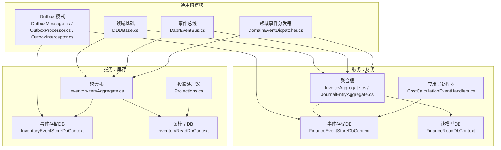
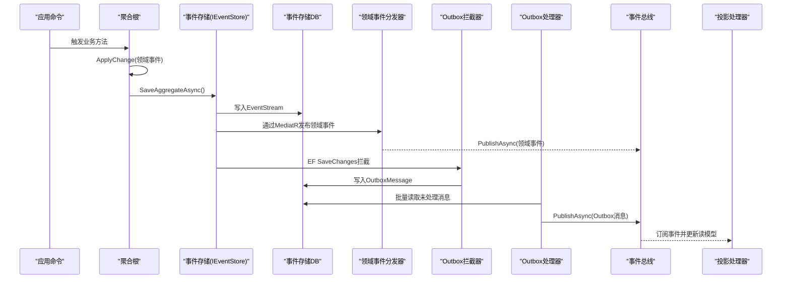
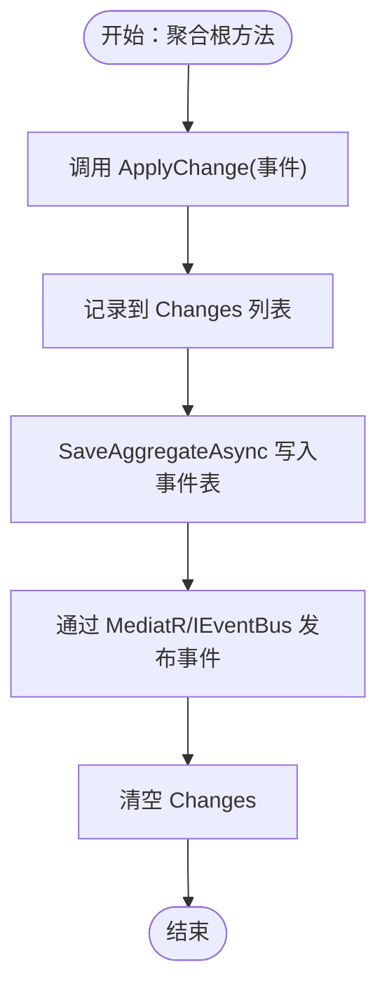
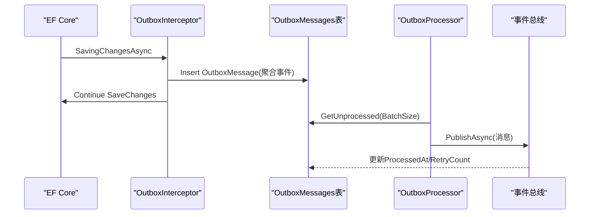
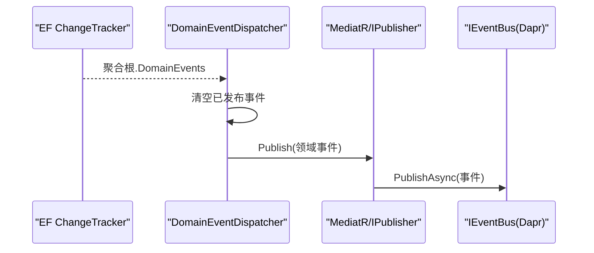
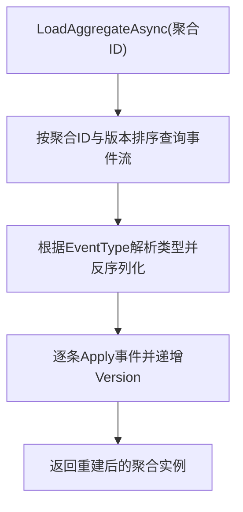
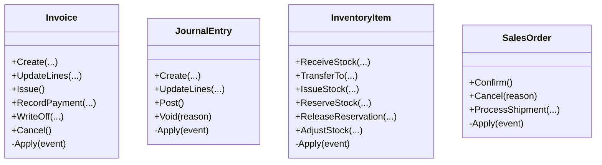
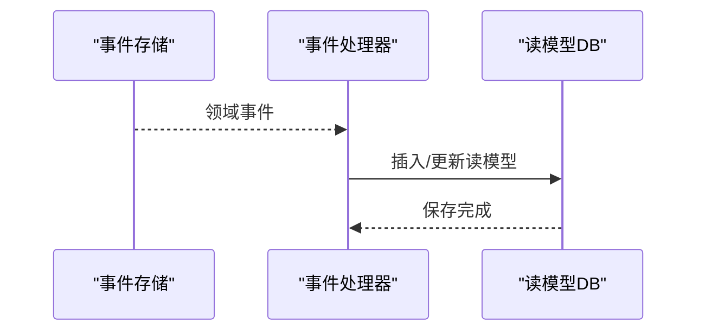
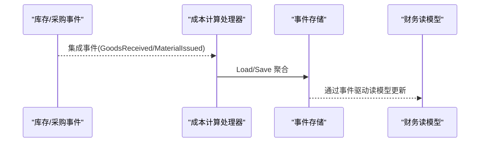
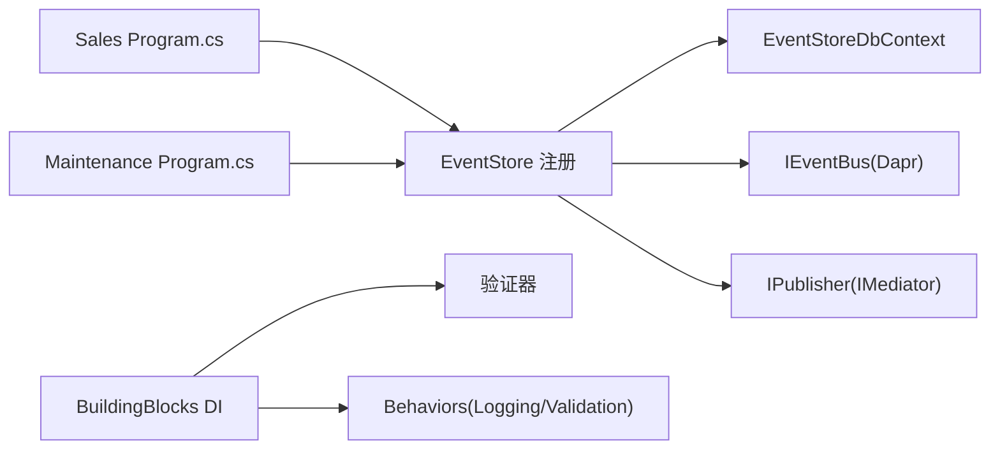

# 事件溯源模式

<cite>
**本文引用的文件**
- [DDDBase.cs](file://src/BuildingBlocks/ErpSystem.BuildingBlocks/Domain/DDDBase.cs)
- [DomainEventDispatcher.cs](file://src/BuildingBlocks/ErpSystem.BuildingBlocks/Domain/DomainEventDispatcher.cs)
- [OutboxMessage.cs](file://src/BuildingBlocks/ErpSystem.BuildingBlocks/Outbox/OutboxMessage.cs)
- [OutboxProcessor.cs](file://src/BuildingBlocks/ErpSystem.BuildingBlocks/Outbox/OutboxProcessor.cs)
- [OutboxInterceptor.cs](file://src/BuildingBlocks/ErpSystem.BuildingBlocks/Outbox/OutboxInterceptor.cs)
- [DaprEventBus.cs](file://src/BuildingBlocks/ErpSystem.BuildingBlocks/EventBus/DaprEventBus.cs)
- [Persistence.cs（财务）](file://src/Services/Finance/ErpSystem.Finance/Infrastructure/Persistence.cs)
- [Persistence.cs（库存）](file://src/Services/Inventory/ErpSystem.Inventory/Infrastructure/Persistence.cs)
- [InvoiceAggregate.cs](file://src/Services/Finance/ErpSystem.Finance/Domain/InvoiceAggregate.cs)
- [JournalEntryAggregate.cs](file://src/Services/Finance/ErpSystem.Finance/Domain/JournalEntryAggregate.cs)
- [InventoryItemAggregate.cs](file://src/Services/Inventory/ErpSystem.Inventory/Domain/InventoryItemAggregate.cs)
- [SalesOrderAggregate.cs](file://src/Services/Sales/ErpSystem.Sales/Domain/SalesOrderAggregate.cs)
- [CostCalculationEventHandlers.cs](file://src/Services/Finance/ErpSystem.Finance/Application/CostCalculationEventHandlers.cs)
- [Projections.cs（库存）](file://src/Services/Inventory/ErpSystem.Inventory/Infrastructure/Projections.cs)
- [Program.cs（销售）](file://src/Services/Sales/ErpSystem.Sales/Program.cs)
- [Program.cs（维护）](file://src/Services/Maintenance/ErpSystem.Maintenance/Program.cs)
- [DependencyInjection.cs](file://src/BuildingBlocks/ErpSystem.BuildingBlocks/DependencyInjection.cs)
</cite>

## 目录
1. [引言](#引言)
2. [项目结构](#项目结构)
3. [核心组件](#核心组件)
4. [架构总览](#架构总览)
5. [详细组件分析](#详细组件分析)
6. [依赖关系分析](#依赖关系分析)
7. [性能考虑](#性能考虑)
8. [故障排查指南](#故障排查指南)
9. [结论](#结论)
10. [附录：代码示例路径](#附录代码示例路径)

## 引言
本文件系统性阐述该 ERP 微服务仓库中的事件溯源（Event Sourcing, ES）与相关配套模式（如 Outbox、投影/读模型、领域事件分发与发布），重点覆盖以下主题：
- 事件存储的实现原理与数据模型
- 领域事件的捕获、发布与订阅
- DDDBase 基类设计与事件聚合根生命周期
- Outbox 模式实现细节、事件持久化策略与重放机制
- 事件序列化、版本控制与性能优化
- 在微服务架构中的作用与最佳实践
- 具体聚合根中触发与处理领域事件的示例路径

## 项目结构
该仓库采用多服务微服务架构，每个业务服务包含：
- 领域层：聚合根、领域事件、值对象
- 应用层：命令/查询、集成事件处理器
- 基础设施层：事件存储 DbContext、读模型 DbContext、投影处理器
- 网关与运行时：Program.cs 注册事件存储、事件总线、MediatR、EF Core 拦截器等

**图表来源**
- [DDDBase.cs](file://src/BuildingBlocks/ErpSystem.BuildingBlocks/Domain/DDDBase.cs#L14-L120)
- [OutboxMessage.cs](file://src/BuildingBlocks/ErpSystem.BuildingBlocks/Outbox/OutboxMessage.cs#L10-L55)
- [OutboxProcessor.cs](file://src/BuildingBlocks/ErpSystem.BuildingBlocks/Outbox/OutboxProcessor.cs#L8-L71)
- [OutboxInterceptor.cs](file://src/BuildingBlocks/ErpSystem.BuildingBlocks/Outbox/OutboxInterceptor.cs#L8-L50)
- [DaprEventBus.cs](file://src/BuildingBlocks/ErpSystem.BuildingBlocks/EventBus/DaprEventBus.cs#L6-L30)
- [DomainEventDispatcher.cs](file://src/BuildingBlocks/ErpSystem.BuildingBlocks/Domain/DomainEventDispatcher.cs#L12-L71)
- [Persistence.cs（财务）](file://src/Services/Finance/ErpSystem.Finance/Infrastructure/Persistence.cs#L6-L48)
- [Persistence.cs（库存）](file://src/Services/Inventory/ErpSystem.Inventory/Infrastructure/Persistence.cs#L6-L37)
- [InvoiceAggregate.cs](file://src/Services/Finance/ErpSystem.Finance/Domain/InvoiceAggregate.cs#L67-L181)
- [JournalEntryAggregate.cs](file://src/Services/Finance/ErpSystem.Finance/Domain/JournalEntryAggregate.cs#L55-L135)
- [InventoryItemAggregate.cs](file://src/Services/Inventory/ErpSystem.Inventory/Domain/InventoryItemAggregate.cs#L91-L247)
- [Projections.cs（库存）](file://src/Services/Inventory/ErpSystem.Inventory/Infrastructure/Projections.cs#L7-L209)

**章节来源**
- [DDDBase.cs](file://src/BuildingBlocks/ErpSystem.BuildingBlocks/Domain/DDDBase.cs#L1-L137)
- [OutboxMessage.cs](file://src/BuildingBlocks/ErpSystem.BuildingBlocks/Outbox/OutboxMessage.cs#L1-L82)
- [OutboxProcessor.cs](file://src/BuildingBlocks/ErpSystem.BuildingBlocks/Outbox/OutboxProcessor.cs#L1-L72)
- [OutboxInterceptor.cs](file://src/BuildingBlocks/ErpSystem.BuildingBlocks/Outbox/OutboxInterceptor.cs#L1-L51)
- [DaprEventBus.cs](file://src/BuildingBlocks/ErpSystem.BuildingBlocks/EventBus/DaprEventBus.cs#L1-L31)
- [DomainEventDispatcher.cs](file://src/BuildingBlocks/ErpSystem.BuildingBlocks/Domain/DomainEventDispatcher.cs#L1-L72)
- [Persistence.cs（财务）](file://src/Services/Finance/ErpSystem.Finance/Infrastructure/Persistence.cs#L1-L130)
- [Persistence.cs（库存）](file://src/Services/Inventory/ErpSystem.Inventory/Infrastructure/Persistence.cs#L1-L79)

## 核心组件
- 事件存储与聚合根基类
  - 聚合根基类负责维护未提交变更列表、加载历史事件、版本号推进与 Apply 变更逻辑。
  - 事件流模型 EventStream 用于持久化事件，包含聚合类型、事件类型、序列版本与 JSON 负载。
  - 事件存储 IEventStore 实现负责将变更写入事件表，并通过 MediatR 与事件总线发布。

- 领域事件分发器
  - SaveChanges 后自动收集聚合根的领域事件，清空已发布事件，避免重复派发。

- Outbox 模式
  - 事务内拦截保存更改，将聚合产生的领域事件转换为 OutboxMessage 并入库，随后由后台处理器批量发布到事件总线，保证本地事务一致性与最终一致。

- 事件总线
  - Dapr 事件总线基于 PubSub 发布事件；同时提供 Dummy 实现便于测试或离线环境。

- 读模型与投影
  - 各服务独立维护事件存储与读模型数据库，投影处理器监听领域事件并更新只读视图。

**章节来源**
- [DDDBase.cs](file://src/BuildingBlocks/ErpSystem.BuildingBlocks/Domain/DDDBase.cs#L14-L120)
- [DomainEventDispatcher.cs](file://src/BuildingBlocks/ErpSystem.BuildingBlocks/Domain/DomainEventDispatcher.cs#L17-L62)
- [OutboxMessage.cs](file://src/BuildingBlocks/ErpSystem.BuildingBlocks/Outbox/OutboxMessage.cs#L10-L55)
- [OutboxProcessor.cs](file://src/BuildingBlocks/ErpSystem.BuildingBlocks/Outbox/OutboxProcessor.cs#L8-L71)
- [OutboxInterceptor.cs](file://src/BuildingBlocks/ErpSystem.BuildingBlocks/Outbox/OutboxInterceptor.cs#L8-L50)
- [DaprEventBus.cs](file://src/BuildingBlocks/ErpSystem.BuildingBlocks/EventBus/DaprEventBus.cs#L11-L30)
- [Persistence.cs（财务）](file://src/Services/Finance/ErpSystem.Finance/Infrastructure/Persistence.cs#L6-L48)
- [Persistence.cs（库存）](file://src/Services/Inventory/ErpSystem.Inventory/Infrastructure/Persistence.cs#L6-L37)

## 架构总览
下图展示了事件从聚合根产生到事件存储、Outbox、事件总线以及读模型投影的完整链路。

**图表来源**
- [DDDBase.cs](file://src/BuildingBlocks/ErpSystem.BuildingBlocks/Domain/DDDBase.cs#L62-L99)
- [DomainEventDispatcher.cs](file://src/BuildingBlocks/ErpSystem.BuildingBlocks/Domain/DomainEventDispatcher.cs#L19-L42)
- [OutboxInterceptor.cs](file://src/BuildingBlocks/ErpSystem.BuildingBlocks/Outbox/OutboxInterceptor.cs#L10-L49)
- [OutboxProcessor.cs](file://src/BuildingBlocks/ErpSystem.BuildingBlocks/Outbox/OutboxProcessor.cs#L29-L70)
- [DaprEventBus.cs](file://src/BuildingBlocks/ErpSystem.BuildingBlocks/EventBus/DaprEventBus.cs#L15-L20)
- [Projections.cs（库存）](file://src/Services/Inventory/ErpSystem.Inventory/Infrastructure/Projections.cs#L16-L37)

## 详细组件分析

### 组件A：事件存储与聚合根生命周期（DDDBase）
- 设计要点
  - 聚合根维护 Changes 列表与 Version，ApplyChange 调用 Apply 并记录事件，LoadFromHistory 支持从历史重建状态。
  - EventStream 包含聚合类型、事件类型、版本与 JSON 负载，便于跨服务反序列化。
  - IEventStore.SaveAggregateAsync 将事件写入数据库后，通过 MediatR 与 IEventBus 发布，随后清空 Changes。

- 生命周期流程
  - 创建：聚合根通过静态工厂方法触发初始事件。
  - 变更：业务方法内部调用 ApplyChange 触发事件，不立即持久化。
  - 提交：SaveAggregateAsync 将变更写入事件表并发布事件。
  - 重放：LoadAggregateAsync 按版本顺序重建状态。

**图表来源**
- [DDDBase.cs](file://src/BuildingBlocks/ErpSystem.BuildingBlocks/Domain/DDDBase.cs#L25-L99)

**章节来源**
- [DDDBase.cs](file://src/BuildingBlocks/ErpSystem.BuildingBlocks/Domain/DDDBase.cs#L14-L120)

### 组件B：Outbox 模式实现
- OutboxMessage
  - 事务内持久化，包含消息类型、JSON 负载、创建时间、处理状态与重试计数。
  - 提供序列化/反序列化工具方法，支持泛型与非泛型反序列化。

- OutboxInterceptor
  - EF Core SaveChanges 拦截器，在保存聚合变更时，将聚合的未提交事件转换为 OutboxMessage 并入库，同时清空聚合 Changes，确保事务一致性。

- OutboxProcessor
  - 后台服务按批拉取未处理消息，反序列化后通过 IEventBus 发布，成功则标记已处理，失败则增加重试计数并记录错误。

**图表来源**
- [OutboxMessage.cs](file://src/BuildingBlocks/ErpSystem.BuildingBlocks/Outbox/OutboxMessage.cs#L22-L54)
- [OutboxInterceptor.cs](file://src/BuildingBlocks/ErpSystem.BuildingBlocks/Outbox/OutboxInterceptor.cs#L10-L49)
- [OutboxProcessor.cs](file://src/BuildingBlocks/ErpSystem.BuildingBlocks/Outbox/OutboxProcessor.cs#L29-L70)

**章节来源**
- [OutboxMessage.cs](file://src/BuildingBlocks/ErpSystem.BuildingBlocks/Outbox/OutboxMessage.cs#L1-L82)
- [OutboxInterceptor.cs](file://src/BuildingBlocks/ErpSystem.BuildingBlocks/Outbox/OutboxInterceptor.cs#L1-L51)
- [OutboxProcessor.cs](file://src/BuildingBlocks/ErpSystem.BuildingBlocks/Outbox/OutboxProcessor.cs#L1-L72)

### 组件C：领域事件分发与发布
- DomainEventDispatcher
  - 在 EF Core SaveChanges 完成后扫描变更跟踪器，提取聚合根的领域事件集合，清空后再统一通过 MediatR 发布，避免重复派发。

- DaprEventBus
  - 使用 Dapr PubSub 发布事件，默认主题名为事件类型名；提供 DummyEventBus 便于开发与测试。

**图表来源**
- [DomainEventDispatcher.cs](file://src/BuildingBlocks/ErpSystem.BuildingBlocks/Domain/DomainEventDispatcher.cs#L19-L42)
- [DaprEventBus.cs](file://src/BuildingBlocks/ErpSystem.BuildingBlocks/EventBus/DaprEventBus.cs#L15-L20)

**章节来源**
- [DomainEventDispatcher.cs](file://src/BuildingBlocks/ErpSystem.BuildingBlocks/Domain/DomainEventDispatcher.cs#L17-L62)
- [DaprEventBus.cs](file://src/BuildingBlocks/ErpSystem.BuildingBlocks/EventBus/DaprEventBus.cs#L11-L30)

### 组件D：事件序列化、版本控制与重放
- 序列化
  - 事件存储使用 System.Text.Json 将事件序列化为字符串存入 EventStream.Payload；反序列化时根据 EventStream.EventType 查找类型并还原事件对象。

- 版本控制
  - EventStream.Version 作为事件序号，聚合根 Version 与之对应；LoadFromHistory 按版本顺序 Apply，确保状态可重放。

- 重放机制
  - LoadAggregateAsync 从事件表读取指定聚合的历史事件，按版本排序后逐条 Apply，重建当前状态。

**图表来源**
- [DDDBase.cs](file://src/BuildingBlocks/ErpSystem.BuildingBlocks/Domain/DDDBase.cs#L101-L119)
- [Persistence.cs（财务）](file://src/Services/Finance/ErpSystem.Finance/Infrastructure/Persistence.cs#L12-L17)

**章节来源**
- [DDDBase.cs](file://src/BuildingBlocks/ErpSystem.BuildingBlocks/Domain/DDDBase.cs#L43-L119)
- [Persistence.cs（财务）](file://src/Services/Finance/ErpSystem.Finance/Infrastructure/Persistence.cs#L6-L18)

### 组件E：聚合根示例与事件触发
- 财务：发票聚合
  - 事件：发票创建、行项更新、已开票、付款记录、状态变更等。
  - 行为：创建、更新行项、开票、记录付款、核销/作废等均通过 ApplyChange 触发相应事件。

- 财务：会计分录聚合
  - 事件：创建、行项更新、过账、作废。
  - 行为：创建、更新行项、过账、作废，均进行状态校验并触发事件。

- 库存：库存物品聚合
  - 事件：创建、收货、转移、出库、预留、释放、调整。
  - 行为：收货、转移、出库、预留、释放、调整，遵循可用量与批次 FIFO 策略。

- 销售：销售订单聚合
  - 事件：创建、确认、取消、发货处理。
  - 行为：确认、取消、处理发货，更新行级已发运数量与订单状态。

**图表来源**
- [InvoiceAggregate.cs](file://src/Services/Finance/ErpSystem.Finance/Domain/InvoiceAggregate.cs#L85-L140)
- [JournalEntryAggregate.cs](file://src/Services/Finance/ErpSystem.Finance/Domain/JournalEntryAggregate.cs#L72-L107)
- [InventoryItemAggregate.cs](file://src/Services/Inventory/ErpSystem.Inventory/Domain/InventoryItemAggregate.cs#L109-L190)
- [SalesOrderAggregate.cs](file://src/Services/Sales/ErpSystem.Sales/Domain/SalesOrderAggregate.cs#L77-L111)

**章节来源**
- [InvoiceAggregate.cs](file://src/Services/Finance/ErpSystem.Finance/Domain/InvoiceAggregate.cs#L67-L181)
- [JournalEntryAggregate.cs](file://src/Services/Finance/ErpSystem.Finance/Domain/JournalEntryAggregate.cs#L55-L135)
- [InventoryItemAggregate.cs](file://src/Services/Inventory/ErpSystem.Inventory/Domain/InventoryItemAggregate.cs#L91-L247)
- [SalesOrderAggregate.cs](file://src/Services/Sales/ErpSystem.Sales/Domain/SalesOrderAggregate.cs#L67-L150)

### 组件F：读模型与投影
- 事件存储与读模型分离
  - 各服务拥有独立事件存储 DbContext 与读模型 DbContext，事件存储使用 EventStream，读模型使用 JSON 字段存储复杂结构。

- 投影处理器
  - 监听领域事件并更新只读视图，如库存物品、交易与预留信息；在处理过程中插入相应的交易流水或预留记录。

**图表来源**
- [Persistence.cs（库存）](file://src/Services/Inventory/ErpSystem.Inventory/Infrastructure/Persistence.cs#L20-L37)
- [Projections.cs（库存）](file://src/Services/Inventory/ErpSystem.Inventory/Infrastructure/Projections.cs#L16-L81)

**章节来源**
- [Persistence.cs（财务）](file://src/Services/Finance/ErpSystem.Finance/Infrastructure/Persistence.cs#L6-L48)
- [Persistence.cs（库存）](file://src/Services/Inventory/ErpSystem.Inventory/Infrastructure/Persistence.cs#L6-L37)
- [Projections.cs（库存）](file://src/Services/Inventory/ErpSystem.Inventory/Infrastructure/Projections.cs#L1-L210)

### 组件G：集成事件与跨服务协作
- 成本计算集成事件处理器
  - 订阅来自采购/库存的集成事件，加载或创建物料成本估值聚合，执行收货/出库处理并持久化，驱动财务读模型更新。

**图表来源**
- [CostCalculationEventHandlers.cs](file://src/Services/Finance/ErpSystem.Finance/Application/CostCalculationEventHandlers.cs#L17-L115)

**章节来源**
- [CostCalculationEventHandlers.cs](file://src/Services/Finance/ErpSystem.Finance/Application/CostCalculationEventHandlers.cs#L1-L143)

## 依赖关系分析
- 服务注册与运行时
  - 各服务 Program.cs 中注册 IEventStore、EventStoreRepository、MediatR、IPublisher、IEventBus，并初始化事件存储与读模型数据库。
  - 依赖注入扩展提供通用验证与行为管道。

**图表来源**
- [Program.cs（销售）](file://src/Services/Sales/ErpSystem.Sales/Program.cs#L36-L46)
- [Program.cs（维护）](file://src/Services/Maintenance/ErpSystem.Maintenance/Program.cs#L24-L33)
- [DependencyInjection.cs](file://src/BuildingBlocks/ErpSystem.BuildingBlocks/DependencyInjection.cs#L12-L29)

**章节来源**
- [Program.cs（销售）](file://src/Services/Sales/ErpSystem.Sales/Program.cs#L36-L79)
- [Program.cs（维护）](file://src/Services/Maintenance/ErpSystem.Maintenance/Program.cs#L1-L62)
- [DependencyInjection.cs](file://src/BuildingBlocks/ErpSystem.BuildingBlocks/DependencyInjection.cs#L10-L31)

## 性能考虑
- 事件序列化与存储
  - 使用 JSONB 存储事件负载，提升 PostgreSQL 的 JSON 查询与索引能力；EventStream 使用复合主键（聚合ID+版本）保证唯一性与顺序性。

- 读模型优化
  - 读模型表建立必要索引（如库存唯一索引、分录明细索引），减少查询延迟。

- Outbox 批处理
  - OutboxProcessor 采用固定批大小与延迟轮询，平衡吞吐与延迟；失败重试与错误记录避免消息丢失。

- 事件重放
  - LoadFromHistory 按版本顺序 Apply，适合增量重放与审计回溯；建议对热点聚合启用缓存与分页重放。

- 并发与一致性
  - Outbox 拦截器确保事件入库与业务变更在同一事务内，结合事件总线实现最终一致。

**章节来源**
- [Persistence.cs（财务）](file://src/Services/Finance/ErpSystem.Finance/Infrastructure/Persistence.cs#L12-L17)
- [Persistence.cs（库存）](file://src/Services/Inventory/ErpSystem.Inventory/Infrastructure/Persistence.cs#L12-L17)
- [OutboxProcessor.cs](file://src/BuildingBlocks/ErpSystem.BuildingBlocks/Outbox/OutboxProcessor.cs#L10-L26)
- [Projections.cs（库存）](file://src/Services/Inventory/ErpSystem.Inventory/Infrastructure/Projections.cs#L32-L35)

## 故障排查指南
- 事件未发布
  - 检查 SaveChanges 是否触发 DomainEventDispatcher；确认 MediatR 已注册且 IPublisher 解析正确。

- Outbox 消息堆积
  - 检查 OutboxProcessor 是否运行、数据库连接是否正常；查看未处理消息数量与错误字段。

- 事件反序列化失败
  - 确认 EventStream.EventType 与实际类型名称一致；检查 eventTypeResolver 的类型映射是否正确。

- 读模型不同步
  - 检查投影处理器是否注册并运行；确认事件总线订阅与处理日志。

- 数据库未初始化
  - 各服务 Program.cs 中有 EnsureCreated/EnsureCreatedAsync 初始化逻辑，开发环境可自动创建。

**章节来源**
- [DomainEventDispatcher.cs](file://src/BuildingBlocks/ErpSystem.BuildingBlocks/Domain/DomainEventDispatcher.cs#L19-L42)
- [OutboxProcessor.cs](file://src/BuildingBlocks/ErpSystem.BuildingBlocks/Outbox/OutboxProcessor.cs#L12-L27)
- [OutboxMessage.cs](file://src/BuildingBlocks/ErpSystem.BuildingBlocks/Outbox/OutboxMessage.cs#L45-L54)
- [Program.cs（销售）](file://src/Services/Sales/ErpSystem.Sales/Program.cs#L55-L65)

## 结论
该系统通过统一的领域建模与事件存储，结合 Outbox 与事件总线，实现了高内聚、低耦合的事件溯源架构。各服务独立维护事件存储与读模型，既保证了业务一致性，又支持跨服务事件驱动的最终一致。通过合理的序列化、版本控制与重放机制，系统具备良好的可审计性与可扩展性。建议在生产环境中进一步完善监控、告警与重放工具链，以保障事件驱动链路的稳定性与可观测性。

## 附录：代码示例路径
- 在聚合根中触发领域事件
  - [InvoiceAggregate.cs](file://src/Services/Finance/ErpSystem.Finance/Domain/InvoiceAggregate.cs#L85-L140)
  - [JournalEntryAggregate.cs](file://src/Services/Finance/ErpSystem.Finance/Domain/JournalEntryAggregate.cs#L72-L107)
  - [InventoryItemAggregate.cs](file://src/Services/Inventory/ErpSystem.Inventory/Domain/InventoryItemAggregate.cs#L109-L190)
  - [SalesOrderAggregate.cs](file://src/Services/Sales/ErpSystem.Sales/Domain/SalesOrderAggregate.cs#L77-L111)

- 事件存储与发布
  - [DDDBase.cs](file://src/BuildingBlocks/ErpSystem.BuildingBlocks/Domain/DDDBase.cs#L62-L99)
  - [DaprEventBus.cs](file://src/BuildingBlocks/ErpSystem.BuildingBlocks/EventBus/DaprEventBus.cs#L15-L20)

- Outbox 模式
  - [OutboxInterceptor.cs](file://src/BuildingBlocks/ErpSystem.BuildingBlocks/Outbox/OutboxInterceptor.cs#L10-L49)
  - [OutboxProcessor.cs](file://src/BuildingBlocks/ErpSystem.BuildingBlocks/Outbox/OutboxProcessor.cs#L29-L70)
  - [OutboxMessage.cs](file://src/BuildingBlocks/ErpSystem.BuildingBlocks/Outbox/OutboxMessage.cs#L22-L54)

- 读模型与投影
  - [Projections.cs（库存）](file://src/Services/Inventory/ErpSystem.Inventory/Infrastructure/Projections.cs#L16-L81)
  - [Persistence.cs（财务）](file://src/Services/Finance/ErpSystem.Finance/Infrastructure/Persistence.cs#L20-L48)

- 服务注册与运行时
  - [Program.cs（销售）](file://src/Services/Sales/ErpSystem.Sales/Program.cs#L36-L46)
  - [Program.cs（维护）](file://src/Services/Maintenance/ErpSystem.Maintenance/Program.cs#L24-L33)
  - [DependencyInjection.cs](file://src/BuildingBlocks/ErpSystem.BuildingBlocks/DependencyInjection.cs#L12-L29)