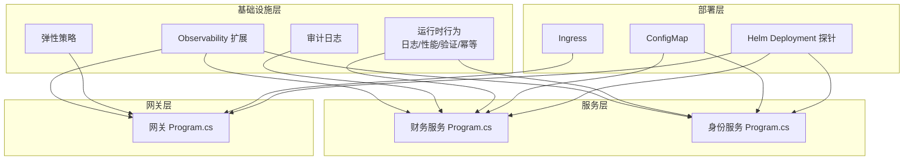
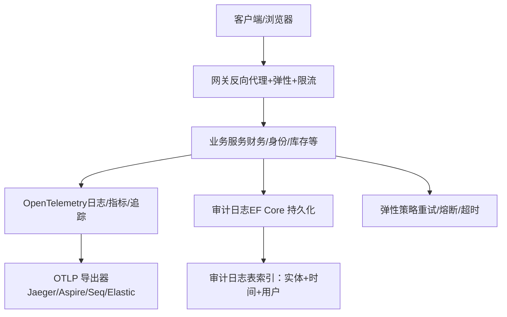
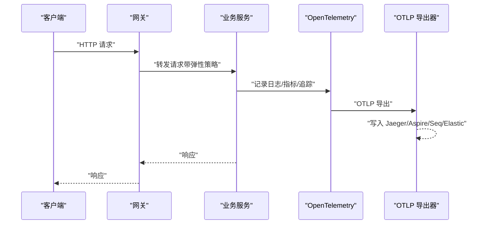
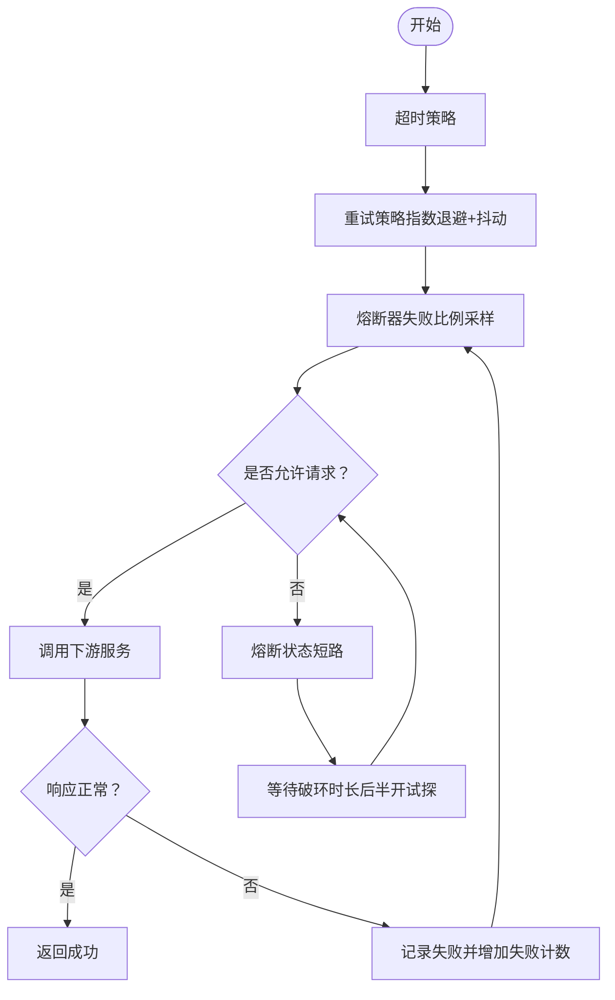
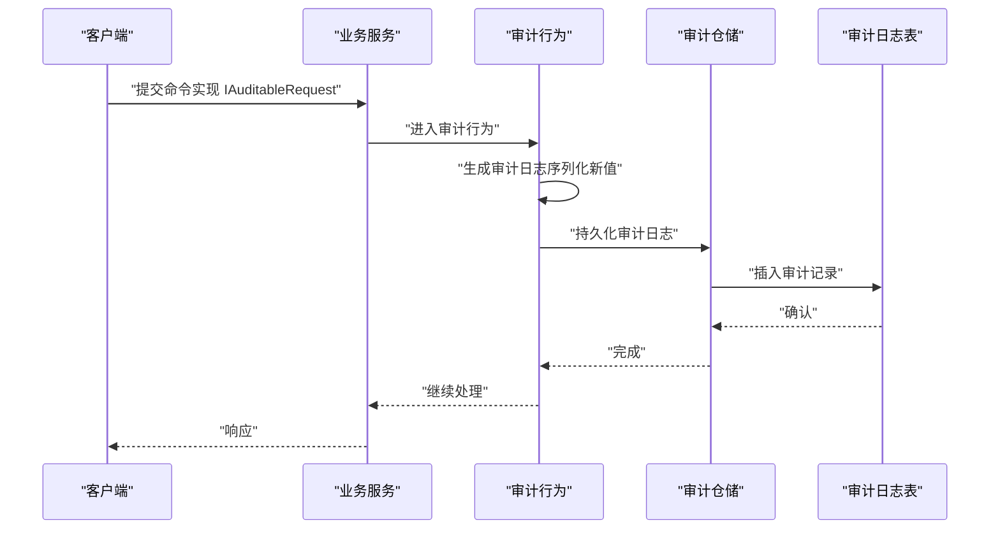
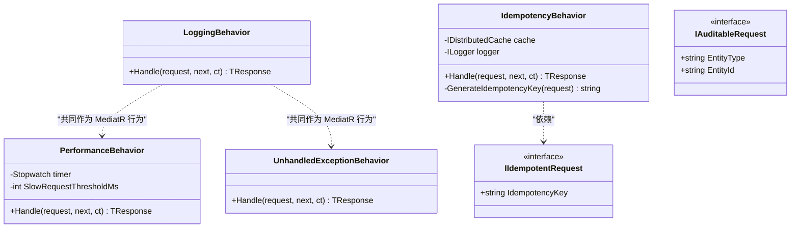
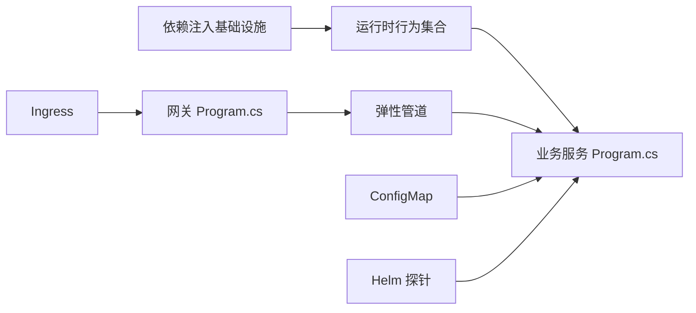

# 可观测性与监控

<cite>
**本文引用的文件**
- [ObservabilityExtensions.cs](file://src/BuildingBlocks/ErpSystem.BuildingBlocks/Observability/ObservabilityExtensions.cs)
- [ResiliencePolicies.cs](file://src/BuildingBlocks/ErpSystem.BuildingBlocks/Resilience/ResiliencePolicies.cs)
- [AuditLog.cs](file://src/BuildingBlocks/ErpSystem.BuildingBlocks/Auditing/AuditLog.cs)
- [LoggingBehavior.cs](file://src/BuildingBlocks/ErpSystem.BuildingBlocks/Behaviors/LoggingBehavior.cs)
- [PerformanceBehavior.cs](file://src/BuildingBlocks/ErpSystem.BuildingBlocks/Behaviors/PerformanceBehavior.cs)
- [ValidationBehavior.cs](file://src/BuildingBlocks/ErpSystem.BuildingBlocks/Behaviors/ValidationBehavior.cs)
- [IdempotencyBehavior.cs](file://src/BuildingBlocks/ErpSystem.BuildingBlocks/Behaviors/IdempotencyBehavior.cs)
- [DependencyInjection.cs](file://src/BuildingBlocks/ErpSystem.BuildingBlocks/DependencyInjection.cs)
- [Program.cs（财务服务）](file://src/Services/Finance/ErpSystem.Finance/Program.cs)
- [Program.cs（身份服务）](file://src/Services/Identity/ErpSystem.Identity/Program.cs)
- [Program.cs（网关）](file://src/Gateways/ErpSystem.Gateway/Program.cs)
- [appsettings.Development.json（CRM）](file://src/Services/CRM/ErpSystem.CRM/appsettings.Development.json)
- [configmap.yaml](file://deploy/k8s/configmap.yaml)
- [ingress.yaml](file://deploy/k8s/ingress.yaml)
- [deployment.yaml（Helm）](file://deploy/helm/erp-system/templates/deployment.yaml)
</cite>

## 目录
1. [引言](#引言)
2. [项目结构](#项目结构)
3. [核心组件](#核心组件)
4. [架构总览](#架构总览)
5. [详细组件分析](#详细组件分析)
6. [依赖关系分析](#依赖关系分析)
7. [性能考量](#性能考量)
8. [故障排查指南](#故障排查指南)
9. [结论](#结论)
10. [附录](#附录)

## 引言
本文件面向微服务架构下的可观测性与监控，系统化阐述仓库中已实现的可观测性扩展、弹性策略、熔断器模式、故障恢复机制、审计日志与操作追踪、分布式追踪与性能指标采集、以及告警与健康检查的配置要点。文档以“可落地、可复用”为目标，既提供高层架构视图，也给出关键实现位置与调用路径，帮助读者快速理解并应用到实际服务中。

## 项目结构
可观测性相关能力主要集中在以下位置：
- 基础设施层（BuildingBlocks）
  - 观测性扩展：日志、指标、追踪的统一接入
  - 弹性策略：重试、熔断、超时的组合策略
  - 审计日志：命令执行审计与数据持久化
  - 运行时行为：日志、性能、异常、幂等性等横切关注点
- 业务服务层（Services）
  - 各服务的 Program.cs 中体现健康检查、事件总线、MediatR 等基础能力
- 网关层（Gateways）
  - 统一的弹性管道、反向代理与速率限制
- 部署层（Kubernetes/Helm）
  - Ingress、ConfigMap、探针等运维与可观测性支撑

**图表来源**
- [ObservabilityExtensions.cs](file://src/BuildingBlocks/ErpSystem.BuildingBlocks/Observability/ObservabilityExtensions.cs#L12-L42)
- [ResiliencePolicies.cs](file://src/BuildingBlocks/ErpSystem.BuildingBlocks/Resilience/ResiliencePolicies.cs#L18-L90)
- [AuditLog.cs](file://src/BuildingBlocks/ErpSystem.BuildingBlocks/Auditing/AuditLog.cs#L65-L101)
- [LoggingBehavior.cs](file://src/BuildingBlocks/ErpSystem.BuildingBlocks/Behaviors/LoggingBehavior.cs#L6-L21)
- [PerformanceBehavior.cs](file://src/BuildingBlocks/ErpSystem.BuildingBlocks/Behaviors/PerformanceBehavior.cs#L11-L39)
- [ValidationBehavior.cs](file://src/BuildingBlocks/ErpSystem.BuildingBlocks/Behaviors/ValidationBehavior.cs#L7-L33)
- [IdempotencyBehavior.cs](file://src/BuildingBlocks/ErpSystem.BuildingBlocks/Behaviors/IdempotencyBehavior.cs#L14-L50)
- [Program.cs（财务服务）](file://src/Services/Finance/ErpSystem.Finance/Program.cs#L13-L74)
- [Program.cs（身份服务）](file://src/Services/Identity/ErpSystem.Identity/Program.cs#L13-L68)
- [Program.cs（网关）](file://src/Gateways/ErpSystem.Gateway/Program.cs#L31-L58)
- [configmap.yaml](file://deploy/k8s/configmap.yaml#L12-L24)
- [ingress.yaml](file://deploy/k8s/ingress.yaml#L13-L36)
- [deployment.yaml（Helm）](file://deploy/helm/erp-system/templates/deployment.yaml#L42-L57)

**章节来源**
- [ObservabilityExtensions.cs](file://src/BuildingBlocks/ErpSystem.BuildingBlocks/Observability/ObservabilityExtensions.cs#L12-L42)
- [Program.cs（财务服务）](file://src/Services/Finance/ErpSystem.Finance/Program.cs#L13-L74)
- [Program.cs（身份服务）](file://src/Services/Identity/ErpSystem.Identity/Program.cs#L13-L68)
- [Program.cs（网关）](file://src/Gateways/ErpSystem.Gateway/Program.cs#L31-L58)
- [configmap.yaml](file://deploy/k8s/configmap.yaml#L12-L24)
- [ingress.yaml](file://deploy/k8s/ingress.yaml#L13-L36)
- [deployment.yaml（Helm）](file://deploy/helm/erp-system/templates/deployment.yaml#L42-L57)

## 核心组件
- 观测性扩展（日志/指标/追踪）
  - 在基础设施层提供统一的可观测性接入方法，启用 OpenTelemetry 日志、指标与追踪，并通过 OTLP 导出到外部系统
  - 适用于所有服务，便于集中采集与分析
- 弹性策略（重试/熔断/超时）
  - 提供可复用的 Polly ResiliencePipeline，支持指数退避、抖动、失败率采样、最小吞吐量阈值等参数
  - 网关层定义了标准的“default”弹性管道，用于统一保护下游服务
- 审计日志
  - 通过审计行为自动记录命令执行的关键信息，包含实体类型、实体ID、用户、租户、IP、UA、时间戳等
  - 支持按实体维度检索与合规归档
- 运行时行为（横切关注点）
  - 日志行为：记录请求进入与退出
  - 性能行为：慢请求告警阈值（毫秒级）
  - 异常行为：未处理异常捕获与记录
  - 幂等性行为：基于分布式缓存的重复请求去重

**章节来源**
- [ObservabilityExtensions.cs](file://src/BuildingBlocks/ErpSystem.BuildingBlocks/Observability/ObservabilityExtensions.cs#L12-L42)
- [ResiliencePolicies.cs](file://src/BuildingBlocks/ErpSystem.BuildingBlocks/Resilience/ResiliencePolicies.cs#L18-L109)
- [AuditLog.cs](file://src/BuildingBlocks/ErpSystem.BuildingBlocks/Auditing/AuditLog.cs#L28-L53)
- [LoggingBehavior.cs](file://src/BuildingBlocks/ErpSystem.BuildingBlocks/Behaviors/LoggingBehavior.cs#L6-L21)
- [PerformanceBehavior.cs](file://src/BuildingBlocks/ErpSystem.BuildingBlocks/Behaviors/PerformanceBehavior.cs#L11-L39)
- [IdempotencyBehavior.cs](file://src/BuildingBlocks/ErpSystem.BuildingBlocks/Behaviors/IdempotencyBehavior.cs#L14-L50)

## 架构总览
下图展示了从客户端到服务端、再到可观测性后端的数据流与控制流，涵盖弹性策略、审计日志与分布式追踪。

**图表来源**
- [Program.cs（网关）](file://src/Gateways/ErpSystem.Gateway/Program.cs#L31-L58)
- [ObservabilityExtensions.cs](file://src/BuildingBlocks/ErpSystem.BuildingBlocks/Observability/ObservabilityExtensions.cs#L22-L39)
- [AuditLog.cs](file://src/BuildingBlocks/ErpSystem.BuildingBlocks/Auditing/AuditLog.cs#L115-L134)
- [ResiliencePolicies.cs](file://src/BuildingBlocks/ErpSystem.BuildingBlocks/Resilience/ResiliencePolicies.cs#L18-L90)

## 详细组件分析

### 观测性扩展（日志/指标/追踪）
- 功能要点
  - 启用 OpenTelemetry 日志，包含格式化消息与作用域
  - 注册 ASP.NET Core、HTTP 客户端与运行时指标
  - 为每个服务设置资源标签（serviceName），并添加源追踪
  - 默认启用 OTLP 导出器，需在部署时设置导出端点环境变量
- 使用方式
  - 在服务 Program.cs 中调用扩展方法，传入服务名
  - 通过环境变量配置 OTLP 端点，实现集中式观测
- 关键实现位置
  - 观测性扩展方法与指标/追踪注册
  - 服务端点中对健康检查与中间件的使用

**图表来源**
- [ObservabilityExtensions.cs](file://src/BuildingBlocks/ErpSystem.BuildingBlocks/Observability/ObservabilityExtensions.cs#L14-L39)
- [Program.cs（财务服务）](file://src/Services/Finance/ErpSystem.Finance/Program.cs#L51-L74)
- [Program.cs（身份服务）](file://src/Services/Identity/ErpSystem.Identity/Program.cs#L43-L68)
- [Program.cs（网关）](file://src/Gateways/ErpSystem.Gateway/Program.cs#L68-L81)

**章节来源**
- [ObservabilityExtensions.cs](file://src/BuildingBlocks/ErpSystem.BuildingBlocks/Observability/ObservabilityExtensions.cs#L12-L42)
- [Program.cs（财务服务）](file://src/Services/Finance/ErpSystem.Finance/Program.cs#L51-L74)
- [Program.cs（身份服务）](file://src/Services/Identity/ErpSystem.Identity/Program.cs#L43-L68)
- [Program.cs（网关）](file://src/Gateways/ErpSystem.Gateway/Program.cs#L68-L81)

### 弹性策略（重试/熔断/超时）
- 设计理念
  - 使用 Polly 的 ResiliencePipelineBuilder，将重试、熔断、超时组合成稳定可靠的调用链
  - 支持针对 HTTP 响应结果进行细粒度的错误判定
- 关键策略
  - 标准重试：指数退避，可配置最大次数
  - 熔断器：失败比例采样窗口、最小吞吐量、破环时长
  - 超时：统一超时策略，避免资源长时间占用
  - 组合策略：超时 → 重试 → 熔断，形成闭环保护
- 网关层应用
  - 定义名为 “default” 的弹性管道，统一保护对外 HTTP 调用
  - 结合速率限制，防止突发流量冲击后端

**图表来源**
- [ResiliencePolicies.cs](file://src/BuildingBlocks/ErpSystem.BuildingBlocks/Resilience/ResiliencePolicies.cs#L18-L90)
- [Program.cs（网关）](file://src/Gateways/ErpSystem.Gateway/Program.cs#L31-L58)

**章节来源**
- [ResiliencePolicies.cs](file://src/BuildingBlocks/ErpSystem.BuildingBlocks/Resilience/ResiliencePolicies.cs#L18-L109)
- [Program.cs（网关）](file://src/Gateways/ErpSystem.Gateway/Program.cs#L31-L58)

### 审计日志（操作追踪与合规）
- 数据模型
  - 审计日志实体包含：实体类型、实体ID、动作、旧值、新值、用户ID、租户ID、IP、UA、时间戳
  - EF Core 配置包含主键、长度约束、复合索引（实体+ID）、时间索引、用户索引
- 记录流程
  - 通过审计行为拦截实现了“可审计请求”的命令，生成审计条目并持久化
  - 失败时记录错误日志，不影响业务主流程
- 查询接口
  - 提供按实体维度查询审计历史的能力，便于回溯与审计

**图表来源**
- [AuditLog.cs](file://src/BuildingBlocks/ErpSystem.BuildingBlocks/Auditing/AuditLog.cs#L28-L101)
- [AuditLog.cs](file://src/BuildingBlocks/ErpSystem.BuildingBlocks/Auditing/AuditLog.cs#L115-L134)

**章节来源**
- [AuditLog.cs](file://src/BuildingBlocks/ErpSystem.BuildingBlocks/Auditing/AuditLog.cs#L12-L134)

### 运行时行为（日志/性能/异常/幂等）
- 日志行为：记录请求名称与请求体，便于定位问题
- 性能行为：超过阈值（毫秒）记录警告日志，辅助识别慢请求
- 异常行为：捕获未处理异常并记录，确保异常不被吞没
- 幂等性行为：基于分布式缓存的去重，防止重复执行；使用 SHA256 生成键，支持响应缓存与复用

**图表来源**
- [LoggingBehavior.cs](file://src/BuildingBlocks/ErpSystem.BuildingBlocks/Behaviors/LoggingBehavior.cs#L6-L21)
- [PerformanceBehavior.cs](file://src/BuildingBlocks/ErpSystem.BuildingBlocks/Behaviors/PerformanceBehavior.cs#L11-L67)
- [IdempotencyBehavior.cs](file://src/BuildingBlocks/ErpSystem.BuildingBlocks/Behaviors/IdempotencyBehavior.cs#L14-L61)

**章节来源**
- [LoggingBehavior.cs](file://src/BuildingBlocks/ErpSystem.BuildingBlocks/Behaviors/LoggingBehavior.cs#L6-L21)
- [PerformanceBehavior.cs](file://src/BuildingBlocks/ErpSystem.BuildingBlocks/Behaviors/PerformanceBehavior.cs#L11-L67)
- [IdempotencyBehavior.cs](file://src/BuildingBlocks/ErpSystem.BuildingBlocks/Behaviors/IdempotencyBehavior.cs#L14-L61)

## 依赖关系分析
- 服务注册与行为装配
  - 基础设施层通过依赖注入注册验证器、日志行为、验证行为等
  - 业务服务在 Program.cs 中注册 MediatR、事件总线、健康检查等
- 弹性策略与网关
  - 网关层集中定义弹性管道，服务间调用可复用该管道
- 部署与环境
  - ConfigMap 提供数据库连接、Redis 缓存、服务 URL 等运行时配置
  - Ingress 将外部流量路由至网关或报告服务
  - Helm 部署模板配置存活/就绪探针，结合 /health 端点保障可观测性

**图表来源**
- [DependencyInjection.cs](file://src/BuildingBlocks/ErpSystem.BuildingBlocks/DependencyInjection.cs#L12-L29)
- [Program.cs（财务服务）](file://src/Services/Finance/ErpSystem.Finance/Program.cs#L29-L35)
- [Program.cs（网关）](file://src/Gateways/ErpSystem.Gateway/Program.cs#L31-L58)
- [configmap.yaml](file://deploy/k8s/configmap.yaml#L12-L24)
- [ingress.yaml](file://deploy/k8s/ingress.yaml#L13-L36)
- [deployment.yaml（Helm）](file://deploy/helm/erp-system/templates/deployment.yaml#L42-L57)

**章节来源**
- [DependencyInjection.cs](file://src/BuildingBlocks/ErpSystem.BuildingBlocks/DependencyInjection.cs#L12-L29)
- [Program.cs（财务服务）](file://src/Services/Finance/ErpSystem.Finance/Program.cs#L29-L35)
- [Program.cs（网关）](file://src/Gateways/ErpSystem.Gateway/Program.cs#L31-L58)
- [configmap.yaml](file://deploy/k8s/configmap.yaml#L12-L24)
- [ingress.yaml](file://deploy/k8s/ingress.yaml#L13-L36)
- [deployment.yaml（Helm）](file://deploy/helm/erp-system/templates/deployment.yaml#L42-L57)

## 性能考量
- 指标采集
  - ASP.NET Core、HTTP 客户端、运行时指标已内置，建议结合自定义计数器与直方图完善关键路径指标
- 慢请求识别
  - 性能行为默认阈值为毫秒级，可根据服务负载调整
- 缓存与幂等
  - 幂等性行为依赖分布式缓存，需保证缓存可用性与过期策略合理
- 弹性策略参数
  - 重试延迟、抖动、熔断失败比例与最小吞吐量需结合下游 SLA 调优
- 探针与健康检查
  - 使用 /health 端点配合存活/就绪探针，避免不健康实例影响流量

[本节为通用指导，无需特定文件引用]

## 故障排查指南
- 观测性未生效
  - 检查是否调用了观测性扩展方法，确认 OTLP 环境变量是否正确设置
  - 参考：[ObservabilityExtensions.cs](file://src/BuildingBlocks/ErpSystem.BuildingBlocks/Observability/ObservabilityExtensions.cs#L12-L42)
- 慢请求频繁
  - 查看性能行为日志中的慢请求告警，定位热点请求与耗时环节
  - 参考：[PerformanceBehavior.cs](file://src/BuildingBlocks/ErpSystem.BuildingBlocks/Behaviors/PerformanceBehavior.cs#L11-L39)
- 重复请求导致副作用
  - 确认请求是否实现幂等接口，检查分布式缓存连通性与键空间
  - 参考：[IdempotencyBehavior.cs](file://src/BuildingBlocks/ErpSystem.BuildingBlocks/Behaviors/IdempotencyBehavior.cs#L14-L50)
- 审计日志缺失
  - 确认请求是否实现可审计接口，检查审计仓储持久化是否抛错
  - 参考：[AuditLog.cs](file://src/BuildingBlocks/ErpSystem.BuildingBlocks/Auditing/AuditLog.cs#L65-L101)
- 网关调用失败
  - 检查弹性管道参数与速率限制配置，确认下游服务健康状态
  - 参考：[Program.cs（网关）](file://src/Gateways/ErpSystem.Gateway/Program.cs#L31-L58)

**章节来源**
- [ObservabilityExtensions.cs](file://src/BuildingBlocks/ErpSystem.BuildingBlocks/Observability/ObservabilityExtensions.cs#L12-L42)
- [PerformanceBehavior.cs](file://src/BuildingBlocks/ErpSystem.BuildingBlocks/Behaviors/PerformanceBehavior.cs#L11-L39)
- [IdempotencyBehavior.cs](file://src/BuildingBlocks/ErpSystem.BuildingBlocks/Behaviors/IdempotencyBehavior.cs#L14-L50)
- [AuditLog.cs](file://src/BuildingBlocks/ErpSystem.BuildingBlocks/Auditing/AuditLog.cs#L65-L101)
- [Program.cs（网关）](file://src/Gateways/ErpSystem.Gateway/Program.cs#L31-L58)

## 结论
本项目在基础设施层提供了统一的可观测性扩展，在服务层通过 MediatR 行为与弹性策略实现高韧性与可观察性，同时以审计日志满足合规与可追溯需求。结合网关层的统一弹性与速率限制，以及部署层的健康检查与路由策略，形成了覆盖请求全生命周期的可观测性体系。建议在生产环境中进一步完善自定义指标、告警规则与日志分级策略，持续优化弹性参数与缓存配置。

[本节为总结，无需特定文件引用]

## 附录

### 如何配置监控扩展（示例路径）
- 在服务 Program.cs 中调用观测性扩展方法，传入服务名
  - 示例路径：[Program.cs（财务服务）](file://src/Services/Finance/ErpSystem.Finance/Program.cs#L13-L74)
  - 示例路径：[Program.cs（身份服务）](file://src/Services/Identity/ErpSystem.Identity/Program.cs#L13-L68)
- 设置 OTLP 导出端点（环境变量）
  - 示例路径：[ObservabilityExtensions.cs](file://src/BuildingBlocks/ErpSystem.BuildingBlocks/Observability/ObservabilityExtensions.cs#L36-L38)

**章节来源**
- [Program.cs（财务服务）](file://src/Services/Finance/ErpSystem.Finance/Program.cs#L13-L74)
- [Program.cs（身份服务）](file://src/Services/Identity/ErpSystem.Identity/Program.cs#L13-L68)
- [ObservabilityExtensions.cs](file://src/BuildingBlocks/ErpSystem.BuildingBlocks/Observability/ObservabilityExtensions.cs#L36-L38)

### 如何实现弹性策略（示例路径）
- 定义“default”弹性管道（重试/熔断/超时）
  - 示例路径：[Program.cs（网关）](file://src/Gateways/ErpSystem.Gateway/Program.cs#L31-L58)
- 使用预置策略（重试/熔断/超时/组合）
  - 示例路径：[ResiliencePolicies.cs](file://src/BuildingBlocks/ErpSystem.BuildingBlocks/Resilience/ResiliencePolicies.cs#L18-L90)

**章节来源**
- [Program.cs（网关）](file://src/Gateways/ErpSystem.Gateway/Program.cs#L31-L58)
- [ResiliencePolicies.cs](file://src/BuildingBlocks/ErpSystem.BuildingBlocks/Resilience/ResiliencePolicies.cs#L18-L90)

### 如何记录审计日志（示例路径）
- 实现可审计请求接口并触发审计行为
  - 示例路径：[AuditLog.cs](file://src/BuildingBlocks/ErpSystem.BuildingBlocks/Auditing/AuditLog.cs#L65-L101)
- EF Core 模型配置与索引
  - 示例路径：[AuditLog.cs](file://src/BuildingBlocks/ErpSystem.BuildingBlocks/Auditing/AuditLog.cs#L115-L134)

**章节来源**
- [AuditLog.cs](file://src/BuildingBlocks/ErpSystem.BuildingBlocks/Auditing/AuditLog.cs#L65-L134)

### 分布式追踪与性能监控（示例路径）
- 启用追踪与 OTLP 导出
  - 示例路径：[ObservabilityExtensions.cs](file://src/BuildingBlocks/ErpSystem.BuildingBlocks/Observability/ObservabilityExtensions.cs#L29-L39)
- 开发环境日志级别配置
  - 示例路径：[appsettings.Development.json（CRM）](file://src/Services/CRM/ErpSystem.CRM/appsettings.Development.json#L1-L8)

**章节来源**
- [ObservabilityExtensions.cs](file://src/BuildingBlocks/ErpSystem.BuildingBlocks/Observability/ObservabilityExtensions.cs#L29-L39)
- [appsettings.Development.json（CRM）](file://src/Services/CRM/ErpSystem.CRM/appsettings.Development.json#L1-L8)

### 健康检查与告警（示例路径）
- 服务端点映射健康检查
  - 示例路径：[Program.cs（财务服务）](file://src/Services/Finance/ErpSystem.Finance/Program.cs#L64-L71)
  - 示例路径：[Program.cs（身份服务）](file://src/Services/Identity/ErpSystem.Identity/Program.cs#L55-L66)
- Helm 探针配置
  - 示例路径：[deployment.yaml（Helm）](file://deploy/helm/erp-system/templates/deployment.yaml#L42-L57)
- Ingress 路由与服务暴露
  - 示例路径：[ingress.yaml](file://deploy/k8s/ingress.yaml#L13-L36)
- 全局运行时配置（连接串、Redis、服务URL）
  - 示例路径：[configmap.yaml](file://deploy/k8s/configmap.yaml#L12-L24)

**章节来源**
- [Program.cs（财务服务）](file://src/Services/Finance/ErpSystem.Finance/Program.cs#L64-L71)
- [Program.cs（身份服务）](file://src/Services/Identity/ErpSystem.Identity/Program.cs#L55-L66)
- [deployment.yaml（Helm）](file://deploy/helm/erp-system/templates/deployment.yaml#L42-L57)
- [ingress.yaml](file://deploy/k8s/ingress.yaml#L13-L36)
- [configmap.yaml](file://deploy/k8s/configmap.yaml#L12-L24)