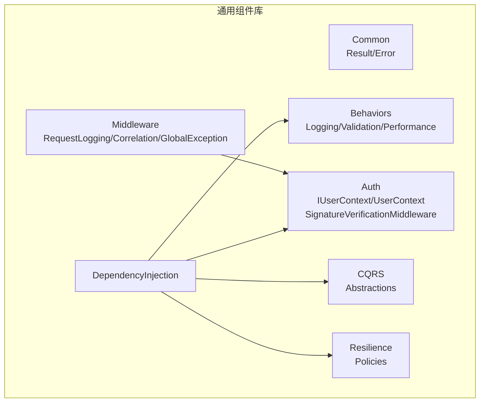
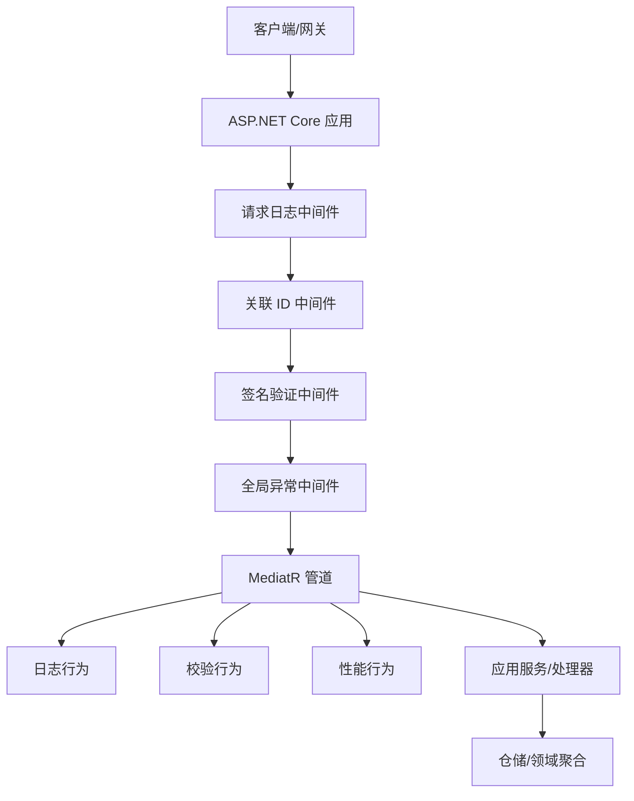
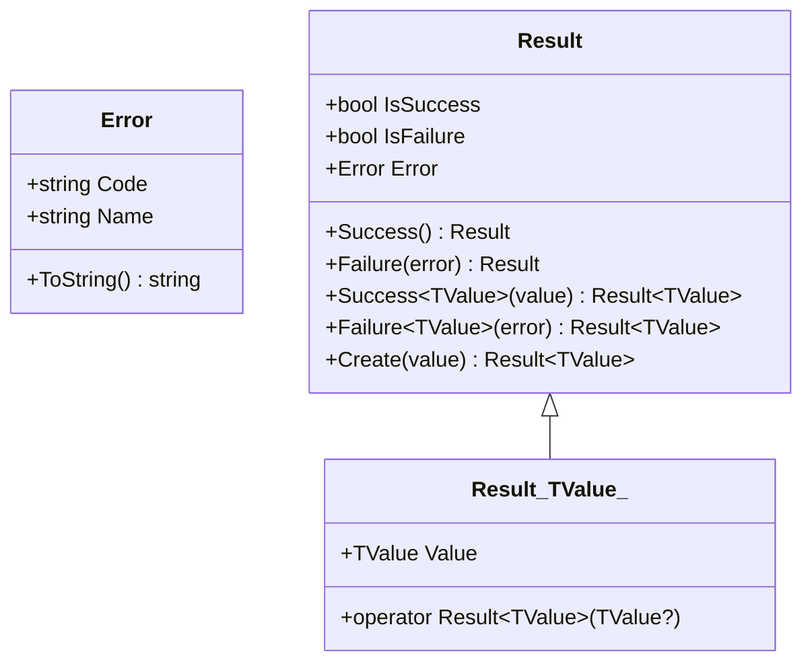
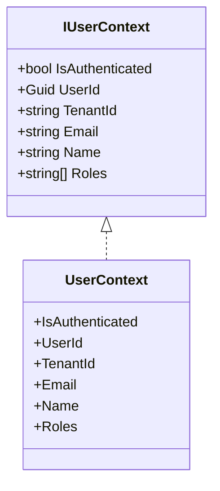
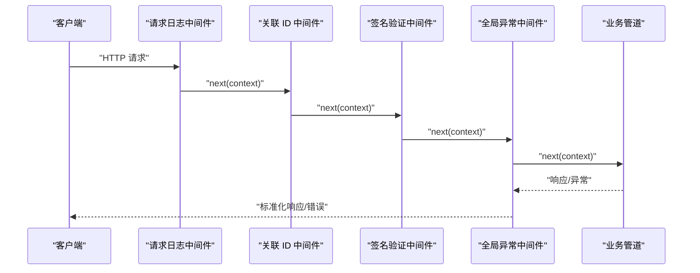
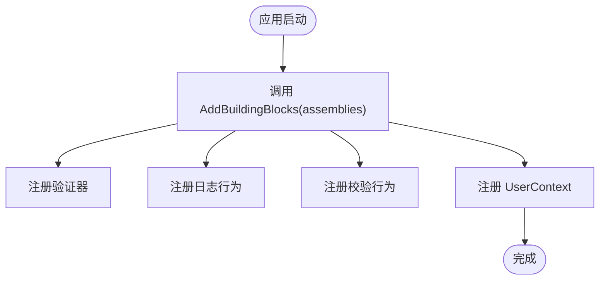
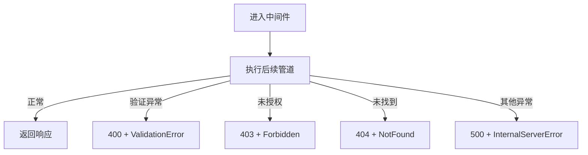
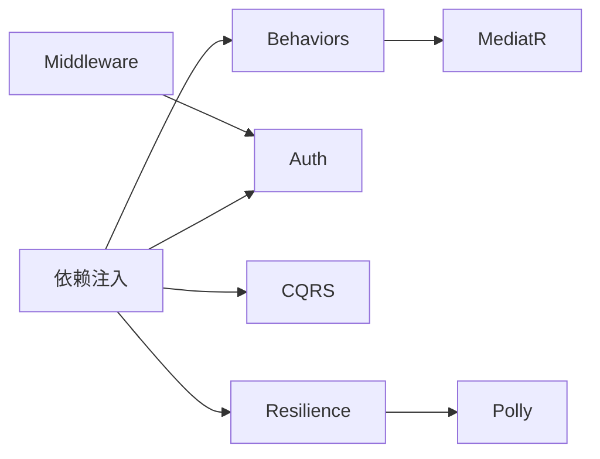

# 通用组件库

<cite>
**本文引用的文件**
- [Result.cs](file://src/BuildingBlocks/ErpSystem.BuildingBlocks/Common/Result.cs)
- [IUserContext.cs](file://src/BuildingBlocks/ErpSystem.BuildingBlocks/Auth/IUserContext.cs)
- [UserContext.cs](file://src/BuildingBlocks/ErpSystem.BuildingBlocks/Auth/UserContext.cs)
- [SignatureVerificationMiddleware.cs](file://src/BuildingBlocks/ErpSystem.BuildingBlocks/Auth/SignatureVerificationMiddleware.cs)
- [Middlewares.cs](file://src/BuildingBlocks/ErpSystem.BuildingBlocks/Middleware/Middlewares.cs)
- [DependencyInjection.cs](file://src/BuildingBlocks/ErpSystem.BuildingBlocks/DependencyInjection.cs)
- [AuthExtensions.cs](file://src/BuildingBlocks/ErpSystem.BuildingBlocks/Auth/AuthExtensions.cs)
- [Abstractions.cs](file://src/BuildingBlocks/ErpSystem.BuildingBlocks/CQRS/Abstractions.cs)
- [ValidationBehavior.cs](file://src/BuildingBlocks/ErpSystem.BuildingBlocks/Behaviors/ValidationBehavior.cs)
- [LoggingBehavior.cs](file://src/BuildingBlocks/ErpSystem.BuildingBlocks/Behaviors/LoggingBehavior.cs)
- [PerformanceBehavior.cs](file://src/BuildingBlocks/ErpSystem.BuildingBlocks/Behaviors/PerformanceBehavior.cs)
- [ResiliencePolicies.cs](file://src/BuildingBlocks/ErpSystem.BuildingBlocks/Resilience/ResiliencePolicies.cs)
- [FinanceCommands.cs](file://src/Services/Finance/ErpSystem.Finance/Application/FinanceCommands.cs)
- [AuthController.cs](file://src/Services/Identity/ErpSystem.Identity/API/AuthController.cs)
</cite>

## 目录
1. [简介](#简介)
2. [项目结构](#项目结构)
3. [核心组件](#核心组件)
4. [架构总览](#架构总览)
5. [详细组件分析](#详细组件分析)
6. [依赖关系分析](#依赖关系分析)
7. [性能考虑](#性能考虑)
8. [故障排查指南](#故障排查指南)
9. [结论](#结论)
10. [附录：使用示例与最佳实践](#附录使用示例与最佳实践)

## 简介
本文件系统性梳理通用组件库的设计与实现，重点覆盖以下主题：
- Result 模式：设计理念、成功/失败状态建模、空值安全与隐式转换。
- 用户上下文接口与实现：身份认证状态、用户标识、租户、角色与邮箱等信息的提取与使用。
- 中间件体系：请求日志、关联 ID、全局异常处理与签名验证中间件的职责与接入方式。
- 依赖注入与扩展点：通用行为（日志、校验、性能）注册、CQRS 抽象、弹性策略。
- 在系统中的作用与复用价值：统一错误表达、跨服务一致的用户上下文、可插拔中间件与可组合的弹性策略。

## 项目结构
通用组件库位于 BuildingBlocks 子项目中，围绕“领域无关”的横切能力构建，供各业务服务复用。主要模块包括：
- Common：Result 模式与错误类型。
- Auth：用户上下文接口与实现、签名验证中间件及扩展。
- Middleware：请求日志、关联 ID、全局异常处理等通用中间件。
- Behaviors：MediatR 管道行为（日志、校验、性能、未处理异常）。
- CQRS：命令/查询抽象。
- Resilience：基于 Polly 的弹性策略工厂。
- DependencyInjection：统一注册入口。

图表来源
- [DependencyInjection.cs](file://src/BuildingBlocks/ErpSystem.BuildingBlocks/DependencyInjection.cs#L10-L30)
- [Middlewares.cs](file://src/BuildingBlocks/ErpSystem.BuildingBlocks/Middleware/Middlewares.cs#L10-L124)
- [SignatureVerificationMiddleware.cs](file://src/BuildingBlocks/ErpSystem.BuildingBlocks/Auth/SignatureVerificationMiddleware.cs#L14-L76)
- [UserContext.cs](file://src/BuildingBlocks/ErpSystem.BuildingBlocks/Auth/UserContext.cs#L6-L33)
- [ValidationBehavior.cs](file://src/BuildingBlocks/ErpSystem.BuildingBlocks/Behaviors/ValidationBehavior.cs#L7-L32)
- [LoggingBehavior.cs](file://src/BuildingBlocks/ErpSystem.BuildingBlocks/Behaviors/LoggingBehavior.cs#L6-L20)
- [PerformanceBehavior.cs](file://src/BuildingBlocks/ErpSystem.BuildingBlocks/Behaviors/PerformanceBehavior.cs#L11-L39)
- [ResiliencePolicies.cs](file://src/BuildingBlocks/ErpSystem.BuildingBlocks/Resilience/ResiliencePolicies.cs#L13-L110)

章节来源
- [DependencyInjection.cs](file://src/BuildingBlocks/ErpSystem.BuildingBlocks/DependencyInjection.cs#L10-L30)

## 核心组件
- Result 模式：通过不可变的 Error 类型与 Result/Result<TValue> 表达成功/失败，提供空值安全的创建与访问，避免异常作为控制流。
- 用户上下文：IUserContext 抽象与 UserContext 实现，从 HttpContext 提取认证状态、用户 ID、租户、角色与邮箱。
- 中间件：请求日志、关联 ID 注入、全局异常处理；签名验证中间件用于外部 API 调用的身份与完整性校验。
- 依赖注入：集中注册验证器、管道行为、用户上下文与弹性策略。
- CQRS 抽象：统一命令/查询接口，便于在应用层以一致方式编排业务。
- 弹性策略：提供重试、熔断、超时与组合策略，适配 HTTP 与通用场景。

章节来源
- [Result.cs](file://src/BuildingBlocks/ErpSystem.BuildingBlocks/Common/Result.cs#L3-L55)
- [IUserContext.cs](file://src/BuildingBlocks/ErpSystem.BuildingBlocks/Auth/IUserContext.cs#L3-L11)
- [UserContext.cs](file://src/BuildingBlocks/ErpSystem.BuildingBlocks/Auth/UserContext.cs#L6-L33)
- [Middlewares.cs](file://src/BuildingBlocks/ErpSystem.BuildingBlocks/Middleware/Middlewares.cs#L10-L124)
- [SignatureVerificationMiddleware.cs](file://src/BuildingBlocks/ErpSystem.BuildingBlocks/Auth/SignatureVerificationMiddleware.cs#L14-L76)
- [DependencyInjection.cs](file://src/BuildingBlocks/ErpSystem.BuildingBlocks/DependencyInjection.cs#L10-L30)
- [Abstractions.cs](file://src/BuildingBlocks/ErpSystem.BuildingBlocks/CQRS/Abstractions.cs#L7-L38)
- [ResiliencePolicies.cs](file://src/BuildingBlocks/ErpSystem.BuildingBlocks/Resilience/ResiliencePolicies.cs#L13-L110)

## 架构总览
通用组件库通过依赖注入在服务启动阶段装配横切能力，并在运行期通过中间件与管道行为对请求进行统一处理。Result 模式贯穿应用层，确保错误处理的一致性与可测试性。

图表来源
- [Middlewares.cs](file://src/BuildingBlocks/ErpSystem.BuildingBlocks/Middleware/Middlewares.cs#L10-L124)
- [SignatureVerificationMiddleware.cs](file://src/BuildingBlocks/ErpSystem.BuildingBlocks/Auth/SignatureVerificationMiddleware.cs#L14-L76)
- [ValidationBehavior.cs](file://src/BuildingBlocks/ErpSystem.BuildingBlocks/Behaviors/ValidationBehavior.cs#L7-L32)
- [LoggingBehavior.cs](file://src/BuildingBlocks/ErpSystem.BuildingBlocks/Behaviors/LoggingBehavior.cs#L6-L20)
- [PerformanceBehavior.cs](file://src/BuildingBlocks/ErpSystem.BuildingBlocks/Behaviors/PerformanceBehavior.cs#L11-L39)

## 详细组件分析

### Result 模式设计与使用
- 设计理念
  - 使用不可变 Error 记录错误码与名称，Result/Result<TValue> 将成功与失败状态与错误信息解耦。
  - 通过构造函数约束成功与失败状态的一致性，防止无效组合。
  - 提供静态工厂方法与隐式转换，简化调用端写法。
- 成功/失败状态与空值安全
  - 成功：IsSuccess=true，Error=None。
  - 失败：IsSuccess=false，Error!=None。
  - Create<TValue> 对空值返回特定错误，Value 属性在失败时抛出异常，避免误用。
- 典型用法
  - 返回 Result 或 Result<TValue>，在调用端通过 IsSuccess 判断分支，或使用 Failure/Success 工厂方法快速表达。
  - 与 MediatR 结合时，可在应用服务中返回 Result，由上层控制器或中间件统一映射为 HTTP 响应。

图表来源
- [Result.cs](file://src/BuildingBlocks/ErpSystem.BuildingBlocks/Common/Result.cs#L3-L55)

章节来源
- [Result.cs](file://src/BuildingBlocks/ErpSystem.BuildingBlocks/Common/Result.cs#L11-L55)

### 用户上下文接口与实现
- 接口职责
  - 提供 IsAuthenticated、UserId、TenantId、Email、Name、Roles 等只读属性，屏蔽底层身份源差异。
- 实现要点
  - 从 IHttpContextAccessor 获取 Claims，优先使用标准 ClaimTypes 或常用字段别名（如 sub、tenant_id）。
  - 角色集合通过 FindAll(ClaimTypes.Role) 收集，无值时返回空列表。
- 使用场景
  - 权限控制、审计日志、多租户隔离、用户画像等。

图表来源
- [IUserContext.cs](file://src/BuildingBlocks/ErpSystem.BuildingBlocks/Auth/IUserContext.cs#L3-L11)
- [UserContext.cs](file://src/BuildingBlocks/ErpSystem.BuildingBlocks/Auth/UserContext.cs#L6-L33)

章节来源
- [IUserContext.cs](file://src/BuildingBlocks/ErpSystem.BuildingBlocks/Auth/IUserContext.cs#L3-L11)
- [UserContext.cs](file://src/BuildingBlocks/ErpSystem.BuildingBlocks/Auth/UserContext.cs#L6-L33)

### 中间件注册与执行顺序
- 注册方式
  - 通过扩展方法将中间件挂载到管道，支持按需启用。
- 执行顺序
  - 请求日志中间件：记录请求开始与完成状态、耗时与状态码。
  - 关联 ID 中间件：生成/透传 X-Correlation-ID，便于分布式追踪。
  - 签名验证中间件：校验外部 API 请求的签名、时间戳与 AppId。
  - 全局异常中间件：捕获未处理异常，输出标准化错误响应。
- 自定义中间件开发
  - 遵循委托签名 RequestDelegate next，先处理请求前逻辑，再调用 next(context)，最后处理响应后逻辑。
  - 注意异常处理与日志记录，必要时将异常转交全局异常中间件统一处理。

图表来源
- [Middlewares.cs](file://src/BuildingBlocks/ErpSystem.BuildingBlocks/Middleware/Middlewares.cs#L10-L124)
- [SignatureVerificationMiddleware.cs](file://src/BuildingBlocks/ErpSystem.BuildingBlocks/Auth/SignatureVerificationMiddleware.cs#L14-L76)

章节来源
- [Middlewares.cs](file://src/BuildingBlocks/ErpSystem.BuildingBlocks/Middleware/Middlewares.cs#L10-L124)
- [AuthExtensions.cs](file://src/BuildingBlocks/ErpSystem.BuildingBlocks/Auth/AuthExtensions.cs#L6-L18)

### 依赖注入与扩展点
- 统一注册
  - AddBuildingBlocks：批量注册验证器、日志与校验行为、UserContext。
- 扩展点
  - CQRS 抽象：命令/查询接口，便于在应用层统一编排。
  - 弹性策略：提供多种预置策略与组合策略，适配不同外部依赖。
- 最佳实践
  - 在服务启动时调用 AddBuildingBlocks 并传入需要扫描的程序集。
  - 通过 AuthExtensions 注册签名验证服务并启用中间件。

图表来源
- [DependencyInjection.cs](file://src/BuildingBlocks/ErpSystem.BuildingBlocks/DependencyInjection.cs#L10-L30)

章节来源
- [DependencyInjection.cs](file://src/BuildingBlocks/ErpSystem.BuildingBlocks/DependencyInjection.cs#L10-L30)
- [Abstractions.cs](file://src/BuildingBlocks/ErpSystem.BuildingBlocks/CQRS/Abstractions.cs#L7-L38)
- [ResiliencePolicies.cs](file://src/BuildingBlocks/ErpSystem.BuildingBlocks/Resilience/ResiliencePolicies.cs#L13-L110)

### 错误处理与异常映射
- 全局异常中间件
  - 捕获 FluentValidation.ValidationException、UnauthorizedAccessException、KeyNotFoundException 等，映射为标准化 JSON 响应与对应状态码。
  - 其他未处理异常记录日志并返回通用 500。
- 与 Result 模式的结合
  - 应用层可返回 Result，在上层统一映射为 HTTP 响应，保持错误语义一致。

图表来源
- [Middlewares.cs](file://src/BuildingBlocks/ErpSystem.BuildingBlocks/Middleware/Middlewares.cs#L73-L124)

章节来源
- [Middlewares.cs](file://src/BuildingBlocks/ErpSystem.BuildingBlocks/Middleware/Middlewares.cs#L73-L124)

## 依赖关系分析
- 组件内聚与耦合
  - Common 与 Auth 低耦合，通过接口 IUserContext 解耦上下文来源。
  - Middleware 与 Auth 可选集成（签名验证），不影响通用日志与异常处理。
  - Behaviors 与 MediatR 管道强耦合，但通过接口隔离具体实现。
- 外部依赖
  - ASP.NET Core：中间件、HttpContext、日志。
  - FluentValidation：参数校验。
  - Polly：弹性策略。
  - MediatR：命令/查询处理。

图表来源
- [DependencyInjection.cs](file://src/BuildingBlocks/ErpSystem.BuildingBlocks/DependencyInjection.cs#L10-L30)
- [Middlewares.cs](file://src/BuildingBlocks/ErpSystem.BuildingBlocks/Middleware/Middlewares.cs#L10-L124)
- [ResiliencePolicies.cs](file://src/BuildingBlocks/ErpSystem.BuildingBlocks/Resilience/ResiliencePolicies.cs#L13-L110)

章节来源
- [DependencyInjection.cs](file://src/BuildingBlocks/ErpSystem.BuildingBlocks/DependencyInjection.cs#L10-L30)
- [ResiliencePolicies.cs](file://src/BuildingBlocks/ErpSystem.BuildingBlocks/Resilience/ResiliencePolicies.cs#L13-L110)

## 性能考虑
- 中间件链路
  - 请求日志与关联 ID 开销极低，建议始终启用。
  - 签名验证涉及哈希计算与请求体读取，建议仅对外部 API 启用。
- 管道行为
  - 日志与性能行为开销可控，建议保留。
  - 校验行为会并发触发多个验证器，注意验证器复杂度与异步 I/O。
- 弹性策略
  - 合理设置重试次数与超时时间，避免放大下游压力。
  - 熔断阈值与最小吞吐量需结合业务流量与 SLA 调优。

## 故障排查指南
- 签名验证失败
  - 检查请求头是否包含 X-AppId、X-Timestamp、X-Nonce、X-Signature。
  - 核对时间戳是否在允许窗口内（默认 5 分钟）。
  - 确认 AppId 对应密钥已正确注册，且签名计算格式一致。
- 全局异常中间件返回 500
  - 查看日志中“Unhandled exception”条目，定位具体异常类型与堆栈。
  - 若为业务异常（如 KeyNotFoundException），建议在应用层返回 Result 并由上层映射。
- 验证失败返回 400
  - 检查请求体与模型绑定，确认验证器规则与输入数据匹配。

章节来源
- [SignatureVerificationMiddleware.cs](file://src/BuildingBlocks/ErpSystem.BuildingBlocks/Auth/SignatureVerificationMiddleware.cs#L14-L76)
- [Middlewares.cs](file://src/BuildingBlocks/ErpSystem.BuildingBlocks/Middleware/Middlewares.cs#L73-L124)

## 结论
通用组件库通过 Result 模式、用户上下文、中间件与依赖注入，提供了跨服务一致的错误表达、身份上下文与横切能力。其模块化设计与扩展点使得在不同服务中复用成为可能，同时通过弹性策略与管道行为保障了系统的可观测性与韧性。

## 附录：使用示例与最佳实践
- 使用 Result 进行错误处理
  - 在应用服务中返回 Result 或 Result<TValue>，在控制器或中间件中根据 IsSuccess 映射为 HTTP 响应。
  - 示例路径参考：[FinanceCommands.cs](file://src/Services/Finance/ErpSystem.Finance/Application/FinanceCommands.cs#L107-L140)
- 实现用户上下文
  - 通过依赖注入获取 IUserContext，读取当前用户标识、租户与角色，用于权限判断与审计。
  - 示例路径参考：[IUserContext.cs](file://src/BuildingBlocks/ErpSystem.BuildingBlocks/Auth/IUserContext.cs#L3-L11)、[UserContext.cs](file://src/BuildingBlocks/ErpSystem.BuildingBlocks/Auth/UserContext.cs#L6-L33)
- 开发自定义中间件
  - 遵循委托签名，先处理前置逻辑，再调用 next(context)，最后处理后置逻辑与异常。
  - 示例路径参考：[Middlewares.cs](file://src/BuildingBlocks/ErpSystem.BuildingBlocks/Middleware/Middlewares.cs#L10-L124)
- 中间件注册与配置
  - 在服务启动时调用 AddBuildingBlocks 注册通用行为与用户上下文；通过 AuthExtensions 启用签名验证。
  - 示例路径参考：[DependencyInjection.cs](file://src/BuildingBlocks/ErpSystem.BuildingBlocks/DependencyInjection.cs#L10-L30)、[AuthExtensions.cs](file://src/BuildingBlocks/ErpSystem.BuildingBlocks/Auth/AuthExtensions.cs#L6-L18)
- CQRS 抽象与管道行为
  - 使用命令/查询抽象，配合日志、校验与性能行为，提升可维护性与可观测性。
  - 示例路径参考：[Abstractions.cs](file://src/BuildingBlocks/ErpSystem.BuildingBlocks/CQRS/Abstractions.cs#L7-L38)、[ValidationBehavior.cs](file://src/BuildingBlocks/ErpSystem.BuildingBlocks/Behaviors/ValidationBehavior.cs#L7-L32)、[LoggingBehavior.cs](file://src/BuildingBlocks/ErpSystem.BuildingBlocks/Behaviors/LoggingBehavior.cs#L6-L20)、[PerformanceBehavior.cs](file://src/BuildingBlocks/ErpSystem.BuildingBlocks/Behaviors/PerformanceBehavior.cs#L11-L39)
- 弹性策略
  - 根据外部依赖特性选择重试、熔断或超时策略，必要时组合使用。
  - 示例路径参考：[ResiliencePolicies.cs](file://src/BuildingBlocks/ErpSystem.BuildingBlocks/Resilience/ResiliencePolicies.cs#L13-L110)
- 登录流程中的错误处理
  - 控制器捕获异常并返回 401，应用层可返回 Result 并由上层统一映射。
  - 示例路径参考：[AuthController.cs](file://src/Services/Identity/ErpSystem.Identity/API/AuthController.cs#L18-L30)