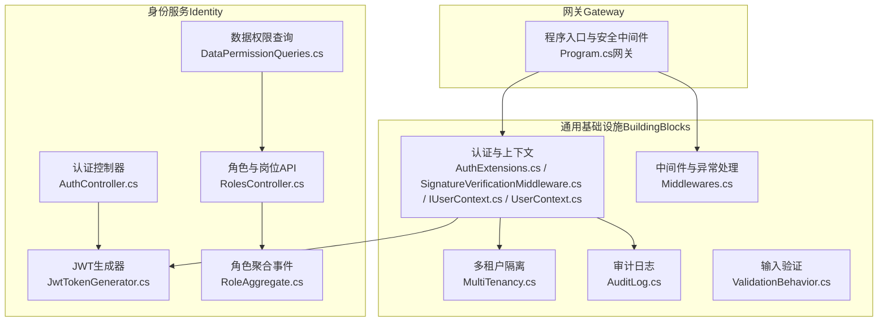
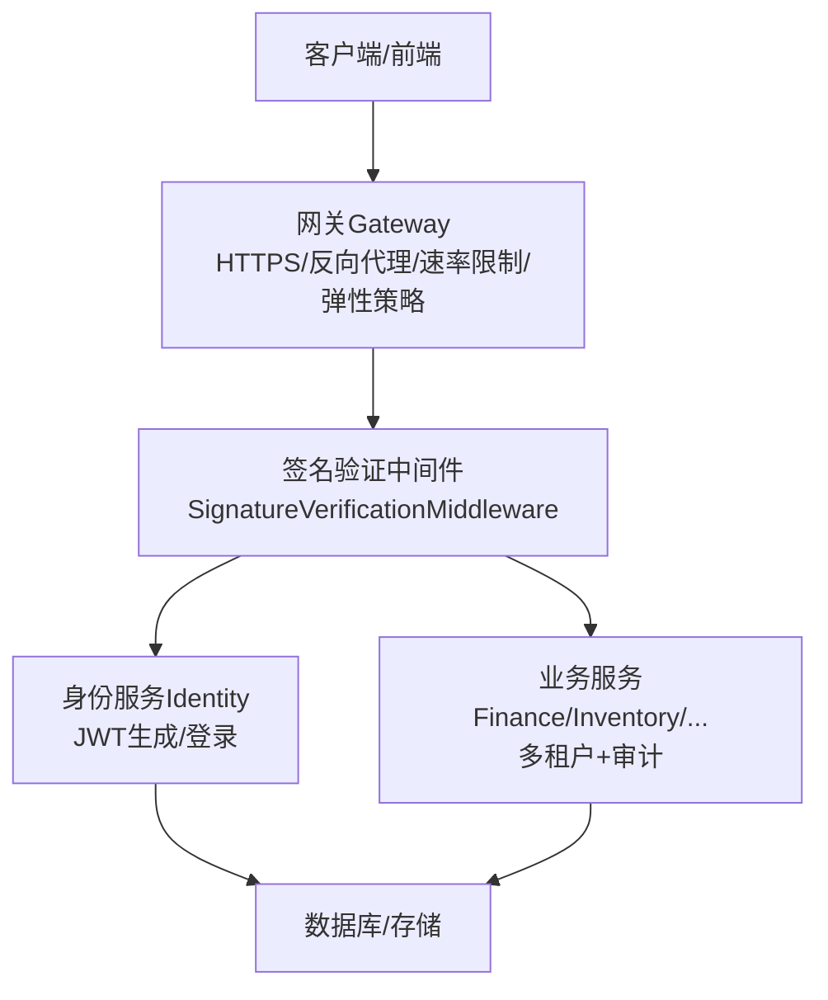
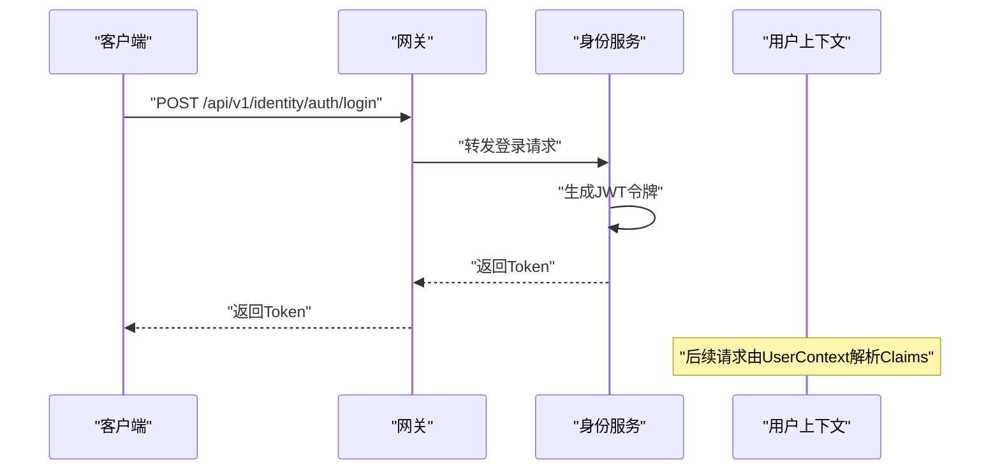
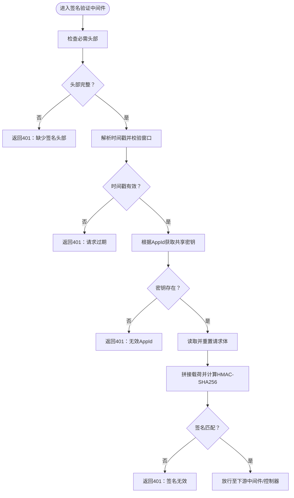
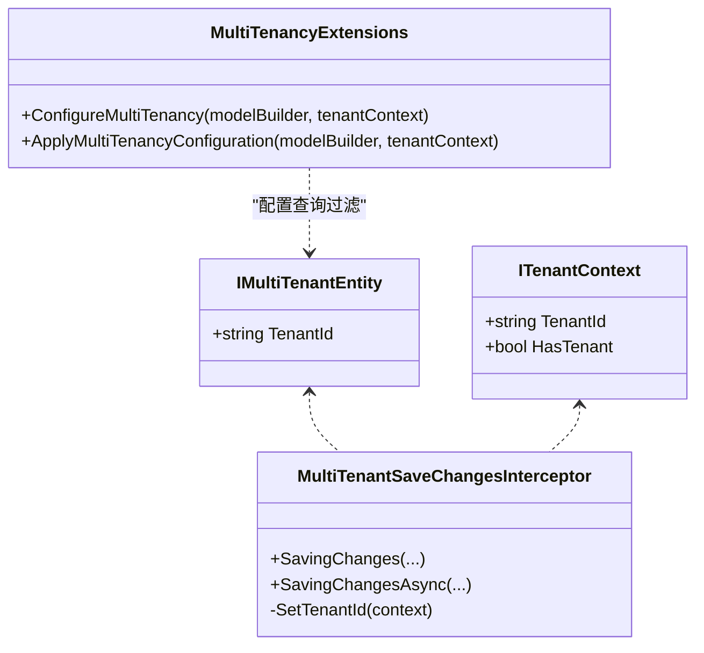
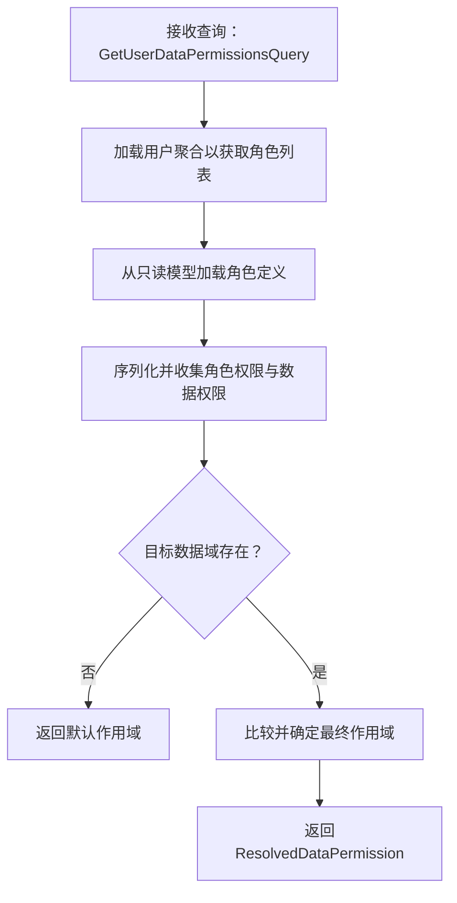
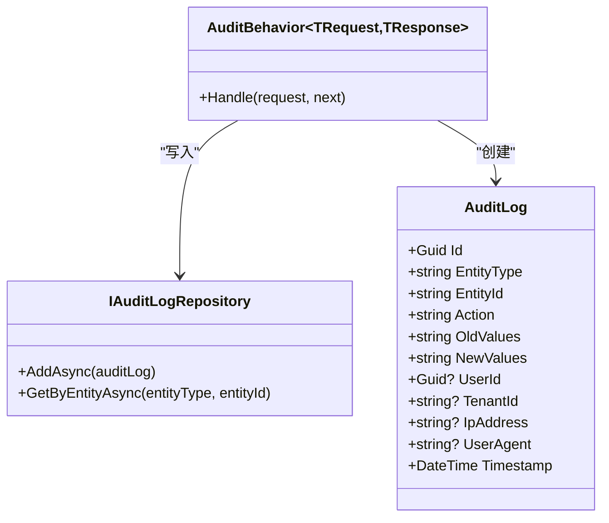
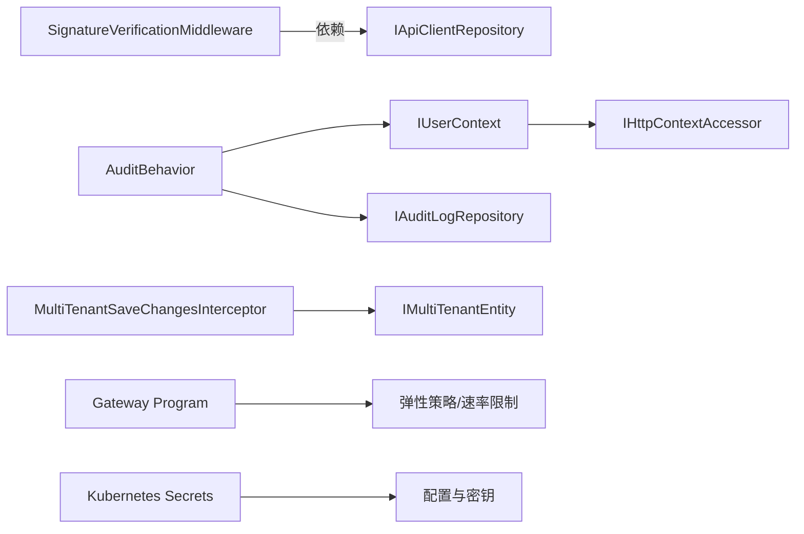

# 安全架构

<cite>
**本文引用的文件**
- [AuthExtensions.cs](file://src/BuildingBlocks/ErpSystem.BuildingBlocks/Auth/AuthExtensions.cs)
- [SignatureVerificationMiddleware.cs](file://src/BuildingBlocks/ErpSystem.BuildingBlocks/Auth/SignatureVerificationMiddleware.cs)
- [IUserContext.cs](file://src/BuildingBlocks/ErpSystem.BuildingBlocks/Auth/IUserContext.cs)
- [UserContext.cs](file://src/BuildingBlocks/ErpSystem.BuildingBlocks/Auth/UserContext.cs)
- [MultiTenancy.cs](file://src/BuildingBlocks/ErpSystem.BuildingBlocks/MultiTenancy/MultiTenancy.cs)
- [AuditLog.cs](file://src/BuildingBlocks/ErpSystem.BuildingBlocks/Auditing/AuditLog.cs)
- [JwtTokenGenerator.cs](file://src/Services/Identity/ErpSystem.Identity/Infrastructure/JwtTokenGenerator.cs)
- [AuthController.cs](file://src/Services/Identity/ErpSystem.Identity/API/AuthController.cs)
- [Middlewares.cs](file://src/BuildingBlocks/ErpSystem.BuildingBlocks/Middleware/Middlewares.cs)
- [Program.cs（网关）](file://src/Gateways/ErpSystem.Gateway/Program.cs)
- [secrets.yaml](file://deploy/k8s/secrets.yaml)
- [appsettings.json（身份服务）](file://src/Services/Identity/ErpSystem.Identity/appsettings.json)
- [DataPermissionQueries.cs](file://src/Services/Identity/ErpSystem.Identity/Application/DataPermissionQueries.cs)
- [RolesController.cs](file://src/Services/Identity/ErpSystem.Identity/API/RolesController.cs)
- [RoleAggregate.cs](file://src/Services/Identity/ErpSystem.Identity/Domain/RoleAggregate.cs)
- [ValidationBehavior.cs](file://src/BuildingBlocks/ErpSystem.BuildingBlocks/Behaviors/ValidationBehavior.cs)
</cite>

## 目录
1. [引言](#引言)
2. [项目结构](#项目结构)
3. [核心组件](#核心组件)
4. [架构总览](#架构总览)
5. [详细组件分析](#详细组件分析)
6. [依赖关系分析](#依赖关系分析)
7. [性能考虑](#性能考虑)
8. [故障排查指南](#故障排查指南)
9. [结论](#结论)
10. [附录](#附录)

## 引言
本文件面向ERP系统的安全架构，聚焦以下目标：
- 身份认证与授权机制：基于JWT令牌与角色/数据域权限模型
- JWT令牌管理与签名验证流程：生成、分发与校验
- 多租户安全隔离：实体级查询过滤与保存拦截器
- 数据权限控制：按用户角色聚合域权限与作用域范围
- 审计日志设计：统一记录实体变更与上下文信息
- API安全防护：请求签名验证、速率限制、异常处理
- 输入验证与XSS/CSRF防护：验证行为与中间件策略
- 安全配置最佳实践：密钥管理、访问控制策略
- 典型安全场景处理方案与架构图示

## 项目结构
本项目采用微服务与领域驱动设计（DDD）结合的分层组织方式，安全相关能力主要分布在“通用基础设施”（BuildingBlocks）与“身份服务”（Identity）中，并通过网关进行统一入口治理。

图表来源
- [AuthExtensions.cs](file://src/BuildingBlocks/ErpSystem.BuildingBlocks/Auth/AuthExtensions.cs#L1-L19)
- [SignatureVerificationMiddleware.cs](file://src/BuildingBlocks/ErpSystem.BuildingBlocks/Auth/SignatureVerificationMiddleware.cs#L1-L85)
- [IUserContext.cs](file://src/BuildingBlocks/ErpSystem.BuildingBlocks/Auth/IUserContext.cs#L1-L12)
- [UserContext.cs](file://src/BuildingBlocks/ErpSystem.BuildingBlocks/Auth/UserContext.cs#L1-L34)
- [MultiTenancy.cs](file://src/BuildingBlocks/ErpSystem.BuildingBlocks/MultiTenancy/MultiTenancy.cs#L1-L100)
- [AuditLog.cs](file://src/BuildingBlocks/ErpSystem.BuildingBlocks/Auditing/AuditLog.cs#L1-L135)
- [JwtTokenGenerator.cs](file://src/Services/Identity/ErpSystem.Identity/Infrastructure/JwtTokenGenerator.cs#L1-L38)
- [AuthController.cs](file://src/Services/Identity/ErpSystem.Identity/API/AuthController.cs#L1-L32)
- [DataPermissionQueries.cs](file://src/Services/Identity/ErpSystem.Identity/Application/DataPermissionQueries.cs#L1-L86)
- [RolesController.cs](file://src/Services/Identity/ErpSystem.Identity/API/RolesController.cs#L1-L76)
- [RoleAggregate.cs](file://src/Services/Identity/ErpSystem.Identity/Domain/RoleAggregate.cs#L79-L94)
- [Middlewares.cs](file://src/BuildingBlocks/ErpSystem.BuildingBlocks/Middleware/Middlewares.cs#L1-L125)
- [Program.cs（网关）](file://src/Gateways/ErpSystem.Gateway/Program.cs#L1-L107)

章节来源
- [AuthExtensions.cs](file://src/BuildingBlocks/ErpSystem.BuildingBlocks/Auth/AuthExtensions.cs#L1-L19)
- [SignatureVerificationMiddleware.cs](file://src/BuildingBlocks/ErpSystem.BuildingBlocks/Auth/SignatureVerificationMiddleware.cs#L1-L85)
- [IUserContext.cs](file://src/BuildingBlocks/ErpSystem.BuildingBlocks/Auth/IUserContext.cs#L1-L12)
- [UserContext.cs](file://src/BuildingBlocks/ErpSystem.BuildingBlocks/Auth/UserContext.cs#L1-L34)
- [MultiTenancy.cs](file://src/BuildingBlocks/ErpSystem.BuildingBlocks/MultiTenancy/MultiTenancy.cs#L1-L100)
- [AuditLog.cs](file://src/BuildingBlocks/ErpSystem.BuildingBlocks/Auditing/AuditLog.cs#L1-L135)
- [JwtTokenGenerator.cs](file://src/Services/Identity/ErpSystem.Identity/Infrastructure/JwtTokenGenerator.cs#L1-L38)
- [AuthController.cs](file://src/Services/Identity/ErpSystem.Identity/API/AuthController.cs#L1-L32)
- [DataPermissionQueries.cs](file://src/Services/Identity/ErpSystem.Identity/Application/DataPermissionQueries.cs#L1-L86)
- [RolesController.cs](file://src/Services/Identity/ErpSystem.Identity/API/RolesController.cs#L1-L76)
- [RoleAggregate.cs](file://src/Services/Identity/ErpSystem.Identity/Domain/RoleAggregate.cs#L79-L94)
- [Middlewares.cs](file://src/BuildingBlocks/ErpSystem.BuildingBlocks/Middleware/Middlewares.cs#L1-L125)
- [Program.cs（网关）](file://src/Gateways/ErpSystem.Gateway/Program.cs#L1-L107)

## 核心组件
- 认证与上下文
  - IApiClientRepository接口与SignatureVerificationMiddleware实现API请求签名验证，包含时间戳窗口、随机数、HMAC-SHA256签名计算与比对。
  - IUserContext与UserContext提供当前请求的认证状态、用户标识、租户标识、角色列表等上下文信息。
- 多租户隔离
  - ITenantContext与IMultiTenantEntity定义租户上下文与多租户实体标记；通过全局查询过滤与保存拦截器自动注入与过滤。
- 审计日志
  - AuditLog实体与IAuditLogRepository抽象，配合AuditBehavior在命令执行后记录实体类型、实体ID、操作、旧值、新值、用户、租户、IP与UA等。
- JWT令牌管理
  - JwtTokenGenerator负责生成JWT令牌，包含签发者、受众、声明与过期时间；AuthController提供登录接口返回令牌。
- 输入验证与异常处理
  - ValidationBehavior使用FluentValidation对请求进行统一验证；GlobalExceptionMiddleware提供一致的错误响应格式。
- 网关安全
  - 网关侧启用HTTPS重定向、反向代理、健康检查、速率限制与弹性策略（重试、断路器、超时）。

章节来源
- [SignatureVerificationMiddleware.cs](file://src/BuildingBlocks/ErpSystem.BuildingBlocks/Auth/SignatureVerificationMiddleware.cs#L1-L85)
- [IUserContext.cs](file://src/BuildingBlocks/ErpSystem.BuildingBlocks/Auth/IUserContext.cs#L1-L12)
- [UserContext.cs](file://src/BuildingBlocks/ErpSystem.BuildingBlocks/Auth/UserContext.cs#L1-L34)
- [MultiTenancy.cs](file://src/BuildingBlocks/ErpSystem.BuildingBlocks/MultiTenancy/MultiTenancy.cs#L1-L100)
- [AuditLog.cs](file://src/BuildingBlocks/ErpSystem.BuildingBlocks/Auditing/AuditLog.cs#L1-L135)
- [JwtTokenGenerator.cs](file://src/Services/Identity/ErpSystem.Identity/Infrastructure/JwtTokenGenerator.cs#L1-L38)
- [AuthController.cs](file://src/Services/Identity/ErpSystem.Identity/API/AuthController.cs#L1-L32)
- [ValidationBehavior.cs](file://src/BuildingBlocks/ErpSystem.BuildingBlocks/Behaviors/ValidationBehavior.cs#L1-L34)
- [Middlewares.cs](file://src/BuildingBlocks/ErpSystem.BuildingBlocks/Middleware/Middlewares.cs#L1-L125)
- [Program.cs（网关）](file://src/Gateways/ErpSystem.Gateway/Program.cs#L1-L107)

## 架构总览
下图展示从客户端到服务端的关键安全交互路径：请求经网关进入，先进行速率限制与弹性策略，再由签名验证中间件保护内部服务间通信；身份服务负责JWT签发与登录；多租户与审计贯穿各业务服务。

图表来源
- [Program.cs（网关）](file://src/Gateways/ErpSystem.Gateway/Program.cs#L1-L107)
- [SignatureVerificationMiddleware.cs](file://src/BuildingBlocks/ErpSystem.BuildingBlocks/Auth/SignatureVerificationMiddleware.cs#L1-L85)
- [JwtTokenGenerator.cs](file://src/Services/Identity/ErpSystem.Identity/Infrastructure/JwtTokenGenerator.cs#L1-L38)
- [AuthController.cs](file://src/Services/Identity/ErpSystem.Identity/API/AuthController.cs#L1-L32)
- [MultiTenancy.cs](file://src/BuildingBlocks/ErpSystem.BuildingBlocks/MultiTenancy/MultiTenancy.cs#L1-L100)
- [AuditLog.cs](file://src/BuildingBlocks/ErpSystem.BuildingBlocks/Auditing/AuditLog.cs#L1-L135)

## 详细组件分析

### 身份认证与授权机制
- 登录与令牌发放
  - AuthController提供登录接口，调用MediatR处理命令，成功后由JwtTokenGenerator生成JWT并返回。
  - JwtTokenGenerator使用对称密钥（HMAC-SHA256）签发令牌，包含子(subject)、名称(name)、JTI等声明，默认有效期2小时。
- 授权与上下文
  - IUserContext与UserContext从HTTP上下文中提取认证状态、用户ID、租户ID、邮箱、姓名与角色列表，供业务逻辑使用。
- 角色与数据权限
  - RolesController支持角色创建、权限分配与数据权限配置；DataPermissionQueries根据用户角色聚合读取模型中的权限与数据域范围，解析最终作用域与允许的部门集合。

图表来源
- [AuthController.cs](file://src/Services/Identity/ErpSystem.Identity/API/AuthController.cs#L1-L32)
- [JwtTokenGenerator.cs](file://src/Services/Identity/ErpSystem.Identity/Infrastructure/JwtTokenGenerator.cs#L1-L38)
- [UserContext.cs](file://src/BuildingBlocks/ErpSystem.BuildingBlocks/Auth/UserContext.cs#L1-L34)

章节来源
- [AuthController.cs](file://src/Services/Identity/ErpSystem.Identity/API/AuthController.cs#L1-L32)
- [JwtTokenGenerator.cs](file://src/Services/Identity/ErpSystem.Identity/Infrastructure/JwtTokenGenerator.cs#L1-L38)
- [IUserContext.cs](file://src/BuildingBlocks/ErpSystem.BuildingBlocks/Auth/IUserContext.cs#L1-L12)
- [UserContext.cs](file://src/BuildingBlocks/ErpSystem.BuildingBlocks/Auth/UserContext.cs#L1-L34)
- [RolesController.cs](file://src/Services/Identity/ErpSystem.Identity/API/RolesController.cs#L1-L76)
- [DataPermissionQueries.cs](file://src/Services/Identity/ErpSystem.Identity/Application/DataPermissionQueries.cs#L1-L86)
- [RoleAggregate.cs](file://src/Services/Identity/ErpSystem.Identity/Domain/RoleAggregate.cs#L79-L94)

### JWT令牌管理与签名验证流程
- 令牌生成
  - 使用对称密钥（HMAC-SHA256）签发，包含标准声明与自定义声明，设置过期时间。
- 请求签名验证（服务间）
  - SignatureVerificationMiddleware要求客户端附加X-AppId、X-Timestamp、X-Nonce、X-Signature头。
  - 时间戳窗口为±5分钟；读取请求体并拼接“AppId+Timestamp+Nonce+Body”，使用共享密钥计算HMAC-SHA256并与客户端签名比对。
  - 若任一条件不满足，返回401并写入相应错误信息。

图表来源
- [SignatureVerificationMiddleware.cs](file://src/BuildingBlocks/ErpSystem.BuildingBlocks/Auth/SignatureVerificationMiddleware.cs#L1-L85)

章节来源
- [SignatureVerificationMiddleware.cs](file://src/BuildingBlocks/ErpSystem.BuildingBlocks/Auth/SignatureVerificationMiddleware.cs#L1-L85)
- [AuthExtensions.cs](file://src/BuildingBlocks/ErpSystem.BuildingBlocks/Auth/AuthExtensions.cs#L1-L19)

### 多租户安全隔离
- 实体标记与查询过滤
  - IMultiTenantEntity标记多租户实体；ConfigureMultiTenancy为所有实现类配置全局查询过滤，仅返回当前租户数据。
- 保存拦截器
  - MultiTenantSaveChangesInterceptor在新增实体时自动填充TenantId，确保数据写入时即具备租户上下文。
- 模型配置
  - ApplyMultiTenancyConfiguration扫描所有实体类型，批量应用过滤与索引。

图表来源
- [MultiTenancy.cs](file://src/BuildingBlocks/ErpSystem.BuildingBlocks/MultiTenancy/MultiTenancy.cs#L1-L100)

章节来源
- [MultiTenancy.cs](file://src/BuildingBlocks/ErpSystem.BuildingBlocks/MultiTenancy/MultiTenancy.cs#L1-L100)

### 数据权限控制
- 权限聚合
  - DataPermissionQueries根据用户角色集合，从只读模型中加载角色定义，合并权限与数据域权限，解析最终作用域（如Self/Dept/All）。
- 配置与事件
  - RolesController支持为角色配置数据权限；RoleAggregate在事件触发时更新角色的数据权限集合。

图表来源
- [DataPermissionQueries.cs](file://src/Services/Identity/ErpSystem.Identity/Application/DataPermissionQueries.cs#L1-L86)
- [RolesController.cs](file://src/Services/Identity/ErpSystem.Identity/API/RolesController.cs#L1-L76)
- [RoleAggregate.cs](file://src/Services/Identity/ErpSystem.Identity/Domain/RoleAggregate.cs#L79-L94)

章节来源
- [DataPermissionQueries.cs](file://src/Services/Identity/ErpSystem.Identity/Application/DataPermissionQueries.cs#L1-L86)
- [RolesController.cs](file://src/Services/Identity/ErpSystem.Identity/API/RolesController.cs#L1-L76)
- [RoleAggregate.cs](file://src/Services/Identity/ErpSystem.Identity/Domain/RoleAggregate.cs#L79-L94)

### 审计日志设计
- 日志实体与行为
  - AuditLog封装实体类型、实体ID、动作、旧值、新值、用户、租户、IP、UA与时间戳；AuditBehavior在命令处理完成后异步写入审计仓库。
- EF配置
  - AuditLogConfiguration为审计表建立索引（实体类型+ID、时间戳、用户），便于检索与合规审计。

图表来源
- [AuditLog.cs](file://src/BuildingBlocks/ErpSystem.BuildingBlocks/Auditing/AuditLog.cs#L1-L135)

章节来源
- [AuditLog.cs](file://src/BuildingBlocks/ErpSystem.BuildingBlocks/Auditing/AuditLog.cs#L1-L135)

### API安全防护、输入验证与XSS/CSRF防护
- 请求签名验证
  - 通过SignatureVerificationMiddleware对内部服务间请求进行完整性与时效性校验。
- 速率限制与弹性
  - 网关启用速率限制与弹性策略（重试、断路器、超时），防止滥用与级联故障。
- 输入验证
  - ValidationBehavior对请求对象进行统一验证，未通过时抛出验证异常，由GlobalExceptionMiddleware统一转换为400响应。
- 异常处理
  - GlobalExceptionMiddleware针对不同异常类型返回标准化JSON错误响应（400/403/404/500）。
- XSS/CSRF防护
  - 建议在前端与网关层实施内容安全策略（CSP）、同源策略与CSRF令牌（若使用表单提交），并在API层避免直接信任不可信输入。

章节来源
- [SignatureVerificationMiddleware.cs](file://src/BuildingBlocks/ErpSystem.BuildingBlocks/Auth/SignatureVerificationMiddleware.cs#L1-L85)
- [Program.cs（网关）](file://src/Gateways/ErpSystem.Gateway/Program.cs#L1-L107)
- [ValidationBehavior.cs](file://src/BuildingBlocks/ErpSystem.BuildingBlocks/Behaviors/ValidationBehavior.cs#L1-L34)
- [Middlewares.cs](file://src/BuildingBlocks/ErpSystem.BuildingBlocks/Middleware/Middlewares.cs#L1-L125)

## 依赖关系分析
- 组件耦合
  - SignatureVerificationMiddleware依赖IApiClientRepository以获取共享密钥；应由具体实现注册到DI容器。
  - AuditBehavior依赖IUserContext与IAuditLogRepository；UserContext依赖IHttpContextAccessor。
  - 多租户功能通过EF拦截器与模型扩展应用到所有多租户实体。
- 外部集成点
  - 网关作为统一入口，承载HTTPS、反向代理、健康检查与弹性策略。
  - Kubernetes Secrets用于集中管理数据库密码、JWT密钥、Redis与Dapr令牌等敏感信息。

图表来源
- [SignatureVerificationMiddleware.cs](file://src/BuildingBlocks/ErpSystem.BuildingBlocks/Auth/SignatureVerificationMiddleware.cs#L1-L85)
- [AuditLog.cs](file://src/BuildingBlocks/ErpSystem.BuildingBlocks/Auditing/AuditLog.cs#L1-L135)
- [MultiTenancy.cs](file://src/BuildingBlocks/ErpSystem.BuildingBlocks/MultiTenancy/MultiTenancy.cs#L1-L100)
- [Program.cs（网关）](file://src/Gateways/ErpSystem.Gateway/Program.cs#L1-L107)
- [secrets.yaml](file://deploy/k8s/secrets.yaml#L1-L19)

章节来源
- [SignatureVerificationMiddleware.cs](file://src/BuildingBlocks/ErpSystem.BuildingBlocks/Auth/SignatureVerificationMiddleware.cs#L1-L85)
- [AuditLog.cs](file://src/BuildingBlocks/ErpSystem.BuildingBlocks/Auditing/AuditLog.cs#L1-L135)
- [MultiTenancy.cs](file://src/BuildingBlocks/ErpSystem.BuildingBlocks/MultiTenancy/MultiTenancy.cs#L1-L100)
- [Program.cs（网关）](file://src/Gateways/ErpSystem.Gateway/Program.cs#L1-L107)
- [secrets.yaml](file://deploy/k8s/secrets.yaml#L1-L19)

## 性能考虑
- 签名验证
  - HMAC-SHA256计算开销低，但需注意请求体缓冲与重复读取的成本；建议在高并发场景下评估内存占用与GC压力。
- 多租户过滤
  - 全局查询过滤与索引可显著提升查询性能；确保TenantId列建立索引，避免全表扫描。
- 审计日志
  - 异步写入与批量化提交可降低主流程延迟；对高频操作建议异步化或队列化。
- 网关弹性
  - 合理配置重试次数、抖动与断路器阈值，避免雪崩效应；超时时间应覆盖下游平均响应时间的若干倍。

## 故障排查指南
- 401 未授权（签名验证失败）
  - 检查X-AppId是否正确；确认时间戳在±5分钟范围内；核对X-Nonce唯一性；确保共享密钥一致且大小写匹配。
- 400 验证失败
  - 查看GlobalExceptionMiddleware返回的错误详情，定位具体属性与错误消息。
- 403 访问被拒绝
  - 检查用户角色与数据权限配置；确认DataPermissionQueries解析的作用域是否符合预期。
- 404 资源不存在
  - 确认资源ID与租户上下文；多租户环境下避免跨租户访问。
- 审计缺失
  - 确认请求实现了可审计接口；检查AuditBehavior是否被正确注册与执行；查看日志中是否有异常记录。

章节来源
- [SignatureVerificationMiddleware.cs](file://src/BuildingBlocks/ErpSystem.BuildingBlocks/Auth/SignatureVerificationMiddleware.cs#L1-L85)
- [Middlewares.cs](file://src/BuildingBlocks/ErpSystem.BuildingBlocks/Middleware/Middlewares.cs#L1-L125)
- [DataPermissionQueries.cs](file://src/Services/Identity/ErpSystem.Identity/Application/DataPermissionQueries.cs#L1-L86)
- [AuditLog.cs](file://src/BuildingBlocks/ErpSystem.BuildingBlocks/Auditing/AuditLog.cs#L1-L135)

## 结论
本安全架构围绕“请求签名验证、JWT令牌管理、多租户隔离、数据权限聚合与审计日志”构建，辅以网关级弹性与速率限制，形成端到端的微服务安全体系。建议在生产环境中强化密钥轮换、最小权限原则与定期渗透测试，并持续完善前端安全策略（CSP、CSRF令牌等）。

## 附录
- 安全配置最佳实践
  - 密钥管理
    - 使用Kubernetes Secrets集中管理JWT密钥、数据库与Redis密码；定期轮换并限制访问范围。
  - 访问控制策略
    - 最小权限：仅授予完成任务所需的最小角色与数据域范围；定期审查角色与权限映射。
    - 多租户：严格启用全局查询过滤与保存拦截器，禁止绕过。
  - API安全
    - 对内部服务间请求强制签名验证；对外API建议引入OAuth2/JWT与CORS白名单。
  - 输入与输出
    - 统一使用ValidationBehavior进行输入验证；对外输出避免泄露内部错误细节。
  - 日志与监控
    - 审计日志保留合规周期；结合分布式追踪与告警策略，快速定位异常。

章节来源
- [secrets.yaml](file://deploy/k8s/secrets.yaml#L1-L19)
- [appsettings.json（身份服务）](file://src/Services/Identity/ErpSystem.Identity/appsettings.json#L1-L10)
- [Program.cs（网关）](file://src/Gateways/ErpSystem.Gateway/Program.cs#L1-L107)
- [ValidationBehavior.cs](file://src/BuildingBlocks/ErpSystem.BuildingBlocks/Behaviors/ValidationBehavior.cs#L1-L34)
- [AuditLog.cs](file://src/BuildingBlocks/ErpSystem.BuildingBlocks/Auditing/AuditLog.cs#L1-L135)