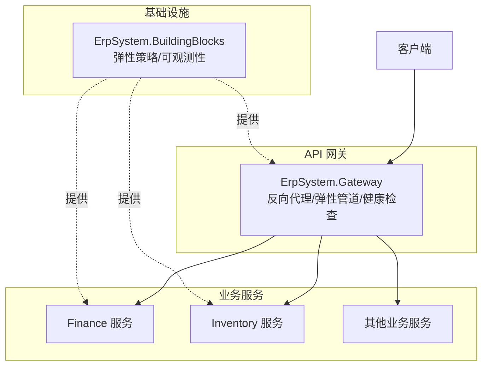
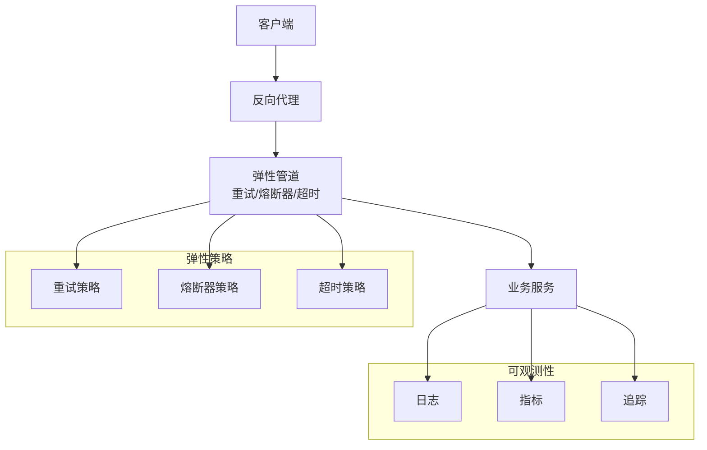
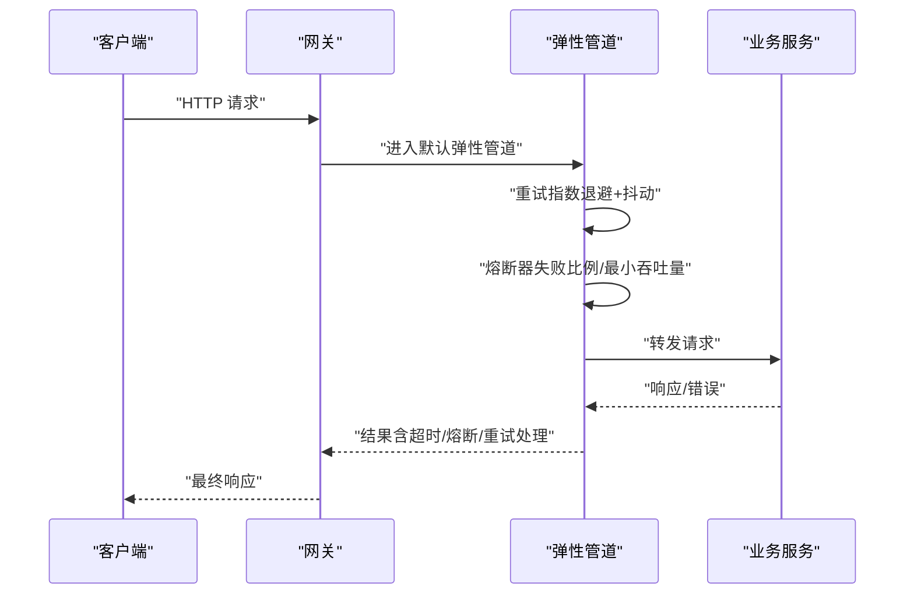
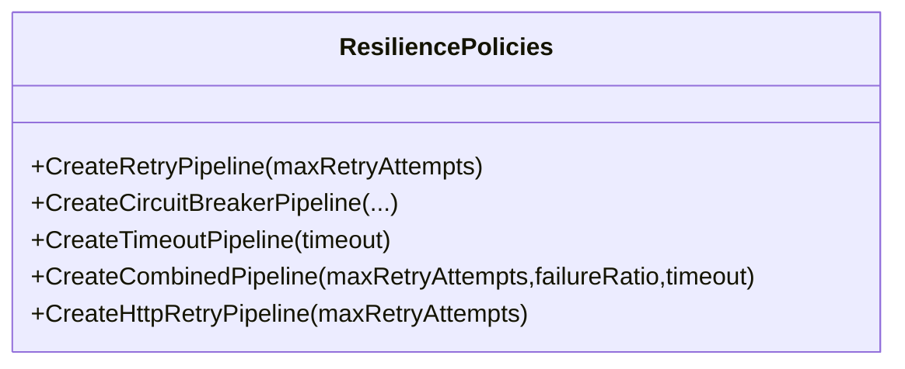
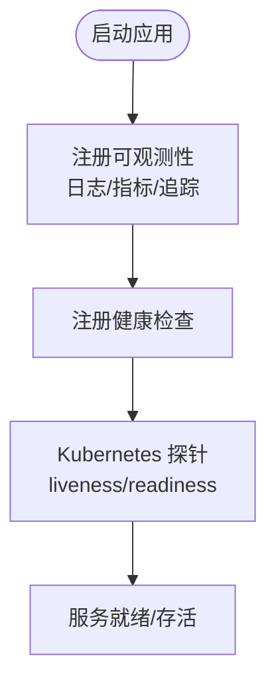
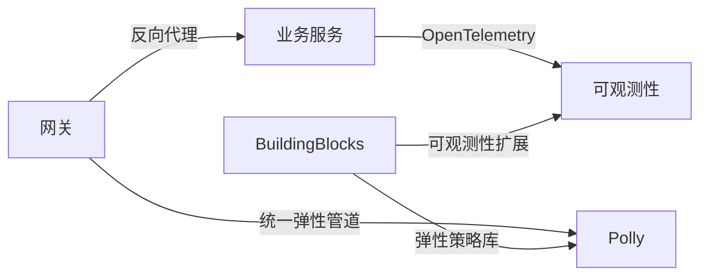

# 弹性设计模式

<cite>
**本文引用的文件**
- [ResiliencePolicies.cs](file://src/BuildingBlocks/ErpSystem.BuildingBlocks/Resilience/ResiliencePolicies.cs)
- [Program.cs（网关）](file://src/Gateways/ErpSystem.Gateway/Program.cs)
- [appsettings.json（网关）](file://src/Gateways/ErpSystem.Gateway/appsettings.json)
- [ObservabilityExtensions.cs](file://src/BuildingBlocks/ErpSystem.BuildingBlocks/Observability/ObservabilityExtensions.cs)
- [Program.cs（财务服务）](file://src/Services/Finance/ErpSystem.Finance/Program.cs)
- [Program.cs（库存服务）](file://src/Services/Inventory/ErpSystem.Inventory/Program.cs)
- [ErpSystem.BuildingBlocks.csproj](file://src/BuildingBlocks/ErpSystem.BuildingBlocks/ErpSystem.BuildingBlocks.csproj)
- [gateway.yaml（Kubernetes）](file://deploy/k8s/services/gateway.yaml)
- [deployment.md](file://docs/deployment.md)
</cite>

## 目录
1. [简介](#简介)
2. [项目结构](#项目结构)
3. [核心组件](#核心组件)
4. [架构总览](#架构总览)
5. [详细组件分析](#详细组件分析)
6. [依赖关系分析](#依赖关系分析)
7. [性能考量](#性能考量)
8. [故障排查指南](#故障排查指南)
9. [结论](#结论)
10. [附录](#附录)

## 简介
本文件系统化阐述 ERP 微服务系统的弹性设计模式，重点覆盖以下方面：
- 基于 Polly 的弹性策略：重试机制、熔断器模式、超时处理与降级策略
- API 网关的流量控制、速率限制与请求保护机制
- 服务间故障隔离、优雅降级与错误恢复策略
- 弹性设计最佳实践、性能监控与健康检查机制
- 弹性配置示例与故障处理流程

## 项目结构
本项目采用多服务架构，包含统一的基础设施库（BuildingBlocks）、多个业务服务以及一个基于 ASP.NET Core 的 API 网关。弹性设计的关键能力集中在 BuildingBlocks 中的弹性策略与网关中的统一弹性管道，同时通过可观测性扩展实现监控与追踪。

图表来源
- [Program.cs（网关）](file://src/Gateways/ErpSystem.Gateway/Program.cs#L22-L80)
- [ResiliencePolicies.cs](file://src/BuildingBlocks/ErpSystem.BuildingBlocks/Resilience/ResiliencePolicies.cs#L13-L110)
- [Program.cs（财务服务）](file://src/Services/Finance/ErpSystem.Finance/Program.cs#L11-L74)
- [Program.cs（库存服务）](file://src/Services/Inventory/ErpSystem.Inventory/Program.cs#L12-L72)

章节来源
- [Program.cs（网关）](file://src/Gateways/ErpSystem.Gateway/Program.cs#L1-L107)
- [ResiliencePolicies.cs](file://src/BuildingBlocks/ErpSystem.BuildingBlocks/Resilience/ResiliencePolicies.cs#L1-L111)
- [Program.cs（财务服务）](file://src/Services/Finance/ErpSystem.Finance/Program.cs#L1-L86)
- [Program.cs（库存服务）](file://src/Services/Inventory/ErpSystem.Inventory/Program.cs#L1-L74)

## 核心组件
- 统一弹性策略库（BuildingBlocks）
  - 提供可复用的重试、熔断器、超时与组合策略，支持通用与 HTTP 类型策略
- API 网关（Gateway）
  - 集成统一弹性管道（重试+熔断器+超时），启用速率限制与健康检查
  - 通过反向代理路由到各业务服务集群
- 业务服务（如 Finance、Inventory）
  - 各自独立运行，可按需复用 BuildingBlocks 的弹性策略或在调用外部依赖时使用网关提供的保护
- 可观测性（OpenTelemetry）
  - 提供日志、指标与追踪的统一接入，便于弹性行为的监控与问题定位

章节来源
- [ResiliencePolicies.cs](file://src/BuildingBlocks/ErpSystem.BuildingBlocks/Resilience/ResiliencePolicies.cs#L13-L110)
- [Program.cs（网关）](file://src/Gateways/ErpSystem.Gateway/Program.cs#L30-L80)
- [ObservabilityExtensions.cs](file://src/BuildingBlocks/ErpSystem.BuildingBlocks/Observability/ObservabilityExtensions.cs#L12-L42)
- [ErpSystem.BuildingBlocks.csproj](file://src/BuildingBlocks/ErpSystem.BuildingBlocks/ErpSystem.BuildingBlocks.csproj#L26-L26)

## 架构总览
下图展示弹性策略在系统中的分布与交互：网关作为统一入口，应用“重试+熔断器+超时”组合策略；业务服务各自负责领域逻辑与数据持久化；可观测性贯穿全链路。

图表来源
- [Program.cs（网关）](file://src/Gateways/ErpSystem.Gateway/Program.cs#L30-L80)
- [ResiliencePolicies.cs](file://src/BuildingBlocks/ErpSystem.BuildingBlocks/Resilience/ResiliencePolicies.cs#L18-L90)
- [ObservabilityExtensions.cs](file://src/BuildingBlocks/ErpSystem.BuildingBlocks/Observability/ObservabilityExtensions.cs#L14-L39)

## 详细组件分析

### 网关弹性管道（重试、熔断器、超时）
- 统一弹性管道名称："default"
- 重试策略
  - 指数退避 + 抖动，最大重试次数与延迟可配置
  - 处理所有异常类型，避免“惊群效应”
- 熔断器策略
  - 失败比例阈值、采样窗口、最小吞吐量与断开时长可配置
  - 在下游不稳定时快速失败，防止级联故障
- 超时策略
  - 快速失败释放资源，避免请求堆积
- 速率限制
  - 拒绝状态码为 429 Too Many Requests，保护后端免受过载
- 健康检查
  - 暴露 /health 与 /health/ready，配合 Kubernetes 探针

图表来源
- [Program.cs（网关）](file://src/Gateways/ErpSystem.Gateway/Program.cs#L30-L80)

章节来源
- [Program.cs（网关）](file://src/Gateways/ErpSystem.Gateway/Program.cs#L30-L80)
- [appsettings.json（网关）](file://src/Gateways/ErpSystem.Gateway/appsettings.json#L9-L113)

### BuildingBlocks 弹性策略库
- 重试策略
  - 标准重试与 HTTP 类型重试，针对特定 HTTP 状态码进行判定
- 熔断器策略
  - 支持自定义失败比例、采样窗口与断开时长
- 超时策略
  - 针对任意操作设置超时时间
- 组合策略
  - 将超时、重试、熔断器按顺序组合，形成完整的弹性链路

图表来源
- [ResiliencePolicies.cs](file://src/BuildingBlocks/ErpSystem.BuildingBlocks/Resilience/ResiliencePolicies.cs#L13-L110)

章节来源
- [ResiliencePolicies.cs](file://src/BuildingBlocks/ErpSystem.BuildingBlocks/Resilience/ResiliencePolicies.cs#L13-L110)

### 业务服务中的弹性使用建议
- 财务服务与库存服务等均以独立 Web 应用运行，可在调用外部依赖（如事件总线、数据库、下游服务）时复用 BuildingBlocks 的弹性策略
- 对于内部服务间调用，优先通过网关进行统一保护，减少重复实现
- 对于需要细粒度控制的场景，可在服务内按需组合超时、重试与熔断器

章节来源
- [Program.cs（财务服务）](file://src/Services/Finance/ErpSystem.Finance/Program.cs#L11-L74)
- [Program.cs（库存服务）](file://src/Services/Inventory/ErpSystem.Inventory/Program.cs#L12-L72)

### 可观测性与健康检查
- 可观测性
  - 日志：OpenTelemetry 输出格式化消息与作用域
  - 指标：ASP.NET Core、HttpClient、运行时指标
  - 追踪：ASP.NET Core、HttpClient、运行时源，支持 OTLP 导出
- 健康检查
  - 网关暴露 /health 与 /health/ready，Kubernetes 使用探针进行存活与就绪判断

图表来源
- [ObservabilityExtensions.cs](file://src/BuildingBlocks/ErpSystem.BuildingBlocks/Observability/ObservabilityExtensions.cs#L12-L42)
- [Program.cs（网关）](file://src/Gateways/ErpSystem.Gateway/Program.cs#L66-L80)
- [gateway.yaml（Kubernetes）](file://deploy/k8s/services/gateway.yaml#L35-L46)

章节来源
- [ObservabilityExtensions.cs](file://src/BuildingBlocks/ErpSystem.BuildingBlocks/Observability/ObservabilityExtensions.cs#L12-L42)
- [Program.cs（网关）](file://src/Gateways/ErpSystem.Gateway/Program.cs#L66-L80)
- [gateway.yaml（Kubernetes）](file://deploy/k8s/services/gateway.yaml#L35-L46)

## 依赖关系分析
- Polly 版本与依赖
  - BuildingBlocks 项目直接引用 Polly.Core，确保弹性策略可用
- 网关与服务的耦合
  - 网关通过反向代理与服务解耦，弹性策略集中管理，降低各服务重复实现成本
- 可观测性集成
  - 通过扩展方法统一注册 OpenTelemetry，便于跨服务一致采集

图表来源
- [ErpSystem.BuildingBlocks.csproj](file://src/BuildingBlocks/ErpSystem.BuildingBlocks/ErpSystem.BuildingBlocks.csproj#L26-L26)
- [Program.cs（网关）](file://src/Gateways/ErpSystem.Gateway/Program.cs#L22-L80)
- [ObservabilityExtensions.cs](file://src/BuildingBlocks/ErpSystem.BuildingBlocks/Observability/ObservabilityExtensions.cs#L22-L39)

章节来源
- [ErpSystem.BuildingBlocks.csproj](file://src/BuildingBlocks/ErpSystem.BuildingBlocks/ErpSystem.BuildingBlocks.csproj#L26-L26)
- [Program.cs（网关）](file://src/Gateways/ErpSystem.Gateway/Program.cs#L22-L80)
- [ObservabilityExtensions.cs](file://src/BuildingBlocks/ErpSystem.BuildingBlocks/Observability/ObservabilityExtensions.cs#L22-L39)

## 性能考量
- 重试策略
  - 指数退避 + 抖动可有效缓解瞬时拥塞，避免“惊群效应”
  - 最大重试次数与初始延迟应结合 SLA 与下游容量评估
- 熔断器策略
  - 失败比例与最小吞吐量需根据服务稳定性动态调整
  - 断开时长应允许下游有足够恢复时间
- 超时策略
  - 超时时间应小于客户端可容忍的最大等待时间，避免连接泄漏
- 速率限制
  - 429 状态码用于提示客户端限流，建议配合退避重试策略
- 资源与探针
  - Kubernetes 探针路径与周期应与健康检查实现保持一致，确保平滑滚动更新

## 故障排查指南
- 常见问题定位步骤
  - 查看网关健康端点：/health 与 /health/ready
  - 检查弹性策略是否触发（重试次数、熔断状态、超时）
  - 通过可观测性追踪请求链路，定位失败节点
- Kubernetes 探针与健康检查
  - 确认 livenessProbe 与 readinessProbe 的路径与端口与应用一致
  - 关注探针失败导致的重启或流量摘除

章节来源
- [Program.cs（网关）](file://src/Gateways/ErpSystem.Gateway/Program.cs#L78-L80)
- [gateway.yaml（Kubernetes）](file://deploy/k8s/services/gateway.yaml#L35-L46)
- [deployment.md](file://docs/deployment.md#L103-L115)

## 结论
本项目通过“网关统一弹性 + BuildingBlocks 策略库 + 可观测性”的组合，实现了面向微服务的弹性设计：在入口层提供标准化的重试、熔断与超时保护，在服务层提供可复用的弹性策略与一致的可观测性，辅以健康检查与 Kubernetes 探针，确保系统在高并发与不稳定环境下仍能保持稳定与可恢复性。

## 附录

### 弹性配置示例（节选）
- 网关默认弹性管道
  - 重试：指数退避 + 抖动，最大重试次数与延迟
  - 熔断器：失败比例阈值、采样窗口、最小吞吐量、断开时长
  - 超时：固定超时时间
  - 速率限制：拒绝状态码 429
- BuildingBlocks 弹性策略
  - 标准重试、HTTP 类型重试、熔断器、超时与组合策略
- 业务服务
  - 可按需复用 BuildingBlocks 策略或在调用外部依赖时使用网关保护

章节来源
- [Program.cs（网关）](file://src/Gateways/ErpSystem.Gateway/Program.cs#L30-L80)
- [ResiliencePolicies.cs](file://src/BuildingBlocks/ErpSystem.BuildingBlocks/Resilience/ResiliencePolicies.cs#L18-L109)
- [Program.cs（财务服务）](file://src/Services/Finance/ErpSystem.Finance/Program.cs#L11-L74)
- [Program.cs（库存服务）](file://src/Services/Inventory/ErpSystem.Inventory/Program.cs#L12-L72)