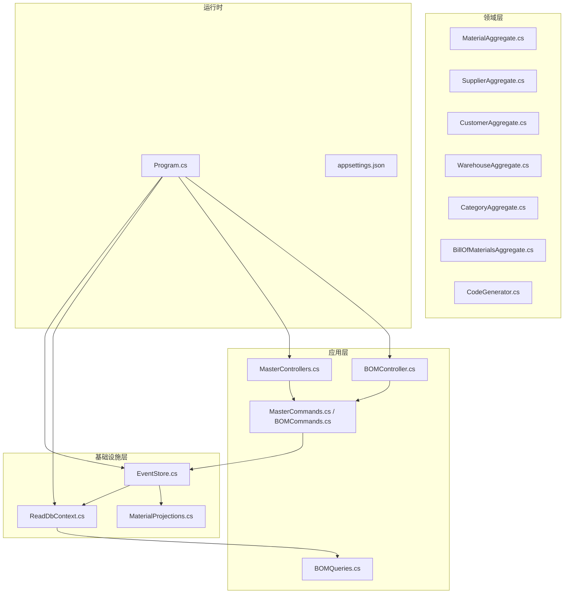
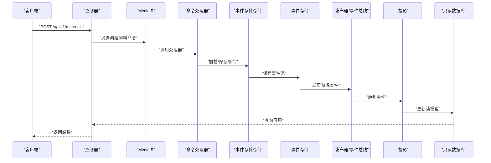
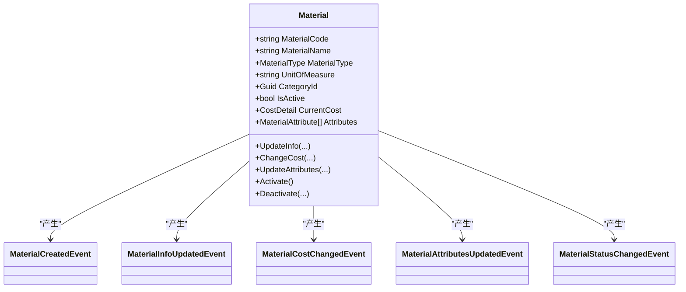
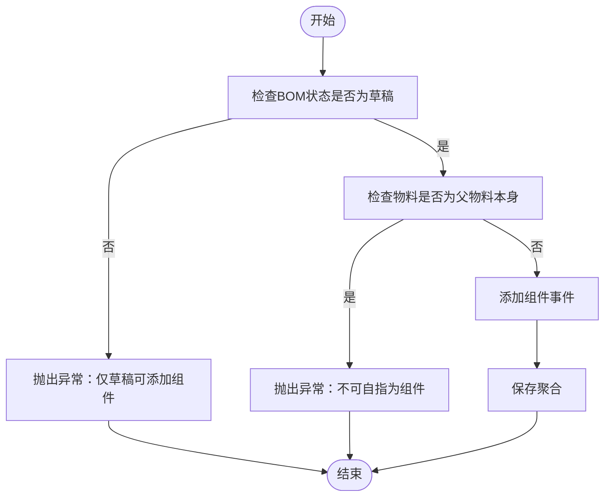
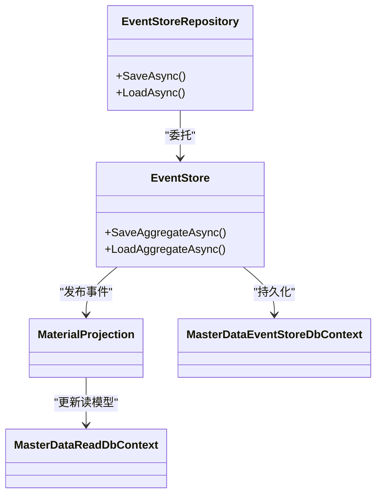
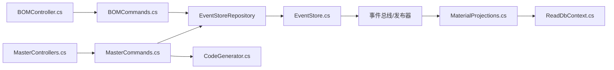

# 主数据服务

<cite>
**本文引用的文件**
- [Program.cs](file://src/Services/MasterData/ErpSystem.MasterData/Program.cs)
- [appsettings.json](file://src/Services/MasterData/ErpSystem.MasterData/appsettings.json)
- [MasterControllers.cs](file://src/Services/MasterData/ErpSystem.MasterData/Controllers/MasterControllers.cs)
- [BOMController.cs](file://src/Services/MasterData/ErpSystem.MasterData/Controllers/BOMController.cs)
- [MasterCommands.cs](file://src/Services/MasterData/ErpSystem.MasterData/Application/MasterCommands.cs)
- [BOMCommands.cs](file://src/Services/MasterData/ErpSystem.MasterData/Application/BOMCommands.cs)
- [BOMQueries.cs](file://src/Services/MasterData/ErpSystem.MasterData/Application/BOMQueries.cs)
- [MaterialAggregate.cs](file://src/Services/MasterData/ErpSystem.MasterData/Domain/MaterialAggregate.cs)
- [CustomerAggregate.cs](file://src/Services/MasterData/ErpSystem.MasterData/Domain/CustomerAggregate.cs)
- [SupplierAggregate.cs](file://src/Services/MasterData/ErpSystem.MasterData/Domain/SupplierAggregate.cs)
- [WarehouseAggregate.cs](file://src/Services/MasterData/ErpSystem.MasterData/Domain/WarehouseAggregate.cs)
- [CategoryAggregate.cs](file://src/Services/MasterData/ErpSystem.MasterData/Domain/CategoryAggregate.cs)
- [BillOfMaterialsAggregate.cs](file://src/Services/MasterData/ErpSystem.MasterData/Domain/BillOfMaterialsAggregate.cs)
- [CodeGenerator.cs](file://src/Services/MasterData/ErpSystem.MasterData/Domain/CodeGenerator.cs)
- [EventStore.cs](file://src/Services/MasterData/ErpSystem.MasterData/Infrastructure/EventStore.cs)
- [ReadDbContext.cs](file://src/Services/MasterData/ErpSystem.MasterData/Infrastructure/ReadDbContext.cs)
- [MaterialProjections.cs](file://src/Services/MasterData/ErpSystem.MasterData/Infrastructure/MaterialProjections.cs)
- [DDDBase.cs](file://src/BuildingBlocks/ErpSystem.BuildingBlocks.Domain/DDDBase.cs)
</cite>

## 目录
1. [简介](#简介)
2. [项目结构](#项目结构)
3. [核心组件](#核心组件)
4. [架构总览](#架构总览)
5. [详细组件分析](#详细组件分析)
6. [依赖关系分析](#依赖关系分析)
7. [性能考量](#性能考量)
8. [故障排查指南](#故障排查指南)
9. [结论](#结论)
10. [附录：API 接口规范与数据模型](#附录api-接口规范与数据模型)

## 简介
本文件为“主数据服务”的微服务级技术文档，聚焦于物料、供应商、客户、仓库及装配清单（BOM）等主数据能力的实现。内容涵盖：
- 聚合根设计与领域事件驱动的业务规则
- 事件溯源、读写分离与投影（Projection）策略
- 版本控制、数据同步与一致性保障
- 缓存策略与事件总线集成
- API 接口规范、数据校验与批量操作机制

## 项目结构
主数据服务采用分层与领域驱动设计（DDD）组织代码，包含应用层、领域层、基础设施层与控制器层，并通过 MediatR 实现命令/查询解耦。

图表来源
- [Program.cs](file://src/Services/MasterData/ErpSystem.MasterData/Program.cs#L1-L68)
- [MasterControllers.cs](file://src/Services/MasterData/ErpSystem.MasterData/Controllers/MasterControllers.cs#L1-L79)
- [BOMController.cs](file://src/Services/MasterData/ErpSystem.MasterData/Controllers/BOMController.cs#L1-L54)
- [MasterCommands.cs](file://src/Services/MasterData/ErpSystem.MasterData/Application/MasterCommands.cs#L1-L110)
- [BOMCommands.cs](file://src/Services/MasterData/ErpSystem.MasterData/Application/BOMCommands.cs#L1-L49)
- [BOMQueries.cs](file://src/Services/MasterData/ErpSystem.MasterData/Application/BOMQueries.cs#L1-L41)
- [MaterialAggregate.cs](file://src/Services/MasterData/ErpSystem.MasterData/Domain/MaterialAggregate.cs#L1-L178)
- [SupplierAggregate.cs](file://src/Services/MasterData/ErpSystem.MasterData/Domain/SupplierAggregate.cs#L1-L125)
- [CustomerAggregate.cs](file://src/Services/MasterData/ErpSystem.MasterData/Domain/CustomerAggregate.cs#L1-L96)
- [WarehouseAggregate.cs](file://src/Services/MasterData/ErpSystem.MasterData/Domain/WarehouseAggregate.cs#L1-L44)
- [CategoryAggregate.cs](file://src/Services/MasterData/ErpSystem.MasterData/Domain/CategoryAggregate.cs#L1-L67)
- [BillOfMaterialsAggregate.cs](file://src/Services/MasterData/ErpSystem.MasterData/Domain/BillOfMaterialsAggregate.cs#L1-L125)
- [CodeGenerator.cs](file://src/Services/MasterData/ErpSystem.MasterData/Domain/CodeGenerator.cs#L1-L22)
- [EventStore.cs](file://src/Services/MasterData/ErpSystem.MasterData/Infrastructure/EventStore.cs#L1-L19)
- [ReadDbContext.cs](file://src/Services/MasterData/ErpSystem.MasterData/Infrastructure/ReadDbContext.cs#L1-L125)
- [MaterialProjections.cs](file://src/Services/MasterData/ErpSystem.MasterData/Infrastructure/MaterialProjections.cs#L1-L75)

章节来源
- [Program.cs](file://src/Services/MasterData/ErpSystem.MasterData/Program.cs#L1-L68)
- [appsettings.json](file://src/Services/MasterData/ErpSystem.MasterData/appsettings.json#L1-L10)

## 核心组件
- 应用层
  - 控制器：提供物料、供应商/客户、BOM 的 REST API。
  - 命令处理器：封装业务操作，协调仓储与聚合根。
  - 查询服务：面向只读查询的轻量查询对象。
- 领域层
  - 聚合根：物料、供应商、客户、仓库、分类、BOM。
  - 领域事件：描述业务状态变更。
  - 值对象：成本明细、属性、联系人、银行账户、地址等。
- 基础设施层
  - 事件存储：基于关系型数据库的事件流表。
  - 只读数据库：EF Core 上的投影模型，用于查询。
  - 投影：监听领域事件并更新只读视图。
- 运行时
  - DI 容器注册 MediatR、事件总线、仓储与事件存储。
  - 启动时确保数据库存在。

章节来源
- [MasterControllers.cs](file://src/Services/MasterData/ErpSystem.MasterData/Controllers/MasterControllers.cs#L1-L79)
- [BOMController.cs](file://src/Services/MasterData/ErpSystem.MasterData/Controllers/BOMController.cs#L1-L54)
- [MasterCommands.cs](file://src/Services/MasterData/ErpSystem.MasterData/Application/MasterCommands.cs#L1-L110)
- [BOMCommands.cs](file://src/Services/MasterData/ErpSystem.MasterData/Application/BOMCommands.cs#L1-L49)
- [BOMQueries.cs](file://src/Services/MasterData/ErpSystem.MasterData/Application/BOMQueries.cs#L1-L41)
- [MaterialAggregate.cs](file://src/Services/MasterData/ErpSystem.MasterData/Domain/MaterialAggregate.cs#L1-L178)
- [SupplierAggregate.cs](file://src/Services/MasterData/ErpSystem.MasterData/Domain/SupplierAggregate.cs#L1-L125)
- [CustomerAggregate.cs](file://src/Services/MasterData/ErpSystem.MasterData/Domain/CustomerAggregate.cs#L1-L96)
- [WarehouseAggregate.cs](file://src/Services/MasterData/ErpSystem.MasterData/Domain/WarehouseAggregate.cs#L1-L44)
- [CategoryAggregate.cs](file://src/Services/MasterData/ErpSystem.MasterData/Domain/CategoryAggregate.cs#L1-L67)
- [BillOfMaterialsAggregate.cs](file://src/Services/MasterData/ErpSystem.MasterData/Domain/BillOfMaterialsAggregate.cs#L1-L125)
- [CodeGenerator.cs](file://src/Services/MasterData/ErpSystem.MasterData/Domain/CodeGenerator.cs#L1-L22)
- [EventStore.cs](file://src/Services/MasterData/ErpSystem.MasterData/Infrastructure/EventStore.cs#L1-L19)
- [ReadDbContext.cs](file://src/Services/MasterData/ErpSystem.MasterData/Infrastructure/ReadDbContext.cs#L1-L125)
- [MaterialProjections.cs](file://src/Services/MasterData/ErpSystem.MasterData/Infrastructure/MaterialProjections.cs#L1-L75)
- [DDDBase.cs](file://src/BuildingBlocks/ErpSystem.BuildingBlocks.Domain/DDDBase.cs#L1-L137)

## 架构总览
主数据服务采用事件溯源与CQRS模式：
- 写模型：聚合根产生领域事件，事件存储持久化事件流，随后通过发布器与事件总线广播事件。
- 读模型：投影监听事件，更新只读数据库中的读模型表，供查询端使用。
- 控制器通过 MediatR 发送命令，查询通过只读数据库直接访问。

图表来源
- [MasterControllers.cs](file://src/Services/MasterData/ErpSystem.MasterData/Controllers/MasterControllers.cs#L1-L79)
- [MasterCommands.cs](file://src/Services/MasterData/ErpSystem.MasterData/Application/MasterCommands.cs#L1-L110)
- [DDDBase.cs](file://src/BuildingBlocks/ErpSystem.BuildingBlocks.Domain/DDDBase.cs#L53-L137)
- [MaterialProjections.cs](file://src/Services/MasterData/ErpSystem.MasterData/Infrastructure/MaterialProjections.cs#L1-L75)
- [ReadDbContext.cs](file://src/Services/MasterData/ErpSystem.MasterData/Infrastructure/ReadDbContext.cs#L1-L125)

## 详细组件分析

### 物料主数据（Material）
- 聚合根职责
  - 维护物料基础信息、成本明细、属性列表与启用状态。
  - 通过领域事件记录创建、信息更新、成本变更、属性更新与状态切换。
- 业务规则
  - 成本变更需指定生效日期与原因；状态切换需遵循禁用/激活流程。
- 事件溯源
  - 事件按序写入事件存储，聚合从历史重建状态。
- 读模型投影
  - 将事件映射到只读表，序列化成本明细与属性为 JSON 字段，便于查询。

图表来源
- [MaterialAggregate.cs](file://src/Services/MasterData/ErpSystem.MasterData/Domain/MaterialAggregate.cs#L1-L178)

章节来源
- [MaterialAggregate.cs](file://src/Services/MasterData/ErpSystem.MasterData/Domain/MaterialAggregate.cs#L1-L178)
- [MaterialProjections.cs](file://src/Services/MasterData/ErpSystem.MasterData/Infrastructure/MaterialProjections.cs#L1-L75)
- [ReadDbContext.cs](file://src/Services/MasterData/ErpSystem.MasterData/Infrastructure/ReadDbContext.cs#L1-L125)

### 供应商主数据（Supplier）
- 聚合根职责
  - 维护供应商类型、信用代码、等级、黑名单状态与联系人/银行账户档案。
- 业务规则
  - 黑名单状态与等级变更由事件驱动，联系人/银行账户以集合形式整体替换。
- 事件溯源与读模型
  - 事件驱动投影至只读表，JSON 字段存储联系人与银行账户。

章节来源
- [SupplierAggregate.cs](file://src/Services/MasterData/ErpSystem.MasterData/Domain/SupplierAggregate.cs#L1-L125)
- [ReadDbContext.cs](file://src/Services/MasterData/ErpSystem.MasterData/Infrastructure/ReadDbContext.cs#L1-L125)

### 客户主数据（Customer）
- 聚合根职责
  - 维护客户类型、信用额度与账期、默认发货地址集合。
- 业务规则
  - 信用额度与账期可独立更新；地址集合整体替换。
- 事件溯源与读模型
  - 地址集合以 JSON 存储在只读表中。

章节来源
- [CustomerAggregate.cs](file://src/Services/MasterData/ErpSystem.MasterData/Domain/CustomerAggregate.cs#L1-L96)
- [ReadDbContext.cs](file://src/Services/MasterData/ErpSystem.MasterData/Infrastructure/ReadDbContext.cs#L1-L125)

### 仓库与位置（Warehouse & Location）
- 聚合根职责
  - 仓库：仓库编码、名称与类型。
  - 位置：归属仓库、位置编码、名称与类型。
- 事件溯源与读模型
  - 事件驱动投影到只读表，支持按仓库检索位置。

章节来源
- [WarehouseAggregate.cs](file://src/Services/MasterData/ErpSystem.MasterData/Domain/WarehouseAggregate.cs#L1-L44)
- [ReadDbContext.cs](file://src/Services/MasterData/ErpSystem.MasterData/Infrastructure/ReadDbContext.cs#L1-L125)

### 分类树（Category）
- 聚合根职责
  - 维护分类编码、名称、父子关系与层级，限制最大层级深度。
- 业务规则
  - 移动分类时需重新计算层级，防止越界。

章节来源
- [CategoryAggregate.cs](file://src/Services/MasterData/ErpSystem.MasterData/Domain/CategoryAggregate.cs#L1-L67)
- [ReadDbContext.cs](file://src/Services/MasterData/ErpSystem.MasterData/Infrastructure/ReadDbContext.cs#L1-L125)

### 装配清单（BOM）
- 聚合根职责
  - 维护父物料、版本、生效日期、状态与组件清单。
- 业务规则
  - 仅草稿状态可添加组件；激活前必须至少包含一个组件；不可将自身作为组件。
- 事件溯源与读模型
  - 组件以 JSON 数组存储在只读表中，便于查询与展示。

图表来源
- [BillOfMaterialsAggregate.cs](file://src/Services/MasterData/ErpSystem.MasterData/Domain/BillOfMaterialsAggregate.cs#L1-L125)

章节来源
- [BillOfMaterialsAggregate.cs](file://src/Services/MasterData/ErpSystem.MasterData/Domain/BillOfMaterialsAggregate.cs#L1-L125)
- [BOMCommands.cs](file://src/Services/MasterData/ErpSystem.MasterData/Application/BOMCommands.cs#L1-L49)
- [BOMQueries.cs](file://src/Services/MasterData/ErpSystem.MasterData/Application/BOMQueries.cs#L1-L41)
- [ReadDbContext.cs](file://src/Services/MasterData/ErpSystem.MasterData/Infrastructure/ReadDbContext.cs#L1-L125)

### 代码生成器（CodeGenerator）
- 职责
  - 为物料、供应商、客户、仓库生成编号，当前实现为日期+序列模拟。
- 注意
  - 生产环境建议替换为分布式序列或数据库计数器以避免冲突。

章节来源
- [CodeGenerator.cs](file://src/Services/MasterData/ErpSystem.MasterData/Domain/CodeGenerator.cs#L1-L22)

### 事件存储与读写分离
- 事件存储
  - 使用关系型数据库表存储事件流，键为聚合ID+版本，Payload 为 JSON。
- 事件总线与发布器
  - 事件保存后通过发布器与事件总线广播，投影订阅并更新只读数据库。
- 读模型
  - 为物料、供应商、客户、仓库、位置、BOM 提供只读实体，字段包含 JSON 以承载复杂值对象。

图表来源
- [DDDBase.cs](file://src/BuildingBlocks/ErpSystem.BuildingBlocks.Domain/DDDBase.cs#L53-L137)
- [EventStore.cs](file://src/Services/MasterData/ErpSystem.MasterData/Infrastructure/EventStore.cs#L1-L19)
- [MaterialProjections.cs](file://src/Services/MasterData/ErpSystem.MasterData/Infrastructure/MaterialProjections.cs#L1-L75)
- [ReadDbContext.cs](file://src/Services/MasterData/ErpSystem.MasterData/Infrastructure/ReadDbContext.cs#L1-L125)

章节来源
- [DDDBase.cs](file://src/BuildingBlocks/ErpSystem.BuildingBlocks.Domain/DDDBase.cs#L1-L137)
- [EventStore.cs](file://src/Services/MasterData/ErpSystem.MasterData/Infrastructure/EventStore.cs#L1-L19)
- [MaterialProjections.cs](file://src/Services/MasterData/ErpSystem.MasterData/Infrastructure/MaterialProjections.cs#L1-L75)
- [ReadDbContext.cs](file://src/Services/MasterData/ErpSystem.MasterData/Infrastructure/ReadDbContext.cs#L1-L125)

## 依赖关系分析
- 控制器依赖 MediatR 发送命令，查询依赖只读数据库。
- 命令处理器依赖事件存储仓储，仓储委托事件存储完成持久化与事件发布。
- 投影依赖事件总线/发布器接收事件并更新读模型。
- 代码生成器注入到命令处理器，用于创建分类与位置时生成编码。

图表来源
- [MasterControllers.cs](file://src/Services/MasterData/ErpSystem.MasterData/Controllers/MasterControllers.cs#L1-L79)
- [BOMController.cs](file://src/Services/MasterData/ErpSystem.MasterData/Controllers/BOMController.cs#L1-L54)
- [MasterCommands.cs](file://src/Services/MasterData/ErpSystem.MasterData/Application/MasterCommands.cs#L1-L110)
- [BOMCommands.cs](file://src/Services/MasterData/ErpSystem.MasterData/Application/BOMCommands.cs#L1-L49)
- [DDDBase.cs](file://src/BuildingBlocks/ErpSystem.BuildingBlocks.Domain/DDDBase.cs#L122-L137)
- [EventStore.cs](file://src/Services/MasterData/ErpSystem.MasterData/Infrastructure/EventStore.cs#L1-L19)
- [MaterialProjections.cs](file://src/Services/MasterData/ErpSystem.MasterData/Infrastructure/MaterialProjections.cs#L1-L75)
- [ReadDbContext.cs](file://src/Services/MasterData/ErpSystem.MasterData/Infrastructure/ReadDbContext.cs#L1-L125)
- [CodeGenerator.cs](file://src/Services/MasterData/ErpSystem.MasterData/Domain/CodeGenerator.cs#L1-L22)

章节来源
- [Program.cs](file://src/Services/MasterData/ErpSystem.MasterData/Program.cs#L1-L68)

## 性能考量
- 事件存储
  - 事件表按聚合ID+版本复合键索引，适合顺序追加与按版本加载。
- 投影
  - 投影处理为异步，避免阻塞写路径；建议对只读表建立必要索引以优化查询。
- 序列化
  - JSON 字段承载复杂值对象，减少联表查询，但需注意字段大小与查询效率。
- 并发
  - 聚合版本号用于事件版本推进，避免并发覆盖；建议在高并发场景下引入幂等性与重试策略。

## 故障排查指南
- 事件加载失败
  - 检查事件存储表是否存在对应聚合的历史事件，确认事件类型解析函数正确映射到具体事件类型。
- 投影未更新
  - 确认事件已成功保存并被发布器/事件总线广播；检查投影处理器是否注册并运行。
- 查询为空
  - 确认只读数据库已迁移且投影已完成；检查控制器路由与参数绑定。
- 幂等性与重复事件
  - 建议在命令处理器中增加幂等性检查，避免重复应用相同事件。

章节来源
- [DDDBase.cs](file://src/BuildingBlocks/ErpSystem.BuildingBlocks.Domain/DDDBase.cs#L101-L120)
- [MaterialProjections.cs](file://src/Services/MasterData/ErpSystem.MasterData/Infrastructure/MaterialProjections.cs#L1-L75)
- [MasterControllers.cs](file://src/Services/MasterData/ErpSystem.MasterData/Controllers/MasterControllers.cs#L1-L79)

## 结论
主数据服务通过事件溯源与CQRS实现了清晰的读写分离，结合投影与只读数据库满足了多主数据类型的查询需求。聚合根与领域事件的设计确保了业务规则的内聚与可追溯性。建议在生产环境中进一步完善代码生成器、缓存策略与事件重放/补偿机制，以提升一致性与可维护性。

## 附录：API 接口规范与数据模型

### API 规范
- 物料（MaterialsController）
  - POST /api/v1/materials：创建物料
  - GET /api/v1/materials：获取所有物料
  - GET /api/v1/materials/{id}：按ID获取物料
  - PUT /api/v1/materials/{id}/info：更新物料信息
  - PUT /api/v1/materials/{id}/attributes：更新物料属性
- 伙伴（PartnersController）
  - POST /api/v1/partners/suppliers：创建供应商
  - PUT /api/v1/partners/suppliers/{id}/profile：更新供应商档案
  - POST /api/v1/partners/customers：创建客户
  - GET /api/v1/partners/suppliers：获取供应商列表
  - GET /api/v1/partners/customers：获取客户列表
- BOM（BOMController）
  - GET /api/bom：获取所有BOM
  - GET /api/bom/{id}：按ID获取BOM
  - GET /api/bom/material/{materialId}：按父物料获取BOM
  - POST /api/bom：创建BOM
  - POST /api/bom/{id}/components：为BOM添加组件
  - POST /api/bom/{id}/activate：激活BOM

章节来源
- [MasterControllers.cs](file://src/Services/MasterData/ErpSystem.MasterData/Controllers/MasterControllers.cs#L1-L79)
- [BOMController.cs](file://src/Services/MasterData/ErpSystem.MasterData/Controllers/BOMController.cs#L1-L54)

### 数据模型与字段说明
- 物料（MaterialReadModel）
  - 关键字段：物料ID、编码、名称、类型、计量单位、分类ID、总成本、成本明细(JSON)、属性(JSON)、启用状态、制造商、规格
- 供应商（SupplierReadModel）
  - 关键字段：供应商ID、编码、名称、类型、等级、黑名单标记、联系人(JSON)、银行账户(JSON)
- 客户（CustomerReadModel）
  - 关键字段：客户ID、编码、名称、类型、信用额度、地址(JSON)
- 仓库（WarehouseReadModel）
  - 关键字段：仓库ID、编码、名称、类型
- 位置（LocationReadModel）
  - 关键字段：位置ID、仓库ID、编码、名称、类型
- BOM（BomReadModel）
  - 关键字段：BOMID、父物料ID、名称、版本、状态、生效日期、组件(JSON)

章节来源
- [ReadDbContext.cs](file://src/Services/MasterData/ErpSystem.MasterData/Infrastructure/ReadDbContext.cs#L51-L125)

### 数据校验与批量操作
- 数据校验
  - 控制器层进行基本参数校验（如ID匹配），命令处理器执行业务规则校验（如BOM状态、组件自指）。
- 批量操作
  - 当前控制器未提供批量接口；可在应用层扩展批量命令与处理器，结合事务与幂等性保障一致性。

章节来源
- [MasterControllers.cs](file://src/Services/MasterData/ErpSystem.MasterData/Controllers/MasterControllers.cs#L1-L79)
- [BOMController.cs](file://src/Services/MasterData/ErpSystem.MasterData/Controllers/BOMController.cs#L1-L54)
- [BOMCommands.cs](file://src/Services/MasterData/ErpSystem.MasterData/Application/BOMCommands.cs#L1-L49)