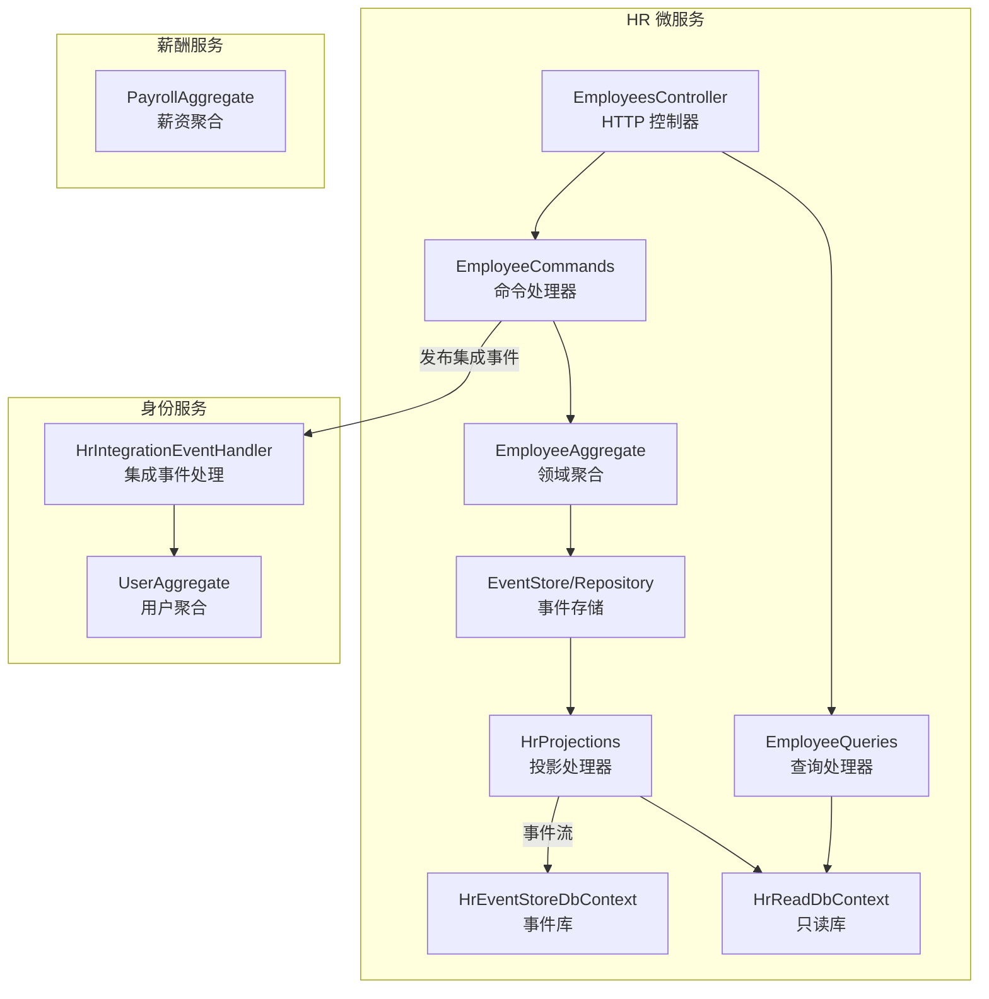
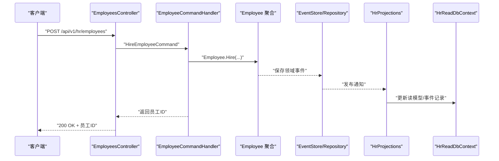
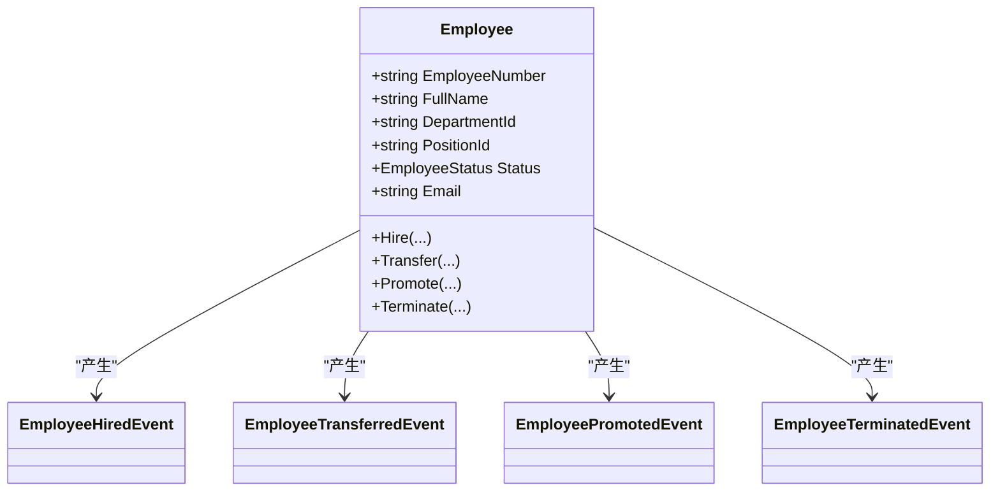
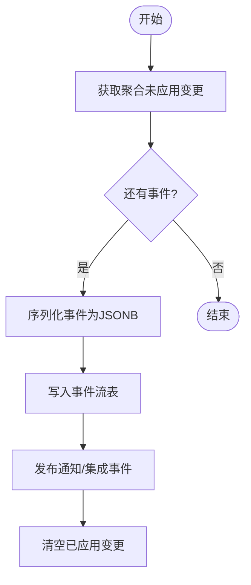
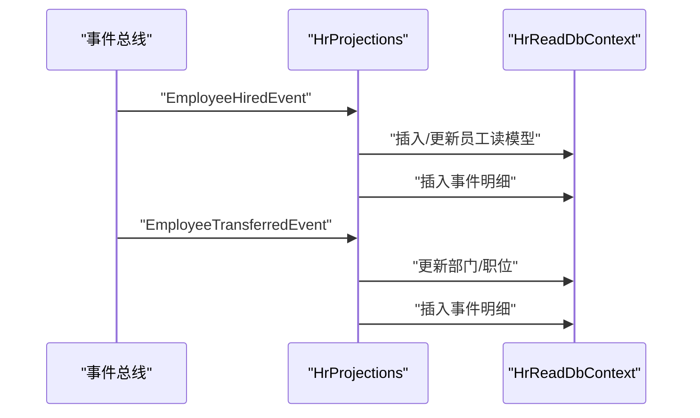
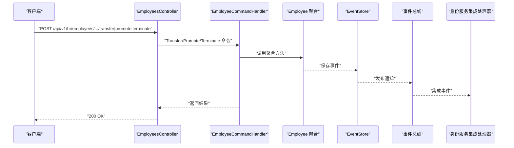
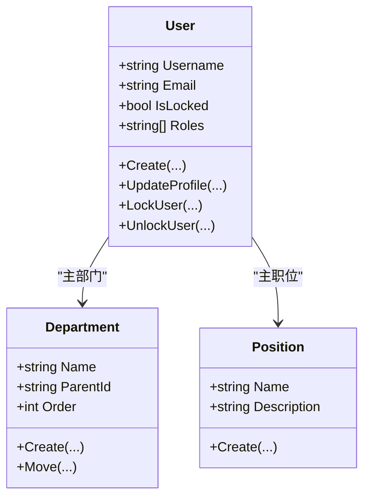
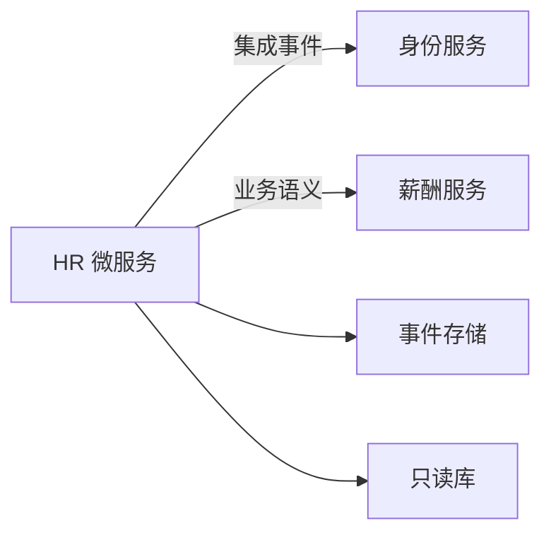

# 人力资源服务

<cite>
**本文引用的文件**
- [Program.cs](file://src/Services/HR/ErpSystem.HR/Program.cs)
- [EmployeesController.cs](file://src/Services/HR/ErpSystem.HR/API/EmployeesController.cs)
- [EmployeeCommands.cs](file://src/Services/HR/ErpSystem.HR/Application/EmployeeCommands.cs)
- [EmployeeQueries.cs](file://src/Services/HR/ErpSystem.HR/Application/EmployeeQueries.cs)
- [EmployeeAggregate.cs](file://src/Services/HR/ErpSystem.HR/Domains/EmployeeAggregate.cs)
- [HREvents.cs](file://src/Services/HR/ErpSystem.HR/Domains/HREvents.cs)
- [Persistence.cs](file://src/Services/HR/ErpSystem.HR/Infrastructure/Persistence.cs)
- [Projections.cs](file://src/Services/HR/ErpSystem.HR/Infrastructure/Projections.cs)
- [DDDBase.cs](file://src/BuildingBlocks/ErpSystem.BuildingBlocks/Domain/DDDBase.cs)
- [PositionAggregate.cs](file://src/Services/Identity/ErpSystem.Identity/Domains/PositionAggregate.cs)
- [DepartmentAggregate.cs](file://src/Services/Identity/ErpSystem.Identity/Domains/DepartmentAggregate.cs)
- [UserAggregate.cs](file://src/Services/Identity/ErpSystem.Identity/Domains/UserAggregate.cs)
- [IntegrationEventHandlers.cs](file://src/Services/Identity/ErpSystem.Identity/Application/IntegrationEventHandlers.cs)
- [HRIntegrationEvents.cs](file://src/Services/Identity/ErpSystem.Identity/Application/IntegrationEvents/HRIntegrationEvents.cs)
- [PayrollAggregate.cs](file://src/Services/Payroll/ErpSystem.Payroll/Domains/PayrollAggregate.cs)
</cite>

## 目录
1. [简介](#简介)
2. [项目结构](#项目结构)
3. [核心组件](#核心组件)
4. [架构总览](#架构总览)
5. [详细组件分析](#详细组件分析)
6. [依赖关系分析](#依赖关系分析)
7. [性能考虑](#性能考虑)
8. [故障排查指南](#故障排查指南)
9. [结论](#结论)
10. [附录](#附录)

## 简介
本文件面向人力资源服务（HR Service）的微服务实现，围绕员工档案、组织架构与人事管理等核心能力进行系统化文档化。重点阐述：
- 员工聚合根设计与状态流转
- 组织结构（部门与职位）在身份服务中的建模
- 人事流程（入职、调岗、晋升、离职）与事件溯源
- 与身份服务的集成事件协作
- 与薪酬服务的关联（薪资结构、计薪周期）
- API 接口设计、查询投影与事件回放能力
- 报表与审计追踪（通过事件流与只读库）

## 项目结构
HR 微服务采用分层架构：API 控制器负责请求入口，应用层处理命令/查询，领域层定义聚合与事件，基础设施层负责事件存储与只读投影。

图表来源
- [Program.cs](file://src/Services/HR/ErpSystem.HR/Program.cs#L15-L46)
- [EmployeesController.cs](file://src/Services/HR/ErpSystem.HR/API/EmployeesController.cs#L1-L48)
- [EmployeeCommands.cs](file://src/Services/HR/ErpSystem.HR/Application/EmployeeCommands.cs#L46-L111)
- [EmployeeQueries.cs](file://src/Services/HR/ErpSystem.HR/Application/EmployeeQueries.cs#L13-L43)
- [EmployeeAggregate.cs](file://src/Services/HR/ErpSystem.HR/Domains/EmployeeAggregate.cs#L76-L151)
- [Persistence.cs](file://src/Services/HR/ErpSystem.HR/Infrastructure/Persistence.cs#L6-L30)
- [Projections.cs](file://src/Services/HR/ErpSystem.HR/Infrastructure/Projections.cs#L6-L115)
- [IntegrationEventHandlers.cs](file://src/Services/Identity/ErpSystem.Identity/Application/IntegrationEventHandlers.cs#L8-L32)
- [UserAggregate.cs](file://src/Services/Identity/ErpSystem.Identity/Domains/UserAggregate.cs#L55-L164)
- [PayrollAggregate.cs](file://src/Services/Payroll/ErpSystem.Payroll/Domains/PayrollAggregate.cs#L1-L63)

章节来源
- [Program.cs](file://src/Services/HR/ErpSystem.HR/Program.cs#L11-L71)
- [EmployeesController.cs](file://src/Services/HR/ErpSystem.HR/API/EmployeesController.cs#L7-L47)

## 核心组件
- 员工聚合根：封装员工生命周期关键状态（在职、非在职、已离职），以及入职、调岗、晋升、离职等业务行为。
- 事件存储与事件流：基于事件溯源持久化员工变更历史，并通过发布/订阅机制驱动只读投影与跨服务集成事件。
- 只读投影：将事件转换为可搜索的读模型，支持按条件检索与事件时间线回溯。
- 应用层命令/查询：统一处理业务操作与查询请求，协调聚合与投影。
- 身份服务集成：通过集成事件自动创建或锁定用户账户，确保人资与身份一致。

章节来源
- [EmployeeAggregate.cs](file://src/Services/HR/ErpSystem.HR/Domains/EmployeeAggregate.cs#L76-L151)
- [DDDBase.cs](file://src/BuildingBlocks/ErpSystem.BuildingBlocks/Domain/DDDBase.cs#L14-L41)
- [Persistence.cs](file://src/Services/HR/ErpSystem.HR/Infrastructure/Persistence.cs#L6-L30)
- [Projections.cs](file://src/Services/HR/ErpSystem.HR/Infrastructure/Projections.cs#L6-L115)
- [EmployeeCommands.cs](file://src/Services/HR/ErpSystem.HR/Application/EmployeeCommands.cs#L46-L111)
- [EmployeeQueries.cs](file://src/Services/HR/ErpSystem.HR/Application/EmployeeQueries.cs#L13-L43)

## 架构总览
HR 微服务采用事件驱动架构：
- 写模型：命令触发聚合产生领域事件，事件写入事件存储。
- 读模型：投影处理器监听事件，更新只读数据库中的读模型。
- 集成：通过事件总线发布集成事件，供身份服务消费以同步用户账户状态。

图表来源
- [EmployeesController.cs](file://src/Services/HR/ErpSystem.HR/API/EmployeesController.cs#L11-L12)
- [EmployeeCommands.cs](file://src/Services/HR/ErpSystem.HR/Application/EmployeeCommands.cs#L52-L75)
- [EmployeeAggregate.cs](file://src/Services/HR/ErpSystem.HR/Domains/EmployeeAggregate.cs#L85-L106)
- [DDDBase.cs](file://src/BuildingBlocks/ErpSystem.BuildingBlocks/Domain/DDDBase.cs#L59-L120)
- [Projections.cs](file://src/Services/HR/ErpSystem.HR/Infrastructure/Projections.cs#L12-L47)

## 详细组件分析

### 员工聚合根与状态管理
- 聚合职责：维护员工标识、组织归属、状态与基本信息；通过方法表达业务意图（入职、调岗、晋升、离职）。
- 状态枚举：Active/Inactive/Terminated，贯穿读模型与事件描述。
- 行为约束：禁止对已终止员工执行调岗/晋升；禁止重复终止。
- 事件建模：每个业务动作对应一个领域事件，用于事件溯源与审计。

图表来源
- [EmployeeAggregate.cs](file://src/Services/HR/ErpSystem.HR/Domains/EmployeeAggregate.cs#L76-L151)

章节来源
- [EmployeeAggregate.cs](file://src/Services/HR/ErpSystem.HR/Domains/EmployeeAggregate.cs#L13-L18)
- [EmployeeAggregate.cs](file://src/Services/HR/ErpSystem.HR/Domains/EmployeeAggregate.cs#L108-L124)

### 事件存储与事件总线
- 事件存储：将聚合产生的未应用事件序列化为事件流，包含聚合类型、版本、事件类型与有效载荷。
- 事件发布：保存后逐条发布通知与集成事件，驱动投影与跨服务通信。
- 事件加载：按聚合ID与版本顺序加载历史，重建聚合状态。

图表来源
- [DDDBase.cs](file://src/BuildingBlocks/ErpSystem.BuildingBlocks/Domain/DDDBase.cs#L59-L120)
- [Persistence.cs](file://src/Services/HR/ErpSystem.HR/Infrastructure/Persistence.cs#L6-L18)

章节来源
- [DDDBase.cs](file://src/BuildingBlocks/ErpSystem.BuildingBlocks/Domain/DDDBase.cs#L53-L120)
- [Persistence.cs](file://src/Services/HR/ErpSystem.HR/Infrastructure/Persistence.cs#L6-L18)

### 只读投影与查询
- 投影处理器：监听员工事件，更新只读库中的员工读模型与事件明细。
- 查询处理器：支持按姓名、部门、状态分页检索，支持按员工ID获取详情与事件时间线。

图表来源
- [Projections.cs](file://src/Services/HR/ErpSystem.HR/Infrastructure/Projections.cs#L12-L114)
- [EmployeeQueries.cs](file://src/Services/HR/ErpSystem.HR/Application/EmployeeQueries.cs#L18-L42)

章节来源
- [Projections.cs](file://src/Services/HR/ErpSystem.HR/Infrastructure/Projections.cs#L6-L115)
- [EmployeeQueries.cs](file://src/Services/HR/ErpSystem.HR/Application/EmployeeQueries.cs#L13-L43)

### 人事流程与API设计
- 入职：生成员工号，创建员工聚合，发布“员工已入职”集成事件给身份服务。
- 调岗/晋升：校验状态与参数一致性，产生相应事件并更新读模型。
- 离职：标记状态为已终止，发布“员工已离职”集成事件给身份服务。
- 查询：支持按条件分页检索、按ID查询详情、获取事件时间线。

图表来源
- [EmployeesController.cs](file://src/Services/HR/ErpSystem.HR/API/EmployeesController.cs#L22-L41)
- [EmployeeCommands.cs](file://src/Services/HR/ErpSystem.HR/Application/EmployeeCommands.cs#L77-L110)
- [HREvents.cs](file://src/Services/HR/ErpSystem.HR/Domains/HREvents.cs#L5-L21)
- [IntegrationEventHandlers.cs](file://src/Services/Identity/ErpSystem.Identity/Application/IntegrationEventHandlers.cs#L12-L31)

章节来源
- [EmployeesController.cs](file://src/Services/HR/ErpSystem.HR/API/EmployeesController.cs#L11-L46)
- [EmployeeCommands.cs](file://src/Services/HR/ErpSystem.HR/Application/EmployeeCommands.cs#L8-L44)

### 组织架构与人事流程
- 部门与职位：由身份服务维护，HR 在入职时引用其ID，后续调岗/晋升亦依赖这些ID。
- 用户账户：HR 发布“员工已入职/已离职”事件，身份服务据此创建或锁定用户账户。

图表来源
- [DepartmentAggregate.cs](file://src/Services/Identity/ErpSystem.Identity/Domains/DepartmentAggregate.cs#L19-L55)
- [PositionAggregate.cs](file://src/Services/Identity/ErpSystem.Identity/Domains/PositionAggregate.cs#L13-L36)
- [UserAggregate.cs](file://src/Services/Identity/ErpSystem.Identity/Domains/UserAggregate.cs#L55-L164)

章节来源
- [DepartmentAggregate.cs](file://src/Services/Identity/ErpSystem.Identity/Domains/DepartmentAggregate.cs#L1-L56)
- [PositionAggregate.cs](file://src/Services/Identity/ErpSystem.Identity/Domains/PositionAggregate.cs#L1-L37)
- [UserAggregate.cs](file://src/Services/Identity/ErpSystem.Identity/Domains/UserAggregate.cs#L55-L164)

### 与薪酬服务的关联
- 薪资结构：薪酬服务定义薪资构成、扣款项与薪资运行状态，HR 可通过事件或查询与之交互（如计薪周期、薪资生效）。
- 关联点：HR 的员工读模型包含部门/职位信息，薪酬计算通常依赖这些维度。

章节来源
- [PayrollAggregate.cs](file://src/Services/Payroll/ErpSystem.Payroll/Domains/PayrollAggregate.cs#L1-L63)

## 依赖关系分析
- 模块内聚：HR 微服务内部职责清晰，命令/查询/聚合/投影分离。
- 外部耦合：与身份服务通过集成事件解耦；与薪酬服务通过业务语义耦合（组织维度与薪资结构）。
- 数据一致性：事件溯源保证写模型一致性；只读库提供最终一致的查询视图。

图表来源
- [Program.cs](file://src/Services/HR/ErpSystem.HR/Program.cs#L24-L39)
- [HREvents.cs](file://src/Services/HR/ErpSystem.HR/Domains/HREvents.cs#L5-L21)
- [IntegrationEventHandlers.cs](file://src/Services/Identity/ErpSystem.Identity/Application/IntegrationEventHandlers.cs#L8-L32)

章节来源
- [Program.cs](file://src/Services/HR/ErpSystem.HR/Program.cs#L24-L39)

## 性能考虑
- 事件序列化与存储：使用 JSONB 存储事件载荷，建议控制单事件大小与避免冗余字段。
- 查询优化：只读库建立必要索引（如员工号、部门ID、状态、创建时间），分页查询避免大偏移。
- 并发与版本：事件存储按版本写入，聚合加载按版本顺序重建，避免并发覆盖。
- 事件处理：投影与集成事件处理应异步化，避免阻塞命令处理。

## 故障排查指南
- 命令处理异常：检查聚合状态约束（如已终止员工不可再调岗/晋升），确认事件是否正确发布。
- 事件丢失：核对事件存储表是否存在记录，确认事件发布与订阅链路。
- 读模型不同步：检查投影处理器是否收到事件并成功写入只读库。
- 集成事件未触发：确认事件总线配置与订阅端接收逻辑。

章节来源
- [EmployeeAggregate.cs](file://src/Services/HR/ErpSystem.HR/Domains/EmployeeAggregate.cs#L110-L123)
- [Projections.cs](file://src/Services/HR/ErpSystem.HR/Infrastructure/Projections.cs#L12-L114)
- [IntegrationEventHandlers.cs](file://src/Services/Identity/ErpSystem.Identity/Application/IntegrationEventHandlers.cs#L12-L31)

## 结论
本 HR 微服务通过事件溯源与CQRS实现了员工全生命周期管理，结合只读投影提供高效查询能力，并通过集成事件与身份服务协同，保障人资与身份的一致性。未来可在以下方面持续演进：
- 引入流程审批（如调岗/晋升需审批）与工作流引擎集成
- 扩展考勤统计与绩效评估的数据模型与事件
- 完善报表生成与实时仪表盘能力

## 附录

### API 设计概览
- 入职
  - 方法：POST
  - 路径：/api/v1/hr/employees
  - 请求体：包含员工基础信息、雇佣类型、部门/职位、成本中心等
  - 返回：员工ID
- 查询详情
  - 方法：GET
  - 路径：/api/v1/hr/employees/{id}
  - 返回：员工读模型
- 条件分页查询
  - 方法：GET
  - 路径：/api/v1/hr/employees
  - 查询参数：fullName、departmentId、status、page
  - 返回：员工列表
- 调岗
  - 方法：POST
  - 路径：/api/v1/hr/employees/{id}/transfer
  - 请求体：目标部门/职位、生效日期、原因
  - 返回：布尔结果
- 晋升
  - 方法：POST
  - 路径：/api/v1/hr/employees/{id}/promote
  - 请求体：目标职位、生效日期、原因
  - 返回：布尔结果
- 离职
  - 方法：POST
  - 路径：/api/v1/hr/employees/{id}/terminate
  - 请求体：终止日期、原因、备注
  - 返回：布尔结果
- 获取事件
  - 方法：GET
  - 路径：/api/v1/hr/employees/{id}/events
  - 返回：事件时间线

章节来源
- [EmployeesController.cs](file://src/Services/HR/ErpSystem.HR/API/EmployeesController.cs#L11-L46)