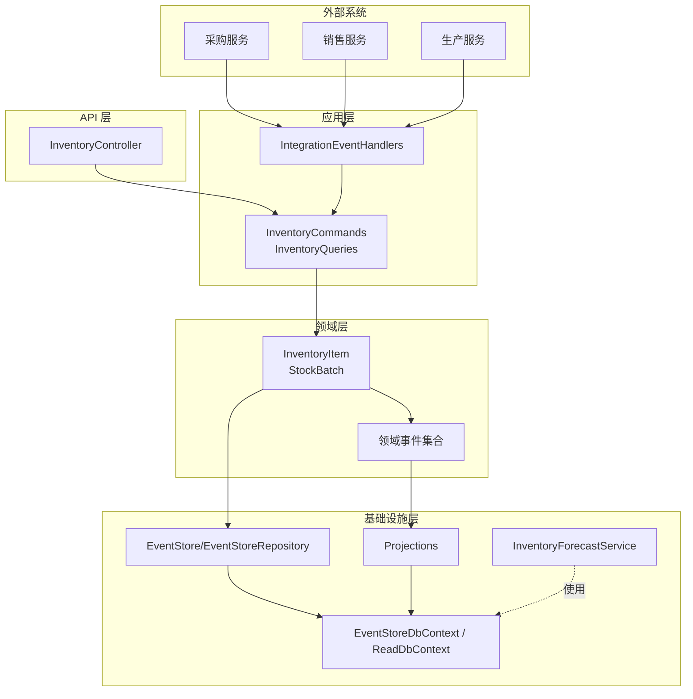
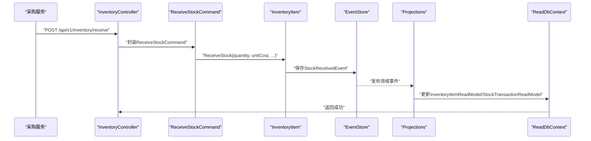
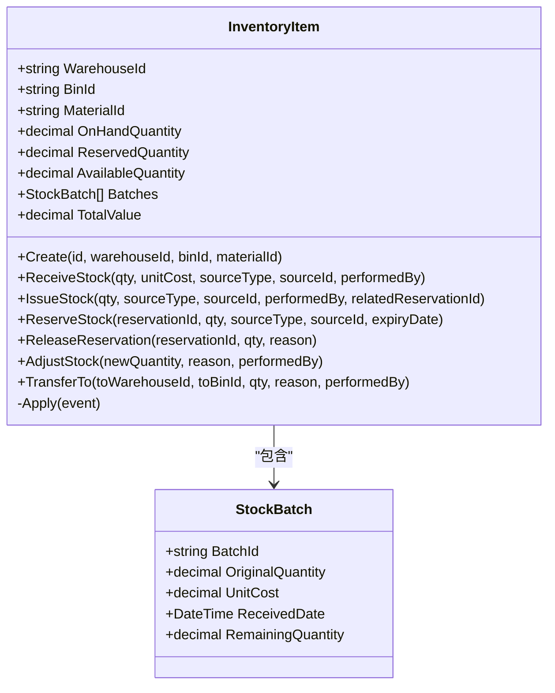
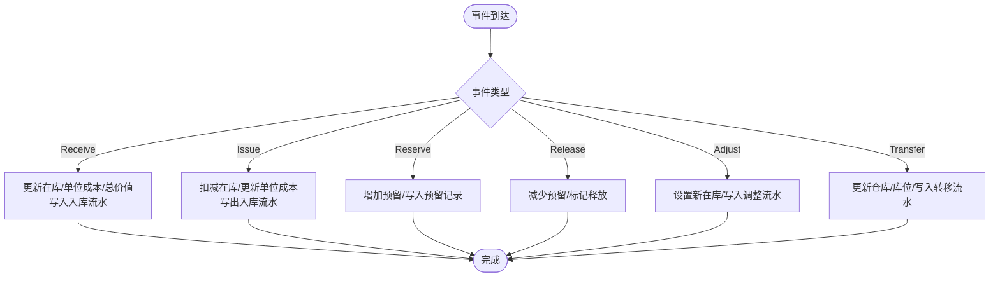
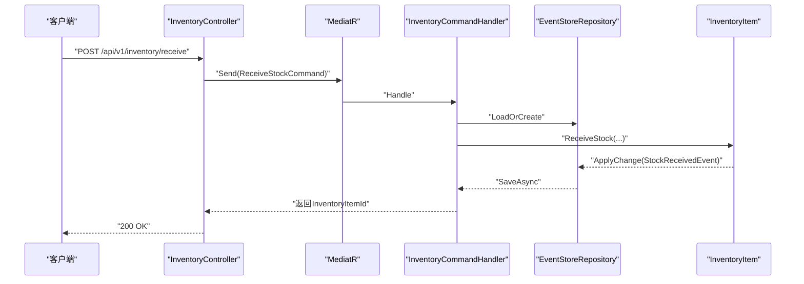
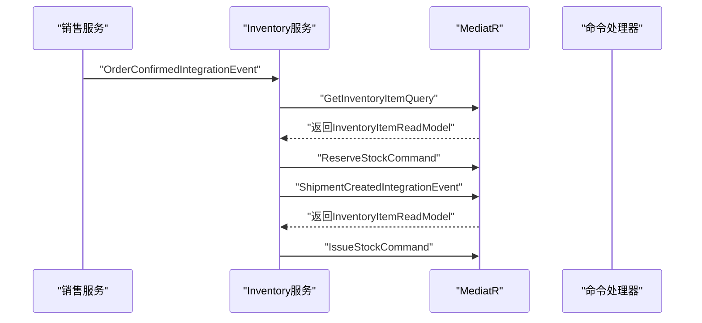
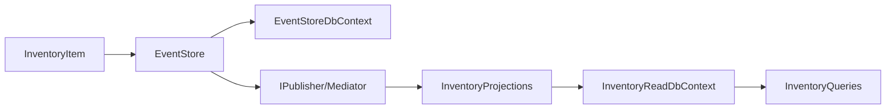

# 库存管理服务

<cite>
**本文引用的文件**
- [PRD-05-Inventory-Service.md](file://docs/PRD-05-Inventory-Service.md)
- [Program.cs](file://src/Services/Inventory/ErpSystem.Inventory/Program.cs)
- [appsettings.json](file://src/Services/Inventory/ErpSystem.Inventory/appsettings.json)
- [InventoryController.cs](file://src/Services/Inventory/ErpSystem.Inventory/API/InventoryController.cs)
- [InventoryCommands.cs](file://src/Services/Inventory/ErpSystem.Inventory/Application/InventoryCommands.cs)
- [InventoryQueries.cs](file://src/Services/Inventory/ErpSystem.Inventory/Application/InventoryQueries.cs)
- [InventoryItemAggregate.cs](file://src/Services/Inventory/ErpSystem.Inventory/Domain/InventoryItemAggregate.cs)
- [InventoryEvents.cs](file://src/Services/Inventory/ErpSystem.Inventory/Domain/InventoryEvents.cs)
- [Persistence.cs](file://src/Services/Inventory/ErpSystem.Inventory/Infrastructure/Persistence.cs)
- [Projections.cs](file://src/Services/Inventory/ErpSystem.Inventory/Infrastructure/Projections.cs)
- [IntegrationEventHandlers.cs](file://src/Services/Inventory/ErpSystem.Inventory/Application/IntegrationEventHandlers.cs)
- [InventoryForecastService.cs](file://src/Services/Inventory/ErpSystem.Inventory/Domain/Services/InventoryForecastService.cs)
- [DomainEventDispatcher.cs](file://src/BuildingBlocks/ErpSystem.BuildingBlocks/Domain/DomainEventDispatcher.cs)
- [inventory.yaml](file://deploy/k8s/services/inventory.yaml)
</cite>

## 目录
1. [简介](#简介)
2. [项目结构](#项目结构)
3. [核心组件](#核心组件)
4. [架构总览](#架构总览)
5. [组件详解](#组件详解)
6. [依赖关系分析](#依赖关系分析)
7. [性能与并发](#性能与并发)
8. [故障排查指南](#故障排查指南)
9. [结论](#结论)
10. [附录](#附录)

## 简介
本文件为库存管理服务（Inventory Service）的微服务技术文档，围绕多仓库、批次管理、库存调整与盘点、库存聚合根设计、事件处理与策略引擎进行深入说明。文档同时覆盖实时同步、安全库存控制、库存优化算法、业务规则、盘点机制与损耗处理，并提供API接口规范、并发控制与性能监控策略。

## 项目结构
库存服务采用分层架构与CQRS模式，结合事件溯源（Event Store）与读模型投影（Projection），实现库存状态的最终一致性与高性能查询能力。核心目录与职责如下：
- API 层：暴露REST接口，封装命令与查询请求。
- Application 层：定义命令/查询与处理器，协调聚合与读模型。
- Domain 层：定义聚合根、领域事件与业务规则。
- Infrastructure 层：事件存储、读模型数据库、投影器与读写上下文。
- Deploy：Kubernetes部署清单，启用Dapr边车与健康检查。

图表来源
- [Program.cs](file://src/Services/Inventory/ErpSystem.Inventory/Program.cs#L1-L74)
- [InventoryController.cs](file://src/Services/Inventory/ErpSystem.Inventory/API/InventoryController.cs#L1-L44)
- [InventoryCommands.cs](file://src/Services/Inventory/ErpSystem.Inventory/Application/InventoryCommands.cs#L1-L142)
- [InventoryQueries.cs](file://src/Services/Inventory/ErpSystem.Inventory/Application/InventoryQueries.cs#L1-L50)
- [InventoryItemAggregate.cs](file://src/Services/Inventory/ErpSystem.Inventory/Domain/InventoryItemAggregate.cs#L1-L255)
- [Persistence.cs](file://src/Services/Inventory/ErpSystem.Inventory/Infrastructure/Persistence.cs#L1-L79)
- [Projections.cs](file://src/Services/Inventory/ErpSystem.Inventory/Infrastructure/Projections.cs#L1-L211)
- [IntegrationEventHandlers.cs](file://src/Services/Inventory/ErpSystem.Inventory/Application/IntegrationEventHandlers.cs#L1-L112)
- [InventoryForecastService.cs](file://src/Services/Inventory/ErpSystem.Inventory/Domain/Services/InventoryForecastService.cs#L1-L52)

章节来源
- [Program.cs](file://src/Services/Inventory/ErpSystem.Inventory/Program.cs#L1-L74)
- [appsettings.json](file://src/Services/Inventory/ErpSystem.Inventory/appsettings.json#L1-L10)

## 核心组件
- 聚合根：InventoryItem，负责库存数量、预留、批次与事件产生。
- 领域事件：Receive/Issue/Reserve/Release/Adjust/Transfer等事件，驱动读模型更新。
- 事件存储：基于EF Core的EventStore与EventStoreRepository，持久化事件流。
- 读模型：InventoryItemReadModel、StockTransactionReadModel、StockReservationReadModel，支持快速查询与报表。
- 投影器：InventoryProjections监听领域事件，更新读模型与事务流水。
- 控制器与命令/查询：InventoryController暴露REST端点，InventoryCommands与InventoryQueries处理业务编排。
- 集成事件处理器：订阅采购/销售/生产服务的集成事件，触发库存变更。
- 预测服务：InventoryForecastService提供库存耗尽预测能力（模拟）。

章节来源
- [InventoryItemAggregate.cs](file://src/Services/Inventory/ErpSystem.Inventory/Domain/InventoryItemAggregate.cs#L90-L255)
- [Persistence.cs](file://src/Services/Inventory/ErpSystem.Inventory/Infrastructure/Persistence.cs#L39-L79)
- [Projections.cs](file://src/Services/Inventory/ErpSystem.Inventory/Infrastructure/Projections.cs#L7-L211)
- [InventoryController.cs](file://src/Services/Inventory/ErpSystem.Inventory/API/InventoryController.cs#L1-L44)
- [InventoryCommands.cs](file://src/Services/Inventory/ErpSystem.Inventory/Application/InventoryCommands.cs#L60-L142)
- [InventoryQueries.cs](file://src/Services/Inventory/ErpSystem.Inventory/Application/InventoryQueries.cs#L13-L50)
- [IntegrationEventHandlers.cs](file://src/Services/Inventory/ErpSystem.Inventory/Application/IntegrationEventHandlers.cs#L14-L112)
- [InventoryForecastService.cs](file://src/Services/Inventory/ErpSystem.Inventory/Domain/Services/InventoryForecastService.cs#L7-L52)

## 架构总览
库存服务采用事件驱动架构，遵循以下关键原则：
- 事件溯源：所有状态变更以领域事件形式记录，确保可追溯与重放。
- CQRS：命令侧负责业务规则与事件产生，查询侧使用独立读模型。
- 分离关注点：聚合根专注业务不变量，投影器负责读模型一致性。
- 集成解耦：通过集成事件与MediatR实现跨服务协作。

图表来源
- [IntegrationEventHandlers.cs](file://src/Services/Inventory/ErpSystem.Inventory/Application/IntegrationEventHandlers.cs#L14-L32)
- [InventoryController.cs](file://src/Services/Inventory/ErpSystem.Inventory/API/InventoryController.cs#L21-L22)
- [InventoryCommands.cs](file://src/Services/Inventory/ErpSystem.Inventory/Application/InventoryCommands.cs#L68-L89)
- [InventoryItemAggregate.cs](file://src/Services/Inventory/ErpSystem.Inventory/Domain/InventoryItemAggregate.cs#L116-L120)
- [Projections.cs](file://src/Services/Inventory/ErpSystem.Inventory/Infrastructure/Projections.cs#L39-L81)

## 组件详解

### 聚合根：InventoryItem（库存聚合）
- 关键属性：仓库ID、库位ID、物料ID、在库数量、预留数量、可用数量、批次列表、总价值。
- 业务方法：
  - 入库：校验数量为正，累计在库与批次，产生入库事件。
  - 出库：校验可用库存，按FIFO消耗批次，计算成本，产生出库事件。
  - 预留/释放：校验可用库存，维护活动预留ID列表。
  - 调整：根据新数量更新在库，产生调整事件。
  - 转移：更新仓库与库位，记录转移事件。
- 批次管理：StockBatch记录批次ID、原始数量、单位成本与入库时间，支持FIFO出库与成本计算。

图表来源
- [InventoryItemAggregate.cs](file://src/Services/Inventory/ErpSystem.Inventory/Domain/InventoryItemAggregate.cs#L91-L255)

章节来源
- [InventoryItemAggregate.cs](file://src/Services/Inventory/ErpSystem.Inventory/Domain/InventoryItemAggregate.cs#L90-L255)

### 事件处理与读模型投影
- 事件到读模型：Projections监听InventoryItemCreated、StockReceived、StockIssued、StockReserved、ReservationReleased、StockAdjusted、StockTransferred等事件，原子性更新读模型与交易流水。
- 读模型设计：InventoryItemReadModel包含维度键、数量、单位成本、总价值与最后移动时间；StockTransactionReadModel记录每次数量变化的来源与经手人；StockReservationReadModel跟踪预留状态。
- 索引优化：读库中对(WarehouseId, BinId, MaterialId)建立唯一索引，提升查询效率。

图表来源
- [Projections.cs](file://src/Services/Inventory/ErpSystem.Inventory/Infrastructure/Projections.cs#L16-L211)
- [Persistence.cs](file://src/Services/Inventory/ErpSystem.Inventory/Infrastructure/Persistence.cs#L39-L79)

章节来源
- [Projections.cs](file://src/Services/Inventory/ErpSystem.Inventory/Infrastructure/Projections.cs#L7-L211)
- [Persistence.cs](file://src/Services/Inventory/ErpSystem.Inventory/Infrastructure/Persistence.cs#L20-L79)

### 命令与查询处理
- 命令处理：InventoryCommandHandler接收Receive/Issue/Reserve/Release/Adjust/Transfer命令，加载聚合、执行业务方法、保存聚合。
- 查询处理：InventoryQueryHandler提供库存余额、库存搜索、交易流水查询，均基于读模型数据库。
- 控制器端点：提供查询可用库存、接收/转移/出库、预留/释放、调整与交易流水查询等REST接口。

图表来源
- [InventoryController.cs](file://src/Services/Inventory/ErpSystem.Inventory/API/InventoryController.cs#L21-L22)
- [InventoryCommands.cs](file://src/Services/Inventory/ErpSystem.Inventory/Application/InventoryCommands.cs#L68-L89)
- [InventoryItemAggregate.cs](file://src/Services/Inventory/ErpSystem.Inventory/Domain/InventoryItemAggregate.cs#L116-L120)

章节来源
- [InventoryController.cs](file://src/Services/Inventory/ErpSystem.Inventory/API/InventoryController.cs#L1-L44)
- [InventoryCommands.cs](file://src/Services/Inventory/ErpSystem.Inventory/Application/InventoryCommands.cs#L60-L142)
- [InventoryQueries.cs](file://src/Services/Inventory/ErpSystem.Inventory/Application/InventoryQueries.cs#L13-L50)

### 集成事件与跨服务协作
- 采购集成：采购收货事件触发库存入库，自动创建或加载InventoryItem并累计在库与批次。
- 销售集成：订单确认触发预留，发货事件触发出库并释放对应预留。
- 生产集成：领料事件触发出库，完工事件触发入库。

图表来源
- [IntegrationEventHandlers.cs](file://src/Services/Inventory/ErpSystem.Inventory/Application/IntegrationEventHandlers.cs#L34-L74)

章节来源
- [IntegrationEventHandlers.cs](file://src/Services/Inventory/ErpSystem.Inventory/Application/IntegrationEventHandlers.cs#L14-L112)

### 库存策略引擎与预测
- 预测服务：InventoryForecastService提供库存耗尽预测能力，日志中体现对历史数据的加载与推理过程（模拟）。
- 未来扩展：可通过gRPC接入Python/TensorFlow模型，实现更复杂的时序预测与安全库存优化。

章节来源
- [InventoryForecastService.cs](file://src/Services/Inventory/ErpSystem.Inventory/Domain/Services/InventoryForecastService.cs#L7-L52)

## 依赖关系分析
- 事件派发：DomainEventDispatcher拦截EF保存，收集聚合中的领域事件并发布，避免重复派发。
- 事件存储：EventStoreRepository封装事件存储与聚合加载，支持版本化事件流。
- 读写分离：EventStoreDbContext用于事件存储，InventoryReadDbContext用于读模型查询，二者通过投影保持最终一致。

图表来源
- [DomainEventDispatcher.cs](file://src/BuildingBlocks/ErpSystem.BuildingBlocks/Domain/DomainEventDispatcher.cs#L17-L62)
- [Persistence.cs](file://src/Services/Inventory/ErpSystem.Inventory/Infrastructure/Persistence.cs#L6-L37)
- [Projections.cs](file://src/Services/Inventory/ErpSystem.Inventory/Infrastructure/Projections.cs#L7-L211)

章节来源
- [DomainEventDispatcher.cs](file://src/BuildingBlocks/ErpSystem.BuildingBlocks/Domain/DomainEventDispatcher.cs#L17-L62)
- [Persistence.cs](file://src/Services/Inventory/ErpSystem.Inventory/Infrastructure/Persistence.cs#L6-L37)

## 性能与并发
- 查询性能：读模型基于唯一索引与分页查询，满足常规余额与流水查询的低延迟要求。
- 写入性能：命令处理在单聚合内执行，事件写入与读模型更新为异步派发，降低写路径阻塞。
- 并发控制：聚合内业务规则（可用库存校验、批次FIFO）在命令阶段执行，避免ABA问题；预留释放与出库联动，确保一致性。
- 监控与可观测性：服务内置健康检查端点与Dapr边车，部署清单提供存活/就绪探针，便于Kubernetes调度与网格治理。

章节来源
- [Projections.cs](file://src/Services/Inventory/ErpSystem.Inventory/Infrastructure/Projections.cs#L32-L36)
- [inventory.yaml](file://deploy/k8s/services/inventory.yaml#L41-L52)

## 故障排查指南
- 常见错误
  - 库存不足：出库或预留时可用库存不足会抛出异常，需检查上游是否正确预留或是否存在未释放的占用。
  - 聚合缺失：命令处理中若聚合不存在，抛出“未找到”异常，需确认读模型是否已初始化或事件是否完整。
  - 批次不匹配：若历史在库无批次记录，出库可能无法计算成本，需补充批次或迁移数据。
- 排查步骤
  - 检查事件存储是否完整：确认EventStoreDbContext中事件流版本连续。
  - 校验读模型一致性：对比InventoryItemReadModel与事件计算结果。
  - 查看集成事件：确认采购/销售/生产事件是否正确投递与处理。
  - 观察日志：利用领域事件派发日志定位事件丢失或重复派发问题。

章节来源
- [InventoryItemAggregate.cs](file://src/Services/Inventory/ErpSystem.Inventory/Domain/InventoryItemAggregate.cs#L130-L171)
- [Projections.cs](file://src/Services/Inventory/ErpSystem.Inventory/Infrastructure/Projections.cs#L83-L118)

## 结论
库存管理服务通过事件溯源与CQRS实现了高一致性与可扩展的库存管理能力，支持多仓库、批次管理、预留与调整等核心功能。读模型投影保障了查询性能，集成事件处理器打通了与采购、销售、生产的业务闭环。未来可进一步完善批次与库位细粒度管理、安全库存预警与更丰富的预测模型。

## 附录

### API 接口规范（节选）
- 查询可用库存
  - GET /api/v1/inventory/available?warehouseId={id}&binId={id}&materialId={id}
  - 返回：仓库ID、物料ID、在库、预留、可用数量
- 搜索库存
  - GET /api/v1/inventory/items?warehouseId={id}&binId={id}&materialCode={code}&page={index}&pageSize={size}
- 入库
  - POST /api/v1/inventory/receive
  - 请求体：仓库ID、库位ID、物料ID、数量、单价、来源类型、来源单据ID、经手人
- 出库
  - POST /api/v1/inventory/issue
  - 请求体：库存明细ID、数量、来源类型、来源单据ID、经手人、关联预留ID（可选）
- 转移
  - POST /api/v1/inventory/transfer
  - 请求体：库存明细ID、目的仓库ID、目的库位ID、数量、原因、经手人
- 预留
  - POST /api/v1/inventory/reservations
  - 请求体：库存明细ID、数量、来源类型、来源单据ID、到期时间
- 释放预留
  - POST /api/v1/inventory/reservations/release
  - 请求体：库存明细ID、预留ID、数量、原因
- 调整
  - POST /api/v1/inventory/adjust
  - 请求体：库存明细ID、新数量、原因、经手人
- 交易流水
  - GET /api/v1/inventory/items/{id}/transactions?page={index}

章节来源
- [InventoryController.cs](file://src/Services/Inventory/ErpSystem.Inventory/API/InventoryController.cs#L11-L43)
- [InventoryCommands.cs](file://src/Services/Inventory/ErpSystem.Inventory/Application/InventoryCommands.cs#L9-L58)

### 业务规则摘要
- 可用库存不得为负（除非业务允许配置）。
- 出库按FIFO消耗批次，计算成本并更新批次剩余数量。
- 预留仅影响预留与可用数量，释放后恢复可用。
- 调整需记录差异与原因，必要时强制约束预留不超过在库。
- 转移仅更新位置维度，不改变在库数量。

章节来源
- [InventoryItemAggregate.cs](file://src/Services/Inventory/ErpSystem.Inventory/Domain/InventoryItemAggregate.cs#L130-L190)
- [Projections.cs](file://src/Services/Inventory/ErpSystem.Inventory/Infrastructure/Projections.cs#L159-L183)

### 部署与运行
- Kubernetes部署：启用Dapr边车、健康检查探针、资源限制与副本数。
- 连接字符串：通过配置映射与密钥注入数据库连接。
- 开发环境：启用Swagger与调试输出。

章节来源
- [inventory.yaml](file://deploy/k8s/services/inventory.yaml#L20-L52)
- [appsettings.json](file://src/Services/Inventory/ErpSystem.Inventory/appsettings.json#L1-L10)