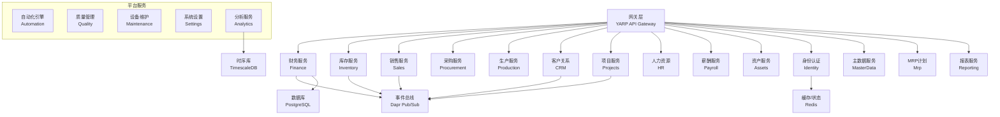
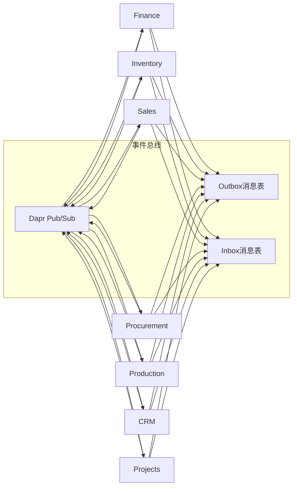

# 微服务设计

<cite>
**本文引用的文件**
- [README.md](file://README.md)
- [DEVELOPMENT_PLAN.md](file://DEVELOPMENT_PLAN.md)
- [src/ErpSystem.sln](file://src/ErpSystem.sln)
- [docs/PRD-01-MasterData-Service.md](file://docs/PRD-01-MasterData-Service.md)
- [docs/PRD-05-Inventory-Service.md](file://docs/PRD-05-Inventory-Service.md)
- [docs/PRD-07-Production-Service.md](file://docs/PRD-07-Production-Service.md)
- [src/BuildingBlocks/ErpSystem.BuildingBlocks/Domain/DDDBase.cs](file://src/BuildingBlocks/ErpSystem.BuildingBlocks/Domain/DDDBase.cs)
- [src/BuildingBlocks/ErpSystem.BuildingBlocks/Domain/DomainEventDispatcher.cs](file://src/BuildingBlocks/ErpSystem.BuildingBlocks/Domain/DomainEventDispatcher.cs)
- [src/BuildingBlocks/ErpSystem.BuildingBlocks/Outbox/OutboxMessage.cs](file://src/BuildingBlocks/ErpSystem.BuildingBlocks/Outbox/OutboxMessage.cs)
- [src/BuildingBlocks/ErpSystem.BuildingBlocks/EventBus/DaprEventBus.cs](file://src/BuildingBlocks/ErpSystem.BuildingBlocks/EventBus/DaprEventBus.cs)
- [src/Gateways/ErpSystem.Gateway/Program.cs](file://src/Gateways/ErpSystem.Gateway/Program.cs)
- [deploy/k8s/services/gateway.yaml](file://deploy/k8s/services/gateway.yaml)
</cite>

## 目录
1. [引言](#引言)
2. [项目结构](#项目结构)
3. [核心组件](#核心组件)
4. [架构总览](#架构总览)
5. [详细组件分析](#详细组件分析)
6. [依赖分析](#依赖分析)
7. [性能考虑](#性能考虑)
8. [故障排查指南](#故障排查指南)
9. [结论](#结论)
10. [附录](#附录)

## 引言
本设计文档面向ERP微服务系统，基于仓库中的PRD与代码实现，给出15个微服务的划分原则、边界定义、职责、数据模型与API设计，并阐述服务间依赖关系、通信协议与集成模式，以及服务发现、负载均衡与容错策略。同时，结合DDD在微服务中的应用，说明聚合根、领域事件与值对象的使用方式。

## 项目结构
系统采用“共享内核 + 多微服务”的架构，核心由15个独立服务组成，围绕“核心业务 + 支撑服务 + 平台服务”的三层划分，配合网关层统一入口与可观测性设施。

图表来源
- [README.md](file://README.md#L130-L183)
- [src/ErpSystem.sln](file://src/ErpSystem.sln#L1-L400)

章节来源
- [README.md](file://README.md#L130-L183)
- [src/ErpSystem.sln](file://src/ErpSystem.sln#L1-L400)

## 核心组件
- 共享内核（BuildingBlocks）
  - 领域建模基座：聚合根、领域事件、事件流与事件存储
  - 事件总线：基于Dapr的Pub/Sub抽象
  - 事务性Outbox：保证跨服务可靠消息投递
  - 领域事件分发器：EF Core拦截器在SaveChanges后派发事件
  - 企业级行为：验证、日志、性能、幂等、审计、多租户、缓存、可观测性、弹性策略

章节来源
- [src/BuildingBlocks/ErpSystem.BuildingBlocks/Domain/DDDBase.cs](file://src/BuildingBlocks/ErpSystem.BuildingBlocks/Domain/DDDBase.cs#L1-L137)
- [src/BuildingBlocks/ErpSystem.BuildingBlocks/Domain/DomainEventDispatcher.cs](file://src/BuildingBlocks/ErpSystem.BuildingBlocks/Domain/DomainEventDispatcher.cs#L1-L72)
- [src/BuildingBlocks/ErpSystem.BuildingBlocks/Outbox/OutboxMessage.cs](file://src/BuildingBlocks/ErpSystem.BuildingBlocks/Outbox/OutboxMessage.cs#L1-L82)
- [src/BuildingBlocks/ErpSystem.BuildingBlocks/EventBus/DaprEventBus.cs](file://src/BuildingBlocks/ErpSystem.BuildingBlocks/EventBus/DaprEventBus.cs#L1-L31)

## 架构总览
- 服务边界与职责
  - 核心业务：Finance、Inventory、Sales、Procurement、Production、CRM、Projects
  - 支撑服务：HR、Payroll、Assets、Identity、MasterData、Mrp、Reporting
  - 平台服务：Automation、Quality、Maintenance、Settings、Analytics
- 通信与集成
  - 同步：Dapr服务调用（gRPC/HTTP）
  - 异步：Dapr Pub/Sub（事件总线），Outbox/Inbox保障可靠投递
- 事件驱动
  - 写模型：聚合根产生领域事件并持久化到事件存储
  - 读模型：订阅事件投影到读库，供API高效查询
- 安全与治理
  - 网关统一鉴权与限流
  - 服务间通过Dapr中间件或网关拦截进行签名验证
  - 多租户隔离与数据域权限

章节来源
- [README.md](file://README.md#L130-L196)
- [DEVELOPMENT_PLAN.md](file://DEVELOPMENT_PLAN.md#L16-L33)

## 详细组件分析

### 1) 身份认证与权限服务（Identity）
- 业务领域：用户、角色、部门、岗位、数据权限、审计
- 聚合根与值对象：User、Role、Department、Position、数据权限域
- 领域事件：UserCreated、UserRoleAssigned、DepartmentMoved、UserDisabled
- API设计要点：用户注册/登录、角色授权、部门与岗位管理、数据权限查询、审计日志
- 集成：向HR推送员工入职事件，向Finance推送成本中心映射

章节来源
- [docs/PRD-01-MasterData-Service.md](file://docs/PRD-01-MasterData-Service.md#L720-L739)

### 2) 主数据服务（MasterData）
- 业务领域：物料、供应商、客户、仓库、分类、单位、货币、国家/地区、支付/运输方式
- 聚合根：Material、Supplier、Customer、Warehouse、Category、Unit、Currency
- 领域事件：MaterialCreated/Updated/Activated/Deactivated、StandardCostUpdated、SupplierBlacklisted、CustomerCreditChanged
- API设计要点：物料/供应商/客户/仓库的CRUD与查询、成本与信用额度管理、替代关系与BOM关联
- 集成：向Inventory同步仓库/库位，向Procurement同步供应商，向Sales同步客户与价格

章节来源
- [docs/PRD-01-MasterData-Service.md](file://docs/PRD-01-MasterData-Service.md#L451-L526)
- [docs/PRD-01-MasterData-Service.md](file://docs/PRD-01-MasterData-Service.md#L530-L652)
- [docs/PRD-01-MasterData-Service.md](file://docs/PRD-01-MasterData-Service.md#L696-L740)

### 3) 采购服务（Procurement）
- 业务领域：采购申请、采购订单、收货、供应商对账
- 聚合根：PurchaseOrder、PurchaseOrderLine、GoodsReceipt
- 领域事件：PurchaseOrderCreated、PurchaseOrderApproved、GoodsReceived、InvoiceGenerated
- API设计要点：采购订单创建/审批/变更、收货确认、价格反馈
- 集成：向MasterData请求供应商/物料信息，向Inventory触发入库，向Finance生成应付

章节来源
- [docs/PRD-05-Inventory-Service.md](file://docs/PRD-05-Inventory-Service.md#L448-L478)

### 4) 库存服务（Inventory）
- 业务领域：库存台账、出入库流水、库存预留、盘点与调整、基础报表
- 聚合根：InventoryItem、StockTransaction、StockReservation、StockAdjustment
- 领域事件：StockReserved、StockReleased、StockReceived、StockIssued、StockAdjusted
- API设计要点：可用库存查询、预留/释放、手工调整、库存流水与余额查询
- 集成：订阅采购收货与生产完工事件，向Sales/Production提供预留与出库

章节来源
- [docs/PRD-05-Inventory-Service.md](file://docs/PRD-05-Inventory-Service.md#L66-L158)
- [docs/PRD-05-Inventory-Service.md](file://docs/PRD-05-Inventory-Service.md#L375-L443)
- [docs/PRD-05-Inventory-Service.md](file://docs/PRD-05-Inventory-Service.md#L446-L478)

### 5) 销售服务（Sales）
- 业务领域：销售订单、发货、客户对账、销售分析
- 聚合根：SalesOrder、SalesOrderLine、Shipment、Invoice
- 领域事件：SalesOrderCreated、SalesOrderShipped、InvoiceIssued、CustomerCreditUsed
- API设计要点：销售订单创建/变更、发货确认、客户信用校验、销售报表
- 集成：向MasterData请求客户与价格，向Inventory预留/出库，向Finance生成应收

章节来源
- [docs/PRD-05-Inventory-Service.md](file://docs/PRD-05-Inventory-Service.md#L448-L478)

### 6) 生产服务（Production）
- 业务领域：生产订单、投料、报工、在制品管理
- 聚合根：ProductionOrder、MaterialConsumption、ProductionReport
- 领域事件：ProductionOrderReleased、MaterialIssued、ProductionReported、ProductionCompleted
- API设计要点：生产订单创建/释放/取消/关闭、投料与报工、在制品视图
- 集成：向MasterData请求成品/半成品信息，向Inventory领料与入库，向Finance提供订单级成本数据

章节来源
- [docs/PRD-07-Production-Service.md](file://docs/PRD-07-Production-Service.md#L67-L169)
- [docs/PRD-07-Production-Service.md](file://docs/PRD-07-Production-Service.md#L338-L401)

### 7) 财务服务（Finance）
- 业务领域：总账、科目、试算平衡、应收应付、凭证、成本核算
- 聚合根：Account、JournalEntry、FinancialPeriod、Invoice、Payment、MaterialCostValuation
- 领域事件：InvoiceCreated、PaymentApplied、CostCalculated、GLPosted
- API设计要点：总账记账、科目查询、应收应付、成本结转、财务报表
- 集成：订阅采购入库、销售发货、生产完工事件，自动产生凭证

章节来源
- [docs/PRD-05-Inventory-Service.md](file://docs/PRD-05-Inventory-Service.md#L474-L478)

### 8) 人力资源服务（HR）
- 业务领域：员工档案、组织架构、合同、考勤、离职
- 聚合根：Employee、EmploymentContract、Department、Position
- 领域事件：EmployeeHired、DepartmentMoved、EmployeeTerminated
- API设计要点：员工信息、部门与岗位管理、合同与档案
- 集成：向Identity同步用户与角色，向Payroll推送薪资数据

章节来源
- [docs/PRD-01-MasterData-Service.md](file://docs/PRD-01-MasterData-Service.md#L720-L739)

### 9) 薪酬服务（Payroll）
- 业务领域：薪资计算、发薪、个税、社保公积金
- 聚合根：Payroll、PayrollRun、SalarySlip
- 领域事件：PayrollGenerated、SalaryPaid
- API设计要点：薪资方案、计算执行、发薪与明细
- 集成：从HR获取员工信息，向Finance推送成本

章节来源
- [docs/PRD-07-Production-Service.md](file://docs/PRD-07-Production-Service.md#L396-L401)

### 10) 资产服务（Assets）
- 业务领域：资产台账、折旧、维修、调拨、报废
- 聚合根：Asset、DepreciationSchedule、MaintenanceRecord
- 领域事件：AssetAcquired、DepreciationCalculated、AssetDisposed
- API设计要点：资产登记、折旧计算、维修与调拨
- 集成：向Finance推送折旧成本

章节来源
- [docs/PRD-07-Production-Service.md](file://docs/PRD-07-Production-Service.md#L396-L401)

### 11) 客户关系（CRM）
- 业务领域：线索、商机、营销活动、客户360
- 聚合根：Lead、Opportunity、Campaign、Customer
- 领域事件：LeadConverted、OpportunityWon/Lost、CampaignExecuted
- API设计要点：线索管理、商机跟进、活动执行
- 集成：向Sales提供潜在订单，向MasterData同步客户

章节来源
- [docs/PRD-01-MasterData-Service.md](file://docs/PRD-01-MasterData-Service.md#L720-L739)

### 12) 项目服务（Projects）
- 业务领域：项目、任务、工时、资源
- 聚合根：Project、Task、Timesheet
- 领域事件：ProjectStarted、TaskCompleted、TimesheetSubmitted
- API设计要点：项目计划、任务分解、工时统计
- 集成：向HR获取资源，向Finance归集成本

章节来源
- [docs/PRD-07-Production-Service.md](file://docs/PRD-07-Production-Service.md#L396-L401)

### 13) MRP计划（Mrp）
- 业务领域：物料需求计划、建议采购、再订货规则
- 聚合根：ProcurementSuggestion、ReorderingRule
- 领域事件：SuggestionGenerated、RuleUpdated
- API设计要点：MRP计算、采购建议、安全库存与批量策略
- 集成：向MasterData读取BOM与替代关系，向Procurement生成建议

章节来源
- [docs/PRD-05-Inventory-Service.md](file://docs/PRD-05-Inventory-Service.md#L448-L478)

### 14) 报表服务（Reporting）
- 业务领域：仪表盘、KPI、趋势分析、导出
- 聚合根：Dashboard、ReportDefinition、ReportRun
- 领域事件：ReportScheduled、ReportCompleted
- API设计要点：仪表盘配置、报表查询与导出
- 集成：从各服务聚合读模型，向Analytics推送时序数据

章节来源
- [docs/PRD-05-Inventory-Service.md](file://docs/PRD-05-Inventory-Service.md#L448-L478)

### 15) 分析服务（Analytics）
- 业务领域：实时仪表盘、需求预测、时序分析
- 聚合根：DemandForecast、CashFlowForecast、BiAnalytics
- 领域事件：ForecastUpdated、AnalyticsRunCompleted
- API设计要点：实时WebSocket推送、预测模型、BI看板
- 集成：订阅各服务事件，写入TimescaleDB

章节来源
- [README.md](file://README.md#L110-L125)

## 依赖分析
- 服务间依赖
  - 上游依赖：MasterData（主数据）、Identity（鉴权）
  - 下游依赖：Finance（凭证）、Inventory（库存）、Sales/Procurement/Production（业务闭环）
  - 横向依赖：Analytics（事件消费）、Reporting（读模型）
- 通信协议
  - 同步：Dapr服务调用（gRPC/HTTP）
  - 异步：Dapr Pub/Sub（事件总线）
- 事件总线与可靠投递
  - Outbox：聚合根事件与Outbox消息在同一事务内持久化
  - Inbox：消费者侧幂等处理与去重
- 服务发现与负载均衡
  - 网关层：YARP反向代理 + 健康检查
  - Kubernetes：Service + LoadBalancer，副本数2，探针健康/就绪

图表来源
- [src/BuildingBlocks/ErpSystem.BuildingBlocks/Outbox/OutboxMessage.cs](file://src/BuildingBlocks/ErpSystem.BuildingBlocks/Outbox/OutboxMessage.cs#L57-L82)
- [src/BuildingBlocks/ErpSystem.BuildingBlocks/EventBus/DaprEventBus.cs](file://src/BuildingBlocks/ErpSystem.BuildingBlocks/EventBus/DaprEventBus.cs#L11-L21)
- [src/BuildingBlocks/ErpSystem.BuildingBlocks/Domain/DomainEventDispatcher.cs](file://src/BuildingBlocks/ErpSystem.BuildingBlocks/Domain/DomainEventDispatcher.cs#L17-L43)

章节来源
- [src/BuildingBlocks/ErpSystem.BuildingBlocks/Outbox/OutboxMessage.cs](file://src/BuildingBlocks/ErpSystem.BuildingBlocks/Outbox/OutboxMessage.cs#L1-L82)
- [src/BuildingBlocks/ErpSystem.BuildingBlocks/EventBus/DaprEventBus.cs](file://src/BuildingBlocks/ErpSystem.BuildingBlocks/EventBus/DaprEventBus.cs#L1-L31)
- [src/BuildingBlocks/ErpSystem.BuildingBlocks/Domain/DomainEventDispatcher.cs](file://src/BuildingBlocks/ErpSystem.BuildingBlocks/Domain/DomainEventDispatcher.cs#L1-L72)

## 性能考虑
- 事件溯源与CQRS
  - 写模型：聚合根产生事件，事件持久化，版本号递增
  - 读模型：订阅事件投影到关系型表，支持高效查询
- 缓存与查询优化
  - 分页查询、索引优化、读写分离
- 弹性与限流
  - 网关层统一重试、熔断、超时与限流
  - 服务内Resilience管道标准化

章节来源
- [README.md](file://README.md#L185-L196)
- [src/Gateways/ErpSystem.Gateway/Program.cs](file://src/Gateways/ErpSystem.Gateway/Program.cs#L30-L64)

## 故障排查指南
- 事件未发布/未消费
  - 检查Outbox消息是否持久化、ProcessedAt是否为空
  - 检查Dapr Pub/Sub主题与订阅配置
- 重复消费与幂等
  - 消费者侧Inbox表去重，处理完成后标记完成
- 服务不可用
  - 查看网关健康检查端点与K8s探针
  - 检查服务副本数与资源配额

章节来源
- [src/BuildingBlocks/ErpSystem.BuildingBlocks/Outbox/OutboxMessage.cs](file://src/BuildingBlocks/ErpSystem.BuildingBlocks/Outbox/OutboxMessage.cs#L57-L82)
- [src/Gateways/ErpSystem.Gateway/Program.cs](file://src/Gateways/ErpSystem.Gateway/Program.cs#L60-L81)
- [deploy/k8s/services/gateway.yaml](file://deploy/k8s/services/gateway.yaml#L35-L46)

## 结论
本设计以DDD为核心，结合事件溯源、CQRS、Outbox/Inbox与Dapr事件总线，形成高内聚、低耦合的微服务架构。通过共享内核统一企业级能力，服务边界清晰、职责明确，满足多租户、可扩展与可观测性的企业级需求。

## 附录
- DDD在微服务中的应用
  - 聚合根：Material、Supplier、Customer、InventoryItem、ProductionOrder、SalesOrder、PurchaseOrder、Account、Employee、Asset、Project、Dashboard等
  - 领域事件：贯穿各服务的业务事实，驱动读模型与跨服务协作
  - 值对象：Money、Dimensions、ContactInfo、Address、PerformanceMetrics等
- 服务发现与负载均衡
  - 网关YARP + Kubernetes Service + LoadBalancer
  - 健康检查与副本部署

章节来源
- [src/BuildingBlocks/ErpSystem.BuildingBlocks/Domain/DDDBase.cs](file://src/BuildingBlocks/ErpSystem.BuildingBlocks/Domain/DDDBase.cs#L14-L51)
- [src/BuildingBlocks/ErpSystem.BuildingBlocks/Domain/DomainEventDispatcher.cs](file://src/BuildingBlocks/ErpSystem.BuildingBlocks/Domain/DomainEventDispatcher.cs#L67-L72)
- [deploy/k8s/services/gateway.yaml](file://deploy/k8s/services/gateway.yaml#L10-L11)