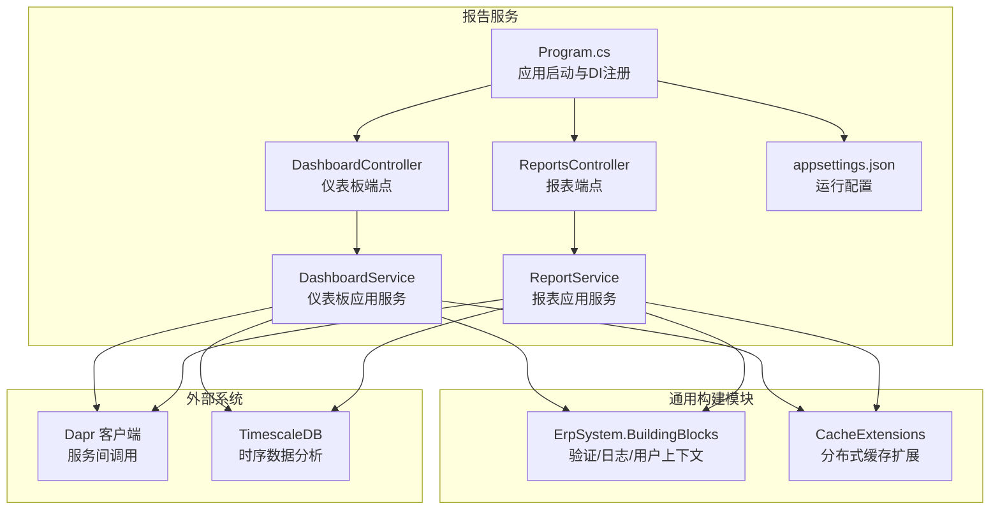
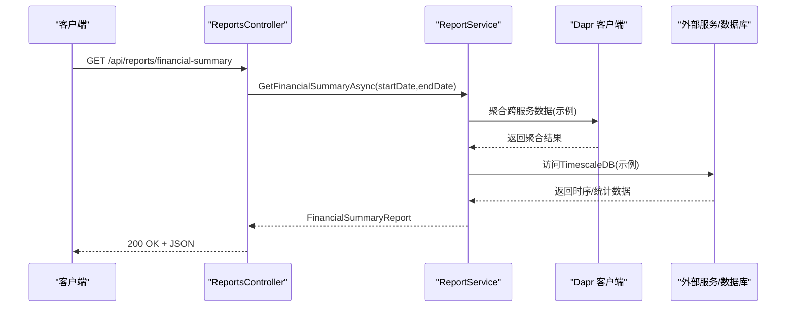
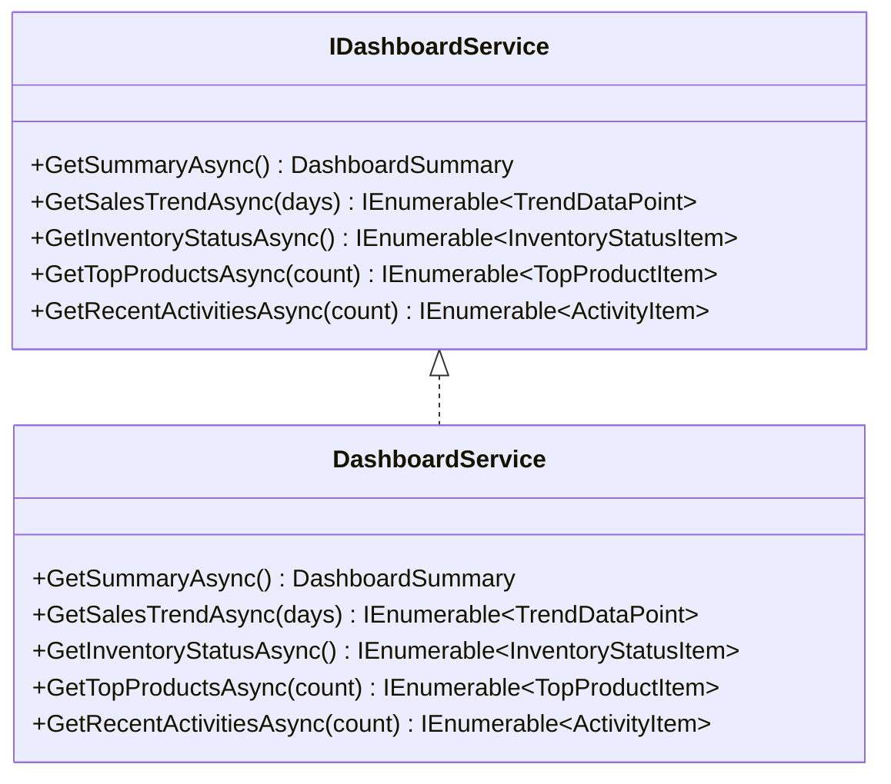
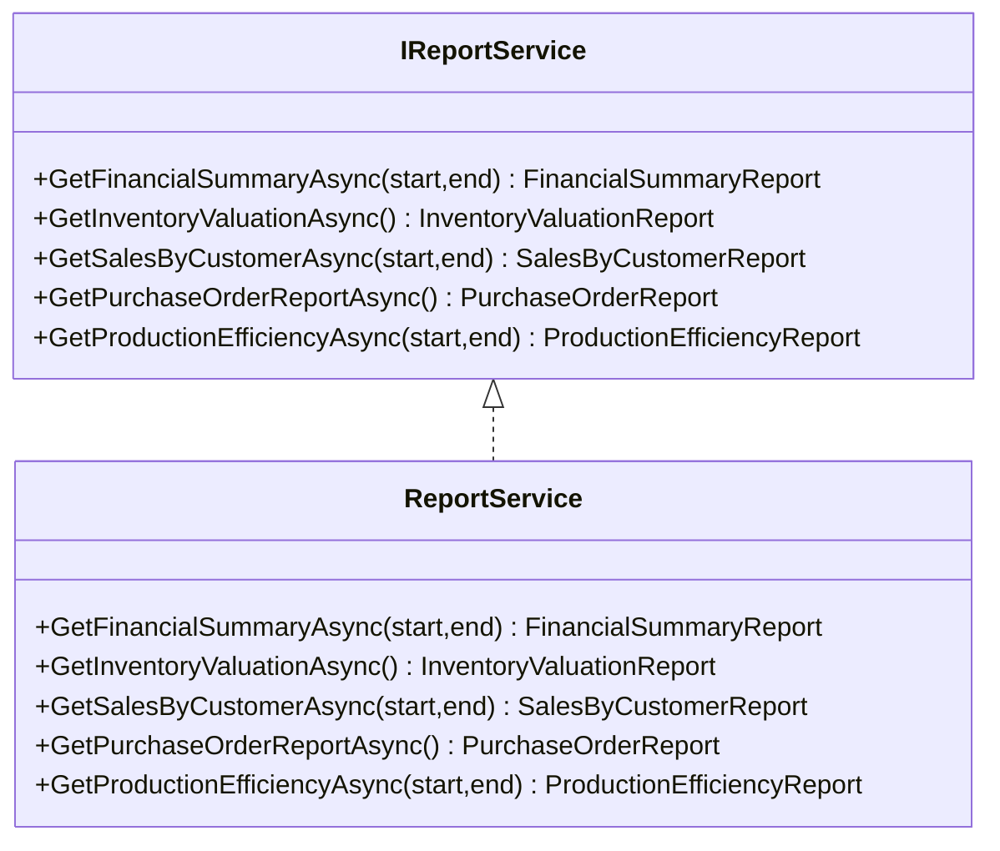
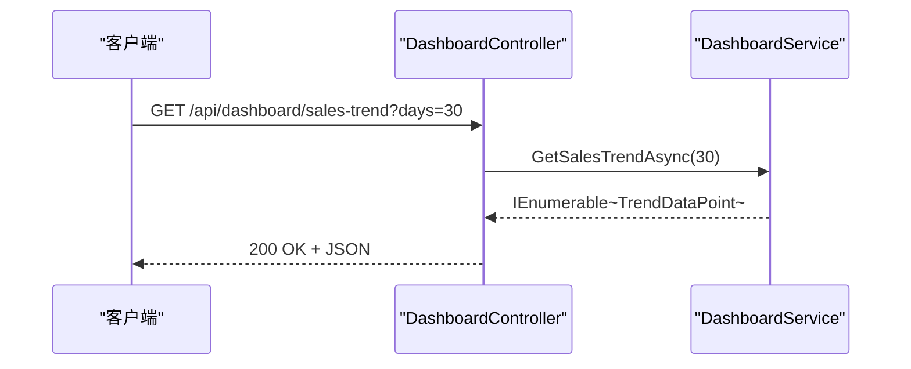
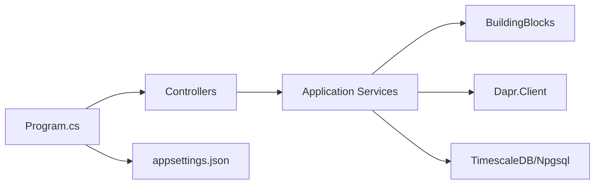

# 报告服务

<cite>
**本文引用的文件**
- [Program.cs](file://src/Services/Reporting/ErpSystem.Reporting/Program.cs)
- [appsettings.json](file://src/Services/Reporting/ErpSystem.Reporting/appsettings.json)
- [DashboardController.cs](file://src/Services/Reporting/ErpSystem.Reporting/Controllers/DashboardController.cs)
- [ReportsController.cs](file://src/Services/Reporting/ErpSystem.Reporting/Controllers/ReportsController.cs)
- [DashboardService.cs](file://src/Services/Reporting/ErpSystem.Reporting/Application/DashboardService.cs)
- [ReportService.cs](file://src/Services/Reporting/ErpSystem.Reporting/Application/ReportService.cs)
- [ErpSystem.Reporting.csproj](file://src/Services/Reporting/ErpSystem.Reporting/ErpSystem.Reporting.csproj)
- [reporting.yaml](file://deploy/k8s/services/reporting.yaml)
- [DependencyInjection.cs](file://src/BuildingBlocks/ErpSystem.BuildingBlocks/DependencyInjection.cs)
- [CacheExtensions.cs](file://src/BuildingBlocks/ErpSystem.BuildingBlocks/Caching/CacheExtensions.cs)
- [DaprQueryServices.cs](file://src/Services/Mrp/ErpSystem.Mrp/Infrastructure/DaprQueryServices.cs)
- [TimescaleDataExtractor.cs](file://src/Services/Analytics/ErpSystem.Analytics/Infrastructure/TimescaleDataExtractor.cs)
- [BiAnalyticsService.cs](file://src/Services/Analytics/ErpSystem.Analytics/Infrastructure/BiAnalyticsService.cs)
</cite>

## 目录
1. [简介](#简介)
2. [项目结构](#项目结构)
3. [核心组件](#核心组件)
4. [架构总览](#架构总览)
5. [详细组件分析](#详细组件分析)
6. [依赖关系分析](#依赖关系分析)
7. [性能考虑](#性能考虑)
8. [故障排除指南](#故障排除指南)
9. [结论](#结论)
10. [附录](#附录)

## 简介
本文件为“报告服务”微服务的详细技术文档，聚焦于BI仪表板、报表生成与数据可视化能力。当前仓库中的报告服务采用ASP.NET Core构建，提供仪表板汇总、销售趋势、库存状态、热销产品及最近活动等仪表板接口；以及财务摘要、库存估值、客户销售、采购订单、生产效率等报表接口。服务通过应用层接口与控制器解耦，并预留了与多服务聚合（如库存、采购、生产）集成的能力，同时具备健康检查、Swagger文档与Dapr集成支持。

## 项目结构
报告服务采用典型的分层架构：控制器负责HTTP端点与参数绑定，应用层封装业务逻辑与聚合调用，项目引用通用构建模块以获得验证、日志、用户上下文等横切能力。部署使用Kubernetes资源定义，启用Dapr注解以便服务间通信。

图表来源
- [Program.cs](file://src/Services/Reporting/ErpSystem.Reporting/Program.cs#L1-L35)
- [DashboardController.cs](file://src/Services/Reporting/ErpSystem.Reporting/Controllers/DashboardController.cs#L1-L79)
- [ReportsController.cs](file://src/Services/Reporting/ErpSystem.Reporting/Controllers/ReportsController.cs#L1-L136)
- [DashboardService.cs](file://src/Services/Reporting/ErpSystem.Reporting/Application/DashboardService.cs#L1-L93)
- [ReportService.cs](file://src/Services/Reporting/ErpSystem.Reporting/Application/ReportService.cs#L1-L105)
- [appsettings.json](file://src/Services/Reporting/ErpSystem.Reporting/appsettings.json#L1-L10)
- [ErpSystem.Reporting.csproj](file://src/Services/Reporting/ErpSystem.Reporting/ErpSystem.Reporting.csproj#L1-L19)
- [DependencyInjection.cs](file://src/BuildingBlocks/ErpSystem.BuildingBlocks/DependencyInjection.cs#L1-L31)
- [CacheExtensions.cs](file://src/BuildingBlocks/ErpSystem.BuildingBlocks/Caching/CacheExtensions.cs#L36-L71)
- [DaprQueryServices.cs](file://src/Services/Mrp/ErpSystem.Mrp/Infrastructure/DaprQueryServices.cs#L1-L84)
- [TimescaleDataExtractor.cs](file://src/Services/Analytics/ErpSystem.Analytics/Infrastructure/TimescaleDataExtractor.cs#L1-L146)

章节来源
- [Program.cs](file://src/Services/Reporting/ErpSystem.Reporting/Program.cs#L1-L35)
- [appsettings.json](file://src/Services/Reporting/ErpSystem.Reporting/appsettings.json#L1-L10)
- [ErpSystem.Reporting.csproj](file://src/Services/Reporting/ErpSystem.Reporting/ErpSystem.Reporting.csproj#L1-L19)

## 核心组件
- 控制器层
  - 仪表板控制器：提供汇总、销售趋势、库存状态、热销产品、最近活动等端点。
  - 报表控制器：提供财务摘要、库存估值、客户销售、采购订单、生产效率等端点。
- 应用服务层
  - 仪表板服务：当前返回演示数据，预留与多服务聚合与缓存策略。
  - 报表服务：当前返回演示数据，预留与多服务聚合与缓存策略。
- 基础设施与集成
  - Swagger与健康检查：开发环境启用Swagger UI，提供健康检查端点。
  - Dapr客户端：项目包含Dapr客户端包，可进行服务间调用。
  - 缓存扩展：提供GetOrSetAsync与键构建工具，便于实现缓存策略。
  - 外部分析服务：Analytics模块提供TimescaleDB提取器与BI分析服务，可用于真实数据驱动的报表与仪表板。

章节来源
- [DashboardController.cs](file://src/Services/Reporting/ErpSystem.Reporting/Controllers/DashboardController.cs#L1-L79)
- [ReportsController.cs](file://src/Services/Reporting/ErpSystem.Reporting/Controllers/ReportsController.cs#L1-L136)
- [DashboardService.cs](file://src/Services/Reporting/ErpSystem.Reporting/Application/DashboardService.cs#L1-L93)
- [ReportService.cs](file://src/Services/Reporting/ErpSystem.Reporting/Application/ReportService.cs#L1-L105)
- [Program.cs](file://src/Services/Reporting/ErpSystem.Reporting/Program.cs#L1-L35)
- [ErpSystem.Reporting.csproj](file://src/Services/Reporting/ErpSystem.Reporting/ErpSystem.Reporting.csproj#L1-L19)
- [CacheExtensions.cs](file://src/BuildingBlocks/ErpSystem.BuildingBlocks/Caching/CacheExtensions.cs#L36-L71)
- [TimescaleDataExtractor.cs](file://src/Services/Analytics/ErpSystem.Analytics/Infrastructure/TimescaleDataExtractor.cs#L1-L146)
- [BiAnalyticsService.cs](file://src/Services/Analytics/ErpSystem.Analytics/Infrastructure/BiAnalyticsService.cs#L1-L74)

## 架构总览
报告服务采用“控制器-应用服务-外部集成”的分层设计。控制器负责请求解析与响应封装，应用服务负责业务聚合与数据组装，外部集成通过Dapr或数据库访问实现。部署层面启用Dapr注解，便于在Kubernetes中进行服务发现与安全通信。

图表来源
- [ReportsController.cs](file://src/Services/Reporting/ErpSystem.Reporting/Controllers/ReportsController.cs#L10-L22)
- [ReportService.cs](file://src/Services/Reporting/ErpSystem.Reporting/Application/ReportService.cs#L16-L34)
- [DaprQueryServices.cs](file://src/Services/Mrp/ErpSystem.Mrp/Infrastructure/DaprQueryServices.cs#L9-L28)
- [TimescaleDataExtractor.cs](file://src/Services/Analytics/ErpSystem.Analytics/Infrastructure/TimescaleDataExtractor.cs#L15-L48)

## 详细组件分析

### 仪表板组件
- 接口与实现
  - IDashboardService定义了汇总、销售趋势、库存状态、热销产品、最近活动等方法。
  - DashboardService当前返回演示数据，日志记录请求范围，便于后续替换为真实数据源。
- 数据模型
  - 汇总DTO：包含收入、订单、库存、预警等指标。
  - 趋势数据点：日期、数值、标签。
  - 库存状态项：类别、数量、低库存、缺货、价值。
  - 热销产品项：产品标识、名称、销量、收入。
  - 最近活动项：时间戳、模块、动作、描述、用户ID。

图表来源
- [DashboardService.cs](file://src/Services/Reporting/ErpSystem.Reporting/Application/DashboardService.cs#L5-L12)
- [DashboardService.cs](file://src/Services/Reporting/ErpSystem.Reporting/Application/DashboardService.cs#L20-L93)

章节来源
- [DashboardService.cs](file://src/Services/Reporting/ErpSystem.Reporting/Application/DashboardService.cs#L1-L93)
- [DashboardController.cs](file://src/Services/Reporting/ErpSystem.Reporting/Controllers/DashboardController.cs#L61-L79)

### 报表组件
- 接口与实现
  - IReportService定义了财务摘要、库存估值、客户销售、采购订单、生产效率等方法。
  - ReportService当前返回演示数据，日志记录请求范围，便于后续替换为真实数据源。
- 数据模型
  - 财务摘要：起止日期、收入、成本、毛利、毛利率、按类别的收入分解。
  - 库存估值：截止日期、总值、总项数、明细列表。
  - 客户销售：起止日期、总销售额、客户维度明细。
  - 采购订单：总数、待处理、已完成、总金额、订单明细。
  - 生产效率：起止日期、总订单、按时完成、延迟、按时率、平均前置天数。

图表来源
- [ReportService.cs](file://src/Services/Reporting/ErpSystem.Reporting/Application/ReportService.cs#L5-L12)
- [ReportService.cs](file://src/Services/Reporting/ErpSystem.Reporting/Application/ReportService.cs#L14-L105)

章节来源
- [ReportService.cs](file://src/Services/Reporting/ErpSystem.Reporting/Application/ReportService.cs#L1-L105)
- [ReportsController.cs](file://src/Services/Reporting/ErpSystem.Reporting/Controllers/ReportsController.cs#L73-L136)

### API接口设计
- 仪表板端点
  - GET /api/dashboard/summary：获取执行摘要。
  - GET /api/dashboard/sales-trend：获取销售趋势，支持days查询参数。
  - GET /api/dashboard/inventory-status：获取库存状态分类统计。
  - GET /api/dashboard/top-products：获取热销产品，支持count查询参数。
  - GET /api/dashboard/recent-activities：获取最近活动，支持count查询参数。
- 报表端点
  - GET /api/reports/financial-summary：财务摘要，支持startDate、endDate查询参数。
  - GET /api/reports/inventory-valuation：库存估值。
  - GET /api/reports/sales-by-customer：客户销售，支持startDate、endDate查询参数。
  - GET /api/reports/purchase-orders：采购订单状态。
  - GET /api/reports/production-efficiency：生产效率，支持startDate、endDate查询参数。

图表来源
- [DashboardController.cs](file://src/Services/Reporting/ErpSystem.Reporting/Controllers/DashboardController.cs#L23-L28)
- [DashboardService.cs](file://src/Services/Reporting/ErpSystem.Reporting/Application/DashboardService.cs#L39-L53)

章节来源
- [DashboardController.cs](file://src/Services/Reporting/ErpSystem.Reporting/Controllers/DashboardController.cs#L1-L79)
- [ReportsController.cs](file://src/Services/Reporting/ErpSystem.Reporting/Controllers/ReportsController.cs#L1-L136)

### 报告数据模型与可视化
- 可视化组件建议
  - 销售趋势：折线图，X轴为日期，Y轴为数值。
  - 库存状态：堆叠柱状图或饼图，展示各分类占比。
  - 热销产品：条形图，按销量或收入排序。
  - 财务摘要：瀑布图或组合图，展示收入、成本、利润与占比。
  - 客户销售：环形图或表格，展示客户贡献度。
  - 采购订单：状态分布饼图与列表。
  - 生产效率：按时率与平均前置天数的双指标卡。
- 数据模型复杂度
  - 时间序列数据：趋势点集合，按日期有序，适合折线图。
  - 分类统计：库存状态项、收入分解、客户销售，适合柱状图/饼图。
  - 综合指标：仪表板汇总，适合卡片式布局与KPI展示。

章节来源
- [DashboardController.cs](file://src/Services/Reporting/ErpSystem.Reporting/Controllers/DashboardController.cs#L61-L79)
- [ReportsController.cs](file://src/Services/Reporting/ErpSystem.Reporting/Controllers/ReportsController.cs#L73-L136)

### 报告聚合根设计
- 当前实现
  - DashboardService与ReportService作为应用服务，负责聚合来自不同模块的数据。
  - 通过Dapr客户端可调用库存、采购、生产等服务，实现跨域聚合。
- 设计要点
  - 使用接口隔离与依赖注入，便于替换真实数据源。
  - 日志记录请求参数与处理过程，便于监控与排障。
  - 预留缓存策略，提升热点查询性能。

章节来源
- [DashboardService.cs](file://src/Services/Reporting/ErpSystem.Reporting/Application/DashboardService.cs#L20-L37)
- [ReportService.cs](file://src/Services/Reporting/ErpSystem.Reporting/Application/ReportService.cs#L14-L34)
- [DaprQueryServices.cs](file://src/Services/Mrp/ErpSystem.Mrp/Infrastructure/DaprQueryServices.cs#L9-L28)

### 数据源连接与渲染引擎
- 数据源
  - TimescaleDB：用于时序数据分析与高级统计，支持按天聚合、百分位数、滚动统计等。
  - 外部服务：通过Dapr服务调用聚合库存、采购、生产等实时数据。
- 渲染引擎
  - 前端可使用通用图表库（如ECharts、Chart.js）渲染仪表板与报表。
  - 后端可输出JSON数据模型，由前端负责可视化渲染。

章节来源
- [TimescaleDataExtractor.cs](file://src/Services/Analytics/ErpSystem.Analytics/Infrastructure/TimescaleDataExtractor.cs#L15-L48)
- [BiAnalyticsService.cs](file://src/Services/Analytics/ErpSystem.Analytics/Infrastructure/BiAnalyticsService.cs#L16-L66)
- [DaprQueryServices.cs](file://src/Services/Mrp/ErpSystem.Mrp/Infrastructure/DaprQueryServices.cs#L13-L25)

### 查询优化、缓存策略与分页处理
- 查询优化
  - 使用索引与连续聚合（TimescaleDB）减少扫描范围。
  - 对时间窗口进行限制，避免全量扫描。
- 缓存策略
  - 使用GetOrSetAsync实现“先读缓存，后计算写入”，设置绝对过期时间。
  - 使用CacheKeyBuilder统一键命名规则，避免冲突。
- 分页处理
  - 可参考其他模块的Skip-Take分页模式，结合查询参数控制页码与大小。
  - 对高频报表可增加缓存，降低数据库压力。

章节来源
- [CacheExtensions.cs](file://src/BuildingBlocks/ErpSystem.BuildingBlocks/Caching/CacheExtensions.cs#L38-L54)
- [CacheExtensions.cs](file://src/BuildingBlocks/ErpSystem.BuildingBlocks/Caching/CacheExtensions.cs#L60-L71)
- [ProductionQueries.cs](file://src/Services/Production/ErpSystem.Production/Application/ProductionQueries.cs#L29-L42)

### 报表模板管理与导出机制
- 模板管理
  - 建议引入模板引擎（如Razor或Markdown），将报表结构与数据分离。
  - 模板版本控制与参数化，支持动态渲染。
- 导出机制
  - 支持导出Excel/PDF/CSV，结合模板与数据模型生成静态文件。
  - 异步导出任务队列，避免阻塞请求线程。

（本节为概念性建议，不直接对应具体代码文件）

## 依赖关系分析
- 内部依赖
  - 控制器依赖应用服务接口，应用服务依赖通用构建模块（日志、用户上下文等）。
- 外部依赖
  - Dapr客户端包已引入，可用于服务间调用。
  - TimescaleDB访问通过Npgsql命令执行SQL查询。
- 部署依赖
  - Kubernetes部署启用了Dapr注解，容器暴露80端口并配置健康检查探针。

图表来源
- [Program.cs](file://src/Services/Reporting/ErpSystem.Reporting/Program.cs#L1-L35)
- [ErpSystem.Reporting.csproj](file://src/Services/Reporting/ErpSystem.Reporting/ErpSystem.Reporting.csproj#L10-L11)
- [TimescaleDataExtractor.cs](file://src/Services/Analytics/ErpSystem.Analytics/Infrastructure/TimescaleDataExtractor.cs#L1-L10)

章节来源
- [ErpSystem.Reporting.csproj](file://src/Services/Reporting/ErpSystem.Reporting/ErpSystem.Reporting.csproj#L1-L19)
- [reporting.yaml](file://deploy/k8s/services/reporting.yaml#L1-L64)

## 性能考虑
- 读路径优化
  - 对热点报表增加缓存，设置合理过期时间。
  - 使用连续聚合与时间分区，减少查询扫描范围。
- 写路径优化
  - 批量写入与异步处理，避免阻塞主请求。
- 并发与限流
  - 在网关或服务入口处实施限流与熔断，保护下游依赖。
- 监控与可观测性
  - 结合健康检查与日志，建立告警与追踪链路。

（本节提供通用指导，不直接分析具体文件）

## 故障排除指南
- 健康检查
  - 使用 /health 与 /health/ready 端点确认服务就绪与存活。
- 日志定位
  - 查看应用日志中的请求参数与处理步骤，定位异常。
- 依赖问题
  - 确认Dapr注解与服务ID配置正确，确保服务间调用可达。
  - 检查TimescaleDB连接字符串与查询权限。

章节来源
- [Program.cs](file://src/Services/Reporting/ErpSystem.Reporting/Program.cs#L29-L32)
- [reporting.yaml](file://deploy/k8s/services/reporting.yaml#L39-L50)

## 结论
报告服务当前以演示数据为主，提供了完整的控制器与应用服务分层结构，并预留了与多服务聚合、缓存与外部数据库集成的能力。建议在后续迭代中：
- 替换演示数据为真实数据源，通过Dapr聚合库存、采购、生产等服务。
- 引入缓存与查询优化策略，提升报表与仪表板性能。
- 增加报表模板与导出能力，完善用户体验。
- 强化监控与可观测性，保障生产稳定性。

## 附录
- 部署清单
  - Kubernetes Deployment与Service已启用Dapr注解，配置健康检查探针。
- 运行配置
  - 默认日志级别与允许主机配置，便于本地开发调试。

章节来源
- [reporting.yaml](file://deploy/k8s/services/reporting.yaml#L1-L64)
- [appsettings.json](file://src/Services/Reporting/ErpSystem.Reporting/appsettings.json#L1-L10)