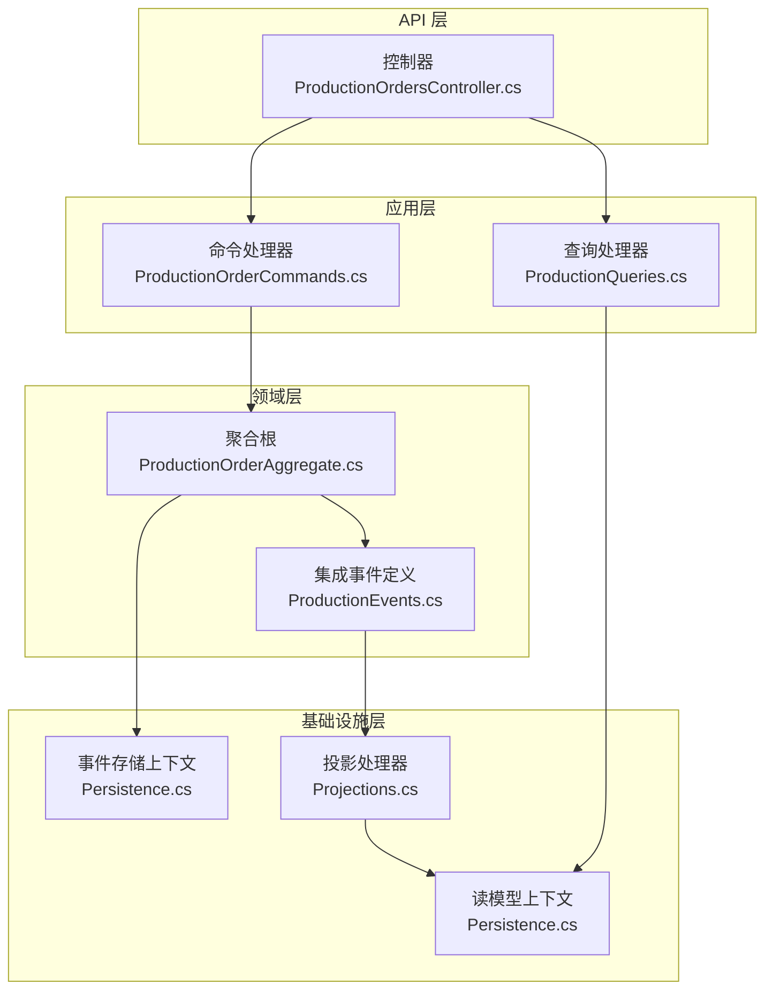
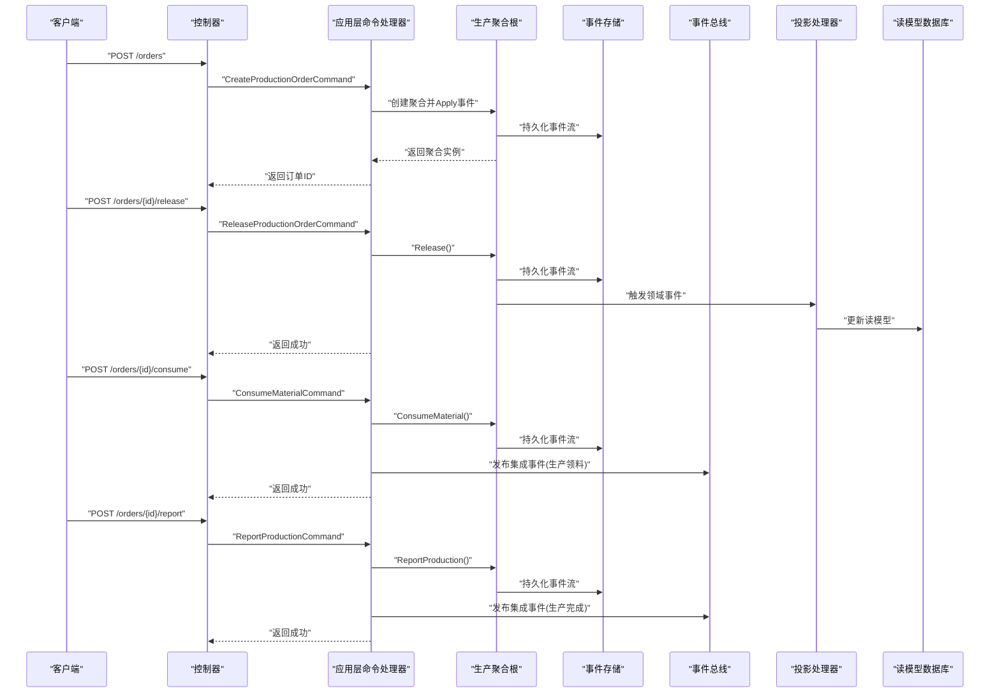
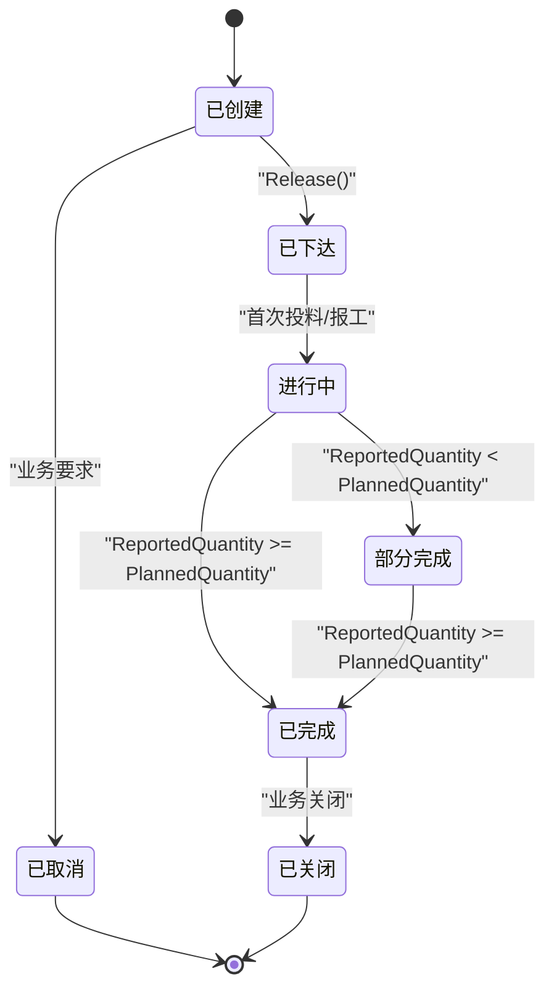
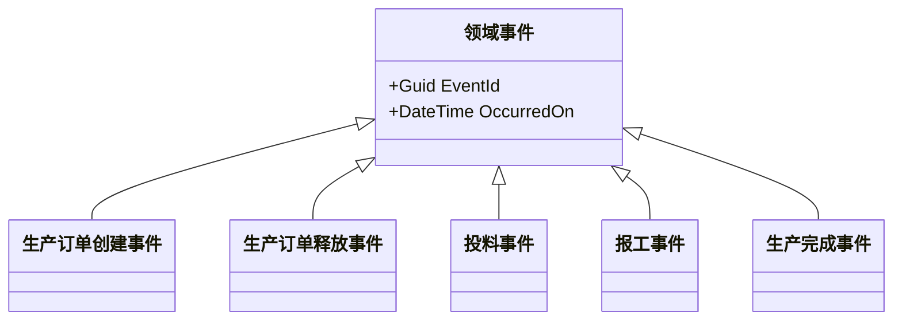
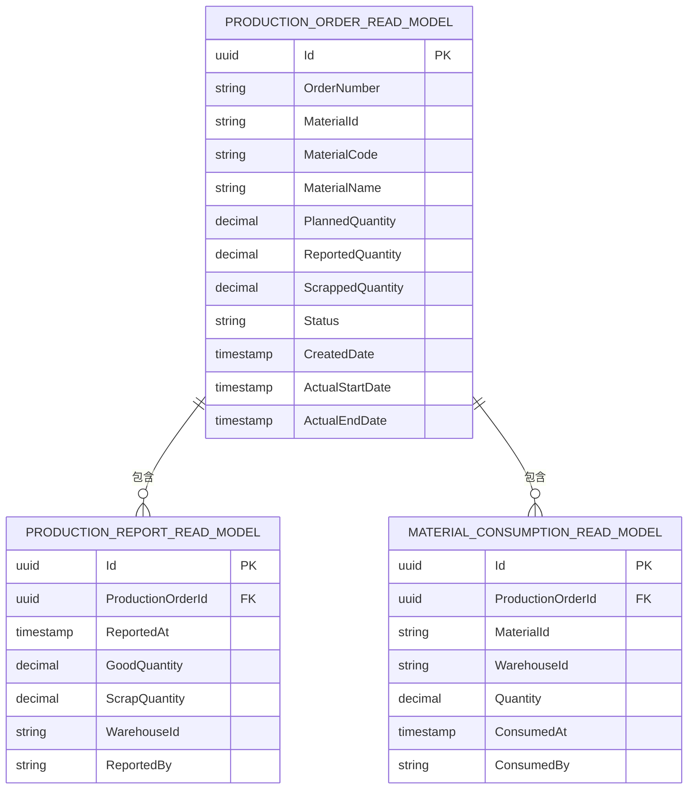
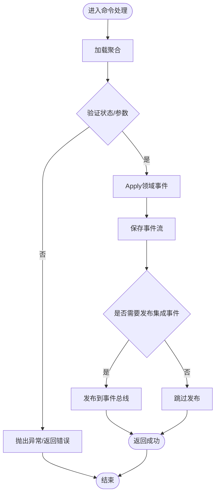
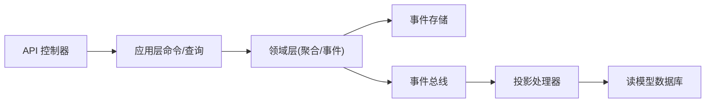

# 生产管理服务

<cite>
**本文引用的文件**
- [docs/PRD-07-Production-Service.md](file://docs/PRD-07-Production-Service.md)
- [Program.cs](file://src/Services/Production/ErpSystem.Production/Program.cs)
- [appsettings.json](file://src/Services/Production/ErpSystem.Production/appsettings.json)
- [ProductionOrdersController.cs](file://src/Services/Production/ErpSystem.Production/API/ProductionOrdersController.cs)
- [ProductionOrderCommands.cs](file://src/Services/Production/ErpSystem.Production/Application/ProductionOrderCommands.cs)
- [ProductionQueries.cs](file://src/Services/Production/ErpSystem.Production/Application/ProductionQueries.cs)
- [ProductionOrderAggregate.cs](file://src/Services/Production/ErpSystem.Production/Domain/ProductionOrderAggregate.cs)
- [ProductionEvents.cs](file://src/Services/Production/ErpSystem.Production/Domain/ProductionEvents.cs)
- [Persistence.cs](file://src/Services/Production/ErpSystem.Production/Infrastructure/Persistence.cs)
- [Projections.cs](file://src/Services/Production/ErpSystem.Production/Infrastructure/Projections.cs)
- [ProductionToInventoryTests.cs](file://src/Tests/ErpSystem.IntegrationTests/ProductionToInventoryTests.cs)
</cite>

## 目录
1. [简介](#简介)
2. [项目结构](#项目结构)
3. [核心组件](#核心组件)
4. [架构总览](#架构总览)
5. [详细组件分析](#详细组件分析)
6. [依赖关系分析](#依赖关系分析)
7. [性能考虑](#性能考虑)
8. [故障排查指南](#故障排查指南)
9. [结论](#结论)
10. [附录](#附录)

## 简介
本文件为生产管理服务的微服务文档，围绕生产计划、工单管理、BOM管理（预留）、生产物料与在制品（WIP）等生产功能展开，重点阐述：
- 生产聚合根设计与状态机
- 生产事件处理与事件溯源
- 生产调度与状态流转（计划、下达、投料、报工、完成、关闭/取消）
- 工序管理与质量控制（当前版本聚焦报工与入库，工序/质量在后续迭代规划）
- 与库存、主数据、销售、财务的集成
- 生产API接口规范、调度策略与性能监控方案

## 项目结构
生产服务采用分层架构：API 控制器层、应用层（命令/查询）、领域层（聚合与事件）、基础设施层（事件存储、读模型投影、EF Core）。

图表来源
- [ProductionOrdersController.cs](file://src/Services/Production/ErpSystem.Production/API/ProductionOrdersController.cs#L1-L46)
- [ProductionOrderCommands.cs](file://src/Services/Production/ErpSystem.Production/Application/ProductionOrderCommands.cs#L1-L99)
- [ProductionQueries.cs](file://src/Services/Production/ErpSystem.Production/Application/ProductionQueries.cs#L1-L44)
- [ProductionOrderAggregate.cs](file://src/Services/Production/ErpSystem.Production/Domain/ProductionOrderAggregate.cs#L1-L142)
- [ProductionEvents.cs](file://src/Services/Production/ErpSystem.Production/Domain/ProductionEvents.cs#L1-L24)
- [Persistence.cs](file://src/Services/Production/ErpSystem.Production/Infrastructure/Persistence.cs#L1-L71)
- [Projections.cs](file://src/Services/Production/ErpSystem.Production/Infrastructure/Projections.cs#L1-L107)

章节来源
- [Program.cs](file://src/Services/Production/ErpSystem.Production/Program.cs#L1-L72)
- [appsettings.json](file://src/Services/Production/ErpSystem.Production/appsettings.json#L1-L12)

## 核心组件
- 生产聚合根：生产订单聚合，包含状态机与事件应用逻辑，支持创建、释放、投料、报工、完成等操作。
- 事件与集成事件：领域事件用于事件溯源，集成事件用于跨服务解耦（库存出入库）。
- 读模型与投影：基于事件流构建只读视图，支撑查询与WIP视图。
- 应用层：命令/查询处理，协调聚合与事件发布。
- API 层：REST 接口暴露生产订单生命周期管理与相关查询。

章节来源
- [ProductionOrderAggregate.cs](file://src/Services/Production/ErpSystem.Production/Domain/ProductionOrderAggregate.cs#L63-L142)
- [ProductionEvents.cs](file://src/Services/Production/ErpSystem.Production/Domain/ProductionEvents.cs#L5-L24)
- [Persistence.cs](file://src/Services/Production/ErpSystem.Production/Infrastructure/Persistence.cs#L34-L71)
- [Projections.cs](file://src/Services/Production/ErpSystem.Production/Infrastructure/Projections.cs#L1-L107)
- [ProductionOrderCommands.cs](file://src/Services/Production/ErpSystem.Production/Application/ProductionOrderCommands.cs#L33-L99)
- [ProductionQueries.cs](file://src/Services/Production/ErpSystem.Production/Application/ProductionQueries.cs#L13-L44)
- [ProductionOrdersController.cs](file://src/Services/Production/ErpSystem.Production/API/ProductionOrdersController.cs#L1-L46)

## 架构总览
生产服务采用事件驱动架构：
- 领域事件驱动事件存储与读模型投影
- 应用层在处理命令时发布集成事件，驱动库存服务完成出入库
- 读模型数据库用于高效查询与WIP视图

图表来源
- [ProductionOrdersController.cs](file://src/Services/Production/ErpSystem.Production/API/ProductionOrdersController.cs#L11-L39)
- [ProductionOrderCommands.cs](file://src/Services/Production/ErpSystem.Production/Application/ProductionOrderCommands.cs#L39-L97)
- [ProductionOrderAggregate.cs](file://src/Services/Production/ErpSystem.Production/Domain/ProductionOrderAggregate.cs#L85-L111)
- [Projections.cs](file://src/Services/Production/ErpSystem.Production/Infrastructure/Projections.cs#L13-L105)
- [ProductionEvents.cs](file://src/Services/Production/ErpSystem.Production/Domain/ProductionEvents.cs#L7-L22)

## 详细组件分析

### 生产聚合根与状态机
- 聚合根：生产订单，维护订单编号、物料信息、计划数量、累计报工数量、报废数量、状态等。
- 状态枚举：Created → Released → InProgress → PartiallyCompleted → Completed → Closed/Cancelled。
- 事件应用：根据领域事件更新聚合内状态与派生属性（如首次投料/报工触发 InProgress）。

图表来源
- [ProductionOrderAggregate.cs](file://src/Services/Production/ErpSystem.Production/Domain/ProductionOrderAggregate.cs#L5-L14)
- [ProductionOrderAggregate.cs](file://src/Services/Production/ErpSystem.Production/Domain/ProductionOrderAggregate.cs#L113-L140)

章节来源
- [ProductionOrderAggregate.cs](file://src/Services/Production/ErpSystem.Production/Domain/ProductionOrderAggregate.cs#L63-L142)

### 事件与事件溯源
- 领域事件：生产订单创建、释放、投料、报工、完成等事件，均实现统一的领域事件接口。
- 事件存储：使用事件流表存储聚合事件，支持重放与一致性读取。
- 投影：投影处理器监听领域事件，写入读模型数据库，供查询与WIP视图使用。

图表来源
- [ProductionOrderAggregate.cs](file://src/Services/Production/ErpSystem.Production/Domain/ProductionOrderAggregate.cs#L17-L55)
- [ProductionEvents.cs](file://src/Services/Production/ErpSystem.Production/Domain/ProductionEvents.cs#L5-L24)

章节来源
- [ProductionOrderAggregate.cs](file://src/Services/Production/ErpSystem.Production/Domain/ProductionOrderAggregate.cs#L16-L55)
- [Persistence.cs](file://src/Services/Production/ErpSystem.Production/Infrastructure/Persistence.cs#L6-L18)
- [Projections.cs](file://src/Services/Production/ErpSystem.Production/Infrastructure/Projections.cs#L1-L107)

### 读模型与WIP视图
- 读模型：包含生产订单、报工记录、投料记录三类实体，用于快速查询与报表。
- WIP 视图：筛选处于“已下达/进行中/部分完成”状态的订单，结合报工与投料统计在制品。

图表来源
- [Persistence.cs](file://src/Services/Production/ErpSystem.Production/Infrastructure/Persistence.cs#L34-L71)
- [Projections.cs](file://src/Services/Production/ErpSystem.Production/Infrastructure/Projections.cs#L40-L94)

章节来源
- [ProductionQueries.cs](file://src/Services/Production/ErpSystem.Production/Application/ProductionQueries.cs#L35-L42)
- [Persistence.cs](file://src/Services/Production/ErpSystem.Production/Infrastructure/Persistence.cs#L20-L32)

### 应用层命令与查询
- 命令处理：创建订单、释放订单、投料、报工；处理完成后保存聚合并发布集成事件。
- 查询处理：按条件检索订单列表、按ID获取详情、WIP 查询。

图表来源
- [ProductionOrderCommands.cs](file://src/Services/Production/ErpSystem.Production/Application/ProductionOrderCommands.cs#L57-L97)

章节来源
- [ProductionOrderCommands.cs](file://src/Services/Production/ErpSystem.Production/Application/ProductionOrderCommands.cs#L33-L99)
- [ProductionQueries.cs](file://src/Services/Production/ErpSystem.Production/Application/ProductionQueries.cs#L13-L44)

### API 接口规范
- 创建生产订单：POST /api/v1/production/orders
- 获取订单详情：GET /api/v1/production/orders/{id}
- 查询订单列表：GET /api/v1/production/orders?materialId=&status=&page=
- 下达订单：POST /api/v1/production/orders/{id}/release
- 投料：POST /api/v1/production/orders/{id}/consume
- 报工：POST /api/v1/production/orders/{id}/report
- WIP 查询：GET /api/v1/production/orders/wip?materialId=

章节来源
- [ProductionOrdersController.cs](file://src/Services/Production/ErpSystem.Production/API/ProductionOrdersController.cs#L11-L44)

### 与库存、主数据、销售、财务的集成
- 与库存：发布“生产领料”和“生产完成”集成事件，驱动库存出库与入库。
- 与主数据：订单中的物料信息来源于主数据服务。
- 与销售：销售订单可关联生产需求，生产完成影响可发货能力（PRD 规划）。
- 与财务：提供订单级投入产出数据，支持成本归集与结转（PRD 规划）。

章节来源
- [ProductionOrderCommands.cs](file://src/Services/Production/ErpSystem.Production/Application/ProductionOrderCommands.cs#L65-L94)
- [docs/PRD-07-Production-Service.md](file://docs/PRD-07-Production-Service.md#L374-L408)

## 依赖关系分析
- 组件耦合：API 依赖应用层；应用层依赖领域层与事件总线；领域层依赖事件存储；投影依赖读模型数据库。
- 外部依赖：PostgreSQL（事件存储与读模型）、Dapr 事件总线、Entity Framework Core。
- 循环依赖：未见循环依赖迹象，职责清晰分离。

图表来源
- [Program.cs](file://src/Services/Production/ErpSystem.Production/Program.cs#L15-L46)
- [ProductionOrderCommands.cs](file://src/Services/Production/ErpSystem.Production/Application/ProductionOrderCommands.cs#L33-L37)
- [Projections.cs](file://src/Services/Production/ErpSystem.Production/Infrastructure/Projections.cs#L6-L11)

章节来源
- [Program.cs](file://src/Services/Production/ErpSystem.Production/Program.cs#L15-L46)
- [Persistence.cs](file://src/Services/Production/ErpSystem.Production/Infrastructure/Persistence.cs#L6-L32)

## 性能考虑
- 查询性能：订单列表分页查询，建议在读模型表上建立索引（如物料ID、状态、创建时间）。
- 事件存储：事件流按聚合ID与版本存储，避免大事务；批量写入与异步投影提升吞吐。
- 投递与集成：集成事件发布采用异步方式，避免阻塞命令处理。
- 监控指标：建议采集请求延迟、事件处理速率、读模型同步延迟等指标。

## 故障排查指南
- 订单状态异常：检查事件流是否完整、投影是否成功更新读模型。
- 投递失败：检查事件总线连接与订阅配置，确认集成事件已正确发布。
- 查询无数据：确认读模型是否已同步，必要时重建投影或检查数据库连接。
- 集成测试参考：可参考生产到库存的集成测试用例，定位上下游问题。

章节来源
- [ProductionToInventoryTests.cs](file://src/Tests/ErpSystem.IntegrationTests/ProductionToInventoryTests.cs)

## 结论
生产管理服务以事件驱动为核心，通过生产聚合根与事件溯源实现状态一致与可审计，借助读模型与投影提供高效查询能力。当前版本聚焦生产订单生命周期与出入库集成，后续可扩展工序管理、质量控制、BOM与APS排产等功能，持续完善与销售、财务的联动。

## 附录
- 状态机与业务规则参考：PRD 文档中对状态流转与业务规则有详细描述，便于对照实现。
- API 与集成事件：遵循 REST 与事件驱动的设计原则，便于横向扩展与演进。

章节来源
- [docs/PRD-07-Production-Service.md](file://docs/PRD-07-Production-Service.md#L172-L371)