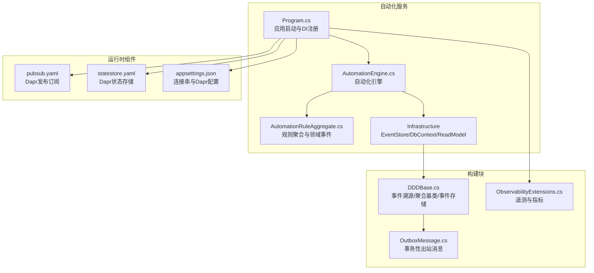
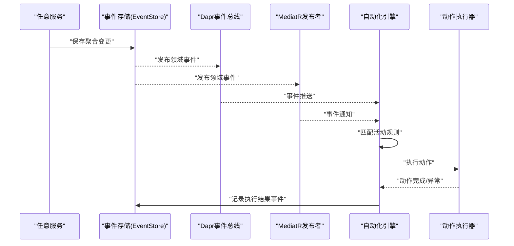
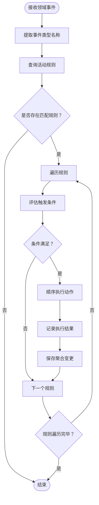
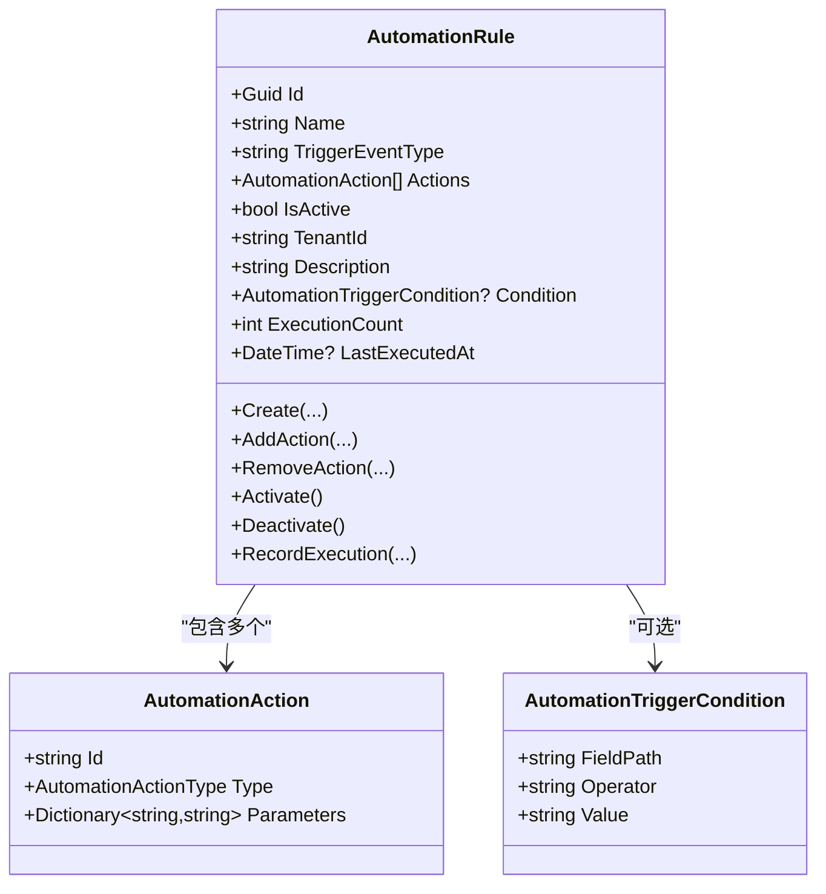
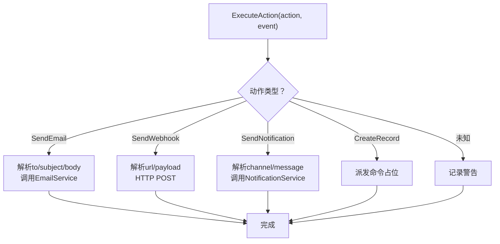
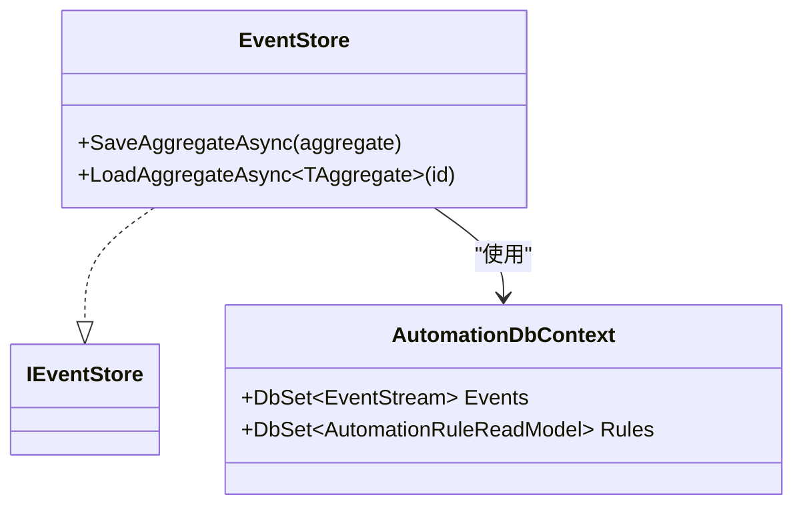
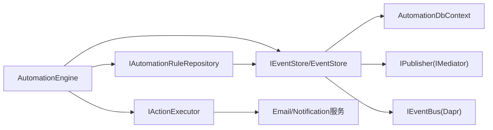

# 自动化引擎服务

<cite>
**本文档引用的文件**
- [Program.cs](file://src/Services/Automation/ErpSystem.Automation/Program.cs)
- [AutomationEngine.cs](file://src/Services/Automation/ErpSystem.Automation/Application/AutomationEngine.cs)
- [AutomationRuleAggregate.cs](file://src/Services/Automation/ErpSystem.Automation/Domain/AutomationRuleAggregate.cs)
- [DDDBase.cs](file://src/BuildingBlocks/ErpSystem.BuildingBlocks/Domain/DDDBase.cs)
- [OutboxMessage.cs](file://src/BuildingBlocks/ErpSystem.BuildingBlocks/Outbox/OutboxMessage.cs)
- [ObservabilityExtensions.cs](file://src/BuildingBlocks/ErpSystem.BuildingBlocks/Observability/ObservabilityExtensions.cs)
- [pubsub.yaml](file://components/pubsub.yaml)
- [statestore.yaml](file://components/statestore.yaml)
- [appsettings.json](file://src/Services/Automation/ErpSystem.Automation/appsettings.json)
- [Automation.tsx](file://src/Web/ErpSystem.Web/src/pages/Automation.tsx)
- [Program.cs（测试）](file://src/Services/Automation/AutomationTest/Program.cs)
</cite>

## 目录
1. [简介](#简介)
2. [项目结构](#项目结构)
3. [核心组件](#核心组件)
4. [架构总览](#架构总览)
5. [详细组件分析](#详细组件分析)
6. [依赖关系分析](#依赖关系分析)
7. [性能考虑](#性能考虑)
8. [故障排查指南](#故障排查指南)
9. [结论](#结论)
10. [附录](#附录)

## 简介
本文件为自动化引擎服务的微服务文档，聚焦于工作流引擎、业务规则与任务调度的实现，阐述自动化聚合根设计、规则引擎与事件驱动机制。内容涵盖自动化流程的配置管理、条件判断与分支处理，记录自动化数据的事件溯源、执行日志与性能监控，并提供自动化API接口设计、规则语法与调试工具建议。

## 项目结构
自动化引擎服务位于 src/Services/Automation/ErpSystem.Automation，采用分层架构：应用层包含自动化引擎与动作执行器；领域层包含自动化规则聚合与领域事件；基础设施层包含事件存储、读模型与数据库上下文；构建块提供通用的事件溯源、出站消息、可观测性等能力。

**图表来源**
- [Program.cs](file://src/Services/Automation/ErpSystem.Automation/Program.cs#L11-L69)
- [AutomationEngine.cs](file://src/Services/Automation/ErpSystem.Automation/Application/AutomationEngine.cs#L10-L54)
- [AutomationRuleAggregate.cs](file://src/Services/Automation/ErpSystem.Automation/Domain/AutomationRuleAggregate.cs#L8-L111)
- [DDDBase.cs](file://src/BuildingBlocks/ErpSystem.BuildingBlocks/Domain/DDDBase.cs#L59-L120)
- [OutboxMessage.cs](file://src/BuildingBlocks/ErpSystem.BuildingBlocks/Outbox/OutboxMessage.cs#L10-L55)
- [ObservabilityExtensions.cs](file://src/BuildingBlocks/ErpSystem.BuildingBlocks/Observability/ObservabilityExtensions.cs#L12-L42)
- [pubsub.yaml](file://components/pubsub.yaml#L1-L13)
- [statestore.yaml](file://components/statestore.yaml#L1-L13)
- [appsettings.json](file://src/Services/Automation/ErpSystem.Automation/appsettings.json#L9-L16)

**章节来源**
- [Program.cs](file://src/Services/Automation/ErpSystem.Automation/Program.cs#L11-L69)
- [appsettings.json](file://src/Services/Automation/ErpSystem.Automation/appsettings.json#L9-L16)

## 核心组件
- 自动化引擎：监听领域事件，匹配活动规则，按顺序执行动作，记录执行结果。
- 规则聚合：定义触发事件类型、可选条件、动作列表、激活状态与执行统计。
- 动作执行器：支持发送邮件、Webhook、通知与创建记录等动作类型。
- 事件存储：基于事件溯源持久化聚合变更，发布领域事件到MediatR与Dapr事件总线。
- 出站消息：保证与领域变更同事务的消息投递，异步分发。
- 可观测性：集成OpenTelemetry进行日志、指标与追踪采集。

**章节来源**
- [AutomationEngine.cs](file://src/Services/Automation/ErpSystem.Automation/Application/AutomationEngine.cs#L10-L128)
- [AutomationRuleAggregate.cs](file://src/Services/Automation/ErpSystem.Automation/Domain/AutomationRuleAggregate.cs#L8-L137)
- [DDDBase.cs](file://src/BuildingBlocks/ErpSystem.BuildingBlocks/Domain/DDDBase.cs#L59-L120)
- [OutboxMessage.cs](file://src/BuildingBlocks/ErpSystem.BuildingBlocks/Outbox/OutboxMessage.cs#L10-L55)
- [ObservabilityExtensions.cs](file://src/BuildingBlocks/ErpSystem.BuildingBlocks/Observability/ObservabilityExtensions.cs#L12-L42)

## 架构总览
自动化引擎通过事件驱动方式工作：当任意服务产生领域事件时，事件被事件存储捕获并发布；自动化引擎订阅这些事件，根据规则聚合中的触发类型与条件筛选匹配规则，依次执行动作，并将执行结果作为新的领域事件写回事件存储。

**图表来源**
- [DDDBase.cs](file://src/BuildingBlocks/ErpSystem.BuildingBlocks/Domain/DDDBase.cs#L88-L96)
- [AutomationEngine.cs](file://src/Services/Automation/ErpSystem.Automation/Application/AutomationEngine.cs#L19-L54)
- [AutomationRuleAggregate.cs](file://src/Services/Automation/ErpSystem.Automation/Domain/AutomationRuleAggregate.cs#L72-L78)

## 详细组件分析

### 自动化引擎（AutomationEngine）
- 职责：接收领域事件，查找匹配的活动规则，评估条件，顺序执行动作，记录执行结果。
- 条件评估：基于事件属性路径与比较运算符（等于、包含、大于、小于）进行简单条件判断。
- 错误处理：单个动作失败不影响其他动作执行；规则执行失败会记录错误并持久化。

**图表来源**
- [AutomationEngine.cs](file://src/Services/Automation/ErpSystem.Automation/Application/AutomationEngine.cs#L19-L92)
- [AutomationEngine.cs](file://src/Services/Automation/ErpSystem.Automation/Application/AutomationEngine.cs#L94-L119)

**章节来源**
- [AutomationEngine.cs](file://src/Services/Automation/ErpSystem.Automation/Application/AutomationEngine.cs#L10-L128)

### 规则聚合（AutomationRule）
- 聚合根：包含规则元信息、触发事件类型、条件、动作列表、激活状态与执行统计。
- 领域事件：规则创建、动作增删、启用/禁用、执行结果记录。
- 事件溯源：通过Apply方法应用事件，维护版本与历史。

**图表来源**
- [AutomationRuleAggregate.cs](file://src/Services/Automation/ErpSystem.Automation/Domain/AutomationRuleAggregate.cs#L8-L137)

**章节来源**
- [AutomationRuleAggregate.cs](file://src/Services/Automation/ErpSystem.Automation/Domain/AutomationRuleAggregate.cs#L8-L137)

### 动作执行器（ActionExecutor）
- 支持动作类型：发送邮件、发送Webhook、发送通知、创建记录。
- 参数解析：从动作参数字典中读取必要字段。
- 异常处理：动作失败记录日志并标记整体执行失败，但不影响后续动作。

**图表来源**
- [AutomationEngine.cs](file://src/Services/Automation/ErpSystem.Automation/Application/AutomationEngine.cs#L137-L203)

**章节来源**
- [AutomationEngine.cs](file://src/Services/Automation/ErpSystem.Automation/Application/AutomationEngine.cs#L125-L220)

### 事件存储与读模型
- 事件存储：保存事件流，发布领域事件给MediatR与Dapr事件总线，清空已应用变更。
- 读模型：规则读模型用于快速检索活动规则，当前仓储实现预留扩展点。

**图表来源**
- [DDDBase.cs](file://src/BuildingBlocks/ErpSystem.BuildingBlocks/Domain/DDDBase.cs#L59-L120)
- [Program.cs](file://src/Services/Automation/ErpSystem.Automation/Program.cs#L71-L88)

**章节来源**
- [DDDBase.cs](file://src/BuildingBlocks/ErpSystem.BuildingBlocks/Domain/DDDBase.cs#L53-L120)
- [Program.cs](file://src/Services/Automation/ErpSystem.Automation/Program.cs#L71-L108)

### 事务性出站消息（Outbox）
- 作用：与领域变更同事务持久化消息，避免分布式一致性问题。
- 字段：消息类型、载荷、创建时间、处理时间、重试次数、错误信息。
- 使用：在聚合保存后由出站处理器异步投递。

**章节来源**
- [OutboxMessage.cs](file://src/BuildingBlocks/ErpSystem.BuildingBlocks/Outbox/OutboxMessage.cs#L10-L55)

### 可观测性（OpenTelemetry）
- 日志：结构化日志，包含格式化消息与范围。
- 指标：ASP.NET Core、HTTP客户端、运行时指标。
- 追踪：ASP.NET Core、HTTP客户端、服务名资源标签，OTLP导出。

**章节来源**
- [ObservabilityExtensions.cs](file://src/BuildingBlocks/ErpSystem.BuildingBlocks/Observability/ObservabilityExtensions.cs#L12-L42)

## 依赖关系分析
- 应用层依赖领域层与基础设施层；领域层依赖构建块中的事件溯源与领域事件抽象。
- 自动化引擎依赖事件存储、规则仓储与动作执行器。
- 事件存储依赖EF Core、IPublisher（MediatR）、IEventBus（Dapr）。
- 运行时依赖Dapr组件：Redis发布订阅与状态存储。

**图表来源**
- [Program.cs](file://src/Services/Automation/ErpSystem.Automation/Program.cs#L22-L48)
- [AutomationEngine.cs](file://src/Services/Automation/ErpSystem.Automation/Application/AutomationEngine.cs#L10-L14)

**章节来源**
- [Program.cs](file://src/Services/Automation/ErpSystem.Automation/Program.cs#L22-L48)

## 性能考虑
- 事件处理批量化：批量拉取与处理事件，减少IO与序列化开销。
- 条件评估优化：复杂条件建议引入表达式引擎或规则编译缓存。
- 并发控制：动作执行并发度限制，避免外部系统过载。
- 缓存策略：规则读模型与动作参数缓存，降低数据库压力。
- 指标监控：关注事件延迟、执行成功率、动作耗时与重试率。

## 故障排查指南
- 数据库初始化：确保自动化数据库存在且迁移完成。
- 事件未触发：检查Dapr发布订阅组件是否正确配置，事件是否成功发布与消费。
- 规则不生效：确认规则处于激活状态，触发事件类型匹配，条件评估返回true。
- 动作失败：查看动作执行器日志，检查邮件/通知服务可用性与Webhook URL可达性。
- 执行记录缺失：验证事件存储是否成功保存聚合变更与发布事件。

**章节来源**
- [Program.cs（测试）](file://src/Services/Automation/AutomationTest/Program.cs#L23-L33)
- [appsettings.json](file://src/Services/Automation/ErpSystem.Automation/appsettings.json#L9-L16)
- [pubsub.yaml](file://components/pubsub.yaml#L1-L13)
- [statestore.yaml](file://components/statestore.yaml#L1-L13)

## 结论
自动化引擎服务以事件驱动为核心，结合规则聚合与动作执行器，实现了灵活可配置的工作流自动化。通过事件溯源与事务性出站消息保障一致性，配合可观测性实现端到端监控。未来可在条件评估、动作编排与规则可视化方面进一步增强。

## 附录

### API 接口设计建议
- 规则管理
  - POST /api/v1/automation/rules：创建规则（触发事件类型、条件、动作列表）
  - GET /api/v1/automation/rules：查询活动规则（按事件类型）
  - PUT /api/v1/automation/rules/{id}/actions：增删动作
  - PUT /api/v1/automation/rules/{id}/status：启用/禁用
- 执行与审计
  - GET /api/v1/automation/rules/{id}/executions：查询执行历史
  - GET /api/v1/automation/rules/{id}/metrics：执行指标（成功率、平均耗时）

### 规则语法与调试工具
- 规则语法
  - 触发条件：FieldPath（事件属性路径）、Operator（equals/contains/greaterthan/lessthan）、Value（字符串值）
  - 动作参数：根据动作类型提供必需参数（如邮件的收件人、主题、正文；Webhook的URL与JSON载荷；通知的通道与消息）
- 调试工具
  - 前端页面：自动化仪表盘展示规则状态、执行统计与响应时间
  - 后端日志：结构化日志记录事件类型、规则名称、动作类型与错误信息
  - 可观测性：OpenTelemetry追踪与指标，定位性能瓶颈与异常

**章节来源**
- [Automation.tsx](file://src/Web/ErpSystem.Web/src/pages/Automation.tsx#L4-L61)
- [AutomationEngine.cs](file://src/Services/Automation/ErpSystem.Automation/Application/AutomationEngine.cs#L94-L119)
- [AutomationRuleAggregate.cs](file://src/Services/Automation/ErpSystem.Automation/Domain/AutomationRuleAggregate.cs#L116-L127)