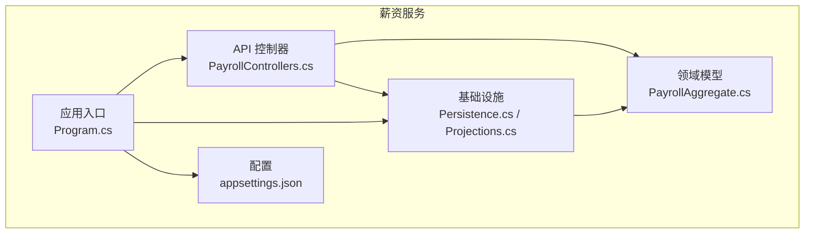
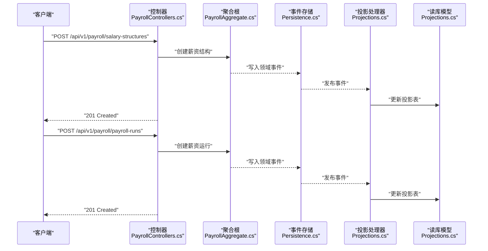
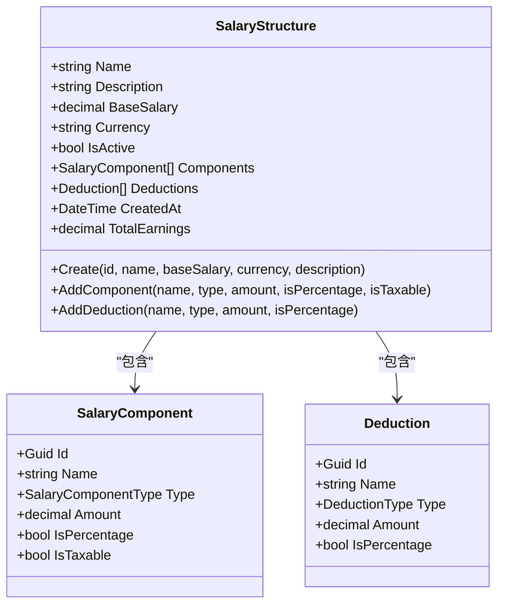
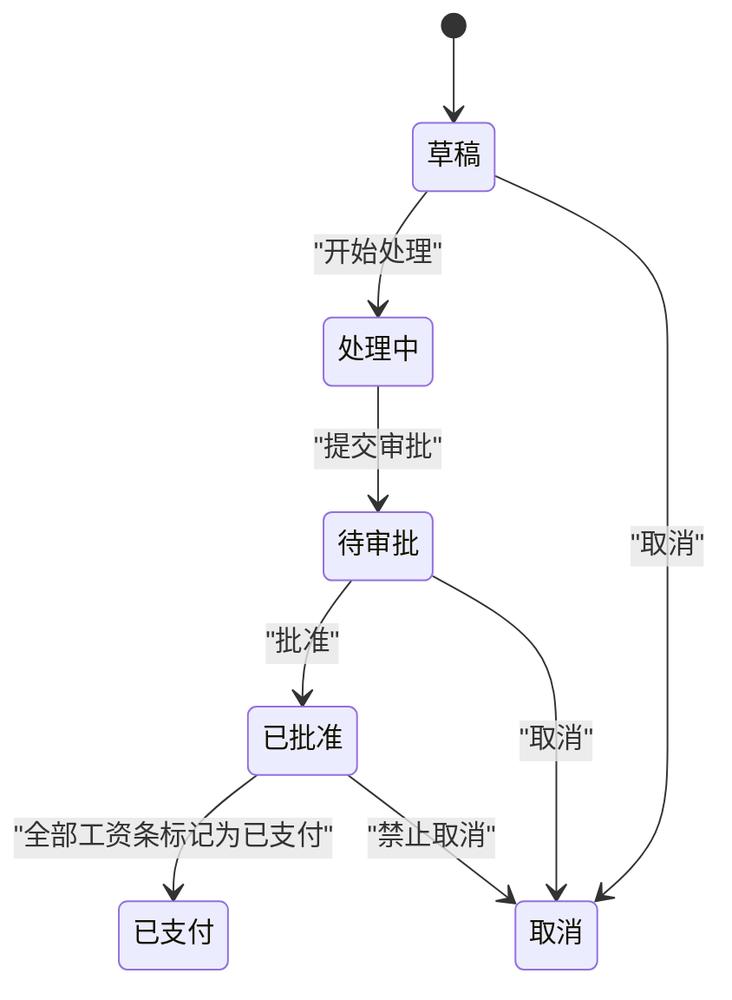
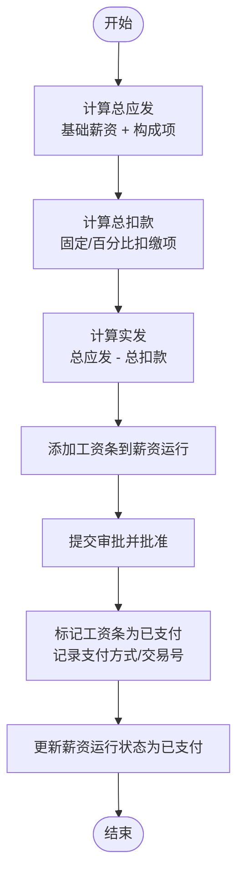
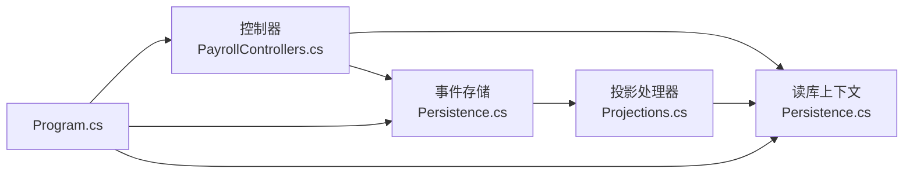

# 薪资服务

<cite>
**本文引用的文件**
- [PayrollAggregate.cs](file://src/Services/Payroll/ErpSystem.Payroll/Domain/PayrollAggregate.cs)
- [PayrollControllers.cs](file://src/Services/Payroll/ErpSystem.Payroll/API/PayrollControllers.cs)
- [Persistence.cs](file://src/Services/Payroll/ErpSystem.Payroll/Infrastructure/Persistence.cs)
- [Projections.cs](file://src/Services/Payroll/ErpSystem.Payroll/Infrastructure/Projections.cs)
- [Program.cs](file://src/Services/Payroll/ErpSystem.Payroll/Program.cs)
- [appsettings.json](file://src/Services/Payroll/ErpSystem.Payroll/appsettings.json)
</cite>

## 目录
1. [简介](#简介)
2. [项目结构](#项目结构)
3. [核心组件](#核心组件)
4. [架构总览](#架构总览)
5. [详细组件分析](#详细组件分析)
6. [依赖关系分析](#依赖关系分析)
7. [性能考虑](#性能考虑)
8. [故障排查指南](#故障排查指南)
9. [结论](#结论)
10. [附录](#附录)

## 简介
本文件为薪资服务（Payroll）的微服务文档，聚焦于薪酬计算、薪资发放与税务处理等关键能力。系统采用事件溯源与CQRS模式，通过领域聚合根（薪资结构、薪资运行、工资条）驱动业务流程，并以投影模型支撑查询端读库。文档将从架构、组件、数据流、处理逻辑、集成点、错误处理与性能优化等方面进行深入说明，并提供API接口设计、计算引擎与合规检查的实践建议。

## 项目结构
薪资服务位于 src/Services/Payroll/ErpSystem.Payroll 目录下，包含以下关键模块：
- Domain：领域模型与事件定义（薪资结构、薪资运行、工资条）
- API：控制器层，暴露REST接口
- Infrastructure：基础设施层，包含事件存储、读库模型与投影处理器
- Program.cs 与 appsettings.json：服务启动与配置

图表来源
- [Program.cs](file://src/Services/Payroll/ErpSystem.Payroll/Program.cs#L1-L45)
- [PayrollControllers.cs](file://src/Services/Payroll/ErpSystem.Payroll/API/PayrollControllers.cs#L1-L278)
- [PayrollAggregate.cs](file://src/Services/Payroll/ErpSystem.Payroll/Domain/PayrollAggregate.cs#L1-L429)
- [Persistence.cs](file://src/Services/Payroll/ErpSystem.Payroll/Infrastructure/Persistence.cs#L1-L121)
- [Projections.cs](file://src/Services/Payroll/ErpSystem.Payroll/Infrastructure/Projections.cs#L1-L171)
- [appsettings.json](file://src/Services/Payroll/ErpSystem.Payroll/appsettings.json#L1-L12)

章节来源
- [Program.cs](file://src/Services/Payroll/ErpSystem.Payroll/Program.cs#L1-L45)
- [appsettings.json](file://src/Services/Payroll/ErpSystem.Payroll/appsettings.json#L1-L12)

## 核心组件
- 薪资结构聚合根（SalaryStructure）：管理基础薪资、薪资构成项与扣缴项，支持按固定金额或百分比计算，并可标记构成项是否应税。
- 薪资运行聚合根（PayrollRun）：管理一次薪资结算周期，包含状态机（草稿、处理中、待审批、已批准、已支付、取消），以及该周期内所有工资条。
- 工资条实体（Payslip）：记录单个员工在某次薪资运行中的应发、扣款与实发明细与状态。
- 领域事件：用于事件溯源与投影，覆盖薪资结构创建/变更、薪资运行生命周期、工资条生成与支付等。
- 控制器：提供薪资结构、薪资运行、工资条的CRUD与状态流转API。
- 投影处理器：监听领域事件，更新读库模型（SalaryStructureReadModel、PayrollRunReadModel、PayslipReadModel）。
- 事件存储与读库：基于EF Core的事件存储表与只读投影表。

章节来源
- [PayrollAggregate.cs](file://src/Services/Payroll/ErpSystem.Payroll/Domain/PayrollAggregate.cs#L185-L249)
- [PayrollAggregate.cs](file://src/Services/Payroll/ErpSystem.Payroll/Domain/PayrollAggregate.cs#L255-L406)
- [PayrollAggregate.cs](file://src/Services/Payroll/ErpSystem.Payroll/Domain/PayrollAggregate.cs#L412-L426)
- [PayrollControllers.cs](file://src/Services/Payroll/ErpSystem.Payroll/API/PayrollControllers.cs#L11-L278)
- [Persistence.cs](file://src/Services/Payroll/ErpSystem.Payroll/Infrastructure/Persistence.cs#L6-L121)
- [Projections.cs](file://src/Services/Payroll/ErpSystem.Payroll/Infrastructure/Projections.cs#L9-L171)

## 架构总览
薪资服务采用事件溯源+CQRS架构：
- 写模型：控制器接收请求，构造聚合根并应用领域命令，产生领域事件并持久化到事件存储。
- 读模型：投影处理器监听事件，更新只读数据库中的投影表，供查询端使用。
- 查询端：控制器直接查询读库模型，返回结构化结果。

图表来源
- [PayrollControllers.cs](file://src/Services/Payroll/ErpSystem.Payroll/API/PayrollControllers.cs#L31-L44)
- [PayrollControllers.cs](file://src/Services/Payroll/ErpSystem.Payroll/API/PayrollControllers.cs#L108-L124)
- [PayrollAggregate.cs](file://src/Services/Payroll/ErpSystem.Payroll/Domain/PayrollAggregate.cs#L203-L213)
- [PayrollAggregate.cs](file://src/Services/Payroll/ErpSystem.Payroll/Domain/PayrollAggregate.cs#L274-L285)
- [Persistence.cs](file://src/Services/Payroll/ErpSystem.Payroll/Infrastructure/Persistence.cs#L8-L20)
- [Projections.cs](file://src/Services/Payroll/ErpSystem.Payroll/Infrastructure/Projections.cs#L14-L31)
- [Projections.cs](file://src/Services/Payroll/ErpSystem.Payroll/Infrastructure/Projections.cs#L76-L91)

## 详细组件分析

### 薪资结构聚合根（SalaryStructure）
职责与特性：
- 管理基础薪资与薪资构成项（含是否百分比、是否应税）与扣缴项（含是否百分比）。
- 提供总应发额计算逻辑：基础薪资 + 固定金额构成项之和 + 基于基础薪资的百分比构成项之和。
- 通过领域事件记录创建、添加构成项与扣缴项，确保可追溯性。

图表来源
- [PayrollAggregate.cs](file://src/Services/Payroll/ErpSystem.Payroll/Domain/PayrollAggregate.cs#L185-L249)
- [PayrollAggregate.cs](file://src/Services/Payroll/ErpSystem.Payroll/Domain/PayrollAggregate.cs#L158-L173)
- [PayrollAggregate.cs](file://src/Services/Payroll/ErpSystem.Payroll/Domain/PayrollAggregate.cs#L167-L173)

章节来源
- [PayrollAggregate.cs](file://src/Services/Payroll/ErpSystem.Payroll/Domain/PayrollAggregate.cs#L185-L249)
- [PayrollAggregate.cs](file://src/Services/Payroll/ErpSystem.Payroll/Domain/PayrollAggregate.cs#L196-L201)

### 薪资运行聚合根（PayrollRun）
职责与特性：
- 管理一次薪资结算周期（年、月、付款日期、描述）与状态机。
- 支持添加工资条（校验运行状态）、启动处理、提交审批、批准、标记工资条为已支付、取消等。
- 自动维护汇总统计（总应发、总扣款、总实发、员工数、已支付数）。

图表来源
- [PayrollAggregate.cs](file://src/Services/Payroll/ErpSystem.Payroll/Domain/PayrollAggregate.cs#L304-L349)

章节来源
- [PayrollAggregate.cs](file://src/Services/Payroll/ErpSystem.Payroll/Domain/PayrollAggregate.cs#L255-L406)

### 工资条实体（Payslip）
职责与特性：
- 记录单个员工在某次薪资运行中的应发、扣款、实发与行项目明细。
- 维护状态（草稿、最终确认、已支付、更正）与支付信息（支付方式、交易参考号、支付时间）。

章节来源
- [PayrollAggregate.cs](file://src/Services/Payroll/ErpSystem.Payroll/Domain/PayrollAggregate.cs#L412-L426)

### 领域事件与事件溯源
- 薪资结构事件：创建、添加构成项、添加扣缴项。
- 薪资运行事件：创建、状态变更、工资条生成、批准、工资条支付。
- 事件存储：使用EF Core映射事件流表，保存事件负载（JSONB）与版本信息。
- 投影处理器：监听事件，更新读库模型，包括薪资结构的总应发计算、薪资运行与工资条的汇总与状态同步。

章节来源
- [PayrollAggregate.cs](file://src/Services/Payroll/ErpSystem.Payroll/Domain/PayrollAggregate.cs#L52-L152)
- [Persistence.cs](file://src/Services/Payroll/ErpSystem.Payroll/Infrastructure/Persistence.cs#L8-L20)
- [Projections.cs](file://src/Services/Payroll/ErpSystem.Payroll/Infrastructure/Projections.cs#L9-L63)
- [Projections.cs](file://src/Services/Payroll/ErpSystem.Payroll/Infrastructure/Projections.cs#L69-L171)

### API 接口设计
- 薪资结构管理
  - GET /api/v1/payroll/salary-structures：分页查询，支持按激活状态过滤
  - GET /api/v1/payroll/salary-structures/{id}：按ID查询
  - POST /api/v1/payroll/salary-structures：创建薪资结构
  - POST /api/v1/payroll/salary-structures/{id}/components：添加薪资构成项
  - POST /api/v1/payroll/salary-structures/{id}/deductions：添加扣缴项
- 薪资运行管理
  - GET /api/v1/payroll/payroll-runs：按年、月、状态过滤
  - GET /api/v1/payroll/payroll-runs/{id}：按ID查询
  - POST /api/v1/payroll/payroll-runs：创建薪资运行
  - POST /api/v1/payroll/payroll-runs/{id}/payslips：添加工资条
  - POST /api/v1/payroll/payroll-runs/{id}/start-processing：开始处理
  - POST /api/v1/payroll/payroll-runs/{id}/submit：提交审批
  - POST /api/v1/payroll/payroll-runs/{id}/approve：批准
  - POST /api/v1/payroll/payroll-runs/{id}/cancel：取消
  - GET /api/v1/payroll/payroll-runs/statistics：按年统计
- 工资条查询
  - GET /api/v1/payroll/payslips：按薪资运行、员工、年、月过滤
  - GET /api/v1/payroll/payslips/{id}：按ID查询
  - GET /api/v1/payroll/payslips/employee/{employeeId}：员工历史工资条汇总

章节来源
- [PayrollControllers.cs](file://src/Services/Payroll/ErpSystem.Payroll/API/PayrollControllers.cs#L13-L80)
- [PayrollControllers.cs](file://src/Services/Payroll/ErpSystem.Payroll/API/PayrollControllers.cs#L86-L210)
- [PayrollControllers.cs](file://src/Services/Payroll/ErpSystem.Payroll/API/PayrollControllers.cs#L216-L259)

### 计算引擎与发放流程
- 薪资计算
  - 总应发 = 基础薪资 + 固定金额构成项之和 + 基于基础薪资的百分比构成项之和
  - 扣款由固定金额或百分比扣缴项组成，支持百分比基于基础薪资
- 发放流程
  - 创建薪资运行 → 添加工资条 → 启动处理 → 提交审批 → 批准 → 标记工资条为已支付 → 更新薪资运行状态
- 银行转账
  - 工资条支付时记录支付方式与交易参考号；实际转账可通过外部系统对接，服务侧仅记录状态与参考信息

图表来源
- [PayrollAggregate.cs](file://src/Services/Payroll/ErpSystem.Payroll/Domain/PayrollAggregate.cs#L196-L201)
- [PayrollAggregate.cs](file://src/Services/Payroll/ErpSystem.Payroll/Domain/PayrollAggregate.cs#L287-L302)
- [PayrollAggregate.cs](file://src/Services/Payroll/ErpSystem.Payroll/Domain/PayrollAggregate.cs#L323-L341)
- [Projections.cs](file://src/Services/Payroll/ErpSystem.Payroll/Infrastructure/Projections.cs#L103-L133)
- [Projections.cs](file://src/Services/Payroll/ErpSystem.Payroll/Infrastructure/Projections.cs#L147-L167)

## 依赖关系分析
- 控制器依赖事件存储与读库上下文，负责聚合加载与保存。
- 投影处理器依赖读库上下文，监听领域事件并更新投影表。
- 应用程序入口注册事件存储、MediatR、Dapr事件总线与EF Core上下文。

图表来源
- [PayrollControllers.cs](file://src/Services/Payroll/ErpSystem.Payroll/API/PayrollControllers.cs#L11-L11)
- [Program.cs](file://src/Services/Payroll/ErpSystem.Payroll/Program.cs#L10-L26)
- [Persistence.cs](file://src/Services/Payroll/ErpSystem.Payroll/Infrastructure/Persistence.cs#L8-L60)
- [Projections.cs](file://src/Services/Payroll/ErpSystem.Payroll/Infrastructure/Projections.cs#L9-L171)

章节来源
- [Program.cs](file://src/Services/Payroll/ErpSystem.Payroll/Program.cs#L1-L45)
- [Persistence.cs](file://src/Services/Payroll/ErpSystem.Payroll/Infrastructure/Persistence.cs#L1-L121)

## 性能考虑
- 事件存储：事件表按聚合ID与版本索引，适合事件回放与重放；建议对常用查询字段建立索引。
- 读库投影：薪资结构、薪资运行、工资条均建立必要索引，提升查询性能。
- JSONB字段：构成项与扣缴项序列化为JSONB，便于灵活扩展但需注意查询与排序限制。
- 并发控制：事件版本控制避免并发写入冲突；聚合方法内含状态校验，防止非法状态转换。
- 缓存策略：可在查询端引入缓存（如Redis）以减轻读库压力，结合ETag或Last-Modified实现缓存失效。

## 故障排查指南
- 无法创建/更新薪资结构
  - 检查事件存储连接字符串与数据库权限
  - 查看控制器返回状态码与异常日志
- 薪资运行状态异常
  - 确认状态转换顺序：草稿 → 处理中 → 待审批 → 已批准 → 已支付
  - 校验是否存在空运行（无工资条即不可提交审批）
- 工资条未正确计入汇总
  - 检查投影处理器是否收到“工资条生成”事件
  - 确认薪资运行与工资条投影字段是否同步更新
- 数据一致性问题
  - 使用事件存储回放功能验证投影是否完整
  - 对比事件存储与读库数据，定位缺失或重复事件

章节来源
- [PayrollAggregate.cs](file://src/Services/Payroll/ErpSystem.Payroll/Domain/PayrollAggregate.cs#L304-L349)
- [Projections.cs](file://src/Services/Payroll/ErpSystem.Payroll/Infrastructure/Projections.cs#L103-L133)

## 结论
薪资服务通过事件溯源与CQRS实现了清晰的职责分离与高可追溯性。薪资结构聚合根提供了灵活的构成与扣缴配置，薪资运行聚合根承载了完整的结算生命周期，投影机制保障了查询端的高性能访问。建议后续增强税务计算引擎（如引入专项附加扣除、速算扣除表）、完善银行转账集成与合规检查，并持续优化事件回放与读库索引策略。

## 附录

### API 定义概览
- 薪资结构
  - GET /api/v1/payroll/salary-structures?isActive={bool}
  - GET /api/v1/payroll/salary-structures/{id}
  - POST /api/v1/payroll/salary-structures
  - POST /api/v1/payroll/salary-structures/{id}/components
  - POST /api/v1/payroll/salary-structures/{id}/deductions
- 薪资运行
  - GET /api/v1/payroll/payroll-runs?year={int}&month={int}&status={string}
  - GET /api/v1/payroll/payroll-runs/{id}
  - POST /api/v1/payroll/payroll-runs
  - POST /api/v1/payroll/payroll-runs/{id}/payslips
  - POST /api/v1/payroll/payroll-runs/{id}/start-processing
  - POST /api/v1/payroll/payroll-runs/{id}/submit
  - POST /api/v1/payroll/payroll-runs/{id}/approve
  - POST /api/v1/payroll/payroll-runs/{id}/cancel
  - GET /api/v1/payroll/payroll-runs/statistics?year={int}
- 工资条
  - GET /api/v1/payroll/payslips?payrollRunId={guid}&employeeId={string}&year={int}&month={int}
  - GET /api/v1/payroll/payslips/{id}
  - GET /api/v1/payroll/payslips/employee/{employeeId}?year={int}

章节来源
- [PayrollControllers.cs](file://src/Services/Payroll/ErpSystem.Payroll/API/PayrollControllers.cs#L13-L259)