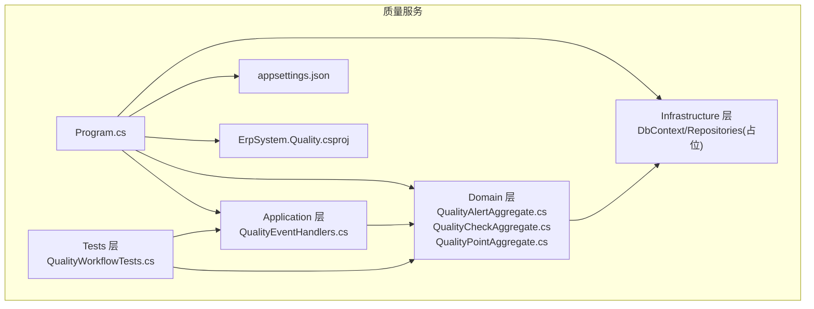
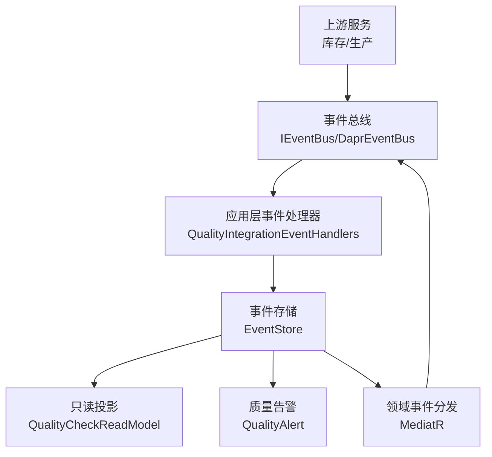
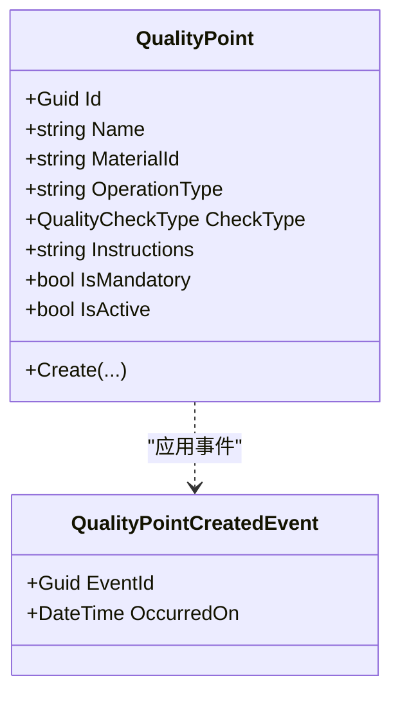
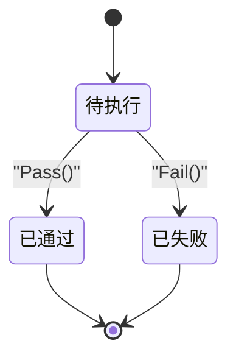
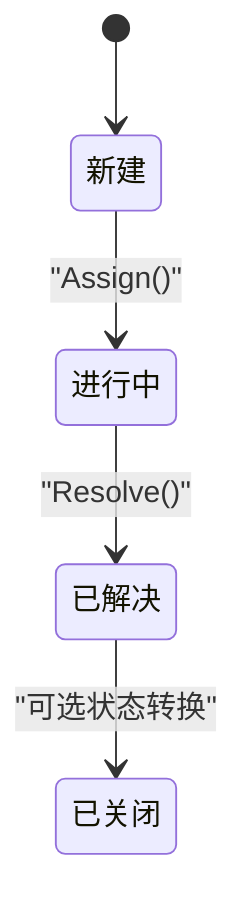
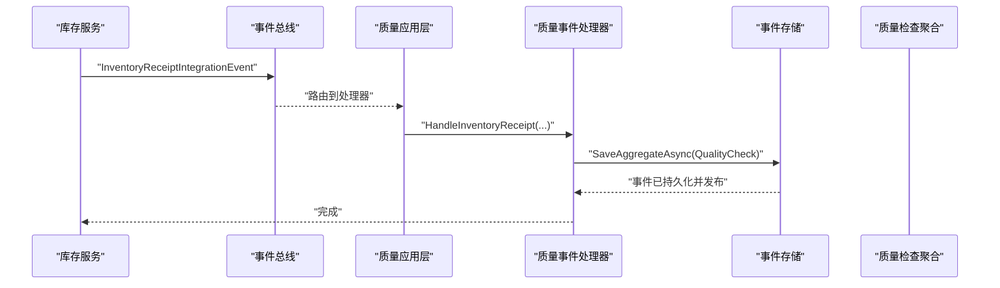
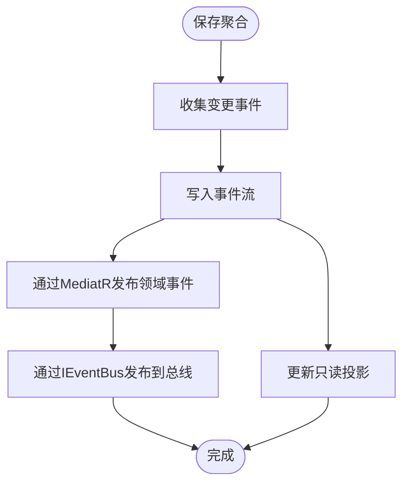
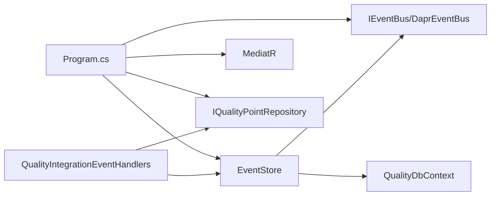

# 质量控制服务

<cite>
**本文引用的文件**
- [Program.cs](file://src/Services/Quality/ErpSystem.Quality/Program.cs)
- [appsettings.json](file://src/Services/Quality/ErpSystem.Quality/appsettings.json)
- [ErpSystem.Quality.csproj](file://src/Services/Quality/ErpSystem.Quality/ErpSystem.Quality.csproj)
- [QualityEventHandlers.cs](file://src/Services/Quality/ErpSystem.Quality/Application/QualityEventHandlers.cs)
- [QualityAlertAggregate.cs](file://src/Services/Quality/ErpSystem.Quality/Domain/QualityAlertAggregate.cs)
- [QualityCheckAggregate.cs](file://src/Services/Quality/ErpSystem.Quality/Domain/QualityCheckAggregate.cs)
- [QualityPointAggregate.cs](file://src/Services/Quality/ErpSystem.Quality/Domain/QualityPointAggregate.cs)
- [DDDBase.cs](file://src/BuildingBlocks/ErpSystem.BuildingBlocks/Domain/DDDBase.cs)
- [DaprEventBus.cs](file://src/BuildingBlocks/ErpSystem.BuildingBlocks/EventBus/DaprEventBus.cs)
- [EventBusExtensions.cs](file://src/BuildingBlocks/ErpSystem.BuildingBlocks/EventBus/EventBusExtensions.cs)
- [OutboxProcessor.cs](file://src/BuildingBlocks/ErpSystem.BuildingBlocks/Outbox/OutboxProcessor.cs)
- [QualityWorkflowTests.cs](file://src/Tests/ErpSystem.IntegrationTests/Quality/QualityWorkflowTests.cs)
</cite>

## 目录
1. [简介](#简介)
2. [项目结构](#项目结构)
3. [核心组件](#核心组件)
4. [架构总览](#架构总览)
5. [详细组件分析](#详细组件分析)
6. [依赖关系分析](#依赖关系分析)
7. [性能考虑](#性能考虑)
8. [故障排查指南](#故障排查指南)
9. [结论](#结论)
10. [附录](#附录)

## 简介
本文件为质量控制服务（ErpSystem.Quality）的微服务文档，聚焦于质量控制流程、缺陷管理与质量分析能力。系统采用领域驱动设计（DDD）与事件溯源（Event Sourcing）相结合的方式，围绕质量聚合根（质量点、质量检查、质量告警）构建质量标准与流程控制，并通过集成事件触发质量检查任务，实现从入库检验到生产过程的质量门禁与预警机制。文档同时覆盖质量数据的事件溯源、质量指标与趋势分析的设计思路，以及质量API接口与质量门禁的实现建议。

## 项目结构
质量控制服务位于 src/Services/Quality/ErpSystem.Quality 目录下，包含应用层（Application）、领域层（Domain）、基础设施（Infrastructure）与测试（Tests）等模块。服务基于 .NET 10，使用 Dapr 事件总线、Entity Framework Core 进行事件存储，集成 MediatR 实现命令与查询处理。

图表来源
- [Program.cs](file://src/Services/Quality/ErpSystem.Quality/Program.cs#L1-L61)
- [appsettings.json](file://src/Services/Quality/ErpSystem.Quality/appsettings.json#L1-L12)
- [ErpSystem.Quality.csproj](file://src/Services/Quality/ErpSystem.Quality/ErpSystem.Quality.csproj#L1-L22)
- [QualityEventHandlers.cs](file://src/Services/Quality/ErpSystem.Quality/Application/QualityEventHandlers.cs#L1-L95)
- [QualityAlertAggregate.cs](file://src/Services/Quality/ErpSystem.Quality/Domain/QualityAlertAggregate.cs#L1-L118)
- [QualityCheckAggregate.cs](file://src/Services/Quality/ErpSystem.Quality/Domain/QualityCheckAggregate.cs#L1-L116)
- [QualityPointAggregate.cs](file://src/Services/Quality/ErpSystem.Quality/Domain/QualityPointAggregate.cs#L1-L81)
- [QualityWorkflowTests.cs](file://src/Tests/ErpSystem.IntegrationTests/Quality/QualityWorkflowTests.cs#L1-L75)

章节来源
- [Program.cs](file://src/Services/Quality/ErpSystem.Quality/Program.cs#L1-L61)
- [ErpSystem.Quality.csproj](file://src/Services/Quality/ErpSystem.Quality/ErpSystem.Quality.csproj#L1-L22)

## 核心组件
- 聚合根与事件模型
  - 质量点（QualityPoint）：定义在特定操作类型（如入库、生产开始、包装）下的质量要求，包含检查类型、是否强制、是否激活等属性。
  - 质量检查（QualityCheck）：具体某次业务源触发的质量检查实例，状态机包含“待执行/通过/失败”，支持通过或失败操作。
  - 质量告警（QualityAlert）：当检测到质量问题时生成的告警，包含描述、优先级、状态（新建/进行中/已解决/已关闭）、分配与解决等生命周期事件。
- 事件存储与事件总线
  - EventStore：负责将聚合变更序列化为事件流并持久化，同时通过 MediatR 分发领域事件并通过 IEventBus 发布到事件总线。
  - IEventBus/DaprEventBus：抽象事件发布接口，默认使用 DummyEventBus（开发环境），可切换为 DaprEventBus。
- 应用层事件处理器
  - QualityIntegrationEventHandlers：监听库存收货与生产订单启动等集成事件，按材料与操作类型查找质量点并创建质量检查实例。
- 基础设施
  - QualityDbContext：事件表与只读视图（质量点、质量检查读模型）的 EF Core 映射。
  - IQualityPointRepository：质量点查询接口（当前为占位实现，实际应查询数据库）。

章节来源
- [QualityPointAggregate.cs](file://src/Services/Quality/ErpSystem.Quality/Domain/QualityPointAggregate.cs#L1-L81)
- [QualityCheckAggregate.cs](file://src/Services/Quality/ErpSystem.Quality/Domain/QualityCheckAggregate.cs#L1-L116)
- [QualityAlertAggregate.cs](file://src/Services/Quality/ErpSystem.Quality/Domain/QualityAlertAggregate.cs#L1-L118)
- [DDDBase.cs](file://src/BuildingBlocks/ErpSystem.BuildingBlocks/Domain/DDDBase.cs#L53-L120)
- [DaprEventBus.cs](file://src/BuildingBlocks/ErpSystem.BuildingBlocks/EventBus/DaprEventBus.cs#L6-L31)
- [EventBusExtensions.cs](file://src/BuildingBlocks/ErpSystem.BuildingBlocks/EventBus/EventBusExtensions.cs#L5-L14)
- [QualityEventHandlers.cs](file://src/Services/Quality/ErpSystem.Quality/Application/QualityEventHandlers.cs#L10-L95)
- [Program.cs](file://src/Services/Quality/ErpSystem.Quality/Program.cs#L18-L40)

## 架构总览
质量控制服务采用事件驱动架构：上游服务（如库存、生产）产生集成事件；质量服务的应用层事件处理器根据质量标准（质量点）自动创建质量检查；质量检查状态变化通过事件溯源持久化并广播；质量告警用于追踪与闭环质量问题。

图表来源
- [QualityEventHandlers.cs](file://src/Services/Quality/ErpSystem.Quality/Application/QualityEventHandlers.cs#L10-L95)
- [DDDBase.cs](file://src/BuildingBlocks/ErpSystem.BuildingBlocks/Domain/DDDBase.cs#L59-L99)
- [DaprEventBus.cs](file://src/BuildingBlocks/ErpSystem.BuildingBlocks/EventBus/DaprEventBus.cs#L11-L21)
- [Program.cs](file://src/Services/Quality/ErpSystem.Quality/Program.cs#L21-L36)

## 详细组件分析

### 质量点（QualityPoint）设计
- 职责：定义质量标准模板，指定适用的操作类型（如 RECEIPT、PRODUCTION_START）、检查类型（通过/测量/目视）、是否强制与说明。
- 关键行为：创建后默认激活，后续可通过变更事件扩展（如停用、修改）。
- 复杂度：创建与加载均为 O(1)，查询依赖上游仓储实现。

图表来源
- [QualityPointAggregate.cs](file://src/Services/Quality/ErpSystem.Quality/Domain/QualityPointAggregate.cs#L8-L58)
- [QualityPointAggregate.cs](file://src/Services/Quality/ErpSystem.Quality/Domain/QualityPointAggregate.cs#L67-L81)

章节来源
- [QualityPointAggregate.cs](file://src/Services/Quality/ErpSystem.Quality/Domain/QualityPointAggregate.cs#L1-L81)

### 质量检查（QualityCheck）状态机
- 状态：Pending → Passed 或 Failed。
- 行为：仅待执行状态允许执行通过/失败操作；失败会触发质量告警创建流程（由应用层事件处理器协调）。
- 事件溯源：每次状态变更生成对应事件，写入事件流并发布。

图表来源
- [QualityCheckAggregate.cs](file://src/Services/Quality/ErpSystem.Quality/Domain/QualityCheckAggregate.cs#L8-L75)

章节来源
- [QualityCheckAggregate.cs](file://src/Services/Quality/ErpSystem.Quality/Domain/QualityCheckAggregate.cs#L1-L116)

### 质量告警（QualityAlert）生命周期
- 状态：New → InProgress → Resolved → Closed（可选）。
- 行为：创建、分配（Assign）、解决（Resolve）等事件驱动状态流转。
- 与质量检查联动：当质量检查失败时，可由应用层触发创建质量告警，形成问题闭环。

图表来源
- [QualityAlertAggregate.cs](file://src/Services/Quality/ErpSystem.Quality/Domain/QualityAlertAggregate.cs#L8-L70)

章节来源
- [QualityAlertAggregate.cs](file://src/Services/Quality/ErpSystem.Quality/Domain/QualityAlertAggregate.cs#L1-L118)

### 事件处理与质量流程
- 入库触发（IQC）：监听库存收货事件，按材料与操作类型（RECEIPT）查询质量点，为每个质量点创建质量检查。
- 生产触发（PQC）：监听生产订单启动事件，按材料与操作类型（PRODUCTION_START）查询质量点，为每个质量点创建质量检查。
- 流程控制：质量检查状态决定后续流程（通过则放行，失败则进入告警与处置流程）。

图表来源
- [QualityEventHandlers.cs](file://src/Services/Quality/ErpSystem.Quality/Application/QualityEventHandlers.cs#L18-L45)
- [DDDBase.cs](file://src/BuildingBlocks/ErpSystem.BuildingBlocks/Domain/DDDBase.cs#L62-L99)

章节来源
- [QualityEventHandlers.cs](file://src/Services/Quality/ErpSystem.Quality/Application/QualityEventHandlers.cs#L1-L95)

### 事件溯源与只读投影
- 事件溯源：聚合变更以事件形式保存，支持重放与审计。
- 只读投影：质量检查读模型（QualityCheckReadModel）用于查询与报表展示。
- 出站消息：OutboxProcessor 负责将出站消息批量发布到事件总线。

图表来源
- [DDDBase.cs](file://src/BuildingBlocks/ErpSystem.BuildingBlocks/Domain/DDDBase.cs#L62-L99)
- [OutboxProcessor.cs](file://src/BuildingBlocks/ErpSystem.BuildingBlocks/Outbox/OutboxProcessor.cs#L29-L70)

章节来源
- [DDDBase.cs](file://src/BuildingBlocks/ErpSystem.BuildingBlocks/Domain/DDDBase.cs#L1-L137)
- [OutboxProcessor.cs](file://src/BuildingBlocks/ErpSystem.BuildingBlocks/Outbox/OutboxProcessor.cs#L1-L72)

### 质量API接口设计（建议）
- 资源与端点
  - GET /api/quality-points：查询质量点列表（按材料、操作类型过滤）
  - POST /api/quality-points：创建质量点
  - GET /api/quality-checks/{id}：查询质量检查详情
  - POST /api/quality-checks/{id}/pass：标记通过
  - POST /api/quality-checks/{id}/fail：标记失败并创建告警
  - GET /api/quality-alerts：查询告警列表（按优先级、状态、材料过滤）
  - PUT /api/quality-alerts/{id}/assign：分配告警
  - PUT /api/quality-alerts/{id}/resolve：解决告警
- 认证与授权：使用统一鉴权中间件
- 错误处理：返回语义化错误码与消息
- 版本控制：遵循语义化版本

（本节为概念性设计，不直接分析具体代码文件）

## 依赖关系分析
- 组件耦合
  - Program.cs 注册事件存储、MediatR、事件总线与仓储接口，体现高层对底层的依赖倒置。
  - QualityIntegrationEventHandlers 依赖 IEventStore、IQualityPointRepository 与日志器，职责单一。
  - EventStore 依赖 DbContext、IPublisher、IEventBus，承担事件持久化与发布职责。
- 外部依赖
  - Dapr 事件总线（开发环境使用 DummyEventBus，生产可切换为 DaprEventBus）
  - Entity Framework Core（PostgreSQL）
  - Swashbuckle（Swagger 文档）

图表来源
- [Program.cs](file://src/Services/Quality/ErpSystem.Quality/Program.cs#L18-L40)
- [QualityEventHandlers.cs](file://src/Services/Quality/ErpSystem.Quality/Application/QualityEventHandlers.cs#L10-L13)
- [DaprEventBus.cs](file://src/BuildingBlocks/ErpSystem.BuildingBlocks/EventBus/DaprEventBus.cs#L11-L21)
- [DDDBase.cs](file://src/BuildingBlocks/ErpSystem.BuildingBlocks/Domain/DDDBase.cs#L59-L61)

章节来源
- [Program.cs](file://src/Services/Quality/ErpSystem.Quality/Program.cs#L1-L61)
- [DaprEventBus.cs](file://src/BuildingBlocks/ErpSystem.BuildingBlocks/EventBus/DaprEventBus.cs#L1-L31)
- [DDDBase.cs](file://src/BuildingBlocks/ErpSystem.BuildingBlocks/Domain/DDDBase.cs#L1-L137)

## 性能考虑
- 事件存储
  - 批量写入：EventStore 每次保存聚合时批量写入事件流，减少往返次数。
  - 事件反序列化：LoadAggregateAsync 使用类型解析器按事件名动态反序列化，注意类型注册一致性。
- 查询优化
  - 只读投影：通过 QualityCheckReadModel 提供高效查询路径，避免重放整个事件流。
  - 分页与过滤：建议在查询接口中加入分页与索引（如按 MaterialId、Status、OccurredOn）。
- 事件总线
  - 开发环境使用 DummyEventBus，生产环境启用 DaprEventBus 并配置合适的重试与死信队列策略。
- 数据库
  - PostgreSQL 上为事件表建立复合主键与必要索引，确保事件加载与写入性能。

（本节为通用性能建议，不直接分析具体代码文件）

## 故障排查指南
- 事件未发布
  - 检查 IEventBus 实现是否正确注册（开发环境默认 DummyEventBus）。
  - 确认 EventStore 在保存聚合后调用了事件发布逻辑。
- 聚合加载失败
  - 检查事件类型解析器是否能正确解析事件类型名称。
  - 确保事件序列化/反序列化格式一致。
- 质量检查状态异常
  - 确认仅在 Pending 状态下调用 Pass/Fail。
  - 检查应用层事件处理器是否正确创建质量检查。
- 配置问题
  - 检查连接字符串与数据库可用性。
  - 确认 Swagger 已启用以便调试 API。

章节来源
- [DaprEventBus.cs](file://src/BuildingBlocks/ErpSystem.BuildingBlocks/EventBus/DaprEventBus.cs#L23-L30)
- [DDDBase.cs](file://src/BuildingBlocks/ErpSystem.BuildingBlocks/Domain/DDDBase.cs#L101-L120)
- [QualityCheckAggregate.cs](file://src/Services/Quality/ErpSystem.Quality/Domain/QualityCheckAggregate.cs#L38-L52)
- [appsettings.json](file://src/Services/Quality/ErpSystem.Quality/appsettings.json#L8-L10)

## 结论
质量控制服务通过事件驱动与事件溯源实现了从质量标准管理到质量流程执行与问题告警的完整闭环。质量点作为质量标准聚合根，质量检查承载流程状态，质量告警保障问题可追踪与闭环。结合只读投影与出站消息处理，系统具备良好的可扩展性与可观测性。建议在生产环境中启用 Dapr 事件总线与完善的监控告警体系，并持续完善质量指标与趋势分析能力。

## 附录
- 单元与集成测试
  - 质量点、质量检查与质量告警的行为验证集中在集成测试中，确保状态机与事件流正确性。
- 部署与运行
  - 使用 appsettings.json 中的连接字符串配置数据库；开发模式下启用 Swagger 便于调试。

章节来源
- [QualityWorkflowTests.cs](file://src/Tests/ErpSystem.IntegrationTests/Quality/QualityWorkflowTests.cs#L1-L75)
- [appsettings.json](file://src/Services/Quality/ErpSystem.Quality/appsettings.json#L1-L12)