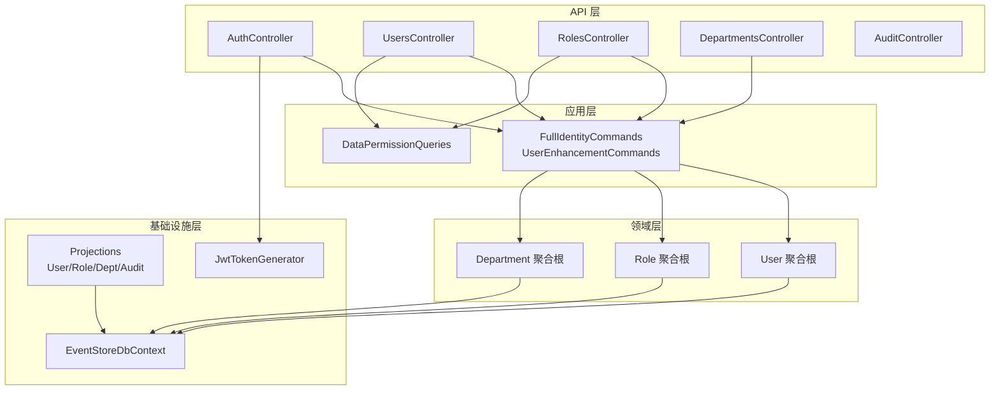
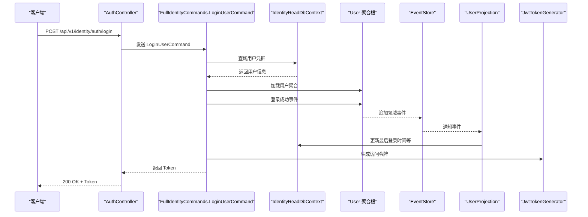
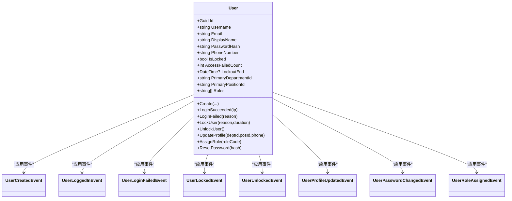
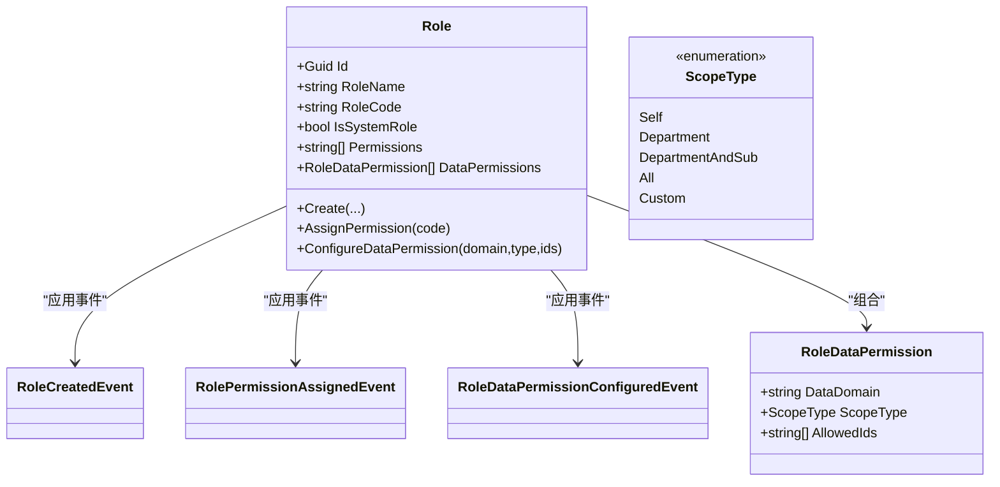
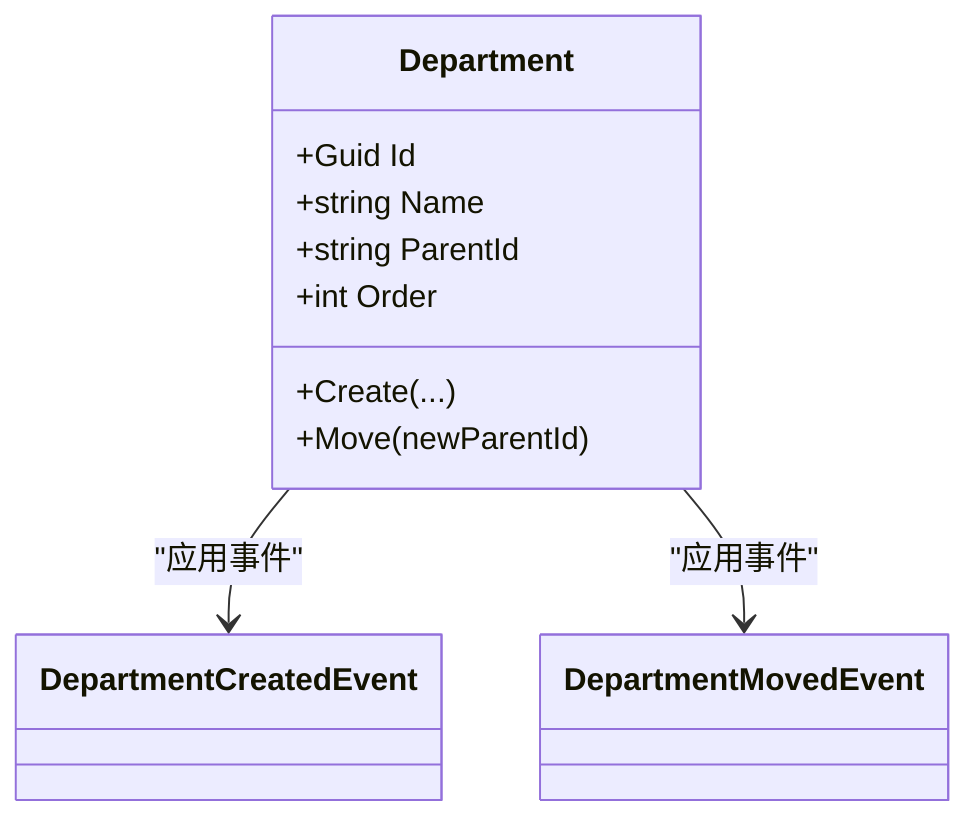
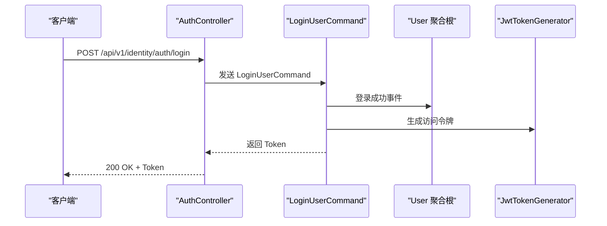
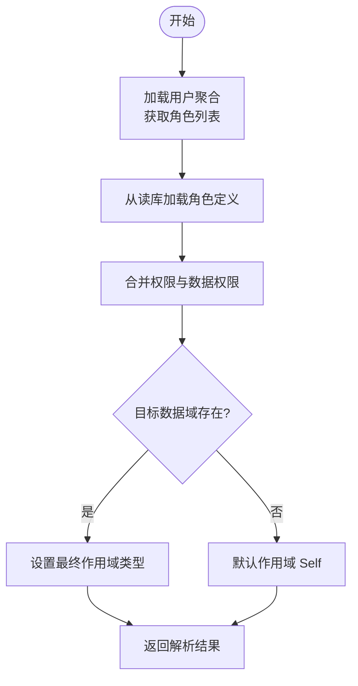
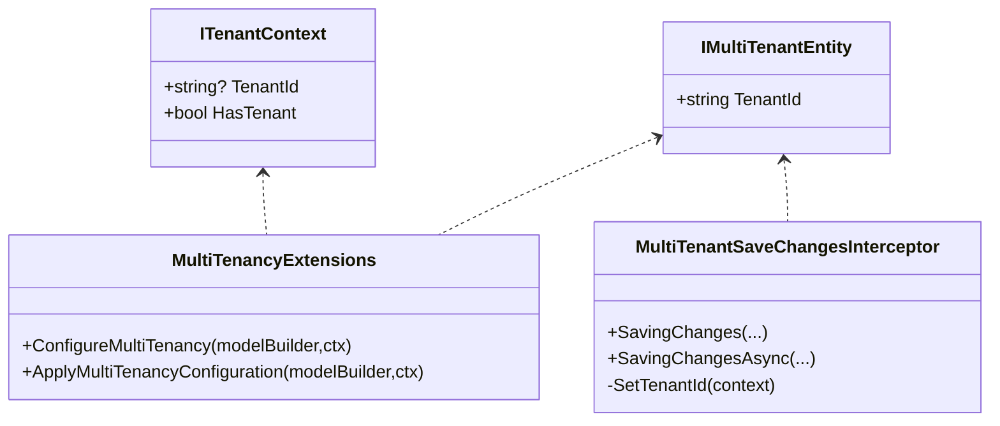
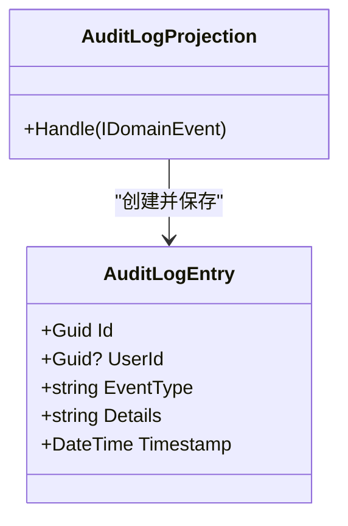
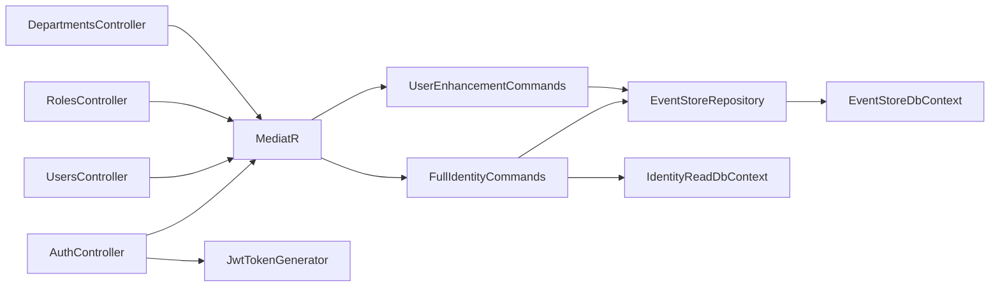

# 身份认证服务

<cite>
**本文档引用的文件**
- [Program.cs](file://src/Services/Identity/ErpSystem.Identity/Program.cs)
- [AuthController.cs](file://src/Services/Identity/ErpSystem.Identity/API/AuthController.cs)
- [UsersController.cs](file://src/Services/Identity/ErpSystem.Identity/API/UsersController.cs)
- [RolesController.cs](file://src/Services/Identity/ErpSystem.Identity/API/RolesController.cs)
- [DepartmentsController.cs](file://src/Services/Identity/ErpSystem.Identity/API/DepartmentsController.cs)
- [AuditController.cs](file://src/Services/Identity/ErpSystem.Identity/API/AuditController.cs)
- [UserAggregate.cs](file://src/Services/Identity/ErpSystem.Identity/Domain/UserAggregate.cs)
- [RoleAggregate.cs](file://src/Services/Identity/ErpSystem.Identity/Domain/RoleAggregate.cs)
- [DepartmentAggregate.cs](file://src/Services/Identity/ErpSystem.Identity/Domain/DepartmentAggregate.cs)
- [UserEnhancementCommands.cs](file://src/Services/Identity/ErpSystem.Identity/Application/UserEnhancementCommands.cs)
- [FullIdentityCommands.cs](file://src/Services/Identity/ErpSystem.Identity/Application/FullIdentityCommands.cs)
- [DataPermissionQueries.cs](file://src/Services/Identity/ErpSystem.Identity/Application/DataPermissionQueries.cs)
- [JwtTokenGenerator.cs](file://src/Services/Identity/ErpSystem.Identity/Infrastructure/JwtTokenGenerator.cs)
- [EventStore.cs](file://src/Services/Identity/ErpSystem.Identity/Infrastructure/EventStore.cs)
- [Projections.cs](file://src/Services/Identity/ErpSystem.Identity/Infrastructure/Projections.cs)
- [IUserContext.cs](file://src/BuildingBlocks/ErpSystem.BuildingBlocks/Auth/IUserContext.cs)
- [MultiTenancy.cs](file://src/BuildingBlocks/ErpSystem.BuildingBlocks/MultiTenancy/MultiTenancy.cs)
- [AuditLog.cs](file://src/BuildingBlocks/ErpSystem.BuildingBlocks/Auditing/AuditLog.cs)
</cite>

## 目录
1. [简介](#简介)
2. [项目结构](#项目结构)
3. [核心组件](#核心组件)
4. [架构总览](#架构总览)
5. [详细组件分析](#详细组件分析)
6. [依赖关系分析](#依赖关系分析)
7. [性能考虑](#性能考虑)
8. [故障排除指南](#故障排除指南)
9. [结论](#结论)
10. [附录](#附录)

## 简介
本文件为身份认证服务的微服务文档，聚焦于用户管理、角色权限、部门管理与数据权限等能力。系统采用事件驱动架构（EDA）与事件溯源（Event Sourcing），通过读写分离的投影模型实现强一致的查询视图，并提供基于 JWT 的认证与授权基础能力。同时，文档覆盖多租户支持、审计日志机制以及权限继承与访问控制的设计思路。

## 项目结构
身份认证服务位于独立的微服务中，包含以下关键层次：
- 应用层：命令与查询处理，负责业务编排与跨聚合交互
- 领域层：用户、角色、部门等聚合根及领域事件
- 基础设施层：事件存储、投影、JWT 生成器、读库上下文
- API 层：控制器暴露 REST 接口，统一路由到应用层

图表来源
- [Program.cs](file://src/Services/Identity/ErpSystem.Identity/Program.cs#L1-L71)
- [AuthController.cs](file://src/Services/Identity/ErpSystem.Identity/API/AuthController.cs#L1-L32)
- [UsersController.cs](file://src/Services/Identity/ErpSystem.Identity/API/UsersController.cs#L1-L56)
- [RolesController.cs](file://src/Services/Identity/ErpSystem.Identity/API/RolesController.cs#L1-L56)
- [DepartmentsController.cs](file://src/Services/Identity/ErpSystem.Identity/API/DepartmentsController.cs#L1-L37)
- [UserAggregate.cs](file://src/Services/Identity/ErpSystem.Identity/Domain/UserAggregate.cs#L1-L164)
- [RoleAggregate.cs](file://src/Services/Identity/ErpSystem.Identity/Domain/RoleAggregate.cs#L1-L94)
- [DepartmentAggregate.cs](file://src/Services/Identity/ErpSystem.Identity/Domain/DepartmentAggregate.cs#L1-L56)
- [EventStore.cs](file://src/Services/Identity/ErpSystem.Identity/Infrastructure/EventStore.cs#L1-L19)
- [Projections.cs](file://src/Services/Identity/ErpSystem.Identity/Infrastructure/Projections.cs#L1-L209)
- [JwtTokenGenerator.cs](file://src/Services/Identity/ErpSystem.Identity/Infrastructure/JwtTokenGenerator.cs#L1-L38)

章节来源
- [Program.cs](file://src/Services/Identity/ErpSystem.Identity/Program.cs#L1-L71)

## 核心组件
- 用户聚合根：封装用户生命周期事件（创建、登录成功/失败、锁定/解锁、资料更新、密码变更、角色分配）
- 角色聚合根：封装角色定义、权限分配与数据权限配置
- 部门聚合根：封装部门树形结构与移动操作
- 应用层处理器：注册用户、登录、创建角色/部门、分配角色权限、配置数据权限、用户增强操作（锁定/解锁/重置密码）
- 基础设施：事件存储（PostgreSQL + jsonb）、投影（读库）、JWT 令牌生成
- API 控制器：统一暴露 REST 接口，路由到应用层命令/查询

章节来源
- [UserAggregate.cs](file://src/Services/Identity/ErpSystem.Identity/Domain/UserAggregate.cs#L55-L164)
- [RoleAggregate.cs](file://src/Services/Identity/ErpSystem.Identity/Domain/RoleAggregate.cs#L42-L94)
- [DepartmentAggregate.cs](file://src/Services/Identity/ErpSystem.Identity/Domain/DepartmentAggregate.cs#L19-L56)
- [FullIdentityCommands.cs](file://src/Services/Identity/ErpSystem.Identity/Application/FullIdentityCommands.cs#L27-L124)
- [UserEnhancementCommands.cs](file://src/Services/Identity/ErpSystem.Identity/Application/UserEnhancementCommands.cs#L17-L64)
- [EventStore.cs](file://src/Services/Identity/ErpSystem.Identity/Infrastructure/EventStore.cs#L6-L18)
- [Projections.cs](file://src/Services/Identity/ErpSystem.Identity/Infrastructure/Projections.cs#L73-L88)
- [JwtTokenGenerator.cs](file://src/Services/Identity/ErpSystem.Identity/Infrastructure/JwtTokenGenerator.cs#L8-L38)

## 架构总览
系统采用事件溯源与 CQRS 架构：
- 写模型：聚合根产生领域事件，事件持久化到事件存储
- 读模型：投影器监听事件，更新只读数据库中的读模型
- 认证流程：登录时校验凭据，成功后生成 JWT 并记录登录事件
- 权限模型：角色拥有权限集合与数据权限配置，用户通过角色继承权限

图表来源
- [AuthController.cs](file://src/Services/Identity/ErpSystem.Identity/API/AuthController.cs#L18-L30)
- [FullIdentityCommands.cs](file://src/Services/Identity/ErpSystem.Identity/Application/FullIdentityCommands.cs#L77-L89)
- [UserAggregate.cs](file://src/Services/Identity/ErpSystem.Identity/Domain/UserAggregate.cs#L79-L82)
- [Projections.cs](file://src/Services/Identity/ErpSystem.Identity/Infrastructure/Projections.cs#L91-L134)
- [JwtTokenGenerator.cs](file://src/Services/Identity/ErpSystem.Identity/Infrastructure/JwtTokenGenerator.cs#L15-L36)

## 详细组件分析

### 用户聚合根设计
- 聚合职责：维护用户状态与行为，通过应用事件改变内部状态
- 关键事件：用户创建、登录成功/失败、锁定/解锁、资料更新、密码变更、角色分配
- 状态字段：用户名、邮箱、显示名、密码哈希、电话、锁定状态、失败计数、主部门/岗位、角色列表
- 行为方法：登录成功/失败、锁定/解锁、更新资料、分配角色、重置密码

图表来源
- [UserAggregate.cs](file://src/Services/Identity/ErpSystem.Identity/Domain/UserAggregate.cs#L55-L164)

章节来源
- [UserAggregate.cs](file://src/Services/Identity/ErpSystem.Identity/Domain/UserAggregate.cs#L55-L164)

### 角色权限与数据权限
- 角色聚合：维护角色名称、编码、是否系统角色；权限集合与数据权限配置
- 数据权限枚举：Self、Department、DepartmentAndSub、All、Custom
- 数据权限值对象：包含数据域、作用域类型与允许 ID 列表
- 权限继承：用户通过角色继承权限与数据权限，查询时按角色合并

图表来源
- [RoleAggregate.cs](file://src/Services/Identity/ErpSystem.Identity/Domain/RoleAggregate.cs#L42-L94)

章节来源
- [RoleAggregate.cs](file://src/Services/Identity/ErpSystem.Identity/Domain/RoleAggregate.cs#L29-L94)
- [DataPermissionQueries.cs](file://src/Services/Identity/ErpSystem.Identity/Application/DataPermissionQueries.cs#L13-L79)

### 部门管理与组织架构
- 部门聚合：维护名称、父节点标识、排序序号
- 支持树形结构与移动操作，通过事件记录移动历史
- 读模型提供扁平列表与排序展示，前端可重建树结构

图表来源
- [DepartmentAggregate.cs](file://src/Services/Identity/ErpSystem.Identity/Domain/DepartmentAggregate.cs#L19-L56)

章节来源
- [DepartmentAggregate.cs](file://src/Services/Identity/ErpSystem.Identity/Domain/DepartmentAggregate.cs#L19-L56)
- [DepartmentsController.cs](file://src/Services/Identity/ErpSystem.Identity/API/DepartmentsController.cs#L10-L37)

### JWT 令牌生成与认证流程
- 令牌内容：包含用户标识、用户名、JWT ID、过期时间等声明
- 签名算法：对称密钥 HMAC SHA256
- 登录流程：校验凭据，成功后记录登录事件并生成令牌返回

图表来源
- [AuthController.cs](file://src/Services/Identity/ErpSystem.Identity/API/AuthController.cs#L18-L30)
- [FullIdentityCommands.cs](file://src/Services/Identity/ErpSystem.Identity/Application/FullIdentityCommands.cs#L77-L89)
- [JwtTokenGenerator.cs](file://src/Services/Identity/ErpSystem.Identity/Infrastructure/JwtTokenGenerator.cs#L15-L36)

章节来源
- [JwtTokenGenerator.cs](file://src/Services/Identity/ErpSystem.Identity/Infrastructure/JwtTokenGenerator.cs#L8-L38)
- [FullIdentityCommands.cs](file://src/Services/Identity/ErpSystem.Identity/Application/FullIdentityCommands.cs#L77-L89)

### 权限验证与数据权限解析
- 权限来源：用户角色的权限集合与数据权限配置
- 解析逻辑：按数据域合并多个角色的数据权限，确定最终作用域类型
- 查询接口：提供按用户与数据域解析数据权限的能力

图表来源
- [DataPermissionQueries.cs](file://src/Services/Identity/ErpSystem.Identity/Application/DataPermissionQueries.cs#L26-L79)

章节来源
- [DataPermissionQueries.cs](file://src/Services/Identity/ErpSystem.Identity/Application/DataPermissionQueries.cs#L26-L79)

### 多租户支持
- 租户上下文：提供当前请求的租户标识
- 实体标记：实现多租户实体接口以启用自动隔离
- 查询过滤：全局查询过滤器确保读取仅返回当前租户数据
- 保存拦截：自动为新增实体设置租户标识

图表来源
- [MultiTenancy.cs](file://src/BuildingBlocks/ErpSystem.BuildingBlocks/MultiTenancy/MultiTenancy.cs#L12-L100)

章节来源
- [MultiTenancy.cs](file://src/BuildingBlocks/ErpSystem.BuildingBlocks/MultiTenancy/MultiTenancy.cs#L12-L100)

### 审计日志机制
- 事件审计：所有领域事件被投影为审计日志条目
- 统一日志接口：提供审计日志实体与仓储接口
- 行为拦截：可扩展为命令执行审计（基于构建块中的审计行为）

图表来源
- [Projections.cs](file://src/Services/Identity/ErpSystem.Identity/Infrastructure/Projections.cs#L61-L209)

章节来源
- [Projections.cs](file://src/Services/Identity/ErpSystem.Identity/Infrastructure/Projections.cs#L61-L209)
- [AuditLog.cs](file://src/BuildingBlocks/ErpSystem.BuildingBlocks/Auditing/AuditLog.cs#L12-L135)

## 依赖关系分析
- 控制器依赖应用层 MediatR 处理器
- 应用层处理器依赖事件存储仓库与读库上下文
- 聚合根依赖事件存储进行事件追加
- 投影器监听事件并更新读库
- JWT 生成器独立于领域逻辑

图表来源
- [Program.cs](file://src/Services/Identity/ErpSystem.Identity/Program.cs#L21-L37)
- [AuthController.cs](file://src/Services/Identity/ErpSystem.Identity/API/AuthController.cs#L9-L31)
- [UsersController.cs](file://src/Services/Identity/ErpSystem.Identity/API/UsersController.cs#L11-L56)
- [RolesController.cs](file://src/Services/Identity/ErpSystem.Identity/API/RolesController.cs#L12-L56)
- [DepartmentsController.cs](file://src/Services/Identity/ErpSystem.Identity/API/DepartmentsController.cs#L11-L37)
- [FullIdentityCommands.cs](file://src/Services/Identity/ErpSystem.Identity/Application/FullIdentityCommands.cs#L27-L124)
- [UserEnhancementCommands.cs](file://src/Services/Identity/ErpSystem.Identity/Application/UserEnhancementCommands.cs#L17-L64)
- [EventStore.cs](file://src/Services/Identity/ErpSystem.Identity/Infrastructure/EventStore.cs#L6-L18)
- [Projections.cs](file://src/Services/Identity/ErpSystem.Identity/Infrastructure/Projections.cs#L73-L88)
- [JwtTokenGenerator.cs](file://src/Services/Identity/ErpSystem.Identity/Infrastructure/JwtTokenGenerator.cs#L8-L38)

章节来源
- [Program.cs](file://src/Services/Identity/ErpSystem.Identity/Program.cs#L21-L37)

## 性能考虑
- 事件存储：使用 PostgreSQL + jsonb 存储事件负载，适合高写入场景
- 读写分离：读库用于高频查询，避免直接读取事件流
- 投影更新：事件驱动的异步投影，降低写路径延迟
- 缓存策略：可在读库上引入缓存（如角色权限与用户资料）减少重复查询
- 分页与限制：审计日志查询限制返回数量，避免大结果集

## 故障排除指南
- 登录失败：检查凭据匹配与账户锁定状态；查看用户读模型中的失败计数与锁定结束时间
- 用户不存在：确认用户聚合是否已创建并完成投影
- 权限不足：核对用户角色与对应权限集合；检查数据权限配置的作用域类型
- 令牌无效：确认密钥、签发者与受众配置一致；检查令牌过期时间
- 多租户隔离异常：确认租户上下文设置与实体标记；检查全局查询过滤器是否生效

章节来源
- [FullIdentityCommands.cs](file://src/Services/Identity/ErpSystem.Identity/Application/FullIdentityCommands.cs#L77-L89)
- [Projections.cs](file://src/Services/Identity/ErpSystem.Identity/Infrastructure/Projections.cs#L91-L134)
- [JwtTokenGenerator.cs](file://src/Services/Identity/ErpSystem.Identity/Infrastructure/JwtTokenGenerator.cs#L10-L13)

## 结论
该身份认证服务通过事件溯源与 CQRS 提供了清晰的用户、角色、部门与数据权限管理能力。JWT 认证与多租户支持为 SaaS 场景提供了基础能力，审计日志机制保障了合规性与可追溯性。建议在生产环境中完善密钥管理、引入缓存与分页优化，并扩展命令级审计行为以覆盖更全面的操作轨迹。

## 附录

### API 接口设计概览
- 认证
  - POST /api/v1/identity/auth/register：注册用户
  - POST /api/v1/identity/auth/login：用户登录，返回 JWT
- 用户
  - POST /api/v1/identity/users：创建用户
  - GET /api/v1/identity/users：获取全部用户
  - GET /api/v1/identity/users/{id}：按 ID 获取用户
  - PUT /api/v1/identity/users/{id}/profile：更新用户资料
  - POST /api/v1/identity/users/{id}/lock：锁定用户
  - POST /api/v1/identity/users/{id}/unlock：解锁用户
  - POST /api/v1/identity/users/{id}/roles：为用户分配角色
- 角色
  - POST /api/v1/identity/roles：创建角色
  - GET /api/v1/identity/roles：获取全部角色
  - POST /api/v1/identity/roles/{id}/permissions：为角色分配权限
  - POST /api/v1/identity/roles/{id}/data-permissions：配置角色数据权限
  - POST /api/v1/identity/positions：创建岗位
  - GET /api/v1/identity/positions：获取全部岗位
- 部门
  - POST /api/v1/identity/departments：创建部门
  - GET /api/v1/identity/departments：获取部门列表
  - POST /api/v1/identity/departments/{id}/move：移动部门
- 审计
  - GET /api/v1/identity/audit-logs：查询审计日志（支持日期范围与事件类型筛选）

章节来源
- [AuthController.cs](file://src/Services/Identity/ErpSystem.Identity/API/AuthController.cs#L9-L31)
- [UsersController.cs](file://src/Services/Identity/ErpSystem.Identity/API/UsersController.cs#L11-L56)
- [RolesController.cs](file://src/Services/Identity/ErpSystem.Identity/API/RolesController.cs#L12-L56)
- [DepartmentsController.cs](file://src/Services/Identity/ErpSystem.Identity/API/DepartmentsController.cs#L11-L37)
- [AuditController.cs](file://src/Services/Identity/ErpSystem.Identity/API/AuditController.cs#L9-L25)