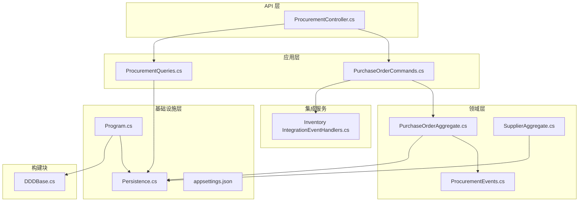
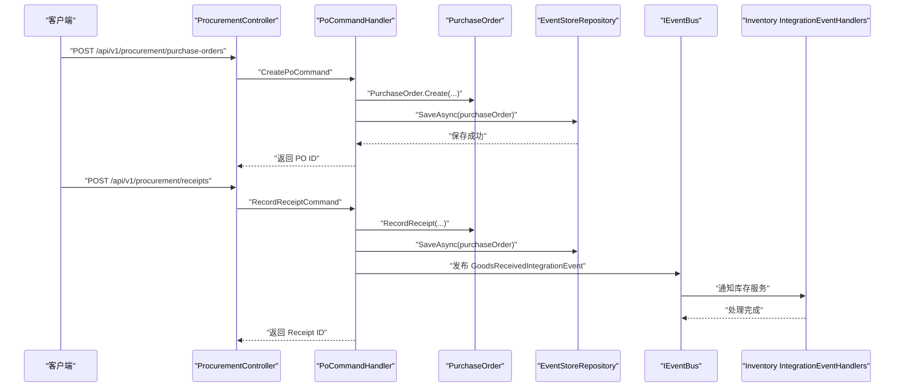
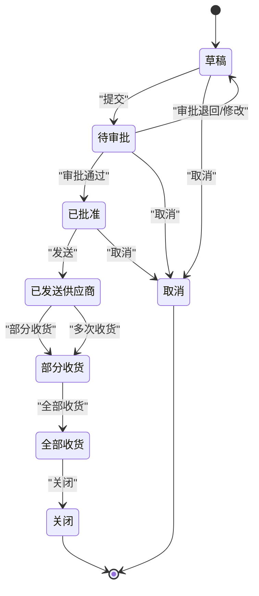
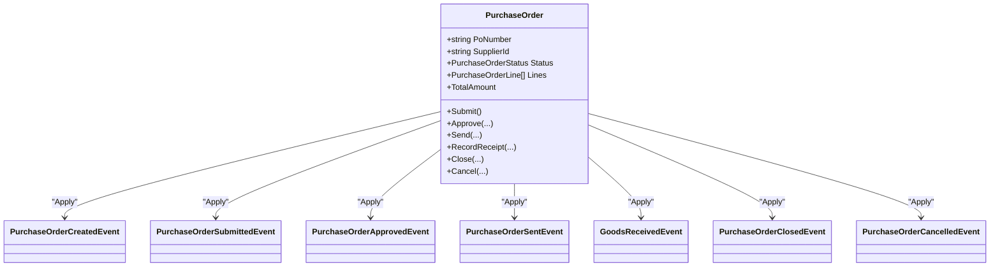
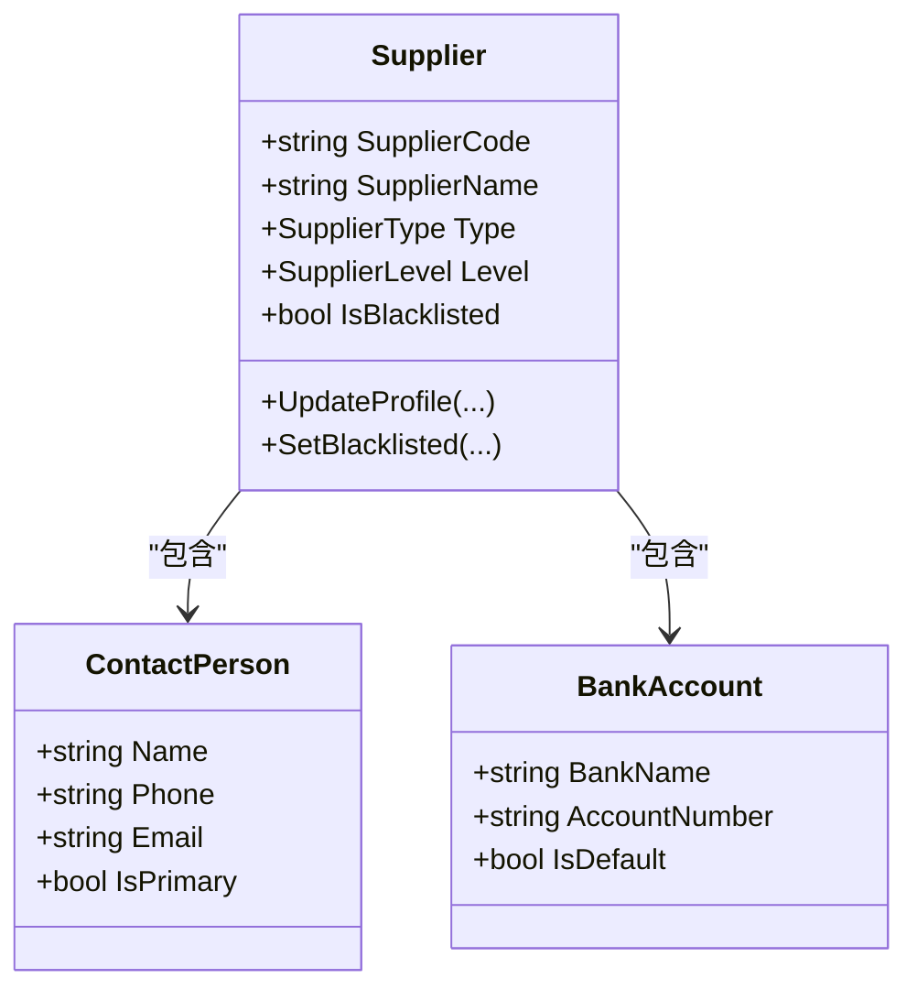
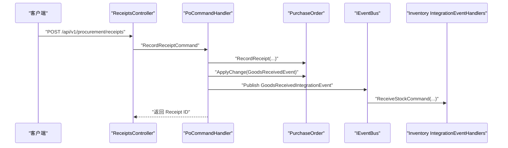
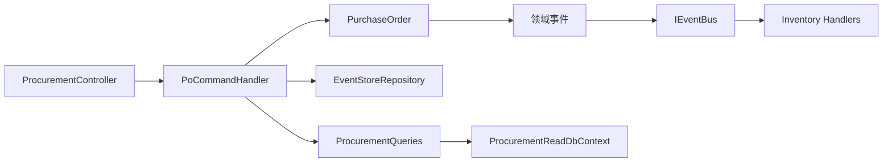
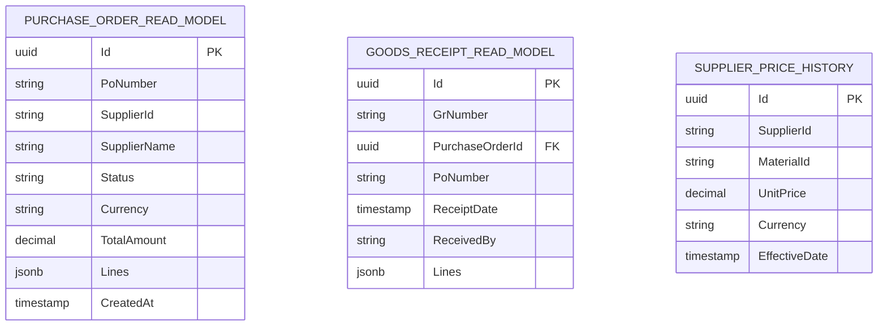

# 采购管理服务

<cite>
**本文引用的文件**
- [PurchaseOrderAggregate.cs](file://src/Services/Procurement/ErpSystem.Procurement/Domain/PurchaseOrderAggregate.cs)
- [ProcurementEvents.cs](file://src/Services/Procurement/ErpSystem.Procurement/Domain/ProcurementEvents.cs)
- [PurchaseOrderCommands.cs](file://src/Services/Procurement/ErpSystem.Procurement/Application/PurchaseOrderCommands.cs)
- [ProcurementQueries.cs](file://src/Services/Procurement/ErpSystem.Procurement/Application/ProcurementQueries.cs)
- [ProcurementController.cs](file://src/Services/Procurement/ErpSystem.Procurement/API/ProcurementController.cs)
- [Persistence.cs](file://src/Services/Procurement/ErpSystem.Procurement/Infrastructure/Persistence.cs)
- [Program.cs](file://src/Services/Procurement/ErpSystem.Procurement/Program.cs)
- [appsettings.json](file://src/Services/Procurement/ErpSystem.Procurement/appsettings.json)
- [DDDBase.cs](file://src/BuildingBlocks/ErpSystem.BuildingBlocks.Domain/DDDBase.cs)
- [SupplierAggregate.cs](file://src/Services/MasterData/ErpSystem.MasterData/Domain/SupplierAggregate.cs)
- [IntegrationEventHandlers.cs](file://src/Services/Inventory/ErpSystem.Inventory/Application/IntegrationEventHandlers.cs)
- [ProcurementToInventoryTests.cs](file://src/Tests/ErpSystem.IntegrationTests/ProcurementToInventoryTests.cs)
</cite>

## 目录
1. [简介](#简介)
2. [项目结构](#项目结构)
3. [核心组件](#核心组件)
4. [架构总览](#架构总览)
5. [详细组件分析](#详细组件分析)
6. [依赖分析](#依赖分析)
7. [性能考虑](#性能考虑)
8. [故障排查指南](#故障排查指南)
9. [结论](#结论)
10. [附录](#附录)

## 简介
本文件为采购管理服务（ErpSystem.Procurement）的微服务文档，聚焦于采购申请、采购订单、收货处理与供应商结算等核心流程。文档深入解析采购聚合根设计、事件驱动架构、状态机与审批机制、供应商关系管理、事件溯源与多级审批、以及与库存服务的集成。同时提供API接口设计、业务规则验证与异常处理机制说明。

## 项目结构
采购管理服务采用分层与领域驱动设计（DDD）组织代码，包含以下关键层次：
- API 层：控制器暴露REST端点，接收请求并调用应用层命令/查询。
- 应用层：命令处理器与查询处理器，协调聚合与读模型。
- 领域层：采购聚合根与领域事件，定义业务规则与状态变迁。
- 基础设施层：事件存储、读模型数据库、MediatR注册、事件总线集成。
- 构建块：事件溯源、出站消息、发布/订阅、中间件与可观测性。

**图表来源**
- [ProcurementController.cs](file://src/Services/Procurement/ErpSystem.Procurement/API/ProcurementController.cs#L1-L62)
- [PurchaseOrderCommands.cs](file://src/Services/Procurement/ErpSystem.Procurement/Application/PurchaseOrderCommands.cs#L1-L117)
- [ProcurementQueries.cs](file://src/Services/Procurement/ErpSystem.Procurement/Application/ProcurementQueries.cs#L1-L44)
- [PurchaseOrderAggregate.cs](file://src/Services/Procurement/ErpSystem.Procurement/Domain/PurchaseOrderAggregate.cs#L1-L199)
- [ProcurementEvents.cs](file://src/Services/Procurement/ErpSystem.Procurement/Domain/ProcurementEvents.cs#L1-L21)
- [SupplierAggregate.cs](file://src/Services/MasterData/ErpSystem.MasterData/Domain/SupplierAggregate.cs#L1-L125)
- [Persistence.cs](file://src/Services/Procurement/ErpSystem.Procurement/Infrastructure/Persistence.cs#L1-L66)
- [Program.cs](file://src/Services/Procurement/ErpSystem.Procurement/Program.cs#L1-L72)
- [DDDBase.cs](file://src/BuildingBlocks/ErpSystem.BuildingBlocks.Domain/DDDBase.cs#L1-L137)
- [IntegrationEventHandlers.cs](file://src/Services/Inventory/ErpSystem.Inventory/Application/IntegrationEventHandlers.cs#L1-L39)

**章节来源**
- [ProcurementController.cs](file://src/Services/Procurement/ErpSystem.Procurement/API/ProcurementController.cs#L1-L62)
- [Program.cs](file://src/Services/Procurement/ErpSystem.Procurement/Program.cs#L1-L72)
- [Persistence.cs](file://src/Services/Procurement/ErpSystem.Procurement/Infrastructure/Persistence.cs#L1-L66)

## 核心组件
- 采购聚合根：定义采购订单生命周期、状态机与业务规则；通过领域事件记录变更。
- 事件存储与读模型：基于事件溯源持久化聚合历史，并投影到读库供查询。
- 应用层命令/查询：封装业务操作与查询逻辑，负责编排与集成事件发布。
- 控制器：暴露REST API，统一请求参数与响应格式。
- 供应商聚合：维护供应商档案、联系人、银行账户、黑名单与等级等关系信息。
- 集成事件：在收货完成后向库存服务发布集成事件，触发库存更新。

**章节来源**
- [PurchaseOrderAggregate.cs](file://src/Services/Procurement/ErpSystem.Procurement/Domain/PurchaseOrderAggregate.cs#L85-L199)
- [ProcurementEvents.cs](file://src/Services/Procurement/ErpSystem.Procurement/Domain/ProcurementEvents.cs#L5-L21)
- [PurchaseOrderCommands.cs](file://src/Services/Procurement/ErpSystem.Procurement/Application/PurchaseOrderCommands.cs#L27-L117)
- [ProcurementQueries.cs](file://src/Services/Procurement/ErpSystem.Procurement/Application/ProcurementQueries.cs#L13-L44)
- [SupplierAggregate.cs](file://src/Services/MasterData/ErpSystem.MasterData/Domain/SupplierAggregate.cs#L66-L125)
- [Persistence.cs](file://src/Services/Procurement/ErpSystem.Procurement/Infrastructure/Persistence.cs#L33-L66)

## 架构总览
采购管理服务采用事件驱动架构，结合CQRS与事件溯源：
- 写模型：聚合根通过ApplyChange记录领域事件，事件存储持久化版本化事件流。
- 读模型：投影器将事件转换为只读实体，支持高效查询与搜索。
- 集成：通过事件总线发布集成事件，跨服务解耦协作（如库存更新）。

**图表来源**
- [ProcurementController.cs](file://src/Services/Procurement/ErpSystem.Procurement/API/ProcurementController.cs#L11-L61)
- [PurchaseOrderCommands.cs](file://src/Services/Procurement/ErpSystem.Procurement/Application/PurchaseOrderCommands.cs#L36-L97)
- [PurchaseOrderAggregate.cs](file://src/Services/Procurement/ErpSystem.Procurement/Domain/PurchaseOrderAggregate.cs#L127-L140)
- [ProcurementEvents.cs](file://src/Services/Procurement/ErpSystem.Procurement/Domain/ProcurementEvents.cs#L7-L19)
- [IntegrationEventHandlers.cs](file://src/Services/Inventory/ErpSystem.Inventory/Application/IntegrationEventHandlers.cs#L14-L32)

## 详细组件分析

### 采购聚合根与状态机
- 状态枚举：草稿、待审批、已批准、已发送供应商、部分收货、全部收货、关闭、取消。
- 关键方法与规则：
  - 提交：仅草稿可提交，进入待审批。
  - 审批：仅待审批可批准，进入已批准。
  - 发送：仅已批准可发送，进入已发送供应商。
  - 收货：仅已发送或部分收货允许收货，校验行号存在，累计收货数量并更新状态。
  - 关闭/取消：关闭无前置限制；取消仅在特定阶段且未收货时允许。
- 事件驱动应用：Apply方法根据事件更新内部状态与属性。

**图表来源**
- [PurchaseOrderAggregate.cs](file://src/Services/Procurement/ErpSystem.Procurement/Domain/PurchaseOrderAggregate.cs#L5-L15)
- [PurchaseOrderAggregate.cs](file://src/Services/Procurement/ErpSystem.Procurement/Domain/PurchaseOrderAggregate.cs#L109-L156)

**章节来源**
- [PurchaseOrderAggregate.cs](file://src/Services/Procurement/ErpSystem.Procurement/Domain/PurchaseOrderAggregate.cs#L85-L199)

### 事件驱动与事件溯源
- 领域事件：创建、提交、审批、发送、收货、关闭、取消等。
- 事件存储：EventStore将事件序列化为JSONB持久化，按版本递增。
- 读模型：使用EF Core投影写入只读表，支持复杂查询与分页。
- 事件总线：事件发布后由IPublisher与IEventBus分发，供订阅者处理。

**图表来源**
- [PurchaseOrderAggregate.cs](file://src/Services/Procurement/ErpSystem.Procurement/Domain/PurchaseOrderAggregate.cs#L33-L82)
- [PurchaseOrderAggregate.cs](file://src/Services/Procurement/ErpSystem.Procurement/Domain/PurchaseOrderAggregate.cs#L158-L197)

**章节来源**
- [DDDBase.cs](file://src/BuildingBlocks/ErpSystem.BuildingBlocks.Domain/DDDBase.cs#L59-L120)
- [Persistence.cs](file://src/Services/Procurement/ErpSystem.Procurement/Infrastructure/Persistence.cs#L6-L31)

### 供应商关系管理
- 供应商聚合包含类型、等级、黑名单状态、联系人与银行账户等。
- 通过领域事件更新档案与状态，支持供应商评估与准入控制。
- 采购订单关联供应商ID/名称，用于后续结算与对账。

**图表来源**
- [SupplierAggregate.cs](file://src/Services/MasterData/ErpSystem.MasterData/Domain/SupplierAggregate.cs#L66-L125)

**章节来源**
- [SupplierAggregate.cs](file://src/Services/MasterData/ErpSystem.MasterData/Domain/SupplierAggregate.cs#L13-L45)

### 收货处理与集成
- 收货接口：RecordReceiptCommand触发聚合收货，生成收货单ID并发布集成事件。
- 集成事件：GoodsReceivedIntegrationEvent携带物料、仓库、库位与数量，库存服务接收后入库。
- 测试验证：集成测试覆盖从创建PO到收货再到库存更新的完整链路。

**图表来源**
- [ProcurementController.cs](file://src/Services/Procurement/ErpSystem.Procurement/API/ProcurementController.cs#L57-L61)
- [PurchaseOrderCommands.cs](file://src/Services/Procurement/ErpSystem.Procurement/Application/PurchaseOrderCommands.cs#L72-L97)
- [PurchaseOrderAggregate.cs](file://src/Services/Procurement/ErpSystem.Procurement/Domain/PurchaseOrderAggregate.cs#L127-L140)
- [ProcurementEvents.cs](file://src/Services/Procurement/ErpSystem.Procurement/Domain/ProcurementEvents.cs#L7-L19)
- [IntegrationEventHandlers.cs](file://src/Services/Inventory/ErpSystem.Inventory/Application/IntegrationEventHandlers.cs#L14-L32)

**章节来源**
- [ProcurementToInventoryTests.cs](file://src/Tests/ErpSystem.IntegrationTests/ProcurementToInventoryTests.cs#L14-L78)

### 多级审批与合规控制
- 审批流程：提交→审批，审批通过后方可发送；取消仅限特定阶段且无收货。
- 合规校验：收货前校验行号存在于PO中；状态机严格约束操作顺序。
- 记录与审计：事件流保留完整操作轨迹，便于审计与追溯。

**章节来源**
- [PurchaseOrderAggregate.cs](file://src/Services/Procurement/ErpSystem.Procurement/Domain/PurchaseOrderAggregate.cs#L109-L156)

### API 接口设计
- 采购订单
  - POST /api/v1/procurement/purchase-orders：创建PO
  - GET /api/v1/procurement/purchase-orders：按供应商/状态分页查询
  - GET /api/v1/procurement/purchase-orders/{id}：按ID查询
  - POST /api/v1/procurement/purchase-orders/{id}/submit：提交
  - POST /api/v1/procurement/purchase-orders/{id}/approve：审批
  - POST /api/v1/procurement/purchase-orders/{id}/send：发送
  - POST /api/v1/procurement/purchase-orders/{id}/close：关闭
  - POST /api/v1/procurement/purchase-orders/{id}/cancel：取消
  - GET /api/v1/procurement/purchase-orders/prices：查询供应商价格历史
- 收货
  - POST /api/v1/procurement/receipts：记录收货

请求体示例（审批/发送）：
- 审批：{ "approvedBy": "...", "comment": "..." }
- 发送：{ "sentBy": "...", "method": "..." }

**章节来源**
- [ProcurementController.cs](file://src/Services/Procurement/ErpSystem.Procurement/API/ProcurementController.cs#L11-L61)
- [ProcurementQueries.cs](file://src/Services/Procurement/ErpSystem.Procurement/Application/ProcurementQueries.cs#L18-L42)

## 依赖分析
- 组件内聚与耦合
  - 控制器仅依赖MediatR，低耦合；命令处理器依赖仓储与事件总线，职责清晰。
  - 读模型与事件存储分离，降低写路径对读路径影响。
- 外部依赖
  - 数据库：PostgreSQL（Npgsql），事件存储与读模型分别使用独立上下文。
  - 事件总线：Dapr事件总线，支持发布/订阅。
  - 中间件：日志、健康检查、Swagger（开发环境）。
- 潜在循环依赖
  - 通过共享集成事件（ProcurementEvents）在同解决方案内引用，避免跨服务强耦合；若需完全解耦，建议在各自服务内维护本地拷贝。

**图表来源**
- [ProcurementController.cs](file://src/Services/Procurement/ErpSystem.Procurement/API/ProcurementController.cs#L9-L61)
- [PurchaseOrderCommands.cs](file://src/Services/Procurement/ErpSystem.Procurement/Application/PurchaseOrderCommands.cs#L27-L117)
- [ProcurementQueries.cs](file://src/Services/Procurement/ErpSystem.Procurement/Application/ProcurementQueries.cs#L13-L44)
- [Persistence.cs](file://src/Services/Procurement/ErpSystem.Procurement/Infrastructure/Persistence.cs#L20-L31)

**章节来源**
- [Program.cs](file://src/Services/Procurement/ErpSystem.Procurement/Program.cs#L15-L46)
- [appsettings.json](file://src/Services/Procurement/ErpSystem.Procurement/appsettings.json#L8-L10)

## 性能考虑
- 事件存储
  - 使用JSONB存储事件负载，版本号索引保证加载效率；批量保存减少往返。
- 查询优化
  - 读模型投影字段合理，查询条件支持按供应商ID与状态过滤；分页避免大结果集。
- 并发与一致性
  - 事件版本递增确保重放与一致性；聚合根ApplyChange保证状态原子更新。
- 异步处理
  - 集成事件发布异步进行，避免阻塞主流程；订阅者独立处理以提升吞吐。

[本节为通用性能指导，不直接分析具体文件]

## 故障排查指南
- 常见错误与定位
  - PO不存在：命令处理器在加载聚合失败时抛出KeyNotFoundException，检查ID与租户上下文。
  - 状态非法：违反状态机规则会抛出InvalidOperationException，核对当前状态与操作顺序。
  - 行号缺失：收货时若行号不在PO中抛出异常，检查收货明细与PO行号匹配。
- 日志与可观测性
  - 开发环境启用Swagger与中间件日志；生产环境建议接入分布式追踪与指标监控。
- 集成问题
  - 收货后库存未更新：确认事件总线可用、订阅者正确处理集成事件；参考集成测试验证端到端链路。

**章节来源**
- [PurchaseOrderCommands.cs](file://src/Services/Procurement/ErpSystem.Procurement/Application/PurchaseOrderCommands.cs#L47-L58)
- [PurchaseOrderAggregate.cs](file://src/Services/Procurement/ErpSystem.Procurement/Domain/PurchaseOrderAggregate.cs#L111-L137)
- [ProcurementToInventoryTests.cs](file://src/Tests/ErpSystem.IntegrationTests/ProcurementToInventoryTests.cs#L14-L78)

## 结论
采购管理服务通过事件驱动与CQRS实现高内聚、低耦合的领域模型，结合事件溯源与读模型投影，满足复杂的采购流程与审计需求。状态机与严格的业务规则保障流程合规，集成事件实现与库存服务的松耦合协作。建议在生产环境中进一步完善事件契约共享、幂等处理与异常恢复策略，持续提升系统韧性与可观测性。

[本节为总结性内容，不直接分析具体文件]

## 附录

### 数据模型与读模型
- 采购订单读模型：包含PO编号、供应商信息、状态、币种、金额、行明细与创建时间。
- 收货读模型：包含收货单编号、关联PO、收货日期、经手人与行明细。
- 价格历史：按物料与供应商维度记录单价与生效日期。

**图表来源**
- [Persistence.cs](file://src/Services/Procurement/ErpSystem.Procurement/Infrastructure/Persistence.cs#L33-L66)

**章节来源**
- [Persistence.cs](file://src/Services/Procurement/ErpSystem.Procurement/Infrastructure/Persistence.cs#L20-L66)