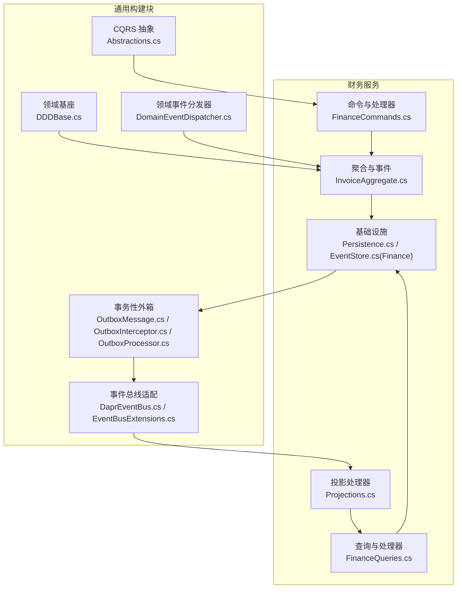
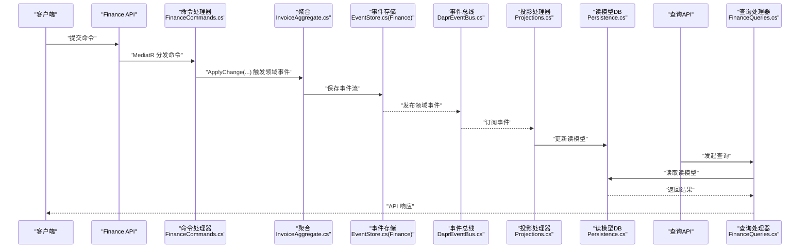
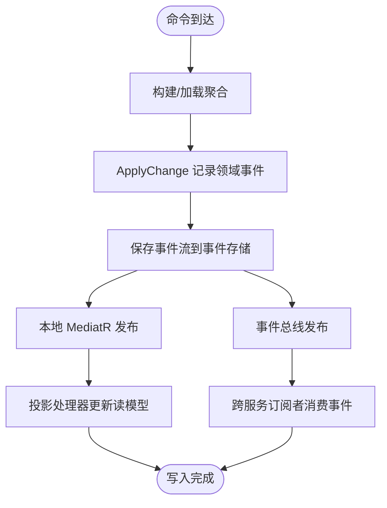
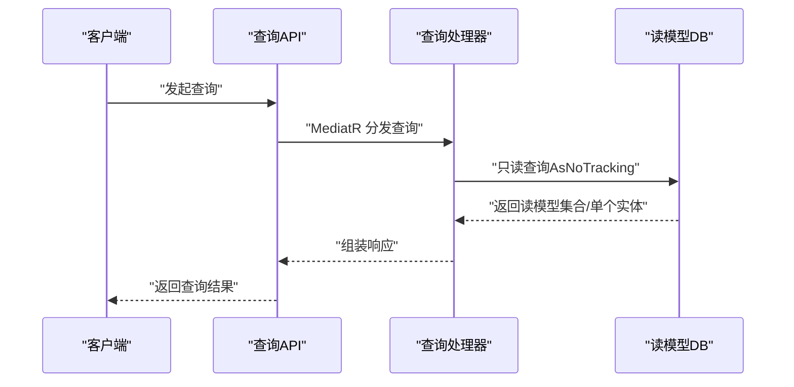
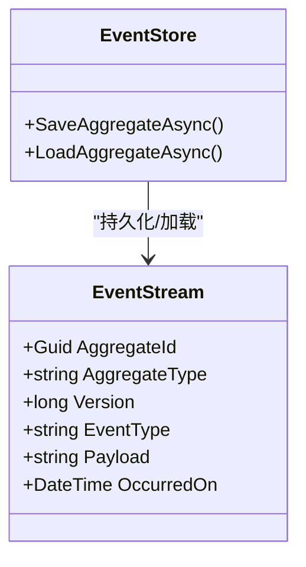
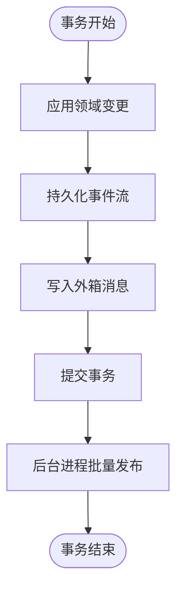
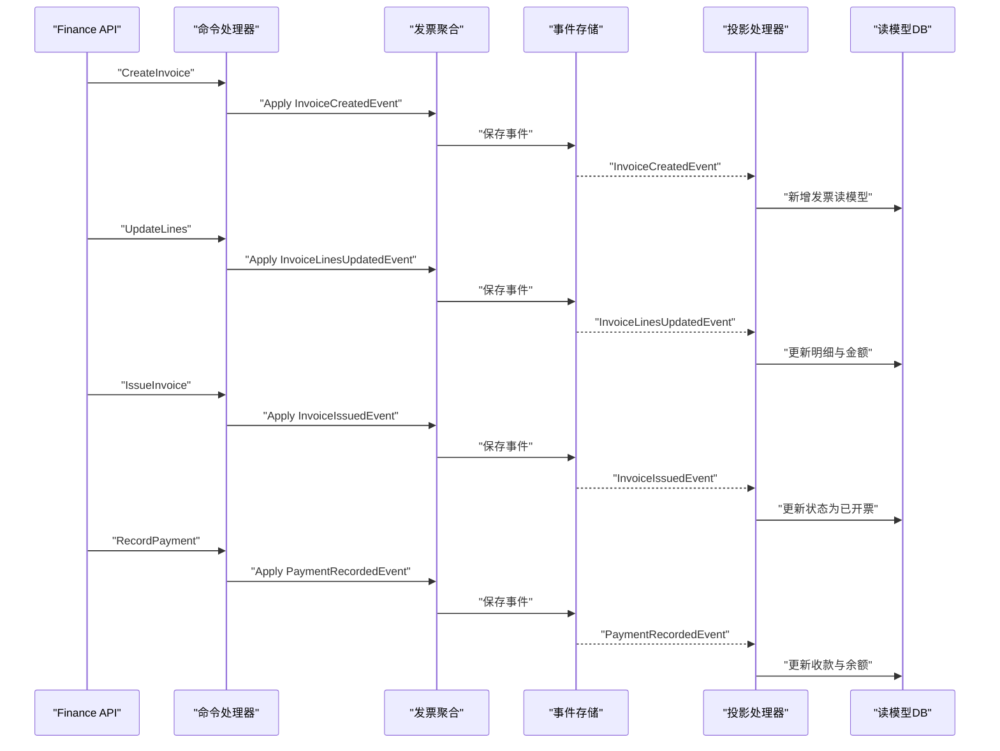
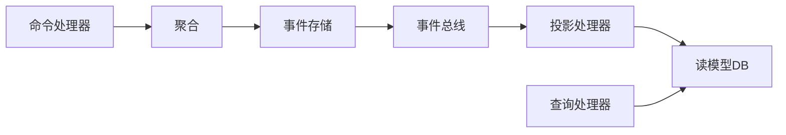

# 数据流设计

<cite>
**本文引用的文件**
- [Abstractions.cs](file://src/BuildingBlocks/ErpSystem.BuildingBlocks/CQRS/Abstractions.cs)
- [DomainEventDispatcher.cs](file://src/BuildingBlocks/ErpSystem.BuildingBlocks/Domain/DomainEventDispatcher.cs)
- [DDDBase.cs](file://src/BuildingBlocks/ErpSystem.BuildingBlocks/Domain/DDDBase.cs)
- [OutboxMessage.cs](file://src/BuildingBlocks/ErpSystem.BuildingBlocks/Outbox/OutboxMessage.cs)
- [OutboxInterceptor.cs](file://src/BuildingBlocks/ErpSystem.BuildingBlocks/Outbox/OutboxInterceptor.cs)
- [OutboxProcessor.cs](file://src/BuildingBlocks/ErpSystem.BuildingBlocks/Outbox/OutboxProcessor.cs)
- [DaprEventBus.cs](file://src/BuildingBlocks/ErpSystem.BuildingBlocks/EventBus/DaprEventBus.cs)
- [EventBusExtensions.cs](file://src/BuildingBlocks/ErpSystem.BuildingBlocks/EventBus/EventBusExtensions.cs)
- [InvoiceAggregate.cs](file://src/Services/Finance/ErpSystem.Finance/Domain/InvoiceAggregate.cs)
- [Persistence.cs](file://src/Services/Finance/ErpSystem.Finance/Infrastructure/Persistence.cs)
- [Projections.cs](file://src/Services/Finance/ErpSystem.Finance/Infrastructure/Projections.cs)
- [FinanceCommands.cs](file://src/Services/Finance/ErpSystem.Finance/Application/FinanceCommands.cs)
- [FinanceQueries.cs](file://src/Services/Finance/ErpSystem.Finance/Application/FinanceQueries.cs)
- [EventStore.cs (Finance)](file://src/Services/Finance/ErpSystem.Finance/Infrastructure/EventStore.cs)
- [EventStore.cs (MasterData)](file://src/Services/MasterData/ErpSystem.MasterData/Infrastructure/EventStore.cs)
- [EventStore.cs (Identity)](file://src/Services/Identity/ErpSystem.Identity/Infrastructure/EventStore.cs)
</cite>

## 目录
1. [引言](#引言)
2. [项目结构](#项目结构)
3. [核心组件](#核心组件)
4. [架构总览](#架构总览)
5. [详细组件分析](#详细组件分析)
6. [依赖关系分析](#依赖关系分析)
7. [性能考量](#性能考量)
8. [故障排查指南](#故障排查指南)
9. [结论](#结论)
10. [附录](#附录)

## 引言
本文件面向ERP系统，围绕“写入路径（命令→聚合→事件存储→事件发布）”与“读取路径（查询→读模型→数据库→API响应）”进行系统化数据流设计说明。重点阐述CQRS模式在本仓库中的实现方式、读写分离策略、事件存储与投影机制、快照与数据迁移思路、一致性保障、事务处理与并发控制，并通过流程图与序列图展示典型业务场景的数据流转。

## 项目结构
本项目采用多服务微架构，每个业务域（如财务、库存、销售等）独立为服务，共享通用构建块（BuildingBlocks）。Finance服务作为CQRS与事件驱动的典型范例，展示了命令处理、领域建模、事件存储、读模型投影与查询端的完整闭环。

图表来源
- [Abstractions.cs](file://src/BuildingBlocks/ErpSystem.BuildingBlocks/CQRS/Abstractions.cs#L1-L39)
- [DDDBase.cs](file://src/BuildingBlocks/ErpSystem.BuildingBlocks/Domain/DDDBase.cs#L1-L137)
- [DomainEventDispatcher.cs](file://src/BuildingBlocks/ErpSystem.BuildingBlocks/Domain/DomainEventDispatcher.cs#L1-L72)
- [OutboxMessage.cs](file://src/BuildingBlocks/ErpSystem.BuildingBlocks/Outbox/OutboxMessage.cs#L1-L82)
- [OutboxInterceptor.cs](file://src/BuildingBlocks/ErpSystem.BuildingBlocks/Outbox/OutboxInterceptor.cs#L1-L51)
- [OutboxProcessor.cs](file://src/BuildingBlocks/ErpSystem.BuildingBlocks/Outbox/OutboxProcessor.cs#L1-L72)
- [DaprEventBus.cs](file://src/BuildingBlocks/ErpSystem.BuildingBlocks/EventBus/DaprEventBus.cs#L1-L31)
- [EventBusExtensions.cs](file://src/BuildingBlocks/ErpSystem.BuildingBlocks/EventBus/EventBusExtensions.cs#L1-L15)
- [FinanceCommands.cs](file://src/Services/Finance/ErpSystem.Finance/Application/FinanceCommands.cs#L1-L142)
- [InvoiceAggregate.cs](file://src/Services/Finance/ErpSystem.Finance/Domain/InvoiceAggregate.cs#L1-L176)
- [Persistence.cs](file://src/Services/Finance/ErpSystem.Finance/Infrastructure/Persistence.cs#L1-L132)
- [EventStore.cs (Finance)](file://src/Services/Finance/ErpSystem.Finance/Infrastructure/EventStore.cs#L1-L18)
- [Projections.cs](file://src/Services/Finance/ErpSystem.Finance/Infrastructure/Projections.cs#L1-L122)
- [FinanceQueries.cs](file://src/Services/Finance/ErpSystem.Finance/Application/FinanceQueries.cs#L1-L111)

章节来源
- [Abstractions.cs](file://src/BuildingBlocks/ErpSystem.BuildingBlocks/CQRS/Abstractions.cs#L1-L39)
- [DDDBase.cs](file://src/BuildingBlocks/ErpSystem.BuildingBlocks/Domain/DDDBase.cs#L1-L137)
- [DomainEventDispatcher.cs](file://src/BuildingBlocks/ErpSystem.BuildingBlocks/Domain/DomainEventDispatcher.cs#L1-L72)
- [OutboxMessage.cs](file://src/BuildingBlocks/ErpSystem.BuildingBlocks/Outbox/OutboxMessage.cs#L1-L82)
- [OutboxInterceptor.cs](file://src/BuildingBlocks/ErpSystem.BuildingBlocks/Outbox/OutboxInterceptor.cs#L1-L51)
- [OutboxProcessor.cs](file://src/BuildingBlocks/ErpSystem.BuildingBlocks/Outbox/OutboxProcessor.cs#L1-L72)
- [DaprEventBus.cs](file://src/BuildingBlocks/ErpSystem.BuildingBlocks/EventBus/DaprEventBus.cs#L1-L31)
- [EventBusExtensions.cs](file://src/BuildingBlocks/ErpSystem.BuildingBlocks/EventBus/EventBusExtensions.cs#L1-L15)
- [FinanceCommands.cs](file://src/Services/Finance/ErpSystem.Finance/Application/FinanceCommands.cs#L1-L142)
- [InvoiceAggregate.cs](file://src/Services/Finance/ErpSystem.Finance/Domain/InvoiceAggregate.cs#L1-L176)
- [Persistence.cs](file://src/Services/Finance/ErpSystem.Finance/Infrastructure/Persistence.cs#L1-L132)
- [EventStore.cs (Finance)](file://src/Services/Finance/ErpSystem.Finance/Infrastructure/EventStore.cs#L1-L18)
- [Projections.cs](file://src/Services/Finance/ErpSystem.Finance/Infrastructure/Projections.cs#L1-L122)
- [FinanceQueries.cs](file://src/Services/Finance/ErpSystem.Finance/Application/FinanceQueries.cs#L1-L111)

## 核心组件
- CQRS抽象：定义命令、查询及其处理器接口，统一请求/响应契约。
- 领域基座：聚合根、事件流、事件存储与加载、变更应用。
- 领域事件分发器：在EF保存后自动收集并发布聚合产生的领域事件。
- 事务性外箱：与领域变更同事务持久化事件消息，异步投递到事件总线。
- 事件总线：封装Dapr Pub/Sub或占位实现，按事件类型发布。
- 财务聚合与事件：发票聚合及状态演进事件，体现DDD与事件溯源思想。
- 基础设施：事件存储DB（JSONB）、读模型DB（发票、付款、总账等）。
- 投影处理器：监听领域事件，更新读模型。
- 应用命令/查询：命令处理写入，查询处理读取。

章节来源
- [Abstractions.cs](file://src/BuildingBlocks/ErpSystem.BuildingBlocks/CQRS/Abstractions.cs#L1-L39)
- [DDDBase.cs](file://src/BuildingBlocks/ErpSystem.BuildingBlocks/Domain/DDDBase.cs#L1-L137)
- [DomainEventDispatcher.cs](file://src/BuildingBlocks/ErpSystem.BuildingBlocks/Domain/DomainEventDispatcher.cs#L1-L72)
- [OutboxMessage.cs](file://src/BuildingBlocks/ErpSystem.BuildingBlocks/Outbox/OutboxMessage.cs#L1-L82)
- [OutboxProcessor.cs](file://src/BuildingBlocks/ErpSystem.BuildingBlocks/Outbox/OutboxProcessor.cs#L1-L72)
- [DaprEventBus.cs](file://src/BuildingBlocks/ErpSystem.BuildingBlocks/EventBus/DaprEventBus.cs#L1-L31)
- [InvoiceAggregate.cs](file://src/Services/Finance/ErpSystem.Finance/Domain/InvoiceAggregate.cs#L1-L176)
- [Persistence.cs](file://src/Services/Finance/ErpSystem.Finance/Infrastructure/Persistence.cs#L1-L132)
- [Projections.cs](file://src/Services/Finance/ErpSystem.Finance/Infrastructure/Projections.cs#L1-L122)
- [FinanceCommands.cs](file://src/Services/Finance/ErpSystem.Finance/Application/FinanceCommands.cs#L1-L142)
- [FinanceQueries.cs](file://src/Services/Finance/ErpSystem.Finance/Application/FinanceQueries.cs#L1-L111)

## 架构总览
下图展示从命令到读模型的完整数据流，涵盖写入与读取两条主线：

图表来源
- [FinanceCommands.cs](file://src/Services/Finance/ErpSystem.Finance/Application/FinanceCommands.cs#L1-L142)
- [InvoiceAggregate.cs](file://src/Services/Finance/ErpSystem.Finance/Domain/InvoiceAggregate.cs#L1-L176)
- [DDDBase.cs](file://src/BuildingBlocks/ErpSystem.BuildingBlocks/Domain/DDDBase.cs#L59-L120)
- [DaprEventBus.cs](file://src/BuildingBlocks/ErpSystem.BuildingBlocks/EventBus/DaprEventBus.cs#L1-L31)
- [Projections.cs](file://src/Services/Finance/ErpSystem.Finance/Infrastructure/Projections.cs#L1-L122)
- [Persistence.cs](file://src/Services/Finance/ErpSystem.Finance/Infrastructure/Persistence.cs#L1-L132)
- [FinanceQueries.cs](file://src/Services/Finance/ErpSystem.Finance/Application/FinanceQueries.cs#L1-L111)

## 详细组件分析

### 写入路径：命令→聚合→事件存储→事件发布
- 命令与处理器：命令对象由MediatR路由至对应处理器；处理器加载/创建聚合，应用业务规则，触发领域事件。
- 聚合与事件：聚合根维护内部状态与未提交变更列表；ApplyChange负责应用事件并记录变更。
- 事件存储：事件存储以聚合ID+版本号为主键，事件以JSONB持久化；加载时按版本顺序重建聚合状态。
- 事件发布：事件保存后，通过publisher与事件总线分别向本地处理器与跨服务订阅者发布。

图表来源
- [FinanceCommands.cs](file://src/Services/Finance/ErpSystem.Finance/Application/FinanceCommands.cs#L53-L140)
- [InvoiceAggregate.cs](file://src/Services/Finance/ErpSystem.Finance/Domain/InvoiceAggregate.cs#L142-L174)
- [DDDBase.cs](file://src/BuildingBlocks/ErpSystem.BuildingBlocks/Domain/DDDBase.cs#L59-L120)
- [DaprEventBus.cs](file://src/BuildingBlocks/ErpSystem.BuildingBlocks/EventBus/DaprEventBus.cs#L11-L21)

章节来源
- [FinanceCommands.cs](file://src/Services/Finance/ErpSystem.Finance/Application/FinanceCommands.cs#L1-L142)
- [InvoiceAggregate.cs](file://src/Services/Finance/ErpSystem.Finance/Domain/InvoiceAggregate.cs#L1-L176)
- [DDDBase.cs](file://src/BuildingBlocks/ErpSystem.BuildingBlocks/Domain/DDDBase.cs#L1-L137)
- [DaprEventBus.cs](file://src/BuildingBlocks/ErpSystem.BuildingBlocks/EventBus/DaprEventBus.cs#L1-L31)

### 读取路径：查询→读模型→数据库→API响应
- 查询处理器：接收查询请求，使用只读查询（AsNoTracking）访问读模型数据库。
- 读模型：针对不同报表与界面需求，设计专用读模型（如发票、付款、总账等），支持高效筛选与聚合。
- API响应：查询结果经API控制器返回给前端或调用方。

图表来源
- [FinanceQueries.cs](file://src/Services/Finance/ErpSystem.Finance/Application/FinanceQueries.cs#L24-L110)
- [Persistence.cs](file://src/Services/Finance/ErpSystem.Finance/Infrastructure/Persistence.cs#L20-L50)

章节来源
- [FinanceQueries.cs](file://src/Services/Finance/ErpSystem.Finance/Application/FinanceQueries.cs#L1-L111)
- [Persistence.cs](file://src/Services/Finance/ErpSystem.Finance/Infrastructure/Persistence.cs#L1-L132)

### CQRS 实现与读写分离
- 命令侧：使用事件存储与领域事件，确保业务状态演进可追溯。
- 查询侧：独立读模型数据库，支持复杂查询与报表，避免读写竞争。
- 事务边界：命令写入在事件存储事务内完成；读取在读模型数据库上执行，无写入冲突。

章节来源
- [Abstractions.cs](file://src/BuildingBlocks/ErpSystem.BuildingBlocks/CQRS/Abstractions.cs#L1-L39)
- [FinanceCommands.cs](file://src/Services/Finance/ErpSystem.Finance/Application/FinanceCommands.cs#L1-L142)
- [FinanceQueries.cs](file://src/Services/Finance/ErpSystem.Finance/Application/FinanceQueries.cs#L1-L111)
- [Persistence.cs](file://src/Services/Finance/ErpSystem.Finance/Infrastructure/Persistence.cs#L1-L132)

### 事件存储设计与事件发布
- 事件存储表：以聚合ID+版本为主键，事件体为JSONB，便于扩展与反序列化。
- 加载流程：按版本升序加载事件，逐条应用以重建聚合状态。
- 发布策略：本地通过MediatR发布，跨服务通过事件总线发布。

图表来源
- [DDDBase.cs](file://src/BuildingBlocks/ErpSystem.BuildingBlocks/Domain/DDDBase.cs#L43-L51)
- [DDDBase.cs](file://src/BuildingBlocks/ErpSystem.BuildingBlocks/Domain/DDDBase.cs#L59-L120)

章节来源
- [DDDBase.cs](file://src/BuildingBlocks/ErpSystem.BuildingBlocks/Domain/DDDBase.cs#L1-L137)
- [EventStore.cs (Finance)](file://src/Services/Finance/ErpSystem.Finance/Infrastructure/EventStore.cs#L1-L18)
- [EventStore.cs (MasterData)](file://src/Services/MasterData/ErpSystem.MasterData/Infrastructure/EventStore.cs#L1-L19)
- [EventStore.cs (Identity)](file://src/Services/Identity/ErpSystem.Identity/Infrastructure/EventStore.cs#L1-L19)

### 快照机制与数据迁移策略
- 快照建议：对高版本历史的聚合，可定期生成快照以减少重建成本；加载时优先选择最近快照，再重放后续事件。
- 迁移策略：事件类型命名与负载结构变更需保持向后兼容；通过事件类型解析器与版本化事件负载实现平滑迁移。
- 读模型迁移：读模型表结构变更通过迁移脚本或EF Migrations管理，配合投影处理器的幂等更新逻辑。

章节来源
- [DDDBase.cs](file://src/BuildingBlocks/ErpSystem.BuildingBlocks/Domain/DDDBase.cs#L101-L119)

### 数据一致性、事务与并发控制
- 本地一致性：命令写入与事件发布在同一事务中完成，确保事件不丢失。
- 外箱可靠性：事件消息与领域变更同事务持久化，后台进程批量投递，失败重试与错误记录。
- 并发控制：聚合版本号用于冲突检测；读模型更新采用乐观锁或唯一索引约束，防止竞态。
- 事务边界：命令处理在事件存储DB内完成；读模型更新在读模型DB内完成，二者隔离。

图表来源
- [OutboxMessage.cs](file://src/BuildingBlocks/ErpSystem.BuildingBlocks/Outbox/OutboxMessage.cs#L22-L48)
- [OutboxProcessor.cs](file://src/BuildingBlocks/ErpSystem.BuildingBlocks/Outbox/OutboxProcessor.cs#L29-L70)
- [DDDBase.cs](file://src/BuildingBlocks/ErpSystem.BuildingBlocks/Domain/DDDBase.cs#L62-L99)

章节来源
- [OutboxMessage.cs](file://src/BuildingBlocks/ErpSystem.BuildingBlocks/Outbox/OutboxMessage.cs#L1-L82)
- [OutboxProcessor.cs](file://src/BuildingBlocks/ErpSystem.BuildingBlocks/Outbox/OutboxProcessor.cs#L1-L72)
- [DDDBase.cs](file://src/BuildingBlocks/ErpSystem.BuildingBlocks/Domain/DDDBase.cs#L1-L137)

### 典型业务场景：发票生命周期
- 场景描述：创建发票→更新明细→开票→收款→核销/作废。
- 数据流要点：每一步均产生领域事件，事件驱动读模型更新；查询端实时反映最新状态。

图表来源
- [FinanceCommands.cs](file://src/Services/Finance/ErpSystem.Finance/Application/FinanceCommands.cs#L53-L124)
- [InvoiceAggregate.cs](file://src/Services/Finance/ErpSystem.Finance/Domain/InvoiceAggregate.cs#L85-L140)
- [Projections.cs](file://src/Services/Finance/ErpSystem.Finance/Infrastructure/Projections.cs#L17-L78)

章节来源
- [FinanceCommands.cs](file://src/Services/Finance/ErpSystem.Finance/Application/FinanceCommands.cs#L1-L142)
- [InvoiceAggregate.cs](file://src/Services/Finance/ErpSystem.Finance/Domain/InvoiceAggregate.cs#L1-L176)
- [Projections.cs](file://src/Services/Finance/ErpSystem.Finance/Infrastructure/Projections.cs#L1-L122)

## 依赖关系分析
- 组件耦合：命令/查询依赖CQRS抽象；聚合依赖领域基座；事件存储与事件总线解耦投影。
- 外部依赖：事件总线当前注册为占位实现，便于开发测试；生产环境可替换为真实Dapr Pub/Sub。
- 循环依赖：未见直接循环依赖；事件驱动的投影形成单向数据流。

图表来源
- [FinanceCommands.cs](file://src/Services/Finance/ErpSystem.Finance/Application/FinanceCommands.cs#L1-L142)
- [InvoiceAggregate.cs](file://src/Services/Finance/ErpSystem.Finance/Domain/InvoiceAggregate.cs#L1-L176)
- [DDDBase.cs](file://src/BuildingBlocks/ErpSystem.BuildingBlocks/Domain/DDDBase.cs#L59-L120)
- [DaprEventBus.cs](file://src/BuildingBlocks/ErpSystem.BuildingBlocks/EventBus/DaprEventBus.cs#L1-L31)
- [Projections.cs](file://src/Services/Finance/ErpSystem.Finance/Infrastructure/Projections.cs#L1-L122)
- [FinanceQueries.cs](file://src/Services/Finance/ErpSystem.Finance/Application/FinanceQueries.cs#L1-L111)

章节来源
- [EventBusExtensions.cs](file://src/BuildingBlocks/ErpSystem.BuildingBlocks/EventBus/EventBusExtensions.cs#L1-L15)
- [DaprEventBus.cs](file://src/BuildingBlocks/ErpSystem.BuildingBlocks/EventBus/DaprEventBus.cs#L1-L31)

## 性能考量
- 事件存储：JSONB字段便于扩展，但需合理索引；建议对常用过滤字段建立索引。
- 读模型：针对高频查询字段建立索引；使用AsNoTracking提升查询性能。
- 外箱批处理：后台进程批量处理，降低峰值压力；合理设置批次大小与延迟。
- 并发与锁：聚合版本号与读模型唯一约束减少冲突；必要时引入乐观锁字段。

## 故障排查指南
- 事件未发布：检查事件存储是否成功保存、事件总线实现是否启用、投影处理器是否注册。
- 读模型不同步：确认外箱消息是否被正确处理、投影处理器异常日志、读模型更新是否幂等。
- 查询性能差：检查查询是否使用AsNoTracking、是否缺少必要索引、是否进行了不必要的联表。
- 事务失败：查看外箱消息错误字段与重试次数，定位具体事件与处理逻辑。

章节来源
- [OutboxMessage.cs](file://src/BuildingBlocks/ErpSystem.BuildingBlocks/Outbox/OutboxMessage.cs#L34-L48)
- [OutboxProcessor.cs](file://src/BuildingBlocks/ErpSystem.BuildingBlocks/Outbox/OutboxProcessor.cs#L12-L70)
- [Projections.cs](file://src/Services/Finance/ErpSystem.Finance/Infrastructure/Projections.cs#L1-L122)
- [FinanceQueries.cs](file://src/Services/Finance/ErpSystem.Finance/Application/FinanceQueries.cs#L1-L111)

## 结论
本系统以CQRS为核心，结合事件存储与投影机制，实现了清晰的读写分离与事件驱动的数据流。通过事务性外箱与事件总线，确保跨服务的一致性与可靠性。读模型针对查询优化，具备良好的扩展性与可维护性。建议在生产环境中完善事件总线配置、监控与告警体系，并持续优化读模型索引与查询性能。

## 附录
- 术语
  - 聚合：包含业务不变量的对象单元，维护内部状态与未提交变更。
  - 事件存储：以事件流形式持久化聚合状态演进的历史。
  - 读模型：为查询优化而设计的投影视图，通常与聚合结构不同。
  - 外箱：与业务事务同提交的消息缓冲区，用于可靠投递。