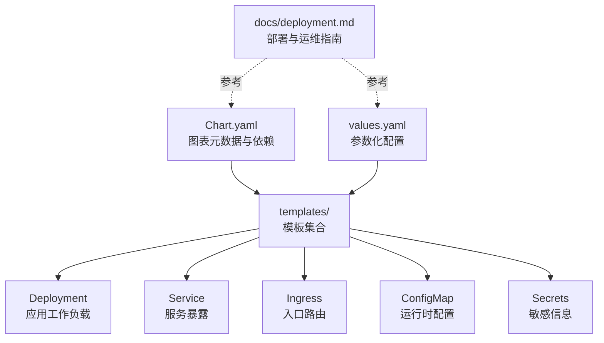
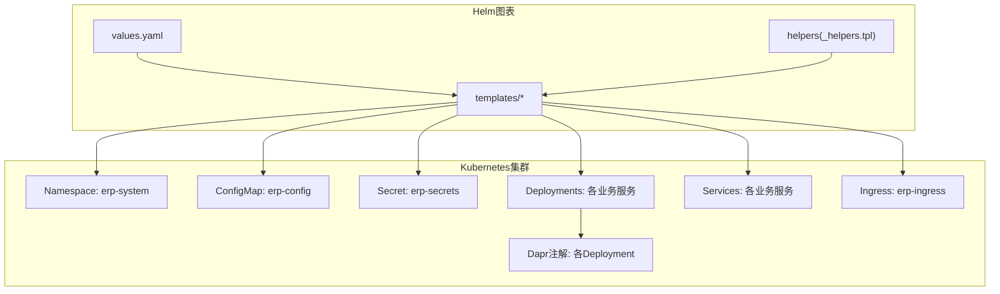
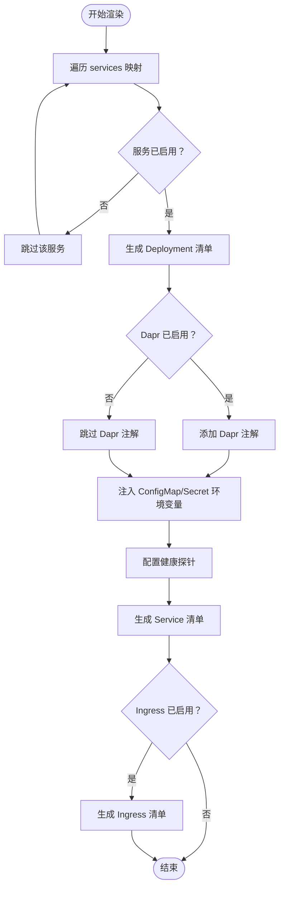

# Helm图表管理

<cite>
**本文档引用的文件**
- [Chart.yaml](file://deploy/helm/erp-system/Chart.yaml)
- [values.yaml](file://deploy/helm/erp-system/values.yaml)
- [_helpers.tpl](file://deploy/helm/erp-system/templates/_helpers.tpl)
- [deployment.yaml](file://deploy/helm/erp-system/templates/deployment.yaml)
- [service.yaml](file://deploy/helm/erp-system/templates/service.yaml)
- [configmap.yaml](file://deploy/helm/erp-system/templates/configmap.yaml)
- [ingress.yaml](file://deploy/helm/erp-system/templates/ingress.yaml)
- [deployment.md](file://docs/deployment.md)
- [configmap.yaml](file://deploy/k8s/configmap.yaml)
- [secrets.yaml](file://deploy/k8s/secrets.yaml)
- [ingress.yaml](file://deploy/k8s/ingress.yaml)
- [namespace.yaml](file://deploy/k8s/namespace.yaml)
</cite>

## 目录
1. [简介](#简介)
2. [项目结构](#项目结构)
3. [核心组件](#核心组件)
4. [架构总览](#架构总览)
5. [详细组件分析](#详细组件分析)
6. [依赖关系分析](#依赖关系分析)
7. [性能考虑](#性能考虑)
8. [故障排除指南](#故障排除指南)
9. [结论](#结论)
10. [附录](#附录)

## 简介
本文件面向运维与开发团队，系统性阐述该ERP微服务项目的Helm图表管理实践，涵盖图表结构、Chart.yaml配置、依赖管理、values.yaml参数化与环境覆盖、模板渲染与条件/循环逻辑、版本与发布策略、升级回滚流程、以及与Kubernetes资源（含ConfigMap、Secret、Ingress）的集成方式。同时提供命令行操作与最佳实践建议，帮助在不同环境中稳定交付与演进。

## 项目结构
该Helm图表位于 deploy/helm/erp-system，采用“应用型图表（application）”组织方式，包含以下关键文件：
- Chart.yaml：图表元数据、版本、关键字、维护者与依赖声明
- values.yaml：全局与服务级参数、数据库/缓存/网关等配置
- templates/：模板集合，通过Helm模板语法生成Kubernetes清单
- docs/deployment.md：部署与运维指南（命令示例、验证步骤）

**图示来源**
- [Chart.yaml](file://deploy/helm/erp-system/Chart.yaml#L1-L27)
- [values.yaml](file://deploy/helm/erp-system/values.yaml#L1-L127)
- [deployment.yaml](file://deploy/helm/erp-system/templates/deployment.yaml#L1-L58)
- [service.yaml](file://deploy/helm/erp-system/templates/service.yaml#L1-L22)
- [ingress.yaml](file://deploy/helm/erp-system/templates/ingress.yaml#L1-L47)
- [configmap.yaml](file://deploy/helm/erp-system/templates/configmap.yaml#L1-L20)
- [deployment.md](file://docs/deployment.md#L1-L115)

**章节来源**
- [Chart.yaml](file://deploy/helm/erp-system/Chart.yaml#L1-L27)
- [values.yaml](file://deploy/helm/erp-system/values.yaml#L1-L127)
- [deployment.md](file://docs/deployment.md#L1-L115)

## 核心组件
- 图表元数据与依赖
  - 图表名称、版本、应用版本、类型、关键字、维护者信息
  - 依赖项：Bitnami Redis与PostgreSQL，支持按条件启用
- 参数化配置
  - 全局命名空间、镜像仓库、拉取密钥
  - 通用资源请求/限制、服务级副本数与镜像配置
  - Ingress开关、主机名、TLS、类名
  - 数据库与缓存启用与认证参数
  - Dapr开关与组件绑定
  - 环境变量（如ASPNETCORE_ENVIRONMENT）
- 模板渲染
  - 使用Helm模板函数与控制结构实现条件渲染与循环
  - 通过辅助模板统一标签、选择器与名称规范

**章节来源**
- [Chart.yaml](file://deploy/helm/erp-system/Chart.yaml#L1-L27)
- [values.yaml](file://deploy/helm/erp-system/values.yaml#L1-L127)
- [_helpers.tpl](file://deploy/helm/erp-system/templates/_helpers.tpl#L1-L51)

## 架构总览
Helm图表将values.yaml中的参数注入到模板中，生成一组Kubernetes资源，包括应用Deployment、Service、Ingress，以及ConfigMap与Secret。Dapr通过注解启用，连接到Redis作为状态与消息组件；PostgreSQL用于持久化。

**图示来源**
- [values.yaml](file://deploy/helm/erp-system/values.yaml#L1-L127)
- [_helpers.tpl](file://deploy/helm/erp-system/templates/_helpers.tpl#L1-L51)
- [deployment.yaml](file://deploy/helm/erp-system/templates/deployment.yaml#L1-L58)
- [service.yaml](file://deploy/helm/erp-system/templates/service.yaml#L1-L22)
- [ingress.yaml](file://deploy/helm/erp-system/templates/ingress.yaml#L1-L47)
- [configmap.yaml](file://deploy/helm/erp-system/templates/configmap.yaml#L1-L20)

## 详细组件分析

### Chart.yaml：图表元数据与依赖
- 元数据：应用型图表、版本与应用版本、关键字、维护者
- 依赖：Redis与PostgreSQL，均来自Bitnami仓库，支持通过values中的enabled字段按需启用
- 影响：依赖管理由Helm负责，安装前需执行依赖更新

**章节来源**
- [Chart.yaml](file://deploy/helm/erp-system/Chart.yaml#L1-L27)

### values.yaml：参数化配置与环境覆盖
- 全局参数
  - 镜像仓库、镜像拉取密钥、命名空间
- 通用服务配置
  - 副本数、CPU/内存请求与限制
- 服务级覆盖
  - 每个微服务独立开启/关闭、副本数、镜像仓库/标签/拉取策略
- 网关服务
  - 默认Service类型为LoadBalancer，端口80
- Ingress
  - 开关、className、host、TLS开关与secretName
- 数据库与缓存
  - PostgreSQL启用、认证用户名/密码、主节点持久化大小
  - Redis启用、架构（单实例）、认证开关
- Dapr
  - 开关、状态存储与消息组件指向Redis
- 环境变量
  - ASPNETCORE_ENVIRONMENT默认为Production

环境特定覆盖建议：
- 通过多份values文件（如values-prod.yaml、values-staging.yaml）进行差异化覆盖
- 在生产环境使用Secret管理敏感参数（如数据库密码），避免硬编码

**章节来源**
- [values.yaml](file://deploy/helm/erp-system/values.yaml#L1-L127)

### 模板渲染机制：_helpers.tpl、deployment.yaml、service.yaml、ingress.yaml、configmap.yaml
- 辅助模板（_helpers.tpl）
  - 提供chart名称、完整名称、标签、选择器、Chart版本与服务名助手
  - 统一标签与命名规范，便于资源关联与清理
- Deployment模板（deployment.yaml）
  - 循环遍历services映射，仅对enabled的服务生成Deployment
  - 支持每个服务覆盖副本数与资源限制
  - 条件渲染Dapr注解（当dapr.enabled为真）
  - 注入ConfigMap与Secret，读取健康探针路径
- Service模板（service.yaml）
  - 对enabled的服务生成Service，默认ClusterIP，可通过values覆盖
- Ingress模板（ingress.yaml）
  - 条件渲染（ingress.enabled），配置className、host、TLS
  - 定义根路径与/api/dashboard、/api/reports到reporting服务的路由
- ConfigMap模板（configmap.yaml）
  - 注入环境变量与Dapr端口
  - 条件注入数据库连接字符串（当postgresql.enabled为真）
  - 条件注入Redis连接字符串（当redis.enabled为真）

**图示来源**
- [deployment.yaml](file://deploy/helm/erp-system/templates/deployment.yaml#L1-L58)
- [service.yaml](file://deploy/helm/erp-system/templates/service.yaml#L1-L22)
- [ingress.yaml](file://deploy/helm/erp-system/templates/ingress.yaml#L1-L47)
- [configmap.yaml](file://deploy/helm/erp-system/templates/configmap.yaml#L1-L20)
- [_helpers.tpl](file://deploy/helm/erp-system/templates/_helpers.tpl#L1-L51)

**章节来源**
- [_helpers.tpl](file://deploy/helm/erp-system/templates/_helpers.tpl#L1-L51)
- [deployment.yaml](file://deploy/helm/erp-system/templates/deployment.yaml#L1-L58)
- [service.yaml](file://deploy/helm/erp-system/templates/service.yaml#L1-L22)
- [ingress.yaml](file://deploy/helm/erp-system/templates/ingress.yaml#L1-L47)
- [configmap.yaml](file://deploy/helm/erp-system/templates/configmap.yaml#L1-L20)

### 版本管理、发布策略与升级回滚
- 版本与应用版本
  - Chart.version与appVersion用于区分图表版本与应用版本
- 发布策略
  - 使用Helm 3进行安装与升级，推荐先helm dependency update同步依赖
  - 通过-f指定环境values文件或--set覆盖关键参数
- 升级与回滚
  - 升级：helm upgrade
  - 回滚：helm rollback
- 建议
  - 生产环境采用带-t超时与--atomic的原子升级
  - 使用--dry-run预演变更
  - 保留历史版本以便快速回滚

**章节来源**
- [Chart.yaml](file://deploy/helm/erp-system/Chart.yaml#L1-L27)
- [deployment.md](file://docs/deployment.md#L26-L44)

### 自定义资源定义、CRD管理与Operator模式
- 当前图表未直接包含CRD或Operator相关资源
- 若未来引入CRD/Operator，建议：
  - 将CRD置于crds/目录并在Chart.yaml中声明
  - 通过hooks或pre-install钩子确保CRD先于自定义资源创建
  - 为Operator提供专用values键，支持禁用/启用与参数覆盖

[本节为概念性说明，不直接分析具体文件]

### 安全配置、RBAC权限与网络策略
- 敏感信息管理
  - values.yaml中数据库密码可被覆盖；生产环境应通过Secret注入
  - 参考Kubernetes原生Secret与ConfigMap资源
- RBAC与网络策略
  - 当前图表未包含RBAC与NetworkPolicy
  - 如需最小权限与网络隔离，可在templates中新增相应资源
  - 通过ServiceAccount与Role/ClusterRole、RoleBinding/ClusterRoleBinding、NetworkPolicy等实现

**章节来源**
- [values.yaml](file://deploy/helm/erp-system/values.yaml#L100-L116)
- [secrets.yaml](file://deploy/k8s/secrets.yaml#L1-L19)

## 依赖关系分析
- Chart.yaml声明的依赖（Redis、PostgreSQL）通过values中的enabled字段控制是否安装
- 模板中对这些依赖存在条件渲染（如ConfigMap中根据enabled注入连接串）
- 运维侧需在安装前执行依赖更新，并确保仓库可达

**图示来源**
- [Chart.yaml](file://deploy/helm/erp-system/Chart.yaml#L18-L27)
- [values.yaml](file://deploy/helm/erp-system/values.yaml#L100-L123)
- [configmap.yaml](file://deploy/helm/erp-system/templates/configmap.yaml#L13-L19)

**章节来源**
- [Chart.yaml](file://deploy/helm/erp-system/Chart.yaml#L18-L27)
- [values.yaml](file://deploy/helm/erp-system/values.yaml#L100-L123)

## 性能考虑
- 资源配额
  - 通过common.resources与服务级resources覆盖，合理设置requests/limits
- 副本数
  - 不同服务根据负载调整replicaCount
- 探针
  - 健康检查路径与延迟、周期已内置，可根据实际服务响应调优
- Ingress
  - 代理体大小与TLS重定向参数已在模板中配置

[本节提供一般性指导，不直接分析具体文件]

## 故障排除指南
- 无法访问服务或Ingress
  - 检查ingress.enabled、className、host与TLS配置
  - 验证Service类型与端口映射
- 应用启动失败
  - 查看Pod日志与事件
  - 检查ConfigMap/Secret是否正确挂载
  - 确认Dapr注解与组件可用性
- 依赖未安装
  - 执行helm dependency update后再安装
  - 确认仓库地址与网络可达
- 升级后异常
  - 使用helm rollback回到上一个版本
  - 结合--dry-run与--debug排查

**章节来源**
- [deployment.md](file://docs/deployment.md#L46-L57)
- [ingress.yaml](file://deploy/helm/erp-system/templates/ingress.yaml#L1-L47)
- [deployment.yaml](file://deploy/helm/erp-system/templates/deployment.yaml#L1-L58)

## 结论
该Helm图表通过values.yaml实现了对微服务集群的参数化管理，结合模板的条件与循环渲染，能够灵活适配不同环境。建议在生产环境中强化安全（Secret管理、最小权限）、完善可观测性与网络策略，并在需要时扩展CRD/Operator能力，以支撑更复杂的平台化需求。

## 附录

### 命令行操作与最佳实践
- 构建镜像与安装/升级
  - 参考部署指南中的命令示例，先执行依赖更新，再进行安装或升级
- 验证与监控
  - 使用kubectl检查Pod/SVC/Ingress状态
  - 利用健康端点与Prometheus/Grafana进行监控
- 环境覆盖
  - 通过多份values文件或--set进行差异化配置

**章节来源**
- [deployment.md](file://docs/deployment.md#L12-L115)