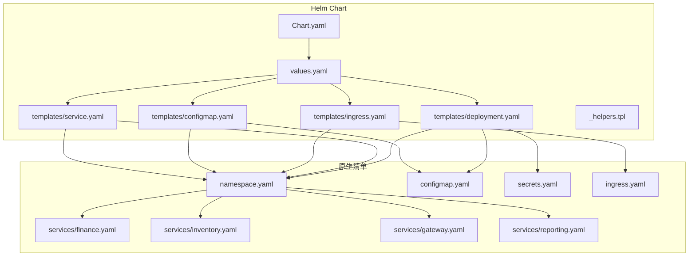
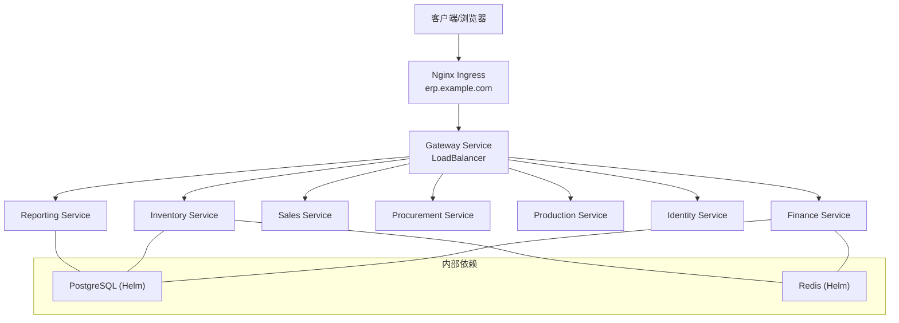
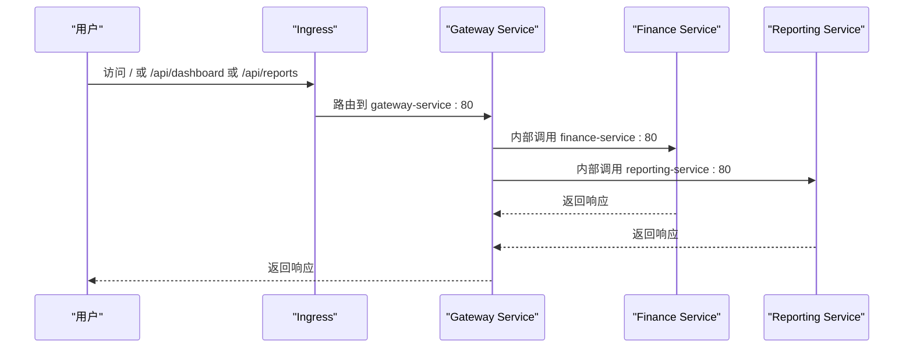
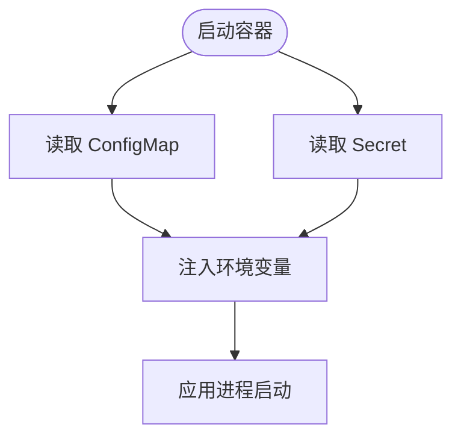
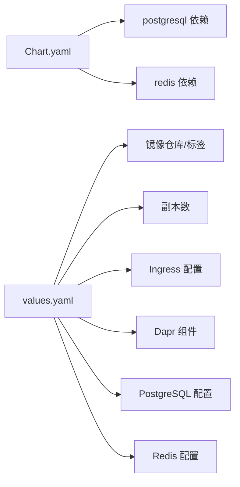

# Kubernetes部署

<cite>
**本文引用的文件**
- [namespace.yaml](file://deploy/k8s/namespace.yaml)
- [configmap.yaml](file://deploy/k8s/configmap.yaml)
- [secrets.yaml](file://deploy/k8s/secrets.yaml)
- [ingress.yaml](file://deploy/k8s/ingress.yaml)
- [values.yaml](file://deploy/helm/erp-system/values.yaml)
- [Chart.yaml](file://deploy/helm/erp-system/Chart.yaml)
- [_helpers.tpl](file://deploy/helm/erp-system/templates/_helpers.tpl)
- [deployment.yaml](file://deploy/helm/erp-system/templates/deployment.yaml)
- [service.yaml](file://deploy/helm/erp-system/templates/service.yaml)
- [ingress.yaml（Helm）](file://deploy/helm/erp-system/templates/ingress.yaml)
- [configmap.yaml（Helm）](file://deploy/helm/erp-system/templates/configmap.yaml)
- [finance.yaml](file://deploy/k8s/services/finance.yaml)
- [inventory.yaml](file://deploy/k8s/services/inventory.yaml)
- [gateway.yaml](file://deploy/k8s/services/gateway.yaml)
- [reporting.yaml](file://deploy/k8s/services/reporting.yaml)
- [deployment.md](file://docs/deployment.md)
</cite>

## 目录
1. [简介](#简介)
2. [项目结构](#项目结构)
3. [核心组件](#核心组件)
4. [架构总览](#架构总览)
5. [详细组件分析](#详细组件分析)
6. [依赖关系分析](#依赖关系分析)
7. [性能考虑](#性能考虑)
8. [故障排查指南](#故障排查指南)
9. [结论](#结论)
10. [附录：kubectl命令行操作指南](#附录kubectl命令行操作指南)

## 简介
本文件面向集群管理员与运维工程师，系统化梳理该ERP微服务在Kubernetes中的部署实践，覆盖命名空间管理、资源配额与网络策略建议、Deployment/StatefulSet/DaemonSet使用场景与配置要点、Service发现与负载均衡、Ingress路由规则、ConfigMap与Secret安全配置、Pod调度策略与亲和性/容忍度、HPA/VPA自动扩缩容、持久化存储与备份策略，以及kubectl命令行操作指引。文档以仓库中现有的Helm Chart与Kubernetes清单为基础，并补充最佳实践与可落地的操作步骤。

## 项目结构
该部署采用“Helm Chart + 原生清单”的双轨方案：
- Helm Chart：集中定义服务清单模板、变量与依赖（PostgreSQL、Redis），统一生成与发布。
- 原生清单：提供独立的命名空间、ConfigMap、Secret、Ingress与各服务的Deployment/Service示例，便于直接应用或理解实现细节。

图表来源
- [Chart.yaml](file://deploy/helm/erp-system/Chart.yaml#L1-L27)
- [values.yaml](file://deploy/helm/erp-system/values.yaml#L1-L127)
- [deployment.yaml](file://deploy/helm/erp-system/templates/deployment.yaml#L1-L58)
- [service.yaml](file://deploy/helm/erp-system/templates/service.yaml#L1-L22)
- [ingress.yaml（Helm）](file://deploy/helm/erp-system/templates/ingress.yaml#L1-L47)
- [configmap.yaml（Helm）](file://deploy/helm/erp-system/templates/configmap.yaml#L1-L20)
- [_helpers.tpl](file://deploy/helm/erp-system/templates/_helpers.tpl#L1-L51)
- [namespace.yaml](file://deploy/k8s/namespace.yaml#L1-L8)
- [configmap.yaml](file://deploy/k8s/configmap.yaml#L1-L25)
- [secrets.yaml](file://deploy/k8s/secrets.yaml#L1-L19)
- [ingress.yaml](file://deploy/k8s/ingress.yaml#L1-L37)
- [finance.yaml](file://deploy/k8s/services/finance.yaml#L1-L66)
- [inventory.yaml](file://deploy/k8s/services/inventory.yaml#L1-L66)
- [gateway.yaml](file://deploy/k8s/services/gateway.yaml#L1-L60)
- [reporting.yaml](file://deploy/k8s/services/reporting.yaml#L1-L64)

章节来源
- [Chart.yaml](file://deploy/helm/erp-system/Chart.yaml#L1-L27)
- [values.yaml](file://deploy/helm/erp-system/values.yaml#L1-L127)
- [deployment.md](file://docs/deployment.md#L1-L115)

## 核心组件
- 命名空间：统一隔离所有资源，便于权限与配额管理。
- 配置管理：通过ConfigMap注入环境变量；敏感信息通过Secret管理。
- 服务网格：启用Dapr，为服务间通信提供状态管理与消息订阅能力。
- 负载均衡：Gateway Service对外暴露为LoadBalancer，内部服务默认ClusterIP。
- 入口网关：Nginx Ingress统一入口，支持路径级路由到不同后端服务。
- 存储：PostgreSQL与Redis由Helm依赖提供，支持持久化卷与认证配置。

章节来源
- [namespace.yaml](file://deploy/k8s/namespace.yaml#L1-L8)
- [configmap.yaml](file://deploy/k8s/configmap.yaml#L1-L25)
- [secrets.yaml](file://deploy/k8s/secrets.yaml#L1-L19)
- [ingress.yaml](file://deploy/k8s/ingress.yaml#L1-L37)
- [values.yaml](file://deploy/helm/erp-system/values.yaml#L100-L123)
- [deployment.yaml](file://deploy/helm/erp-system/templates/deployment.yaml#L22-L26)

## 架构总览
下图展示从外部流量到各业务服务的端到端路径，以及内部依赖（数据库、缓存）：

图表来源
- [ingress.yaml](file://deploy/k8s/ingress.yaml#L1-L37)
- [ingress.yaml（Helm）](file://deploy/helm/erp-system/templates/ingress.yaml#L22-L45)
- [values.yaml](file://deploy/helm/erp-system/values.yaml#L90-L98)
- [finance.yaml](file://deploy/k8s/services/finance.yaml#L24-L33)
- [inventory.yaml](file://deploy/k8s/services/inventory.yaml#L24-L33)
- [reporting.yaml](file://deploy/k8s/services/reporting.yaml#L24-L32)
- [values.yaml](file://deploy/helm/erp-system/values.yaml#L100-L123)

## 详细组件分析

### 命名空间管理
- 使用独立命名空间隔离ERP系统资源，便于权限控制与资源配额划分。
- 建议结合ResourceQuota与LimitRange对CPU/内存进行强制约束，避免资源争用。

章节来源
- [namespace.yaml](file://deploy/k8s/namespace.yaml#L1-L8)

### 资源配额与限制
- Helm values中为通用服务设置了requests/limits，可在values中按服务粒度覆盖。
- 建议在生产环境为每个命名空间配置LimitRange与ResourceQuota，确保公平共享与容量规划。

章节来源
- [values.yaml](file://deploy/helm/erp-system/values.yaml#L11-L19)
- [values.yaml](file://deploy/helm/erp-system/values.yaml#L22-L89)

### 网络策略配置
- 当前清单未包含NetworkPolicy，建议在生产环境添加：
  - 默认拒绝入站，仅允许Ingress与同命名空间服务访问。
  - 对数据库/缓存服务仅放行受信任服务。
  - 为Gateway Service开放对外访问。

章节来源
- [ingress.yaml](file://deploy/k8s/ingress.yaml#L1-L37)
- [service.yaml](file://deploy/helm/erp-system/templates/service.yaml#L13-L19)

### Deployment、StatefulSet、DaemonSet使用场景与配置
- Deployment：适用于无状态服务（如Finance、Inventory、Reporting、Identity等），支持滚动更新与副本数管理。
- StatefulSet：适用于需要稳定网络标识与持久化存储的服务（如数据库、消息队列）。当前项目通过Helm依赖部署PostgreSQL与Redis，若自建数据库可考虑StatefulSet。
- DaemonSet：适用于节点级任务（如日志收集、监控代理），当前项目未见相关需求。

章节来源
- [deployment.yaml](file://deploy/helm/erp-system/templates/deployment.yaml#L1-L58)
- [values.yaml](file://deploy/helm/erp-system/values.yaml#L22-L89)

### Service发现、负载均衡与Ingress路由
- Service类型：
  - 内部服务：ClusterIP（默认），通过服务名与端口访问。
  - Gateway：LoadBalancer，对外暴露HTTP入口。
- Ingress：
  - 支持根路径与/api/dashboard、/api/reports等路径转发至Reporting服务。
  - 可根据values启用TLS与自定义host。

图表来源
- [ingress.yaml](file://deploy/k8s/ingress.yaml#L12-L29)
- [ingress.yaml（Helm）](file://deploy/helm/erp-system/templates/ingress.yaml#L22-L45)
- [service.yaml](file://deploy/helm/erp-system/templates/service.yaml#L13-L19)

章节来源
- [ingress.yaml](file://deploy/k8s/ingress.yaml#L1-L37)
- [ingress.yaml（Helm）](file://deploy/helm/erp-system/templates/ingress.yaml#L1-L47)
- [service.yaml](file://deploy/helm/erp-system/templates/service.yaml#L1-L22)

### ConfigMap与Secret安全配置管理
- ConfigMap：注入环境变量（如ASPNETCORE_ENVIRONMENT、Dapr端口、数据库连接串、服务URL等）。
- Secret：存放敏感数据（如数据库密码、JWT密钥、Redis密码、Dapr API Token）。
- 建议：
  - 生产环境使用KMS加密的Secret或外部密管（如Vault）。
  - 将密码等敏感字段通过Helm参数传入，避免硬编码。

图表来源
- [configmap.yaml](file://deploy/k8s/configmap.yaml#L1-L25)
- [secrets.yaml](file://deploy/k8s/secrets.yaml#L1-L19)
- [configmap.yaml（Helm）](file://deploy/helm/erp-system/templates/configmap.yaml#L1-L20)
- [deployment.yaml](file://deploy/helm/erp-system/templates/deployment.yaml#L37-L41)

章节来源
- [configmap.yaml](file://deploy/k8s/configmap.yaml#L1-L25)
- [secrets.yaml](file://deploy/k8s/secrets.yaml#L1-L19)
- [configmap.yaml（Helm）](file://deploy/helm/erp-system/templates/configmap.yaml#L1-L20)
- [deployment.yaml](file://deploy/helm/erp-system/templates/deployment.yaml#L37-L41)

### Pod调度策略、亲和性与容忍度
- 当前清单未显式配置亲和性与容忍度，建议：
  - 为关键服务配置节点选择器或亲和性，避免跨AZ抖动。
  - 为数据库/缓存服务配置拓扑感知亲和，提升可用性。
  - 在混合工作负载集群中使用容忍度避免污点影响。

章节来源
- [deployment.yaml](file://deploy/helm/erp-system/templates/deployment.yaml#L1-L58)

### 水平Pod自动扩缩容（HPA）与垂直Pod自动扩缩容（VPA）
- HPA：基于CPU/内存利用率或自定义指标对Deployment进行副本扩缩。
- VPA：自动调整Pod请求与限制，减少资源浪费。
- 建议：
  - 为高流量服务（如Gateway、Reporting）开启HPA。
  - 对资源使用波动较大的服务启用VPA。

章节来源
- [values.yaml](file://deploy/helm/erp-system/values.yaml#L11-L19)

### 持久化存储、卷声明与备份策略
- 数据库：通过Helm依赖部署PostgreSQL，启用持久化卷（PVC），建议配置快照与定期备份。
- 缓存：Redis（Helm）可选启用认证与持久化（视场景而定）。
- 备份：建议使用Velero或数据库原生命令备份，配合对象存储归档。

章节来源
- [values.yaml](file://deploy/helm/erp-system/values.yaml#L100-L109)
- [values.yaml](file://deploy/helm/erp-system/values.yaml#L111-L116)

## 依赖关系分析
Helm Chart定义了对PostgreSQL与Redis的依赖，并在values中统一配置镜像、副本数、Ingress与Dapr组件。

图表来源
- [Chart.yaml](file://deploy/helm/erp-system/Chart.yaml#L18-L27)
- [values.yaml](file://deploy/helm/erp-system/values.yaml#L1-L127)

章节来源
- [Chart.yaml](file://deploy/helm/erp-system/Chart.yaml#L1-L27)
- [values.yaml](file://deploy/helm/erp-system/values.yaml#L1-L127)

## 性能考虑
- 合理设置requests/limits，避免突发流量导致OOM或限速。
- 为数据库与缓存预留充足资源，避免成为瓶颈。
- 使用HPA/VPA动态调整资源，降低资源闲置率。
- 启用探针与健康检查，确保快速剔除不健康实例。

## 故障排查指南
- 部署验证：使用kubectl检查Pod、Service、Ingress状态。
- 日志与事件：查看Pod事件与容器日志定位问题。
- 探针失败：检查/liveness与/readiness端点是否可达。
- 网络问题：确认Service选择器匹配、Ingress规则正确、DNS解析正常。

章节来源
- [deployment.md](file://docs/deployment.md#L46-L57)

## 结论
该部署方案通过Helm实现了标准化、可复用的微服务编排，结合Dapr提供服务间通信能力，配合Ingress实现统一入口与路由。建议在生产环境中补充NetworkPolicy、HPA/VPA、资源配额与备份策略，以满足高可用与合规要求。

## 附录：kubectl命令行操作指南
以下命令基于仓库中的部署文档整理，便于快速执行与验证。

- 应用命名空间与基础配置
  - 应用命名空间：kubectl apply -f deploy/k8s/namespace.yaml
  - 应用ConfigMap与Secret：kubectl apply -f deploy/k8s/configmap.yaml,kubectl apply -f deploy/k8s/secrets.yaml
- 应用服务与入口
  - 应用所有服务：kubectl apply -f deploy/k8s/services/
  - 应用Ingress：kubectl apply -f deploy/k8s/ingress.yaml
- Helm安装与升级
  - 更新依赖：helm dependency update deploy/helm/erp-system
  - 安装（默认值）：helm install erp-system deploy/helm/erp-system
  - 自定义安装：helm install erp-system deploy/helm/erp-system --set postgresql.auth.password=xxx,ingress.host=erp.mycompany.com
  - 升级：helm upgrade erp-system deploy/helm/erp-system
- 验证部署
  - 查看Pod：kubectl get pods -n erp-system
  - 查看Service：kubectl get svc -n erp-system
  - 查看Ingress：kubectl get ingress -n erp-system

章节来源
- [deployment.md](file://docs/deployment.md#L12-L76)
- [deployment.md](file://docs/deployment.md#L78-L115)